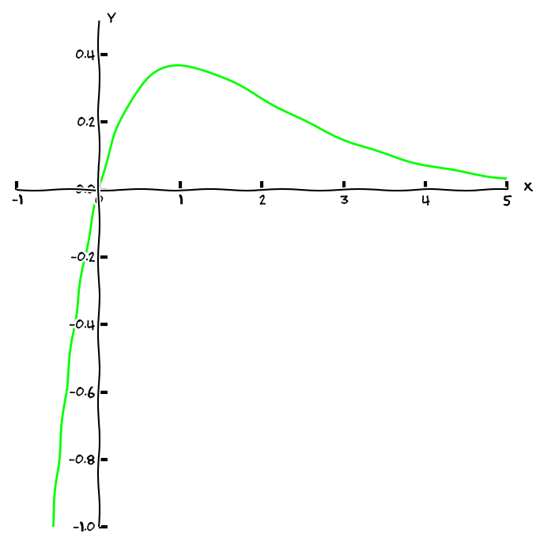

% Derivace funkce více proměnných
% Robert Mařík
% 2020

# Funkce jedné proměnné

\iffalse 

\fi

* Zobrazení $f: \mathbb{R}\to \mathbb{R}$ se nazývá funkce jedné proměnné. 
* V kartézské rovině píšeme též $y=f(x)$, kreslíme uspořádané dvojice bodů $[x,y]$ a výstupem je zpravidla křivka v rovině ([Nakreslit online.](https://sagecell.sagemath.org/?z=eJxL06jQtK3QSq0o0NCt0OTlKsjJL9FQSAOKKugoaFTo6BrqmGgqaAIA3aEKBw==&lang=sage))
* Rychlost změny je derivace:
$$f'(x):=\lim_{h\to 0}\frac{f(x+h)-f(x)}h$$
* Podle kontextu a oborových zvyklostí zapisujeme derivaci pomocí čárky (někdy tečky) nebo jako podíl diferenciálů
$$y', \quad \frac{\mathrm dy}{\mathrm dx}, \quad \frac{\mathrm d}{\mathrm dx}y$$
* rychlost změny změny je druhá derivace: $$y'',\quad  \frac{\mathrm d^2y}{\mathrm dx^2}, \quad\frac{\mathrm d^2}{\mathrm dx^2}y$$

> Poznámka (pohybová rovnice). Při pohybu po přímce je $x=f(t)$ poloha v čase $t$, rychlost je       $\frac{\mathrm dx}{\mathrm dt}$ a zrychlení je $\frac{\mathrm d^2x}{\mathrm dt^2}$. Podle       Newtonova pohybového zákona platí $$m\frac{\mathrm d^2x}{\mathrm dt^2} =F,$$ kde       $F$ je výsledná síla působící na objekt.

> Poznámka (logistický růst populace). Je-li $x(t)$ velikost populace živočíchů, je $\frac{\mathrm dx}{\mathrm dt}$ změna této velikosti za jednotku času. Častým modelem reálné situace je modelování pomocí logistické rovnice       $$\frac{\mathrm dx}{\mathrm dt}=r x (K-x)$$       kdy předpokládáme, že rychlost růstu je úměrná velikosti populace a volné kapacitě prostředí. Konstanta $K$ je celková kapacita prostředí. 

> Poznámka (lineární aproximace, materiálové vztahy). Malá změna $\mathrm dx$ v proměnné $x$ vyvolá změnu $\mathrm dy=f'(x) \mathrm dx$. Proto je možné používat lineární aproximaci funkce $$f(x)\approx f(x_0)+f'(x_0)(x-x_0).  $$       Například naprostá většina materiálových vztahů je takovou aproximací pro $x_0=0$ (relativně malé podněty) a $f(x_0)=0$ (bez podnětu není odezva). Proto jsou zákony jako Fourierův, Fickův nebo Darcyho formulovány ve tvaru přímé úměrnosti. S těmito zákony jste se pravděpodobně seznámili v nauách o materiálu, blíže se jim budeme věnovat později.

# Funkce dvou proměnných, graf

* Zobrazení $f: \mathbb{R}^2\to \mathbb{R}$ se nazývá funkce dvou proměnných.
* Grafem funkce $f$ je množina uspořádaných trojic  $[x,y,z]$, které splňují $z=f(x,y)$ . Graf kreslíme zpravidla jako body v 3D prostoru.
     * [Nakreslit online.](http://user.mendelu.cz/marik/akademie/sagecell.php?short=1&in=%23%20graf%20je%20mo%C5%BEno%20ot%C3%A1%C4%8Det%20a%20p%C5%99ibli%C5%BEovat%20my%C5%A1%C3%AD%0Ay%3Dvar%28%27y%27%29%0Aplot3d%28x%5E2-y%5E2%2C%20%28x%2C-1%2C1%29%2C%20%28y%2C-1%2C1%29%29) (Sage),
     * [Nakreslit online.](http://user.mendelu.cz/marik/akademie/sagecell.php?short=1&lang=python&in=var%28%27y%27%29%0Afrom+sympy.plotting+import+plot3d%0A%0Asurface3D+%3D+plot3d%285*x*y*exp%28-x**2-y**2%29%2C+%28x%2C-2%2C2%29%2C+%28y%2C-2%2C2%29%2C+xlabel%3D%27x%27%2C+ylabel%3D%27y%27%2C+show%3DFalse%29%0Asurface3D.show%28%29) (matplotlib),
     * [Nakreslit online.](http://user.mendelu.cz/marik/yamwi/index.php?in=plot3d%28x%5E2-y%5E2%2C%20%5Bx%2C-1%2C1%5D%2C%20%5By%2C-1%2C1%5D%29%3B) (Maxima + GNUplot)

 

\iffalse 

\fi

Příkladem skalární funkce dvou prostorových proměnných je teplota v určitém okamžiku na dvourozměrném povrchu. Aparát funkcí dvou proměnných se tedy jistě uplatní při studiu tepelných ostrovů souvisejících s urbanizací a kvalitou života ve městech.

Příkladem skalární funkce dvou proměnných, kdy každá z proměnných má
jiný charakter, je teplota ve stěně budovy. Tato teplota se mění s
časem (studená stěna, na kterou začalo svítit slunce, se ohřívá) a s
polohou (vnější a vnitřní okraj stěny mají teplotu přibližně podle
teploty venku a teploty uvnitř budovy, uvnitř stěny se teplota spojitě
mění).

# Parciální derivace

> Definice (parciální derivace). Buď $f\colon \mathbb R^2\to\mathbb R$ funkce dvou proměnných,  $x$ a $y$, tj. $f(x,y)$. Výraz
$$\frac{\partial f}{\partial x}:=\lim_{h\to 0}\frac{f(x+h,y)-f(x,y)}h$$ se nazývá *parciální derivace funkce $f$ podle $x$*. Podobně,
$$\frac{\partial f}{\partial y}:=\lim_{h\to 0}\frac{f(x,y+h)-f(x,y)}h$$ je *parciální derivace funkce $f$ podle $y$*.

Podobně můžeme definovat parciální derivaci pro funkce libovolného
konečného počtu proměnných. V těchto parciálních derivacích vlastně
sledujeme, jak reaguje veličina $f$ na změny jenom v jedné
proměnné. Proměnná, přes kterou se nederivuje, má vlastně roli
parametru a nijak se nemění.

> Poznámka (rozšifrování definice derivace).
>
* Výraz z čitatele, tj. $f(x+h,y)-f(x,y)$, je změna veličiny $f$ na intervalu $[x,x+h]$ při konstantní veličině $y$. Často označujeme též $\Delta f$.
* Podíl, tj. $\frac{f(x+h,y)-f(x,y)}h$ je změna veličiny $f$ na intervalu $[x,x+h]$  při konstantní veličině $y$, přičemž tato změna je přepočítaná na jednotku veličiny $x$, tj. v jistém smyslu průměrná rychlost změny vzhledem k $x$ na intervalu $[x,x+h]$. Často označujeme též $\frac{\Delta f}{\Delta x}$.
* Limita v definici derivace stahuje délku intervalu, na kterém počítáme průměrnou rychlost, k nule. Tím se z průměrné rychlosti stane okamžitá rychlost. Parciální derivace je tedy okamžítá rychlost s jakou se mění funkce $f$ přizměnách jedné proměnné.

Jednotka derivace $\frac{\partial f}{\partial x}$ je stejná, jako jednotka podílu $\frac {f}x$. Jednotka derivace $\frac{\partial f}{\partial y}$ je stejná, jako jednotka podílu $\frac {f}y$.

Derivace $\frac{\partial f}{\partial x}$ udává, jak se mění veličina
$f$ při změnách veličiny $x$ a předpokladu konstantní veličiny
$y$. Interpretace derivace v nematematických disciplínách je okamžitá
rychlost s jakou veličina $f$ reaguje na změny veličiny $x$.

# Rovnice vedení tepla v 1D

Studujme vedení tepla v jednorozměrné tyči. Teplota je funkcí dvou
proměnných, polohy a času. $T=T(x,t)$

> Poznámka (fyzikální okénko). Potřebujeme fyzikální zákony řídící vedení tepla.  Bez nich matematika
model vedení tepla nemá jak naformulovat. Tyto zákony je potřeba matematice dodat "z venku", z aplikované vědy. Tou je v tomto případě fyzika, jindy může být biologie nebo geologie. Jakmile jsou potřebné zákony a případně materiálové vztahy k dispozici, stává se problém čistě matematickým a fyzika přijde ke slovu při závěrečné interpretaci. Použijeme následující fyzikální fakta. 
>
* Rozdílem teplot vzniká tok tepla. Tok tepla je úměrný poklesu 
teploty.
* Teplota se zvyšuje dodáním tepla. Pro zvýšení teploty tělesa o
hmotnosti $m$ o hodnotu $\Delta T$ je nutné dodat $$Q=mc\Delta T,\tag{*}$$ kde
$c$ je měrná tepelná kapacita.
* Budeme vztahy formulovat pro změny za časovou jednotku a pro jednotkový objem (tedy místo hmotnosti $m$, změny teploty $\Delta T$ a tepla $Q$ máme hustotu $\rho$, rychlost změny teploty $\frac{\partial T}{\partial t}$ a rychlost s jakou dodáváme teplo do daného místa vztažená na jednotkový objemu).

\iffalse

\fi

V dalším už nastupuje matematický popis a ve vhodných chvílích vždy
použijeme výše uvedené fyzikální zákony. Mluvíme o teple, ale jako
mechanický model si můžeme představit proudění tekutiny (pro
jednoduchou představu) nebo proudění vlhkosti (pro odvození rovnice
difuze namísto rovnice vedení tepla).

* *Potřebujeme zjistit, kolik tepla za jednotku času přiteče do nějakého bodu a v
tomto bodě "zůstane". Množství, které zůstane, je rozdílem mezi množstvím, které přiteče, a množstvím, které odteče.* Tedy potřebuji vědět, jak se mění tok tepla podél tyče. Rychlost s jakou
roste rychlost toku podél tyče je $\frac{\partial q}{\partial x}$. My pro kladný ohřev
potřebujeme pokles toku tepla, tedy násobíme záporným znaménkem a dostáváme
$-\frac{\partial q}{\partial x}$.
* *Víme, kolik tepla se v daném místě spotřebuje na zvýšení teploty a tuto hodnotu musíme převést na změnu teploty (třetí odrážka). Opět se jedná o jakési překalibrování, které ještě souvisí s dalšími fyzikálními vlastnostmi: měrnou tepelnou kapacitou a hmotností jednotkového objemu látky v daném místě.* Teplo $-\frac{\partial q}{\partial x}$ je teplo, které každou časovou jednotku "zůstává" v
bodě $x$. Toto teplo se "použije" na zvýšení teploty. Z
rovnice (*) pro jednotku času a jednotku objemu dostáváme
$$\rho c\frac{\partial T}{\partial t}=-\frac {\partial q}{\partial x}.\tag{**}$$
* K určení toku $q$ potřebujeme vědět, jak rychle klesá teplota podél tyče. Změny v prostorovém rozložení teploty zachycuje derivace
$\frac{\partial T}{\partial x}$ v jednotkách (například) stupeň Celsia
na centimetr. Přesněji, jedná se o růst teploty. Tok tepla je dán poklesem teploty, tj. výrazem $-\frac{\partial T}{\partial x}$
* *Potřebujeme pokles teploty podél tyče převést na veličinu popisující
  proudění tepla.* Tok tepla je úměrný poklesu teploty, tedy 
  $$q=-k\frac{\partial T}{\partial x}.\tag{***}$$
  Veličina $k$ je konstanta úměrnosti
  umožňující překalibrování změny prostorového rozložení teploty na
  tok tepla jednotkovým průřezem (první odrážka).
* Po dosazení za $q$ do (**) dostáváme
$$\rho c\frac{\partial T}{\partial t}=-\frac{\partial}{\partial x}\left(-k\frac{\partial T}{\partial x}\right).$$
* Derivace konstantního násobku je konstantní násobek
derivace. Veličina $k$ by konstantní být
nemusela a proto ji z opatrnosti necháme na svém místě. Může v ní být nehomogenita nebo se může měnit s teplotou, tj. vztah (***) může být nelineární. Znaménko mínus reprezentuje násobení konstantou $-1$. Toto vede na finální tvar
$$\rho c\frac{\partial T}{\partial t} = \frac{\partial}{\partial x}\left(k\frac{\partial T}{\partial x}\right).$$

**Shrnutí.** V odvození vidíme, že rovnice vedení tepla je vlastně
bilance toku tepla. Rozdíl o kolik se v daném místě snižuje tok tepla
udává, kolik tepla se v daném místě spotřebovalo. Tato spotřeba tepla
se projeví zvýšením teploty v daném bodě.

# Druhá derivace

Druhá derivace je derivace první derivace. U funkce dvou proměnných připadají v úvahu čtyři kombinace. Buď derivujeme pokaždé podle stejné proměnné, tj. 
  $$
\frac{\partial^2 f}{\partial x^2}:=\frac{\partial}{\partial x}\frac{\partial f}{\partial x},\quad 
\frac{\partial^2 f}{\partial y^2}:=\frac{\partial}{\partial y}\frac{\partial f}{\partial y},
$$
nebo pokaždé podle jiné proměnné. Tady existují teoreticky dvě možnosti
$$\frac{\partial }{\partial x}\frac{\partial f}{\partial y},
\frac{\partial}{\partial y}\frac{\partial f}{\partial x}$$
Poději si ukážeme, že tyto dvě možnosti jsou v praxi zpravidla vždy totožné.

Je-li tepelná vodivost $k$ v rovnici vedení tepla 
$$\rho c\frac{\partial T}{\partial t} = \frac{\partial}{\partial x}\left(k\frac{\partial T}{\partial x}\right)$$
konstantní, redukuje se rovnice na rovnici
$$\rho c\frac{\partial T}{\partial t} = k \frac{\partial^2 T}{\partial x^2},$$
ve které figuruje druhá derivace podle polohy.

# Numerická aproximace: konečné diference I

Základním
přístupem při numerickém odhadu derivace je vynechání limitního přechodu v definici derivace. Pro funkci jedné proměnné a její derivaci
$$\frac{\mathrm df}{\mathrm dx}=\lim_{h\to 0}\frac{f(x+h)-f(x)}{h}$$
tedy dostáváme
 $$\frac{\mathrm df}{\mathrm dx}\approx\frac{f(x+h)-f(x)}{h}.$$ Okamžitá rychlost je nahrazena
průměrnou rychlostí na intervalu $(x,x+h).$ Tento podíl se nazývá
*dopředná poměrná diference* nebo zkráceně *dopředná diference*. Pokud
 použijeme tento postup pro parciální derivace, dostáváme
 $$\frac{\partial f}{\partial x}\approx\frac{f(x+\Delta x,y)-f(x,y)}{\Delta x}$$
 a
  $$\frac{\partial f}{\partial y}\approx\frac{f(x,y+\Delta y)-f(x,y)}{\Delta y}$$

# Opakování: Taylorův polynom a polynomiální aproximace v 1D

V diferenciálním počtu funkcí jedné proměnné se zabýváme otázkou hledání nejlepší polynomiální aproximace nějaké funkce. Odpovědí je Taylorův polynom jako nejlepší polynomiální aproximace funkce

> Věta (Taylorova věta pro kvadratickou aproximaci).
> Platí $$f(x+h)=f(x)+\frac {\mathrm df(x)}{\mathrm dx}h+\frac{1}{2!} \frac {\mathrm d^2f(x)}{\mathrm dx^2} h^2+O(h^3),$$ kde $O(h^3)$ je funkce, která v okolí nuly konverguje k nule alespoň tak rychle, jako konstantní násobek funkce $h^3$.

# Numerická aproximace: konečné diference II

Přesnější aproximace derivace vychází z Taylorova polynomu druhého řádu napsaného pro $f(x+h)$ a $f(x-h)$, tj. ze vztahů
$$\begin{aligned}
f(x+h)&\approx f(x)+f'(x)h+\frac 12 f''(x)h^2,\\
f(x-h)&\approx f(x)-f'(x)h+\frac 12 f''(x)h^2.
\end{aligned}$$
Pokud tyto vztahy sečteme a odečteme, dostaneme 
$$\begin{aligned}
f(x+h)+f(x-h)&\approx2f(x)+ f''(x)h^2,\\
f(x+h)-f(x-h)&\approx2f'(x)h.
\end{aligned}$$
Odsud dostáváme aproximace první a druhé derivace
$$ f'(x)=\frac{\mathrm d f}{\mathrm dx}\approx  \frac{f(x+h)-f(x-h)}{2h}  $$
a
$$ f''(x)=\frac{\mathrm d^2f}{\mathrm dx^2}\approx  \frac{f(x-h)-2f(x)+f(x+h)}{h^2}.  $$
Analogicky pro parciální derivaci podle $x$
$$ \frac{\partial f}{\partial x}\approx  \frac{f(x+\Delta x,y)-f(x-\Delta x,y)}{2\Delta x}  $$
a
$$ \frac{\partial^2f}{\partial x^2}\approx  \frac{f(x-\Delta x,y)-2f(x,y)+f(x+\Delta x,y)}{\Delta x^2}.  $$
Tato aproximace první derivace se nazývá *centrální diference* a je přesnější, než dopředná diference, protože je založena na přesnější aproximaci funkce $f$. Používá totiž polynom druhého stupně, kdežto dopředná diference je založena pouze na lineární aproximaci.

# Nutná dávka terminologie

\iffalse 

\fi

V dalším budeme pracovat s pojmy jako množina a její hranice, množina
obsahující hranici, množina neobsahující hranici, spojitá funkce
apod. Ač v technicky nejvýznamnějších aplikacích často můžeme tyto
pojmy chápat intuitivně, historie ukázala, že přesná formální definice
je nezbytná.

V dalším nastane jedna z nejnebezpečnějších situací v matematice, kdy přesně definovanému pojmu dáme název, který lidé znají z prostého života. Například hranice, oblast, spojitost, uzávěr, okolí, ... Podrobný rozbor ukazuje, že tyto definice jsou v jednoduchých případech v souladu s intuicí. 

# Euklidovský metrický prostor

> Definice (metrický prostor, metrika).
  Množina $\mathbb{E}^3$ prvků z $\mathbb{R}^3$ s metrikou $\rho$ definovanou pro
  $A=(a_x,a_y,a_z)\in\mathbb{R}^3$ a $B=(b_x, b_y, b_z)\in\mathbb{R}^3$
  vztahem
  $$
    \rho(A,B)=\sqrt{(a_x-b_x)^2+(a_y-b_y)^2+(a_z-b_z)^2}
  $$
  se nazývá *Euklidovský metrický prostor*. Prvky prostoru
  $\mathbb{E}^3$ budeme nazývat *body*. Funkce $\rho$ se nazývá
  *Euklidovská metrika*. Číslo $\rho(A,B)$ se nazývá
  *Euklidovská vzdálenost* bodů $A$, $B$.

Analogicky je možno definovat metriku v prostoru libovolné konečné dimenze.

> Definice (okolí).
  Buď $A\in \mathbb{E}^n$ bod z $\mathbb{E}^n$ a $\varepsilon>0$ kladné reálné
  číslo. *Epsilonovým okolím bodu $X$* rozumíme množinu
  označenou $O_\varepsilon(A)$ skládající se z bodů, jejichž vzdálenost od
  bodu $A$ je menší než $\varepsilon$, tj.
$$
    O_\varepsilon(A)=\{X\in\mathbb{E}^n:\rho(A,X)<\varepsilon\}.
$$
  *Ryzím epsilonovým okolím bodu $A$* rozumíme množinu
  $\overline O_\varepsilon(A)$ definovanou
  $$
    \overline O_\varepsilon(A)=O_\varepsilon(A)\setminus\{A\},
  $$
  tj. $\varepsilon$-okolí bodu $A$, s vyloučením bodu $A$.

# Významné vlastnosti množin v Euklidovském prostoru

V následujících definicích je $X\in\mathbb{E}^n$ bod a $M\subseteq
\mathbb{E}^n$ podmnožina v Euklidovském prostoru $\mathbb{E}^n$ ($n=2$
nebo $3$). Abstraktně je možno s těmito pojmy pracovat i v prostorech
libovolné konečné dimenze.

**Ohraničená množina**:
  Množina $M$ se nazývá *ohraničená*, jestliže leží
  v (dostatečně velkém) okolí nějakého bodu $Y\in\mathbb{E}^n$.

**Vnitřní bod, vnitřek,  otevřená množina**:
  Bod $X$ se nazývá *vnitřním bodem množiny $M$*, jestliže
  $X\in M$ a existuje nějaké okolí $O(X)$ bodu $X$ ležící celé
  v množině $M$, tj. $O(X)\subseteq M$. Množina všech vnitřních
  bodů množiny $M$ se nazývá \textit{vnitřek množiny $M$} a
  označuje $M^o$. Je-li množina $M$ totožná se svým vnitřkem, tj.
  je-li každý bod množiny $M$ vnitřní, říkáme, že množina $M$ je
  *otevřená*.

**Hraniční bod,  hranice**:
  Bod $X$ se nazývá *hraničním bodem množiny $M$*, jestliže
  každé okolí bodu $X$ obsahuje alespoň jeden bod ležící v množině $M$
  a současně alespoň jeden bod neležící v množině $M$. Množina všech
  hraničních bodů množiny $M$ se nazývá *hranice množiny $M$*
  a označuje $\partial M$.

**Uzávěr,  uzavřená množina**:
  *Uzávěrem množiny $M$* rozumíme množinu $\overline M$
  definovanou jako sjednocení vnitřku a hranice množiny $M$,
  tj. $\overline M=M^o\cup\partial M$. Je-li množina totožná se svým
  uzávěrem (tj. obsahuje-li všechny své hraniční body), nazývá se
  *uzavřená*.

**Souvislá množina**:
  Množina $M$ se nazývá souvislá, jestliže každé dva body, ležící
  v množině $M$ lze spojit lomenou čarou, ležící v $M$.

**Oblast, uzavřená oblast,  kompaktní množina**:
   Otevřená souvislá množina se nazývá *oblast*. Uzavřená
  souvislá množina se nazývá *uzavřená oblast*. Uzavřená
    ohraničená  množina se nazývá *kompaktní*.

# Spojitost funkce

\iffalse 

\fi

**Spojitost skalární funkce**:
  Nechť $f:\mathbb{R}^n\to \mathbb{R}$ je skalární funkce $n$ proměnných definovaná
  v nějakém okolí bodu $A\in\mathbb{R}^n$. Řekneme, že funkce $f$ je v bodě
  $A$ *spojitá*, pokud pro každé okolí $O(f(A))$ bodu $f(A)$ existuje
  okolí $\overline O(A)$ bodu $A$ takové, že obrazy všech bodů
  z tohoto okolí bodu $A$ leží v okolí bodu $O(f(A))$, tj.  pro
  všechna $X\in \overline O(A)$ platí $f(X)\in O(f(A))$.

**Spojitost vektorové funkce**:
  Nechť $f:\mathbb{R}^n\to \mathbb{R}^m$ je vektorová funkce $n$ proměnných definovaná
  v nějakém okolí bodu $A\in\mathbb{R}^n$. Řekneme, že funkce $f$ je v bodě
  $A$ *spojitá*, jestliže je v tomto bodě spojitá každá její komponenta.

**Elementární funkce**: 
  Všechny mnohočleny, goniometrické, cyklometrické, exponenciální a
  logaritmické funkce a obecná mocnina se nazývají *základní
    elementární funkce* 
  Všechny funkce, které ze základních
  elementárních funkcí získáme konečným počtem operací sčítání,
  odečítání, násobení, dělení a skládání těchto funkcí navzájem se
  nazývají *elementární funkce*.

\iffalse

Elementární funkce jsou tedy všechny funkce, které umíme v konečném
  tvaru vyjádřit explicitním vzorcem za použití funkcí známých ze
  střední školy a cyklometrických funkcí.

Elementární neznamená jednoduchý. 
Funkce $$f(x,y)=\frac{x^2+\sin(x^2-y^2)}{\ln(x^2+y^2-1)},\quad g(x,y)=\frac{1}{1+\frac x{1+\frac {y}{x^2}}} $$ jsou elemenárními funkcemi ve smyslu výše uvedené definice. Funkce $$h(x,y)=\begin{cases} 1 & x=0 \text{ nebo }y=0\\0 &\text{jinak}\end{cases}$$ není elementární funkce.

Následující věta ukazuje, že u elementárních funkcí je spojitost v
libovolném bodě zaručena již tím, že je funkce v tomto bodě
definována.

\fi

> Věta (spojitost elementárních funkcí). Všechny [elementární funkce](http://cs.wikipedia.org/wiki/Elementární_funkce}) jsou spojité v každém vnitřním bodě svého definičního oboru.

# Schwarzova věta

> Věta (Schwarzova). Jsou-li smíšené derivace spojité na otevřené množině, jsou zde stejné, tj. platí  $$ \frac{\partial }{\partial x}   \frac{\partial f}{\partial y}= \frac{\partial }{\partial y}   \frac{\partial f}{\partial x}.$$

\iffalse 

\fi

Vzhledem k této větě existují jenom tři druhé parciální derivace. Je tedy bezpečné psát
  $$
\frac{\partial^2 f}{\partial x^2},\quad 
\frac{\partial^2 f}{\partial x \partial y},\quad 
\frac{\partial^2 f}{\partial y^2},
$$
nebo
$$f''_{xx},\quad f''_{xy},\quad f''_{yy}.$$

# Interpretace parciálních derivací - brzdná dráha

\iffalse 

\fi

*Příklad:* Brzdná dráha $L$ (v metrech) auta o hmotnosti $m$ (v kilogramech) brzdícího z rychlosti $v$ (v kilometrech za hodinu) je dána vzorcem
$$L=k m v^2, $$ kde $k= 3.45 \times 10 ^{-6}\,(\mathrm{m}\,\mathrm{hod}^2)/(\mathrm{kg}\,\mathrm{km}^2)$. Pro $m=1100\,\mathrm{kg}$ a $v=100\,\mathrm{km}/\mathrm{hod}$ je brzdná dráha $37.95\,\mathrm{m}$.

* Parciální derivace podle $m$ je $\frac{\partial L}{\partial m}=kv^2$
  a pro zadané hodnoty vychází
  $$\frac{\partial L}{\partial m}=0.0345 \mathrm{m}/\mathrm{kg}.$$
  Každý kilogram hmotnosti nad $1100\,\mathrm{kg}$ auta jedoucího
  rychlostí $100\,\mathrm{km}/\mathrm{hod}$ prodlouží brzdnou dráhu o
  cca $3.5\,\mathrm{cm}$.
* Parciální derivace podle $v$ je $\frac{\partial L}{\partial v}=2kmv$
  a pro zadané hodnoty vychází
  $$\frac{\partial L}{\partial v}=0.759\,\mathrm{m}/(\mathrm{km}/\mathrm{hod})=7.59\times 10^{-4}\,\mathrm{hod}.$$
  Každý kilometr za hodinu nad $100\,\mathrm{km}/\mathrm{hod}$ u auta
  vážícího $1100\,\mathrm{kg}$ prodlouží brzdnou dráhu o cca
  $76\,\mathrm{cm}$.
* Zjednodušený vzorec pro brzdnou dráhu auta s hmotností blízkou
  $1100\,\mathrm{kg}$ a rychlostí blízkou
  $100\,\mathrm{km}/\mathrm{hod}$ je
$$L\approx 37.95+0.0345(m-1100)+0.759(v-100),$$
kde hmotnost a rychlost se dosazují v kilogramech a kilometrech za hodinu a brzdná
dráha vychází v metrech.
 
\iffalse

[Online výpočet.](https://sagecell.sagemath.org/?z=eJzL1lHI1SmzLUss0lDPVshVKFPX5OXKyE_Jyy-ptNWozrYy1jMx1TI0iNPQNdPUybUyNDQw0CmzApK1QIU-ttlauVplcUZApgZUl6ZecUZ-uQZQFkxH--ilZKalaeRq6sBZcKWx6KrK4KrKUFUBAMMQMSg=&lang=sage)

\fi

# Interpretace parciálních derivací - pohyb ještěrky

\iffalse

\fi

Energie $E$ (v kcal), kterou spotřebuje ještěrka o hmotnosti $m$ (v
gramech) na překonání vzdálenosti jednoho kilometru rychlostí $v$ (v
kilometrech za hodinu) se dá odhadnout vzorcem
$$E(m,v)=2.65 m^{0.66} + \frac{3.5 m^{0.75}}{v}.$$
Přímým výpočtem je možné určit
$$\frac{\partial E}{\partial v}=-\frac{3.5 m^{0.75}}{v^2}.$$ Pro $m=400\,\mathrm{g}$ a $v=8\,\mathrm{km}\,\mathrm{h}^{-1}$ dostáváme
$$\frac{\partial E}{\partial v}(400,8)=-4.9\,\mathrm{kcal}\,\mathrm{km}^{-1}\mathrm{h}.$$ Zvýšení rychlosti o kilometr za hodinu vede ke snížení energetického výdeje ještěrky o $4.9\,\mathrm{kcal}$. Podobně, platí
\dm $$\frac{\partial E}{\partial m}={2.65}\times 0.66 {m^{-0.34}} + \frac{3.5\times 0.75 m^{-0.25}}{v}= \frac{1.749}{m^{0.34}} + \frac{2.625}{m^{0.25} v} $$
a pro výše uvažované hodnoty dostáváme
$$\frac{\partial E}{\partial m}(400,8)=
0.30\,\mathrm{kcal}\,\mathrm{g}^{-1}.
$$
Každý gram, který má ještěrka navíc oproti hmotnosti $400$ gramů, zvedne energetický výdej přibližně o $0.30\,\mathrm{kcal}$.

[Online výpočet.](https://sagecell.sagemath.org/?z=eJwrSyzSUM9VKFPX5OVytTXSMzPVyo0z0DMzU9BWMNYzVQDzzE31y3i5Cooy80oUXDVybU0MDHTKbC004WJ6KZlpaRplmrjlcpHlANRDHpQ=&lang=sage)

(Zpracováno podle Stewart: Biocalculus)

