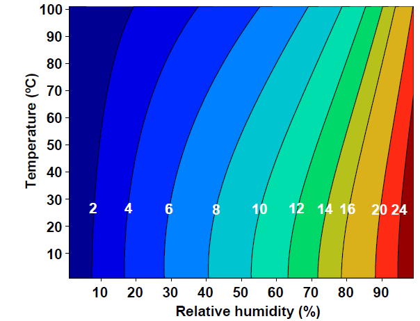
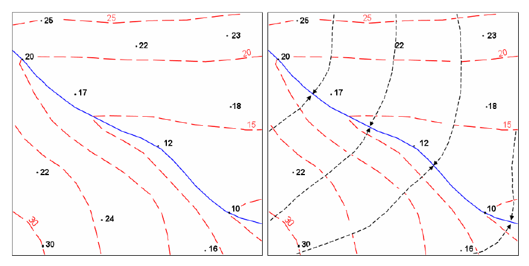
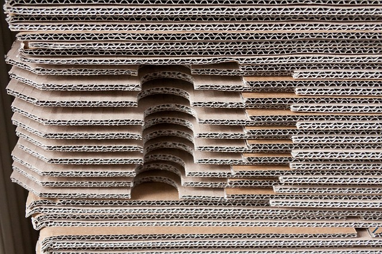
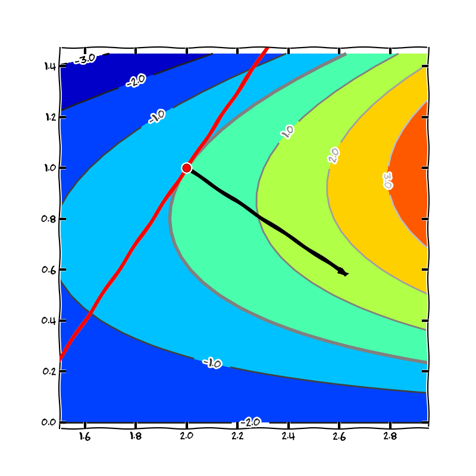
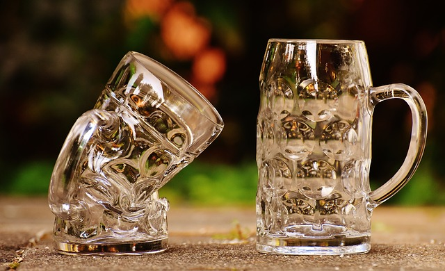

% Gradient, lineární aproximace
% Robert Mařík
% 2020,2021, 2022

> Anotace.
>
> * Umíme pomocí derivace najít rychlost, s jakou se mění veličina, která je objektem našeho zájmu. V této přednášce se zaměříme na prakticky nejlépe využitelný případ, kdy budeme sledovat závislost na prostorových proměnných. 
> * Aparát představený v této přednášce má smysl zejména ve dvourozměrném a trojrozměrném světě. Budeme schopni sledovat, v jakém směru veličina roste a klesá maximální rychlostí. Tato veličina v mnoha případech determinuje rychlost s jakou probíhají fyzikální procesy typu difuze nebo vedení tepla. 
> * Obecněji tento aparát slouží k lineární aproximaci funkce. Naučíme se lineární aproximaci použít i pro vektorové funkce. To nám umožní formulovat fyzikální zákony dávajících do souvislosti tok a gradient veličiny (spád veličiny) i v případě, kdy tyto vektory nemají stejný směr. Bez této dovednosti se neobjedeme, chceme-li realisticky popsat vlastnosti anizotropních materiálů. Při této příležitosti zjistíme, že některé fyzikální veličiny mají při vyjádření v souřadnicích podobu matic. Zpravidla na ně odkazujeme jako na tenzorové veličiny.
> * Jako vedlejší produkt slouží gradient k nalezení lokální extrémů funkce.

> Prerekvizity.
>
> * Navážeme na znalosti parciálních derivací z minulé přednášky.
> * Pro efektivní formulaci využijeme maticový součin. Ten většina studentů pozná v úvodních přednáškách z matematiky. Například [zde](http://user.mendelu.cz/marik/mtk/mat-slidy/matice/).
> * Před snahou o lineární aproximaci funkce více proměnných je vhodné si zopakovat [lineární aproximaci funkce jedné proměnné.](http://user.mendelu.cz/marik/mtk/mat-slidy/derivace_II/)

# Opakování

\iffalse

\fi

## Vrstevnice

* Pro funkci dvou proměnných jsou vrstevnice křivky, které spojují místa se stejnou funkční hodnotou. 

##  Geometrie

* Skalární součin dvou vektorů je definován vztahem $$(u_1,u_2)\cdot (v_1,v_2)=u_1v_1+u_2v_2.$$ Pro kolmé vektory je skalární součin nulový. Má-li jeden z vektor jednotkovou délku, je skalární součin průmětem druhého vektoru do směru daného uvažovaným jednotkovým vektorem. 

## Lineární algebra

manimp:MatrixMultiplication|Maticové násobení.

* Součin matice a vektoru je lineární kombinace sloupců matice, přičemž koeficienty této kombinace jsou složky vektoru. Viz následující příklad. $$\begin{pmatrix}2 & 1\\-1 &3 \end{pmatrix} \begin{pmatrix}2\\3\end{pmatrix} = 2\begin{pmatrix}2\\-1\end{pmatrix} + 3\begin{pmatrix}1\\3\end{pmatrix} = \begin{pmatrix}7\\7\end{pmatrix}$$
* Matice je možno chápat jako zobrazení mezi vektorovými prostory. Vektor můžeme pomocí matice zobrazit na jiný vektor. Zachovávají se přitom důležité vlastnosti, jako se přitom rovnoběžnost a poloha středu úsečky.
* Matice je možno použít pro přepočet vektorů a tenzorů do jiné soustavy souřadnic. 
* Pokud se vektor zobrazí na svůj násobek, nazývá se vlastní vektor a tento násobek je vlastní číslo. $$A\vec v=\lambda \vec v$$
* Matice s vlastními vektory se směru souřadných os je diagonální. Skutečně, například použitím definice maticového součinu a použitím definice vlastního vektoru a čísla dostáváme $$\begin{pmatrix}a &  b\\c &d \end{pmatrix} \begin{pmatrix}1\\0\end{pmatrix} = \begin{pmatrix}a\\c\end{pmatrix}\quad\text{a}\quad \begin{pmatrix}a &  b\\c &d \end{pmatrix} \begin{pmatrix}1\\0\end{pmatrix}=\lambda \begin{pmatrix}1\\0\end{pmatrix}.$$ To si vynutí $c=0$. Podobně bychom dostali pro vektor ve směru druhé osy $b=0$.

# Diferenciální operátory

Parciální derivace se vyskytují ve většině důležitých rovnic popisujících fyzikální svět okolo nás. Vztahy ze středoškolské fyziky nebo tabulek pro inženýry jsou jenom důsledky odvozené pro hodně speciální situace. Všude tam, kde se zajímáme o fyzikální podstatu děje a máme ambice popsat děj přesně, nestačí středoškolský aparát, protože je nutné pracovat s okamžitou rychlostí změn fyzikálních veličin. A tyto jsou vyjádřeny právě parciálními derivacemi. 

Parciální derivace umožňují sledovat závislost stavových veličin v závislosti na souřadnicích nebo čase, a to pro každou souřadnici samostatně. Nicméně souřadný systém je něco, co do popisu vnášíme uměle a proto by fyzikální proces neměl být na tomto souřadném systému závislý. *Proto často spojujeme parciální derivace do složitějších výrazů -- diferenciálních operátorů. Zde teprve vynikne síla parciálních derivací.*

# Gradient

https://youtu.be/9RwaJnV5TUs

> Definice (gradient). *Gradient* skalární funkce dvou proměnných $f(x,y)$ je vektorové pole označené a definované následovně.
  $$\nabla f=\left(\frac{\partial f}{\partial
  x}, \frac{\partial f}{\partial y}\right)$$
Podobně je definován gradient skalární funkce tří proměnných $f(x,y,z)$.
  $$\nabla f=\left(\frac{\partial
  f}{\partial x}, \frac{\partial f}{\partial y},
  \frac{\partial f}{\partial z}\right)$$

Význam a postavení gardientu ilustruje následující příklad, který je poté zobecněn do poznámky shrnující fyzikální význam gradientu.

**Příklad.** Pokud je teplota v rovině v bodě $(x,y)$ dána předpisem $$T=(x^2-xy^2)^\circ\mathrm C,$$ je gradientem vektor $$\nabla T=\begin{pmatrix}2x-y^2, -2xy\end{pmatrix} {}^\circ\mathrm C \mathrm m^{-1}.$$ V bodě $(1,1)$ je gradient $$\nabla T(1,1)=\begin{pmatrix}1,-2\end{pmatrix}{}^{\circ}\mathrm C \mathrm m^{-1}.$$ To znamená, že v tomto bodě roste teplota ve směru osy $x$ rychlostí jeden stupeň Celsia na každý metr délky a ve směru osy $y$ klesá rychlostí dva stupně Celsia na každý metr délky. Vektor definovaný tímto gradientem má směr doprava dolů (pod úhlem splňujícím podmínku $\tan \varphi = -2$) a délku $\sqrt{(1)^2+(-2)^2}=\sqrt 5\approx 2.2$. To znamená, že maximální nárůst teploty je směrem doprava dolů a tento nárůst je $2.2$ stupně Celsia na každý metr délky.

> Poznámka (fyzikální význam gradientu). Gradient skalární veličiny $f$ je vektorová veličina, která vyjadřuje směr a intenzitu maximálního růstu veličiny $f$. Přesněji, výsledkem gradientu je vektor ve směru maximálního růstu veličiny $f$. Délka tohoto vektoru je nárůst veličiny $f$ na intervalu jednotkové délky. Pro rovnoměrně rozloženou veličinu  v prostoru (konstantní) je gradient nulový. Proto je možné gradient chápat jako míru nerovnoměrného rozložení veličiny v prostoru. Řada fyzikálních dějů probíhá tak, že tato nerovnoměrnost vyvolá proudění, které se snaží tuto nerovnoměrnost vyrovnat. Například vedení tepla vyrovnává nerovnoměrné rozložení teploty a difuze vyrovnává nerovnoměrnosti v koncentraci. Teplota se vyrovnává tak, že teplo teče z místa s vysokou teplotou do místa s malou teplotou. Difuze směřuje  z místa s vyšší koncentrací do místa s nižší koncentrací. V praxi nás proto většinou místo směru maximálního růstu zajímá směr maximálního poklesu, tj. $-\nabla f$.

\iffalse

\fi

Symbol $\nabla$ je operátor nabla definovaný formálně vztahem $$\nabla=\left(\frac{\partial}{\partial x}, \frac{\partial}{\partial y}, \frac{\partial}{\partial z}\right)$$ nebo $$\nabla=\left(\frac{\partial}{\partial x}, \frac{\partial}{\partial y}\right)$$ (v závislosti na počtu proměnných funkce $f$). "Násobení" $\frac{\partial }{\partial x}$ s\ funkcí $f$ přitom chápeme jako parciální derivaci $\frac{\partial f}{\partial x}$.

Někdy je vhodné formulovat fyzikální zákony pomocí prostředků lineární algebry, zejména pomocí maticového součinu. V takovém případě gradient zapisujeme jako sloupcový vektor. 
  
Gradient úzce souvisí s vrstevnicemi, s křivkami, které spojují místa se stejnou funkční hodnotou funkce dvou proměnných. Někdy místo pojmu vrstevnice používáme výraz, který obsahuje i povahu sledované veličiny, například se používají názvy jako izotermy, izobary, hydroizopsy, hydroizopiezy atd. Pro funkce tří proměnných máme plochy spojující místa se stejnou funkční hodnotou ekvipotenciální plochy.
Gradient je v každém bodě kolmý k vrstevnici (ve 2D) resp. k ekvipotenciální ploše (ve 3D). [Nakreslit online.](https://sagecell.sagemath.org/?z=eJxlj71uwyAUhfdIfgcU2TKk5Mdupip0TFdPnapY1IaYFoMFJDV5-hLbUVKVAbjncr_D4bDHHpH-kC_8sl_4w3M0a9mF9SQ0MrxFY-kJ9HiZ4TzUjaS1UJ5sN9HMNvoHNq6VcL5r8td3Yx07K1ExQMHRhHdMud06dMD-pL4r9gJiwEdLkFgQzxMgqWM9HMWwotkj1aRvEyVMfij6KeltHiYWJxbFaQIfEata8HBDCIP_8uAwWBSk0srpkyk7qR3keAg97B6DqWfJlDUoLe1I-sVcigEXUpI9lZahK6h4uiLKM6ucNiUXTNaQr27pIVorbdo_SvjbaDcc_p65uMKPVlwYyTYYUNsFaGmoE5pk6BegT4aw&lang=sage)

> Poznámka (linearita gradientu). Gradient zachovává součet a násobení konstantou, tj. pro libovolné funkce $f$ a $g$ a konstantu $c$ platí
> $$\nabla (f+g)=\nabla f +\nabla g, \qquad \nabla (cf)=c\nabla f.$$

# Gradient v přírodě

https://youtu.be/Mpb4EAdIPPM

\iffalse 

\fi

* V matematice se gradientem rozumí vektor z parciálních derivací podle všech proměnných. V aplikacích tomu bývá poněkud jinak. Často je funkce popisující studovaný systém funkcí času i prostorových proměnných. V takovém případě gradientem rozumíme vektor složený jenom z parciálních derivací podle prostorových proměnných. Čas při výpočtu gradientu za proměnnou nepovažujeme.
* V jednorozměrném případě je gradient totéž co derivace. Přesto se někdy z tradičních důvodů respektujících zvyklosti oboru nemluví o derivaci, ale o gradientu. Například mluvíme o gradientu teploty při studiu *tepelně izolačních vlastností* materiálů. Pokud máme na mysli vrstvu z jednoho materiálu (a ne například sendvičovou stěnu), je rozložení teploty lineární a dokonce v tomto případě pojmem gradient vlastně označujeme směrnici přímky.
* S gradientem souvisí *majáková navigace* při migraci živočichů. Ti sledují určitý chemický podnět a pohybují se ve směru největšího růstu tohoto podnětu. Tedy ve směru gradientu. Například žralok ve vodě takto sleduje koncentraci krve. 
* Pokud se zajímáme nejenom o směr, ale i velikost gradientu, pomůže nám velikost gradientu k posouzení rychlosti změny  veličiny v\ prostoru (gradient je velký, jestliže se funkce mění rychle a jsou-li tím pádem vrstevnice nahusto).
* Při proudění podzemní vody sledujeme hydroizohypsy, křivky spojující místa se stejnou hladinou podzemní vody nebo obecněji se stejnou piezometrickou výškou. Tok vody je v homogenním prostředí kolmý na tyto křivky a intenzivní podle hustoty křivek. Zjednodušeně řečeno, i podzemní voda má snahu téct "z kopce", ale "z kopce" je ve smyslu nejrychlejšího poklesu piezometrické výšky. Anizotropní prostředí tento tok může odklánět do směru, ve kterém půda klade toku podzemní vody menší odpor. Podobně jako dřevo stáčí tok tepla nebo vlhkosti do podélného směru.
<!-- * *Síla* ($\vec F$) působící na těleso v silovém poli ve kterém je možno zavést potenciální energii ($V$) je gradientem potenciální energie vynásobeným faktorem $-1$ (záporně vzatý gradient). -->
<!-- $$\vec F=-\nabla V$$ -->
<!-- Pro jednorozměrnou úlohu a těleso v potenciálové jámě (tj. v rovnovážném stavu, kdy je minimum potenciální energie) můžeme potenciál v okolí minima aproximovat pomocí Taylorova rozvoje $$V(x)\approx V_0+\frac 12 V''(0)x^2+\cdots $$ (souřadnice volíme tak, že toto minimum je pro $x=0$) a je-li $|xV'''(0)|\ll V''(0)$, potom -->
<!-- $$\vec F=-\nabla V=-V''(0)x=-kx.$$ To znamená, že síla je úměrná výchylce, stejně jako u tělesa na pružině. Podobně ve vícerozměrném případě. -->

# Lineární aproximace

Z diferenciálního počtu funkcí jedné proměnné víme, že platí přibližný vzorec $$f(x)\approx f(x_0)+f'(x_0)(x-x_0).$$ Tento vzorec rozšíříme do světa funkcí více proměnných a do světa vektorových funkcí.

https://youtu.be/3wTwWTtbkis

## Lineární aproximace skalární funkce

* Lineární aproximací funkce $z=f(x,y)$ v bodě $(x_0, y_0)$ je
\dm $$      f(x,y)\approx f(x_0, y_0)+\frac{\partial f (x_0,y_0)}{\partial x}(x-x_0)+\frac{\partial f (x_0,y_0)}{\partial y}(y-y_0)$$
nebo (vyjádřeno pomocí skalárního součinu a gradientu)
$$      f(x,y)\approx f(x_0, y_0)+ \nabla f(x_0,y_0)\cdot (x-x_0,y-y_0).$$
* Tečná rovina ke grafu funkce $z=f(x,y)$ vedená bodem
  $[x_0,y_0,z_0]$, kde $z_0=f(x_0,y_0)$ má rovnici
  $$z=z_0+\frac{\partial f (x_0,y_0)}{\partial x}(x-x_0)+\frac{\partial f (x_0,y_0)}{\partial y}(y-y_0),$$
nebo (vyjádřeno pomocí gradientu)
$$      z= z_0+ \nabla f(x_0,y_0)\cdot (x-x_0,y-y_0).$$

## Lineární aproximace vektorové funkce

Lineární aproximací vektorové funkce je lineární aproximace jednotlivých komponent. To jsou skalární funkce a je na ně možné aplikovat postup z předchozího bodu. Tedy pro funkci $\vec F(x,y)=f_1(x,y)\vec \imath + f_2(x,y)\vec\jmath$ máme v bodě $(x_0, y_0)$ lineární aproximace
\dm $$      f_1(x,y)\approx f_1(x_0, y_0)+\frac{\partial f_1 (x_0,y_0)}{\partial x}(x-x_0)+\frac{\partial f_1 (x_0,y_0)}{\partial y}(y-y_0)$$
a
\dm $$      f_2(x,y)\approx f_2(x_0, y_0)+\frac{\partial f_2 (x_0,y_0)}{\partial x}(x-x_0)+\frac{\partial f_2 (x_0,y_0)}{\partial y}(y-y_0).$$
Tyto dva vztahy je možné zapsat jako jeden vektorový vztah ve tvaru 
\dm$$\begin{pmatrix}f_1(x,y)\\f_2(x,y)\end{pmatrix} \approx  \begin{pmatrix}f_1(x_0,y_0)\\f_2(x_0,y_0)\end{pmatrix} + \begin{pmatrix} \frac{\partial f_1}{\partial x}(x_0,y_0) \\\frac{\partial f_2}{\partial x}(x_0,y_0) \end{pmatrix} (x-x_0)+ \begin{pmatrix}  \frac{\partial f_1}{\partial y}(x_0,y_0)\\ \frac{\partial f_2}{\partial y}(x_0,y_0)\end{pmatrix} (y-y_0).
$$
Tento vektorový vztah je možné zapsat s použitím maticového součinu místo lineární aproximace. Tím získáváme vztah ve tvaru
\dm$$\begin{pmatrix}f_1(x,y)\\f_2(x,y)\end{pmatrix} \approx  \begin{pmatrix}f_1(x_0,y_0)\\f_2(x_0,y_0)\end{pmatrix} + \begin{pmatrix} \frac{\partial f_1}{\partial x}(x_0,y_0) & \frac{\partial f_1}{\partial y}(x_0,y_0)\\\frac{\partial f_2}{\partial x}(x_0,y_0) & \frac{\partial f_2}{\partial y}(x_0,y_0)\end{pmatrix} \begin{pmatrix}x-x_0\\ y-y_0\end{pmatrix}.
$$
Po přeznačení dostáváme  
$$\vec F(x,y)\approx \vec F(x_0,y_0) + J(x_0,y_0)  \begin{pmatrix}x-x_0\\ y-y_0\end{pmatrix},$$
kde 
$$J(x,y)=\begin{pmatrix} \frac{\partial f_1}{\partial x}(x ,y ) & \frac{\partial f_1}{\partial y}(x ,y )\\\frac{\partial f_2}{\partial x}(x ,y ) & \frac{\partial f_2}{\partial y}(x ,y )\end{pmatrix}$$
je Jacobiho matice funkce $\vec F$. 

V materiálovém inženýrství často provádíme linearizaci v okolí nuly a pro funkci, která je v nule nulová. Tedy máme $x_0=y_0=\vec F(0,0)=0$. Výsledná lineární aproximace se poté redukuje na tvar $$\vec F(x,y)\approx J(0,0)
\begin{pmatrix}x\\ y\end{pmatrix}.$$ 

# Vícerozměrné konstitutivní zákony

https://youtu.be/uTzCAxOOye8

manim:Eigenvectors|vfzT25D6Zz8|Připomenutí vlastních směrů matice

manim:Flow|PzFh8f9Qzf8|Tok v anizotropních materiálech je ve směru opačném než gradient jenom v případě, že se jedná o vlastní směr. 

Konstitutivní vztahy tvoří z hlediska materiálového inženýrství jednu z nejdůležitějších aplikací gradientu. Tyto vztahy dávají do vzájemné relace gradient stavové veličiny, pomocí níž charakterizujeme stav studovaného objektu, a tok, který se snaží zahladit nerovnoměrnost v rozložení stavové veličiny. Například při nerovnoměrném rozložení koncentrace látky se tato koncentrace vyrovnává difuzním tokem. Při nerovnoměrném rozložení vnitřní energie v systému se tato nerovnoměrnost navenek projevuje rozdílnými teplotami v různých částech tělesa a vyrovnává tokem tepla. Při různých piezometrických hladinách podzemní vody (hladina podzemní vody se započtením případného tlaku a dalších parametrů majících vliv na proudění vody) se tato nerovnoměrnost vyrovnává prouděním podzemní vody. 

Zákony uvedené níže byly často odvozeny v jednorozměrném případě. V moderní formulaci používáme obecný vektorový zápis, který zohledňuje i směr. Zpravidla je možné použít pro tento konstitutivní vztah lineární aproximaci a proto se vlastně jedná o násobení vektoru maticí. Tato matice umožní nejenom změnit délku vektoru a jeho jednotku, ale i směr. Matice se navíc při změně báze transformuje speciálním způsobem, tak jako vektory. Takové objekty nazýváme **tenzory**. Níže budeme pojmem tenzor rozumět matici $3\times 3$ nebo $2\times 2$, podle kontextu. (Obecněji je možno považovat skalární veličiny a vektory za tenzory nižších řádů, toto my však dělat
nebudeme.)

**Aby měly konstitutivní vztahy níže smysl, uvažujeme v nich gradient jako sloupcový vektor.** 

## Fickův zákon (difuze)

V roce 1855 německý lékař A. Fick objevil, že difuzní tok $\vec J$
(množství látky které projde při difuzi jednotkovou plochou za
jednotku času) je úměrný gradientu koncentrace $c$ této
látky. Vyjádřeno moderní terminologií to znamená, že platí
$$\vec J=-D\nabla c. $$
Veličina $D$ se nazývá difuzní koeficient. Pokud má $\vec J$ stejný
směr jako $\nabla c$, je $D$ skalární veličina. Pokud směry nejsou
stejné, je $D$ tenzor. Z fyzikálních důvodů je tenzor $D$ symetrický.

Difuzí se například dřevo zbavuje vlhkosti při vysoušení.

## Darcyho zákon (proudění podzemní vody)

\iffalse

 infiltruje vodu do podzemí. Pro funkci je nezbytná znalost toho, co se tam s vodou děje a kudy a jak teče. Základním zákonem pro popis tohoto děje je Darcyho zákon. Zdroj: nase-voda.cz, Nina Havlová](karany.jpg)

\fi

V letech 1855 a 1856 francouzský inženýr H. Darcy pokusy prokázal přímou úměru mezi rozdílem tlaků na koncích trubice naplněné porézní zeminou (jednalo se vlastně o rozdíl výšek pro šikmou trubici) a rychlostí proudění vody touto trubicí. Pro tok podzemní vody je vhodné rozdíl tlaků vyjadřovat pomocí veličiny nazývané *piezometrická výška* $h$. Do této veličiny se sčítá vliv nadmořské výšky, tlaku geologických vrstev a případné další efekty. Tok (množství vody, která proteče jednotkovou plochou za jednotku času) je dán vztahem $$\vec q=-K\nabla h,$$ kde $h$ je piezometrická výška a $K$ je koeficient filtrace. Veličina $K$ je v obecném případě symetrický tenzor. V izotropním případě má tok $\vec q$ opačný směr než gradient veličiny $h$ a v takovém případě se $K$ redukuje na skalární hodnotu.

## Fourierův zákon (vedení tepla)

\iffalse

\fi

Fourierův zákon se týká vedení tepla a vyjadřuje, 
že vektor hustoty tepelného toku $\vec q$ je úměrný záporně vzatému gradientu teploty $\nabla T$, tj. 
$$\vec q=-k\nabla T.$$ 
Je-li materiál anizotropní, což je nejobecnější
případ, je veličina $k$ symetrickým
tenzorem. Je-li materiál izotropní, je
$k$ skalární veličinou, případně skalární veličina násobená
jednotkovou maticí, pokud potřebujeme zachovat její maticový charakter.
Veličina $k$ se nazývá součinitel tepelné vodivosti, koeficient tepelné vodivosti nebo Fourierův koeficient.

## Různé podoby Fourierova zákona

V souvislosti s Fourierovým zákonem prodiskutujeme různé tvary konstitutivních zákonů. Tento zákon udává tok tepla vyvolaný teplotním gradientem. Je to velmi používaný zákon a proto má několik variant. Začneme od nejjednodušší formulace (F.1), kterou můžeme formulovat pomocí základních matematických operací, násobení a dělení. Tento tvar se snadno používá, ale je vhodný jenom pro jednoduché výpočty, jako například teplotní únik stěnou domu. Složitější formulace (F.2) a (F.3), využívající derivace, dokáží modelovat i to, co se děje uvnitř stěny a jak vypadá teplotní profil. Nejsou však užitečné při studiu vedení tepla v rovině nebo v prostoru. K tomu je nutno použít ještě obecnější (a složitější) formulaci (F.4), využívající gradient místo derivace. I zde jsou však omezení: je-li součinitel tepelné vodivosti skalární hodnota, je možné takto spolehlivě modelovat pouze izotropní materiály. Není možné zohlednit skutečnost, že v některém směru je přenos tepla snadnější než ve směru jiném. Tuto nesnáz odstraňuje až nejobecnější tenzorová formulace (F.5), která kromě gradientu používá i tenzorový tvar součinitele tepelné vodivosti a díky tomu dovoluje modelovat i anizotropní materiály. 

* Jednodimenzionální tvar, kde se nezohledňuje směr toku tepla ani rozložení teploty je $$q=\lambda \frac{\Delta T}{\Delta x},\tag{F.1}$$ kde $\lambda$ je materiálová konstanta, $q$ je tok tepla, $\Delta T$ je teplotní rozdíl na vrstvě materiálu tloušťky $\Delta x$. Toto je nejjednodušší tvar, umožňující základní výpočty i aparátem střední školy, jako například teplotní ztráty stěnou. 
* Zohledníme-li v předešlé formulaci i směr toku tepla (proti růstu teploty, tj. z horkého místa do místa studeného), má Fourierův zákon tvar $$q=-\lambda \frac{\Delta T}{\Delta x}.\tag{F.2}$$
* Zohledníme-li v předešlé formulaci i možnost, že teplotní profil je nerovnoměrný, musíme změnu teploty počítat derivací místo podílu a poté má Fourierův zákon tvar $$q=-\lambda \frac{\mathrm d T}{\mathrm d x}.\tag{F.3}$$
* Chceme-li v předešlé formulaci zachytit i vedení tepla v rovinném materiálu či v trojrozměrném tělese, musíme derivaci teploty nahradit gradientem a poté má Fourierův zákon tvar $$\vec q=-\lambda \nabla{T}.\tag{F.4}$$ V souřadnicích potom $$ q_i=-\lambda \frac{\partial T}{\partial x_i}.$$
* Chceme-li v předešlé formulaci zachytit i vedení tepla v anizotropním materiálu (v různých směrech různé vlastnosti), má Fourierův zákon formálně opět tvar $$\vec q=-\lambda \nabla{T},\tag{F.5}$$ ale veličina $\lambda$ už není skalární veličina, je to matice. V souřadnicích potom $$ q_i=-\sum_{j}\lambda_{ij} \frac{\partial T}{\partial x_j}.$$ Tento vztah se zpravidla zapisuje pomocí zkrácené Einsteinovy notace (přes opakovaný index se sčítá a vynechává se znaménko pro sumu) ve tvaru $$ q_i=-\lambda_{ij} \frac{\partial T}{\partial x_j}.$$

Tvar (F.5) je nejobecnější. Pokud je materiál iztropní, redukuje se (F.5) na (F.4). Pokud je úloha jednodimenzionální, redukují se (F.4) a (F.5) automaticky na (F.3). Pokud teplota roste lineárně, je možno derivaci vypočítat pomocí podílu a úloha se dále redukuje na (F.2) nebo (pokud nás zajímá velikost a ne směr) na (F.1).

|Tvar zákona|Počet dimenzí|Funguje pro anizotropní materiály|Zachytí i nelineární průběh teploty|Udává směr toku tepla|Odlišnost od předchozí formulace (o řádek výše)|
|--|--|--|--|--|--|
|$q=\lambda \frac{\Delta T}{\Delta x}$|1|Nemá smysl|Ne|Ne|-|
|$q=-\lambda \frac{\Delta T}{\Delta x}$|1|Nemá smysl|Ne|ANO|Znaménko zohledňuje fakt, že teplo teče od horkého konce ke studenému|
|$q=-\lambda \frac{\mathrm d T}{\mathrm d x}$|1|Nemá smysl|ANO|ANO|Derivace podle $x$ (jednorozměrný gradient) místo podílu.|
|$\vec q=-\lambda \nabla{T}$  $\lambda$ skalár|Libovolný|Ne|ANO|ANO|Jednorozměrný gradient je nahrazen obecným gradientem. Tok je vektor.|
|$\vec q=-\lambda \nabla{T}$  $\lambda$ tenzor (matice)|Libovolný|ANO|ANO|ANO|Materiálová charakteristika $\lambda$ je matice.|

\iffalse

## Soretův efekt (termodifuze)

Většinou je hybatelem transportního děje nerovnoměrnost v rozložení té stejné veličiny, která se tímto dějem transportuje. Například tok tepla (vnitřní energie) je vyvolaný nerovnoměrným rozložením vnitřní energie, kterou vyjadřujeme pohodlněji pomocí teplotu. Nebo difuze chemické látky je vyvolána nerovnoměrným rozložením koncentrace této látky. Nemusí tomu však být vždy. Příkladem je termodifuze, což je pohyb prvků vyvolaný nerovnoměrným rozložením teploty. Například při difúzi vody ve dřevě s nerovnoměrným rozložením teploty je tok dán vztahem $$\vec J=-D\nabla c - sD\nabla T, $$ kde $s$ je koeficient termodifuze. 

Rozeznáváme kladný a záporný Soretův efekt. Při kladném dochází k transportu ve směru klesající teploty, při záporném naopak ve směru rostoucí teploty. To je v kontrastu s ostatními konstitutivními zákony, kde tok stavové veličiny směřuje vždy jenom do míst s menší hustotou stavové veličiny. Viz Wikipedia a heslo Thermophoresis.

## Ohmův zákon

Ohmův zákon je velice známý vztah mezi napětím a proudem. Přeformulováno z integrálního tvaru $I=\frac 1R U$ (pro elektrické obvody) do diferenciálního tvaru (pro popis děje v látce) tento zákon říká, že hustota elektrického proudu $\vec j$ je dána intenzitou  elektrického pole $\vec E$. A tato intenzita je gradientem potenciálu $\varphi$ elektrického pole, tj. $\vec E=\nabla \varphi$. Spojenením těchto poznatků a při použití  lineární aproximace dostáváme $$\vec j=-\gamma \nabla \varphi,$$ což je Ohmův zákon v diferenciálním tvaru. Formálně máme tedy stejný tvar zákona jako u vedení tepla, tok tepla je nahrazen tokem elektrického proudu a rozdíl teplot je nahrazen rozdílem potenciálů. Znalost zapojování elektrických obvodů, jako je například paralelní nebo sériové zapojení rezistorů, bývá běžná a toho se často využívá při modelování tepelného odporu pomocí elektrického odporu. Formálně jsou vztahy identické.

Elektrický proud studujeme v kovech a ty bývají izotropní. Proto je v případě Ohmova zákona konstanta úměrnosti uvažována jako reálné číslo, nikoliv matice. Tím se věci znatelně zjednodušují, ale vyplývají odsud i limity použitelnosti při modelování vedení tepla jako vedení elektrického proudu. Například při průchodu elektrického proudu dřevem je konstanta úměrnosti z Ohmova zákona tenzorová a její nahrazení jedinou skalární hodnotou je pouze zjednodušení reálné situace.

\fi

# Speciální případy vztahu mezi gradientem a tokem

https://youtu.be/vrPhbc-GJqc

\iffalse

\fi

Uvažujme vztah mezi gradientem a tokem ve tvaru $$\vec j=-K\nabla u ,$$ kde $K$ je symetrický tenzor. Gradient má ve trojrozměrném případě vyjádření
$$\nabla u  =\left(\frac{\partial u }{\partial x},\frac{\partial u }{\partial y},\frac{\partial u }{\partial z}\right)^T$$
a ve 2D
$$\nabla u  =\left(\frac{\partial u }{\partial x},\frac{\partial u }{\partial y}\right)^T.$$ 

## Obecný případ (anizotropní)

Veličina $K$ je matice $$K=
\begin{pmatrix}
  k_{11}& k_{12} & k_{13}\\
  k_{21}& k_{22} & k_{23}\\
  k_{31}& k_{32} & k_{33}
\end{pmatrix}
$$
jejíž komponenty splňují $k_{ij}=k_{ji}$. Často jsou všechny
veličiny kladné a prvky v hlavní diagonále jsou dominantní.

Komponenty vektoru $\vec j=(j_x, j_y, j_z)^T$ jsou
$$
\begin{aligned}
  j_x&=-k_{11}\frac{\partial u }{\partial x}-k_{12}\frac{\partial u }{\partial y}-k_{13}\frac{\partial u }{\partial z},\\
  j_y&=-k_{21}\frac{\partial u }{\partial x}-k_{22}\frac{\partial u }{\partial y}-k_{23}\frac{\partial u }{\partial z},\\
  j_z&=-k_{31}\frac{\partial u }{\partial x}-k_{32}\frac{\partial u }{\partial y}-k_{33}\frac{\partial u }{\partial z},
\end{aligned}
$$
což zjistíme prostým maticovým násobením. Prostor pro další úpravu není.

## Ortotropní případ, vhodně zvolené osy

\iffalse

\fi

V obecném případě je zpravidla možné transformovat soustavu souřadnic tak, aby tenzor $K$ byl diagonální. Pokud je studovaný problém ortotropní, má charakteristické směry (přesněji, má tři roviny symetrie materiálových vlastností), bude tato diagonalita tenzoru $K$ v případě, že zvolíme souřadnice v souladu s těmito charakteristickými směry. 

$$K=
\begin{pmatrix}
  k_{11}& 0 & 0\\
 0& k_{22} & 0\\
  0& 0 & k_{33}
\end{pmatrix}
$$

Komponenty vektoru $\vec j$ jsou potom dány vztahy
$$
\begin{aligned}
  j_x&=-k_{11}\frac{\partial u }{\partial x},\\
  j_y&=-k_{22}\frac{\partial u }{\partial y},\\
  j_z&=-k_{33}\frac{\partial u }{\partial z}.
\end{aligned}
$$

S diagonální maticí se pracuje velmi dobře, protože má v hlavní
diagonále vlastní čísla. Tato vlastní čísla jsou fyzikální
charakteristikou úlohy. Například největší vlastní číslo a odpovídající
vlastní směr charakterizují směr, ve kterém je odezva materiálu na
vnější podnět maximální a vlastní číslo udává velikost této
reakce. Tyto fyzikální charakteristiky nemohou být závislé na volbě
souřadné soustavy, ve které úlohu popisujeme. Co se mění s volbou
souřadné soustavy jsou pouze souřadnice vlastního vektoru. Vlastní
čísla jsou však skalární a proto jsou invariantní při otočení soustavy
souřadnic. Pokud bychom neměli možnost zvolit
soustavu souřadnic tak, aby matice byla diagonální, máme alespoň
jistotu, že vlastní čísla zůstanou stejná. 

## Ortotropní případ ve 2D

Stejné jako ve 3D, pouze chybí třetí rovnice.

## Izotropní případ

Stejné jako ortotropní případ, ale navíc platí $k_{11}=k_{22}=k_{33}=k.$ Potom
$\vec j=-k\nabla u$, kde $k$ je konstanta a vektory toku a gradientu mají opačný směr. V tomto případě, na rozdíl od ortotropního případu, nezávisí na volbě souřadné soustavy, tenzor materiálových vlastností se redukuje na jednorozměrnou konstantu v libovolné souřadné soustavě. Toto je nejjednodušší případ. Proto je studium izotropních materiálů mnohem mnohem jednodušší, než studium materiálů obecnějších. To je nejzásadnější vlastnost, která činí studium biologických materiálů mnohem komplikovanějším, než je třeba studium vlastností kovů. Biologické materiály mají typicky určitou vnitřní strukturu, která jim dává v různých směrech různé vlastnosti. Postupy odvozené pro izotropní materiály zde nefungují.

# Tečna k vrstevnici

https://youtu.be/tc8pmUNyhhI

\iffalse

	

\fi

Vyjdeme z rovnice pro tečnou rovinu v bodě $(x_0,y_0)$, který je na vrstevnici na úrovni nula, tj. platí $f(x_0,y_0)=0$. 
V řezu vodorovnou rovinou $z=0$ z grafu funkce a z tečné roviny zůstanou vrstevnice na úrovni nula a tečna k vrstevnici v bodě $(x_0,y_0)$. Rovnici tečny získáme dosazením $z=0=z_0$ do rovnice tečné roviny. 
  $$0=\nabla f(x_0,y_0)\cdot (x-x_0,y-y_0).$$
  
\iffalse

[Nakreslit online](https://sagecell.sagemath.org/?z=eJxtkc1ygyAUhffO-A7MZBFIrtafdMk7ZNFdp3EIYqRRcBAN9umL5qeLujtw7v0u97BB1aCuXCCGrOCKoRGddSnQp0tgSr7CoMIOJkLdKdtNkdtNpzzKwmBxaQZpGGycF_HBC39TSVUWRmuLfZ-vIZBASsIgDO50iqr4YlgphbKYLCUJiUtti87ocuAWj4JbbTB20WxG3iaE0mRGbJA-G_Yjrmg0vRWjkhz-pECePxjtNVJDw2BZaPKLPQcOYXCkXCurB1N0zfxI8NulkBPAk39pRgA17Cyann6YQQB6FPfUMHURODrAwa8DvGUd3X4LuyUz8riXbddILu2d-khyZicvdv5sq_tx68dIJW6ytDXN1xn33BGlKPlPWmlnxugbfiQKrxSXI9mvpP6mtGnxikGW_zrGfe2BrO88qjDMSk1TcK1UNI3fYWqZmwX5BYh4r2w=&lang=sage)

\fi

# Implicitně definovaná funkce 

\iffalse

 

\fi

Pokud tečna k vrstevnici není rovnoběžná s osou $y$, je možno vrstevnici chápat jako graf funkce jedné proměnné. Taková funkce je do jisté míry určena jednoznačně, jak ukazuje následující věta.

>  Věta (o implicitní funkci). Uvažujme funkci $f(x,y)$ dvou proměnných, splňující v nějakém bodě
>  $(x_0, y_0)$ podmínku $f(x_0, y_0)=0$ a mající v okolí bodu $(x_0,
>  y_0)$ spojité parciální derivace. Platí-li $$\frac{\partial f (x_0,y_0)}{\partial y}\neq 0,$$ je rovnicí
>    $$f(x,y)=0$$ v okolí bodu $(x_0, y_0)$ implicitně určena
>    **právě jedna spojitá funkce** $y=g(x)$.

# Lokální extrémy funkce více proměnných

\iffalse

 

\fi

Pro funkce více proměnných definujeme  **lokální extrémy** stejně jako pro funkce jedné proměnné. Funkce má tedy v daném bodě **lokální minimum**, pokud v nějakém okolí tohoto bodu neexistuje bod s menší funkční hodnotou. Funkce má v bodě **lokální maximum**, pokud v okolí tohoto bodu neexistuje bod s vyšší funkční hodnotou. 

Funkce jedné proměnné určitě nemá lokální extrém v bodě, ve kterém má kladnou derivaci (protože tam funkce roste). Stejně tak nemá lokální extrém v bodě, ve kterém má zápornou derivaci (protože tam funkce klesá). Derivace v bodě lokálního extrému tedy musí být buď nulová nebo nesmí existovat. Stejná myšlenková úvaha se dá provést pro křivky vzniklé na svislých řezech funkce dvou proměnných. Proto platí následující věta.

> Věta (Fermatova nutná podmínka pro lokální extrémy).
> Jestliže funkce více proměnných má v nějakém bodě svůj lokální
> extrém, pak každá parciální derivace, která v tomto bodě existuje,
> je nulová.

*V bodě lokálního extrému hladké funkce je tedy nulový gradient.*

# Tenzor malých deformací

\iffalse

\fi

Na závěr jedna aplikace z oblasti parciálních derivací a lineárních aproximací vektorových funkcí více proměnných. Ukážeme si, že parciální derivace jsou vhodné k popisu deformací.

Vektorovou funkci je možné chápat jako zobrazení roviny do sebe. Toto zobrazení může odpovídat transformaci tělesa,  působením síly. Popišme tuto deformaci vektorem  $\vec U(x_1,x_2)=(u_1(x_1,x_2), u_2(x_1,x_2))$. Tneto vektor udává posunutí bodu o souřadnicích $(x_1,x_2)$ vlivem působící síly. Pokud je tato vektorová funkce nulová, s tělesem se nic neděje, každý jeho bod zůstává na místě. Pokud je konstantní, každý bod se posune stejně a jedná se o posun, bez změny tvaru. V obecném případě však tato funkce konstantní není. Lineární aproximací v bodě $(x_1,x_2)$ dostáváme
$$\vec U(x_1+\Delta x_1,x_2+\Delta x_2)\approx 
\vec U(x_1,x_2) + J(x_1,x_2) \begin{pmatrix}\Delta x_1 \\ \Delta x_2 \end{pmatrix}.$$
Člen $\vec U(x_1,x_2)$ je posunutí. Tento člen nás při studiu deformace nezajímá, nesouvisí se změnou tvaru. Zajímá nás až druhý člen, obsahující zkombinované deformaci a pootočení. Toto pootočení musíme z druhého člene eliminovat. Uděláme to tak, že člen rozdělíme na část obsahující pootočení a zbytek, související se změnou tvaru. Nás bude zajímat až tento zbytek. 

Pokud matici $J(x_1,x_2)$ rozdělíme na součet symetrické a antisymetrické matice, dostaneme matici, odpovídající změně tvaru a matici, odpovídající pootočení. Pootočení (antisymetrická část) nás nezajímá, zajímá nás jenom změna tvaru. Obecný postup, jak rozdělit matici na součet symetrické a antisymetrické matice je $$A=\frac{A+A^T}2+\frac{A-A^T}2.$$ První matice v tomto součtu je symetrická a druhá antisymetrická.
Pro Jacobiho matici dostáváme
\dm$$\frac{J+J^T}2= \begin{pmatrix}         \frac{\partial u_{1}}{\partial x_{1}} &  \frac 12\left(\frac{\partial u_{1}}{\partial x_{2}}+\frac{\partial u_{2}}{\partial x_{1}}\right)\\         \frac 12\left(\frac{\partial u_{1}}{\partial x_{2}}+\frac{\partial u_{2}}{\partial x_{1}}\right)& \frac{\partial u_{2}}{\partial x_{2}}       \end{pmatrix}    .$$
Tato matice popisuje změnu tvaru a nazývá se [*tenzor malých deformací*](https://cs.wikipedia.org/wiki/Deformace#Tenzor_mal%C3%BDch_deformac%C3%AD). Ten se ještě někdy rozděluje na součet vhodného konstantního násobku jednotkové matice (souvisí se zvětšením nebo zmenšením, tj. se změnou objemu) a deviátor (souvisí se změnou tvaru bez započtení zvětšení či zmenšení).

Pro využití v dřevařských úlohách viz též A. Požgaj, Štruktúra a
vlastnosti dreva str 318 nebo P. Horáček, Fyzikální a mechanické
vlastnosti dřeva I, str. 40. Analogicky jako tenzor deformace je
definován tenzor rychlosti přetvoření (deformační rychlost) používaný
v hydrodynamice. Můžeme jej dostat jako derivaci tenzoru malých
deformací (při studiu deformací), nebo jako [symetrickou
část](https://en.wikipedia.org/wiki/Strain-rate_tensor#Symmetric_and_antisymmetric_parts)
matice vytvořené gradienty jednotlivých komponent rychlosti
proudění. Pro proudění vody viz J. Říha, Matematické modelování
hydrodynamických a disperzních jevů, kap. 3.3.

[Obrázky a online výpočty.](https://sagecell.sagemath.org/?z=eJydU8tq20AU3Rv8DxdlESmaKLbadBEyBbeFkoU3behGmDCWbuKpRzNiNHIr_UO-oKt8QL7C-bBePeq42FCoQGIe555z7kMnMI3gi2nWSmRglphqBGeFLu-NzUWKoAUYZ1LUEgSUdY7OynRtqn2UHI9OIH7l2cEOuWRjnDUFsaWidESZ4UYKZywtdmTj0aYxtuZ-MmGTBUumw3dK30l0yabRu3bV7-kuGI9mPBck-dNPkojgUXzZYSeX7DyKFx3ils-izk5hSvTp5MMdGeX-LJzdBhdxuxf9wflwcALf6nKDTrXZ97dXsIbCyrLAzbpisHZoa7BYWGxQu-o7QpOjrv7ULGctOhM5gswIIB0FiWWdrkwOOSoqA6qDYrZWqFC8M9h6TsnvRXw2UNR3Q65xlwRVsEeed1EHtun-3667NqQSTDa0SMuVaWMKkVX_mQQtYQ5SQ5LMmPcR1fZp12X0qD99SZk3I87dzBDo5XH7VDpSNVTGl0fU22eCQ9JlybyvR6BN_vKLxstthK0GLOXBvJth3rbPA7RH1n8hKXnmfaIKbJ_2J7FVXVyNR0CPWVrR1Dzx58lkER42IjjbYErBvgygzVu2eXdTvOgJbuafeWGkdn5PxSA1ylh-ajE7ZVDKBvnbSRAWRtUPRh9HCVWsBKdfIAiV1HgMFLzK0Rv2kp2RncgOv1QVHgb0-kPIvVSK39oK98SPxpcr88NfuVz53vUqfu-F82S6CL3ri3YT7IHA110RGWTyQbqSv9m_9ckDSdGkpu7OCicNnx5TsC3pb7sKl7c=&lang=sage&interacts=eJyLjgUAARUAuQ==)

# Z ptačí perspektivy

\iffalse

\fi

* Parciální derivace z minulé přednášky sleduje vliv každé vstupní proměnné na funkční hodnotu funkce samostatně. Gradient se snaží podchytit informaci od všech prostorových proměnných současně do vektoru, který míří směrem maximálního růstu funkčních hodnot a má velikost odpovídající nárůstu na intervalu jednotkové délky.
* Pomocí gradientu dokážeme formulovat lineární aproximaci funkce. U vektorových  funkcí tuto aproximaci můžeme formulovat pro každou komponentu samostatně a dostáváme tak nástroj, jak pomocí maticového násobení aproximovat funkční vztahy, kde na vstupu i na výstupu je vektor. Tím získáme jednotný popis všech materiálových vztahů, kde vektorová veličina, která je podnětem, vyvolává jako odezvu jinou vektorovou veličinu. Například pokles teploty, definovaný směrem a intenzitou, vyvolává tok tepla odpovídajícím směrem a odpovídající intenzitou.

