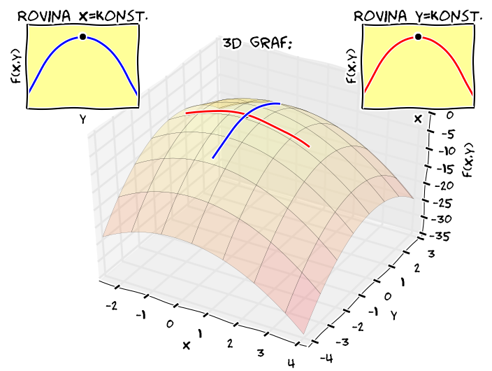

% Gradient, lineární aproximace
% Robert Mařík
% 2020

# Opakování

\iffalse

\fi

## Vrstevnice

* Pro funkci dvou proměnných jsou vrstevnice křivky, spojující místa se stejnou funkční hodnotou. 

##  Geometrie

* Skalární součin vektorů
  $$(u_1,u_2)\cdot (v_1,v_2)=u_1v_1+u_2v_2$$
  Pro kolmé vektory je nulový. Má-li jeden z vektor jednotkovou délku, je skalárí součin průmětem druhého vektoru do směru daného uvažovaným jednotkovým vektorem. 

## Lineární algebra

* Součin matice a vektoru (lineární kombinace sloupců matice, koeficienty jsou složky vektoru)
  $$\begin{pmatrix}2 & 1\\-1 &3 \end{pmatrix} \begin{pmatrix}2\\3\end{pmatrix} = 2\begin{pmatrix}2\\-1\end{pmatrix} + 3\begin{pmatrix}1\\3\end{pmatrix} = \begin{pmatrix}7\\7\end{pmatrix}$$
* Matice jako zobrazení mezi vektorovými prostory: vektor můžeme pomocí matice zobrazit na jiný vektor, zachovává se přitom rovnoběžnost, poloha středu úsečky a některé další vlastnosti.
* Změna souřadné soustavy: speciální případ zobrazení vektorového prostoru na sebe, tj. je možné reprezentovat pomocí maticového součinu. 
* Vlastní hodnoty a vektory matice: $A\vec v=\lambda \vec v$, tj. vektor se zobrazí na svůj násobek. Číslo $\lambda$ se nazývá vlastní číslo (vlastní hodnota) a vektor $\vec v$ vlastní vektor matice.
* Matice s vlastními vektory se směru souřadných os je diagonální. Skutečně, například 
  $$\begin{pmatrix}a &  b\\c &d \end{pmatrix} \begin{pmatrix}1\\0\end{pmatrix} = \begin{pmatrix}a\\c\end{pmatrix}\quad\text{a}\quad \begin{pmatrix}a &  b\\c &d \end{pmatrix} \begin{pmatrix}1\\0\end{pmatrix}=\lambda \begin{pmatrix}1\\0\end{pmatrix}$$
  si vynutí $c=0$. Podobně bychom dostali pro vektor ve směru druhé osy $b=0$.

# Diferenciální operátory

Parciální derivace se vyskytují ve většině důležitých rovnic
popisujících fyzikální svět okolo nás. Všude tam, kde se zajímáme o
fyzikální podstatu děje se setkáváme s parciálními derivacemi. Vztahy
ze středoškolské fyziky nebo tabulek pro inženýry jsou jenom důsledky
odvozené pro hodně speciální situace.

Parciální derivace umožňují sledovat závislost stavových veličin v
závislosti na souřadnicích nebo čase, a to pro každou souřadnici
samostatně. Nicméně souřadný systém je něco, co do popisu vnášíme
uměle a proto by fyzikální proces neměl být na tomto souřadném systému
závislý. *Proto často spojujeme parciální derivace do složitějších
výrazů -- diferenciálních operátorů. Zde teprve vynikne síla
parciálních derivací.*

# Gradient

> Definice (gradient). *Gradient* skalární funkce dvou proměnných $f(x,y)$ je vektorové pole označené a definované následovně.
  $$\nabla f=\left(\frac{\partial f}{\partial
  x}, \frac{\partial f}{\partial y}\right)$$
Podobně je definován gradient skalární funkce tří proměnných $f(x,y,z)$.
  $$\nabla f=\left(\frac{\partial
  f}{\partial x}, \frac{\partial f}{\partial y},
  \frac{\partial f}{\partial z}\right)$$

\iffalse

\fi

Symbol $\nabla$ je operátor nabla definovaný formálně vztahem
$$\nabla=\left(\frac{\partial}{\partial x}, \frac{\partial}{\partial
y}, \frac{\partial}{\partial z}\right)$$ nebo
$$\nabla=\left(\frac{\partial}{\partial x}, \frac{\partial}{\partial
y}\right)$$ (v závislosti na počtu proměnných funkce $f$). "Násobení"
$\frac{\partial }{\partial x}$ s\ funkcí $f$ přitom chápeme jako
parciální derivaci $\frac{\partial f}{\partial x}$.

Někdy je vhodné formulovat fyzikální zákony pomocí prostředků lineární algebry, zejména pomocí maticového součinu. V takovém případě gradientem uvažujeme sloupcový vektor. 
  
Užitečnost gradientu je ve spojení s křivkami, které spojují místa se stejnou funkční hodnotou funkce dvou proměnných. Tyto křivky nazýváme obecně vrstevnice, případně podle kontextu izotermy, izobary, hydroizopsy, hydroizopiezy atd. Pro funkce tří proměnných máme plochy spojující místa se stejnou funkční hodnotou ekvipotenciální plochy.
Gradient je v každém bodě kolmý k vrstevnici (ve 2D) resp. k ekvipotenciální ploše (ve 3D). [Nakreslit online.](https://sagecell.sagemath.org/?z=eJxlj71uwyAUhfdIfgcU2TKk5Mdupip0TFdPnapY1IaYFoMFJDV5-hLbUVKVAbjncr_D4bDHHpH-kC_8sl_4w3M0a9mF9SQ0MrxFY-kJ9HiZ4TzUjaS1UJ5sN9HMNvoHNq6VcL5r8td3Yx07K1ExQMHRhHdMud06dMD-pL4r9gJiwEdLkFgQzxMgqWM9HMWwotkj1aRvEyVMfij6KeltHiYWJxbFaQIfEata8HBDCIP_8uAwWBSk0srpkyk7qR3keAg97B6DqWfJlDUoLe1I-sVcigEXUpI9lZahK6h4uiLKM6ucNiUXTNaQr27pIVorbdo_SvjbaDcc_p65uMKPVlwYyTYYUNsFaGmoE5pk6BegT4aw&lang=sage)

> Poznámka (linearita gradientu). Gradient zachovává součet a násobení konstantou, tj. pro libovolné funkce $f$ a $g$ a konstantu $c$ platí
> $$\nabla (f+g)=\nabla f +\nabla g, \qquad \nabla (cf)=c\nabla f.$$

# Gradient v přírodě

\iffalse 

\fi

* V matematice se gradientem rozumí vektor z parciálních derivací podle všech proměnných. V aplikacích tomu bývá poněkud jinak. Často je funkce popisující studovaný systém funkcí času i prostorových proměnných. V takovém případě gradientem rozumíme vektor složený jenom z parciálních derivací podle prostorových proměnných. Čas při výpočtu gradientu za proměnnou nepovažujeme.
* V jednorozměrném případě je gradient totéž co derivace. Přesto se někdy z tradičních důvodů respektujících zvyklosti oboru nemluví o derivaci, ale o gradientu. Například mluvíme o gradientu teploty při studiu *tepelně izolačních vlastností* materiálů. Pokud máme na mysli vrstvu z jednoho materiálu (a ne například sendvičovou stěnu), je rozložení teploty lineární a dokonce v tomto případě pojmem gradient vlastně označujeme směrnici přímky.
* S gradientem souvisí *majáková navigace* při migraci živočichů. Ti sledují určitý chemický podnět a pohybují se ve směru největšího růstu tohoto podnětu (tj. ve směru gradientu). Například žralok ve vodě takto sleduje koncentraci krve. Pokud je mezi žralokem a zdrojem krve proud, který krev unáší, nepopluje žralok rovnou čarou ke zdroji krve, ale koncentrace krve ho povede po delší trase.
* Pokud se zajímáme nejenom o směr, ale i velikost gradientu, pomůže to k posouzení jak rychle se mění veličina v\ prostoru (gradient je velký, jsou-li vrstevnice nahusto). 
<!-- * *Síla* ($\vec F$) působící na těleso v silovém poli ve kterém je možno zavést potenciální energii ($V$) je gradientem potenciální energie vynásobeným faktorem $-1$ (záporně vzatý gradient). -->
<!-- $$\vec F=-\nabla V$$ -->
<!-- Pro jednorozměrnou úlohu a těleso v potenciálové jámě (tj. v rovnovážném stavu, kdy je minimum potenciální energie) můžeme potenciál v okolí minima aproximovat pomocí Taylorova rozvoje $$V(x)\approx V_0+\frac 12 V''(0)x^2+\cdots $$ (souřadnice volíme tak, že toto minimum je pro $x=0$) a je-li $|xV'''(0)|\ll V''(0)$, potom -->
<!-- $$\vec F=-\nabla V=-V''(0)x=-kx.$$ To znamená, že síla je úměrná výchylce, stejně jako u tělesa na pružině. Podobně ve vícerozměrném případě. -->

# Lineární aproximace skalární funkce

* Lineární aproximací funkce $z=f(x,y)$ v bodě $(x_0, y_0)$ je
\dm $$      f(x,y)\approx f(x_0, y_0)+\frac{\partial f (x_0,y_0)}{\partial x}(x-x_0)+\frac{\partial f (x_0,y_0)}{\partial y}(y-y_0)$$
nebo (pomocí skálárního součinu a gradientu)
$$      f(x,y)\approx f(x_0, y_0)+ \nabla f(x_0,y_0)\cdot (x-x_0,y-y_0).$$
* Tečná rovina ke grafu funkce $z=f(x,y)$ vedená bodem
  $[x_0,y_0,z_0]$, kde $z_0=f(x_0,y_0)$ má rovnici
  $$z=z_0+\frac{\partial f (x_0,y_0)}{\partial x}(x-x_0)+\frac{\partial f (x_0,y_0)}{\partial y}(y-y_0),$$
nebo (pomocí gradientu)
$$      z= z_0+ \nabla f(x_0,y_0)\cdot (x-x_0,y-y_0).$$

# Lineární aproximace vektorové funkce

Lineární aproximací vektorové funkce je lineární aproximace jejích skalárních složek. Tj. pro funkci $\vec F(x,y)=f_1(x,y)\vec \imath + f_2(x,y)\vec\jmath$ v bodě $(x_0, y_0)$ je
\dm $$      f_1(x,y)\approx f_1(x_0, y_0)+\frac{\partial f_1 (x_0,y_0)}{\partial x}(x-x_0)+\frac{\partial f_1 (x_0,y_0)}{\partial y}(y-y_0)$$
a
\dm $$      f_2(x,y)\approx f_2(x_0, y_0)+\frac{\partial f_2 (x_0,y_0)}{\partial x}(x-x_0)+\frac{\partial f_2 (x_0,y_0)}{\partial y}(y-y_0).$$
Vektorově zapsáno, platí
\dm$$\begin{pmatrix}f_1(x,y)\\f_2(x,y)\end{pmatrix} \approx  \begin{pmatrix}f_1(x_0,y_0)\\f_2(x_0,y_0)\end{pmatrix} + \begin{pmatrix} \frac{\partial f_1}{\partial x}(x_0,y_0) \\\frac{\partial f_2}{\partial x}(x_0,y_0) \end{pmatrix} (x-x_0)+ \begin{pmatrix}  \frac{\partial f_1}{\partial y}(x_0,y_0)\\ \frac{\partial f_2}{\partial y}(x_0,y_0)\end{pmatrix} (y-y_0).
$$
Maticově zapsáno
\dm$$\begin{pmatrix}f_1(x,y)\\f_2(x,y)\end{pmatrix} \approx  \begin{pmatrix}f_1(x_0,y_0)\\f_2(x_0,y_0)\end{pmatrix} + \begin{pmatrix} \frac{\partial f_1}{\partial x}(x_0,y_0) & \frac{\partial f_1}{\partial y}(x_0,y_0)\\\frac{\partial f_2}{\partial x}(x_0,y_0) & \frac{\partial f_2}{\partial y}(x_0,y_0)\end{pmatrix} \begin{pmatrix}x-x_0\\ y-y_0\end{pmatrix}
$$
nebo 
$$\vec F(x,y)\approx \vec F(x_0,y_0) + J(x_0,y_0)  \begin{pmatrix}x-x_0\\ y-y_0\end{pmatrix},$$
kde 
$$J(x,y)=\begin{pmatrix} \frac{\partial f_1}{\partial x}(x ,y ) & \frac{\partial f_1}{\partial y}(x ,y )\\\frac{\partial f_2}{\partial x}(x ,y ) & \frac{\partial f_2}{\partial y}(x ,y )\end{pmatrix}$$
je Jacobiho matice funkce $\vec F$. 

Lineární aproximace v okolí nuly pro funkci, která je v nule nulová,
tj. $x_0=y_0=\vec F(0,0)=0$ je $$\vec F(x,y)\approx \vec J(0,0)
\begin{pmatrix}x\\ y\end{pmatrix}.$$ 

# Vícerozměrné konstitutivní zákony

Zákony uvedené níže byly často odvozeny v jednorozměrném
případě. V moderní formulaci používáme obecný vektorový zápis, který
zohledňuje i směr. Zpravidla je možné použít pro tento konstitutivní
vztah lineární aproximaci a proto se vlastně jedná o násobení vektoru
maticí. Tato matice umožní nejenom změnit délku vektoru a jeho
jednotku, ale i směr. Matice se navíc při změně báze transformuje
speciálním způsobem, tak jako vektory. Takové objekty nazýváme
**tenzory**. Níže budeme pojmem tenzor rozumět matici $3\times 3$ nebo
$2\times 2$, podle kontextu. (Obecněji je možno považovat skalární
veličiny a vektory za tenzory nižších řádů, toto my však dělat
nebudeme.)

**Aby měly konstitutivní vztahy níže smysl, uvažujeme v nich gradient jako sloupcový vektor.** 

Konstitutivní vztahy tvoří z hlediska materiálového inženýrství jednu
z nejdůležitějších aplikací gradientu.

## Fickův zákon (difuze)

V roce 1855 německý lékař A. Fick objevil, že difuzní tok $\vec J$
(množství látky které projde při difuzi jednotkovou plochou za
jednotku času) je úměrný gradientu koncentrace $c$ této
látky. Matematicky vyjádřeno pomocí moderní terminologie to znamená, že platí
$$\vec J=-D\nabla c. $$
Veličina $D$ se nazývá difuzní koeficient. Pokud má $\vec J$ stejný
směr jako $\nabla c$, je $D$ skalární veličina. Pokud směry nejsou
stejné, je $D$ tenzor. Z fyzikálních důvodů je tenzor $D$ symetrický.

Difuzí se například dřevo zbavuje vlhkosti při vysoušení.

## Darcyho zákon (proudění podzemní vody)

\iffalse

 infiltruje vodu do podzemí. Znalost, co se tam s vodou děje a kudy a jak teče je nezbytná. Základním zákonem pro popis tohoto děje je Darcyho zákon. Zdroj: nase-voda.cz, Nina Havlová](karany.jpg)

\fi

V letech 1855 a 1856 francouzský inženýr H. Darcy pokusy prokázal
přímou úměru mezi rozdílem tlaků na koncích trubice naplněné porézní
zeminou (jednalo se vlastně o rozdíl výšek pro šikmou trubici) a
rychlostí proudění vody touto trubicí. Pro tok podzemní vody je vhodné
rozdíl tlaků vyjadřovat pomocí veličiny nazývané *piezometrická výška*
$h$. Do této veličiny se sčítá vliv nadmořské výšky, tlaku
geologických vrstev a případné další efekty. Tok (množství vody, která
proteče jednotkovou plochou za jednotku času) je dán vztahem $$\vec
q=-K\nabla h,$$ kde $h$ je piezometrická výška a $K$ je koeficient
filtrace. $K$ je v obecném případě symetrický tenzor, v izotropním
případě, kdy $\vec q$ a $\nabla h$ mají stejný směr, veličina
skalární.

## Fourierův zákon (vedení tepla)

\iffalse

\fi

Fourierův zákon se týká vedení tepla a vyjadřuje, 
že vektor hustoty tepelného toku $\vec q$ je úměrný gradientu teploty $\nabla T$
a má opačný směr, tj. 
$$\vec q=-k\nabla T.$$ 
Je-li materiál anizotropní, což je nejobecnější
případ, je veličina $k$ symetrickým
tenzorem. Je-li materiál izotropní, je
$k$ skalární veličinou, případně skalární veličina násobená
jednotkovou maticí, pokud potřebujeme zachovat její maticový charakter.
Veličina $k$ se nazývá součinitel tepelné vodivosti, koeficient tepelné vodivosti nebo Fourierův koeficient.

\iffalse

## Soretův efekt (termodifuze)

Tok tepla je vyvolaný nerovnoměrným rozložením teploty. Difuze chemické
látky je vyvolána nerovnoměrným rozložením koncentrace této
látky. Většinou je hybatelem procesu nerovnoměrnost v rozložení látky,
která se tímto procesem transportuje. Nemusí to však být
vždy. Příkladem je termodifuze, což je pohyb prvků vyvolaný
nerovnoměrným rozložením teploty. Například při difúzi vody ve dřevě s nerovnoměrným rozložením teploty je tok dán vztahem $$\vec J=-D\nabla c - sD\nabla T, $$
kde $s$ je koeficient termodifuze. Na rozdíl od předchozích zákonů, u Soretova efektu dochází k transportu nejenom ve
směru maximálního poklesu (záporného gradientu) teploty, ale někdy i ve směru 
gradientu teploty. Viz Wikipedia a heslo Thermophoresis.

## Ohmův zákon

Ohmův zákon je velice známý vztah mezi napětím a proudem. Přeformulováno z
integrálního tvaru $I=\frac 1R U$ (pro elektrické obvody) do diferenciálního tvaru
(pro popis děje v látce) tento zákon říká, že hustota elektrického
proudu $\vec j$ je přímo úměrná intenzitě elektrického pole $\vec
E$. A tato intenzita je gradientem potenciálu $\varphi$ elektrického
pole, tj. $\vec E=\nabla \varphi$. Spojeno, platí $$\vec j=\gamma
\nabla \varphi.$$ Formálně máme tedy stejný tvar zákona jako u vedení
tepla, tok tepla je nahrazen tokem elektrického proudu a rozdíl teplot
je nahrazen rozdílem potenciálů. Znalost zapojování elektrických
obvodů, jako je například paralelní nebo sériové zapojení rezistorů,
bývá běžná a toho se často využívá při modelování tepelného odporu
pomocí eletrického odporu. Formálně jsou vztahy identické.

Elektrický proud studujeme v kovech a ty bývají izotropní. Proto je v
případě Ohmova zákona konstanta úměrnosti uvažována jako reálné číslo,
nikoliv matice. Tím se věci znatelně zjednodušují, ale vyplývají odsud
i limity použitelnosti při modelování vedení tepla jako vedení
elektrického proudu.

\fi

# Speciální případy vztahu mezi gradientem a tokem

\iffalse

\fi

Uvažujme vztah mezi gradientem a tokem ve tvaru $$\vec j=-K\nabla u ,$$ kde $K$ je symetrický tenzor. Gradient má ve trojrozměrném případě vyjádření
$$\nabla u  =\left(\frac{\partial u }{\partial x},\frac{\partial u }{\partial y},\frac{\partial u }{\partial z}\right)^T$$
a ve 2D
$$\nabla u  =\left(\frac{\partial u }{\partial x},\frac{\partial u }{\partial y}\right)^T.$$ 

## Obecný případ (anizotropní)

Veličina $K$ je matice $$K=
\begin{pmatrix}
  k_{11}& k_{12} & k_{13}\\
  k_{21}& k_{22} & k_{23}\\
  k_{31}& k_{32} & k_{33}
\end{pmatrix}
$$
jejíž komponenty splňují $k_{ij}=k_{ji}$. Často jsou všechny
veličiny kladné a prvky v hlavní diagonále jsou dominantní.

Komponenty vektoru $\vec j=(j_x, j_y, j_z)^T$ jsou
$$
\begin{aligned}
  j_x&=-k_{11}\frac{\partial u }{\partial x}-k_{12}\frac{\partial u }{\partial y}-k_{13}\frac{\partial u }{\partial z},\\
  j_y&=-k_{21}\frac{\partial u }{\partial x}-k_{22}\frac{\partial u }{\partial y}-k_{23}\frac{\partial u }{\partial z},\\
  j_z&=-k_{31}\frac{\partial u }{\partial x}-k_{32}\frac{\partial u }{\partial y}-k_{33}\frac{\partial u }{\partial z},
\end{aligned}
$$
což zjistíme prostým maticovým násobením. Prostor pro další úpravu není.

## Ortotropní případ, vhodně zvolené osy

\iffalse

\fi

V obecném případě je zpravidla možné transformovat soustavu souřadnic tak, aby tenzor $K$ byl diagonální. Pro praktické výpočty se toto však často nevyplatí. Pokud však je studovaný problém ortotropní, má charakteristické směry (přesněji, má tři roviny symetrie materiálových vlastností), je možné zvolit souřadnice v souladu s těmito směry a matice $K$ je diagonální. 

$$K=
\begin{pmatrix}
  k_{11}& 0 & 0\\
 0& k_{22} & 0\\
  0& 0 & k_{33}
\end{pmatrix}
$$

Komponenty vektoru $\vec j$ jsou
$$
\begin{aligned}
  j_x&=-k_{11}\frac{\partial u }{\partial x},\\
  j_y&=-k_{22}\frac{\partial u }{\partial y},\\
  j_z&=-k_{33}\frac{\partial u }{\partial z}.
\end{aligned}
$$

S diagonální maticí se pracuje velmi dobře, protože má v hlavní
diagonále vlastní čísla. Tato vlastní čísla jsou fyzikální
charakteristikou úlohy. Například největší vlastní číslo a odpovídající
vlastní směr charakterizují směr, ve kterém je odezva materiálu na
vnější podnět maximální a vlastní číslo udává velikost této
reakce. Tyto fyzikální charakteristiky nemohou být závislé na volbě
souřadné soustavy, ve které úlohu popisujeme. Co se mění s volbou
souřadné soustavy jsou pouze souřadnice vlastního vektoru. Vlastní
čísla jsou však skalární a proto jsou invariantní při otočení soustavy
souřadnic. Pokud bychom neměli možnost zvolit
soustavu souřadnic tak, aby matice byla diagonální, máme alespoň
jistotu, že vlastní čísla zůstanou stejná. 

## Ortotropní případ ve 2D

Stejné jako ve 3D, pouze chybí třetí rovnice.

## Izotropní případ

Stejné jako ortotropní případ, ale navíc platí $k_{11}=k_{22}=k_{33}=k.$ Potom
$\vec j=-k\nabla u$, kde $k$ je konstanta a vektory toku a gradientu mají opačný směr.

# Tečna k vrstevnici

\iffalse

	

\fi

Pro $z=0=z_0$ dostáváme z tečné roviny následující: Nechť
  $f(x_0,y_0)=0$. Tečna k vrstevnici funkce $f(x,y)$ na úrovni nula,
  tj. ke křivce $0=f(x,y)$, vedená bodem $[x_0,y_0]$ má rovnici
  $$0=\nabla f(x_0,y_0)\cdot (x-x_0,y-y_0).$$
  
\iffalse

[Nakreslit online](https://sagecell.sagemath.org/?z=eJxtkc1ygyAUhffO-A7MZBFIrtafdMk7ZNFdp3EIYqRRcBAN9umL5qeLujtw7v0u97BB1aCuXCCGrOCKoRGddSnQp0tgSr7CoMIOJkLdKdtNkdtNpzzKwmBxaQZpGGycF_HBC39TSVUWRmuLfZ-vIZBASsIgDO50iqr4YlgphbKYLCUJiUtti87ocuAWj4JbbTB20WxG3iaE0mRGbJA-G_Yjrmg0vRWjkhz-pECePxjtNVJDw2BZaPKLPQcOYXCkXCurB1N0zfxI8NulkBPAk39pRgA17Cyann6YQQB6FPfUMHURODrAwa8DvGUd3X4LuyUz8riXbddILu2d-khyZicvdv5sq_tx68dIJW6ytDXN1xn33BGlKPlPWmlnxugbfiQKrxSXI9mvpP6mtGnxikGW_zrGfe2BrO88qjDMSk1TcK1UNI3fYWqZmwX5BYh4r2w=&lang=sage)

\fi

# Implicitně definovaná funkce 

\iffalse

 

\fi

Ve speciálním případě, pokud tečna k vrstevnici není rovnoběžná s osou $y$, je možno vrstevnici chápat jako graf funkce jedné proměnné. Taková funkce je do jisté míry určena jednoznačně, jak ukazuje následující věta.

>  Věta (o implicitní funkci). Uvažujme funkci $f(x,y)$ dvou proměnných, splňující v nějakém bodě
>  $(x_0, y_0)$ podmínku $f(x_0, y_0)=0$ a mající v okolí bodu $(x_0,
>  y_0)$ spojité parciální derivace. Platí-li $$\frac{\partial f (x_0,y_0)}{\partial y}\neq 0,$$ je rovnicí
>    $$f(x,y)=0$$ v okolí bodu $(x_0, y_0)$ implicitně určena
>    **právě jedna spojitá funkce** $y=g(x)$.

# Lokální extrémy funkce více proměnných

\iffalse

 

\fi

Podobně jako pro funkce jedné proměnné definujeme i pro funkce více
proměnných **lokální extrémy** následovně: funkce má v daném
bodě **lokální minimum**, pokud v nějakém okolí tohoto bodu
neexistuje bod s menší funkční hodnotou a podobně, funkce má v bodě
**lokální maximum**, pokud v okolí tohoto bodu neexistuje bod
s vyšší funkční hodnotou. 

Funkce jedné proměnné určitě nemá v bodě lokální extrém, pokud má v
tomto bodě kladnou derivaci (protože potom funkce roste), nebo pokud
má v tomto bodě zápornou derivaci (protože potom funkce
klesá). Derivace v bodě kde nastává lokální extrém tedy musí být buď
nulová nebo nesmí existovat. Stejná myšlenková úvaha se dá provést pro
křivky vzniklé na řezech funkce dvou proměnných a proto platí
následující věta.

> Věta (Fermatova nutná podmínka pro lokální extrémy).
> Jestliže funkce více proměnných má v nějakém bodě svůj lokální
> extrém, pak každá parciální derivace, která v tomto bodě existuje,
> je nulová.

*V bodě lokálního extrému hladké funkce je tedy nulový gradient.*

# Tenzor malých deformací

\iffalse

\fi

Na závěr jedna aplikace z oblasti parciálních derivací. Ukážeme si, že parciální derivace jsou vhodné k popisu deformací.

Vektorovou funkci je možné chápat jako zobrazení roviny do sebe, které může odpovídat deformaci tělesa působením síly. Popišme tuto deformaci  $\vec U(x_1,x_2)=(u_1(x_1,x_2), u_2(x_1,x_2))$.  Lineární aproximací dostáváme
$$\vec U(x_1+\Delta x_1,x_2+\Delta x_2)\approx 
\vec U(x_1,x_2) + J(x_1,x_2) \begin{pmatrix}\Delta x_1 \\ \Delta x_2 \end{pmatrix}.$$
      Člen $\vec U(x_1,x_2)$ je posunutí, proto nás zajímá až druhý člen, obsahující deformaci. Pokud 
      matici $J(x_1,x_2)$ rozdělíme na součet symetrické a
antisymetrické matice, dostaneme matici, odpovídající změně tvaru a matici, odpovídající pootočení. Pootočení (antisymetrická část) nás nezajímá, zajímá nás jenom změna tvaru. Obecný postup, jak rozdělit matici na součet symetrické a antisymetrické matice je 
$$A=\frac{A+A^T}2+\frac{A-A^T}2.$$ První matice v tomto součtu je symetrická a druhá antisymetrická.
Pro Jacobiho matici dostáváme
\dm$$\frac{J+J^T}2= \begin{pmatrix}         \frac{\partial u_{1}}{\partial x_{1}} &  \frac 12\left(\frac{\partial u_{1}}{\partial x_{2}}+\frac{\partial u_{2}}{\partial x_{1}}\right)\\         \frac 12\left(\frac{\partial u_{1}}{\partial x_{2}}+\frac{\partial u_{2}}{\partial x_{1}}\right)& \frac{\partial u_{2}}{\partial x_{2}}       \end{pmatrix}    .$$
Tato matice
      popisuje změnu tvaru a nazývá se [*tenzor malých deformací*](https://cs.wikipedia.org/wiki/Deformace#Tenzor_mal%C3%BDch_deformac%C3%AD). Ten se ještě někdy rozděluje na součet vhodného konstantního násobku jednotkové matice (souvisí se zvětšením nebo zmenšením, tj. se změnou objemu) a deviátor (souvisí se zmenou tvaru bez započtení zvětšení či zmenšení).

Pro využití v dřevařských úlohách viz též A. Požgaj, Štruktúra a
vlastnosti dreva str 318 nebo P. Horáček, Fyzikální a mechanické
vlastnosti dřeva I, str. 40. Analogicky, ale pro rychlosti, je
definován tenzor rychlosti přetvoření (deformační rychlost) používaný
v hydrodynamice. Můžeme ji dostat jako derivaci tenzoru malých
deformací (při studiu deformací), nebo jako [symetrickou
část](https://en.wikipedia.org/wiki/Strain-rate_tensor#Symmetric_and_antisymmetric_parts)
matice vytvořené gradienty jednotlivých komponent rychlosti
proudění. Pro proudění vody viz J. Říha, Matematické modelování
hydrodynamických a disperzních jevů, kap. 3.3.

[Obrázky a online výpočty.](https://sagecell.sagemath.org/?z=eJydU8tq20AU3Rv8DxdlESmaKLbadBEyBbeFkoU3behGmDCWbuKpRzNiNHIr_UO-oKt8QL7C-bBePeq42FCoQGIe555z7kMnMI3gi2nWSmRglphqBGeFLu-NzUWKoAUYZ1LUEgSUdY7OynRtqn2UHI9OIH7l2cEOuWRjnDUFsaWidESZ4UYKZywtdmTj0aYxtuZ-MmGTBUumw3dK30l0yabRu3bV7-kuGI9mPBck-dNPkojgUXzZYSeX7DyKFx3ils-izk5hSvTp5MMdGeX-LJzdBhdxuxf9wflwcALf6nKDTrXZ97dXsIbCyrLAzbpisHZoa7BYWGxQu-o7QpOjrv7ULGctOhM5gswIIB0FiWWdrkwOOSoqA6qDYrZWqFC8M9h6TsnvRXw2UNR3Q65xlwRVsEeed1EHtun-3667NqQSTDa0SMuVaWMKkVX_mQQtYQ5SQ5LMmPcR1fZp12X0qD99SZk3I87dzBDo5XH7VDpSNVTGl0fU22eCQ9JlybyvR6BN_vKLxstthK0GLOXBvJth3rbPA7RH1n8hKXnmfaIKbJ_2J7FVXVyNR0CPWVrR1Dzx58lkER42IjjbYErBvgygzVu2eXdTvOgJbuafeWGkdn5PxSA1ylh-ajE7ZVDKBvnbSRAWRtUPRh9HCVWsBKdfIAiV1HgMFLzK0Rv2kp2RncgOv1QVHgb0-kPIvVSK39oK98SPxpcr88NfuVz53vUqfu-F82S6CL3ri3YT7IHA110RGWTyQbqSv9m_9ckDSdGkpu7OCicNnx5TsC3pb7sKl7c=&lang=sage&interacts=eJyLjgUAARUAuQ==)

