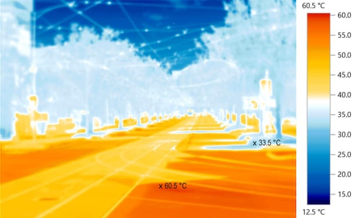

% Divergence vektorového pole, rovnice kontinuity
% Robert Mařík
% 2020, 2021

> Anotace.
>
> * Představíme si univerzální nástroj umožňující popsat libovolný transportní děj v přírodě. Tedy transport energie (vedení tepla), transport vody (sušení dřeva, proudění podzemní vody, proudění tzv. mělké vody) a transport látky obecně (pohyb sedimentů, pohyb tektonických vrstev).
> * Aparát z této přednášky se věnuje základním principům transportních dějů. Budeme se zaměřovat především na transport energie nebo látky materiálem. Naučíme se základní představu o fungování těchto dějů naformulovat matematicky. Vzniklé rovnice řešit nebudeme, což vůbec nevadí. Řešení za nás zvládnou počítače. Role člověka je nezastupitelná při tom nejdůležitějším, při formulaci modelu. To bude i naším hlavním úkolem.
> * Během analýzy transportních jevů si představíme nový diferenciální operátor: operátor divergence. Divergence vyjadřuje, zda tok zesiluje a nabírá na intenzitě (tj. z daného místa více vytéká, než teče dovnitř) nebo naopak.

> Prerekvizity.
>
> * Navážeme na využití vektorových funkcí a gradientu k popisu transportu látky nebo energie prostředím.
> * Ukážeme si, jak se v matematickém popisu transportu zohlední izotropie nebo homogenita materiálu. Ukážeme si, jak se liší popis stacionárních a nestacionárních jevů a jak se liší popis materiálů s lineárními a nelineárními materiálovými vlastnostmi. Pokud se budete při používání nematematických pojmů (jako například izotropie) cítit zaskočeni, můžete si oživit znalosti například na Wikipedii.
> * Rovnici vedení tepla v jedné dimenzi, kterou jsme si odvodili v úvodní přednášce, si zobecníme do dvoudimenzionálního a třídimenzionálního tvaru. Je proto vhodné si základní fakta o této rovnici zopakovat.

# Transportní děje

https://youtu.be/p1Qu89EKc94

Pochopení a modelování transportních dějů je důležité pro většinu technických oborů. Podstata těchto dějů je často  odlišná, přesto mají navenek podobné chování a tím je umožněn jednotný přístup při matematickém modelování.

Příklady transportních dějů:

* pohyb povrchové vody,
* pohyb podzemní vody,
* vedení tepla,
* transport vody ve dřevě.

Obecná bilance veličiny, která má zdroje a spotřebiče a je přenášena tokem vypadá následovně.

* Existuje veličina, spojitě rozložená v prostoru, charakterizující stav systému. Tuto veličinu budeme nazývat *stavovou veličinou*. Její hustotu označíme $u$.
* Stavová veličina se může v prostoru přemisťovat *tokem* $\vec \jmath$.
* Stavová veličina může vznikat a zanikat. *Zdroje* i *spotřebiče* budeme uvažovat  společně a jejich vydatnost rozlišíme znaménkem: spotřebiče budou zdroje se zápornou vydatností. Celkovou vydatnost zdrojů a spotřebičů v daném místě, tj. množství veličiny vygenerované  za jednotku času v jednotce objemu (nebo plochy, nebo délky, podle počtu dimenzí v úloze), označíme $\sigma$.

Zákon zachování (se zohledněním toku a zdrojů) je vlastně celková bilance stavové veličiny v daném místě. Přirozeným jazykem je možno tuto bilanci formulovat následovně.  

> Přírůstek množství veličiny je součtem přírůstku způsobeného tokem a přírůstku ze zdrojů. Akumulace je přítok plus zisk z interních zdrojů.

Toto je jednoduchý, ale přitom neuvěřitelně silný nástroj. Umožní jednotným způsobem popsat řadu zcela odlišných dějů. Pro použití v matematickém modelu ale musíme jednotlivé pojmy nejprve kvantifikovat. Měřit rychlost změny množství veličiny v daném místě umíme pomocí derivace podle času. Měřit změny v _jednodimenzionálním_ toku přenášejícím sledovanou veličinu jsme se naučili jako jednu z prvních aplikací parciálních derivací: jedná se o derivaci toku podle prostorové proměnné. Ještě se musíme naučit měřit změny v toku ve dvou nebo třech dimenzích.

# Změna toku vektorového pole

https://youtu.be/cXT6ULeZFJs

\iffalse 

manim:Divergence|Vk8OAq3_40g|Divergence umožňuje identifikovat, zda tok sílí či slábne. Tato znalost je důležitým stavebním kamenem do matematického modelu liboovolného transportního děje probíhajícího v přírodě (rovnice kontinuity a difuzní rovnice).

\fi

Budeme sledovat tok vektorového pole a bude nás zajímat, o kolik se tok v daném místě mění.

* Pro jednoduchost rozdělíme tok na tři nezávislé části ve směru jednotlivých os a vztáhneme vše k jednotkám času a průřezu. Tedy budeme uvažovat hustotu toku stavové veličiny.
  * Je-li tato hustota toku popsána vektorovým polem  $\vec q=(P,Q,R)$ například v jednotkách kilogram na metr čtvereční za sekundu, znamená to, že kolmým průřezem jednotkového obsahu projde za jednotku času $P$ kilogramů sledované látky, jejíž tok popisujeme.
  * Často se pracuje i s objemovým tokem, kdy množství neměříme v kilogramech ale v metrech krychlových a například při ustáleném proudění v trubici (hydrodynamika) je tok roven vektoru rychlosti a při proudění porézním materiálem (proudění podzemní vody) je roven filtrační rychlosti.
* Uvažování toku v souřadnicích nám umožní tok rozdělit na tři nezávislé toky ve směru jednotlivých os (případně na dva toky ve dvoudimenzionálních úlohách). Můžeme si pro jednoduchost představit tři trubky. Každá trubka míří ve směru jedné z os. 
  * Funkce $P$ udává tok v trubce mířící směrem v ose $x$ (v kladném směru kladný tok a naopak) a potřebujeme zjistit, jestli tento tok narůstá nebo slábne. To jsme již řešili v případě toku tepla u rovnice vedení tepla v úvodní přednášce. Derivace $\frac{\partial P}{\partial x}$ udává, o kolik studovaná komponenta toku v daném místě vzroste a tento nárůst je vztažený na jednotku délky.
  * Ve směru osy $y$ máme tok vyjádřený veličinou $Q$ a proto nás pro popis zesilování či zeslabování zajímá $\frac{\partial Q}{\partial y}$.
  * Analogicky $\frac{\partial R}{\partial z}$ ve směru osy $z$.
* Celková změna toku bude součtem všech tří příspěvků. 
  * Pokud je součet kladný, znamená to, že tok zesiluje. V takovém případě je převaha toku ven. Z daného místa více veličiny vytéká, než kolik teče dovnitř. 
  * Pokud je součet záporný, je tomu naopak. 
  * Nesoulad mezi přítokem a odtokem je možné přičíst na vrub zdrojům a akumulaci stavové veličiny. Záleží na charakteru proudící veličiny a na okolnostech s tímto prouděním spojených. Tuto informaci nám pro další popis musí dodat externí věda (obecná fyzika, fyzika materiálu, fyzika životního prostředí, hydrologie, pedologie, ...).
* Při preciznějším formulaci výše uvedených myšlenek je nutné pracovat s konečně velkým objemem (viz obrázek), vztáhnout výsledek na jednotku objemu a rozměry tohoto objemu limitně stáhnout k nule. Toto však již přesahuje ambice v našem kurzu a jedná se o formalismus, kterému se vyhneme přímým představením hotového výsledku.

<!--
Budeme sledovat tok vektorového pole ze zvoleného 
místa. Vyjádříme bilanci, o kolik je větší tok vektorového pole z daného místa ven ve srovnání s tokem tohoto pole dovnitř (viz krychlička na obrázku). Protože
záleží na objemu, ve kterém tok sledujeme, je  vztáhneme tento tok na
jednotku objemu.

Fyzikálně tok ven uvažujeme jako kladný a tok dovnitř jako záporný. Velikost toku rovinnou plochou určíme jako součin vektorového pole v tomto místě a  obsahu plochy.
Celkový tok $\vec q=(0,q_y,q_z)$ do krychle na obrázku je součtem toků levou boční stěnou a dolní stěnou, tj. 
$$Q_{in}=-q _y\Delta x \Delta z - q _z\Delta x \Delta y.$$
Podobně tok ven z krychle je  $$Q_{out}=\left(q_z+\frac {\partial q_z}{\partial z}\Delta z\right)\Delta x\Delta y + \left(q_y+\frac {\partial q_y}{\partial y}\Delta y\right)\Delta x\Delta z$$
a celková bilance je 
$$Q_{in}+Q_{out}=
\left(\frac {\partial q_y}{\partial y}+\frac {\partial q_z}{\partial z}\right)\Delta x\Delta y\Delta z.
$$
V případě proudění i v ose $x$ bude přítomen ještě další analogický člen charakterizující tuto dodatečnou položku. 

-->

# Divergence

https://youtu.be/ejDQx3QjgfI

Výše uvedenými úvahami je motivována následující definice a věta. (Definice je maličko nepřesná, protože nemáme nástroje pro pečlivější formulaci. Ale je v ní  skryta hlavní myšlenka vedoucí k zavedení pojmu divergence.)

> Definice (divergence). *Divergence* vektorového pole $\vec F$ v daném bodě je převis toku vektorového pole z tohoto místa nad tokem do tohoto místa. Tento tok se počítá přes hranici infinitezimálně malého referenčního tělesa a je vztažený na jednotku objemu. Divergenci vektorového pole $\vec F$ označujeme $\mathop{\mathrm{div}}\vec F$ nebo $\nabla \cdot \vec F$.

> Věta (výpočet divergence). Pro vektorovou funkci $$\vec F=(P,Q,R)=P\vec i + Q\vec j + R\vec k,$$ kde $P$, $Q$ a $R$ jsou funkce tří proměnných $x$, $y$ a $z$ vypočteme divergenci vztahem 	  $$\mathop{\mathrm {div}}\vec F=\nabla\cdot\vec F=\frac{\partial P}{\partial x}+\frac{\partial Q}{\partial y}+\frac{\partial R}{\partial z}.$$
> Pro vektorovou funkci dvou proměnných vypočteme divergenci analogicky, pouze chybí třetí člen. 

> Poznámka (linearita divergence). Divergence zachovává součet a násobení konstantou, tj. pro libovolné vektorové funkce $\vec F$ a $\vec G$ a konstantu $c$ platí $$\nabla \cdot (\vec F+\vec G)=\nabla \cdot \vec F +\nabla \cdot \vec G \quad\text{a}\quad \nabla \cdot (c\vec F)=c\nabla \cdot \vec F.$$

> Poznámka (fyzikální interpretace divergence). Vektorové pole používáme k modelování toku veličin, které nás zajímají (teplo v materiálu, tekutina nebo chemická látka v materiálu, voda nebo plyn v půdě a podobně). Divergence vektorového pole udává tok z jednotkového objemu látky v daném místě. Udává, jestli se v daném místě a čase tok nabývá na intenzitě (kladná divergence) nebo ustává (záporná divergence). Tento efekt může být způsoben tím, že veličina přenášená tímto polem se v daném místě buď kumuluje, nebo ubývá a také tím, že daná veličina v bodě může vznikat nebo zanikat.

Divergence je lokální veličina. Udává informaci o proudění v daném bodě. Pro měření však je nutné mít konečný objem a pro stanovení toku konečně velkou hranici. Vzájemný vztah mezi lokální veličinou a konečným objemem je založený na předpokladu, že podmínky se nemění skokem a okolí každého bodu jsou nepříliš odlišné od podmínek v okolních bodech.

> Poznámka (fyzikální interpretace divergence v měřitelných pojmech). Tok přes hranici umíme měřit u těles. Zajímá-li nás divergence v nějakém bodě, představíme si okolo tohoto bodu nějaké těleso. Například kouli nebo krychli. Poté určíme tok přes hranici. Tok hranicí ven počítáme kladně a dovnitř záporně. Celkový tok hranicí určíme jako součet přes všechny části hranice. Podíl celkového toku přes hranici tělesa a objemu tohoto tělesa je odhad pro divergenci v daném bodě. Tento odhad je tím přesnější, čím je objem tělesa menší. Naopak, ze známé divergence je možno odhadnout zesílení toku v malé oblasti okolo studovaného bodu jako součin divergence a objemu (nebo obsahu ve 2D) oblasti.

Přesnou divergenci získáme postupem uvedeným v předchozí poznámce, pokud limitním přechodem stáhneme rozměry uvažovaného tělesa k nule. 

Pokud se při transportu v daném místě množství veličiny ani tok nemění s časem,  mluvíme o stacionárním proudění a stacionárním poli. V takovém případě se situace zjednoduší, protože potom divergence souvisí jenom s přítomností zdrojů a spotřebičů.

> Poznámka (praktická interpretace divergence stacionárního pole). Pokud je při ustáleném proudění v některém místě divergence kladná, znamená to, že v tomto místě je zdroj této veličiny. Pokud je záporná, je v daném místě spotřebič. Vektorové pole, jehož divergence je rovna nule, se nazývá **nezřídlové pole**. To proto, že pokud toto pole popisuje stacionární tok, tak se jedná o tok v prostředí bez zdrojů a spotřebičů. (Zkráceně říkáme jenom "bez zdrojů", protože jak jsme uvedli na začátku, spotřebiče považujeme za zdroje se zápornou vydatností.)

Ze střední školy z fyziky umíme modelovat vektorové pole pomocí siločar. Ty začínají ve zdrojích a končí ve spotřebičích. Siločáry stacionárního nezřídlového pole nikde nezačínají ani nekončí a jsou to uzavřené křivky. Například stacionární magnetické pole je nezřídlové. Absence zdrojů magnetického pole se projevuje tak, že rozříznutím tyčového magnetu vzniknou dva menší plnohodnotné magnety. Nevznikne samostatný jižní pól a samostatný severní pól magnetu. To je rozdíl oproti poli elektrickému, kdy rozdělením tyče s opačně nabitými konci vznikne jedna kladně nabitá a jedna záporně nabitá tyč poloviční délky.

# Výpočet divergence

Viz [cvičení](http://user.mendelu.cz/marik/am/slidy/cviceni/cviceni03.md.html). Jedná se o prosté derivování se následným sečtením derivací.

# Rovnice kontinuity

https://youtu.be/HiOmERpTdV0

\iffalse 

\fi 

* Přírůstek stavové veličiny za jednotku času v jednotkovém objemu
  (nebo ploše, nebo délce, podle dimenzionality úlohy) je derivace
  hustoty $u$ podle času.
  $$\text{Přírůstek}=\frac{\partial u}{\partial t}$$
*  Přírůstek veličiny v jednotkovém objemu (nebo ploše, nebo délce) za
  jednotku času způsobený tokem $\vec \jmath$ je záporně vzatá divergence
  vektorového pole $\vec \jmath$. Tento přírůstek je způsobený snížením
  toku, proto ho počítáme jako záporné navýšení, tj. záporně vzatou divergenci.
$$    \text{
        Přírůstek způsobený tokem
}=-\nabla\cdot \vec \jmath$$

Matematickou formulací celkové bilance  je **rovnice kontinuity**.
$$
      {\frac{\partial u}{\partial t}=\sigma -\nabla\cdot \vec \jmath}   $$

    

>Poznámka (fyzikální interpretace členů rovnice kontinuity).
>
>* Člen $\frac{\partial u}{\partial t}$ udává, jak rychle se roste hustota stavové veličiny $u$ v daném místě a čase.
>* Člen $\sigma$ udává vydatnost zdrojů stavové veličiny, přičemž spotřebiče jsou uvažovány jako zdroje záporné vydatnosti. Tento člen tedy udává, kolik stavové veličiny v tomto místě vzniká v jednotkovém objemu za jednotku času. Zpravidla neobsahuje derivace podle času a polohy. Může se však měnit s časem, s polohou, nebo s množstvím stavové veličiny. Nemusí být nutně konstantní.
>* Člen $\nabla\cdot \vec j$ udává v daném bodě změnu ve velikosti proudění přenášejícím stavovou veličinu. Přesněji, udává, o kolik více veličiny z daného místa vyteče ve srovnání s množstvím veličiny, které do tohoto místa vteče. Jinak řečeno, udává, o kolik zesílí v daném místě tok $\vec \jmath$. My potřebujeme mít zachyceno zeslabení (množství které chybí v toku se "použije" na akumulaci veličiny v daném místě) a proto uvažujeme záporně vzatou divergenci, tj. $-\nabla\cdot \vec j$.
>* Pokud zdroje stavové veličiny neexistují, jedná se o *bezzdrojovou rovnici*. V takovém případě klademe $\sigma=0$. Poznáme to tak, že v rovnici chybí člen bez derivací.
>* Pokud studujeme systém v ustáleném stavu, kdy se stavová veličina nemění v čase, je člen $\frac{\partial u}{\partial t}$ na levé straně nulový. V tomto případě mluvíme o *stacionárním stavu* a *stacionární rovnici kontinuity*. Stacionární rovnice kontinuity typicky popisuje systémy, které byly dostatečně dlouhou dobu ve stabilních podmínkách a dosáhly rovnovážného stavu. Stacionární rovnici poznáme tak, že v ní nefiguruje člen s derivací podle času.
>* Viděli jsme, že za určitých podmínek mohou některé členy v rovnici kontinuty chybět. Naopak člen $\nabla\cdot \vec j$ charakterizující změny v toku je v rovnici kontinuity přítomen vždy. Bez něj by rovnice kontinuity ztratila smysl (resp. redukovala by se na triviální případ, kdy veličina v daném místě vzniká danou rychlostí a zůstává zde, tj. problém řešitelný čistě integrováním).

V matematice často rovnici kontinuity uvažujeme ve výše uvedeném tvaru.  Při
praktickém použití většinou preferujeme názornou interpretaci
jednotlivých veličin a proto se v rovnici mohou objevit další
konstanty úměrnosti, které umožní sladit jednotky a fyzikální
interpretaci členů. Někdy se naopak snažíme konstanty co nejvíce
redukovat metodami transformace popsanými v přednášce o diferenciálních rovnicích. Proto volíme vhodné násobky veličin
vystupujících v matematické formulaci tak, aby se co nejvíce konstant
eliminovalo, případně shluklo do jediné veličiny. Zkušenosti ukazují,
že je vhodné volit veličiny bezrozměrné. Například v publikaci
P. Horáček, Fyzikální a mechanické vlastnosti dřeva I je zavedena
[bezrozměrná vlhkost, bezrozměrný čas a bezrozměrná
vzdálenost](https://is.mendelu.cz/eknihovna/opory/zobraz_cast.pl?cast=9180;lang=cz)
na straně 61 pro rovnici popisující difuzi a [charakteristická délka,
Biotovo číslo (bezrozměrná tepelná vodivost) a bezrozměrná teplota,
bezrozměrný čas a bezrozměrná
vzdálenost](https://is.mendelu.cz/eknihovna/opory/zobraz_cast.pl?cast=9182;lang=cz)
pro rovnici popisující vedení tepla na stranách 88 a 89.

V této rovnici není zahrnut případ, kdy se veličina přenáší ještě i prouděním hmotného prostředí (konvekce).

# Rovnice mělké vody

\iffalse 

\fi

Rovnici kontinuity můžeme použít pro popis vody v řečišti. Úloha je jednodimenzionální a tok $Q$ je proto skalární veličina. Divergence toku se díky jednodimenzionálnosti redukuje na derivaci podle prostorové proměnné $\frac{\partial Q}{\partial x}$. Zachovávající se veličinou je množství vody. Hustota zachovávající se veličiny je množství vody na metr délky toku, tj. *průtočný průřez* $A$ (obsah průřezu říčního toku  v daném místě). Zdroje zpravidla neuvažujeme, tj. $\sigma=0$. Rovnice kontinuity má potom tvar 
$$
      {\frac{\partial A}{\partial t}= - {\frac{\partial Q}{\partial x}}}
$$
a nazývá se Saint-Venantova rovnice nebo též *rovnice mělké vody*. Tato rovnice se používá při popisu *proudění v korytě* nebo při modelování *vln tsunami*.

# Difuzní rovnice

https://youtu.be/p2FTgyAWzA4

Difuzní rovnice je rovnice kontinuity s dosazeným konstitučním vztahem pro tok.  Použijeme-li pro kvantifikaci souvislosti toku a gradientu lineární aproximaci, je možné psát
$$      \vec \jmath=-D\nabla u,$$
kde $D$ konstanta úměrnosti. Pokud tok $\vec \jmath$ a gradient $\nabla u$ leží v jedné přímce,
je $D$ reálné číslo, jinak je $D$ matice. Například při
studiu pohybu vody ve dřevě se voda řídí nejen směrem maximálního
poklesu vlhkosti, ale stáčí se současně do podélného směru, ve kterém dřevo
vede vlhkost nejlépe. V takovém případě je $D$ matice. 
Spojením rovnice kontinuity
$$
      {\frac{\partial u}{\partial t}=\sigma -\nabla\cdot \vec \jmath}   $$
a vztahu pro tok stavové veličiny dostáváme rovnici
$$
      {\frac{\partial u}{\partial t}=\sigma - \nabla\cdot \bigl(-D\nabla u\bigr)}.$$
      Tuto rovnici je možno upravit na tvar
$$
      {\frac{\partial u}{\partial t}=\sigma + \nabla\cdot \bigl(D\nabla u\bigr)},$$
který se nazývá *difuzní rovnice*.

>Poznámka (fyzikální interpretace difuzní rovnice).
>
>* Člen $\frac{\partial u}{\partial t}$ udává, jak rychle se mění
   hustota stavové veličiny $u$. Je stejný jako v rovnici kontinuity.
>* Člen $\sigma$ udává vydatnost zdrojů stavové veličiny. Je stejný jako v rovnici kontinuity.
>* Člen $\nabla u$ udává nerovnoměrnost v prostorovém rozložení stavové veličiny. Pomocí difuzní matice $D$ a konstitutivního zákona tuto nerovnoměrnost přepočítáme na tok, který se snaží uvažovanou nerovnoměrnost vyrovnat. Tento tok je reprezentován výrazem $-D\nabla u$.
>* Záporně vzatá divergence toku udává, jak tok v daném místě ztrácí na intenzitě. Vzhledem k zápornému znaménku v konstitutivním zákoně má záporně vzatá divergence tvar $$\nabla\cdot \bigl(D\nabla u\bigr).$$ Představuje přírůstek hustoty stavové veličiny v daném místě za jednotku času, způsobený zeslábnutím toku.
>* Rovnice jako celek vyjadřuje, že navýšení hustoty stavové veličiny (tj. množství stavové veličiny v jednotkovém objemu) je součtem navýšení díky zdrojům a navýšení díky zeslabení toku v daném místě.

V jednorozměrném případě (proudění jedním směrem) gradient splývá s parciální derivací a má jenom jednu komponentu. Ztrácí tedy vektorový charakter a proto nemá smysl $D$ uvažovat maticově. Prostředí je automaticky izotropní. Divergence se v takovém případě také redukuje na parciální derivaci a rovnice difuze v jedné dimenzi má tvar
$$
      {\frac{\partial u}{\partial t}=\sigma + \frac{\partial }{\partial x} \left(D\frac{\partial u}{\partial x}\right)}.$$
To jsme viděli již v první přednášce, jenom bez zdrojů.

ww:problems/difuzni_rce/interpretace_clenu.pg

# Vedení tepla

\iffalse

\fi

Důležitým speciálním případem difuzní rovnice je rovnice vedení tepla.
Stavovou veličinou, která se zachovává v úlohách s vedením tepla, je vnitřní energie ve
formě tepla. V materiálu se teplo zpravidla pouze předává z místa na místo. Nijak se v něm teplo negeneruje ani nespotřebovává. Proto zpravidla nemá smysl uvažovat členy vyjadřující
zdroje, tj. $\sigma =0$. Protože teplo neměříme přímo, je vhodnější
model formulovat pro teplotu $T$. Jsou-li $\varrho$ a $c$ po řadě hustota a měrná tepelná kapacita materiálu, má člen vyjadřující změnu hustoty
energie v daném místě tvar
$\varrho c\frac{\partial T}{\partial t}.$ Úměrnost mezi gradientem
teploty a tokem tepla  zprostředkovává
*Fourierův zákon*. Difuzní rovnice má v tomto případě tvar
$${\varrho c\frac{\partial T}{\partial t}=  \nabla\cdot\bigl(k\nabla T\bigr)}$$
a nazývá se _rovnice vedení tepla_.

> Poznámka (interpretace rovnice vedení tepla).
>
>* Veličina $\frac{\partial T}{\partial t}$ udává rychlost růstu teploty tělesa a koeficient $\rho c$ tuto hodnotu přepočítává na údaj, jak rychle roste v daném bodě hustota vnitřní energie tělesa.
>* Výraz $k\nabla T$ udává (až na znaménko), jak se nerovnoměrnost v rozložení teploty vyrovnává tokem tepla. Přesněji, tok tepla je $-k\nabla T$.
>* Člen $\nabla\cdot(k\nabla T)$ udává, kolik tepla z celkového toku v daném místě zůstává a podílí se na zvýšení teploty. Vzhledem k absenci zdrojů je to také jediný mechanismus, jak v daném místě může vnitřní energie přibývat či ubývat.
>* Rovnice jako celek vyjadřuje to, že pokud z daného místa více energie odtéká, než kolik do místa proudí, dojde v tomto místě k odpovídajícímu snížení teploty. V tomto bodě je totiž divergence toku $\nabla\cdot (-k\nabla T)$ kladná a výraz z rovnice $\nabla\cdot (k\nabla T)$ je proto záporný.

\iffalse

\fi

Uvedená rovnice je zobecněním rovnice vedení tepla v jedné dimenzi, kterou jsme odvodili primitivními prostředky (jenom pomocí parciálních derivací, bez gradientu a divergence) ve tvaru
$$\rho c\frac{\partial T}{\partial t}=\frac{\partial}{\partial x}\left(k\frac{\partial T}{\partial x}\right)$$
v úvodní přednášce.

Rovnice vedení tepla se používá například při *tepelné ochraně budov*, při modelování *tepelných ostrovů* v krajině, při *tepelné modifikaci dřeva*, nebo při studiu *permafrostu*. 

V literatuře věnované problematice dřeva se rovnice vedení tepla ve dřevě označuje jako Druhý Fourierův zákon (P. Horáček, Fyzikální a mechanické vlastnosti dřeva I, str. 88).

V některých případech člen charakterizující zdroje nemusí být nulový. Teplo může vznikat například při tření nebo při průchodu elektrického proudu transformací z jiného druhu energie. Dále teplo vzniká například při betonování po [přidání vody do cementu](http://www.ebeton.cz/pojmy/hydratacni-teplo), známý je problém jak [uchladit Hooverovu přehradu](http://www.ebeton.cz/encyklopedie/hooverova-prehrada) při stavbě.

# Rovnice vedení tepla ve 2D v různých podmínkách

\iffalse

\fi

Uvažujme rovnici vedení tepla ve dvou rozměrech a v prostředí bez zdrojů.
$$\rho c\frac{\partial T}{\partial t}=\nabla \cdot (k\nabla T)\tag{***}$$

## Stacionární stav

Stacionární stav znamená, že stavové veličiny nezávisí na čase. Derivace podle času je v takovém případě nulová. Rovnice (***) se redukuje na 
$$\nabla \cdot (k\nabla T)=0.$$

## Homogenní izotropní materiál a lineární materiálové vztahy

Nejjednodušší tvar má rovnice vedení tepla v prostředí, které je homogenní a izotropní (má ve všech místech a ve všech směrech stejné vlastnosti). Veličina $k$ je v takovém případě skalární veličina (reálná konstanta).

Podle pravidla derivace konstantního násobku se rovnice vedení tepla (***)  v takovém případě redukuje na  
$$\rho c\frac{\partial T}{\partial t}=k\nabla \cdot (\nabla T)$$
a ve složkách
$$\rho c\frac{\partial T}{\partial t}=k\left(\frac{\partial^2 T}{\partial x^2}+\frac{\partial^2 T}{\partial y^2}\right).$$

\iffalse

Pro $\tau=\frac{kt}{\rho c}$ (změna jednotky času) dostáváme ještě jednodušší vyjádření ve tvaru
$$\frac{\partial T}{\partial \tau}=\frac{\partial^2 T}{\partial x^2}+\frac{\partial^2 T}{\partial y^2}.$$

\fi

## Ortotropní materiál, nehomogenní nebo nelineární

Dvourozměrný ortotropní materiál má dva charakteristické směry související s rovinami symetrie. Zvolíme soustavu souřadnic tak, aby osy byly orientovány ve
směru vlastních vektorů.

Veličina $k$ je v takovém případě diagonální matice. Pro $$k=\begin{pmatrix}k_x & 0\\ 0& k_y\end{pmatrix}$$ je tvar rovnice (***) ve složkách
$$\rho c\frac{\partial T}{\partial t}=\frac{\partial }{\partial x}\left(k_x\frac{\partial T}{\partial x}\right)
+\frac{\partial }{\partial y}\left(k_y\frac{\partial T}{\partial y}\right).$$

## Homogenní ortotropní materiál a lineární materiálové vztahy

Takový materiál má dva charakteristické směry související s rovinami symetrie (ortotropní) a materiálové charakteristiky jsou ve všech místech stejné a nezávislé na $T$ (homogenní a lineární).
Situace je stejná jako předchozí případ, ale $k_x$ a $k_y$ jsou navíc konstanty. Podle pravidla pro derivaci konstantního násobku se rovnice (***) redukuje na 
$$\rho c\frac{\partial T}{\partial t}=k_x\frac{\partial^2 T}{\partial x^2}+k_y\frac{\partial^2 T}{\partial y^2}.$$

# Voda v porézním materiálu 

\iffalse

\fi

V porézním materiálu voda prostupuje materiálem a zachovává se její
množství. Množství vody bude představovat stavovou veličinu. Hustotu tohoto množství, tj. obsah vody v jednotce
objemu, označíme $c$ a pro tuto veličinu formulujeme matematický
model. Zdroje neuvažujeme, voda je dřevem pouze transportována. Nevzniká ani nezaniká. Úměrnost mezi gradientem koncentrace vody a
jejím tokem zprostředkovává *Fickův
zákon*. Modelem difuzního děje je potom  difuzní rovnice bez zdrojů.
$$
      {\frac{\partial c}{\partial t}= \nabla\cdot \bigl(k\nabla c\bigr)}
	  $$
  Tato rovnice se používá například při modelování procesu
  *sušení dřeva* v sušárnách nebo při modelování *dřeva
    ve vlhkém prostředí*. Stejná rovnice napsaná pro vzduch se používá
  k modelování proudění v atmosféře při *předpovídání počasí*.

V literatuře věnované problematice dřeva se rovnice difuze použitá na modelování vlhkosti ve dřevě označuje jako Druhý Fickův zákon (A. Požgaj a kol., Štruktúra a vlastnosti dreva, str. 202, P. Horáček, Fyzikální a mechanické vlastnosti dřeva I, str. 60).

V praxi je dřevo často s jistou přesností homogenní, ale difuzní
koeficient dřeva závisí na vlhkosti. Tedy vztah mezi gradientem
vlhkosti a difuzním tokem není lineární. Přesto i v tomto případě
používáme Fickův zákon, ovšem složky difuzního koeficientu
nepovažujeme za konstanty. Jsou závislé na $c$ a jejím prostřednictvím
i na $x$.

# Rovnice podzemní vody

\iffalse

\fi

Proudění podzemní vody je vlastně úloha s řekou se zasypaným
korytem. Taková voda teče ve srovnání s povrchovou vodou velmi pomalu,
protože prosakuje půdou. Prostor, ve kterém se podzemní voda nachází, se
nazývá *zvodeň*. Voda
v podzemní zvodni teče v jistém smyslu "z kopce". Narozdíl od vody povrchové 
však kromě nadmořské výšky může hrát roli i rozdíl tlaků nebo další
efekty. Vliv všech těchto efektů shrnujeme do jediného pojmu
*piezometrická výška*. Směr "z kopce" pro podzemní vodu je
poté směr poklesu piezometrické výšky. V daném místě se může voda
hromadit, což se projeví nárůstem hladiny spodní vody. Také může
z hlediska zvodně část vody zanikat. Například pokud je zde čerpaná
studna nebo průsak do jiné zvodně. Voda může ve zvodni i vznikat. Například zasakovacím vrtem nebo průsakem dešťových srážek. Pokud do
celkové bilance započteme rozdíl mezi přítokem a odtokem a všechny
zdroje a spotřebiče, množství vody se zachovává.

Úloha se většinou uvažuje ve dvou dimenzích, protože
horizontální rozměry zvodně jsou mnohem větší než její
hloubka. 
Podzemní zvodeň je typickým porézním materiálem, přesto k modelování
vody v tomto prostředí přistupujeme speciálním způsobem. Zachovává se množství vody, ale stejně
jako u vedení tepla je výhodné formulovat model pro lépe
měřitelnou veličinu. Tou je v tomto případě *piezometrická výška*
$h$. Přírůstek množství podzemní vody za časovou jednotku na jednotkové ploše v daném
místě zvodně má tvar $S_S \frac{\partial h}{\partial t}$, kde $S_S$ je
*specifická zásobnost*.  Úměrnost mezi gradientem piezometrické výšky a
filtračním tokem byla prokázána experimentálně i teoreticky a je známa jako *Darcyho zákon*. Difuzní rovnice  má (s konstantou úměrnosti $T$, *transmisivitou*) tvar
$$ {S_S\frac{\partial h}{\partial t}=  \sigma + \nabla\cdot \bigl(T\nabla h\bigr).}$$ Tato rovnice se nazývá *rovnice podzemní vody*. Zdroje v této rovnici jsou nejčastěji zasakovací nebo odvodňovací vrty, dále studny, poldry, výkopy nebo zářezy. Informace získané z rovnice podzemní vody se využívají například
k ochraně lomů, dolů a stavebních jam před *zaplavením*, k hospodaření s *pitnou vodou*,  k ochraně před šířením *kontaminace z chemických
provozů*. Aplikace jsou dále v detekci zdroje kontaminace pitné vody a odhadu rychlosti  šíření kontaminace, včetně 
*kontaminace slanou mořskou vodou* v přímořských oblastech.

U proudění s napjatou hladinou (mezi dvěma nepropustnými vrstvami, angl. *confined aquifer*) transmisitiva závisí pouze na fyzikálních vlastnostech zvodně. Například pro homogenní izotropní materiál je konstantní. U proudění s volnou hladinou (bez horní nepropustné vrstvy, angl. *unconfined aquifer*) je transmisivita úměrná tloušťce vrstvy obsahující vodu. Zpravidla nulovou hodnotu piezometrické hladiny volíme na dolní nepropustné vrstvě a potom platí $T=kh$, kde $k$ závisí pouze na fyzikálních vlastnostech půdy. Proto se často rovnice podzemní vody pro proudění s volnou hladinou zapisuje ve tvaru
$$ {S_S\frac{\partial h}{\partial t}=  \sigma + \nabla\cdot \bigl(kh\nabla h\bigr).}$$

# Laplaceův operátor

> Definice (Laplaceův operátor). Laplaceovým operátorem $\nabla ^2$ rozumíme divergenci gradientu, tj. $$\nabla^2 f=\nabla\cdot(\nabla f).$$

* V\ kartézských souřadnicích a trojrozměrném prostoru je Laplaceův operátor $\nabla^2$ dán vztahem $$\nabla^2 f=\frac{\partial^2 }{\partial x^2}f+\frac{\partial^2 }{\partial y^2}f+\frac{\partial^2 }{\partial z^2}f.$$ V prostorech jiné dimenze postupujeme analogicky, jenom vynecháme nebo přidáme derivace podle dalších proměnných.
* Jiné běžné označení Laplaceova operátoru je $\Delta f$. Toto je bohužel stejné označení jako změna funkce $f$ a je nutné tyto dva významy symbolu $\Delta$ nezaměňovat. 
* Laplaceův operátor vystupuje například v problémech popsaných difuzní rovnicí a lineárním konstitučním vztahem s konstantním skalárním difuzním koeficientem (homogenní izotropní prostředí s lineární materiálovou odezvou).

# Z ptačí perspektivy

\iffalse

\fi

* U vektorového pole popisujícího tok nás zajímá, jestli tok nabírá na intenzitě nebo naopak slábne. Toto je skryto v pojmu divergence.
* Formulováním bilance dávající do souvislosti intenzitu změny toku s vydatností zdrojů a s časovou změnou je možno formulovat matematické modely popisující transportní jevy. Nezáleží na charakteru přenášené veličiny, může se jednat o energii i o látku. Nezáleží ani na tom, pomocí jakého parametru množství přenášené tokem měříme. Výsledkem je rovnice kontinuity.
* Rovnici kontinuity často spojujeme ještě s konstitutivním zákonem. Výsledným spojením je difuzní rovnice. 
* Difuzní rovnice je základním nástrojem pro popis transportu vody ve dřevě nebo v propustných vrstvách půdy. Je také základním nástrojem pro modelování vedení tepla, tj. například pro popis tepelného namáhání stěny domu, detailu okna či dveří, ulice v rozpáleném městě nebo krajiny, ve které jsou umístěny lesy, pole, města.
