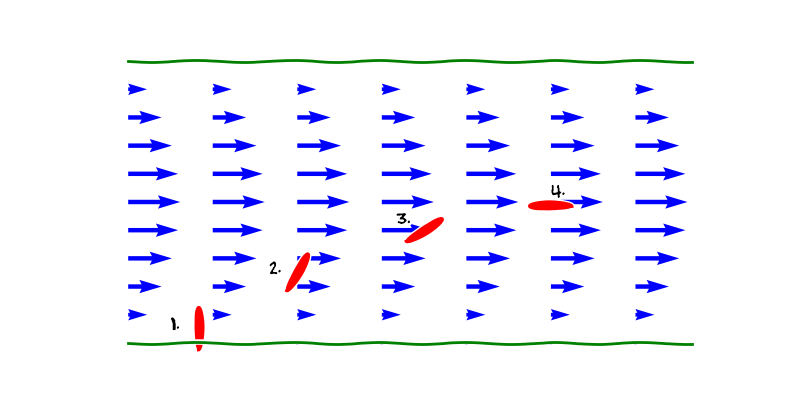
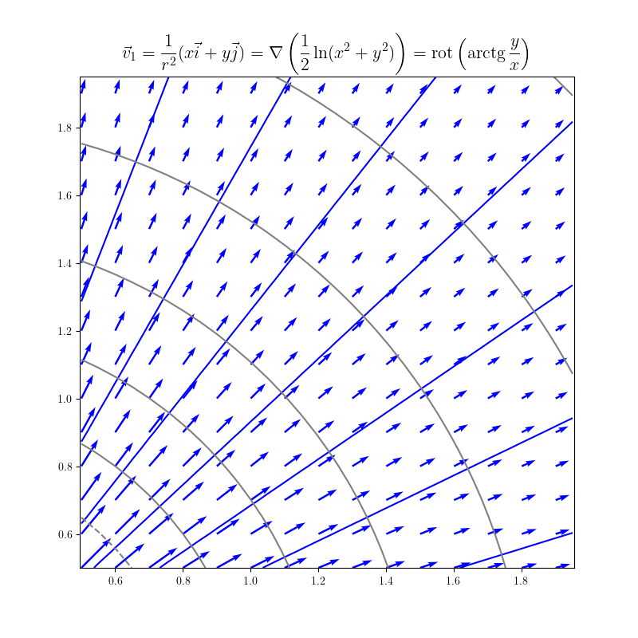
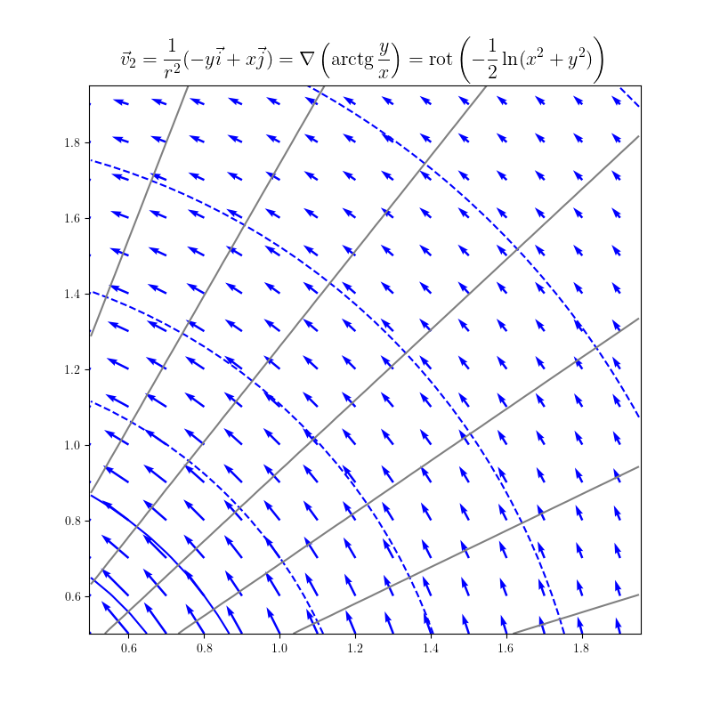
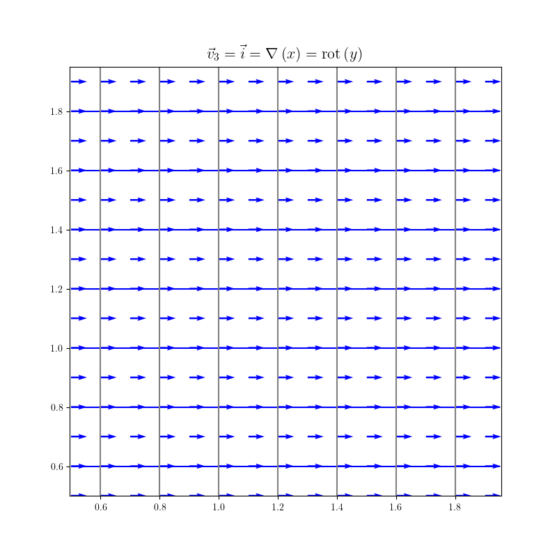
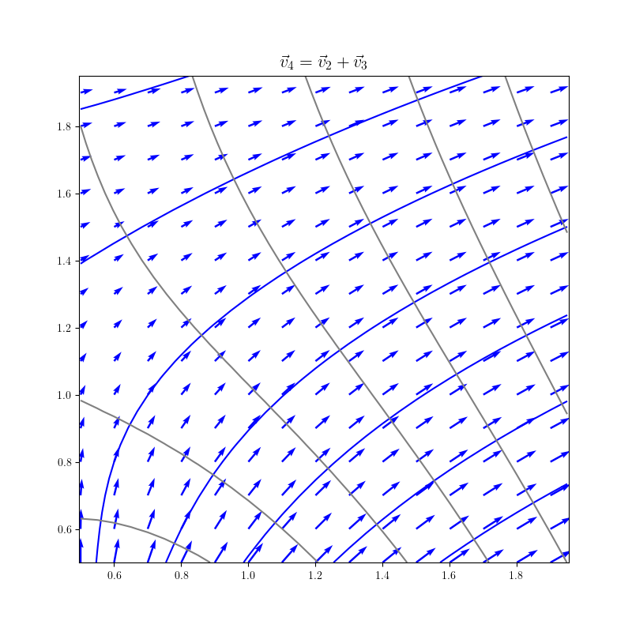

% Rotace vektorového pole
% Robert Mařík
% 2020

> Anotace.
>
> * Již nějakou dobu studujeme vektorová pole. V této přednášce si několik typických zkusíme vizualizovat. 
> * Seznámíme se s pojmy kmenová funkce, skalární potenciál, kmenová funkce. Tyto pojmy udávají, zda vektorové pole je či není možné obdržet jako výsledek výpočtu gradientu nějaké skalární funkce. Není to akademická otázka, ale odpověď má dalekosáhlé důsledky. Zjednodušeně řečeno, pokud je odpověď kladná, dají se některé úlohy místo ve vektorovém poli řešit v poli skalárním, což nese výrazné usnadnění.
> * S výše uvedenou problematikou souvisí pojem rotace vektorového pole, který si uvedeme jako další z diferenciálních operátorů vektorové analýzy.
> * Ukážeme si, že parciální derivace jsou vhodným nástrojem pro jakousi citlivostní analýzu. Seznámíme se v této souvislosti se zákonem šíření chyb.

> Prerekvizity.
>
> * I zde budeme pracovat s diferenciálními operátory. Je žádoucí umět spolehlivě derivovat.
> * Budeme počítat vektorový součin vektorů. Ten je nejsnazší počítat pomocí determinantů třetího řádu. Tuto dovednost tedy využijeme.

# Vektorová pole

* Studujeme funkce $\mathbb{R}^2\to\mathbb{R}^2$ nebo $\mathbb{R}^3\to\mathbb{R}^3$.
* Uspořádané dvojice nebo trojice na vstupu vektorového pole chápeme jako body v rovině nebo v prostoru. Uspořádané dvojice nebo trojice na výstupu chápeme jako vektory. Bodům v rovině nebo v prostoru jsou tedy přiřazeny vektory. Můžeme proto vektorové pole interpretovat jako rychlostní pole nebo silové pole. 
* 2D:  $\vec F:\mathbb {R}^2 \to \mathbb {R}^2$. Ve složkách píšeme
  $$ \vec F = (P, Q) = P\vec \imath + Q\vec \jmath,$$ kde $P$ a $Q$ jsou (skalární) funkce dvou proměnných.
* 3D: $\vec F:\mathbb {R}^3 \to \mathbb {R}^3$. Ve složkách píšeme
  $$ \vec F = (P, Q, R) = P\vec \imath + Q\vec \jmath + R\vec k,$$ kde $P$, $Q$ a $R$ jsou (skalární) funkce tří  proměnných.

# Příklady vektorových polí v rovině

https://youtu.be/KR42PRY-72U

* Předpis $$\vec F_1=(0,-1)=-\vec \jmath$$ definuje _homogenní pole_. Každý vektor je stejný (směr i velikost).
* Předpis $$\vec F_2=(x,y)=x\vec \imath+y\vec \jmath$$ definuje _radiální pole_. Každý vektor směřuje od počátku souřadnic.
* Předpis $$\vec F_3=(-y,x)=-y\vec \imath+x\vec \jmath$$ definuje _rotující pole_. Je kolmé na radiální pole. Každý vektor je tečný ke kružnici se středem v počátku souřadnic. [Nakreslit online.](https://sagecell.sagemath.org/?z=eJyr0KlUsFUoSyzSUK_QqVTX5OVKBPILcvJL4stSk0vyi-LTMlNzUjQ0gLKaOgpAStdYxxjEqoSxkvNz8ots1ZNySlNB-pOw69et1KnAb0BRagpIf3FGfrlGooK2QpKOQmJxAdCQ-KLEksx8W0NNAAglMj4=&lang=sage)
* Předpis $$\vec
  F_4=\frac{\vec F_2}{|\vec F_2|}=\frac{(x,y)}{\sqrt{x^2+y^2}}=\frac{x\vec \imath +y\vec \jmath}{\sqrt{x^2+y^2}}$$ definuje _radiální pole s konstantní velikostí vektorů_. Každý vektor směřuje od počátku
  souřadnic a má jednotkovou délku.
* Předpis $$\vec F_5=-\frac{\vec
  F_4}{x^2+y^2}=-\frac{x \vec \imath+y\vec \jmath}{(x^2+y^2)^{3/2}}$$ definuje _radiální pole ubývající s kvadrátem vzdálenosti od počátku a mířící
  do středu_. S druhou mocninou ve jmenovateli ubývá například  3D gravitační pole nebo elektrostatické pole generované
  hmotným bodem nebo koulí.
* Rychlost při proudění vazké tekutiny ubývá směrem ke
  stěnám. Tekutinu proudící doprava je možné pro $y\in [0,1]$
  modelovat vektorovým polem $$\vec F_6=(y(1-y),0)=y(1-y)\vec \imath.$$

# Totální diferenciál

https://youtu.be/nD_nqakTN-A

> Definice (totální diferenciál). Totálním diferenciálem funkce $z=f(x,y)$ v bodě $(x_0, y_0)$ nazýváme výraz
$$      \mathrm{d}f=
\nabla f (x_0,y_0) \cdot (\mathrm{d}x,\mathrm{d}y)=\frac{\partial f (x_0,y_0)}{\partial x}\mathrm{d}x+\frac{\partial f (x_0,y_0)}{\partial y}\mathrm{d}y.
$$

V souvislosti s totálním diferenciálem často vyvstává otázka, zda pro
zadané vektorové pole $$\vec F(x,y)=(P(x,y),Q(x,y))$$ existuje
skalární funkce $f$, jejímž gradientem je zadané vektorové pole $\vec
F$. Toto je důležitá otázka ve fyzice. Umožňuje rozhodnout, ke
kterému silovém poli je možno zavést potenciální energii.  Funkce $f$
se v tomto kontextu nazývá **skalární potenciál** vektorového pole $\vec F$
nebo také **kmenová funkce**.  Následující věta platí za
předpokladu dostatečně hladkých funkcí na otevřené množině.

>  Věta (nutná a postačující podmínka pro existenci kmenové funkce ve 2D).  Vektor   $$\vec F(x,y) = \left(   P(x,y) , Q(x,y)\right)$$ je gradientem nějaké funkce $f(x,y)$ právě tehdy, když platí   $$\frac{\partial }{\partial y}P(x,y)=\frac{\partial}{\partial x}Q(x,y).$$ 

Jeden směr implikace v předchozí větě je snadný a plyne hned ze Schwarzovy věty.

# Skalární a vektorový součin

Diferenciální operátor divergence jsme poznali v minulé přednášce v
souvislosti s difuzní rovnicí. Formálně jde o skalární součin operátoru $\nabla$ definovaného vztahem
$$\nabla=\left(\frac{\partial }{\partial x},\frac{\partial }{\partial
y},\frac{\partial }{\partial z}\right)$$ a vektorového pole.

Vektorovým součinem $\vec a \times \vec b$ vektorů $\vec
a=(a_1,a_2,a_3)$ a $\vec b=(b_1,b_2,b_3)$ rozumíme vektor 
\dm $$\vec a\times\vec b=\begin{vmatrix} \vec \imath & \vec \jmath &\vec k \\ a_1&a_2&a_3 \\ b_1& b_2& b_3\end{vmatrix}=(a_2b_3-a_3b_2)\vec\imath+(a_3b_1-a_1b_3)\vec\jmath+(a_1b_2-a_2b_1)\vec k.$$

# Rotace

https://youtu.be/ev3eFilaGpw

> Definice (rotace vektorového pole). Pro vektorovou funkci tří proměnných  $$\vec
  F=P\vec \imath+Q\vec \jmath+R\vec k$$ definujeme operátor _rotace_ vztahem
  $$
  \mathop{\mathrm{rot}} \vec F=\nabla \times \vec F=
  \begin{vmatrix}
    \vec \imath & \vec \jmath &\vec k\\
    \frac{\partial }{\partial x}   & \frac{\partial }{\partial y} &   \frac{\partial }{\partial z}\\ P &Q &R
  \end{vmatrix}.
  $$

* Výsledkem rotace je tedy vektorové pole, jehož komponenty jsou \dm$$\nabla \times \vec F=\left(\frac{\partial R}{\partial y}-\frac{\partial    Q}{\partial z}\right)\vec \imath +\left( \frac{\partial P}{\partial z}-\frac{\partial    R}{\partial x}\right)\vec \jmath + \left( \frac{\partial Q}{\partial x}-\frac{\partial    P}{\partial y}\right)\vec k.$$

manimp:Curl|Rotace vektorového pole pomocí Sarussova pravidla.

* Ve dvourozměrném vektorovém poli doplníme třetí komponentu nulovou. Rotace má potom první dvě komponenty nulové ($R=\frac{\partial Q}{\partial z}=\frac{\partial P}{\partial z}=0$). Třetí komponenta rotace dvourozměrného vektorového pole je nulová právě tehdy, když k tomuto vektorovému poli existuje skalární potenciál.
* Ve fyzice má důležité postavení vektorové pole s nulovou rotací. Je v něm totiž možno zavést potenciál a potenciální energii. Takové pole se nazývá **nevírové pole**.
* Představme si vektorové pole charakterizující rychlost proudící       tekutiny. Rotace udává, zda má pole tendenci uvést do rotace objekt unášený tímto prouděním. Jedná se o lokální charakteristiku a nesouvisí se směrem proudění. Rotace může být nulová i pro tok cirkulující okolo jednoho bodu (uvidíme níže). Naopak, pro to v přímce může být rotace nenulová. Příkladem je přímý tok v řece, kdy rychlost u břehu klesá. V důsledku toho se loďka, která odrazí od břehu kolmo stočí po proudu. Mimo středovou osu má pole nenulovou rotaci, i když ve všech bodech míří stejným směrem.  [Online výpočet.](https://sagecell.sagemath.org/?z=eJyNUUFuwyAQvEfKH1ZRUkNLWlz1yrWfqCOLxJAgYWNhkkKi_L1ALLvqqRzMDjO76531JJAru3CLCg8BrgVeLpYLiXx6xwxR4p9RufX4pXz7IDSzvlUdAd9yTyDkOMQYGFACJcnfJGvURTLUKCmR_KI7EmuMoNyRMIH3XWyEXwfV9lrJUMuz1ij2OZytnv8D5tQr3s6pAROYkZ8omnQTRZNwO5fwGPIkw8l8o5NrNbKrdbUXR9XduFbHTjR3qC7iAJ9PDDYDVBVUywUAVC13J9Pf8m3bWxzyfv-X0ho3KYElpeiaqdt6tclZSHMnPIqDszg6S8uJ7hB4PCdL_zIjNdr1m4snDdlr4-rY1xlbSyV0g7Ij2VqKSTJkjGO1GOX1pu0mGEjecHhAPvSxTm25U4bFVR-MNpYVe30WBf4BTyS0Gg==&lang=sage&interacts=eJyLjgUAARUAuQ==)
* Pozor: anglický výraz pro rotaci je "curl".

> Poznámka (linearita rotace). Rotace zachovává součet a násobení konstantou, tj. pro libovolné vektorové funkce $\vec F$ a $\vec G$ a konstantu $c$ platí
> $$\nabla \times (\vec F+\vec G)=\nabla \times \vec F +\nabla \times \vec G, \qquad \nabla \times (c\vec F)=c\nabla \times \vec F.$$

<!-- 	 -->

# Rotace významných polí

https://youtu.be/JChhJ4nDAtw

* Dostředivé pole ubývající s libovolnou mocninou vzdálenosti má nulovou rotaci. Pro $$\vec F(x,y)=-\frac{x\vec \imath +y \vec \jmath}{(x^2+y^2)^n}$$ platí $$\nabla\times \vec F(x,y)=0.$$ [Online výpočet.](https://sagecell.sagemath.org/?z=eJyr0KnUybMtSyzSUK9QqFTIU9fk5XLTqNCp1LTV0K3Q16iIM9KujDPSjMvT0a1E4RoAVRZn5JdrQJTDeBoKKZlpaRpu0YaxYHGdCk1dqIgBVKRSU0FTrzgztyAnM60yPq00J0cDKAIAmQYn8A==&lang=sage)

* Rotace pole kolmého na dostředivé pole závisí na mocnině, se kterou toto pole ubývá. Pro $$\vec F(x,y)=\frac{-y\vec \imath +x\vec \jmath}{(x^2+y^2)^n}$$ platí $$\nabla\times \vec F(x,y)=-\frac{2(n-1)}{(x^2+y^2)^n}\vec k.$$ Pro různé $n$ toto pole cirkuluje okolo počátku proti směru hodinových ručiček. Rotace (ve smyslu operátoru rotace) však může být kladná i záporná, což je určeno znaménkem výrazu $n-1$. Pokud bychom takovým polem nechali unášet drobný míček, v jednom případě by jej pole otáčelo po směru a v jiném případě proti směru hodinových ručiček. Pro $n=1$ by se míček neroztočil okolo vlastní osy vůbec, rotace je nulová. [Online výpočet.](https://sagecell.sagemath.org/?z=eJyr0KnUybMtSyzSUK9QqFTIU9fk5XLTqNCp1LTV0K3U16iIM9KujDPSjMvTqUDhGQAVFmfkl2tAVMN4GgopmWlpGm7RhrFgcZ0KTV2oiAFUpFJTQVOvODO3ICczrTI-rTQnRwMoAgB8XCfD&lang=sage) [Nakreslit online.](https://sagecell.sagemath.org/?z=eJztVNFOwjAUfV-yf7iJmLWzDIEXQjL_AoIhxJRRsLHrZtdp-_e2hQVZUJ-N3jXr3T1n3d3pSXlZV0qDbMvaAm1A1nHEj7WS6lpUWvBtVlufebwWOo78teeH3D1kbm4VQ2OCZmSGMcQRNZCDK2eHgiIcR55lXoqdz-PIlFwSMCU1BGzIbRneGE4JuBEmT3SI4CXXDhqPJgTus3EcNc_VO3rWpUDJQOa3zSC5FVQzgyTGYfkd28Nub5AhFs9BMd0qCWhoR8ik6eTOuhtOU4k7pu0xzXXii2KN4PqCfCY-hEZP3xeaupbvs0kcrcgjWZBlvt6QbgTpKgUGuHRiZ1RReWDosyphCTyPI3DhufaSe1atx_XBe72eER-ru3xtNpe1R1ezvdrC1ToVe9AyQLaDjtv72vI3ptDpfwkUlahUnmwT7O2QNUw_0aZmhUYJe22pSAgkO6qp0y05OSTsbJDw5npMj777bAsCYy_zj6b4DbbwGhRif5Tg3yHfOuQLj_Ts4c6MSTb9t8efsscHFNPTYw==&lang=sage)

<!--
# Rotace gradientu je nulový vektor

Buď $\varphi(x,y,z):\mathbb{R}^3\to\mathbb{R}^3$ skalární funkce a buď $\vec F(x,y,z)=\nabla \varphi(x,y,z)$. Vypočtěte $\nabla\times\vec F$.

*Řešení.* 
$$\begin{aligned}
\vec F
&=\left( \frac{\partial\varphi}{\partial x},\frac{\partial\varphi}{\partial y},\frac{\partial\varphi}{\partial z}\right)\\
\nabla\times\vec F
&=\begin{vmatrix}
    \vec \imath & \vec \jmath &\vec k\\
    \frac{\partial }{\partial x}   & \frac{\partial }{\partial y} &   \frac{\partial }{\partial z}\\
\frac{\partial\varphi}{\partial x} &\frac{\partial\varphi}{\partial y} &\frac{\partial\varphi}{\partial z}
\end{vmatrix}
\\&=
\vec \imath \left( \frac{\partial}{\partial y}\frac{\partial\varphi}{\partial z} - \frac{\partial}{\partial z}\frac{\partial\varphi}{\partial y} \right)
+
\vec \jmath \left( \frac{\partial}{\partial z}\frac{\partial\varphi}{\partial x} - \frac{\partial}{\partial x}\frac{\partial\varphi}{\partial z} \right)
\\&\quad +
\vec k \left( \frac{\partial}{\partial x}\frac{\partial\varphi}{\partial y} - \frac{\partial}{\partial y}\frac{\partial\varphi}{\partial x} \right)
\end{aligned}
$$
Podle Schwarzovy věty (nezáleží na pořadí derivování) je každá závorka rovna nule. Proto platí $\nabla\times\vec F=0$.

>  Věta (rotace gradietu). Rotace gradientu je nulový vektor.

Později uvidíme, že platí do jisté míry i obrácená vlastnost: pokud je
rotace vektorového pole nulová, je toto pole gradientem nějaké
skalární veličiny. Pokud při proudění tekutiny má pole rychlosti
nulovou rotaci (většinou platí pro relativně malé rychlosti), je možné pro toto pole zavést tzv. rychlostní
potenciál ([velocity
potential](https://en.wikipedia.org/wiki/Velocity_potential)). To je
na rozdíl od rychlosti veličina, která není vektorová a proto se s ní
lépe pracuje.

# Divergence rotace je nula

Buď $\vec F:\mathbb{R}^3\to\mathbb{R}^3$ hladké vektorové pole. Vypočtěte $\nabla \cdot (\nabla \times \vec F)$

*Řešení.* $$\vec F=P\vec \imath+Q\vec \jmath + R\vec k$$

 \dm  $$  \nabla\times\vec F=\nabla \times \vec F=  \begin{vmatrix}    \vec \imath & \vec \jmath &\vec k\\    \frac{\partial }{\partial x}   & \frac{\partial }{\partial y} &   \frac{\partial }{\partial z}\\ P &Q &R  \end{vmatrix}  =\left(\frac{\partial R}{\partial y}-\frac{\partial    Q}{\partial z}\right)\vec \imath +\left( \frac{\partial P}{\partial z}-\frac{\partial    R}{\partial x}\right)\vec \jmath + \left( \frac{\partial Q}{\partial x}-\frac{\partial    P}{\partial y}\right)\vec k.$$

Použijeme definici divergence, větu o derivaci součtu a přeskupíme sčítance.
  $$
\begin{aligned}  \nabla\cdot (\nabla\times \vec F )&=
\frac{\partial }{\partial x}\left(\frac{\partial R}{\partial y}-\frac{\partial
    Q}{\partial z}\right) +
    \frac{\partial }{\partial y}\left( \frac{\partial P}{\partial z}-\frac{\partial
    R}{\partial x}\right) +
    \frac{\partial }{\partial z} \left( \frac{\partial Q}{\partial x}-\frac{\partial
    P}{\partial y}\right)
\\
  &=\frac{\partial }{\partial x}\frac{\partial R}{\partial y}
  - \frac{\partial }{\partial x}   \frac{\partial
    Q}{\partial z}
    +\frac{\partial }{\partial y} \frac{\partial P}{\partial z}- \frac{\partial }{\partial y}\frac{\partial
    R}{\partial x} + 
\frac{\partial }{\partial z} \frac{\partial Q}{\partial x}-\frac{\partial }{\partial z}\frac{\partial
    P}{\partial y}
\\
  &=\frac{\partial }{\partial x}\frac{\partial R}{\partial y}
    - \frac{\partial }{\partial y}\frac{\partial R}{\partial x}
    +\frac{\partial }{\partial y} \frac{\partial P}{\partial z}
    -\frac{\partial }{\partial z}\frac{\partial P}{\partial y}
    + \frac{\partial }{\partial z} \frac{\partial Q}{\partial x}
    - \frac{\partial }{\partial x}   \frac{\partial Q}{\partial z}
    \end{aligned}$$  

Podle Schwarzovy věty platí
$$
\frac{\partial }{\partial x}\frac{\partial R}{\partial y} = \frac{\partial }{\partial y}\frac{\partial R}{\partial x}
$$
$$
\frac{\partial }{\partial x}\frac{\partial Q}{\partial z} = \frac{\partial }{\partial z}\frac{\partial Q}{\partial x}
$$
$$
\frac{\partial }{\partial y}\frac{\partial P}{\partial z} = \frac{\partial }{\partial z}\frac{\partial P}{\partial y}
$$

Odsud dostáváme 
  $$
  \nabla\cdot (\nabla \times  \vec F ) 
 =0.$$

> Věta (divergence rotace). Divergence rotace je nula. 

Dá se ukázat, že platí do jisté míry i opačná vlastnost a pro pole s
nulovou divergencí se dá často toto pole psát jako rotace nějaké
vektorové funkce. Této funkci se říká [vektorový
potenciál](https://en.wikipedia.org/wiki/Vector_potential) a je dobře
známa například u magnetismu. U rovinného proudění tekutin má tento
vektorový potenciál nenulovou jenom třetí složku, která se nazývá
proudová funkce ([stream
function](https://en.wikipedia.org/wiki/Stream_function#Definition_by_use_of_a_vector_potential))
a její vrstevnice jsou proudnice.

\iffalse

Na následujících obrázcích jsou modrou barvou vrstevnice proudové funkce a šedou barvou vrstevnice rychlostního potenciálu.

\fi

-->

# Zákon šíření chyb  (chyba nepřímo měřené veličiny)

https://youtu.be/52W524bSOKQ

\iffalse 

manimp:Chyby|Zákon šíření chyb využívá derivaci ke zjištění, jak funkční hodnota reaguje na změny ve vstupních datech.

\fi

Některé veličiny neměříme přímo, ale vypočítáváme z jiných naměřených veličin. Takové veličiny se nazývají nepřímo měřené veličiny.

* Předpokládejme, že měříme nepřímo veličinu $f$ tak, že měříme veličiny
$x_1$, $x_2$, $\dots$, $x_n$ a hodnotu veličiny $f$ určíme pomocí vzorce
$f(x_1, x_2, \dots, x_n)$. 
* Měření každé z veličin je zatíženo
chybou. Je-li chyba veličiny $x_i$ rovna $\Delta x_i$, způsobí tato
odchylka to, že chyba veličiny $f$ bude (v souladu se vzorcem pro lineární aproximaci)
přibližně
$$
  \Delta f\approx \left|\frac{\partial f}{\partial x_i}\Delta x_i\right|
$$
* Celkovou chybu veličiny $f$ můžeme určit sečtením chyb způsobených
jednotlivými veličinami $x_i$. Častěji se však používá následující vzorec
\dm $$  \Delta f(x_1,x_2,\dots x_n)\approx\sqrt{\left(\frac{\partial f}{\partial x_1}\Delta x_1\right)^2+\left(\frac{\partial f}{\partial x_2}\Delta x_2\right)^2+\cdots+\left(\frac{\partial f}{\partial x_n}\Delta x_n\right)^2}$$
označovaný **zákon šíření chyb**.

# Zákon šíření chyb (příklad)

\iffalse 

\fi

Kanadský empirický vzorec pro pocitovou teplotu v zimě ([wind-chill
factor](https://en.wikipedia.org/wiki/Wind_chill)) je $$W(T,v) =
13.12+0.6215 T-11.37 v^{0.16}+0.3965 T v^{0.16},$$ kde $T$ je teplota
(ve stupních Celsia) a $v$ je rychlost větru (v km/hod). Teplota byla
změřena $-11.0\,{}^\circ\!\text{C}$ s chybou $0.2\,{}^\circ\!\text{C}$ a rychlost $26
\,\text{km/hod}$ s chybou $5\,\text{km/hod}$. S využitím zákona šíření
chyb určíme, jaký vliv mají nepřesnosti v měření na nepřesnost
vypočítané veličiny.

Dosazením do vzorce dostáváme $W(-11,26)=-20.212\,{}^\circ\!\text{C}$. Derivováním dostáváme
$$\begin{aligned}\frac{\partial W}{\partial T}(T,v)&=0.6215+0.3965 v^{0.16},\\
\frac{\partial W}{\partial v}(T,v)&=-11.37\times 0.16 v^{-0.84}+0.3965 \times 0.16 Tv^{-0.84}
\end{aligned}
$$
a po dosazení 
$$\begin{aligned}\frac{\partial W}{\partial T}(-11,26)&=1.289,\\
\frac{\partial W}{\partial v}(-11,26)&=-0.163 \,{}^\circ\!\text{C}\, \text{hod}/\mathrm{km}.
\end{aligned}
$$
Za dané teploty a rychlosti větru způsobí nárůst teploty o jeden
stupeň nárůst pocitové teploty přibližně o $1.3$ stupně. Podobně,
zesílení větru o jeden kilometr za hodinu způsobí snížení pocitové
teploty přibližně o $0.16$ stupně.
Ze zákona šíření chyb dostáváme pro chybu pocitové teploty (dosazováno bez jednotek)
$$\Delta W=\sqrt{\left(1.289\times 0.2\right)^2+\left(-0.163\times 5\right)^2}=0.85\,{}^\circ\!\text{C}.$$
Pocitová teplota je tedy $W=-20.2\,{}^\circ\!\text{C}\pm 0.9\,{}^\circ\!\text{C}$.

\iffalse

* [Online výpočet Sage.](https://sagecell.sagemath.org/?z=eJx1jEEKgzAQRfeCdxA3zqgJJmJKF7nFgItSoTQVXFTbVOb8jUitXXT3_3t_hi8eMio5wzhqIQS0qpZKF5U0WjU5CaVkfci5g0oqg4HXRxP4RuLIkW2lG_oeCIGtNiXZcIZ5JXWw_LH8a5s4evhhnBNoV56sAjeeCiHSb3W0y_x39nr6GZZxp4tl1-ndS75d58nDyVHp-IxynPwdEN_qCUOs&lang=sage&interacts=eJyLjgUAARUAuQ==)
* [Online výpočet Python.](https://gist.github.com/robert-marik/7bdb6817bde21432434ca8877a49bd56)

\fi 

<!--
\iffalse

# Mocnina se kterou ubývá nezřídlové vektorové pole (1/2)

Pro jaké $n$ má vektorové pole 
$$\vec F=\frac{1}{(x^2+y^2+z^2)^n} (x,y,z)$$
nulovou divergenci?

*Řešení.* Použijeme variantu vzorce pro derivaci součinu ve tvaru 
$$\nabla(f\vec G)=f\nabla\vec G +\vec G\nabla f.$$

Pro $f=\frac{1}{(x^2+y^2+z^2)^n}$ dostáváme
$$\frac{\partial f}{\partial x}=-n(x^2+y^2+z^2)^{-n-1}2x=-\frac {2nx}{(x^2+y^2+z^2)^{n+1}}$$
a analogicky dostaneme derivace podle dalších proměnných, tj. 
$$\frac{\partial f}{\partial y}=-\frac {2ny}{(x^2+y^2+z^2)^{n+1}}$$
a
$$\frac{\partial f}{\partial z}=-\frac {2nz}{(x^2+y^2+z^2)^{n+1}}.$$
Odsud dostáváme gradient $$\nabla f= -\frac {2n}{(x^2+y^2+z^2)^{n+1}} (x,y,z).$$

# Mocnina se kterou ubývá nezřídlové vektorové pole (2/2)

Pro $\vec G=(x,y,z)$ dostáváme snadno divergenci $\nabla \vec G = 1+1+1=3$.

Odsud
$$\begin{aligned}\nabla \vec F & = \nabla(f\vec G) \\&= \frac {1}{(x^2+y^2+z^2)^n} 3 - (x,y,z)  \frac {2n}{(x^2+y^2+z^2)^{n+1}} (x,y,z) 
 \\&= \frac {3}{(x^2+y^2+z^2)^n} -   \frac {2n (x^2+y^2+z^2)}{(x^2+y^2+z^2)^{n+1}}
\\&= \frac {3-2n}{(x^2+y^2+z^2)^n}.
\end{aligned}$$

Divergence je nulová pro $n=\frac 32.$ V tomto případě máme $$\vec
F=\frac{1}{x^2+y^2+z^2} \cdot \frac{(x,y,z)}{\sqrt{x^2+y^2+z^2}}$$ a
velikost vektorového pole je nepřímo úměrná druhé mocnině vzdálenosti
od počátku.

* Není náhoda, že v našem trojrozměrném světě ubývá gravitační a
  elektrická síla nepřímo úměrně druhé mocnině vzdálenosti.
* Postavy ve 2D světě mohou takto objevit existenci třetího rozměru
  (viz román Flatland nebo Simpsonovi a [Homer
  3D](https://www.youtube.com/watch?v=wjJI0VlaSLg)). Pozorovaný
  gravitační zákon by nesouhlasil s teoretickými výpočty. Náš 3D
  gravitační zákon je v pořádku, což víme například ze studia pohybu
  planet.

# Shrnutí diferenciálních operátorů

* **Skalární funkce $f(x,y,z)$**

|Operátor        |Výpočet                                                                         |
|----------------|------------------------------------------------------------------------------------|
| Gradient | $\mathop{\mathrm{grad}} f=\nabla f=\left(\frac{\partial f}{\partial x}, \frac{\partial f}{\partial y} , \frac{\partial f}{\partial z} \right)$ |
| Totální diferenciál |  $\mathrm{d}f =\nabla f\cdot(\mathrm{d}x, \mathrm{d}y, \mathrm{d}z)     =\frac{\partial f}{\partial x}\mathrm{d}x+\frac{\partial f}{\partial y}\mathrm{d}y+ \frac{\partial f}{\partial z} \mathrm{d}z$|
|Laplaceův operátor | $\nabla^2 f=\nabla \cdot(\nabla f)=\frac{\partial^2 f}{(\partial x)^2} + \frac{\partial^2 f}{(\partial y)^2}+ \frac{\partial^2 f}{(\partial z)^2}$ |
| Lin. aproximace | $f(x,y,z)\approx f(x_0,y_0,z_0)+\nabla f(x_0,y_0,z_0)\cdot(x-x_0, y-y_0, z-z_0)$ |

* **Vektorová funkce $\vec F(x,y,z)=P(x,y,z)\vec \imath+Q(x,y,z)\vec \jmath + R(x,y,z)\vec k$**

|Operátor        |Výpočet                                                                         |
|----------------|------------------------------------------------------------------------------------|
| Divergence | $\mathop{\mathrm{div}}\vec F=\nabla\cdot\vec F=\frac{\partial P}{\partial x}+\frac{\partial Q}{\partial y}+\frac{\partial R}{\partial z}$ |
| Rotace | ${  \mathop{\mathrm{rot}} \vec F=\nabla \times \vec F=   \begin{vmatrix}     \vec \imath & \vec \jmath &\vec k\\     \frac{\partial }{\partial x}   & \frac{\partial }{\partial y} &   \frac{\partial }{\partial z}\\ P &Q &R   \end{vmatrix}}$ |

* Případy pro jiný počet proměnných a jiné dimenze vektorů dostaneme
  analogicky, s výjimkou rotace.
* Rotace má smysl pouze pro trojrozměrné
  vektory. Někdy však může být užitečné přidat k dvourozměrnému vektoru
  třetí komponentu, která je nulová.
* Někdy je možné se setkat i s aplikací operátorů definovaných pro
  skalární funkce (derivace, gradient, Laplaceův operátor) na vektorové
  funkce. V tomto případě je touto operací zamýšlena aplikace na
  každou složku vektoru samostatně a takový zápis představuje tři
  nezávislé rovnice zapsané v jedné vektorové rovnici. Příkladem je Navierova-Stokesova rovnice níže.

# Popis pole

Následující popis je pro jednoduchost a konkrétnost proveden pro
gravitační pole. Je však plně obecný, pokud odpovídajícím způsobem
nahradíme příslušné veličiny a charakteristiky objektů.

* Skalární pole
    - Gravitační pole je úplně popsáno potenciálem (skalární veličina
      udávající potenciální energii tělesa o jednotkové hmotnosti)
    - Intenzita gravitačního pole je gradientem potenciálu vynásobeným
      číslem $-1$. (Intenzita gravitačního pole je síla působící v
      daném místě pole na objekt o jednotkové hmotnosti.)

* Vektorové pole  
    - Gravitační pole je úplně popsáno intenzitou gravitačního pole.
    - Potenciál gravitačního pole je možné ze zadané intenzity počítat hledáním totálního diferenciálu zpětným integrováním nebo pomocí křivkového integrálu druhého druhu (viz později v semestru).

# Ukázky použití - rovnice matematické fyziky 1/2

#### *Rovnice kontinuity* 

Zákon zachování veličiny která může vznikat, zanikat a téct, veličina
$\rho$ vyjadřuje prostorovou hustotu a $\vec \jmath$ tok a $s$ intenzita
zdrojů a spotřebičů. Jejími některými makroskopickými důsledky jsou
první Kirchhofův zákon nebo rovnice spojitosti v hydrodynamice.

$$    
\frac{\partial\rho}{\partial t}+\nabla \vec \jmath=s
$$

#### *Rovnice difuze, rovnice vedení tepla* 

Tato rovnice rovněž vystihuje chování difundující látky v trojrozměrné
oblasti. Jedná se vlastně o rovnici kontinuity doplněnou o předpoklad,
že intenzita toku je úměrná gradientu. Nejjednodušší tvar má tato
rovnice v homogenním izotropním prostředí.

$$
  \frac{\partial u}{\partial t}-D\nabla^2 u=\sigma
$$

Rovnice difuze se může týkat i popisu jiné veličiny, než veličiny
bezprostředně spojené s pohybem látkového prostředí. Například takto
můžeme sledovat vedení tepla, nebo při zpracování fotografí změny v
jasu sousedních bodů.

Všimli jste si, že sice existují zvířata, jejichž srst má skvrny na
těle a pruhy na ocase, ale žádné zvíře nemá kresbu srsti naopak? Pokud
má srst zvíře pruhy na těle, je pruhovaný i ocas. I toto plyne z
rovnice difuze.

#### *Navierova-Stokesova rovnice*

Rovnice popisující proudění viskozní Newtonovské tekutiny. Jeden z
[Millennium Prize
Problems](http://en.wikipedia.org/wiki/Millennium_Prize_Problems).

$$ 
\frac{\partial \vec v}{\partial t}+(\vec v\cdot \nabla) \vec v
  =g-\frac{\nabla p}{\rho}+\mu\nabla^2\vec v 
$$

# Ukázky použití - rovnice matematické fyziky 2/2

#### *Maxwellovy rovnice* 

Úplně popisují elektromagnetické vlnění. Jejich důsledkem jsou
(přidáme-li materiálové vztahy) například zákon odrazu a lomu světla,
polarizace světla.

$$
\begin{aligned}
      \mathop{\mathrm{div}}\vec E&=\frac{\rho}{\epsilon_0}&&&
      \mathop{\mathrm{div}} \vec B&=0\\
      \mathop{\mathrm{rot}}\vec E&=-\frac{\partial \vec B}{\partial t}&&&
      \mathop{\mathrm{rot}}\vec B&=\mu_0\vec \jmath+\mu_0\epsilon_0\frac{\partial\vec E}{\partial t}
\end{aligned}
$$

#### *Vlnová rovnice* 

Popisuje vlnění, stojaté i postupné vlny. Pro elektromagnetickou vlnu
jde rovnice odvodit z Maxwellových rovnic.

$$
\frac 1{c^2}\frac{\partial^2 z}{\partial t^2}=\nabla^2 z
$$

#### *Schrödingerova rovnice* 

Základní rovnice kvantové mechaniky, popisuje chování částice v
potenciálovém poli $V$, řešením je vlnová funkce částice $\psi$.

$$
  i\hbar\frac{\partial\psi}{\partial t} = -\frac{\hbar}{2m}\nabla^2 \psi +V\psi 
$$

\fi

# Shrnutí vzorců pro výpočty

|Úloha                                                          |Postup                                                                              |
|---------------------------------------------------------------|------------------------------------------------------------------------------------|
|Najdi směr kolmý na vrstevnice funkce $f(x,y)$ v bodě $(x_0,y_0)$.| $\nabla f(x_0,y_0)$ |
|Najdi tečnu k vrstevnici funkce $f(x,y)$ v bodě $(x_0,y_0)$.| $\nabla f(x_0,y_0)\cdot(x-x_0,y-y_0)=0$ |
|Najdi tečnu k funkci dané implicitně rovnicí $f(x,y)=0$ v bodě $(x_0,y_0)$.| Totéž co předchozí případ. Musí navíc platit $f(x_0,y_0)=0$.|
|Najdi tečnou rovinu ke grafu funkce $f(x,y)$ v bodě $(x_0,y_0)$.| $z=f(x_0,y_0)+\nabla f(x_0,y_0)\cdot(x-x_0,y-y_0)$ |
|Najdi lineární aproximaci funkce $f(x,y)$ v okolí bodu $(x_0,y_0)$.| $f(x,y)\approx f(x_0,y_0)+\nabla f(x_0,y_0)\cdot(x-x_0,y-y_0)$ |
|Je $M\mathrm{d}x+N\mathrm{d}y$ totální diferenciál?| Platí následujíci vztah? $\frac{\partial M}{\partial y}=\frac{\partial N}{\partial x}$|
|Je možno psát funkci $\varphi(x,y)$ ve tvaru $f(x)g(y)$ pro vhodné funkce $f$ a $g$?|Platí následujíci vztah? $\varphi \frac{\partial^2 \varphi}{\partial x \partial y}-\frac{\partial \varphi}{\partial x}\frac{\partial \varphi}{\partial y}=0$|

Použité označení:

* Výraz $\nabla f(x_0,y_0)$ je gradient v bodě $(x_0, y_0)$. Je nutno zderivovat funkci $f$, sestavit gradient v bodě $(x,y)$ a dosadit $x=x_0$ a $y=y_0$.
* Operace $(a,b)\cdot (c,d)=ac+bd$ je skalární součin vektorů.

# Proč je gradient kolmý na vrstevnice?

Buď $z=f(x,y)$ funkce dvou proměnných a $\nabla f(x,y)$ její
gradient. Odvodíme vztah mezi vrstevnicemi a gradientem.

* Uvažujme bod $[x_0,y_0, f(x_0,y_0)]$ na grafu funkce $f(x,y)$ a vrstevnici
  procházející bodem $[x_0,y_0]$. Tuto vrstevnici napíšeme jako parametrickou
  křivku $$\begin{aligned}x&=x(t)\\y&=y(t)\end{aligned}$$
* Složená funkce $$F(t)=f(x(t),y(t))$$ je podél naší křivky konstantní
  (křivka je vrstevnicí a podél vrstevnice jsou konstantní funkční
  hodnoty)
* Platí $$\frac{\mathrm{d}F}{\mathrm{d}t}=0$$
  (derivace konstantní funkce je nula)
* Platí $$\frac{\mathrm{d}F}{\mathrm{d}t}= \frac{\partial f}{\partial x}\frac{\mathrm{d}
  x}{\mathrm{d} t}+\frac{\partial f}{\partial y}\frac{\mathrm{d}
  y}{\mathrm{d} t} $$ (derivace složené funkce více proměnných)
* Platí 
  $$\begin{aligned}0=\frac{\mathrm{d}F}{\mathrm{d}t}&=
  \left(\frac{\partial f}{\partial x}, \frac{\partial f}{\partial
  y}\right)\cdot\left(\frac{\mathrm{d} x}{\mathrm{d} t},
  \frac{\mathrm{d} x}{\mathrm{d} t}\right) \\&= \nabla
  f(x,y)\cdot(x'(t),y'(t))\end{aligned}$$ (derivace konstanty z
   předešlého bodu, definice sklárního součinu, definice gradientu,
   zkrácené označení pro derivace funkce
  jedné proměnné)
* Vektory $\nabla f(x,y)$ a $(x'(t),y'(t))$ jsou kolmé (jejich
  skalární součin je nula). Zbývá zjistit, jak vypadá vektor
  $(x'(t),y'(t))$.

-----

### Vztah mezi gradientem a vrstevnicemi

Z předchozího plyne

* Gradient je kolmý na vektor $(x'(t),y'(t))$
* Vektor $(x'(t),y'(t))$ je tečný k vrstevnici

Tedy gradient v daném bodě je kolmý na vrstevnici procházející tímto
bodem.

# Implicitně definovaná funkce 

Mějme funkci $f(x,y)$ dvou proměnných a její vstevnici na úrovni $C$
$$f(x,y)=C. \tag{1}$$ Tato rovnice za jistých okolností může definovat $y$
jako funkci proměnné $x$. Pokusíme se najít derivaci této funkce. K
tomu uvažujme bod $(x_0,y_0)$ ležící na této vrstevnici,
tj. $f(x_0,y_0)=C$.

* Rovnice tečné roviny v bodě $(x_0,y_0)$ je
  $$ z=f(x_0,y_0)+\nabla f(x_0,y_0)\cdot (x-x_0,y-y_0).$$
* Řez grafu rovinou $z=f(x_0,y_0)$ je vrstevnice na úrovni $C$, řez tečné roviny je tečna k vrstevnici v rovině $z=C$. Rovnice této tečny je 
  $$ C=f(x_0,y_0)+\nabla f(x_0,y_0)\cdot (x-x_0,y-y_0),$$
  tj.
  $$ 0=\nabla f(x_0,y_0)\cdot (x-x_0,y-y_0),$$

 

<a href="animation.gif" rel="facebox" alt="Nahrava se ...">Animace</a>

# Implicitně definovaná funkce  (pokračování)

* Normálový vektor tečny je 
  $$ \nabla f(x_0,y_0)=\left(\frac{\partial f}{\partial x}(x_0,y_0), \frac{\partial f}{\partial y}(x_0,y_0)\right),$$
  k němu kolmý je vektor
  $$ \left(-\frac{\partial f}{\partial y}(x_0,y_0), \frac{\partial f}{\partial x}(x_0,y_0)\right)$$
  a po znormování první kompenty dostáváme směrový vektor tečny ve tvaru 
  $$ \left(1, -\frac{\frac{\partial f}{\partial x}(x_0,y_0)}{\frac{\partial f}{\partial y}(x_0,y_0)}\right).$$
  Druhá komponenta tohoto vektoru je derivací funkce, která je dána implicitně rovnicí (1).
  To vše za podmínky, že první komponenta normálového vektoru je nenulová.
* Poznámka: bez újmy na obecnosti většinou při definici implicitní funkce bereme $C=0$. Vskutku,
  pokud definujeme $g(x,y)=f(x,y)-C$, potom je možno rovnici
  vrstevnice funkce $f$ na úrovni $C$ přepsat do tvaru $$g(x,y)=0. $$

 

# Implicitně definovaná funkce  (závěr)

>  **Věta o implicitní funkci**: Uvažujme funkci $f(x,y)$ dvou proměnných, splňující v nějakém bodě
>  $(x_0, y_0)$ podmínku $f(x_0, y_0)=0$ a mající v okolí bodu $(x_0,
>  y_0)$ spojité parciální derivace.
>  Rovnice $$f(x,y)=0$$ vrstevnice na úrovni $0$ popisuje křivku
>   procházející bodem $(x_0, y_0)$.
>
> * Platí-li $$\frac{\partial f}{\partial y}(x_0, y_0)\neq 0,$$ je rovnicí
>    $f(x,y)=0$ v okolí bodu $(x_0, y_0)$ implicitně určena
>    **právě jedna spojitá funkce** $y=g(x)$ (tj. vrstevnice je
>    v okolí bodu $(x_0, y_0)$ grafem nějaké spojité funkce $g$).
> * Funkce $g$ z předchozího bodu **má v $x_0$ derivaci**
>   $$
>      g'(x_0)=-\frac{\frac{\partial f}{\partial x}(x_0, y_0)}{\frac{\partial f}{\partial y}(x_0, y_0)}.
>   $$

 

# Separace proměnných

Některé funkce dvou proměnných je možno zapsat jako součin dvou funkcí
jedné proměnné, například $\varphi(x,y)=\sin(x^2+1)\frac{\ln y}{y}$. U některých funkcí toto možné není, například funkce
$\varphi(x,y)=x^2-y^2$. Pomocí parciálních derivací je možno podat
jednoduchou charakterizaci všech funkcí, majících výše uvedenou
vlastnost.

>  **Věta**: Nechť funkce dvou proměnných $\varphi(x,y)$ je nenulová na konvexní
>  oblasti $G$ a má zde spojité všechny parciální derivace do řádu dva,
>  včetně.  Funkci $\varphi(x,y)$ je možno zapsat ve tvaru
>  $\varphi(x,y)=f(x)g(y)$, kde $f$ a $g$ jsou vhodné funkce jedné
>  proměnné právě tehdy, když je na množině $G$ nulový výraz 
>  $$
>    \varphi(x,y)\frac{\partial^2 \varphi (x,y)}{\partial y\partial x}-\frac{\partial \varphi (x,y)}{\partial x\vphantom{y}}\frac{\partial \varphi (x,y)}{\partial y}
>  $$
>   tj. pokud na množině $G$ platí $$\begin{vmatrix}\varphi & \frac {\partial \varphi}{\partial x}\\ \frac {\partial \varphi}{\partial y} &
> \frac {\partial^2 \varphi}{\partial x\partial y}\end{vmatrix}=0$$

 Naznačíme část důkazu. Pokud platí $$\varphi(x,y)=f(x)g(y),$$ je
  $$\ln \varphi(x,y)=\ln(f(x))+\ln(g(y)).$$ Derivací podle $x$ dostáváme
$$
    \frac {\frac{\partial }{\partial x}\varphi(x,y)}{\varphi (x,y)}=
    \frac{f'(x)}{f(x)}.
$$
  Protože pravá strana nezávisí na $y$, dostáváme derivováním podle $y$
$$
    \frac {\left(\frac{\partial^2 \varphi (x,y)}{\partial y\partial x}\right)\varphi(x,y)-\left(\frac{\partial \varphi (x,y)}{\partial x\vphantom{y}}\right)\left(\frac{\partial \varphi (x,y)}{\partial y}\right)}{\varphi^2(x,y)}=
    0
$$
  Výraz v čitateli je uveden v tvrzení věty.

# Lokální extrémy funkce více proměnných

Podobně jako pro funkce jedné proměnné definujeme i pro funkce více
proměnných **lokální extrémy** následovně: funkce má v daném
bodě **lokální minimum**, pokud v nějakém okolí tohoto bodu
neexistuje bod s menší funkční hodnotou a podobně, funkce má v bodě
**lokální maximum**, pokud v okolí tohoto bodu neexistuje bod
s vyšší funkční hodnotou. 

Funkce jedné proměnné určitě nemá v bodě lokální extrém, pokud má v
tomto bodě kladnou derivaci (protože potom funkce roste), nebo pokud
má v tomto bodě zápornou derivaci (protože potom funkce
klesá). Derivace v bodě kde nastává lokální extrém tedy musí být buď
nulová nebo nesmí existovat. Stejná myšlenková úvaha se dá provést pro
křivky vzniklé na řezech funkce dvou proměnných a proto platí
následující věta.

>  **Věta (Fermatova)**:
>  Jestliže funkce více proměnných má v nějakém bodě svůj lokální
>  extrém, pak každá parciální derivace, která v tomto bodě existuje,
>  je nulová.

 

-----

#### Lokální extrémy funkce více proměnných (pokračování)

 

 

-----

# Zákon šíření chyb  (chyba nepřímo měřené veličiny)

* V praxi často měříme nepřímo veličinu $f$ tak, že měříme veličiny
$x_1$, $x_2$, \dots, $x_n$ a hodnotu veličiny $f$ určíme pomocí vzorce
$f(x_1, x_2, \dots, x_n)$. 
* Měření každé z veličin je zatíženo
chybou. Je-li chyba veličiny $x_i$ rovna $\Delta x_i$, způsobí tato
odchylka to, že chyba veličiny $f$ bude (v souladu se vzorcem pro lineární aproximaci)
přibližně
$$
  \Delta f\approx \left|\frac{\partial f}{\partial x_i}\Delta x_i\right|
$$
* Celkovou chybu veličiny $f$ můžeme určit sečtením chyb způsobených
jednotlivými veličinami $x_i$. Častěji se však používá následující vzorec
$$
  \Delta f(x_1,x_2,\dots x_n)\approx\sqrt{\left(\frac{\partial f}{\partial x_1}\Delta x_1\right)^2+\left(\frac{\partial f}{\partial x_2}\Delta x_2\right)^2+\cdots+\left(\frac{\partial f}{\partial x_n}\Delta x_n\right)^2}
$$
označovaný **zákon šíření chyb**.

[Příklad](https://sagecell.sagemath.org/?z=eJyVks9vmzAUx-_-K54SUO2UwcqkHaJ5l6laL7n2VCVysDusYJzaJm3619eGAm7VahsHw_v19ee9x_K2qQ_aOjgJ4Eb4s3buuC4K0eaP8iCPgkuWa_OnCFZx_dDJRu6N7NROaWldZ8Su0q0TrUNog1WmNCcUqy_hXfgDIaR2teatdox-y797q6rPe0a_5qUPaT4FS-8I9hi-QsjW-hHXTjXYXCTJhqY2SSBJlP-4O6rR0ny2LxD4J8UNc-IJByAIJCQbHBMKyWD09PdNCTPQnDJCEf8gxIWRJ1aJnaKbnMv7e6xIbru9xYpO-v21NFbDJKr0sbHW0_1bNRoHtZnbyOIcWF5ybdmzaCXqea8o87rzrauxWbiEtxHNV3OXfoBL8HDCiLaSrBnESmofjMMfyW1LL_iZ2rYkQe-ZHXQLVnpNCSESb3dxM7SwhtQu0rEf8iblR21-Lt75fhvGpf_11oBTm6WWLNIII4MYKewuKv3lEc5x3Wsz_eindccVt4089eTQMjidbSO4OHygsIoJJrHVe5a_9RYAGRy10pWMt9ENQxoW_L86_RZYvIZIrSTkBXa0WeY=&lang=sage&interacts=eJyLjgUAARUAuQ==)
(vzorec na výpočet vlhkosti dřeva podle [Wikipedie](http://en.wikipedia.org/wiki/Equilibrium_moisture_content)): $M=\frac{m-m_{od}}{m_{od}}$, $m=3.6\pm0.2$, $m_{od}=2.2\pm0.1$

-->

# Z ptačí perspektivy

\iffalse

\fi

* Rotace vektorového pole je další z diferenciálních operátorů. Význam tohoto operátoru nespatřujeme v jeho základním určení, které mu dalo název a srozumitelnou interpretaci (roztáčí unášené objekty okolo své osy), ale v jeho souvislosti s existencí skalárního potenciálu vektorového pole. 
* Ve dvourozměrné formulaci je nulovost rotace nutná a současně postačující podmínka k možnosti zavedení skalárního potenciálu. V takovém případě je možno přejít od vektorového popisu pole ke skalárnímu popisu (skalární je jednodušší).
* Rotace je jedním z vyjadřovacích prostředků, které použijeme později pro formulaci Greenovy věty. Ta zprostředkovává přechod mezi difuzní rovnicí v bodě (v nekonečně malém objemu) a bilancí stavové veličiny v měřitelném makroskopickém tělese.
* V závěru přednášky, bez souvislosti s operátorem rotace, jsme se seznámili s dovedností analyzovat vliv nepřesností ve vstupních datech na nepřesnost na výstupu. Zákon šíření chyb umožní naplánovat experiment zaměřený na stanovení nepřímo měřené veličiny a umožní identifikovat ty části procesu, které podstatně ovlivňují spolehlivost výsledku.
