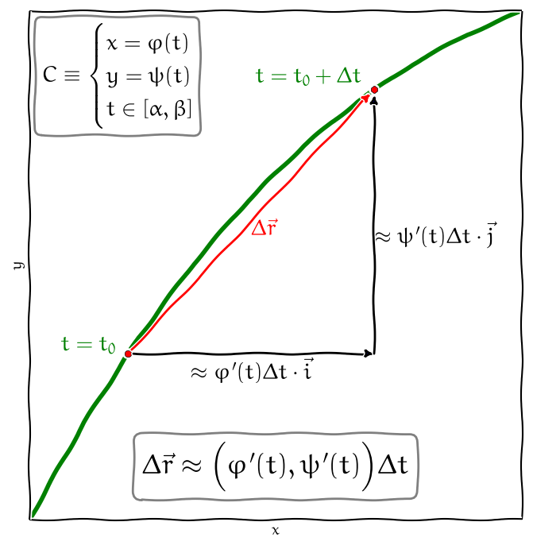

% Křivkový integrál
% Robert Mařík
% 2020

> Anotace.
>
> * V přednášce se seznámíme s rozšířením Riemannova integrálu. Riemannův integrál umožňuje sečíst příspěvky na úsečce. Zobecníme si tento nástroj tak, že umožní sečíst příspěvky podél křivky. Seznámíme se s křivkovým integrálem.
> * Zaměříme se na křivkový integrál druhého druhu. V cizojazyčné literatuře je tento integrál nazývaný též integrál vektorového pole. Umožňuje vypočítat práci nebo obecně potenciál a tím přejít (pokud to jde) ke skalárnímu popisu pole namísto vektorového. Tím se popis studovaných systémů zjednoduší.
> * Další aplikací křivkového integrálu druhého druhu je tok vektorového pole křivkou. Ten využijeme později při makroskopické formulaci bilance stavové veličiny a při odvození difuzní rovnice v integrálním tvaru.
> * Motivací pro zavedení křivkového integrálu druhého druhu je i výpočet [toku přes hranici množiny.](http://user.mendelu.cz/marik/aromamath/Krivkovy_integral.html)

> Prerekvizity.
>
> * Křivkový integrál počítáme převodem na Riemannův integrál. Je proto tedy dobré ovládat výpočet neurčitého a určitého Riemannova integrálu.

# Křivkový integrál

https://youtu.be/n2roVUrXgcw

Křivkový integrál je rozšíření Riemannova integrálu na případ, kdy množinou, přes kterou integrujeme, je místo úsečky obecnější  křivka. Pro jednoduchost budeme uvažovat dvourozměrnou křivku v rovině $x$, $y$.

Rozeznáváme dva druhy křivkových integrálů. První z nich používáme při práci se skalárními veličinami. Příkladem je kvadratický moment. (Objekty s velkým kvadratickým momentem jsou při rotačních pohybech obdobou objektů velké hmotnosti při posuvných pohybech.) Druhý z křivkových integrálů používáme při práci ve vektorovém poli. Příkladem je výpočet práce vykonané po křivce nebo tok křivkou.

# Parametrické rovnice křivky

https://youtu.be/MRk4HRAWlA4

Nejprve představíme matematický aparát pro popis křivek.  Rovinné křivky nejčastěji popisujeme vektorovou funkcí jedné proměnné $\vec r\colon \mathbb{R}\to \mathbb{R}^2$. Zpravidla s touto vektorovou funkcí pracujeme v komponentách, kdy každá její komponenta je dána skalární funkcí. Vektorově píšeme $$\vec r(t)=[\varphi(t),\psi(t)]=\varphi(t) \vec\imath + \psi(t)\vec\jmath,\quad t\in [\alpha,\beta]$$ a tato vektorová funkce se nazývá *parametrizace* křivky $C$. Často píšeme parametrické rovnice pro jednotlivé souřadnice ve tvaru $$C=\begin{cases} x=\varphi(t)\\y=\psi(t), \quad t\in[\alpha,\beta].\end{cases}$$

* Graf křivky dostaneme tak, že pro každé $t$ z intervalu $[\alpha, \beta]$ kreslíme ve 2D bod $[\varphi(t), \psi(t)]$.
* Pro danou křivku $C$ v rovině $xy$, nejsou její parametrické rovnice dány jednoznačně. [Nakreslit online.](https://sagecell.sagemath.org/?z=eJxtkUFvhCAQhe8m_geiB7AlaTFNb5x75ResmbLslohgcGJlf31Ftx42y23C-957k5khMrqQRJuyKIu6rkkMs7fakDEG0kc796ksvBRlsTBspA4Tw5Nf1SmPk_X3cYcHc9vJESIMBmNZ4GA9xwEW-c5Z-zLa5sTE245s0JOXf5SQowvIcixnyA-fhhNnrsafOwffxkmaFbn_SijxukHpCaSDC1HSaM700SHdHaaf8MuU4ORir5O9Gck--ceKokVnZPUV4ZJIjiNAMlNtW6hW_q9rdbfl762z5KHGEdJymEajsYuANkhxhKjDqof9AFA1fx4nfBQ=&lang=sage&interacts=eJyLjgUAARUAuQ==)
* Parametrizace kružnice, úsečky a grafu funkce jedné proměnné jsou v [cheatsheetu.](https://raw.githubusercontent.com/robert-marik/apl-slidy/master/cheatsheet/cheatsheet-AM.pdf)

# Křivkový integrál prvního druhu

https://youtu.be/ZRed88fgDkI

\iffalse

\fi

Pokud uvažujeme rovný drát o lineární hustotě $f$ a délce $s$, je hmotnost
drátu rovna součinu $$m=fs.$$ Pokud by drát nebyl homogenní, je nutné v tomto vzorci místo součinu použít Riemannův integrál $$m=\int _a^b f\,\mathrm ds.$$ Budeme ve zobecňování pokračovat. Uvažujme drát, který není ani homogenní, ani rovný. Nechť leží podél rovinné křivky $C$ a nechť je jeho lineární hustota (specifická hmotnost) v bodě $(x,y)$ dána funkcí $f(x,y)$. Zde již Riemannův integrál nepomůže. Celkovou hmotnost můžeme odhadnout následovně.

* Myšlenkově rozdělíme drát na malé kousíčky a v každém z nich odhadneme lineární hustotu konstantou. Můžeme například použít minimální hodnotu hustoty v tomto kousíčku pro dolní odhad hmotnosti. 
* Vynásobením délky každého kousíčku a lineární hustotou obdržíme jeho hmotnost a sečtením přes všechny kousky dostaneme odhad pro hmotnost drátu. Tento odhad bude tím přesnější, čím jemnější dělení použijeme. 
* Zjemňováním dělení se tyto odhady zpřesňují. 

V limitním procesu můžeme nechat délku  kousíčků konvergovat k nule. Poté dostáváme objekt, který se nazývá *křivkový integrál prvního druhu*, označuje $$ \int_C f\;\mathrm{d} s $$ a fyzikálně vyjadřuje hmotnost drátu z výše uvažované úlohy. Pokud počáteční a koncový bod křivky $C$ splývají, píšeme též $$ \oint_C f\;\mathrm{d} s $$ a integrál nazýváme *integrálem po uzavřené křivce*.

## Převod na Riemannův integrál (rovinná křivka)

\iffalse

\def\maxfactor{0.4}

\def\maxfactor{0.6}
\fi

Mějme parametrické rovnice křivky $C$ ve vektorovém tvaru
$$\vec r(t)=\varphi(t) \vec\imath + \psi(t)\vec\jmath,$$
kde $t\in[\alpha,\beta]$.
Derivováním křivky dostaneme
$$\frac{\mathrm{d} \vec r(t)}{\mathrm{d}t}=\varphi'(t) \vec\imath + \psi'(t)\vec\jmath.$$
Výpočtem délky vektoru (a formálním vynásobením výrazem $\mathrm{d}t$) dále
$$\mathrm{d}s=|\mathrm{d}\vec r(t)|=\sqrt{(\varphi'(t))^2 + (\psi'(t))^2}\mathrm{d}t.$$
Tím se křivkový integrál prvního druhu funkce $f(x,y)$ po křivce $C$
transformuje na Riemannův integrál
$$
\int_C f\;\mathrm{d} s=\int_\alpha^\beta f(\varphi(t),\psi(t))\sqrt{\varphi^{\prime 2}(t)+\psi^{\prime 2}(t)}\;\mathrm{d} t.
$$

## Převod na Riemannův integrál (prostorová  křivka)

S křivkovým integrálu po křivce  
$$
  C:\quad \varphi(t)\vec\imath + \psi(t)\vec\jmath + \xi(t) \vec k, \quad t\in[\alpha,\beta]
$$
ve trojrozměrném prostoru pracujeme podobně. Délkový element je
$$
\mathrm{d}s=\sqrt{(\varphi^{\prime}(t))^2+(\psi^{\prime }(t))^2+(\xi^{\prime }(t))^2}\mathrm{dt}
$$
a integrál má tvar
\dm$$ \int_C f\;\mathrm{d} s=\int_\alpha^\beta f(\varphi(t),\psi(t),\xi(t))\sqrt{(\varphi^{\prime}(t))^2+(\psi^{\prime }(t))^2+(\xi^{\prime }(t))^2}\;\mathrm{d} t. $$

## Aplikace křivkového integrálu prvního druhu

\iffalse

\maxwidthdefault
\def\velkatabulka{Aplikace křivkového integrálu prvního druhu jsou shrnuty v tabulce.\begin{table*}\setlength{\columnwidth}{18cm}}
\def\velkatabulkakonec{\caption{Aplikace křivkového integrálu prvního druhu}\end{table*}}

\velkatabulka

|Funkce $f(x,y)$        |Integrál $\int_C f\;\mathrm{d}s$                                                                         |
|----------------|-----------------------------------------|
|$1$ | délka křivky $C$|
|lineární hustota $\tau(x,y)$ | hmotnost $m_C$ křivky $C$|
|$\frac {1}{m_C}[x\tau(x,y),y\tau(xy)]$| souřadnice těžiště křivky $C$ |
|$x^2\tau(x,y)$| moment setrvačnosti křivky $C$ vzhledem k  ose $y$|
|$y^2\tau(x,y)$| moment setrvačnosti křivky $C$ vzhledem k  ose $x$|
|$\rho^2(x,y)\tau(x,y)$| moment setrvačnosti křivky $C$ vzhledem k obecné ose, kde $\rho(x,y)$ je vzdálenost bodu $[x,y]$ od osy otáčení.|

\velkatabulkakonec

\fi

## Vlastnosti křivkového integrálu prvního druhu

> Věta (nezávislost na zvolené parametrizaci). Křivkový integrál prvního druhu nezávisí na konkrétní parametrizaci křivky $C$. Pro různé parametrizace stejné křivky má integrál stejnou hodnotu.
  
> Věta (linearita). Pro funkce $f$ a $g$ a konstantu $k$ platí následující.
$$
\begin{aligned}
\int_C f+g\;\mathrm{d}s & = \int_C f\;\mathrm{d}s + \int_C g\;\mathrm{d}s \\
\int_C kf\;\mathrm{d}s & = k\int_C f\;\mathrm{d}s\\
\end{aligned}
$$

> Věta (aditivita vzhledem k integračnímu oboru). Nechť je křivka $C$ rozdělena na dvě křivky $C_1$ a $C_2$, které jsou disjunktní (až na koncové body). Potom platí
$$
\int_{C} f\;\mathrm{d}s = \int_{C_1} f\;\mathrm{d}s + \int_{C_2} f\;\mathrm{d}s .
$$

## Proč trubky praskají podélně?

\iffalse 

\fi

Ukážeme si aplikaci křivkového integrálu prvního druhu k tomu, abychom sečetli komponenty síly, snažící se roztrhnout natlakovanou válcovou nádobu. Tlaková síla je ve všech částech nádoby stejně velká. Protože je však kolmá ke stěně nádoby, mění se směr síly a tím i průměty síly do směru, ve kterém počítáme namáhání. Zjednodušíme si situaci tím, že budeme uvažovat průmět stěny do roviny podstavy, kdy se stěna redukuje na křivku.

Vypočteme síly, které se snaží roztrhnout válec napříč (viz řez A v obrázku) a podélně (viz řez B v obrázku). Tato dvě namáhání porovnáme. Ještě existuje namáhání radiálně od osy. Ale v tomto případě se tlaková síla rozkládá na celou plochu pláště válce a v tomto směru je  namáhání minimální. Proto toto namáhání nemusíme uvažovat.

Uvažujme natlakovanou válcovou nádobu s tlakem $p$, výškou $L$, poloměrem podstavy $r$ a stěnou o tloušťce $t$. 

Výpočet namáhání v řezu A je snadný. Obsah řezu (vyšrafováno červeně) je $2\pi r t$. Na dno a víko působí síla $F=p\pi r^2$ a v řezu A je tahové napětí $$\sigma_{p} = \frac FS=\frac {p\pi r^2}{2\pi rt}=\frac {pr}{2t}.$$

Nyní vypočteme namáhání, které se snaží roztrhnout válec podélně. K tomu musíme vypočítat sílu, která působí po obvodě válce, tj. která se snaží válec roztrhnout v řezu B. Obsah řezu  (červeně vyznačeno) je $2Lt$. Nejtěžší bude najít celkovou sílu, která od sebe oddaluje dvě poloviny pláště. To je místo, kde zapojíme integrál. 

Budeme se na úlohu dívat shora ze směru, kterým míří osa válce. Tím můžeme snížit dimenzionalitu úlohy. Plášť válce v tomto pohledu vidíme jako kružnici a polovinu pláště jako půlkružnici. Tato půlkružnice  má rovnici $\vec r(t)=r\cos(t)\vec\imath+r\sin (t)\vec\jmath$, kde $r$ je poloměr válce a $t\in\left[-\frac \pi 2,\frac \pi 2\right]$ je úhel mezi spojnicí elementu v bodě $(x,y)$ a mezi kladnou částí osy $x$. Kousek pláště válce odpovídající v průmětu úseku křivky délky $\Delta s$ má obsah $L\Delta s$. Tlaková síla na tento kousek je součin tlaku a obsahu, tj. $$\Delta F=pS=p L\Delta s.$$ Směr je kolmý k plášti válce a s vodorovnou osou proto síla svírá úhel $t$.  Průmět této síly do vodorovného směru je $$\Delta F_x=pL\Delta s \cos t$$ a tyto příspěvky musíme sečíst křivkovým integrálem přes celou křivku. Platí $\mathrm ds=r\mathrm dt$. Celková síla, která se snaží nádobu roztrhnout podélně je 
\dm$$F_x=\int_C pL \cos t \,\mathrm d s = \int_{-\frac \pi 2}^{\frac \pi 2} pLr \cos t \,\mathrm d t =prL [\sin t]_{-\frac \pi 2}^{\frac \pi 2}=prL \left[\sin\frac \pi 2 -\sin\left(-\frac \pi2 \right)\right]=2p rL.$$ 
Povrch, na který tato síla působí, odpovídá dvěma podélným hranám (červeně na řezu B), tj. má obsah $2Lt$ a napětí je tedy 
$$\sigma_{h}=\frac{2pLr}{2Lt}=\frac{pr}t=2\sigma_p.$$ Vidíme, že toto napětí je dvojnásobkem napětí v podélné ose. 

Ještě je vhodné ověřit, že svislý průmět, tj . $$\Delta F_y=pL\Delta s \sin t$$ k namáhání nepřispívá, protože 
\dm$$F_y=\int_{C} pL \sin t \,\mathrm d s =0.$$ 
To však je možné očekávat i ze symetrie.

Pokud se chcete dozvědět o problematice více, nebo si prohlédnout obrázky válcových nádrží, které selhaly vlivem vysokého nebo nízkého tlaku, zkuste Google a heslo "hoop stress".

# Křivkový integrál druhého druhu

https://youtu.be/GeJgtBHy_sM

\iffalse

\fi

Pokud působíme na těleso silou $F$ a přemísťujeme toto těleso ve směru
působící síly po dráze délky $s$,
[konáme práci](http://cs.wikipedia.org/wiki/Mechanická\_práce)
$W=Fs$. Pokud přemísťování neprobíhá ve směru působící síly a má-li
síla směr $\vec F$ a posunutí $\vec s$, je práce rovna skalárnímu
součinu $\vec F\cdot\vec s$.

Předpokládejme, že na těleso působí (obecně nekonstantní) síla $\vec F$ a těleso se pohybuje podél křivky $C$ určené polohovým vektorem $\vec r(t)$. Pro výpočet práce můžeme použít trik obvyklý v integrálním počtu. Rozdělíme dráhu na malé kousíčky a v rámci těchto kousíčků považujeme $\vec F$ i $\Delta \vec r$ za konstantu. Potom můžeme odhadnout příspěvek každého kousíčku k celkové práci klasickým způsobem pomocí skalárního součinu a nakonec všechny příspěvky sečíst. Tato aproximace bude tím přesnější, čím jemnější dělení použijeme.

V limitě dostáváme veličinu, která se nazývá *křivkový integrál
druhého druhu* funkce $\vec F$ po křivce $C$. Tento integrál zapisujeme $$
\int_C\vec F\;\mathrm{d}\vec r .$$ Je-li $$ \vec F(x,y)=P(x,y)\vec
i+Q(x,y)\vec\jmath, $$ zapisujeme někdy křivkový integrál
 ve složkách $$ \int_C P(x,y)\mathrm{d}
x+Q(x,y)\mathrm{d} y.  $$

Protože při pohybu tělesa po křivce jedním směrem se práce koná a při pohybu opačným směrem spotřebovává, je nutné, aby křivka figurující v křivkovém integrálu druhého druhu byla orientovaná. Musíme tedy prohlásit jeden koncový bod za *počáteční* a druhý za *koncový*. Vždy budeme předpokládat, že křivka je *orientovaná v souladu se svým parametrickým vyjádřením*, tj. že počáteční bod křivky odpovídá hodnotě parametru $t=\alpha$ a koncový bod odpovídá hodnotě parametru $t=\beta$.

# Převod na Riemannův integrál

\def\maxfactor{0.4}
\iffalse

\fi
\def\maxfactor{0.6}

Známe-li parametrické rovnice
$$\vec r(t) = \varphi(t)\vec\imath + \psi(t) \vec\jmath,\quad t\in[\alpha,\beta],$$
křivky $C$, je možno křivkový integrál
druhého druhu funkce
$$\vec F(x,y)=P(x,y)\vec\imath + Q(x,y)\vec\jmath$$
po křivce $C$ zapsat
následovně 
$$
\begin{aligned}
\int_C\vec F\;\mathrm{d}\vec r&=
\int_\alpha^\beta\Bigl[ P(\varphi(t),\psi(t))\varphi'(t)\\ &\qquad +Q(\varphi(t),\psi(t))\psi'(t)\Bigr]\;\mathrm{d}t.
\end{aligned}
$$ 
Vektorově
$$\int_C \vec F\;\mathrm d\vec r = 
\int_\alpha^\beta \vec F(\vec r(t)) \cdot \frac{\mathrm d\vec r(t)}{\mathrm dt}\; \mathrm dt.
$$

# Vlastnosti křivkového integrálu druhého druhu

> Věta (souvislost křivkového integrálu a orientace křivky). Změnou orientace křivky křivkový integrál druhého druhu mění znaménko.

> Věta (nezávislost na zvolené parametrizaci). Křivkový integrál druhého druhu nezávisí na konkrétní parametrizaci  křivky $C$. Pro různé parametrizace stejné křivky má integrál stejnou hodnotu.

Následující vlastnosti jsou stejné jako u křivkového integrálu prvního druhu.

> Věta (linearita a aditivita vzhledem k integračnímu oboru). Křivkový integrál druhého druhu je lineární vzhledem k funkci a
  aditivní vzhledem k oboru integrace. Přesněji, pro funkce $\vec F$ a $\vec G$
  a konstantu $k$ platí následující.
$$
\begin{aligned}
\int_C \vec F+\vec G\;\mathrm{d}\vec {r} & = \int_C \vec F\;\mathrm{d}\vec {r} + \int_C \vec {G}\;\mathrm{d}\vec{r} \\
\int_C k\vec {F}\;\mathrm{d}\vec{r} & = k\int_C \vec{F}\;\mathrm{d}\vec{r}\\
\end{aligned}
$$
Je-li křivka $C$ rozdělena na dvě disjunktní (až na koncové body) křivky $C_1$ a $C_2$, platí
$$
\int_{C} \vec F\;\mathrm{d}\vec{r} = \int_{C_1} \vec F\;\mathrm{d}\vec{r} + \int_{C_2} \vec F\;\mathrm{d}\vec{r} .
$$

# Aplikace křivkového integrálu druhého druhu

manimp:integracni_cesta|Křivkový integrál může a nemusí záviset na integrační cestě. Pokud na ní nezávisí, je možné v takovém poli nadefinovat potenciální energii.

* Integrál
  $$
  \int_C\vec F\;\mathrm{d}\vec r
  $$
  vyjadřuje **práci** kterou vykoná síla $\vec F$ při přemístění tělesa podél orientované křivky $C$.
* Je-li křivka $C$ uzavřená, píšeme
  $$
  \oint_C\vec F\;\mathrm{d}\vec r.
  $$
  Fyzikálně se jedná o **práci** kterou vykoná síla $\vec F$ při přemístění
  tělesa po uzavřené orientované křivce. Tato práce se též nazývá *cirkulace
  vektorového pole po orientované křivce $C$*. Pokud je možno v poli zavést
  potenciální energii a pokud tedy práce závisí jenom na počáteční a
  koncové poloze, musí tato práce být nulová. To je důsledkem věty
  kterou si uvedeme později.
* Při odvození křivkového integrálu druhého druhu jako vykonané práce hraje roli vlastně jenom ta
  složka silového pole, která při posunu ve směru křivky koná práci. Uvažujeme tedy jenom složku tečnou ke křivce. Pokud použijeme naopak pouze normálovou komponentu, dostaneme veličinu vyjadřující **tok vektorového pole orientovanou křivkou $C$**. Výsledný vzorec pro tok vektorového pole $\vec F(x,y)=P(x,y)\vec
i+Q(x,y)\vec\jmath$ křivkou $C$
  je
  $$
  \int_{C}-Q(x,y)\mathrm{d}x+P(x,y)\mathrm{d}y.
  $$
* Je-li množina $\Omega$ "dostatečně pěkná" (např. souvislá, bez děr, s  hladkou hranicí $\partial \Omega$, která se nikde neprotíná, detaily uvedeme později u Greenovy věty), potom každý z\ integrálů
  $$\oint_{\partial\Omega}x\mathrm{d}y\qquad\text{a}\qquad\oint_{\partial\Omega}y\mathrm{d}x$$
  udává (až na případné znaménko) obsah množiny $\Omega$. Na tomto principu fungují planimetry.

# Shrnutí: vlastnosti křivkových integrálů

* Oba křivkové integrály jsou **aditivní vzhledem k oboru integrace**. Je možno křivku rozdělit na konečný počet navzájem disjunktních částí, vypočítat integrál na každé části samostatně a výsledky sečíst.  
* Křivkový integrál prvního ani druhého druhu **nezávisí na konkrétní parametrizaci křivky**.
* Křivkový integrál prvního druhu **nezávisí na orientaci** křivky.
* Křivkový integrál druhého druhu **při změně orientace křivky mění znaménko**.

<!--

\iffalse

# Steinerova věta

Nechť je dána křivka $C$ s lineární hustotou $\tau(x,y)$.
Nechť křivka $C$ splňuje $\int_C x \tau(x,y)\;\mathrm{d}s=0$, tj. nechť
osa $y$ prochází těžištěm křivky $C$. Určete moment setrvačnosti
křivky vhledem k ose $o$ rovnoběžné s $y$ ve vzdálenosti $d$ od osy $y$.

*Řešení*
Podle toho zda osa $o$ je nalevo nebo napravo od osy $y$ dostáváme jednu z následujících variant.
$$\begin{aligned}
J_o&=\int_C(x\pm d)^2\tau \;\mathrm{d}s\\
&=\int_C(x^2\pm 2xd+d^2)\tau \;\mathrm{d}s\\
&=\int_C x^2\tau \;\mathrm{d}s \pm 2d\int_C x\tau \;\mathrm{d}s + d^2 \int_C \tau \;\mathrm{d}s.
\end{aligned}
$$
Na pravé straně vidíme, že prvním členem je moment otáčení vzhledem k ose $y$
$$J_{yT}=\int_C x^2\tau \;\mathrm{d}s$$ a ve třetím členu je obsažena hmotnost křivky
$$m=\int_C \tau \;\mathrm{d}s.$$
Dále ze zadání vidíme, že prostřední člen je roven nule.
V označení výše náš vztah dostává tvar
$$J_o=J_{yT}+m d^2.$$
Tento vztah se nazývá Steinerova věta. Ukazuje, že moment setrvačnosti
je nejmenší vzhledem k ose otáční procházející těžišťěm (člen $m
d^2$ je vždy nezáporný) a umožňuje přepočet momentu setrvačnosti pro
rovnoběžné osy.

\fi

-->

# Závěrečné informace

## Parametrizace úsečky

* Hledejme parametrické rovnice orientované úsečky $AB$, kde je dán počáteční bod $A=[x_A,y_A]$ a koncový bod $B=[x_B,y_B]$.
* Leží-li bod $X$ na úsečce $AB$, potom vektor $\vec {AX}$ má stejný směr (včetně orientace) jako vektor $\vec {AB}$ a nejvýše stejnou délku.
* Platí tedy $\vec {AX}=t\vec {AB}$ pro nějaké $t\in[0,1]$. Odsud potom dostáváme  $X-A=t(B-A)$ a $X=A+t(B-A)$.
* V souřadnicích zapsáno, parametrické rovnice úsečky jsou $$\begin{aligned}x&=x_A+t(x_B-x_A)\\y&=y_A+t(y_B-y_A), \quad t\in[0,1]\end{aligned}$$
* Pro úsečku v prostoru platí totéž, pouze přibývá třetí souřadnice.

\iffalse

## Online výpočet křivkového integrálu

* Křivkový integrál druhého druhu, [numerický výpočet, Python.](https://gist.github.com/robert-marik/6e203ee18958a4154ef0f2151d823bd1)
* Křivkový integrál prvního druhu, [výpočet pomocí Sage (derivace symbolicky, integrace numericky).](https://sagecell.sagemath.org/?z=eJxtjsEKgzAQRO-B_EPAg4nNQbznS0otQWNZNNGuUUy-vkaxUOhclsfMsLNq5LnPBSVZlrGoW-2AdYvrG0NJxzcZZBRqqytKzgiOq4PGsAlH1iOsfaBk416oZpz3Q0lIMIM7ICYor6418SxOGrU1HinxFpz0Vm-qlFUxQYoe4T9KjlusQWj08ATnzQv1wNk-U6UJMqj0XEaV3gpWsPmNnrfQ7YlkeFFXtwPDL8YLhWS7vqPEvXx8AHukUPY=&lang=sage)
* Křivkový integrál druhého druhu, [výpočet pomocí Sage (derivace symbolicky, integrace numericky).](https://sagecell.sagemath.org/?z=eJxtkMFuwyAQRO-W_A8r5RBIaepGOVXi6p-o2ogaUiEbcDGxgK8v2CFqoywXntjRzDAzi7Zui-tqs9lAZJxpCeeL7jtRV61HngQSMX0OiUIhnyAWaOoqnyy3ZtayEzBaA72Vc59UHjlMD7vOTOlSVyHjJPUCMUNT1ErEVToyy5Rwtq6ckpo4xTxtyOvLcTfKm9mDWV70RQkrOzacpHbi27IBwRl5mnOQQLM_iTQ7Y9jB9GMd4vKcNvKDw5-HpwXDf4wFMYE0t1z4vfnIttxMLAotT2ttqtiIYGDqizMY38biD9cAcE1AALWetIFAG3H6kBSXS6HdvX6_hMjCNefaYumAs_2D0rPonLHoLhjec-NO6ZP5pXNlp7jiP-WgtPsFHlShKA==&lang=sage)

\fi

# Z ptačí perspektivy

\iffalse

\fi

* Křivkový integrál druhého druhu souvisí s prací silového pole. Vzhledem ke zkušenostem z mechaniky by toto měla být cesta ke skalárnímu popisu vektorového pole. Protože v minulém týdnu jsme jednu takovou cestu otevřeli (pojem rotace a její nulovost či nenulovost), dá se očekávat, že obě problematiky budou souviset. Tuto souvislost si ukážeme později, za dva týdny (Greenova věta).
* Křivkový integrál druhého druhu může souviset s i s tokem vektorového pole křivkou a to je zase doména difuzní rovnice a divergence vektorového pole. Oba pojmy, křivkový integrál a divergence spolu opravdu souvisí a přesvědčí nás o tom později opět Greenova věta.
