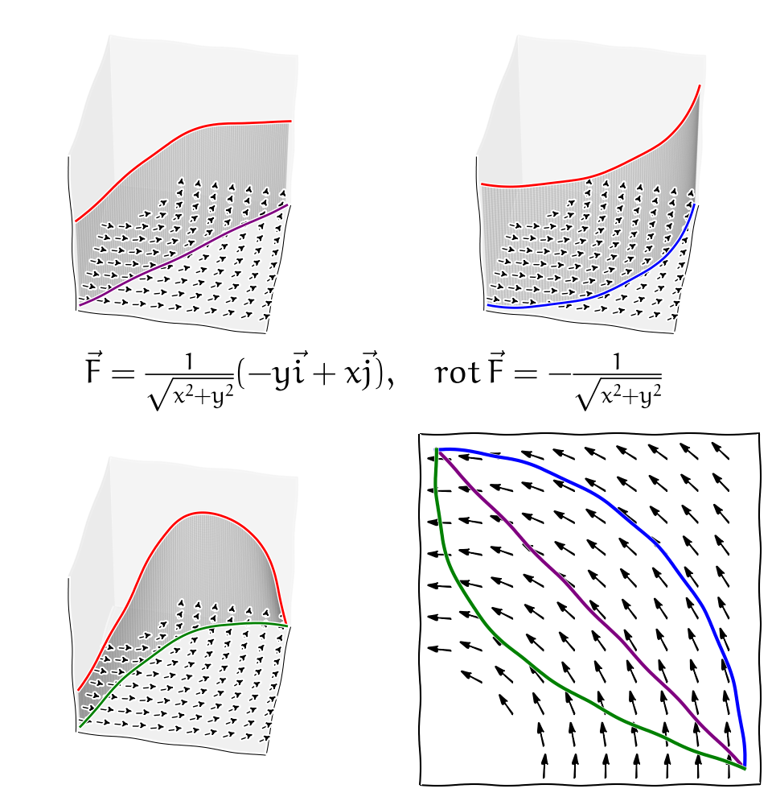

% Základní integrální věty z vektorové analýzy
% Robert Mařík
% 2020

> Anotace.
>
> * V přednášce se seznámíme s nástrojem, který umožňuje předvádět mezi sebou křivkové a dvojné integrály. To využijeme později při makroskopické formulaci bilance stavové veličiny a při odvození difuzní rovnice v integrálním tvaru.
> * Dále se seznámíme s vektorovou obdobou Newtonovy-Leibnizovy věty. Naučíme se počítat křivkový integrál druhého druhu pomocí rozdílu potenciálu v koncových bodech. Tato možnost není k dispozici automaticky (pouze pro vektorová pole s nulovou rotací, pro která existuje kmenová funkce), ale pokud je možné touto cestou jít, bývá to velké ulehčení.

> Prerekvizity.
>
> * Křivkový integrál převádíme na dvojný integrál. Je proto dobré ovládat výpočet dvojného integrálu.
> * Pro pochopení odvození rovnice kontinuity v integrálním tvaru je nutné znát význam dvojného integrálu hustoty a umět pomocí křivkového integrálu vypočítat tok.
> * Dostaneme se jinou cestou ke stejné rovnici, kterou jsme poznali dříve jako difuzní rovnici. Je vhodné si ujasnit fyzikální význam jednotlivých členů této rovnice a jak se ve speciálních případech tyto členy mohou redukovat na členy jednodušší (izotropní materiál, homogenní materiál, materiál s lineárními vlastnostmi, stacionární děj, proces bez zdrojů).

# Úvod 

V této přednášce se seznámíme s nástroji pro pohodlný výpočet křivkového integrálu v případě, kdy tento integrál nezávisí na integrační cestě a s metodou převodu křivkového integrálu na dvojný integrál. Tyto myšlenky dnes stojí v samotném základu mnoha dalších teorií a jsou důležité pro přechod mezi lokálním a globálním (mikroskopickým a makroskopickým) popisem transportních jevů. Proto je až neuvěřitelné, že uvedený postup odvodil pekař a samouk [George Green](https://cs.wikipedia.org/wiki/George_Green), který absolvoval jenom jediný rok školní docházky ve věku od osmi do devíti let! Své dílo publikoval vlastním nákladem a povětšinou rozdal přátelům, kteří však textu pravděpodobně nemohli vůbec rozumět. Proto nevešlo okamžitě ve známost. Nezávisle na Greenovi podobný přístup objevili i někteří další fyzikové.

V\ následujících větách si ukážeme některé souvislosti mezi
studovanými pojmy. Tyto souvislosti existují, pokud objekty se kterými
pracujeme jsou dostatečně pěkné - funkce jsou dostatečně hladké,
oblasti mají dostatečně hladkou hranici a neobsahují díry apod.  Pro
úplnost uvedeme nebo zopakujeme potřebné pojmy. Některé pojmy pro
názornost uvedeme poněkud volnější interpretací, jejich přesnější zavedení je
možno nalézt v literatuře.

* Vektorové pole $\vec F$ se nazývá **potenciálové**, pokud
  existuje skalární funkce $\varphi$ s\ vlastností $\nabla \varphi=\vec
  F$. Funkce $\varphi$ se nazývá **kmenová funkce** vektorového
  pole.
* Křivka $C$ se nazývá **uzavřená**, pokud její počáteční a koncový bod
  splývají.
* Křivka se nazývá **jednoduchá**, pokud sama sebe neprotíná
  (s\ případnou výjimkou stejného počátečního a koncového bodu
  u\ uzavřených křivek).
* Křivka se nazývá **regulární**, pokud funkce z jejího parametrického
  vyjádření jsou hladké (mají spojité derivace) a v každém bodě je
  aspoň jedna z těchto derivací nenulová.
* Pokud platí pro libovolné dvě regulární křivky $C$ a $C_1$, které leží v
  $\Omega$ a mají stejné počáteční body a stejné koncové body, platí
  $$
  \int_C \vec F\mathrm{d}\vec r=\int_{C_1} \vec F\mathrm{d}\vec r,
  $$
  říkáme, že integrál v $\Omega$ **nezávisí na integrační
  cestě**. Vektorové pole
  ve kterém křivkový integrál nezávisí na integrační cestě se nazývá
  **konzervativní pole**.
* Oblast se nazývá **jednoduše souvislá**, pokud je souvislá a
  neobsahuje otvory.

# Věta o\ nezávislosti integrálu na integrační cestě

https://youtu.be/zQorgqarHG4

Podle této věty je tedy vektorové pole v\ prostoru
konzervativní právě tehdy, když je jeho rotace nulová a to je právě
tehdy, když pro toto pole existuje kmenová funkce a je tedy možno
zavést potenciál (záporně vzatá kmenová funkce).

>  Věta (o\ nezávislosti integrálu na integrační cestě).
>  Uvažujme vektorovou funkci $\vec F$, křivku $C$ a oblast $\Omega$ 
>  v\ $\mathbb{R}^3$. Následující výroky jsou ekvivalentní za předpokladu
>  hladkosti funkcí, regulárnosti křivek a jednoduše souvislé oblasti
>  $\Omega$.
>
>  a. Integrál $\int_C \vec F\mathrm{d}\vec r$ nezávisí v $\Omega$ na
>    integrační cestě.
>  b. Křivkový integrál $\oint_C \vec F\mathrm{d}\vec r$ po libovolné
>    uzavřené křivce $C$ v $\Omega$ je roven nule.
>  c. Rotace $\nabla\times \vec F$ vektorového pole $\vec F$ je v\ $\Omega$
>    rovna nulovému vektoru.
>  d. Existuje funkce $\varphi$ s\ vlastností $\nabla\varphi=\vec F$
>    na $\Omega$.
>
>  Pokud jsou předchozí podmínky splněny (platnost jedné z\ nich vynutí
>  platnost i\ všech ostatních), je možno křivkový integrál vypočítat
>  podle vzorce
>  $$
>    \int_C \vec F\mathrm{d}\vec r=\varphi(B)-\varphi(A),
>  $$
>  kde $A$ a $B$ jsou počáteční a koncový bod křivky $C$ a $\varphi$ je
>  kmenová funkce vektorového pole $\vec F$.

manimp:integracni_cesta|Křivkový integrál druhého druhu může a nemusí záviset na intergrační cestě. Pokud nezávisí, je jakákoliv práce s úlohou usnadněna, protože je možné= zavést potenciální energii.

Tato věta je použitelná na mnoho způsobů.

* Věta přímo udává efektivní kritérium, kdy křivkový integrál nezávisí na integrační cestě. Rotace vektorového pole musí být nulová. Pokud máme vektorové pole zadané analytickým předpisem jednotlivých komponent, je toto nejsnazší kriterium na ověření.
* Věta přímo udává, jak ze znalosti kmenové funkce snadno určit hodnotu křivkového integrálu. Stačí vypočítat změnu kmenové funkce (změnu skalárního potenciálu) mezi počátečním a koncovým bodem křivky.
* Věta také udává, jak vypočítat skalární potenciál pomocí křivkového integrálu. Ač se ve sbírkách příkladů studenti setkávají s výpočtem křivkového integrálu pomocí skalárního potenciálu, je toto typické využití jenom v případech s analyticky snadným řešením. V případě numerických výpočtů s naměřenými daty je hledání skalárního potenciálu v podstatě nemožné provést klasickou cestou. Pomocí křivkového integrálu to je naopak snadné. Stačí si vybrat výchozí bod a počítat křivkové integrály po libovolných křivkách (zpravidla úsečky) do bodů, kde chceme znát skalární potenciál. Tomuto je věnován [Jupyter zápisník ilustrující uvedenou větu](http://user.mendelu.cz/marik/aromamath/Nezavislost_na_integracni_ceste.html).

## Poznámky k\ větě o\ nezávislosti křivkového integrálu na integrační cestě

Větu je možno formálně vyslovit i\ pro jiný než trojrozměrný
prostor. Pokud je pole v\ předchozí větě pouze v\ rovině, tj. $\vec
F=(F_x, F_y)$, doplníme třetí komponentu pro výpočet rotace
nulou. Protože $\nabla \times\vec F=\left(\frac {\partial F_x}{\partial y}-\frac {\partial F_y}{\partial x}\right)\vec k$, přechází podmínka na nulovost rotace v\ nám již známou nutnou a postačující podmínku 
$$
\frac {\partial F_x}{\partial y}=\frac {\partial F_y}{\partial x}
$$
pro to aby výraz
$$F_x\mathrm{d}x+F_y\mathrm{d}y$$ 
byl totálním diferenciálem.  

Pokud pracujeme v\ prostoru vyšší dimenze, podmínka na rotaci je
nahrazena jinou, komplikovanější podmínkou. Všechny další body věty 
o\ nezávislosti na integrační cestě však zůstávají v\ platnosti beze
změny.

Podmínka hladkosti funkcí na jednoduše souvislé oblasti je
podstatná. Například pole $\vec v=-\frac{y}{x^2+y^2}\vec
i+\frac{x}{x^2+y^2}\vec j$ má rotaci rovnu nule ve všech bodech, kde
je definované, tj. v\ celém prostoru kromě osy $z$. Opravdu, kromě přímého
výpočtu to plyne z toho, že se jedná o gradient funkce $\arctan \frac yx$. Přímým výpočtem je
možno ukázat, že křivkový integrál po jednotkové kružnici v\ rovině
$z=0$ je roven $2\pi$. To je možné ukázat přímým výpočtem, kdy se díky stejnému
směru vektorového pole a tečného vektoru křivky integrál redukuje na součin
délky křivky s vektorovým polem konstantní velikosti. 

ww:problems/krivkovy_integral/40_01.pg

ww:problems/krivkovy_integral/40_02.pg

ww:problems/krivkovy_integral/40_03.pg

ww:problems/krivkovy_integral/40_04.pg

ww:problems/krivkovy_integral/40_05.pg

ww:problems/krivkovy_integral/40_06.pg

\iffalse

## Závislost a nezávislost integrálu na integrační cestě

\fi

\iffalse

* [online výpočet integrálů z\ obrázků](https://sagecell.sagemath.org/?z=eJx1kcFOhDAQhu88xaSB2K7V3bI3s_VoTLjswRuypkLXJSBgW1Z4FB_I93KKmHVjbNK0k_-fma_TozJALwY-cnfBgq6ttQAJ9Gpc2jfj6LCLL8ddzPhwHn9b49l6ssFwCoAFQS4kFVeOOxbksaR5a2lXLtzSW23Z_ARozdffTnC7NSYWeg-VKY9VexyfysbpF6NqoN2KQyc4VHhWgt0EgMto15uGNv2rNmWu6jP_te2fLR2kzxgl5iyKcr-nGDp22Yn_ZIEyX3HB0lWGOPvWwBbKBiv6ESGEf_7c3x7ad3pwrzUlm4O59ZvghM4lg1p8u8W0GwgfjzqHO0kjyyPLws0SJRIBrZXTA936nvznLjLG_IB8Oaee-7pSMk1J8vmB01GEk_u2aFqnSJZNHo-aTKg5cuYx7vUM-qvEteo63RQ0NSQcZGRDDuE4n-6xbFJ8exaSaEZKfiElExL_8zsTNwdPzCGZ7pM1Y9j2NA0EqDWdMTgctCq0eTLtu3wwvWbsC89xv1o=&lang=sage&interacts=eJyLjgUAARUAuQ==)
* [online výpočet rotace nekonzervativního pole z\ obrázku](https://sagecell.sagemath.org/?z=eJyNUsFywiAQvTvjP-w42sBI2pg71_5Eoxk0QZkhISVoQcd_L2Am6dgeygF22bc89u1a4siVXphGiQUH1wTPZ_MZRzbcY4pS99Z_aoPsLl-7XY6JffKzmGAb0RKwDbMEXLSdt4FCRmBD4h5glbhwiirBOeIf2ZZYvB6czZa40cm3nhu_9qLppOCu5Gcpkec5nLWcvgZoyr3idMp1v3PJCM4Dazp94Q-iCZyFx9KJxv4GQ6y_P6kvdDKNRHqxLPb1UbQ3JsWxras7FJf6AO8vFFY9FAUU8xkAFA0zJ9Xd4qmbm5fmfv8XUiszIoEGZN1WI9tysYpZSDJTW-Tlol4wGrrsSyXwuA6NeI4MoUHknzG_QpGdVKb0vEbpkotaVihKFBuSYRIUGuwgoSVxKMJMBNeROBfu4bK-8--UmhmhqB-Qg5JK02Qvz3WCvwFPt855&lang=sage&interacts=eJyLjgUAARUAuQ==)
* [online výpočet rotace konzervativního pole z\ obrázku](https://sagecell.sagemath.org/?z=eJyNUsGOwiAQvZv4DxOjW4h0t_bOdX9iq021oCS0NBRd0PjvC9i0Zt3DcoAZ5g2PeTOWOHKll0qjxIKDa4Lns_mMIxvuMUWp-0B2l6_dLsfEPtlZBNpGtARsU1kCLtrO20AhI7AhcQ-wWlw4RbXgHPGvbEssXg_OZkvc6ORbz4nfe9F0UnBX8rOUyPMczlpOXwI05V5xOuW611wygvPAmk5f-INoAmfhsXSisa9giPX3J_WNTqaRSC-WxZ4dRXurpDi2rL5DcWEH-HyjsOqhKKCYzwCgaCpzUt0tnrq5eWnu938htTIjEmhAsrYe2ZaLVcxCsjLMIi8X9YLR0F1fKoHHdWjE78gQGkR-jvkViuykMqXnNUqXXDBZoyhRbEiGSVBosIOElsShCDMRXEfiXLiHW_Wdf6fUlRGK-gE5KKk0TfbyzBL8A1uuyuU=&lang=sage&interacts=eJyLjgUAARUAuQ==)

<!--

* [online výpočet integrálů z\ obrázků](http://user.mendelu.cz/marik/akademie/sagecell.php?short=1&in=var+%28%27x%2Cy%2Ct%27%29%0D%0Apole1+%3D+%28-y%2Fsqrt%28x%5E2%2By%5E2%29%2Cx%2Fsqrt%28x%5E2%2By%5E2%29%29%0D%0Apole2+%3D+%28-y%2F%28x%5E2%2By%5E2%29%2C+x%2F%28x%5E2%2By%5E2%29+%29%0D%0A%0D%0Ac1%3D%281-t%2Ct%29%0D%0Ac2%3D%28cos%28pi%2At%2F2%29%2C+sin%28pi%2At%2F2%29+%29%0D%0Ac3%3D%281-t%2C+t%5E3%29%0D%0A%0D%0Adef+krivkovy_integral+%28p0%2C+p1%2C+k0%2C+k1%29%3A%0D%0A++++return%28numerical_integral+%28p0.subs%28x%3Dk0%2C+y%3Dk1%29%2Adiff%28k0%2Ct%29%2Bp1.subs%28x%3Dk0%2C+y%3Dk1%29%2Adiff%28k1%2Ct%29%2C0%2C1%29%5B0%5D%29%0D%0A%0D%0Afor+P+in+%28pole1%2C+pole2%29%3A%0D%0A++++show%28html%28%22%3Chr%3E%3Chr%3E%22%29%29%0D%0A++++show%28html%28r%22%3Ch2%3EPole%3A+%24%5Cvec+F%3D%28%25s%2C%25s%29%24%3C%2Fh2%3E%22%25+%28latex%28P%5B0%5D%29%2Clatex%28P%5B1%5D%29%29%29+%29%0D%0A++++tabulka%3D%5B%5B%22K%C5%99ivka%22%2C%22Hodnota%22%5D%5D%0D%0A++++for+K+in+%28c1%2C+c2%2C+c3%29%3A%0D%0A++++++++tabulka.append%28%5Br%22%24x%3D%25s%24%2C+%24y%3D%25s%24%2C+%24t%5Cin%5B0%2C1%5D%24%22%25%28latex%28K%5B0%5D%29%2Clatex%28K%5B1%5D%29%29%2Ckrivkovy_integral%28P%5B0%5D%2C+P%5B1%5D%2C+K%5B0%5D%2C+K%5B1%5D%29%5D%29+++%0D%0A++++show%28table%28tabulka%2C+header_row%3DTrue%29%29)
* [online výpočet rotace nekonzervativního pole z\ obrázku](http://user.mendelu.cz/marik/akademie/sagecell.php?short=1&in=x%2Cy%2Cz%3Dvar%28%27x+y+z%27%29%0D%0A%0D%0Af%28x%2Cy%2Cz%29%3D%28-y%2Fsqrt%28x%5E2%2By%5E2%29%2Cx%2Fsqrt%28x%5E2%2By%5E2%29%2C0%29%0D%0A%0D%0Axmin%2C+xmax%2C+ymin%2C+ymax+%3D+0%2C+1%2C+0%2C+1%0D%0A%0D%0Adivf%3D%28diff%28f%5B0%5D%2Cx%29%2Bdiff%28f%5B1%5D%2Cy%29%2Bdiff%28f%5B2%5D%2Cz%29%29.simplify_full%28%29%0D%0Acurlf%28x%2Cy%2Cz%29%3Dmap%28lambda+x%3Ax.simplify_full%28%29%2C%5C%0D%0A+++++++++++++++++%28+diff%28f%5B1%5D%2Cz%29-diff%28f%5B2%5D%2Cy%29%2C+diff%28f%5B2%5D%2Cx%29-diff%28f%5B0%5D%2Cz%29%2C+diff%28f%5B0%5D%2Cy%29-diff%28f%5B1%5D%2Cx%29+%29%29%0D%0A%0D%0Ashow%28html%28r%22%24%5Cbegin%7Baligned%7D+%5Cvec+F%26%3D+%25s+%5C%5C+%5C%0D%0A+++%5Cmathop%7B%5Cmathrm%7Bdiv%7D%7D%5Cvec+F%26%3D+%25s+%5C%5C+%5C%0D%0A+++%5Cmathop%7B%5Cmathrm%7Brot%7D%7D%5Cvec+F%26+%3D%25s+%5Cend%7Baligned%7D%24%22%25%0D%0A+++%28latex%28f%28x%3Dx%2Cy%3Dy%2Cz%3Dz%29%29%2C+latex%28divf%28x%3Dx%2Cy%3Dy%2Cz%3Dz%29%29%2C++latex%28curlf%28x%3Dx%2Cy%3Dy%2Cz%3Dz%29%29%29%29%29%0D%0A%0D%0Aplot_vector_field%28%28f%5B0%5D%28x%2Cy%2C0%29%2Cf%5B1%5D%28x%2Cy%2C0%29%29%2C+%28x%2Cxmin%2Cxmax%29%2C+%28y%2Cymin%2Cymax%29%2C+aspect_ratio%3D1%2C+color%3D%27blue%27%29)
* [online výpočet rotace konzervativního pole z\ obrázku](http://user.mendelu.cz/marik/akademie/sagecell.php?short=1&in=x%2Cy%2Cz%3Dvar%28%27x+y+z%27%29%0D%0A%0D%0Af%28x%2Cy%2Cz%29%3D%28-y%2F%28x%5E2%2By%5E2%29%2Cx%2F%28x%5E2%2By%5E2%29%2C0%29%0D%0A%0D%0Axmin%2C+xmax%2C+ymin%2C+ymax+%3D+0%2C+1%2C+0%2C+1%0D%0A%0D%0Adivf%3D%28diff%28f%5B0%5D%2Cx%29%2Bdiff%28f%5B1%5D%2Cy%29%2Bdiff%28f%5B2%5D%2Cz%29%29.simplify_full%28%29%0D%0Acurlf%28x%2Cy%2Cz%29%3Dmap%28lambda+x%3Ax.simplify_full%28%29%2C%5C%0D%0A+++++++++++++++++%28+diff%28f%5B1%5D%2Cz%29-diff%28f%5B2%5D%2Cy%29%2C+diff%28f%5B2%5D%2Cx%29-diff%28f%5B0%5D%2Cz%29%2C+diff%28f%5B0%5D%2Cy%29-diff%28f%5B1%5D%2Cx%29+%29%29%0D%0A%0D%0Ashow%28html%28r%22%24%5Cbegin%7Baligned%7D+%5Cvec+F%26%3D+%25s+%5C%5C+%5C%0D%0A+++%5Cmathop%7B%5Cmathrm%7Bdiv%7D%7D%5Cvec+F%26%3D+%25s+%5C%5C+%5C%0D%0A+++%5Cmathop%7B%5Cmathrm%7Brot%7D%7D%5Cvec+F%26+%3D%25s+%5Cend%7Baligned%7D%24%22%25%0D%0A+++%28latex%28f%28x%3Dx%2Cy%3Dy%2Cz%3Dz%29%29%2C+latex%28divf%28x%3Dx%2Cy%3Dy%2Cz%3Dz%29%29%2C++latex%28curlf%28x%3Dx%2Cy%3Dy%2Cz%3Dz%29%29%29%29%29%0D%0A%0D%0Aplot_vector_field%28%28f%5B0%5D%28x%2Cy%2C0%29%2Cf%5B1%5D%28x%2Cy%2C0%29%29%2C+%28x%2Cxmin%2Cxmax%29%2C+%28y%2Cymin%2Cymax%29%2C+aspect_ratio%3D1%2C+color%3D%27blue%27%29)

-->

\fi

# Greenova věta

https://youtu.be/L9iF8H43feQ

> Věta (Greenova věta).  Nechť $\Omega\subseteq\mathbb{R}^2$ je jednoduše souvislá regulární oblast, jejíž hranicí je po částech regulární křivka $\partial \Omega$
> orientovaná tak, že při obíhání podél křivky $\partial \Omega$ je
> oblast $\Omega$ vlevo. Nechť vektorová funkce $\vec
> F(x,y)=P(x,y)\vec i+Q(x,y)\vec j$ je hladká uvnitř nějaké oblasti,
> obsahující množinu $\Omega$ a její hranici $\partial \Omega$. Platí
> \dm$$   \underbrace{\oint_{\partial \Omega}P(x,y)\mathrm{d}x +Q(x,y)\mathrm{d}y }_{\text{Cirkulace po hranici $\partial \Omega$}}=   \iint_{\Omega}\underbrace{\left(\frac{\partial Q(x,y)}{\partial x}-\frac{\partial P(x,y)}{\partial y}\right)}_{[\nabla \times (P\vec i+Q\vec j)]_z}\mathrm{d}x \mathrm{d}y. $$

\iffalse

[online výpočet](https://sagecell.sagemath.org/?z=eJy1VcuO2zYU3RvwP7CCDZMx7diTnREGmCabwBNEaptNLcegRlRGNSU51CMiDH9IlvmAfkJXg_5XSVGvGXsGXbQGLF_dc5-H99IFFXBSAgmyCRoOhoOCpF9FBpez8vOVUuRkMRxQ_fDIcjiwyUy-fDUcOKTUPz4LQHqXRRyWaDUcAPURLMtFrLTJN1gjVVxjZr2-e_Xmd-rf_4jv_3z9Ur1YqMHEZOR-jNgXStwjLLFEbhi7Ec3uPO_4y-nz1Wqcupx9BSWofsYpBrVGNhr3NJqMIacZKyFF2AgewsBIeSsVCLV5rZFdpSPjdGSNDW73YecMdjpYqJbEG93WuyL5I77_C4Rxxr6I-x_8cX_WyA0EvT26ByqykHLgnDq5PJ1l8cMggA4u0TwNowMPA7kLcs4hQs_EtHsx5RMxbaW8FHM4MLXT2AcEdPnBDLR-Z47V0MiUM5_td7U_z0mcR0yEt5S3OnUukedTUK7A06BcAdcMUlvKPM29FJakxEASiTDMWw3CRScDhDaLLYYUe5WkC-vzFKqIu6MZsdOzJzF7ltO6vmo0RXT0T2Unyj7X56z0V6EbnPXf38NinxQXZ8cs2V5UFrINBdRhAAeD_UJ9l83yNRnJBYaVR8OVdpJEub2ojlW9ZmjqPIUuFYoXeGk47e142yAGwjJN0BUYlUSvpqyemdrhjfLdKlLqvdwvmsVUKZB2VUejTuYtsP1y6vg1hc0YqM9DNjWHWqup-fXTh2t9N2nNcLBfEDrNXkBvRpGx2C9JOywtpPzX5IzQh3zWofVjuq76_u36508362uy2aw3yy1eb66222rEVFbPZAsDAONuOj00KzoZ_URiuJgvUHNW_dqUqSruKU9j_y9q1maP69a6uvY5PRxY7MNeB6jpYPaYt66A2X_B2zO56UX2aI8DepG9Hjzts_fI8_9mz2xzRj3OYG2KwR2jPhM7kXwjm2Y1LGy9b9bb2vbv8LeM71mkVsdNqk14sAhm-nVN5vawb8iBJxnMsbrc9V2HQRByTgpUYfbNtIKLDr5NeCLIRDB_8sBmV7DbLBG7IGTch4oORxkrL_tmXkZhDJGRaAn1nkKpX2ULSANUEefV3z1NDyrgTtAsTMgS_QPNIoky&lang=sage&interacts=eJyLjgUAARUAuQ==) - pro množiny typu $\Omega=\{(x,y)\in\mathbb{R}^2: a\leq x \leq b, u(x)\leq y \leq v(x)\}$

Použijeme-li pro funkci $\vec F$ vystupující v\ Greenově větě
třídimenzionální rozšíření (třetí komponenta nulová),
vidíme, že vpravo v\ dvojném integrálu figuruje třetí komponenta rotace
$\nabla \times \vec F$. Je to současně jediná komponenta vektoru
rotace, která může být nenulová. Zbylé dvě komponenty vektoru rotace jsou rovny nule automaticky.

Pokud zvolíme funkce $P$ a $Q$ tak, že platí $\frac{\partial
Q(x,y)}{\partial x}-\frac{\partial P(x,y)}{\partial y}=1$, potom
vpravo vychází obsah množiny $\Omega$ a Greenova věta umožňuje najít
obsah množiny $\Omega$ pouze z\ informace podél hranice! Na tomto
principu fungují planimetry.

\fi

## Varianta Greenovy věty pro tok křivkou 

Nahradíme-li formálně vektorové pole $P\vec i+Q\vec j$ vektorovým polem $-Q\vec
i+P\vec j$, dostáváme následující vztah mezi dvojným integrálem
divergence vektorového pole přes oblast $\Omega$ a křivkovým
integrálem vyjadřujícím tok vektorového pole $P\vec i+Q\vec j$
protékající přes hranici $\partial \Omega$.
\dm $$  \underbrace{\oint_{\partial \Omega}-Q(x,y)\mathrm{d}x +P(x,y)\mathrm{d}y }_{\text{Tok přes hranici $\partial \Omega$}}=   \iint_{\Omega}\underbrace{\left(\frac{\partial P(x,y)}{\partial x}+\frac{\partial Q(x,y)}{\partial y}\right)}_{\mathop{\mathrm{div}} (P\vec i +Q\vec j)}\mathrm{d}x \mathrm{d}y $$
Výše popsaně dvě varianty Greenovy věty nám dávají možnost najít
fyzikální interpretaci operátorů divergence a rotace. Podíl dvojného
integrálu funkce $f$ přes oblast $\Omega$ a obsahu této oblasti je
roven střední hodnotě funkce $f$ na množině $\Omega$.  Při limitním
přechodu, kdy rozměry množiny $\Omega$ jdou k\ nule, dostaneme přímo
funkční hodnotu funkce $f$. Toto nám umožňuje dostat se do integrandů
na pravých stranách vztahů.

Rotaci je tedy možno chápat jako limitu podílu cirkulace vektorového
pole po uzavřené křivce a obsahu množiny uvnitř této křivky, kdy
v\ limitním procesu stahujeme délku křivky k\ nule. Zejména pokud je
práce po libovolné uzavřené křivce nulová, je nulová i\ rotace.

Podobně divergenci je možno chápat jako limitu podílu toku uzavřenou
křivkou a obsahu množiny ohraničené touto křivkou, když rozměry
uvažované oblasti jdou k\ nule. V ustáleném stavu a při absenci zdrojů
ani spotřebičů je tok dovnitř křivky stejný jako tok ven (co do
uzavřeného prostoru vteče, to i\ vyteče ven) a divergence je rovna
nule.

## Greenova věta a přechod mezi lokálním a globálním tvarem rovnice kontinuity

ww:problems/dvojny_integral/13.pg

ww:problems/dvojny_integral/14.pg

ww:problems/dvojny_integral/14a.pg

Greenova  věta umožňuje přechod mezi lokálním tvarem fyzikálních zákonů (co se děje v daném bodě prostoru) a globálním tvarem (co se děje v konečném objemu). Z fyzikálního hlediska je zajímavější lokální tvar, protože dává náhled, jak fungují studované procesy. Z hlediska pozorovatele je zajímavější globální tvar, protože pracuje s reálně měřitelnými pojmy. Vzhledem k možnosti přechodu mezi těmito přístupy je užitečnost Greenovy věty a jejího trojrozměrného zobecnění nezastupitelná.

Navážeme na koncept představený v přednášce o divergenci vektorového pole a podobnou bilanci stavové veličiny, jakou jsme použili v odvození rovnice kontinuity a difuzní rovnice použijeme pro konečně velký objem.

Je-li $u(x,y)$ hustota stavové veličiny v množině $M$, $\sigma(x,y)$ vydatnost zdrojů a $\vec J=(P,Q)$ pole popisující tok stavové veličiny, je rychlost s jakou roste množství stavové veličiny v množině $M$ (tj. derivace množství podle času) dána vydatností zdrojů stavové veličiny snížené o odtok stavové veličiny přes hranici množiny $M$. Matematicky vyjádřeno platí
\dm$$\frac{\mathrm d}{\mathrm dt}\left(\iint_M u\,\mathrm dx\mathrm dy\right)=\iint_M \sigma\,\mathrm dx\mathrm dy-\oint_{\partial M}-Q\,\mathrm dx+P\,\mathrm dy.$$
Díky nezávislosti $x$ a $y$ na čase $t$ můžeme zaměnit pořadí derivace podle času a dvojného integrálu vlevo. Křivkový integrál vpravo můžeme přepsat pomocí Greenovy věty na dvojný integrál. Tím dostáváme
\dm$$\iint_M\frac{\partial u}{\partial t}\,\mathrm dx\mathrm dy=\iint_M \sigma\,\mathrm dx\mathrm dy-\iint_{M}\left(\frac{\partial P(x,y)}{\partial x}+\frac{\partial Q(x,y)}{\partial y}\right)\,\mathrm dx\mathrm dy$$
a po zkrácení označení v posledním dvojném integrálu a využití linearity integrálu vztah přejde do tvaru
\dm$$\iint_M\frac{\partial u}{\partial t}\,\mathrm dx\mathrm dy=\iint_M \sigma-\nabla\cdot \vec J\,\mathrm dx\mathrm dy.$$
Protože tato rovnost má platit pro libovolnou množinu $M$, musí se rovnat nejenom integrály, ale i integrované funkce, tj. musí platit
\dm$$\frac{\partial u}{\partial t}= \sigma-\nabla\cdot \vec J.$$
Toto je stejná rovnice jako rovnice odvozená lokálními úvahami v přednášce o divergenci. Stejně jako v této přednášce poté můžeme pomocí konstitutivního vztahu
$$\vec J=-D\nabla u$$
obdržet difuzní rovnici
\dm$$\frac{\partial u}{\partial t}= \sigma+\nabla\cdot (D\nabla u).$$

