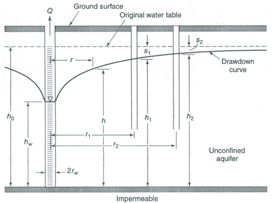

% Diferenciální rovnice 
% Robert Mařík
% 2020

  

> Anotace.
>
> * V přednášce se seznámíme s rovnicemi, obsahujícími derivace neznámé funkce. Jejich využití je všude tam, kde rychlosti změn veličin jsou dány hodnotami těchto veličin. 
> * Typickým příkladem je radioaktivita, protože množství rozpadlých atomů je dáno množstvím nestabilních atomů. Aplikace potom můžeme najít například při ochraně budov před radioaktivním radonem.
> * Jiným typickým příkladem jsou populační modely, kdy přírůstek populace je dán počtem jedinců schopných reprodukce a ten zpětně souvisí s velikostí populace.  Využití je při návrhu trvale udržitelného hospodaření s přírodními zdroji při lovu. 
> * Technicky významným příkladem je i model tepelná výměny, kdy se rychlost změny teploty při tepelné výměně se mění podle intenzity toku a ta se mění s teplotním rozdílem. 
> * Řada diferenciálních rovnic má speciální vlastnosti, které můžeme využít při prozkoumávání řešení. Dokonce můžeme například popsat, jak vypadají všechna řešení, aniž bychom je museli počítat. Některé z těchto taktik se naučíme v přednáškách v dalších týdnech věnovaných lineárním rovnicím (následující přednáška) a autonomním systémům (přednáška následující po přednášce o lineárních rovnicích). Teď to zmiňujeme proto, aby šlo vidět, že v případě diferenciálních rovnic nejsou dovednosti spojené s výpočtem jejich řešení tak důležité, jak jsme zvyklí u jiných druhů rovnic. Proto jsou v následujícím seznamu dovedností až na konci.
> * Důležité dovednosti, které se naučíme v souvislosti s diferenciálními
>   rovnicemi, jsou zejména 
>      * schopnost naformulovat diferenciální rovnici podle slovního popisu
>        mechanismu modelovaného děje, 
>      * dovednost posoudit existenci a jednoznačnost řešení, 
>      * dovednost snížit transformací počet parametrů rovnice 
>      * a až v poslední řadě najít řešení numericky nebo analytickou cestou.

> Prerekvizity.
>
> * Diferenciální rovnice souvisí s derivacemi. Pro úspěšné rozhodnutí, zda se úloha dá modelovat pomocí diferenciální rovnice nutně potřebujeme spolehlivě znát využití derivace. V podstatě s jistotou všude tam, kde se mluví o rychlostech, ale aplikace jsou i jinde. 
> * Pro nalezení analytického řešení diferenciální je třeba ovládat integrál funkce jedné proměnné.

# Modely založené na rychlostech (derivacích)

https://youtu.be/08uAuAgY-lw

## Tepelná výměna, káva v hrnku

\iffalse

\fi

* Z fyziky víme, že *rychlost tepelné výměny mezi dvěma tělesy je úměrná rozdílu jejich teplot* (Newtonův zákon tepelné výměny). Rychlostí tepelné výměny můžeme rozumět například rychlost s jakou roste teplota studeného tělesa v teplém prostředí nebo s jakou klesá teplota horkého tělesa umístěného v chladnějším prostředí.
* Rychlost s jakou roste teplota $T$ tělesa tělesa v čase je derivace teploty podle času. Pokud potřebujeme pracovat s poklesem, uvažujeme záporně vzatou derivaci. Úměrnost matematicky vyjádříme násobením konstantou a teplotní rozdíl může být například při umístění horkého tělesa o teplotě $T$ v chladné místnosti o teplotě $T_0$ vyjádřen rozdílem $T-T_0$.
* Proces tepelné výměny probíhající podle Newtonova zákona
  je tedy možno modelovat vztahem $$ \frac{\mathrm
  dT}{\mathrm dt}=-k(T-T_0).  $$
* K rovnici v ideálním případě dodáváme materiálovou charakteristiku
  (konstantu úměrnosti $k$) a počáteční teplotu. Řešením je
  funkce udávající závislost teploty na čase. Chceme-li znát teplotu
  za určitý čas, není nutné provádět pokus a čekat na uplynutí
  požadované doby. Můžeme teplotu přímo vypočítat.
* Někdy může být vhodné nesledovat teplotu $T$, ale rozdíl oproti
  okolní teplotě, $\tau=T-T_0$. Model se potom zjednoduší na $$
  \frac{\mathrm d\tau}{\mathrm dt}=-k\tau,$$
  tedy na model, kdy rychlost změny je úměrná funkční hodnotě.

## Radioaktivní rozpad, radon ve sklepě 

\iffalse

\fi

* Radioaktivní prvky se rozpadají
  rychlostí, která je úměrná množství dosud nerozpadnutého materiálu. Rychlost, s\ jakou se mění množství (a tedy i\ koncentrace $y$ v daném
  vzorku) nerozpadnutého radioaktivního materiálu je tedy popsána matematickým modelem
  $$\frac{\mathrm dy}{\mathrm dt}=-\lambda y,$$
  kde $\lambda$ je konstanta úměrnosti. Tato rovnice je přirozeným
  důsledkem toho, že pro daný nestabilní izotop mají všechny atomy
  stejnou pravděpodobnost, že u nich dojde k rozpadu a tato
  pravděpodobnost se s\ časem nemění.
* Nejznámější aplikací této rovnice je datování archeologických vzorků pomocí radioaktivního uhlíku $^{14}C$. V tomto případě se sleduje vzájemná relace mezi množstvím tohoto nestabilního uhlíku a množstvím stabilního $^{12}C$. Počáteční podmínka je známa (předpokládáme stejný poměr zastoupení jako relativně
  nedávno, před průmyslovou revolucí) a díky tomu můžeme najít funkci
  udávající, jak s\ časem klesá zastoupení radioaktivního uhlíku. Obsah
  radioaktivního i\ stabilního uhlíku je možné změřit a tím získáme
  odhad, kolik procent radioaktivního
  uhlíku se rozpadlo. Řešení počáteční úlohy poté použijeme pro odhad
  doby, kdy organismus přestal spotřebovávat uhlík z atmosféry,
  tj. odhad stáří vzorku.
* Při pokusu o datování kostí dinosaurů klesne množství
  radioaktivního uhlíku pod měřitelnou úroveň. Proto se
  v tomto případě používají látky s\ delším poločasem rozpadu.
* Optikou běžného života je nejzajímavější aplikací této rovnice model rozpadu v radioaktivní radě uranu, kdy vzniká plynný radon, který může působit problémy ve stavbách a v rizikových lokalitách je potřeba vhodnými konstrukčními přístupy nebo aktivními zařízeními na lapání a odvětrávání radonu.

## Samočištění jezer, kontaminace v jezeře

\iffalse

\fi

* Nechť veličina $y$ udává množství látky, která znečišťuje vodu v\ jezeře o\ objemu $V$.
* Předpokládejme, že do jezera přitéká čistá voda a stejnou rychlostí
  odtéká voda s\ nečistotami (hladina se nemění, je v\ ustáleném
  stavu). Nechť veličina $r$ udává, jaký objem vody se v\ jezeře takto
  vymění za jeden den.  Předpokládejme dále (poněkud nerealisticky),
  že rozdělení znečišťujících částic v\ jezeře je rovnoměrné.
* Úbytek hmotnosti nečistot za časovou jednotku je dán derivací
  $\frac{\mathrm dy}{\mathrm dt}$.
* Protože koncentrace nečistot v jezeře a v odtékající vodě je $\frac
  yV$, je úbytek znečištění možno vyjádřit též ve tvaru $\frac
  rVy$. Podíl $\frac rV$ je pro dané jezero kladná konstanta
  udávající, jak velká část z\ celkového množství vody se v\ jezeře
  vymění za časovou jednotku.  Označíme-li tuto konstantu symbolem
  $k$, je proces úbytku nečistot v\ jezeře popsán vztahem
  $$
  \frac{\mathrm dy}{\mathrm dt}  =-ky.
  $$
* Výše uvedený model se nazývá *rovnice samočištění jezer*, ale tento
  název je čistě formální. Jedná se vlastně o stejnou rovnici, která
  popisuje radioaktivní rozpad nebo změnu rozdílu mezi teplotou
  horkého nápoje a místnosti při chladnutí nápoje.
* Stejnou rovnicí je možné popsat nejenom odbourávání nečistot z
  životního prostředí, ale i\ odbourávání léků nebo drog z
  těla. Považujme krevní oběh za jezero a lék nebo drogu za
  znečišťující látku. V případě, že rychlost odbourávání je úměrná
  koncentraci (platí pro farmakokinetiku prvního řádu, toto splňuje
  většina léčiv za běžných koncentrací), řídí se proces odbourávání
  stejnou diferenciální rovnicí.

\iffalse

## Akutní normovolemická hemodiluce aneb o krvinky neradi přicházíme

* Při chirurgické operaci dochází ke krvácení. Pacient ztrácí krev s
  ní i\ krvinky. Při konstantní intenzitě krvácení to znamená, že
  pacient ztrácí krvinky rychlostí úměrnou počtu krvinek. Formálně na
  krvinky v krvi můžeme pohlížet stejně jako na znečištění
  jezera. Jedná se o stejný proces vyplavování látek obsažených v
  tekutině, jenom měníme interpretaci veličin.
* Pokud očekáváme takový průběh operace, že i\ po uvedeném poklesu bude
  pořád množství krvinek nad minimální přípustnou hodnotou, je možné
  před operací toto množství snížit tím, že se část krve odebere a
  krev se poté doplní vhodnými roztoky.
* Protože pacient bude po výše uvedeném zákroku už od začátku operace
  menší počet krvinek, ztrácí tyto krvinky pomaleji a celkový úbytek
  během operace je menší. Na konci operace se pacientovi vrátí dříve
  odebraná krev. Výsledkem je, že po operaci v jeho těle koluje více
  krvinek, než pokud by byl operován s\ "původní krví".
* Aby metoda fungovala, je nutné odhadnout ztrátu krve během
  operace. Modelování pomocí matematických metod dokáže
  předpovědět, kolik krve odebrat na začátku tak, aby i\ po plánované
  době operace zůstaly krevní hodnoty pacienta v bezpečných
  mezích. Pokud na začátku operace část krve dáme bokem a poté tekutiny
  doplňujeme fyziologickým roztokem (s tím, že vlastní krev vrátíme po
  skončení operace), jedná se o stejný proces a stejnou rovnici jako
  samočištění jezer. Pokud krev doplňujeme během operace z krve
  dopředu odebrané,
  dokážeme model samočištění jezer modifikovat pro daný proces.
* Metoda *akutní normovolemické hemodiluce* nachází v současné praxi
  široké využití v řadě operačních oborů. Poskytuje totiž možnost
  vyhnout se podání alogenní krevní transfuze a tím eliminovat rizika
  z ní vyplývající. Současně je tato metoda výrazně finančně levnější
  a její přínos je tak i\ ekonomický. (Podle https://zdravi.euro.cz/)

\fi

## RC obvod a chytré stěny ve dřevostavbách.

\iffalse

<!--

 -->

\fi

Při nabíjení kondenzátoru o kapacitě $C$ přes odpor o velikosti $R$ roste napětí na kondenzátoru, tím se mění nabíjecí proud a proto se mění i rychlost nabíjení. Pomocí zákonů elektrotechniky je [možno ukázat](http://fyzikalniolympiada.cz/texty/matematika/difro.pdf), že nabíjecí proud $i$ kondenzátoru se řídí vztahem
$$R\frac{\mathrm di}{\mathrm dt}+\frac 1Ci=0.$$
Napětí na kondenzátoru je možno odvodit buď z proudu, napětí na rezistoru a napětí zdroje, nebo z celkového proudu, který prošel kondenzátorem.

Rovnice je tedy stejná jako rovnice radioaktivního rozpadu a rovnice samočištění jezer. Vhodnou manipulací s parametry součástek je možno měnit koeficient u této rovnice a vhodným spojováním těchto obvodů dokážeme podobně simulovat i složitější rovnice. To je bylo základem analogových počítačů, které nepracovaly s čísly, ale s napětími. Tyto počítače sehrály svou roli v době, kdy číslicové počítače byly nedostupné, pomalé a nespolehlivé. Tím byla historická úloha analogových počítačů splněna a již se nepoužívají. 

RC obvod jako takový má však důležité místo i dnes. Dokáže například filtrovat signály podle frekvence. Výpočet jeho charakteristiky (tj. vyřešení rovnice) a sledování napětí na kondenzátoru umožní měření elektrického odporu tam, kde není vhodné odpor určovat z proudu a napětí pomocí Ohmova zákona. Typickým příkladem je odpor dřeva a jeho vodivost, tj. převrácená hodnota odporu. Tato veličina se používá k rychlému stanovení vlhkosti dřeva, nebo je možno ji dlouhodobě sledovat pomocí senzorů zabudovaných do dřevostavby. 

Ve skutečnosti žádná elektronická součástka nemá ideální vlastnosti a proto se v obvodu projevují i nežádoucí parazitní charakteristiky. Pokud by toto bylo limitující, je možné obvod nahradit podobně se chovajícím zapojením s [operačním zesilovačem](https://cs.wikipedia.org/wiki/Zapojen%C3%AD_s_opera%C4%8Dn%C3%ADm_zesilova%C4%8Dem#Integra%C4%8Dn%C3%AD_zesilova%C4%8D) (odkazovaná stránka pracuje s rovnicí v integrálním tvaru).

## Vývoj populace a její ekologický lov

\iffalse

\fi

* Zkoumejme velikost $y$ určité populace v prostředí s\ nosnou kapacitou $K$.
* Realistickým předpokladem dodaným biologickými vědami je, že v prostředí s\ omezenými úživnými
  vlastnostmi specifická míru růstu populace (rychlost s\ jakou
  se velikost populace zvětšuje vztažená na jednotkové množství
  populace) klesá s\ tím, jak se velikost populace přibližuje k nosné
  kapacitě, a rychlost růstu populace je modelována funkcí $ry\left(1-\frac yK\right)$.  Podle
  velkosti koeficientů v této funkci dělíme živočichy na [r-stratégy
  a K-stratégy](http://cs.wikipedia.org/wiki/%C5%BDivotn%C3%AD_strategie) a
  toto dělení odráží, jak se snaží druh vyrovnávat se změnami prostředí.
* Za uvedených předpokladů je možno vývoj populace popsat modelem
  $$\frac{\mathrm dy}{\mathrm dt}=ry\left(1-\frac yK\right),$$ který se nazývá *logistická rovnice.*
* Pokud lovem snížíme přírůstky populace, můžeme tento proces popsat modelem 
  $$\frac{\mathrm dy}{\mathrm dt}=ry\left(1-\frac yK\right)-h(y),$$
  kde $h(y)$ je intenzita lovu populace o velikosti $y$. Modelování
  tohoto procesu umožní nalezení ekonomicky výhodné ale přitom trvale
  udržitelné strategie lovu.

\iffalse

## Lovci meteoritů z ČSSR a ČR

Česká republika je na světové špičce ve oblasti propočítávání dráhy meteoritů ze světelné stopy zachycené sítí bolidových kamer. Vědcům z Astronomického ústavu se podařilo 

* jako prvním na světě najít pozůstatky meteoritu propočítáním jeho dráhy ze snímků zachycených speciálními kamerami a zpětně propočítat, odkud meteorit přiletěl (meteorit Příbram, 1959, první "meteorit s rodokmenem", tj. s doloženým původem),
* jako prvním na světě najít pozůstatky meteoritu 20 let po dopadu použitím analýz, které v době dopadu meteoritu nebyly k dispozici (meteorit Benešov, dopad 1991, nalezen 2011),
* propočítat a najít (mimo jiné i na dně jezera!) zbytky meteoritu Čeljabinsk z roku 2013.

Meteority s vystopovaným původem jsou extrémně vzácné (do roku 2000 jenom 5 meteoritů, do roku 2016 pouze 31 meteoritů) a tým založený Zdeňkem Ceplechou a nyní vedený Pavlem Spurným se podílel na výpočtu drah většiny z nich.
Použité metody jsou popsány například v článku *Ceplecha, Revelle: Fragmentation model of meteoroid motion, mass loss, and radiation in the atmosphere, Meteoritics & Planetary Science 40, Nr 1, 35–54 (2005).* Například ztráta rychlosti třením v atmosféře je modelována rovnicí $$\frac{\mathrm dv}{\mathrm dt}=-K\rho m^{-1/3}v^{2}$$ a ztráta hmotnosti vypařováním 
$$\frac{\mathrm dm}{\mathrm dt}=-K\sigma \rho m^{2/3}v^3.$$
Jedná se o rovnice, kde zrychlení (derivace rychlosti) a časová změna hmotnosti (derivace hmotnosti podle času, rychlost, s jakou ubývá hmotnost)  jsou úměrné vhodným mocninám těchto veličin.

\fi

# Obyčejná diferenciální rovnice prvního řádu

https://youtu.be/3HTs6zJ0gMk

Obyčejná diferenciální rovnice je rovnice, kde vystupuje neznámá
funkce a její derivace. Setkáváme se s\ ní například všude tam, kde
rychlost růstu nebo poklesu veličiny souvisí s\ její
velikostí. Například rychlost s\ jakou se mění teplota horkého tělesa
je funkcí teploty samotné. Rychlost tepelné výměny mezi dvěma tělesy
je totiž úměrná rozdílu jejich teplot (Newtonův zákon). Takto se
přirozeně diferenciální rovnice objevují v modelech nejrůznějších dějů
jevů. Podstatu děje, který modelujeme, musí dodat fyzika, biologie
nebo jiná aplikovaná věda. To v matematice obsaženo není. Matematika
poté poslouží k analýze, jaké jsou pozorovatelné důsledky a tím se
ověří, jestli příslušná aplikovaná věda správně vystihuje podstatu
modelovaného děje.

> Definice (diferenciální rovnice). *Obyčejnou diferenciální rovnicí prvního řádu rozřešenou vzhledem
> k derivaci* (stručněji též diferenciální rovnicí, DR) s neznámou $y$
> rozumíme rovnici tvaru $$ \frac{\mathrm{d}y}{\mathrm{d}x}=\varphi(x,y) \tag{1}$$ kde $\varphi$ je funkce
> dvou proměnných.

(anglicky ordinary differential equation, ODE)

**Další formy zápisu** rovnice (1) jsou
  $$y'=\varphi(x,y),$$
  $${\mathrm{d}y}=\varphi(x,y)\mathrm{d}x,$$
  $${\mathrm{d}y}-\varphi(x,y)\mathrm{d}x=0.$$

**Příklad.**  Najděte všechny funkce splňující $y'=2xy$. (Naučíme se řešit později.)

Diferenciální rovnice udává scénář vývoje systému. K\ jednoznačnému
předpovězení budoucího stavu je ovšem nutno znát nejenom, jaký
mechanismus ovlivňuje vývoj systému, ale také stav současný.

> Definice (počáteční podmínka, Cauchyova úloha). Nechť $x_0$, $y_0$ jsou reálná čísla. Úloha najít
> řešení rovnice  
> $$  \frac{\mathrm{d}y}{\mathrm{d}x}=\varphi(x,y), \tag{1}$$
> které splňuje zadanou *počáteční podmínku*
> $$  y(x_0)=y_0 \tag{2}$$
> se nazývá *počáteční* (též *Cauchyova*) *úloha*. 
> 
> Řešení Cauchyovy úlohy nazýváme též *partikulárním řešením
> rovnice*. Graf libovolného partikulárního řešení se nazývá *integrální
> křivka*.

(anglicky initial condition, IC, initial value problem, IVP)

**Příklad.** Najděte všechny funkce splňující $y'=2xy$ a $y(0)=3$. (Naučíme se řešit později.)

> Věta (existence a jednoznačnost řešení Cauchyovy úlohy). Má-li funkce $\varphi (x,y)$ ohraničenou parciální derivaci $\frac{\partial \varphi}{\partial y}$ v okolí počáteční podmínky, potom má počáteční úloha (1)-(2) právě jedno řešení definované v nějakém okolí počáteční podmínky.

**Příklad.** Rovnice $$y'=y\tag{3}$$ má řešení $y=e^x$, což nahlédneme
  snadno, protože exponenciální funkce se nemění
  derivováním. Dosazením je možné ukázat, že má dokonce řešení
  $$y=Ce^x,\tag{4}$$ kde $C$ je libovolné číslo.

**Příklad.** Řešení počáteční úlohy $$y'=y, \quad y(x_0)=y_0$$ najdeme tak, že využijeme řešení (4) a zařídíme, aby byla splněna počáteční podmínka. Tj. řešením počáteční úlohy je
  $$y=  (y_0 e^{-x_0}) e^x.$$ Vidíme, že toto řešení existuje pro každou počáteční podmínku a proto vzorec (4) popisuje dokonce **všechna** řešení rovnice (3).

## Obecné a partikulární řešení

Řešení diferenciální rovnice je nekonečně mnoho. Zpravidla je dokážeme
zapsat pomocí jediného vzorce, který obsahuje nějakou (alespoň do
jisté míry libovolnou) konstantu $C$. Takový vzorec se nazývá **obecné
řešení rovnice**. Pokud není zadána počáteční podmínka a mluvíme o
**partikulárním řešení**, máme tím na mysli jednu libovolnou funkci
splňující diferenciální rovnici.

**Příklad:** Obecným řešením diferenciální rovnice $$y'=2xy$$ je
  $$y=Ce^{x^2}, \quad C\in\mathbb{R}.$$ Žádná jiná řešení neexistují,
  všechna řešení se dají zapsat v tomto tvaru pro nějakou vhodnou
  konstantu $C$.  Partikulárním řešením je například
  $y=5e^{x^2}$. Řešením počáteční úlohy $$y'=2xy, \quad y(0)=3$$ je
  $$y=3e^{x^2}.$$

\iffalse

**Online řešiče ODE (symbolicky):**

* [Wolfram Alpha](http://www.wolframalpha.com/input/?i=solve+y%27%2Bx*y%3Dx%2Fy)
* [Sage](https://sagecell.sagemath.org/?z=eJyrtE0rzUsuyczP01CvVNfUqNDk5eLlUlYoyi_Ly0xOVahUt63Ur9A25OWCidgqpGSmpWlU6lRoKtjaKgBlFbQVDCG6js5IPbowNe_wWl6ulNTi_JyyVA2oNh2FSk294oz8cg1NFIUKZUCrqvIOLyzOTwLyV-YqlJQlFpVi159aUZCYl6IBMwgAhplAVA==&lang=sage&interacts=eJyLjgUAARUAuQ==)

\fi

# Úvod do problematiky numerického řešení diferenciálních rovnic

Nejprve si naznačíme možnosti numerického řešení. To vychází z grafické interpretace diferenciální rovnice a odpovídá v podstatě modelování, kdy postupně prodlužujeme řešení od zadané počáteční podmínky dopředu či dozadu v čase. Přitom musíme řešit situaci vždy pro konkrétní numerické hodnoty počáteční podmínky a všech parametrů. Naštěstí se dá vhodnou transformací (resp. vhodnou volbou jednotek) počet parametrů zredukovat a tím se zvýší obecná použitelnost numerického výpočtu.

https://youtu.be/7tm1QbNDiz8

## Geometrická interpretace ODE

Protože derivace funkce v bodě udává směrnici tečny ke grafu funkce
v tomto bodě, lze rovnici $$y'=\varphi(x,y)$$ chápat jako předpis, který
každému bodu v rovině přiřadí směrnici tečny k integrální křivce,
která tímto bodem prochází.  Sestrojíme-li v dostatečném počtu
(například i náhodně zvolených) bodů $[x,y]$ v rovině vektory
$(1,\varphi(x,y))$, obdržíme **směrové pole diferenciální rovnice** —
systém lineárních elementů, které jsou tečné k integrálním křivkám.

Počáteční podmínka $y(x_0)=y_0$ geometricky vyjadřuje skutečnost, že graf
příslušného řešení prochází v rovině bodem $[x_0,y_0]$. Má-li tato
počáteční úloha jediné řešení, neprochází bodem $[x_0,y_0]$ žádná další
křivka. Má-li každá počáteční úloha jediné řešení (což bude pro nás
velice častý případ), znamená to, že integrální křivky se *nikde
neprotínají*.

Křivky s\ konstantní hodnotou $\varphi(x,y)$ mají tu vlastnost, že je
všechna řešení protínají pod stejným úhlem, měřeným od kladné části
osy $x$. Například v bodech kde platí $\varphi(x,y)=0$ míří všechny
integrální křivky vodorovně. Proto se křivky, kde je $\varphi(x,y)$
konstantní, nazývají **izokliny**.

\iffalse

## Numerické řešení IVP

manim:Diference|r_Ae2mGnfFs|Numerické řešení diferenciální ronvice je zpravidla založeno na aproximaci derivace konečnou diferencí a postupným prodlužováním řešení od počáteční podmínky směrem dopředu nebo dozadu v čase.

Numerické řešení diferenciálních rovnic je základním nástrojem pro ukázku průběhu simulací pro dané hodnoty parametrů a počátečních podmínek. Jedná se o velice užitečnou a široce používanou činnost při inženýrských simulacích. Neprofesionálům často musí stačit použít hotové postupy, procedury a nástroje. Například [Python](https://gist.github.com/robert-marik/db46ca470720b32028e9a83da807a37c) je jednou z nejvhodnějších voleb.

Řešení počáteční úlohy lze numericky aproximovat poměrně snadno:
začneme v bodě zadaném počáteční podmínkou a v okolí tohoto bodu
nahradíme integrální křivku její tečnou. Tím se dostaneme do dalšího
bodu, odkud opět integrální křivku aproximujeme tečnou.  Směrnici
tečny zjistíme z diferenciální rovnice, buď přímo z derivace (Eulerova
metoda).

Vyjdeme-li z počáteční úlohy $$y'=\varphi(x,y), \quad y(x_0)=y_0,$$
má lineární aproximace řešení v bodě $[x_0,y_0]$ tvar $$y=y_0+\varphi(x_0,y_0)(x-x_0).$$
Funkční hodnotu v bodě $x=x_1$ označíme $y_1$ a tento bod bude dalším  body lomené čáry, tj. $$y_1=y_0+\varphi(x_0,y_0)(x_1-x_0).$$
Hodnota $x_1-x_0$ je krok Eulerovy metody označovaný $h$. Tento postup opakujeme s počáteční podmínkou $y(x_1)=y_1$.
Iterační formule Eulerovy metody má potom následující tvar. $$\begin{aligned}x_{n+1}&=x_n+h, \\ y_{n+1}&=y_n+\varphi(x_n,y_n)h.\end{aligned}$$

Stačí tedy mít zvolen *krok* numerické
metody (délku intervalu, na kterém aproximaci tečnou použijeme) a
výstupem metody bude aproximace integrální křivky pomocí lomené čáry.

**Vylepšení**

* Pro přesnější aproximaci je možné zjemnit krok $h$ (buď všude, nebo
  jenom tam, kde "je to potřeba").
* Pro přesnější aproximaci je možné použít místo $\varphi(x_n,y_n)$
  lepší směrnici, která dokáže zohlednit, jestli se růst zrychluje
  nebo zpomaluje (metoda Runge Kutta druhého nebo čtvrtého řádu, ...).
* Modely obsahující diferenciální rovnice obsahují zpravidla sadu
  parametrů charakterizujících fyzikální vlastnosti studovaných
  objektů. Pro numerické řešení musíme těmto parametrům dát konkrétní
  hodnoty a přicházíme tak o cennou informaci, jak řešení závisí na
  těchto parametrech. Vhodnou úpravou rovnice dokážeme počet parametrů
  eliminovat. Jednoduchým a často dostatečným způsobem je volba
  jednotek, obecnější metodou je transformace diferenciální rovnice
  uvedená v následujícím textu.

**Online řešiče ODE (numericky):**

* [Sage](https://sagecell.sagemath.org/?z=eJyFj0EKgzAQRfdC7pCdSTsVTbudO2RfREQjDY1GErXm9nU8QLv5zB_mP-YPYockMV3EfkuSZSxLo52Ap7HdOfISuKKl7WKFzxLKoqpPp8jRzDKtsDfRu8004f0Qw0mEBMcVUg7s1gbcwUx9M3s7LZGy9xr8uszrgnl0fjbNYI3r8-MFXf3kqb-82fklB9555wPmwZxUlgldXbWSRXz5j6B-SALUF0nkF_PaU9U=&lang=sage&interacts=eJyLjgUAARUAuQ==)
* [Python](https://gist.github.com/robert-marik/db46ca470720b32028e9a83da807a37c)

\fi

## Transformace diferenciální rovnice

manimp:ODE_transformace|Vhodnou transformací je možno zredukovat počet parametrů v rovnici a tím usnadnit numerické simulace. Nematematická cesta k transformaci je vhodná volba jednotek pro sledované veličiny.

\iffalse

 ukazuje, že při modelování procesu ve zmenšeném měřítku je nutné transformovat ostatní veličiny, například čas. Pro nás klíčová slova v čase 3706 dokumentu jsou "tým techniků odhaduje nejvyšší možnou reálnou rychlost sesuvu půdy na jednu minutu, kterou pro simulaci přepočítají na čtyři sekundy". Čas ve zmenšeném modelu ubíhá jinou rychlostí než čas v reálném ději. Foto: Wikipedia.](Vajont.jpg)

\fi

Naučíme se vyjadřovat diferenciální rovnici v jiných proměnných tak,
aby bylo možné snížit počet parametrů v této rovnici. Pro jednoduchost
budeme uvažovat jenom případ, kdy nová proměnná je lineární funkcí
původní proměnné.

Uvažujme funkci $y$ proměnné $x$. Připomeneme si vzorce pro derivaci
součtu, derivaci konstantního násobku a derivaci složené funkce, ale
uvedeme si je v kontextu vhodném pro studium diferenciálních rovnic.

* Z derivace součtu a z derivace konstanty plyne pro funkci $y$ a konstantu $y_0$ vztah
 $$ \frac{\mathrm d (y\pm y_0)}{\mathrm dx} = \frac{\mathrm d y}{\mathrm dx} \pm \frac{\mathrm d y_0}{\mathrm dx} = \frac{\mathrm d y}{\mathrm dx} \pm 0= \frac{\mathrm d y}{\mathrm dx}.$$
* Z derivace konstantního násobku funkce plyne pro funkci $y$ a konstantu $k$ vztah
 $$ \frac{\mathrm d (ky)}{\mathrm dx} = k\frac{\mathrm d y}{\mathrm dx}.$$
* Z derivace složené funkce plyne pro konstantu $k$ a veličinu $X = kx$ vztah
  $$ \frac{\mathrm d y}{\mathrm d x} =    \frac{\mathrm d y}{\mathrm dX}   \frac{\mathrm d X}{\mathrm dx} =   \frac{\mathrm d y}{\mathrm d X} k   $$
  tj.
  $$ \frac{\mathrm d y}{\mathrm d (kx)} = \frac{\mathrm d y}{\mathrm d X} =      \frac 1k \frac{\mathrm d y}{\mathrm d x}.$$

Výše uvedené výpočty je možno shrnout do pravidla v následující poznámce.

> Poznámka (transformace diferenciální rovnice do jiných jednotek). Pro $Y=k_1(y-y_0)$ a $X=k_2 x$ platí   $$  \frac{\mathrm d Y}{\mathrm d X} =   \frac{\mathrm d \Bigl(k_1(y-y_0)\Bigr)}{\mathrm d (k_2 x)} = \frac{k_1}{k_2} \frac{\mathrm dy}{\mathrm dx}$$ a podobně (všimněte si druhé mocniny u $k_2$ díky druhé derivaci) $$  \frac{\mathrm d^2 Y}{\mathrm d X^2} = \frac{k_1}{k_2^2} \frac{\mathrm d^2y}{\mathrm dx^2}.$$   Výraz nalevo neobsahuje konstanty, které jsou ve výrazu   napravo. Tyto konstanty jsou v definici nových veličin $X$ a $Y$. 

Navíc vzorec z poznámky silně připomíná klasické počítání se   zlomky. Proto máme Leibnizův tvar zápisu derivací $\frac{\mathrm   dy}{\mathrm dx}$ při studiu diferenciálních rovnic více v oblibě, než zápis Lagrangeův, $y'$.

**Příklad.** Diferenciální rovnice tepelné výměny $$\frac{\mathrm dT}{\mathrm dt}=-k(T-T_\infty), \quad T(0)=T_0\tag{*}$$ obsahuje tři parametry: teplotu okolního prostředí $T_\infty$, počáteční teplotu $T_0$ a konstantu $k$ související s\ fyzikálními vlastnostmi prostředí. Postupně můžeme posunout  teplotní stupnici tak, aby teplota okolí byla nula a počáteční teplota jedna, tj. hodnotu $T$ snížíme o $T_\infty$ a upravíme dílek stupnice $(T_0-T_\infty)$-krát
$$\frac{\mathrm d\left(\frac{T-T_\infty}{T_0-T_\infty}\right)}{\mathrm dt}=-k\frac{T-T_\infty}{T_0-T_\infty}$$
vydělit konstantou $k$
$$\frac{\mathrm d\left(\frac{T-T_\infty}{T_0-T_\infty}\right)}{k\mathrm dt}=-\frac{T-T_\infty}{T_0-T_\infty}$$
a přeškálovat pomocí konstanty $k$ čas
$$\frac{\mathrm d\left(\frac{T-T_\infty}{T_0-T_\infty}\right)}{\mathrm d(kt)}=-\frac{T-T_\infty}{T_0-T_\infty}.$$
Po substituci $y=\frac{T-T_\infty}{T_0-T_\infty}$, $x=kt$ má úloha tvar
$$\frac{\mathrm d y}{\mathrm d x}=-y,\quad y(0)=1. \tag{**}$$
Nová rovnice (**) *neobsahuje žádné parametry* a proto je pro studium
jednodušší. Přesto je v ní obsažena veškerá informace obsažená v
rovnici (*). Tuto informaci je však nutno interpretovat v kontextu
definice nových proměnných. Například to, že všechna řešení rovnice (**) konvergují k nule
znamená, že všechna řešení rovnice (*) konvergují k $T_0$. To, že řešení rovnice (**) klesne na poloviční hodnotu za čas $\ln 2$ znamená, že vzdálenost řešení rovnice (*) od rovnovážného stavu se na polovinu zmenší za čas $\frac 1k \ln 2$.

> Poznámka (nondimenzinalizace, rozměrová analýza).  Proces eliminace parametrů z modelu popsaného diferenciální rovnicí se nazývá nondimenzionalizace nebo rozměrová analýza modelu, protože eliminaci parametrů je vhodné provádět tak, aby výsledné nové veličiny vycházely bez fyzikálních jednotek. K tomu se provádí rozbor jednotek jednotlivých veličin. V jednoduchých případech však stačí primitivní postup popsaný v odstavcích výše a ukázaný na příkladu. V tomto příkladě veličina $x$ nemá fyzikální jednotku, protože je součinem konstanty $k$ (s jednotkou $\mathrm s^{-1}$) a času $t$ (s jednotkou $\mathrm s$). Je možné ji považovat za *bezrozměrný čas*. Veličina $y$ také nemá fyzikální jednotku, protože je podílem dvou teplot a je možné ji považovat za *bezrozměrnou teplotu*. 
>
>V této úloze bylo zavedení nových veličin přirozené. I u méně zřejmých úloh zkušenosti ukazují, že je vhodné volit transformaci tak, aby vznikly veličiny bezrozměrné, které nemají fyzikální jednotku. Například v
*Horáček, Fyzikální a mechanické vlastnosti dřeva I* je zavedena [bezrozměrná vlhkost, bezrozměrný čas a bezrozměrná vzdálenost](https://is.mendelu.cz/eknihovna/opory/zobraz_cast.pl?cast=9180;lang=cz) na straně 61 pro rovnici popisující difuzi a [charakteristická délka, Biotovo číslo (bezrozměrná tepelná vodivost) a bezrozměrná teplota, bezrozměrný čas a bezrozměrná vzdálenost](https://is.mendelu.cz/eknihovna/opory/zobraz_cast.pl?cast=9182;lang=cz) pro rovnici popisující vedení tepla na stranách 88 a 89.

<!--

# Malá odbočka - zaokrouhlovací chyby v numerických výpočtech

Uvedli jsme, že počáteční úlohu umíme vyřešit numericky. Ukázali jsme
si základní algoritmus (Eulerův) a řekli, že existují algoritmy
pokročilejší. Na tomto místě upozorníme na záludnosti skryté v
numerických výpočtech. Je iluzorní se domnívat, že zjemněním kroku při
numerickém řešení diferenciální rovnice vždy dostaneme přesnější
řešení. Toto platí jenom dokud se nedostaneme ke kritické hodnotě
kroku, kdy další snižování vede k tomu, že zpřesnění díky kratšímu
kroku se přebije akumulovanou chybou z velkého množství výpočtů nutně
zatížených zaokrouhlováním a dalším zjemňováním přesnost ztrácíme.

Zajímavá léčka je v samé podstatě výpočtů na počítači a to v
reprezentaci desetinných čísel ve dvojkové soustavě. Například číslo
0.1 je ve dvojkové soustavě periodické! Proto desetinásobným sečtením
tohoto čísla ve dvojkové soustavě nedostaneme (překvapivě) jedničku! Je to podobné, jako
bychom v námi běžně používané dvojkové soustavě třikrát sečetli jednu třetinu v desetinném tvaru
reprezentovaném konečným počtem desetinných míst, tj. například
třikrát sečetli číslo $0.33333333$. Nedostaneme přesně jedničku. 

Tento efekt měl i\ tragický důsledek. Software protiraketového
systému Patriot počítal čas postupným přičítáním desetiny
sekundy. Protože systém byl vytvořen a testován na mobilním zařízení,
které se často restartovalo a běželo krátkou dobu, ničemu to
nevadilo. Nasazení v systému Patriot však byla chyba. Při ostrém
nasazení systém běžel dlouho, zaokrouhlovací chyba se kumulovala
například 100 hodin. I\ když za tu dobu chyba dosáhla pouze zlomku
sekundy, raketa letící vysokou rychlostí již byla jinde, než systém
Patriot propočítal.  Dne 25.2.1991 systém Patriot během operace
Pouštní bouře na osvobození Kuvajtu od irácké okupace nesestřelil
útočící raketu Scud a ta zabila 28 vojáků osvobozující armády a okolo
100 osob zranila.

S chybami plynoucími ze zaokrouhlování se setkáme i\ při výpočtech mimo modelování diferenciálních rovnic. Viz například [Floating-point arithmetic may give
inaccurate results in
Excel](https://support.microsoft.com/en-us/help/78113/floating-point-arithmetic-may-give-inaccurate-results-in-excel).

-->

<!-- 

# ODE tvaru $\frac{\mathrm dy}{\mathrm dx}=f(y)$

Rovnice $$\frac{\mathrm dy}{\mathrm dx}=f(y)\tag{♣}$$ se nazývá
autonomní, nebo též nezávislá na čase. Je speciálním případem rovnice
se separovanými proměnnými, která je uvedena na dalším slidu a naučíme
se ji řešit analytickou cestou. Proto se nyní nebudeme zaměřovat na
hledání obecného řešení, ale pokusíme se popsat chování řešení, aniž
bychom tato řešení znali. Pokusíme se s\ co nejmenší námahou říct, jak
se budou řešení chovat.

* Je-li $f(y_0)=0$, je konstantní funkce $y(x)=y_0$ řešením rovnice
  (♣). Protože derivace konstantní funkce je nula, vidíme, že řešením
  rovnice $$f(y)=0$$ obdržíme všechna konstantní řešení rovnice (♣).
* Konstantní řešení představují rovnovážný stav. Často nás zajímá,
  jestli při vychýlení z tohoto rovnovážného stavu má systém tendenci
  se vrátit do původního stavu, nebo se od původního stavu dále
  odchylovat. Na tuto otázku dává odpověď následující věta.

> Věta (stabilita konstantních řešení). Jestliže platí $f(y_0)=0$, je
  konstantní funkce $y(x)=y_0$ konstantním řešením rovnice
  $$\frac{\mathrm dy}{\mathrm dx}=f(y).$$ Toto řešení je stabilní
  pokud $f'(y_0)<0$ a nestabilní pokud $f'(y_0)>0$.

Pro grafickou intepretaci je vhodné připomenout, že funkce s kladnou
derivací jsou rostoucí a funkce se zápornou derivací klesající. Pokud
má tedy pravá strana derivaci různou od nuly, poznáme stabilitu z\ monotonie pravé strany.

**Příklad.** Logistická diferenciální rovnice s konstantním lovem
  $h$, tj. rovnice
  $$\frac{\mathrm dy}{\mathrm dt}=ry\left(1-\frac yK\right)-h,$$
  má pro malé $h$ dva stacionární body. Funkce $ry\left(1-\frac
  yK\right)$ je parabola otočená vrcholem
  nahoru a s nulovými body $y=0$ a $y=K$. V prvním stacionárním bodě
  je funkce rostoucí a tento stacionární bod je nestabilní. Ve druhém
  stacionárním bodě je funkce klesající a tento stacionární bod je
  stabilní. Jak se zvyšuje faktor $h$, graf paraboly se posouvá směrem
  dolů a oba stacionární body se posouvají směrem k sobě a k\  vrcholu. Jejich stabilita zůstává neporušena. To znamená, že sice
  pořád existuje stabilní stav, ale se zvyšující se intenzitou lovu se
  tento stacionární stav dostává stále blíže ke stavu nestacionárnímu a
  rovnováha je tedy poněkud křehká. 

#  Příklad - časový rozestup mezi trolejbusy

\iffalse

\fi

Uvažujme dva trolejbusy jedoucí za sebou po stejné trati. Označme
$x(t)$ jejich časový odstup. Pokud první trolejbus zastaví na určité
zastávce v čase $t$, druhý trolejbus na tuto zastávku dorazí v čase
$x(t)$. Naším úkolem je zjistit, jak se $x(t)$ mění s\ rostoucím $t$.

Předpokládejme, že

* první vůz jede konstantní rychlostí (není dopravní špička)
* pokud žádní pasažéři nečekají na druhý vůz, druhý vůz se
  pohybuje rychleji než první vůz a oba vozy se "sjedou", tj. $x(t)$
  klesá, pokud na druhý vůz nečekají žádní pasažéři
* rychlost druhého vozu klesá s\ rostoucím počtem pasažérů, kteří
  čekají na zastávce 
* počet pasažérů kteří čekají na zastávce roste s\ rostoucím
  intervalem mezi oběma vozy.

Uvažujme, že všechny závislosti popsané výše jsou lineární (přímá
úměrnost).

Situaci je možno modelovat diferenciální rovnicí
$$ 
  \frac{\mathrm dx}{\mathrm  dt}=\beta x-\alpha,
$$
kde $\alpha$ a $\beta$ jsou kladné reálné konstanty. Tato rovnice má konstantní řešení $x=\frac \alpha\beta$. Toto řešení je nestabilní, protože 
$$\frac{\mathrm d}{\mathrm dx}(\beta x-\alpha)=\beta>0.$$ Žádné jiné
konstantní řešení neexistuje a proto všechna řešení klesají na nulu
nebo neohraničeně rostou.

Vzhledem k nestabilitě stacionárního řešení nemůžeme nechat řidiče
veřejné dopravy jezdit "jak jim to vyjde". Situace by směřovala k
tomu, že cestující budou nejprve dlouho čekat na trolejbus a nakonec
přijede několik trolejbusů těsně za sebou. (Podle knihy P.  Blanchard,
R. L. Devaney, G.  R. Hall: Differential equations, Cengage Learning
(2006), 828 pp.)

--> 

# ODE tvaru $\frac{\mathrm dy}{\mathrm dx}=f(x)g(y)$ (rovnice se separovanými proměnnými)

https://youtu.be/yH6jzK_999E

Najít řešení obecné diferenciální rovnice je nemožné, ani však takové ambice mít nemusíme. V praxi se setkáváme s poměrně speciálními druhy diferenciálních rovnic a pro ně jsou metody řešení k dispozici. Jeden takový jednoduše řešitelný druh diferenciální rovnice je představen v následujícím textu.

> Definice (ODE se separovanými proměnnými). Diferenciální rovnice tvaru
> $$    \frac{\mathrm{d}y}{\mathrm{d}x}=f(x)g(y) \tag{S}$$
> kde $f$ a $g$ jsou funkce spojité na (nějakých) otevřených intervalech
> se nazývá *obyčejná diferenciální rovnice se separovanými proměnnými.*

**Příklad:** Rovnice $$y'+xy +xy^2=0$$ je rovnicí se separovanými
  proměnnými, protože je možno ji zapsat ve tvaru $$y'=-xy(y+1).$$
  Rovnice $$y'=x^2-y^2$$ není rovnice se separovatelnými proměnnými.

# Řešení ODE se separovanými proměnnými

1.  Má-li algebraická rovnice $g(y)=0$ řešení $k_1$, $k_2$, …, $k_n$,
    jsou konstantní funkce $y\equiv k_1$, $y\equiv k_2$, …,
    $y\equiv k_n$ řešeními rovnice.

2.  Pracujme na intervalech, kde $g(y)\neq 0$ a odseparujeme proměnné.
    $$          \frac{\mathrm{d}y}{g(y)}=f(x)\mathrm{d}x$$

4.  Získanou rovnost integrujeme. Tím získáme obecné řešení v implicitním tvaru.
    $$           \int \frac{\mathrm{d}y}{g(y)}=\int f(x)\mathrm{d}x+C$$

5.  Pokud je zadána počáteční podmínka, je možné ji na tomto místě
    dosadit do obecného řešení a určit hodnotu konstanty $C$. Tuto
    hodnotu poté dosadíme zpět do obecného řešení a obdržíme řešení
    *partikulární*.

6.  Pokud je to možné, převedeme řešení (obecné nebo partikulární) do
    explicitního tvaru (vyjádříme odsud $y$).

Poslední krok (převod do explicitního tvaru) je volitelný, zpravidla
záleží na tom, co dalšího hodláme s\ řešením dělat. Pro většinu výpočtů
je však explicitní tvar vhodnější než tvar implicitní a proto se o něj
vždy snažíme.

> Poznámka (zápis partikulárního řešení pomocí určitého integrálu). V případě počáteční podmínky $y(x_0) = y_0$ je možné spojit třetí a čtvrtý krok a použít určitý integrál
$$
\int_{y_0}^y \frac{\mathrm{d}t}{g(t)}=\int_{x_0}^x f(t)\mathrm{d}t.
$$

Počáteční úloha má jediné řešení, pokud má pravá strana ohraničenou parciální derivace podle $y$, jak je zmíněno v úvodu přednášky. Nicméně pro diferenciální rovnici se separovanými proměnnými je možné vyslovit následující mnohem jednodušší postačující podmínku pro jednoznačnost řešení.

> Věta (existence a jednoznačnost řešení Cauchyovy úlohy pro rovnici se separovanými proměnnými). Je-li $g(y_0)\neq 0$, má počáteční úloha $$\frac{\mathrm{d}y}{\mathrm{d}x}=f(x)g(y),\qquad y(x_0)=y_0$$ právě jedno řešení definované v nějakém okolí počáteční podmínky.

> Poznámka (existence a jednoznačnost konstantního řešení). Je-li $g(y_0)=0$,
> potom má počáteční úloha $$\frac{\mathrm{d}y}{\mathrm{d}x}=f(x)g(y),\qquad
> y(x_0)=y_0$$ konstantní řešení $y(t)=y_0,$ ale z předchozí věty neplyne nic o
> jednoznačnosti tohoto řešení. Je možné použít větu o jednoznačnosti platnou pro obecnější
> rovnici $$\frac{\mathrm{d}y}{\mathrm{d}x}=\varphi(x,y)$$ uvedenou výše a potom je řešení určeno jednoznačně, pokud má funkce
> $g$ v okolí počáteční podmínky ohraničenou derivaci.

# Redukce parciální diferenciální rovnice na obyčejnou

https://youtu.be/vDEQBp8y6Jk

V předchozích týdnech jsme se seznámili s modely založenými na parciálních derivacích, zejména s difuzní rovnicí. V případě, kdy hledaná stavová veličina je funkcí jenom jedné proměnné se parciální derivace redukují na obyčejné derivace a můžeme takové modely řešit v rámci obyčejných diferenciálních rovnic.

## Jednorozměrný případ

Ukážeme si , že parciální diferenciální rovnice popisující tok tepla nebo tok podzemní vody se ve speciálních případech redukují na diferenciální rovnice, jaké jsme se právě naučili řešit.

Uvažujme tok tepla stěnou o tloušťce $d$ která odděluje dvě prostředí o teplotách $T_1$ a $T_2$.

Stacionární tok tepla v jedné dimenzi je dán rovnicí
$$\frac{\partial}{\partial x}\left(k\frac{\partial T}{\partial x}\right)=0.$$
V ustáleném stavu je $T$ funkcí jedné proměnné $x$ a parciální derivace se redukují na obyčejné derivace. Rovnice má tvar
$$\frac{\mathrm d}{\mathrm d x}\left(k\frac{\mathrm d T}{\mathrm d x}\right)=0.$$
Po integraci dostáváme $$k\frac{\mathrm d T}{\mathrm d x}=C_1.$$ Tuto rovnici budeme řešit ve dvou různých situacích, a to pro lineární a nelineární materiálové vztahy.

### Lineární materiálové vztahy, tj. konstantní materiálová charakteristika

* Je-li $k$ konstantní, dostáváme
$$\frac{\mathrm dT}{\mathrm dx}=\frac {C_1}k$$
a integrací  dostáváme
$$T=\frac {C_1}k x + C_2.$$
Konstanty $C_1$ a $C_2$ určíme z podmínek na teplotu na jednotlivých stranách stěny. Vidíme, že teplota ve stěně klesá lineárně.
* Stejná rovnice a stejné řešení vychází i pro piezometrickou hladinu při rovinném ustáleném proudění podzemní vody v případě, že materiálová charakteristika je konstantní, tj. při proudění s napjatou hladinou (podzemní kolektor s nepropustným stropem a pod tlakem).

### Nelineární materiálové vztahy, tj. nekonstantní materiálová charakteristika

* Zopakujme předchozí výpočet pro materiál s nelineární materiálovou odezvou, kdy Fourierův (Darcyho v případě podzemní vody) zákon není lineární, tj. $k$ závisí na teplotě. Nejjednodušší zobecnění je případ, kdy $k(T)$ je lineární, tj. platí $$k(T)=aT+b.$$
Poté má rovnice tvar 
$$({aT+b})\frac{\mathrm dT}{\mathrm dx}={C_1}$$
a po separaci proměnných dostáváme
$$({aT+b}){\mathrm dT}={C_1}{\mathrm dx}$$
a
$$\frac 12 aT^2+bT=C_1x+C_2.$$ Teplotní profil není lineární, ale parabolický s parabolou otočenou naležato. Kterou polovinu paraboly vybrat poznáme z toho, že teplota uvnitř stěny je mezi teplotami na okrajích.
* Stejný výpočet pro $b=0$ odpovídá proudění podzemní vody s volnou hladinou. Toto je jiným způsobem (přímé odvození rovnice z Darcyho zákona) odvozeno v textu Dana Říhová a Jana Marková, Poznámky k přednáškám z Hydrauliky, přednáška č. 9. Hladina podzemní vody tedy klesá jako ležatá parabola.

## Dvourozměrný radiálně symetrický případ

Jiný případ, kdy je možno redukovat složitost problému na jednu dimenzi je stacionární děj v rovině, kdy je situace radiálně symetrická. K tomu je nutno transformovat divergenci a gradient do polárních souřadnic. Příslušné vzorce nebudeme odvozovat, dodá je [Wikipedie](https://en.wikipedia.org/wiki/Del_in_cylindrical_and_spherical_coordinates#Del_formula).

* Uvažujme například horkou trubku ochlazovanou zvenčí a proudění tepla radiálně směrem od středu. Teplota $T$ je funkcí vzdálenosti $r$ od středu a po transformaci gradientu a divergence do polárních souřadnic se stacionární bezzdrojová rovnice vedení tepla $$0=\nabla\cdot(k\nabla T)$$ redukuje na
$$\frac 1r \frac{\partial}{\partial r}\left(kr\frac{\partial T}{\partial r}\right)=0.$$
Parciální derivace se opět redukují pro funkci jedné proměnné na obyčejné derivace a stejně jako v předchozím případě můžeme integrovat na
$$kr\frac{\mathrm d T}{\mathrm d r}=C_1.$$
Odsud
$$k\mathrm d T=\frac{C_1}r {\mathrm d r}$$
a
$$kT={C_1}\ln(r)+C_2.$$
Konstanty $C_1$ a $C_2$ se určí z teplot na vnitřním a vnějším povrchu trubky.
* Stejný vzorec platí pro analogické radiální proudění podzemní vody při proudění s napjatou hladinou. Toho se využívá při čerpacích zkouškách nebo při umělém snižování hladiny spodní vody. Po dosazení relevantních veličin a výpočtu konstant se odvozený vzorec uvádí ve tvaru $$h-h_0=\frac{Q}{2\pi T}\ln \frac r{r_0}$$ a nazývá [Thiemova rovnice.](https://en.wikipedia.org/wiki/Aquifer_test#Steady-state_Thiem_solution)
* Předchozí postup můžeme modifikovat i pro radiální proudění s volnou hladinou, tj. proudění modelované rovnicí $$\nabla \cdot(K\nabla h)=0,$$ kde $K=kh$ je materiálová konstanta pro proudění s volnou hladinou. Jako v předchozím případě přejdeme do proměnné $r$ a dostáváme
$$khr\frac{\mathrm d h}{\mathrm d r}=C_1.$$
Odsud 
$$h{\mathrm d h}=\frac{C_1}{kr}\mathrm dr$$
a
$$\frac 12 h^2=\frac{C_1}{k}\ln(r)+C_2.$$
Zpravidla se tato rovnice používá pro stanovení vydatnosti čerpané studny a konstanty $C_1$ a $C_2$ určíme z výšky hladiny ve studni a z výšky hladiny v kontrolním vrtu nedaleko studny. 
Tento vztah umožňuje například navrhnout průměr studny, odhadnout
vydatnost studny, nebo pomocí odčerpávaného vrtu a menších pomocných
vrtů sledujících pokles hladiny v okolí odčerpávaného vrtu stanovit
filtrační součinitel $k$. Využití vzorce je však mnohem rozmanitější,
umožňuje vypočítat poměry ve stavebních jámách a v jejich okolí. To je
užitečné například při odhadu, kolik vody se hromadí ve výkopu. Další
využití je, že dokážeme odhadnout vliv stavební jámy na hydrologické
poměry v okolí a tyto poměry dokážeme měnit a přizpůsobovat našim
potřebám. Častou aplikací je také hydraulická clona (soustava prvků
rozmístěných a provozovaných tak, aby nedocházelo k šíření kontaminace
z chemické výroby do vodárensky využívaných vod). V tomto případě je však situace komplikovanější, protože je nutné zkombinovat dostředivé proudění k čerpanému vrtu s rovinným prouděním podzemní vody. Toto se naučíme v příští přednášce a využijeme linearitu. 

# Diferenciální rovnice růstu vodní kapky

https://youtu.be/gJoOmF39rbw

\iffalse

\fi

Modelujme růst kulové kapky. Ta roste tak, že na povrchu kondenzují
vodní páry. Kapka proto roste tak, že její objem se zvětšuje rychlostí
úměrnou povrchu. Povrch je zase úměrný druhé mocnině poloměru a
poloměr je úměrný třetí odmocnině objemu. Platí tedy (po sloučení všech konstant úměrnosti do jedné)
$$\frac{\mathrm dV}{\mathrm dt}=kV^{2/3}.$$  
Tato rovnice má konstantní řešení $V=0$. Nekonstantní řešení dostaneme
po úpravě
$$V^{-2/3}\mathrm dV=k\mathrm dt$$
a po integraci
$$\int V^{-2/3}\mathrm dV=k\int \mathrm dt,$$
což dává
$$3V^{1/3}=kt+C$$
a
$$V=\left(\frac 13 kt+ \frac 13 C\right)^3,$$
tj.
$$V=\left(k_0t+ c\right)^3,$$
kde $k_0=\frac 13 k$ a $c=\frac 13 C$ jsou konstanta spojená rychlostí
kondenzace a integrační konstanta.

Všimněte si, že počáteční úloha s\ počáteční podmínkou $V(0)=0$ má
konstantní nulové řešení $$V(t)=0$$ a nenulové řešení
$$V(t)=(k_0t)^3.$$ Máme zde tedy nejednoznačnost v řešení počáteční
úlohy. Tato nejednoznačnost není v rozporu s\ větou o existenci a
jednoznačnosti řešení, protože pravá strana je nulová (podmínka pro
separovatelnou rovnici není splněna) a nemá ohraničenou derivaci podle
$V$ (podmínka pro obecnou rovnici také není splněna). A\ nejednoznačnost má v tomto případě dokonce fyzikální význam. Plynné
skupenství může existovat i\ pod bodem kondenzace. Takovému jevu se
říká přechlazená pára. Aby došlo ke kondenzaci, musí být k dispozici
kondenzační jádra, například nečistoty ve vzduchu. Proto ve
znečištěném ovzduší dochází častěji ke kondenzaci a tvorbě mlhy. Své
by o tom mohli vyprávět obyvatelé Londýna, kteří se proslulých mlh
zbavili poté, co se omezilo topení uhlím. My dnes spíše známe
přechlazenou tekutinu ve formě hřejících polštářků, kde se po lupnutí
plíškem spustí přeměna skupenství na pevné spojená s\ intenzivním
uvolněním tepla.

