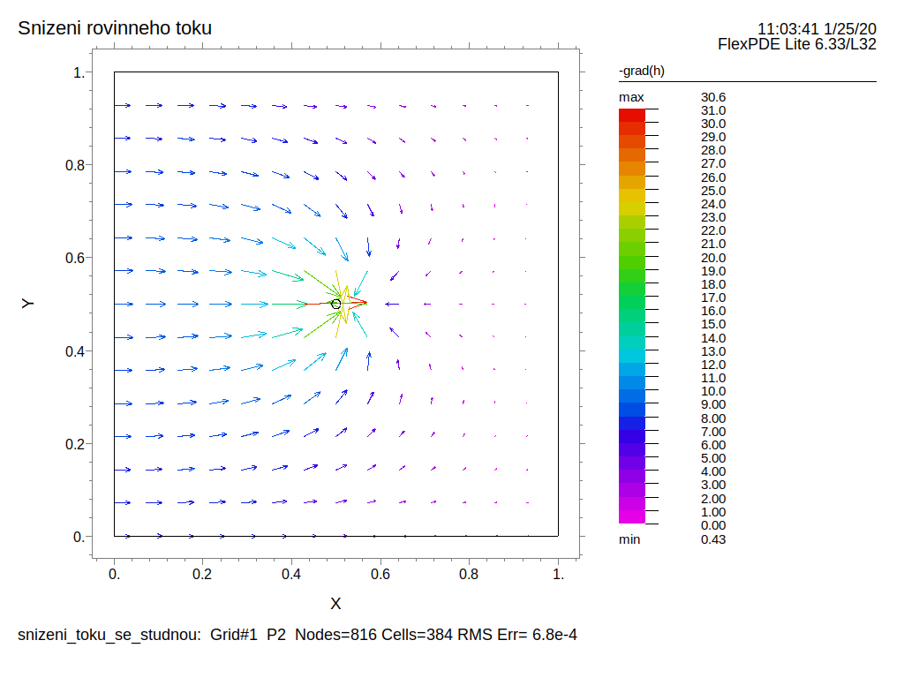

% Lineární operátory a lineární diferenciální rovnice
% Robert Mařík
% 2014–2021

> Anotace.
>
> * Pasáže o lineární diferenciální rovnici prvního řádu jsou omezeny na rovnici s konstantními koeficienty. Rovnicím s nekonstantními koeficienty se nevěnujte. V tomto textu nejsou pokryty, nebudou ve cvičeních, nebudou v domácích úlohách ani písemkách. Pokud na ně narazíte při počítání starších písemek, nevěnujte se jim. Tato úprava souvisí s tím, že se více věnujeme aplikačnímu potenciálu než se tak činilo v letech minulých.
> * Řešením lineární rovnice $y=ax+b$ je přímka a k jejímu zadání stačí jediný bod a jediný směr. Ukážeme si, že podobná tvrzení platí i pro celou řadu dalších rovnic, včetně diferenciálních rovnic a soustav diferenciálních rovnic.
> * Výstupem bude dovednost popsat u některých speciálních rovnic množinu řešení tak, že nalezneme dva nebo více relativně jednoduše nalezitelné objekty a pomocí nich sestavíme všechna řešení. Podobně jako dokážeme z jednoho bodu a směru zrekonstruovat všechny body přímky.
> * Naučíme se posoudit, jak se chovají řešení diferenciálních rovnic, kde pravá strana je lineární. Toto se později využije tak, že pomocí těchto rovnic budeme aproximovat obecnější nelineární modely.
> * Pokud vám jde o to, pochopit proč výpočty fungují tak jak fungují, projděte si všechny materiály. Pokud máte ambice nižší, můžete se věnovat jenom pasáži "Lineární diferenciální rovnice prvního řádu s konstantními koeficienty" a k ostatním pasážím se vrátit, jakmile je budete potřebovat (pokud vůbec). Důležité pasáže jsou poptávány ve WeBWorKových úlohách a problematika toho, jak se chovají řešení nelineárních systémů, je lineárním systémům nadřazena a bude součástí příští přednášky. Pokud budete ovládat nelineární systémy, lineární systémy se dají chápat jako jejich podmnožina.

> Prerekvizity.
>
> * Co se týká využitých metod studia lineárních operátorů, je přednáška relativně nezávislá. Nemá v tomto ohledu žádné prerekvizity. 
> * Užitečnost linearity si ukážeme na příkladech diferenciálních rovnic několika typů. Proto je vhodné si zopakovat význam derivace, využití derivace v modelech založených a na diferenciálních rovnicích a interpretaci členů difuzní rovnice. 
> * Lineární systémy je vhodné zapisovat a studovat maticově. Budeme proto potřebovat maticový součin, maticovou formulaci soustavy lineárních rovnic, nutnou a postačující podmínku jednoznačné řešitelnosti této soustavy pomocí determinantu. 
> * Studentům obeznámeným s komplexními čísly se bude hodit Eulerova identita. Ostatní studenti budou muset příslušné pasáže akceptovat jako fakt.

# Lineární operátory

https://youtu.be/_PcHv1GeEq4

**Operátorem** rozumíme zobrazení, které má na vstupu i na výstupu
funkci. Například pro funkce jedné proměnné mohou být operátory
derivace, druhá derivace, vynásobení funkce funkcí $\ln x$ anebo vnoření zadané funkce do funkce $\ln x$. Tj. pro $y=y(x)$ můžeme uvažovat operátory
$F_1[y]=\frac{\mathrm dy}{\mathrm dx}$, $F_2[y]=\frac{d^2y}{dx^2}$, $F_3[y](x)=y(x)\ln(x)$, $F_4[y](x)=\ln(y(x)).$

\iffalse 

\fi

**Lineárním operátorem** rozumíme zobrazení, které zachovává součet
funkcí a násobek konstantou, tj. platí $$L[y_1+y_2]=L[y_1]+L[y_2]$$ a
$$L[C y_1]=C L[y_1]$$ pro libovolné reálné číslo $C$ a libovolné
funkce $y_1$ a $y_2$ z definičního oboru operátoru $L$.

## Příklady lineárních operátorů

Linearitu se naučíme využívat k tomu, abychom úlohu najít řešení
rovnice rozkouskovali na řešení jednodušších úloh. Například je možné
zkombinovat úlohu na stacionární proudění podzemní vody a úlohu na radiální proudění ke studni. Každou z těchto úloh umíme redukovat na separovatelnou diferenciální rovnici a vyřešit. Zkombinováním těchto úloh je možné modelovat chování studny v rovinném toku. Používá se například k zachycení kontaminace spodní vody.

\iffalse 

\fi

* Operátor derivace, tj. operátor definovaný vztahem $L[y]=\frac{\mathrm dy}{\mathrm dx}$ je lineární. Toto plyne ze vzorců pro derivaci součtu a konstantního násobku.
* Buď dána funkce $a(x)$. Operátor násobení funkcí $a(x)$, tj. $L[y](x)=a(x)y(x)$ je lineární. To plyne z komutativity násobení a z distributivního zákona (roznásobování závorek).
* Složení (postupná aplikace) lineárních operátorů je lineární operátor. Například tedy
$$\frac{\mathrm d^2 y}{\mathrm dx^2}$$ je lineární operátor.
* Součet lineárních operátorů je lineární operátor. 
* Buď pevně dána funkce $a(x)$. Lineární operátor
$$L[y]=\frac{\mathrm dy}{\mathrm dx}+a(x)y$$
se nazývá *lineární diferenciální operátor prvního řádu*.
* Buďte pevně dány funkce $p(x)$ a $q(x)$. Lineární operátor
$$L[y]=\frac{\mathrm d^2y}{\mathrm dx^2}+p(x)\frac{\mathrm dy}{\mathrm dx}+q(x)y$$
se nazývá *lineární diferenciální operátor druhého řádu*.
* Buď dána $n\times n$ matice reálných čísel $A$ a $n$-vektorová funkce $\vec F(x)$. Zobrazení, které funkci $\vec F(x)$ přiřadí součin $A\vec F(x)$ je lineární. To plyne z distributivnosti násobení vzhledem ke sčítání matic a z toho, že součin matice a reálného čísla komutuje.
* Operátor z levé strany difuzní rovnice
$$
      {\frac{\partial u}{\partial t}-\nabla\cdot \bigl(D\nabla u\bigr)=\sigma, }$$
      tj. operátor $$L[u]=\frac{\partial u}{\partial t}-\nabla\cdot \bigl(D\nabla u\bigr)$$ je lineární. Po rozepsání divergence a gradientu pomocí parciálních derivací (které jsou lineární) jenom kombinujeme lineární operátory a tedy zachováváme linearitu.
* Rovnice podzemní vody pro proudění s napjatou hladinou
$$ {S_S\frac{\partial h}{\partial t} - \nabla\cdot \bigl(T\nabla h\bigr)=  \sigma }$$
je speciálním případem difuzní rovnice a operátor definovaný levou stranou je lineární. Rovnice podzemní vody pro proudění s volnou hladinou
$$ {S_S\frac{\partial h}{\partial t} - \nabla\cdot \bigl(kh\nabla h\bigr)=  \sigma }$$
      definuje operátor
      $$F[h]={S_S\frac{\partial h}{\partial t} - \nabla\cdot \bigl(kh\nabla h\bigr)}$$
      a není lineární. Pokud však využijeme rovnost
      $$h\frac{\partial h}{\partial x}=\frac 12 \frac{\partial h^2}{\partial x}$$ a analogickou rovnost i pro další parciální derivace, je ve stacionárním případě (derivace podle času je nulová) rovnici možno přepsat do tvaru 
$$ - \frac 12 \nabla\cdot \bigl(k\nabla (h^2)\bigr)= \sigma $$
a levá strana definuje lineární operátor v proměnné $h^2$.

## Princip superpozice

> Věta (princip superpozice). Každý lineární operátor zachovává lineární kombinaci funkcí, tj. platí
> $$L[C_1 y_1+C_2 y_2]=C_1 L[y_1]+C_2 L[y_2]$$
> vždy, když $C_{1,2}\in\mathbb{R}$ a $y_{1,2}$ jsou funkce z definičního oboru operátoru $L$.

Plyne přímo rozepsáním
$$
\begin{aligned}L[C_1 y_1+C_2 y_2]&=
L[C_1 y_1]+L[C_2 y_2]\\
&=
C_1 L[y_1]+C_2 L[y_2]
\end{aligned}
$$

# Operátorové rovnice s lineárním operátorem

https://youtu.be/i3By7KBu6ec

Operátorovou rovnicí budeme rozumět rovnici $$L[x]=b(t),$$ kde $b(t)$
je funkce a $L$ operátor. 

* Například pro $b(t)=0$ a $L[x]=\frac{\mathrm dx}{\mathrm dt}-x$ má
rovnice tvar
$$\frac{\mathrm dx}{\mathrm dt}-x=0,$$
tj.
$$\frac{\mathrm dx}{\mathrm dt}=x.$$

Následující věta vlastně vyjadřuje totéž co princip superpozice z předchozího textu, pouze v jiných pojmech: v pojmech řešení rovnice s lineárním operátorem. 

> Věta (princip superpozice při řešení rovnic). Jsou-li funkce $x_1(t)$ a $x_2(t)$ po řadě řešeními rovnic $$L[x]=b_1(t),\quad L[x]=b_2(t),$$
> Je funkce $$x(t)=C_1 x_1(t)+C_2 x_2(t)$$ řešením rovnice $$L[x]=C_1 b_1(t)+C_2 b_2(t).$$

Pro $b_1(t)=b_2(t)=0$ všechny tři výše uvedené rovnice splynou a lineární kombinace dvou řešení homogenní lineární rovnice je také řešením. Toto je možné pochopitelně rozšířit na libovolný konečný počet funkcí. 

Pro $b_1(t)=0$ a $C_2=1$ jsou obě nehomogenní rovnice stejné a pokud k řešení rovnice přičteme řešení asociované homogenní rovnice (se stejným operátorem na levé straně, ale nulou na pravé straně), dostaneme řešení stejné rovnice.

Z těchto jednoduchých tvrzení plyne několik zásadních pozorování.

* Pokud máme k dispozici několik řešení homogenní rovnice, libovolná jejich lineární kombinace je také řešením. 
* Za určitých okolností lineární kombinace z předchozího bodu umožní splnit libovolnou počáteční podmínku a vzhledem k jednoznačnosti řešení, která lineární rovnice zpravidla provází, je jistota, že žádné další řešení neexistuje. Nalezení těchto funkcí je tedy zásadní krok při řešení rovnice. 
* U nehomogenní rovnice se úloha najít všechna řešení dá rozdělit na dvě dílčí úlohy: najít jenom jedno řešení a k tomu najít všechna řešení homogenní rovnice se stejnou levou stranou. Každá z těchto dvou úloh je mnohem lehčí než úloha celková a součtem jednoho řešení nehomogenní rovnice a obecného řešení asociované homogenní rovnice dostaneme obecné řešení nehomogenní rovnice.

## Příklad využití linearity v jedné dimenzi

Pro konkrétnost specifikujeme myšlenky z předchozího textu na příkladě.

Pro jednu funkci lineární kombinace degenerují na násobky. Proto je
obecné řešení rovnice součtem jednoho řešení rovnice a obecného řešení
asociované homogenní rovnice. Toto jedno řešení vlastně udává pozici v prostoru funkcí a řešení asociované homogenní rovnice udává směr. Například funkce $x=e^t$
splňuje rovnici $$x'-x=0$$ a funkce $x=-\pi$ splňuje rovnici
$$x'-x=\pi.$$ Všechna řešení rovnice $$x'-x=\pi$$ jsou tvaru $x=Ce^t-\pi$
  
# Lineární diferenciální rovnice prvního řádu s konstantními koeficienty  
  
V aplikacích často vídáme rovnici tvaru  $$\frac{\mathrm dx}{\mathrm dt}+ax=b,\tag{N}$$ která vznikne například úpravou rovnice $$\frac{\mathrm dx}{\mathrm dt}=b-ax.$$  
Podobně jako v předchozím příkladě stačí najít jedno řešení rovnice (N) a jedno nenulové řešení rovnice 
$$\frac{\mathrm dx}{\mathrm dt}+ax=0.\tag{H}$$ První z řešení udává bod v prostoru funkcí, druhé řešení jakýsi směr a společně definují jakousi přímku obsahující všechna řešení.  Rovnici (N)
splňuje konstantní funkce $x(t)=\frac ba$ a rovnici (H)
 exponenciální funkce $x(t)=e^{-at}.$
Obecné řešení rovnice (N)
je proto $$x(t)=\frac ba+Ce^{-at}.$$ Pro $t$ jdoucí do nekonečna toto řešení za předpokladu $a>0$ konverguje ke stacionárnímu řešení $\frac ba$. Partikulární řešení odpovídající počáteční podmínce $x(0)=0$ je $$x(t)=\frac ba-\frac bae^{-at}=\frac ba\Bigl(1-e^{-at}\Bigr).$$ To znamená, že řešení se exponenciálně přibližuje ke stacionárnímu řešení. Pro $a<0$ se naopak od stacionárního řešení exponenciálně vzdaluje. 

> Věta (řešení lineární diferenciální rovnice prvního řádu s konstantními koeficienty).
> Obecným řešením rovnice $$\frac{\mathrm dx}{\mathrm dt}+ax=b$$ je $$x(t)=x_{\text{st}}+Ce^{-at},$$ kde $x_{\text{st}}=\frac ba$ je stacionárním řešením této rovnice. Pro $a>0$ je toto řešení stabilní a globálně atraktivní. Pro $a<0$ je nestabilní.

Obrat, že stacionární řešení je globálně atraktivní znamená, že všechna řešení k tomuto stacionárním stavu konvergují nezávisle na počáteční podmínce.

## Další lineární rovnice

Pro skalární lineární diferenciální rovnice druhého řádu je situace
obdobná, pouze pro řešení asociované homogenní diferenciální rovnice
potřebujeme dvě lineárně nezávislá řešení (jedno není násobkem druhého).   
Například  $x_1(t)=e^t$ a $x_2(t)=e^{-t}$ nejsou jedno násobkem druhého a obě splňují rovnici $$x''-x=0.$$ Proto všechna řešení jsou tvaru 
$$x(t)=C_1 e^t+C_2 e^{-t},$$
kde $C_{1,2}\in\mathbb{R}.$ Funkce $x=-t$ splňuje rovnici $$x''-x=t$$ a všechna řešení této rovnice jsou $$x(t)=C_1 e^t+C_2 e^{-t}-t.$$
Rovnicím majícím derivace vyššího řádu se budeme věnovat později.

<!--

# Lineární diferenciální rovnice prvního řádu

> Definice (Lineární diferenciální rovnice prvního řádu). Nechť funkce $a$, $b$ jsou spojité na intervalu $I$.
> Rovnice
> $$  y'+a(x)y=b(x) \tag{LDE}$$
> se nazývá *obyčejná lineární diferenciální rovnice prvního řádu*
> (zkráceně píšeme LDE). Je-li navíc $b(x)\equiv 0$ na $I$, nazývá se
> rovnice *homogenní*, v opačném případě *nehomogenní*.

> Věta (o řešitelnosti LDE prvního řádu). Jsou-li funkce $a$, $b$ spojité na
> intervalu $I$, $x_0\in I$ a $y_0\in\mathbb{R}$ libovolné, má každá počáteční
> úloha právě jedno řešení definované na celém
> intervalu $I$.

> Definice (asociovaná homogenní rovnice). Buď dána lineární diferenciální rovnice. Homogenní rovnice, která
> vznikne z\ rovnice nahrazením pravé strany nulovou funkcí, tj.
> rovnice
> $$    y'+a(x)y=0$$
> se nazývá *homogenní rovnice, asociovaná s nehomogenní rovnicí (LDE)*

Homogenní LDE má vždy (bez
ohledu na konkrétní tvar funkce $a(x)$) konstantní řešení $y=0$, jak lze
ověřit přímým dosazením. Toto řešení se nazývá *triviální řešení*.

-->

<!--

### Operátorová symbolika a linearita operátoru

Definujeme-li na množině všech funkcí
diferencovatelných na intervalu $I$ operátor $L$ vztahem

$$L[y](x)=y'(x)+a(x)y(x)$$

pro každé $x\in I$, je možno LDE a s\ ní
asociovanou homogenní rovnici zapsat v\ krátkém tvaru $L[y]=b(x)$ a
$L[y]=0$.

Operátor $L$ splňuje pro všechna
reálná čísla $C_1$, $C_2$ a všechny diferencovatelné funkce $y_1(x)$,
$y_2(x)$ vztah

$$L[C_1y_1+C_2y_2]=C_1L[y_1]+C_2L[y_2].$$

Vskutku. Platí

$$\begin{aligned}
    L[C_1y_1+C_2y_2](x)&{}=\Bigl(C_1y_1(x)+C_2y_2(x)\Bigr)'+a(x)\Bigl(C_1y_1(x)+C_2y_2(x)\Bigr)\\
    &{}=C_1y_1'(x)+C_2y_2'(x)+a(x)C_1y_1(x)+a(x)C_2y_2(x)\\
    &{}=C_1\Bigl(y_1'(x)+a(x)y_1(x)\Bigr)+C_2\Bigl(y_2'(x)+a(x)y_2(x)\Bigr)\\ 
    &{}=C_1L[y_1](x)+C_2L[y_2](x).
  \end{aligned}$$

Důsledkem vztahu $$L[C_1y_1+C_2y_2]=C_1L[y_1]+C_2L[y_2],$$
tj. důsledkem skutečnosti že lineární operátor zachovává lineární
kombinaci funkcí jsou vztahy $$L[Cy]=CL[y]$$ (pro $C_2=0$, $C_1=C$, $y_1=y$) a 
$$L[y_1+y_2]=L[y_1]+L[y_2]$$ (pro $C_1=C_2=1$). 

Tedy lineární operátor aplikovaný na
součet je možno zapsat jako součet lineárních operátorů aplikovaných
na jednotlivé sčítance a dále je možno z operátoru vytáhnout ven
multiplikativní konstanty. To jsou obraty dobře známé při výpočtu
derivací a je možné je použít i při dosazování do lineárního
operátoru.

### Násobek řešení homogenní LDE je řešením téže LDE

Buď $y_{p0}(x)$ řešením rovnice $$L[y]=0,$$ tj. nechť platí
$L[y_{p0}]=0$. Buď $C\in\mathbb{R}$ libovolné reálné číslo.

**Násobek řešení hom. LDE je také řešením.**

Ukážeme, že $y_1=Cy_{p0}(x)$ je řešením téže rovnice, tj. že platí $L[y_1]=0$. Toto však platí, neboť
$$L[y_1]=L[Cy_{p0}]=CL[y_{p0}]=C\cdot 0=0.$$

Máme-li jedno řešení homogenní lineární diferenciální rovnice,
vynásobením konstantou dostaneme další řešení téže rovnice. Ještě
ukážeme, že pokud řešení které násobíme není triviální, dostaneme
tímto způsobem dokonce všechna řešení.

**$C$-násobek nenulového řešení hom. LDE je obecným řešením.**

Ukážeme, že je-li $y_{p0}(x)$ nenulovým řešením rovnice $L[y]=0$, je
obecným řešením této rovnice $$y(x)=Cy_{p0}(x), \qquad C\in\mathbb{R}.$$ Vskutku, podle
předchozího se jedná o řešení a stačí ukázat, že zde jsou zahrnuta
všechna možná řešení. Stačí ukázat, že pro libovolnou počáteční
podmínku $y(x_0)=y_0$, kde $x_0,y_0\in\mathbb{R}$ je možno
partikulární řešení IVP dostat vhodnou volbou konstanty. Toto je však
triviální, protože funkce $$y(x)=\frac{y_0}{y_{p0}(x_0)}y_{p0(x)}$$ má
požadované vlastnosti.

### Obecné řešení homogenní LDE

Uvažujme homogenní LDE
$$y'+a(x)y=0. \tag{HLDE}$$
Přepsáním do 
$$y'=-a(x)y$$
a přímým dosazením vidíme, že 
$$y_{p0}=e^{-\int a(x)\mathrm{d}x}$$
je řešením této rovnice. Obecné řešení rovnice (HLDE) je potom 
$$y=Ce^{-\int a(x)\mathrm{d}x}.$$

-->

<!-- 
### Obecné řešení homogenní LDE

Uvažujme homogenní LDE
$$y'+a(x)y=0. \tag{HLDE}$$

* Přepsáním do 
$$y'=-a(x)y$$
vidíme, že jedno řešení je možno uhodnout. Je to řešení
$$y_{p0}=e^{-\int a(x)\mathrm{d}x}.$$
* Další řešení dostaneme z linearity. Funkce 
$$y(x)=Cy_{p0}(x)$$
je řešením  rovnice (HLDE) pro libovolné $C$.
* Pro počáteční podmínku $y(x_0)=y_0$ stačí najít $C$ takové, aby platilo
$$y_0=C y_{p0}(x_0)$$ a tuto rovnici je možno vyřešit vzhledem k $C$ vždy, protože $y_{p0}(x_0)\neq 0$.

**Závěr:** Obecné řešení rovnice (HLDE) je 
$$y(x)=C e^{-\int a(x)\mathrm{d}x}.$$

### Obecné řešení nehomogenní LDE pomocí partikulárního řešení

Je-li $y_p$ řešením nehomogenní LDE
$$y'+a(x)y=b(x),$$ je obecným řešením této rovnice
$$y(x)=Cy_{p0}(x)+y_p(x),$$
kde $Cy_{p0}(x)$ je obecným řešením asociované homogenní LDE.

**Závěr:** Stačí mít jedno řešení nehomogenní rovnice a jedno nenulové
  řešení asociované homogenní rovnice. Protože množina všech řešení má
  pevnou strukturu, dokážeme z těchto informací napsat libovolné
  řešení.

* Vskutku, jestliže $L[y_p]=b(x)$ a $L[y_{p0}(x)]=0$, potom 
  \dm$$L[y]=L[Cy_{p0}+y_p]=CL[y_{p0}]+L[y_p]=C\cdot 0+b(x)=b(x).$$
  Funkce $y(x)$ tedy je řešením.
* Pokud potřebujeme splnit libovolnou počáteční podmínku $y(x_0)=y_0$,
  kde $x_0,y_0\in\mathbb{R}$, stačí vzít řešení
  $$y(x)=\frac{y_0-y_{p}(x_0)}{y_{p0}(x_0)}y_{p0}(x)+y_p(x),$$

### Obecné řešení nehomogenní LDE ještě jednou a prakticky

Slovně:

-   Všechna řešení homogenní lineární rovnice jsou násobky jednoho
    libovolného nenulového řešení této rovnice.

-   Součet jednoho libovolného řešení zadané nehomogenní a obecného
    řešení asociované homogenní lineární rovnice je obecným řešením dané
    nehomogenní rovnice.

Stačí tedy najít dvě (do jisté míry speciální) řešení a z\ nich snadno
sestavíme obecné řešení zadané rovnice. 

**Příklad.** Rovnice $$y'+y=3 \tag{*}$$ má partikulární řešení $y=3$ (vidíme
  hned po dosazení). Asociovaná homogenní rovnice $$y'+y=0$$ má obecné
  řešení $y=Ce^{-x}$. Obecné řešení rovnice (*) tedy je 
	  $$y=3+Ce^{-x}.$$
-->
<!--

### Nehomogenní LDE – metoda variace konstanty
 
 

Než začneme hledat řešení
nehomogenní rovnice, prozkoumejme, jak se lineární operátor $L$ chová
vzhledem k\ součinu funkcí. Buďte $u=u(x)$ a $v=v(x)$ funkce. Platí
$$\begin{aligned}
  L[u\cdot v]&{}=\Bigl(uv\Bigr)'+auv\\
  &{}=u'v+uv'+auv\\
  &{}=v\Bigl(u'+au\Bigr)+uv'\\
  &{}=vL[u]+uv'.\end{aligned}$$
Tento výpočet ukazuje, že pokud $L[u]=0$, tj. pokud je funkce $u$
řešením asociované homogenní diferenciální rovnice, je možno řešení
nehomogenní rovnice $L[y]=b(x)$ hledat ve tvaru součinu $y(x)=u(x)v(x)$,
kde funkce $v(x)$ splňuje vztah
$$\begin{aligned}b(x)&=L[u\cdot v]\\&=vL[u]+uv'\\&=0+uv'\\&=uv'.\end{aligned}$$
tj. $$v'(x)=\frac{b(x)}{u(x)}.$$ Odsud však funkci $v$ můžeme nalézt již
pouhou integrací a součin $u(x)v(x)$ poté bude řešením nehomogenní
rovnice. V\ praxi je také obvyklé, že si pamatujeme pouze hlavní myšlenku
– *budeme hledat řešení nehomogenní rovnice ve tvaru součinu nějaké
funkce a řešení asociované homogenní rovnice* – a provádíme všechny
úvahy pro konkrétní funkce $a$, $b$ v\ běžném neoperátorovém označení.

 
 
Pokud v předchozím volíme $u=e^{-\int a(x)\mathrm{d}x}$, je $$v'=b(x)e^{\int a(x)\mathrm{d}x}$$ a odsud $$v=\int b(x)e^{\int a(x)\mathrm{d}x}\mathrm{d}x.$$ Partikulární řešení je $$uv=e^{-\int a(x)\mathrm{d}x}\int b(x)e^{\int a(x)\mathrm{d}x}\mathrm{d}x$$ a obecné řešení LDE
$$y'+a(x)y=b(x)$$ je 
$$y=Ce^{-\int a(x)\mathrm{d}x}+e^{-\int a(x)\mathrm{d}x}\int b(x)e^{\int a(x)\mathrm{d}x}\mathrm{d}x$$

-->

<!--
### Nehomogenní LDE – metoda integračního faktoru

Zůstává otázka, jak najít partikulární řešení nehomogenní rovnice.

Protože platí
$$\left(y e^{\int a(x)\mathrm{d}x}\right)'=y'e^{\int a(x)\mathrm{d}x}+y a(x) e^{\int a(x)\mathrm{d}x},$$
je možno rovinci 
$$y'+a(x)y=b(x)$$
přepsat do tvaru
$$y'e^{\int a(x)\mathrm{d}x}+a(x)ye^{\int a(x)\mathrm{d}x}=b(x)e^{\int a(x)\mathrm{d}x}$$
a odsud
$$\left (y e^{\int a(x)\mathrm{d}x}\right)'=b(x)e^{\int a(x)\mathrm{d}x}.$$
Integrací dostáváme
$$y e^{\int a(x)\mathrm{d}x}=\int b(x)e^{\int a(x)\mathrm{d}x}\mathrm{d}x+C$$
a explicitní tvar řešení je
$$y =Ce^{-\int a(x)\mathrm{d}x}+e^{-\int a(x)\mathrm{d}x}\int b(x)e^{\int a(x)\mathrm{d}x}\mathrm{d}x$$

Pozn: Partikulární řešení nehomogenní rovnice je $$y_p(x)=e^{-\int a(x)\mathrm{d}x}\int b(x)e^{\int a(x)\mathrm{d}x}\mathrm{d}x.$$

-->

# Lineární autonomní systémy

https://youtu.be/AjpQ0Zh1jkU

Pokud pracujeme s nekonstantními vektorovými funkcemi tak, že při derivaci derivujeme každou komponentu samostatně, je rovnice $$\frac{\mathrm dX}{\mathrm dt}-AX= B$$ operátorová rovnice s lineárním operátorem. Tyto rovnice se v případě, kdy matice $A$ a $B$ nezávisí na čase, nazývají autonomní systémy a budeme se jim věnovat za chvíli. Pro tyto rovnice je souvislost mezi   homogenní a nehomogenní rovnicí obdobná jako v minulých   případech. Řešením nehomogenní úlohy najdeme jedno řešení (bod v prostoru) a řešením asociované úlohy najdeme směry definující množinu všech řešení. Vzhledem k vícedimenzionalitě úlohy bude těchto řešení více. Situace je podobná jako to, že v geometrii je rovina dána dvěma směry. Nakonec dané informace můžeme využít k vygenerování množiny všech řešení. Popsaná metoda je komplikovanější na konkrétní použití, ale často se ani nemusí provádět. Často stačí například informace o chování řešení v nekonečnu. To je také to, na co se omezíme na příští přednášce. 

## Lineární autonomní systém ve dvou dimenzích

Následující příklad je mírně modifikovaný příklad z [kurzu MIT o diferenciálních rovnicích](https://youtu.be/MCrDzhpu3-s?t=671). Ve formulaci s vařením vajíčka se zdá triviální a prakticky neužitečný. Toto je však voleno pro jednoduchost výkladu a snadnou představu povahy zkoumaného jevu. V praxi se stejným modelem předává teplo vrstveným materiálem (jako je tepelná ochrana domů nebo raketoplánů) nebo chemické látky vstupující do dalších reakcí (jako například řetěz reakcí vedoucí k syntéze bílkovin, které buňka v reakci na okolní prostředí potřebuje k přežití).

\iffalse 

\fi

Budeme modelovat ohřívání vejce ve vodě o konstantní teplotě $T_0$. Na počátku mají bílek a žloutek teplotu $T_1$ a $T_2$. Žloutek přebírá teplo od bílku rychlostí úměrnou rozdílu teplot žloutku a bílku. Bílek přebírá teplo od vodní lázně rychlostí úměrnou rozdílu teplot a předává teplo žloutku procesem popsaným v předchozí větě. Vody je hodně a její teplota se nemění. Proces můžeme modelovat soustavou diferenciálních rovnic $$\begin{aligned}T_1^\prime &= k_1(T_0-T_1)-k_2(T_1-T_2) \\ T_2^\prime&=k_2(T_1-T_2)\end{aligned}$$
Tento systém je možno přepsat do tvaru
$$\begin{aligned}T_1^\prime &= -(k_1+k_2)T_1+k_2T_2+T_0k_1 \\ T_2^\prime&=k_2T_1-k_2T_2\end{aligned}$$
a zapsat maticově $$\begin{pmatrix}T_1\\T_2\end{pmatrix}'=
\begin{pmatrix}-(k_1+k_2) & k_2 \\ k_2 & -k_2\end{pmatrix}
\begin{pmatrix}T_1\\T_2\end{pmatrix}
+
\begin{pmatrix}k_1T_0\\0\end{pmatrix}.
$$
Pokud zvolíme teplotní stupnici tak, že teplota vroucí vody je v naší nové stupnici nula, můžeme dokonce eliminovat druhý člen a dostáváme
$$\begin{pmatrix}T_1\\T_2\end{pmatrix}'=
\begin{pmatrix}-(k_1+k_2) & k_2 \\ k_2 & -k_2\end{pmatrix}
\begin{pmatrix}T_1\\T_2\end{pmatrix} \tag{V}
$$
tj. symbolicky $X'=AX$, kde $X=(T_1,T_2)^T$ je vektorová funkce (sloupcový vektor) a $A$ je $2\times 2$ matice.

## Systém $X'=AX$

Je-li determinant matice nenulový, má soustava $AX=0$ pouze nulové řešení a systém $$X'=AX\tag{1}$$ má jediné konstantní řešení, kterým je počátek. Konstantní řešení bude nazývat stacionární bod.

Tento  systém můžeme přepsat na $$X'-AX=0$$ a tento systém je lineární, protože díky distributivnímu zákonu pro matice pro operátor $L[X]=X'-AX$ platí
\dm$$\begin{aligned}L[X_1+X_2]&=(X_1+X_2)'-A(X_1+X_2)\\&=X_1^\prime+X_2^\prime-AX_1 -AX_2\\&=(X_1^\prime -AX_1)+(X_2^\prime-AX_2)\\&=L[X_1]+L[X_2]\end{aligned}$$
a díky komutativitě při násobení s konstantou $C\in\mathbb R$ také
\dm$$L[CX]=(CX)'-A(CX)=CX'-CAX=C(X'-AX)=CL[X].$$

Je možné ukázat, že každá počáteční úloha je jednoznačně řešitelná a pro obecné řešení stačí najít tolik nezávislých řešení, kolik komponent má neznámá vektorová funkce $X$. Platí následující věta, kterou je možno ověřit přímo dosazením.

> Věta (souvislost vlastních čísel matice a řešení lineárního autonomního systému). Má-li matice $A$ vlastní číslo $\lambda$ a příslušný vlastní vektor je $v$, tj. platí $A v =\lambda v$, je funkce $X(t)=v e^{\lambda t}$ řešením systému $X'=AX.$ Jsou-li $\lambda$ a $v$ komplexní, je řešením i samostatně reálná část a imaginární část.

Systém $$X'=AX+B\tag{2}$$ je možno na tvar (1) převést po přepsání do tvaru $(X-X_0)'=A(X-X_0)$, kde $X_0$ je řešením soustavy $AX+B=0$, což odpovídá posunu stacionárního bodu do počátku.

> Poznámka (vlastní hodnoty a řešení). Následující poznatky jsou shrnutím a specifikací výše uvedeného a klasifikují stabilitu některých řešení systému (2), tj. $$X'=AX+B.$$ 
>
> * Jakmile má matice $A$ reálnou kladnou vlastní hodnotu, existuje řešení, které se vzdaluje od stacionárního bodu směrem daným příslušným vlastním vektorem.
> * Jakmile má matice $A$ reálnou zápornou vlastní hodnotu, existuje řešení, které se přibližuje ke stacionárnímu bodu ze směru daného příslušným vlastním vektorem.
> * Jakmile má matice $A$ komplexní hodnotu s kladnou reálnou částí, existuje řešení, které se v oscilacích vzdaluje od stacionárního bodu.
> * Jakmile má matice $A$ komplexní hodnotu se zápornou reálnou částí, existuje řešení, které se v oscilacích přibližuje ke stacionárnímu bodu.

manimp:AS_vlastni_cisla|O chování trajektorií v okolí stacionárního bodu rozhoduje znaménko vlastních čísel (u reálných vlastních čísel), nebo znaménko reálné části (u komplexně sdružených vlastních čísel)

Pokud jsou například všechna vlastní čísla v daném bodě záporná, poté každé z nich generuje řešení konvergující do stacionárního bodu. Díky linearitě, jednoznačnosti řešení a tomu, že máme tolik řešení, kolik je nutno pro splnění libovolné podmínky, je možné pomocí těchto dílčích řešení zapsat i libovolné jiné řešení. Tím pádem ale všechna řešení konvergují do stacionárního bodu. Pokud jsou vlastní čísla komplexní se zápornou reálnou částí, je situace stejná, ale řešení navíc konvergují do stacionárního bodu postupnými oscilacemi. Podobně, pokud všechny vlastní hodnoty jsou kladné, všechna řešení se od stacionárního bodu vzdalují a pokud jsou všechny vlastní hodnoty komplexní s kladnou reálnou částí, probíhá toto vzdalování oscilacemi s narůstající amplitudou.

\iffalse 

\fi

**Příklad.** Model ohřívání vajíčka (V) z předchozí části této přednášky má (v posunuté teplotní stupnici, na které teplota varu vody odpovídá nule) stacionární bod $(0,0)$.  Zkusíme zvolit parametry $k_1$ a $k_2$ a určit chování trajektorií v okolí tohoto bodu. Pro $k_1=1$ a $k_2=2$ dostáváme
$$\begin{pmatrix}T_1\\T_2\end{pmatrix}'=
\begin{pmatrix}-3 & 2 \\ 2 & -2\end{pmatrix}
\begin{pmatrix}T_1\\T_2\end{pmatrix}.
$$
Charakteristická rovnice je 
$$\lambda^2+5\lambda+2=0$$
se dvěma zápornými kořeny $\lambda_{1,2}=\frac{-5\pm\sqrt{25-8}}{2}=\cdots$. Budou tedy existovat dvě nezávislá řešení konvergující do počátku a všechna další řešení dostaneme jako jejich lineární kombinaci. Proto všechna řešení konvergují k počátku tj. $T_1=T_2=0$. Obě teploty v naší posunuté stupnici se tedy ustálí na teplotě vodní lázně. Nic jiného jsme ani nečekali, ať mají žloutek a bílek na začátku jakoukoliv teplotu, po čase se teplota ustálí na teplotě vodní lázně. V tomto případě není zajímavé vědět, do jakého stavu systém konverguje, ale například za jak dlouho bude dosaženo potřebné teploty ve žloutku nebo v bílku. V praxi se podobným způsobem neřeší vaření vajec, ale předávání chemických látek jako jsou léky nebo enzymy mezi tkáněmi, prostřednictvím krve. Podobně jako u Newtonova zákona tepelné výměny, i zde je rychlost procesu úměrná množství, v tomto případě úměrná rozdílu koncentrací.

ww:problems/autonomni_systemy/13.pg

# Mechanický oscilátor

https://youtu.be/8KQ9qG1eQtU

\iffalse 

\fi

S mechanickým oscilátorem se setkáváme tam, kde je systém vychýlen z rovnovážné polohy a nějaká síla jej do této rovnovážné polohy vrací. Přičemž v některých situacích dojde (například vlivem setrvačnosti) k tomu, že systém se přehoupne přes rovnovážnou polohu na opačnou stranu a vrací se zpět. Klasickým případem je těleso o hmotnosti $m$ na pružině. Pokud sílu závisející na rychlosti $v$ a výchylce $x$ označíme $F$, dostáváme
$$\begin{aligned}\frac {\mathrm dx}{\mathrm dt}&=v, \\ \frac {\mathrm dv}{\mathrm dt}&=\frac 1m F(v,x), \end{aligned}$$
přičemž první rovnice vyjadřuje, že rychlost je derivace polohy a druhá rovnice je Newtonův zákon síly. Pro pružinu tuhosti $k$ a odpor prostředí úměrný rychlosti dostáváme
$$\begin{aligned}\frac {\mathrm dx}{\mathrm dt}&=v, \\ \frac {\mathrm dv}{\mathrm dt}&=-\frac km x - bv,\end{aligned}$$
nebo ve vektorovém tvaru
$$\frac{\mathrm d}{\mathrm dt}\begin{pmatrix}x\\v \end{pmatrix}=\begin{pmatrix}0&1\\-\frac km & -b \end{pmatrix}\begin{pmatrix}x\\v \end{pmatrix}.$$
Charakteristická rovnice je
$$\begin{vmatrix}-\lambda&1\\-\frac km & -b-\lambda \end{vmatrix}=-\lambda (-b-\lambda)+\frac km = \lambda^2+b\lambda + \frac km=0.$$
Pro velké tlumení, tj. $b^2> \frac {4k}m$ má rovnice dva záporné reálné kořeny
$$\lambda_{1,2}=\frac{- b \pm \sqrt{b^2-\frac{4k}{m}}}{2}$$
Systém se tedy bez oscilací překlopí do rovnovážného stavu. Při opačné nerovnosti jsou kořeny charakteristické rovnice
$$\lambda_{1,2}=-\frac{b}{2} \pm \frac 12 i \sqrt{-b^2+\frac{4k}{m}}$$
komplexní se zápornou reálnou částí a systém osciluje okolo rovnovážné polohy. Pro $b>0$ mají tyto kořeny zápornou reálnou  část a systém osciluje okolo rovnovážné polohy se zmenšující se amplitudou. Pro $b=0$ se amplituda nezmenšuje a oscilátor kmitá do nekonečna. Případ $b<0$ neuvažujeme, protože odpor prostředí je síla působící proti pohybu.

> Poznámka (diferenciální rovnice druhého řádu). Uvažovaný systém se v literatuře často vyskytuje ve tvaru, kdy je rychlost $v$ dosazena do druhé rovnice a poté dostáváme model ve tvaru
$$\frac{\mathrm d^2 x}{\mathrm dt^2}=-\frac km x - b \frac{\mathrm dx}{\mathrm dt}, $$
tj. ve tvaru rovnice obsahující první dvě derivace neznámé funkce. V podstatě celá klasická mechanika je založena právě na rovnicích tohoto typu.

