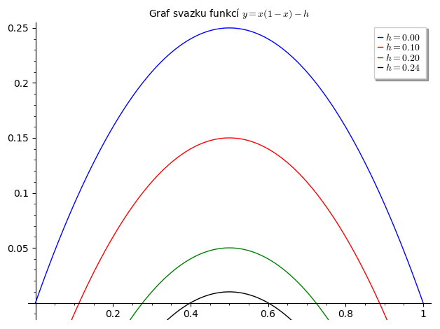
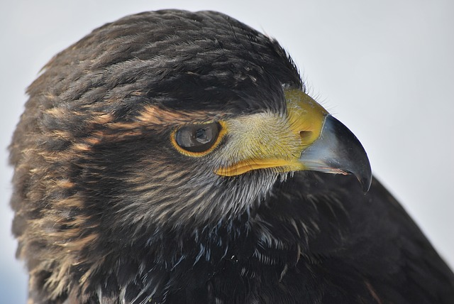
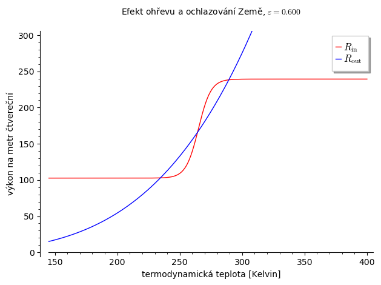
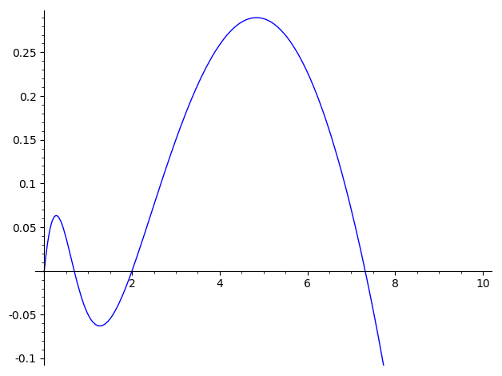
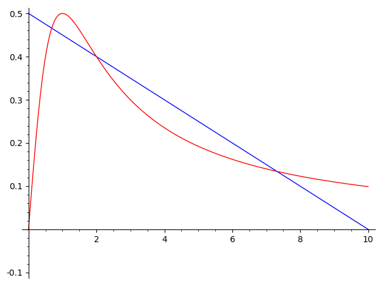
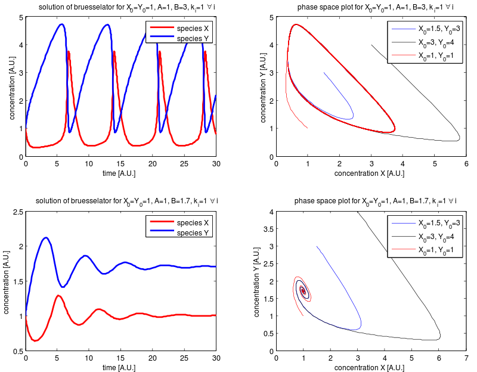
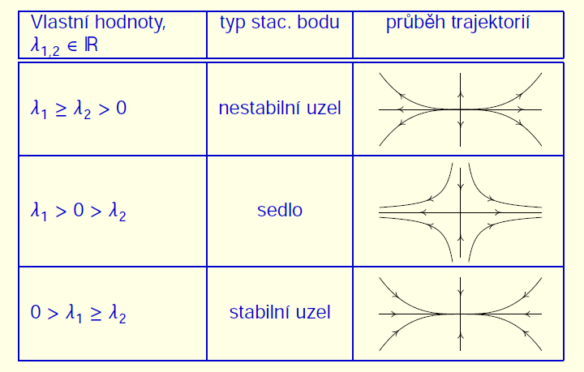
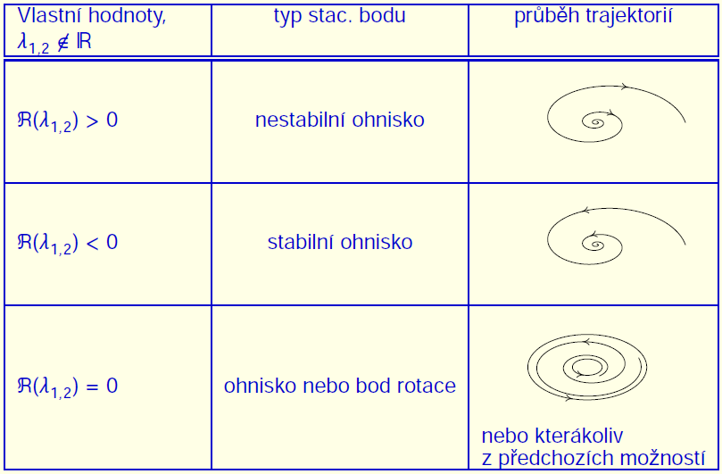

% Autonomní rovnice a systémy
% Robert Mařík
% 2020-2021

<!--
# Instrukce k online výuce prosinec 2021

* Budeme se věnovat autonomním diferenciálním rovnicím. To jsou rovnice, kde pravá strana explicitně nezáleží na čase. Typické je využití například pro modelování populací, kdy závisí jenom na podmínkách ve kterých se populace nachází (například velikost populace, nosná kapacita prostředí a podobně) a nezáleží na tom, jaký je čas, je-li středa nebo pátek. 
* V těchto případech je snadné u rovnic s jednou neznámou určit pomocí pravé strany rovnice znaménko derivace, odsud zda řešení roste nebo klesá a najít stabilní stacionární body (pod nimi řešení a nad nimi klesá, proto se přibližujeme ke stacionárnímu stavu) a nestabilní stacionární body (pod nimi řešení klesá, nad nimi roste, tedy se řešení vzdaluje od tohoto stavu). K provedení takové analýzy stačí vědět, kdy je pravá strana nulová, kdy kladná a kdy záporná. Na takovou informaci stačí obrázek. Můžeme mít například graf pravé strany. Někdy je pravá strana ve formě rozdílu a potom nás zajímá, která funkce je výš a která níž, protože potom poznáme, je-li rozdíl funkcí kladný nebo záporný. (Nula je pochopitelně tam, kde se funkce protnou.)
* Poslední část přednášky se vztahuje k diferenciálním rovnicím více neznámými proměnnými. Například dvě populace (konkurence nebo potravní řetězec), enzymy řídící biochemickou reakci, ... . Opět si všímáme nulových bodů pravých stran, ale místo jedné rovnice máme soustavu. Také monotonie nemá smysl, ale ukazuje se, že se dá nahradit jinou relativně dobře zjistitelnou informací: vlastními čísly Jacobiho matice vypočtené ve stacionárním bodě.

# Opakování

* Maticový součin
* Řešitelnost homogenní soustavy lineárních rovnic
* Vlastní hodnoty a vlastní vektory
* Řešitelnost kvadratických funkcí v komplexním oboru
* Eulerova identita
* Chování exponenciální funkce $e^{kt}$ v nekonečnu

-->

# Úmluva

V celé přednášce budeme jako nezávislou proměnnou uvažovat čas
$t$. Autonomní znamená v tomto kontextu nezávislý na čase. Budeme
studovat rovnice mající tuto vlastnost. Budeme dále studovat systémy,
které mají dostatečně pěkná data na to, aby byla zaručena
jednoznačnost řešení. To je například, pokud funkce na pravé straně
rovnice má ohraničené parciální derivace, což bude v níže uvedených
příkladech vždy splněno.

# Autonomní diferenciální rovnice

https://youtu.be/9PbghCvHQ5c

manim:Stabilita|Siu5ZgEA59s|Grafické znázornění stability stacionárních řešení.

Autonomní diferenciální rovnice je rovnice tvaru $$\frac{\mathrm dy}{\mathrm dt}=f(y).\tag{1}$$ Je speciálním případem rovnice se separovanými
proměnnými a umíme ji řešit
analytickou cestou. Proto se nyní nebudeme zaměřovat na hledání
obecného řešení, ale pokusíme se popsat chování řešení, aniž bychom
tato řešení znali. Pokusíme se s\ co nejmenší námahou říct, jak se
budou řešení chovat.

Všechna konstantní řešení rovnice (1) jsou nulové body pravé strany. Nazývají *se stacionární body*. Je užitečné umět posoudit chování řešení v okolí stacionárních bodů, což umožní následující věta.

> Věta (stabilita konstantních řešení). Jestliže platí $f(y_0)=0$, je
  konstantní funkce $y(x)=y_0$ konstantním řešením rovnice
  $$\frac{\mathrm dy}{\mathrm dt}=f(y).$$ Toto řešení je stabilní
  pokud $f'(y_0)<0$ a nestabilní pokud $f'(y_0)>0$.
  
> Poznámka (stabilita řešení). Stabilita je u diferenciálních rovnic chápána různým způsobem. V tomto textu *stabilitou* stacionárního bodu budeme rozumět, že malá výchylka od stacionárního bodu vede na řešení, které konverguje zpět k tomuto stacionárnímu bodu. Přesněji se tento typ stability jmenuje *asymptotická stabilita*. 

Pro grafickou interpretaci věty je vhodné připomenout, že funkce s kladnou
derivací jsou rostoucí a funkce se zápornou derivací klesající. Pokud
má tedy pravá strana derivaci různou od nuly, poznáme stabilitu z\ monotonie pravé strany.

Věta je odvozena z pozorování, že rovnice $y'=ky$ má řešení $y(t)=Ce^{kt}$ a toto řešení se pro velká $t$ blíží k nule nebo roste neohraničeně, v závislosti na znaménku hodnoty $k$. Pravou stranu rovnice, funkci $f(y)$, je možné aproximovat vztahem $f(y)\approx f'(y_0)(y-y_0)$ a odsud a z poznatku, že malá změna rovnice vetšinou nemění dramaticky chování řešení (přesněji, existuje spojitá závislost na parametrech) a proto rovnice $y'=f(y)$ kopíruje v okolí bodu $y_0$ chování rovnice $(y-y_0)'=f'(y_0)(y-y_0)$, pokud vynecháme patologické případy, což je zde $f'(y_0)=0$. Řešení je tedy $y\approx y_0+Ce^{f'(y_0)t}$ a tato funkce buď konverguje k $y_0$ nebo roste neohraničeně, v závislosti na znaménku derivace $f'(y_0)$.

## Logistická diferenciální rovnice s konstantním lovem

manim:Logistic|NyLkjOTYzVQ|Logistická rovnice s lovem.

Logistická diferenciální rovnice s konstantním lovem $h$, tj. rovnice
$$\frac{\mathrm dy}{\mathrm dt}=ry\left(1-\frac yK\right)-h,$$ má pro
malé $h$ dva stacionární body. Funkce $ry\left(1-\frac yK\right)$ je
parabola otočená vrcholem nahoru a s nulovými body $y=0$ a $y=K$. V
prvním stacionárním bodě je funkce rostoucí a tento stacionární bod je
nestabilní. Ve druhém stacionárním bodě je funkce klesající a tento
stacionární bod je stabilní. Jak se zvyšuje faktor $h$, graf paraboly
se posouvá směrem dolů a oba stacionární body se posouvají směrem k
sobě a k\ vrcholu. Jejich stabilita zůstává neporušena. To znamená, že
sice pořád existuje stabilní stav, ale se zvyšující se intenzitou lovu
se tento stacionární stav dostává stále blíže ke stavu nestacionárnímu
a rovnováha je tedy poněkud křehká.

[Numerický model](http://user.mendelu.cz/marik/aromamath/Lov_populace.html)

Pokud se intenzita lovu zvětšuje tak, že se parabola dostane vrcholem na vodorovnou osu a poté pod tuto osu, oba stacionární body splynou v jeden a zaniknou. V okamžiku, kdy se vrchol dostává pod vodorovnou osu i malinká změna v lovu způsobí dramatickou změnu v modelu. Ztratí se totiž existence stabilního řešení a všechna řešení budou konvergovat k nule. 

> Poznámka (strukturální stabilita modelu, bifurkace). Stabilita je u diferenciálních rovnic chápána různým způsobem. V tomto textu budeme *strukturální stabilitou* modelu závislého na parametrech rozumět stav, kdy malá změna parametrů nemění kvalitativní vlastnosti rovnice nebo systému, tj. například zůstává stejný počet stacionárních bodů, zachovává se jejich stabilita. To je přirozené chování, kdy malá změna parametrů modelu způsobí malé změny v řešení. Pro některé hodnoty parametrů však strukturální stabilitu ztrácíme. V takovém případě se i při nepatrných změnách parametrů dramaticky mění chování rovnice nebo systému. Například při zvyšování lovu v právě uvažovaném modelu dva stacionární body splynou v jeden a zaniknou. Takové chování se nazývá *bifurkace* a hodnoty parametrů, při kterých k bifurkaci dojde, jsou důležité pro další vývoj předmětu. Zjednodušeně řečeno, malé změny parametrů v oblasti daleko od bifurkace znamenají, že chování modelu se mění pozvolna. Blízko k bifurkační hodnotě je situace komplikovanější a může se stát, že malá změna parametrů modelu způsobí dramaticky odlišné chování modelu. Rovnice blízká bifurkaci je citlivá na rozkolísání.

## Model ostrovní biogeografie

[viz zde](https://robert-marik.github.io/dmp/prednaska/03.html#model-ostrovni-biogeografie)

## Model metapopulací

[viz zde](https://robert-marik.github.io/dmp/cviceni/cviceni_08.html)

## Model soupeření jestřábí a holubičí povahy

manim:Hawk_and_dove_game|zAzZrIShj9U|Model soupeření dvou povah. Ukazuje, že vždy bude v přírodě určité procento agrasivního vzorce chování. Někdy dokonce tento vzorech chování bude jediný. 

\iffalse 

\fi

Cílem tohoto modelu je studovat typy chování živočichů a rostlin a
zjistit, zda některý typ chování přináší jeho nositelům evoluční
výhodu.

Nechť se v populaci vyskytují dva vzorce chování -- jedince
používající první z nich budeme nazývat *jestřábi* a druhý
*holubice*. Chování se projeví, pokud se dva jedinci setkají
u téhož zdroje (potrava, hnízdiště, apod). 

* Jestřáb o zdroj bojuje a ustoupí pouze po prohraném boji.
* Holubice
  o zdroje nebojuje a zkonzumuje zdroj pouze pokud protivník ustoupí
  bez boje.
* Předpokládejme, že každý jedinec v populaci si zkonzumováním
  zdroje si může svou evoluční zdatnost posílit o hodnotu $V$, pokud
  je nucen a ochoten o zdroj bojovat, je jeho evoluční zdatnost naopak
  snížena o hodnotu $D$. 
* Setkají-li se u zdroje dvě holubice, jedna z nich ustoupí bez boje
  a druhá zkonzumuje zdroj. Předpokládejme, že po častých setkáních
  tohoto typu každá holubice zkonzumuje průměrně polovinu zdrojů.
* Setká-li se u zdroje holubice s jestřábem, zkonzumuje celý zdroj
  jestřáb.
* Setkají-li se u zdroje dva jestřábi, ani jeden z nich neustoupí
  a bojují o zdroj. Předpokládejme, že všichni jestřábi jsou stejně
  silní a po boji je pravděpodobnost zkonzumování zdroje poloviční pro
  každého jestřába.

Matematický rozbor (J. Kalas, Z. Pospíšil, Spojité modely v biologii) ukazuje, že četnost $x$ výskytu jestřábů v populaci
se řídí diferenciální rovnicí
$$x'=x(1-x)\left(\frac V2-\frac D2 x\right).$$
Jediné realistické hodnoty $x$ jsou z intervalu $[0,1]$. Pro nalezení stacionárních bodů a posouzení jejich stability budeme studovat funkci
$$f=x(1-x)\left(\frac V2-\frac D2 x\right).$$ Stacionární body rovnice jsou nulové body funkce $f$ a to jsou $x=0$, $x=1$ a $x=\frac VD$. Poslední stacionární bod v závislosti na hodnotě parametrů [může a nemusí](https://sagecell.sagemath.org/?z=eJxL06jQCdNx0bSt0NIw1K3Q1NII0zfSddE30qrQ5OUqyMkv0YhOA6ox1DHQM9LUATEN9Ex0DDVjdUBMIEMnJzU9NS8lPicxKTXHNrpIXSXMzkVFXQfEsAEyYjUBCOEZ8g==&lang=sage&interacts=eJyLjgUAARUAuQ==) ležet v intervalu $[0,1]$

* V bodě $x=0$ je funkce $f$ nulová a rostoucí. Stacionární bod $x=0$ je vždy nestabilní. **Ať jsou tedy podmínky jakékoliv, vždy budou v populaci
    přítomni jestřábi.** Přitom právě jestřábi paradoxně plýtvají
  zdroji energie na boj, namísto, aby celou energii zaměřili na
  rozmnožování. Z hlediska efektivity při využívání zdrojů prostředí
  platí, že populace složená ze samých holubic využívá zdroje
  prostředí nejefektivnějším možným způsobem.  Přesto je taková
  populace evolučně nestabilní! Pronikne-li do populace samých holubic jeden jestřáb, má značnou evoluční výhodu, protože každý zdroj, u kterého se nachází,
  zkonzumuje. Tím poroste jeho evoluční zdatnost a jeho geny nebo vzorce chování (u druhů které mohou přepínat strategie chování) se budou
  v populaci rychle šířit.  
* Pokud jsou náklady na boj větší než užitek ze zdrojů, platí $V<D$.
  V intervalu $[0,1]$ leží stacionární bod $x=\frac VD$ a tento bod je
  stabilní. Poslední stacionární bod $x=1$ je nestabilní. V tomto
  případě všechna řešení konvergují ke stacionárnímu bodu $x=\frac
  VD$. V populaci tedy budou přítomni i jestřábi i holubice.
* Pokud platí $V>D$, všechna řešení konvergují ke stacionárnímu
  bodu $x=1$. Ať je počáteční rozložení vzorců chování v populaci
  jakékoliv, evolučně stabilní je pouze populace složená ze samých
  jestřábů.  Jsou-li náklady na boj o zdroje nižší než užitek ze
  zdrojů, nevyplatí se ustupovat při soupeření o zdroje. *Příkladem
  populace složené ze samých jestřábů je les. Náklady na boj spočívají
  ve vytvoření vyššího kmene, užitkem je světlo.*

# Autonomní rovnice s pravou stranou ve tvaru rozdílu

https://youtu.be/ccWuBp4kies

> Poznámka (autonomní rovnice s rozdílem na pravé straně). Rovnice $$\frac{\mathrm dy}{\mathrm dt}=g(y)-h(y)$$ má stacionární bod $y_0$, jestliže $$g(y_0)=h(y_0).$$ Často jsou funkce $g$ a $h$ zadány graficky a stacionární bod je v průsečíku grafů funkcí $g$ a $h$. Ze vzájemné polohy těchto grafů také vidíme, zda je stacionární bod stabilní (funkce $g$ je napravo od bodu $y_0$ pod funkcí $h$ a nalevo nad ní) nebo nestabilní (naopak).

## Teplotní bilance Země

 

**Příklad.** Teplotní bilanci Země je možno vyjádřit rovnicí
$$\frac{\mathrm dT}{\mathrm dt}=R_{\text{in}}(T)-R_{\text{out}}(T),$$ kde $R_{\text{in}}$ a $R_{\text{out}}$ jsou funkce dané na obrázku. Vidíme tři průsečíky, tj. tři stacionární body. Uvažujme stacionární bod nejvíce napravo. Malá výchylka nahoru k větší teplotě nás posune do oblasti, kde převažuje vyzařování energie, $R_{\text{out}}$ je vetší než $R_{\text{in}}$, pravá strana je záporná a teplota klesá zpět do stacionárního stavu. Podobně, malá výchylka směrem dolů způsobí nárůst a opět návrat do stacionárního stavu. Stacionární stav zcela vpravo je tedy stabilní. Podobně ukážeme, že stacionární stav odpovídající průsečíku zcela vlevo je také stabilní. Naopak, stacionární stav uprostřed je nestabilní, libovolná výchylka z tohoto stavu způsobí přechod systému do některého ze stabilních stavů. 

[Online model.](http://user.mendelu.cz/marik/aromamath/Teplotni_bilance_Zeme.html)

## Logistická diferenciální rovnice s predátory

manim:Obalec|iFmQWcR_JX4|Model populace pro preddačním tlakem využijeme například při studiu škůdce. Model vykazuje bifurkaci (malá změna vstupních dat může zcela změnit chování modelu) a hysterezi (stav souvisí i s historií modelu).

\iffalse

, plný text je pro uživatele MENDELU zdarma. zdroj: Wikimedia.org](obalec.jpg)

\fi

Následující model je model obaleče *Choristoneura fumiferana*, který periodicky atakuje lesy severní Ameriky. Jeho populace je relativně malá, ale některé roky (historicky cca po
40 letech) se velikost populace zvýší tisícinásobně a dokáže zahubit
$80\%$ stromů v lese a prakticky zničit les. Populaci je možno modelovat logistickou rovnicí $$y'=ry\left(1-\frac yK\right)-H\frac{y^2}{y^2+A^2},$$
kde druhý člen na pravé straně charakterizuje vliv predátorů. Jedná se o funkci, která zpomaluje růst, podobně jako lov. Protože však predátoři mají určitou hodnotu, nad kterou jsou saturovaní a nestačí brzdit růst populace, je tato funkce ohraničená. Platí $$H\frac{y^2}{y^2+A^2}  \leq H.$$ To má dalekosáhlé důsledky.
Pro určité hodnoty parametrů může mít pravá strana rovnice dva nebo čtyři nulové body. Nakreslíme si [druhou variantu](https://sagecell.sagemath.org/?z=eJwrSyzSUK9U1-TlKrI10DPl5fK2NTTg5fKwNeTlcgQRaRqVmrZFWpVaGoa6lfremroeWpVxRvoaQELbMc4IqLEgJ79EA6RMR6NSx0DH0EBTR6EyNzPPVtdAz1ATAENFFxg=&lang=sage&interacts=eJyLjgUAARUAuQ==). 

Vidíme dva průsečíky, kde je funkce rostoucí, to odpovídá nestabilním
stavům. Vidíme i dva stabilní stavy, přibližně pro hodnoty $0.6$ a
$7.3$. Malé populace, které se rozvíjejí od nuly, dospějí do nižšího
stabilního stavu. Pokud se nějakým způsobem změní velikost populace o
malé množství, systém se po čase díky stabilitě vrátí do původního
stavu. Pokud však skok je velký a systém populace se dostane nad
hodnotu nestabilního stavu, růst pokračuje a systém spěje ke
stabilitě, ale s vyšším výskytem škůdce odpovídající stacionárnímu
bodu $7.3$.

Poněkud jednodušší je kvalitativní analýza, pokud zvolíme jednotku veličiny $y$ tak, aby koeficient $A$ byl roven jedné, zvolíme jednotku času tak, aby koeficient $H$ byl roven jedné a vytkneme proměnnou $y$. Model má potom tvar
$$y'=y\left [ r\left(1-\frac yK\right)-\frac{y}{y^2+1}\right].$$ Na pravé straně v hranaté závorce zůstává rozdíl funkce $\frac{y}{y^2+1}$ neobsahující žádný parametr a lineární funkce, se kterou snadno dokážeme manipulovat. 

[Numerický model](http://user.mendelu.cz/marik/aromamath/Populace_pod_tlakem_predatoru.html)

Brauer a Kirbs vysvětlují situaci tak, že s růstem lesa se mění
parametry modelu, stacionární body se posunují a populace obaleče se
tomu přizpůsobuje. Více stromů znamená vyšší nosnou kapacitu prostředí
pro obaleče a predátoři svou činností populaci obaleče udržují na
rozumné míře. Pokud však nosná kapacita prostředí dosáhne takové
hodnoty, že predátoři jsou nasycení a nestačí populaci redukovat,
odpovídá to posunu nestabilního stacionárního bodu pod hodnotu
velikosti populace a dojde k přemnožení. Toto přemnožení má
devastující účinky pro les.

# Autonomní systém $X'=f(X)$

https://youtu.be/udATObf0s8I

Soustava diferenciálních rovnic, kde pravé strany nezávisí na čase, se nazývá autonomní systém. Seznámili jsme se již s lineárními autonomními systémy, obecný autonomní systém však lineární být nemusí. Například při modelování chemických reakcí je rychlost úměrná mocnině koncentrace reagujících látek odpovídající počtu molekul, které do reakce vstupují. Níže uvidíme příklad takového modelu.

Ukážeme si, jak studovat nelineární systém pomocí lineárního a pomocí vlastních čísel. Půjde o lineární aproximaci. V tomto případě o lineární aproximaci vektorové funkce definující pravé strany rovnic.

Je-li $f(X_0)=0$, je možno systém $$X'=f(X)$$ v okolí bodu $X_0$ aproximovat lineárním systémem $$X'=J(X_0)(X-X_0),$$
kde $J(X_0)$ je Jacobiho matice funkce $f(X)$ v bodě $X_0$, tj. pro $f(X)=(f_1(X),\dots,f_n(X))^T$ je
$$J(X_0)=\left(\frac{\partial f_i(X_0)}{\partial x_j}\right).$$
O chování trajektorií v okolí stacionárního bodu tedy rozhodnou
vlastní čísla Jacobiho matice. Za předpokladu, že jsme relativně
daleko od případů, kdy se mění typ stacionárního bodu, tj. vlastní
čísla jsou navzájem různá, jsou nenulová a v případě komplexních
vlastních čísel mají nenulové reálné části, má původní nelineární
systém stejný typ stacionárního bodu jako lineární systém s Jacobiho
maticí. Nelineární systém tedy v jistém smyslu "zdědí" chování řešení
od své lineární aproximace pomocí Jacobiho matice. Je však nutno
připomenout, že aproximace pomocí Jacobiho matice je jenom lokální a
můžeme takto posoudit jenom řešení z nějakého okolí stacionárního
bodu.

Zejména tedy, pokud má Jacobiho matice všechny vlastní hodnoty
záporné, tak všechna řešení z nějakého okolí stacionárního bodu
konvergují do tohoto bodu. Pokud má všechny vlastní hodnoty kladné,
všechna řešení z nějakého okolí se naopak od stacionárního bodu
vzdalují. To platí i pro vlastní komplexní vlastní hodnoty, pouze se
mezi konvergencí a vzdalování přepíná podle znaménka reálné části
vlastních hodnot a řešení oscilují směrem ke stacionárnímu bodu nebo
od něj.

> Poznámka (stabilita a strukturální stabilita řešení). *Stabilitou*
  stacionárního bodu budeme rozumět, stejně jako výše, že malá
  výchylka od stacionárního bodu vede na řešení, které konverguje zpět
  k tomuto stacionárnímu bodu. Stabilita vyjadřující, že při malé
  změně koeficientů v systému se nezmění typ singulárních bodů se
  nazývá *strukturální stabilita*.

## Bruselátor

\iffalse 

\fi

Systém chemických reakcí
$$\begin{aligned}A &\rightarrow X\\2X + Y &\rightarrow 3X\\B + X &\rightarrow Y + D\\X &\rightarrow E\end{aligned}$$
má pozoruhodnou minulost. První chemickou reakci probíhající podle tohoto schematu objevil ruský chemik B. Bělousov, jeho výsledky přezkoumal a potvrdil A. Žabotinský. Oba zaznamenali překvapivé chování, kdy se periodicky mění koncentrace. Protože to bylo v roce 1951 mimo chápání chemiků, měli potíže s publikováním tohoto převratného jevu. Všeobecně totiž panoval názor, že chemická reakce rychle spěje ke stavu termodynamické rovnováhy a oscilující reakce byla něco jako chemické perpetum mobile. Později vědci (I. Prigogine) sestavili teoretický model periodicky probíhající reakce a po čase několik takových reakcí i našli. Dnes toto chápeme jako jakési chemické hodiny. Název bruselátor je spojení slova Brusel (pracoviště I. Prigogina) a oscilátor.

Pokud je dostatek složek $A$ a $B$, modeluje po zjednodušení (viz Wikipedie, konstanty úměrnosti klademe rovny jedné) chemické reakce soustava
$$
\begin{aligned}
\frac {\mathrm d X}{\mathrm dt}&= A  +  X ^2 Y  - B X - X,\\
\frac {\mathrm d Y}{\mathrm dt}&= BX-X^2Y,
\end{aligned}
$$
kde $X$ pro jednoduchost znamená koncentraci látky $X$ a totéž platí i pro další veličiny vystupující v rovnici.

Stacionárním bodem je bod $X=A$, $Y=\frac BA$. Pro $A=1$ a $B=4$ má systém tvar
$$
\begin{aligned}
\frac {\mathrm d X}{\mathrm dt}&=  1+  X ^2 Y  - 5 X,\\
\frac {\mathrm d Y}{\mathrm dt}&= 4X-X^2Y.
\end{aligned}
$$

Jacobiho matice je $$J(X,Y)=\begin{pmatrix}2XY-5 & X^2 \\ 4-2XY & -X^2\end{pmatrix}$$
a $$J(1,4)=\begin{pmatrix}3& 1\\-4 & -1\end{pmatrix}.$$
Vlastní čísla jsou řešením rovnice
$$0=\begin{vmatrix}3-\lambda & 1\\-4 & -1-\lambda\end{vmatrix}
=\lambda^2- 2\lambda+4=(\lambda-1)^2+3.$$
Taková rovnice nemá řešení v množině reálných čísel a vlastní čísla jsou komplexně sdružená $$\lambda_{1,2}=1\pm \sqrt {3}i.$$ Protože reálná část $\Re(\lambda_i)=1>0$, řešení se v oscilacích vzdalují od rovnovážného bodu. Protože systém je druhého řádu a tímto postupem je možno získat dvě nezávislá řešení, lineárními kombinacemi vygenerujeme všechna řešení. Proto se v oscilacích budou od stacionárního bodu vzdalovat všechna řešení. Další stacionární bod neexistuje a koncentrace určitě zůstanou ohraničené z fyzikálních důvodů. Proto neexistuje stabilní stav, a systém je nestabilní. Je možné ukázat, že systém není chaotický, ale oscilacemi se přibližuje k periodickému řešení. Taková analýza je však již nad rámec základního seznámení se s aparátem autonomních systémů. 

# Autonomní systém ve dvou dimenzích

Ve dvou dimenzích je autonomní systém možno psát ve tvaru 
$$ \begin{aligned}
   x'=f(x,y),\\
   y'=g(x,y).
 \end{aligned}$$
 Pro autonomní systémy v rovině používáme dva základní způsoby vizualizace. Oba si můžete prohlédnout výše v příkladu s bruselátorem.
 
 1. Řešení zobrazíme jako *grafy funkcí $x(t)$ a $y(t)$*. Tímto přístupem dokážeme posoudit dynamiku v čase, odhadnout rychlost s jakou se mění obě komponenty řešení. Často kreslíme do jednoho obrázku a často máme v tomto obrázku dvojí souřadnicový systém: jeden pro hodnoty $x$ a jeden pro hodnoty $y$. 
 1. Řešení zobrazíme jako parametrickou křivku $\vec r(t)=[x(t), y(t)]$. Tato křivka se nazývá *trajektorie*. V tomto případě sice nemáme informaci o dynamice v čase, ale můžeme lehce posoudit, jak se chovají řešení vycházející z různých počátečních podmínek. Proto tento způsob zpravidla preferujeme. Tento způsob znázornění se nazývá *fázový portrét*.
 
Křivky tvořené trajektoriemi mají speciální vlastnosti. Například se
díky jednoznačné řešitelnosti nemohou dvě různé trajektorie
protnout. Díky tomu existuje jenom několik málo druhů trajektorií.

* Stacionární body. Tyto body odpovídají konstantním řešením.
*  Uzavřené trajektorie, cykly.
    Tyto trajektorie odpovídají periodickým řešením. Uvnitř
    každého cyklu leží alespoň jeden stacionární bod. 
* Trajektorie, které samy sebe nikde neprotínají a pro
    $t\to\pm\infty$ tyto trajektorie mají jednu z následujících
    vlastností.
    * Trajektorie mají alespoň jednu složku neohraničenou.
    * Trajektorie konvergují k některému ze stacionárních  bodů.
    * Trajektorie konvergují k některému z cyklů.
    * Trajektorie konvergují k množině tvořené konečným počtem
    singulárních bodů a jinými trajektoriemi, které vedou
    z jednoho stacionárního bodu do druhého. S tímto typem
    trajektorií se však v jednoduchých modelech nesetkáme.

Podle chování trajektorií v okolí stacionárních bodů rozdělujeme tyto
stacionární body do několika navzájem disjunktních skupin. Dokážeme je
identifikovat pomocí vlastních hodnot Jacobiho matice vypočtené v
tomto stacionárním bodě.

* Stabilní uzel je stacionární bod takový, že pro $t\to\infty$ všechny
  trajektorie z nějakého okolí konvergují do tohoto bodu bez oscilací.
  Nestabilní uzel má stejnou vlastnost, ale pro $t\to-\infty$, tedy trajektorie
  z tohoto bodu vycházejí. Stabilní uzel poznáme podle dvou záporných a
  nestabilní uzel podle dvou kladných reálných vlastních hodnot. 
* Stabilní a nestabilní ohnisko je stacionární bod se stejnou vlastností jako
  uzel, ale konvergence je spojena s oscilacemi okolo stacionárního bodu.
  Stabilní ohnisko poznáme podle dvou komplexně sdružených vlastních hodnot se
  zápornou reálnou částí, nestabilní ohnisko s kladnou reálnou částí. 
* Sedlo je stacionární bod, který má v každém  okolí pouze konečný počet
  trajektorií, které pro $t\to\pm\infty$ konvergují k tomuto bodu. Poznáme jej
  podle jedné kladné a jedné záporné vlastní hodnoty.
* Bod rotace je takový bod, v jehož každém okolí jsou cykly. Pokud navíc v
  nějakém okolí existují pouze cykly, nazývá se tento bod navíc střed.  Bod
  rotace souvisí s komplexně sdruženými vlastními čísly s nulovou reálnou částí,
  ale v těchto případech může stacionární bod být i ohniskem.

ww:problems/autonomni_systemy/10.pg

ww:problems/autonomni_systemy/11.pg

ww:problems/autonomni_systemy/12.pg

ww:problems/autonomni_systemy/14.pg

# Základní modely populační ekologie

Populační ekologie je součást ekologie zabývající se modelováním vývoje populací. Základním vyjadřovacím jazykem jsou diferenciální rovnice nebo jejich diskrétní obdoba, kdy se čas mění po skocích, diferenční rovnice. Málokdy uvažujeme jedinou populaci, většinou studujeme bohatší ekosystémy, což vede na soustavy rovnic. Dva nejklasičtější si zde stručně uvedeme a prostudujeme ve cvičení.

## Model konkurence dvou druhů

manimp:Konkurence_druhu|Při konkurenci dvou druhů může dojít (podle nastavení parametrů) ke koexistenci nebo ke konkurenčnímu vyloučení. Model ukazuje, jak se konkurence projevuje v nejjednodušším případě, při sledování konkurence dvou populací.

Situace kdy dva druhy žijí ve společné lokalitě a přítomnost jednoho druhu ovlivňuje druhý druh je modelována autonomním systémem
$$
\begin{aligned}
\frac{\mathrm dx}{\mathrm dt}&=x r_1 (1-a x-by),\\
\frac{\mathrm dy}{\mathrm dt}&=y r_2 (1-c x-dy).
\end{aligned}
$$
Tento systém vychází z logistické rovnice pro každou z populací s doplněním členů $r_1 bxy$ a $r_2 cxy$, které charakterizují mezidruhovou konkurenci. Ukazuje se, že tento systém má kapacitu popsat všechny v přírodě pozorované druhy interakcí (slabá konkurence, silná konkurence, dominance jednoho z druhů) a je výchozím systémem pro veškeré modely používané v populační ekologii.

## Model dravce a kořisti

manim:Predator_prey|zihShrEOJAU|Model dravce a kořisti vysvětluje kolísání populací okolo rovnovážné polohy. Jde o stabilitu, která však nespočívá s konstantních hodnotách stavů, ale v periodickém průběhu. 

Skutečnost kdy žijí ve společné lokalitě a přítomnost jednoho druhu umožňuje přežití druhého je modelována autonomním systémem
$$
\begin{aligned}
\frac{\mathrm dx}{\mathrm dt}&=x r (1-a x) -V(x)y,\\
\frac{\mathrm dy}{\mathrm dt}&=y (-\alpha+kV(x)).
\end{aligned}
$$
V tomto případě je $V(x)$ trofická funkce. Pro $V(x)=k_0x$ a $a=0$, (tj. pro nenažrané dravce kteří nejsou nikdy saturováni a bez vnitrodruhové konkurence v populaci kořisti) dostáváme klasický Lotkův-Voterrův model, který v jistém smyslu odstartoval využití matematiky v modelování biologických systémů. Povedlo se mu vysvětlit oscilace mezi populacemi kořisti a dravce. Přes tento úspěch se však pro praktické modelování využívají dokonalejší modely. Zejména je nutno uvažovat ohraničenou trofickou funkci.

# Vícerozměrné autonomní systémy, kompartmentové modely

Kompartmentové modely jsou modely, kde se je studovaná veličina rozdělena do několika stavů a mezi těmito stavy se v jakémsi smyslu přelévá definovanou rychlostí. Klasickým případem v roce 2020 je model epidemie, například [SIR model](http://user.mendelu.cz/marik/wiki/doku.php?id=sir_epidemie) nebo [SEIR model](http://user.mendelu.cz/marik/wiki/doku.php?id=karantena).

