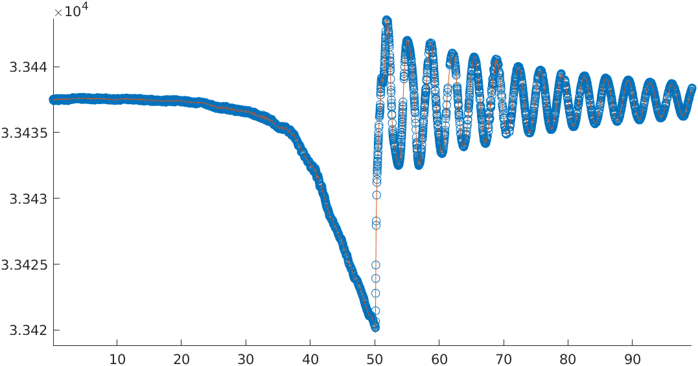

% Lineární diferenciální rovnice druhého řádu
% Robert Mařík
% 2020

> Anotace.
>
> * Lineární diferenciální rovnice druhého řádu se vyskytují v úlohách z mechaniky a při řešení difuzní rovnice. 
> * Soustřeďte se na vysvětlení, jak souvisí DR druhého řádu se zrychlením tělesa a působící silou v úlohách z mechaniky, jak se může jednorozměrná difuzní stacionární rovnice redukovat na LDR druhého řádu a jak se metodou separace proměnných dá nestacionární difuzní rovnice rozdělit na obyčejnou diferenciální rovnici prvního a druhého řádu. 
> * Soustřeďte se na pasáže týkající se toho, jak okrajová podmínka dokáže vybrat hodnoty parametrů pro které existuje nenulové řešení. To determinuje například frekvenci při mechanickém kmitání.
> * [Numerické experimenty](https://user.mendelu.cz/marik/aromamath/DR_druheho_radu.html) s rovnicí.
> * Konkrétní nalezení řešení rovnice pomocí řešení kvadratické rovnice, pomocí metody neurčitých koeficientů pro nalezení partikulárního řešení atd. je pro nás málo zajímavé a věnujte se mu případně až v poslední fázi. 

# Lineární diferenciální rovnice druhého řádu

https://youtu.be/PcNc0tfv7Q0

> Definice (Lineární diferenciální rovnice druhého řádu). Buďte $p$, $q$ a $f$
> funkce definované a spojité na intervalu $I$. Diferenciální rovnice
> $$
>     y''+p(x)y'+q(x)y=f(x) \tag{LDE}\label{LDE}$$
> se nazývá *lineární diferenciální rovnice druhého řádu*. *Řešením
> rovnice* (nebo též *integrálem rovnice*) na intervalu $I$ rozumíme
> funkci, která má spojité derivace do řádu $2$ na
> intervalu $I$ a po dosazení identicky splňuje rovnost (LDE) na $I$.
> Úloha nalézt řešení rovnice, které splňuje v\ bodě $x_0\in I$ *počáteční
> podmínky*
> $$\tag{IC}
>     \begin{cases}
>       y(x_0)=y_0,\\y'(x_0)=y'_0,
>     \end{cases}$$
> kde $y_0$ a $y'_0$ jsou reálná čísla, se nazývá *počáteční úloha*
> (*Cauchyova úloha*). Řešení počáteční úlohy se nazývá *partikulární
> řešení rovnice.*

**Zkratky:** LDE - lineární diferenciální rovnice, IC - počáteční podmínka, IVP - počáteční úloha 

# Příklad - těleso na pružině

\iffalse 

\fi

Kmity tělesa o\ hmotnosti $m$ pružně připevněného k\ nehybné podložce
spojem tuhosti $k$ jsou popsány diferenciální rovnicí ${\ddot x+\frac
km x=0}.$ Zde navíc používáme fyzikální úzus označovat derivace podle
času pomocí tečky a ne čárky. Symbol $\ddot x$ tedy značí druhou
derivaci funkce $x$, kde $x$ bereme jako funkci času.

Jednoduchým mechanickým modelem je těleso na pružině. Zde je deformace
úměrná působící síle. Analogické situace vedoucí na stejnou rovnici
však dostáváme i obecněji. Pokud pro jednoduchost předpokládáme, že
těleso s jedním stupněm volnosti se nachází ve stabilním stavu s
minimem potenciální energie a energie závisí na poloze $x$, můžeme v
okolí minima $x_0$ potenciální energii aproximovat Taylorovým rozvojem
druhého řádu $$E(x)\approx E(x_0)+E'(x_0)(x-x_0)+\frac 12E''(x_0)(x-x_0)^2.$$
Vzhledem k tomu, že v $x_0$ je minimum, platí $E'(x_0)=0$. Je výhodné volit počátek v rovnovážné poloze, protože poté platí $x_0=0$. Síla je
poté dána vztahem $$F(x)=-\frac{\partial}{\partial x}E(x)=-E''(0)x.$$
Síla $F$ je tedy úměrná výchylce $x$ a vrací těleso do rovnovážné
polohy. 

Situace tedy perfektně koresponduje s kmitáním na pružině i když potenciální energie uvažovaná v tomto odstavci může být jiného charakteru. Něco podobného jsme viděli již u autonomních systémů, kdy systém modelující tlumený oscilátor z přednášky byl stejný jako systém modelující regulaci topení ze cvičení a tento systém byl jenom lépe představitelnou realizací systému regulace syntézy proteinů.

# Řešitelnost LDE druhého řádu

https://youtu.be/sw5EvXHFtA0

$$y''+p(x)y'+q(x)y=f(x) \tag{LDE}$$

> Věta (o existenci a jednoznačnosti řešení LDE druhého řádu). Každá
> počáteční úloha pro LDE druhého řádu má řešení, které je určeno
> jednoznačně a toto řešení je definované na celém intervalu $I$.

> Definice (speciální typy LDE druhého řádu). Platí-li v\ rovnici (LDE) $f(x)=0$
> pro všechna $x\in I$, nazývá se rovnice (LDE) *homogenní*, v\ opačném
> případě *nehomogenní*. 
> 
> Jsou-li koeficienty $p(x)$ a $q(x)$ na intervalu
> $I$ konstantní funkce, nazývá se (LDE) *rovnice s\ konstantními
> koeficienty*.

> Definice (triviální řešení). Funkce $y(x)\equiv 0$ je řešením
> homogenní LDE druhého řádu $$y''+p(x)y'+q(x)y=0$$ vždy, bez ohledu na tvar koeficientů $p$, $q$. Toto řešení nazýváme *triviální řešení*.

> Definice (asociovaná homogenní rovnice). Nahradíme-li v\ nehomogenní LDE
> pravou stranu (tj. funkci $f$) nulovou funkcí obdržíme rovnici
> $$ y''+p(x)y'+q(x)y=0.$$
> Tato rovnice se nazývá *asociovaná homogenní rovnice k\ rovnici (LDE)*.

> Definice (obecné řešení). Všechna řešení LDE druhého řádu 
> lze vyjádřit ve tvaru obsahujícím dvě nezávislé konstanty $C_1$,
> $C_2\in\mathbb{R}$. Takovýto předpis se nazývá *obecné řešení rovnice (LDE)*.

<!--
# Operátorová symbolika

$$y''+p(x)y'+q(x)y=f(x) \tag{LDE}$$

Podobně jako lineární diferenciální rovnice
prvního řádu, i\ u (LDE) často pravou stranu rovnice často zkracujeme do
tvaru $L[y](x)$. Definujeme-li tedy
$$  L[y](x)=y''(x)+p(x)y'(x)+q(x)y(x),$$
je tímto předpisem definován operátor, který každé dvakrát
diferencovatelné funkci přiřazuje levou stranu rovnice (LDE). Rovnici
(LDE) je potom možno zapsat ve tvaru $$L[y]=f(x).$$

> **Věta o linearitě.** Operátor $L[y]$ zachovává lineární kombinaci funkcí,
> tj. pro libovolné dvě funkce $y_1$ a $y_2$ a libovolné reálné
> konstanty $C_1$ a $C_2$ platí
> $$L[C_1y_1+C_2y_2]=C_1L[y_1]+C_2L[y_2].$$

-->

# Důsledky linearity

Nechť $L$ je lineární diferenciální operátor druhého řádu.
Jako speciální případ vztahu  $$L[C_1y_1+C_2y_2]=C_1L[y_1]+C_2L[y_2]$$ dostáváme následující. 

* Platí $$L[y_1]=L[y_2]=0\ \implies \ L[C_1y_1+C_2y_2]=0,$$ tj. každá
  lineární kombinace dvou řešení homogenní LDE je opět řešením této
  rovnice. Pokud se nám navíc podaří volbou konstant $C_1$ a $C_2$
  splnit libovolnou počáteční podmínku, je jistota, že máme obecné
  řešení.
* Platí $$L[y_2]=0 \text{ a } L[y_1]=f(x)\ \implies\
    L[y_1+y_2]=f(x),$$ tj. součet řešení nehomogenní a asociované
    homogenní LDE je řešením původní nehomogenní rovnice. Pokud je
    navíc $y_2$ obecným řešením homogenní rovnice, je $y_1+y_2$
    obecným řešením nehomogenní rovnice, protože se podaří splnit
    libovolnou počáteční podmínku.

# Důsledky linearity prakticky

Vztah
$$L[C_1y_1+C_2y_2]=C_1L[y_1]+C_2L[y_2]$$
poslouží (podobně jako u lineárních rovnic prvního řádu), abychom popsali strukturu množiny všech řešení rovnice a dokázali tuto množinu vytvořit jenom na základě znalosti několika prvků.

Rovnice $$y''+y=x\tag{A}$$ má partikulární řešení $y=x$. 

Asociovaná homogenní rovnice je $$y''+y=0.\tag{B}$$ Tato rovnice má řešení
například $y=\sin x$, $y=\cos x$. Z linearity plyne

* Funkce $y=C_1 \sin x+C_2 \cos x$ je řešením rovnice (B) pro
  libovolná reálná $C_1$, $C_2$. Protože platí $y(0)=C_2$ a
  $y'(0)=C_1$, je možné splnit libovolnou podmínku $y(0)=\alpha$,
  $y'(0)=\beta$ volbou $C_2=\alpha$ a $C_1=\beta$. Jedná se tedy o
  obecné řešení.

* Funkce $y=C_1 \sin x+C_2\cos x +x$ je obecným řešením rovnice (A). 

<!--

# Kdy pomocí linearity získáme obecné řešení?

Budeme studovat homogenní LDE druhého řádu, tj.
rovnici 
$$y''+p(x)y'+q(x)y=0,$$
kterou můžeme zkráceně zapsat jako $L[y]=0$, kde operátor $L$ je
lineární diferenciální operátor druhého řádu.

**Motivace.** Budeme předpokládat že funkce $y_1(x)$ a $y_2(x)$ jsou obě
řešeními a budeme hledat podmínky, za kterých je funkce

$$y(x)=C_1y_1(x)+C_2y_2(x)$$

obecným řešením. Derivováním tohoto vztahu získáváme

$$y'(x)=C_1y'_1(x)+C_2y'_2(x)$$

a dosazení počátečních podmínek $y(\alpha)=\beta$, $y'(\alpha)=\gamma$
vede k\ následující soustavě lineárních rovnic s\ neznámými $C_1$, $C_2$

$$
\begin{aligned}
  \beta&{}=C_1y_1(\alpha)+C_2y_2(\alpha),\\
  \gamma&{}=C_1y'_1(\alpha)+C_2y'_2(\alpha).
\end{aligned}$$

Jak je známo z\ lineární algebry, tato soustava má právě jedno řešení pro
libovolnou volbu čísel $\beta$, $\gamma$ právě tehdy, když matice
soustavy, tj. matice $\begin{pmatrix}
  y_1(\alpha)&y_2(\alpha)\\
  y_1'(\alpha)&y_2'(\alpha)
\end{pmatrix},$ je regulární. Tato matice je regulární právě tehdy, když její
determinant je nenulový a to nastane právě tehdy když jeden sloupec není
násobkem druhého. 

# Homogenní LDE 2. řádu (wronskián, lineárně nezávislá řešení)

$$y''+p(x)y'+q(x)y=f(x) \tag{LDE0}$$

> Definice (lineární (ne-)závislost funkcí). Buďte $y_1$ a $y_2$ funkce definované
> na intervalu $I$. Řekneme, že funkce $y_1$ a $y_2$ jsou na intervalu $I$
> *lineárně závislé*, jestliže jedna z\ nich je na intervalu $I$ násobkem
> druhé, tj. jestliže existuje reálné číslo $k\in\mathbb{R}$ s\ vlastností
> $$y_1(x)=ky_2(x) \qquad\text{pro všechna $x\in I$},$$
> nebo
> $$y_2(x)=ky_1(x) \qquad\text{pro všechna $x\in I$}.$$
> V\ opačném případě říkáme, že funkce $y_1$, $y_2$ jsou na intervalu $I$
> *lineárně nezávislé*.

> Definice (Wronskián). Buďte $y_1(x)$ a $y_2(x)$ dvě libovolná
> řešení homogenní rovnice (LDE0). *Wronskiánem* funkcí $y_1(x)$,
> $y_2(x)$ rozumíme determinant
> $$
>     W[y_1, y_2](x)=
>     \begin{vmatrix}
>       y_1(x)&y_2(x)\\y_1'(x)&y_2'(x)
>     \end{vmatrix}.
>  $$

> Věta (o lineární (ne)závislostí řešení). Buďte $y_1(x)$ a $y_2(x)$ dvě řešení rovnice
> (LDE0) na intervalu $I$. Tato řešení jsou lineárně nezávislá právě
> tehdy když je jejich Wronskián různý od nuly na intervalu $I$.

-->

# Homogenní LDE 2. řádu (obecné řešení)

$$y''+p(x)y'+q(x)y=0 \tag{LDE0}$$

> Věta (obecné řešení homogenní LDE). Jsou-li $y_1$ a $y_2$ dvě
> netriviální lineárně nezávislá řešení rovnice (LDE0) na intervalu
> $I$, pak funkce $y$ definovaná vztahem
> $$    y(x, C_1, C_2)=C_1y_1(x)+C_2y_2(x),$$
> kde $C_{1,2}\in\mathbb{R}$, je obecným řešením rovnice (LDE0) na intervalu
> $I$.

Dvojicí lineárně nezávislých řešení rozumíme dvě řešení taková, že jedno není násobkem druhého.

> Definice (fundamentální systém řešení). Dvojici funkcí $y_1$ a $y_2$ z\ předchozí
> věty nazýváme *fundamentální systém řešení rovnice (LDE0)*.

# Homogenní LDE 2. řádu s\ konstantními koeficienty

\iffalse 

<!--

Budeme studovat rovnici tvaru
$$y''+py'+qy=0,$$
kde $p,q\in \mathbb{R}$. Všimněme si nejprve následujícího faktu: Dosadíme-li do
levé strany rovnice $y=e^{zx}$, kde $z$ je reálné číslo, po výpočtu
derivací a po vytknutí faktoru $e^{zx}$ získáváme
$$y''+py'+qy=e^{zx}(z^2+pz+q).$$
Protože exponenciální faktor na pravé straně je vždy nenulový, bude
výraz na pravé straně roven nule pokud bude splněna podmínka
$$z^2+pz+q=0.$$
Pouze v\ tomto případě bude uvažovaná funkce řešením rovnice (1).

# Homogenní LDE 2. řádu s\ konstantními koeficienty

-->

\fi

Rovnici $$y''+py'+qy=0$$ je možno přepsat na
$$(y')^\prime=-qy-py'$$
a tato rovnice je po substituci
$x_1=y$, $x_2=y'$ ekvivalentní autonomnímu systému
$$\begin{pmatrix}x_1\\x_2\end{pmatrix}'=
\begin{pmatrix}0 &1\\ -q &-p\end{pmatrix}
\begin{pmatrix}x_1\\x_2\end{pmatrix}
$$

U řešitelnosti této rovnice hraje velkou roli charakteristická rovnice matice soustavy, která je obsažena v následující definici.

> Definice (charakteristická rovnice). Kvadratická rovnice
> $$z^2+pz+q=0$$ s\ neznámou $z$ se nazývá *charakteristická rovnice*
> pro rovnici $$y''+py'+qy=0.$$

> Věta (o obecném řešení LDE s\ konstantními koeficienty).
>  Uvažujme LDE $$y''+py'+qy=0,\tag{1}$$ a její charakteristickou rovnici
>  $$z^2+pz+q=0.$$
> 
> -   Jsou-li $z_1,z_2\in\mathbb{R}$ dva různé reálné kořeny charakteristické
>     rovnice, definujme $${y_1=e^{z_1 x}}, \qquad{y_2=e^{z_2 x}}.$$
> 
> -   Je-li $z_1\in\mathbb{R}$ dvojnásobným kořenem charakteristické
>     rovnice, definujme $${y_1=e^{z_1 x}}, \qquad{y_2=xe^{z_1 x}}.$$
> 
> -   Jsou-li $z_{1,2}=\alpha\pm i\beta\not\in\mathbb{R}$ dva komplexně sdružené
>     kořeny charakteristické rovnice, definujme $${y_1(x)=e^{\alpha x}\cos(\beta x)}, \qquad
>     {y_2(x)=e^{\alpha x}\sin(\beta x)}.$$
> 
> Potom obecné řešení rovnice (1) je
> $$y(x,C_1,C_2)=C_1y_1(x)+C_2y_2(x),\qquad C_1\in\mathbb{R},\ C_2\in\mathbb{R}.$$

# Nehomogenní LDE 2. řádu

> Věta (o obecném řešení nehomogenní LDE). Součet libovolného partikulárního řešení
> nehomogenní lineární diferenciální rovnice a obecného řešení asociované
> homogenní rovnice je obecným řešením původní nehomogenní rovnice

Následující věta udává jednu z\ metod nalezení partikulárního řešení,
pokud je diferenciální rovnice do jisté míry speciální: má konstantní
koeficienty a polynomiální pravou stranu.

> Věta (metoda neurčitých koeficientů). Uvažujme lineární diferenciální rovnici
> druhého řádu
> $$y''+py'+qy=P_n(x),$$
> kde $p\in\mathbb{R}$ je konstanta, $q\in\mathbb{R}\setminus\{0\}$ je nenulová konstanta
> a $P_n(x)$ je polynom stupně $n$. Existuje polynom stupně $n$, který je
> partikulárním řešením této diferenciální rovnice.

V\ praxi polynom který má být řešením napíšeme s\ neurčitými koeficienty a
dosazením do rovnice určíme potřebné hodnoty těchto koeficientů.

# Dirichletova okrajová úloha, vlastní čísla

https://youtu.be/9rFZAfiOM5Y

Někdy je nutné řešit diferenciální rovnice druhého řádu s jinými než
počátečními podmínkami. Ukážeme si na jednoduchém příkladě odlišnost
od počáteční úlohy. Následující úloha má velké uplatnění při studiu
kmitavých pohybů.

Pro parametr $\lambda\in\mathbb{R}$ najděte řešení rovnice 
$$y''+\lambda y=0 \tag{*}$$
splňující podmínky
$$y(0)=0=y(1). \tag{**}$$

> Definice (okrajová úloha). Úloha najít řešení diferenciální
> rovnice (\*), které splňuje podmínky (\*\*) se nazývá (Dirichletova)
> *okrajová úloha*.

Odlišnost Dirichletovy úlohy od (Cauchyovy) počáteční úlohy je v tom,
že nezadáváme funkční hodnotu a derivaci v jednom bodě, ale funkční
hodnotu ve dvou různých bodech.

Jedno z\ řešení Dirichletovy úlohy je triviální řešení
$y(x)=0$. Ukazuje se, že netriviální řešení existuje jen pro některé
hodnoty parametru $\lambda$.

> Definice (vlastní funkce, vlastní hodnota okrajové úlohy). Hodnota $\lambda$,
> pro kterou existuje netriviální řešení Dirichletovy okrajové úlohy
> se nazývá *vlastní hodnota okrajové úlohy* a příslušné řešení se
> nazývá *vlastní funkce okrajové úlohy*.

# Výpočet vlastních hodnot

## Případ $\lambda>0$

Je-li $\lambda>0$, je řešením rovnice $$y''+\lambda y=0 \tag{*}$$
funkce
$$y(x)=C_1\sin(\sqrt \lambda x)+C_2\cos(\sqrt \lambda x).$$
Z\ podmínky $y(0)=0$ dostáváme $C_2=0$. Tedy
$$y(x)=C_1\sin(\sqrt\lambda x).$$

Z\ podmínky $y(1)=0$ dostáváme 
$$0=C_1\sin(\sqrt\lambda),$$
která je splněna pokud $C_1=0$, nebo $\sqrt\lambda=k\pi$, $k\in\mathbb{Z}$

Okrajová úloha $$y''+\lambda y=0, \quad y(0)=0=y(1)$$ má vlastní hodnoty 
$\lambda=(k\pi)^2$, $k\in\mathbb{Z}$

## Případ $\lambda<0$

Je-li $\lambda<0$, je řešením rovnice $$y''+\lambda y=0 \tag{*}$$
funkce
$$y(x)=C_1e^{\sqrt {-\lambda} x}+C_2 e^{-\sqrt {-\lambda} x}.$$
Z\ podmínky $y(0)=0$ dostáváme $$C_1+C_2=0.$$ 

Z\ podmínky $y(1)=0$ dostáváme 
$$C_1e^{\sqrt {-\lambda}}+C_2 e^{-\sqrt {-\lambda}}=0.$$
Protože jedna rovnice není násobkem druhé, má soustava jediné řešení $C_1=C_2=0$ a okrajová úloha má v případě $\lambda<0$ pouze triviální nulové řešení. Nemá tedy žádné vlastní hodnoty.

## Obvyklá formulace

V praktických úlohách, kdy požadujeme existenci nenulového řešení, zpravidla pracujeme s rovnicí ve tvaru
$$y''+\lambda^2 y=0,$$ abychom zdůraznili kladnou hodnotu parametru a abychom dostávali řešení formálně bez druhé odmocniny. 
Tedy okrajová úloha 
$$y''+\lambda^2 y=0,\quad y(0)=0=y(1)$$
má vlastní čísla $\lambda=k\pi$, kde $k$ je kladné celé číslo.

# Kmity struny

\iffalse

\fi

Při kmitání struny délky $l$ upevněné na koncích se ukazuje, že proces
je možno modelovat okrajovou úlohou $$y''+\lambda^2 y=0,\quad
y(0)=0=y(l),$$
kde $y$ je amplituda kmitů v místě $x$ a $\lambda$ souvisí s frekvencí. Rovnice má obecné řešení $$y(x)=C_1\sin(
\lambda x)+C_2\cos( \lambda x)$$ Z\ podmínky $y(0)=0$ dostáváme $C_2=0$ a z
podmínky $y(l)=0$ dostáváme $$y(x)=C_1\sin(\lambda x)$$ pokud
$$\lambda l=k\pi \tag{***}$$ a $y=0$ jinak. Při podrobnějším popisu
se ukazuje, že $\lambda$
souvisí s hmotností struny, napětím ve struně a frekvencí, kterou
slyšíme. Podmínka (\*\*\*) určuje spektrum slyšitelných frekvencí, na
kterých může struna kmitat, výsledný pohyb (a zvuk) je díky linearitě složením
jednotlivých variant. Toho se dá s výhodou vyžívat a stejnou strunu je možné [rozeznívat více způsoby](https://www.youtube.com/watch?v=kn92TLYA4rE) a dosahovat různý výsledný zvuk. 

# Vzpěry

\iffalse

. Zdroj: pixabay.com](vzpera.jpg)

\fi

Předpokládejme, že máme nosník namáhaný na vzpěr. Nosník je uchycen na
dolním a horním konci tak, že se nemůže pohybovat do stran, ale může
se otáčet. Osu $x$ zvolíme podélně v ose vzpěry, osu $y$ kolmo. Při
namáhání takového nosníku, je výchylka dána okrajovou úlohou ([A. Požgaj a
kol., Štruktúra a vlastnosti
dreva](https://katalog.mendelu.cz/documents/21654), str. 359)
$$\frac{\mathrm d^2 y}{\mathrm dx^2}+\alpha^2 y=0,\quad y(0)=y(l)=0,$$
kde $\alpha^2=\frac{F}{EI}$ je parametr závislý na působící síle,
materiálu a kvadratickém momentu průřezu nosníku. (Pro jiné způsoby uchycení se rovnice a okrajové podmínky mohou mírně lišit, rovnice může být například i nehomogenní a pro jiné druhy zatížení i vyššího řádu, zásadní vlastnosti jsou však stejné.) Toto je stejná úloha jako u kmitání struny. Při síle, která se postupně zvětšuje, se nenulové řešení objeví v bodě, kde platí $$\alpha l=\pi,$$ (odpovídá základní frekvenci struny) tj.
$$\sqrt{\frac {F}{EI}}l=\pi$$
a
$$F=\frac{\pi^2 EI}{l^2}.$$
Toto je pro daný nosník kritická síla a ta je pro daný materiál nepřímo úměrná druhé mocnině délky a přímo úměrná kvadratickému momentu $I$.

# Neumannova a smíšená okrajová úloha

\iffalse

 se smíšenou okrajovou úlohou](array_mbira.jpg) 

\fi

Při řešení Dirichletovy úlohy hledáme řešení diferenciální rovnice
druhého řádu s předepsanými hodnotami ve dvou různých bodech
$$y(a)=\alpha,\quad y(b)=\beta.$$
Tento požadavek se uplatní při studiu kmitů struny nebo tyče s pevnými
konci.

V praxi je možné si představit i jiné podmínky. Například v
termodynamice se používají podmínky na hodnotu derivací ve dvou
různých bodech $$y'(a)=\alpha, \quad y'(b)=\beta.$$ Takové podmínky se
nazývají Neumannovy podmínky a úloha najít řešení rovnice, které tyto
podmínky splňuje se nazývá **Neumannova okrajová úloha**, též
**Neumannova úloha**.

Existují i smíšené úlohy, například při kmitání tělesa s\ jedním
upevněným a jedním volným koncem je přirozené formulovat **smíšenou
okrajovou podmínku** $$y(a)=0,\quad y'(b)=0,$$ kde $a$ je upevněný konec a
$b$ volný konec.

# Fourierova metoda separace proměnných

https://youtu.be/wfvY6bwlxaw

Budeme se zabývat jednorozměrnou rovnicí vedení tepla ve tvaru
$$\frac{\partial u}{\partial t}=\frac{\partial^2 u}{\partial x^2}.$$ V
tomto tvaru rovnice neobsahuje žádné konstanty a je to tvar, se kterým
se pracuje ve většině matematických publikací. Reálnou rovnici vedení
tepla převedeme do tohoto tvaru zavedením bezrozměrných veličin, což
si ukážeme v následující přednášce. Teď si ukážeme, jak řešení rovnice
vede na řešení LDR druhého řádu. Uvažujme pro jednoduchost okrajovou
úlohu, kdy konce tyče jsou udržovány na nulové teplotě, tj. je-li tyč
délky $l$ položena v ose $x$ tak že levý konec je v počátku, platí pro
teplotu $u(x,t)$ podmínky $u(0,t)=u(l,t)=0$ v libovolném čase $t$.

Budeme řešení hledat ve tvaru $u(x,t)=\varphi(x)\psi(t)$, kde $\varphi$ a $\psi$ jsou funkcemi jedné proměnné.
Platí
$$\frac{\partial u}{\partial t}=\varphi(x)\psi'(t), \quad \frac{\partial^2 u}{\partial x^2}=\varphi''(x) \psi(t)$$
a rovnice má tvar
$$\varphi(x)\psi'(t)=\varphi''(x)\psi (t).$$
Vydělením této rovnice součinem $\varphi(x)\psi(t)$ dostáváme
$$\frac {\psi'(t)}{\psi(t)}=\frac{\varphi''(x)}{\varphi (x)}.$$
Toto je rovnice, kde levá strana je funkcí proměnné $t$ a pravá strana funkcí proměnné $x$. Obě proměnné jsou však nezávislé a uvedená rovnost může být splněna jen tehdy, když se rovnají společné konstantě. 

Okrajové podmínky si vynucují platnost vztahů $\varphi(0)=\varphi(l)=0$
a díky tomu máme pouze nulové řešení pokud je tato konstanta kladná (viz výše výpočet vlastních hodnot pro tuto úlohu). Společná konstanta tedy musí být záporná. 
Označme ji $-\lambda^2$. Platí tedy
$$\frac {\psi'(t)}{\psi(t)}=-\lambda ^2,\quad \frac{\varphi''(x)}{\varphi (x)}=-\lambda ^2.$$
První rovnice představuje lineární diferenciální rovnici prvního řádu
$$\psi'=-\lambda^2\psi$$
s partikulárním řešením $\psi(t)=e^{-\lambda^2 t}.$
Druhá rovnice představuje společně s okrajovou podmínkou okrajovou úlohu pro lineární diferenciální rovnici druhého řádu
$$\varphi''+\lambda^2\varphi=0, \quad \varphi(0)=\varphi(l)=0.$$ Máme tedy Dirichletovu úlohu na vlastní čísla a vlastní funkce, jak jsme ji viděli u kmitů struny nebo u namáhání na vzpěr. Řešením je funkce $\varphi(x)=\sin(\lambda x)$, kde $\lambda$ je vlastní hodnota této úlohy.
Funkce $$u(x,t)=\sin(\lambda x)e^{-\lambda^2 t}$$ je tedy řešením rovnice 
$$\frac{\partial u}{\partial t}=\frac{\partial^2 u}{\partial x^2}.$$ 
Rovnici je možno přepsat do tvaru
$$\frac{\partial u}{\partial t}-\frac{\partial^2 u}{\partial x^2}=0,$$
kdy na levé straně stojí lineární operátor a na pravé straně je nula. Proto je každá lineární kombinace řešení opět řešením a pro libovolnou volbu konstant je funkce
$$u(x,t)=\sum_{\lambda}C_\lambda\sin(\lambda x)e^{-\lambda^2 t}$$
také řešením. Součet na pravé straně je přes všechna vlastní čísla, kterých je nekonečně mnoho.

Nyní začíná být rozbor úlohy nad rámec našeho kurzu, protože se
objevil nekonečný součet. Ukazuje se, že tento zápis je dostatečně
bohatý na to, aby obsáhl libovolnou rozumnou počáteční podmínku a
vzorec je tedy schopen popsat řešení úlohy pro libovolné fyzikálně
relevantní situace. Vidíme i přímo strukturu řešení, které je jakousi
lineární kombinací různých módů. Tato skutečnost lépe vynikne na
analogické diferenciální rovnici kmitání struny, kdy jednotlivé módy
přímo vnímáme sluchem: struna nemůže kmitat na libovolné frekvenci ale
pouze a frekvenci dané okrajovou podmínkou a na frekvencích násobných.

Poznámka: Podobná situace a možnost separace proměnných je u rovnice
kmitů struny
$$\frac{\partial^2 u}{\partial t^2}=\frac{\partial^2 u}{\partial x^2}$$
nebo jejího zobecnění na kmity desek a chvění těles. Opět separace vede k LDR druhého řádu pro složku závisející na $x$. V tomto případě je druhého řádu i rovnice pro složku závislou na čase.
