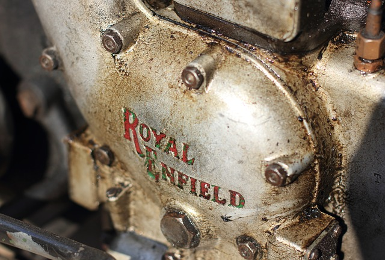

% Diferenciální počet funkcí jedné proměnné z ptačí perspektivy
% Robert Mařík
% 2017–2019

# Derivace

$$f'(x)=\frac{\mathrm{d}f}{\mathrm{d}x}=\lim_{\Delta x\to 0}\frac{f(x+\Delta x)-f(x)}{\Delta x}$$

* Derivace funkce $f$ vzhledem k $x$ je okamžitá rychlost s jakou se
mění veličina $f$ při změnách veličiny $x$. 
* Jednotkou derivace funkce
$f(x)$ je jednotka $f$ dělená jednotkou $x$.
* Derivaci funkce $f(x)$ označujeme $f'$ nebo $\frac{\mathrm df}{\mathrm dx}$. 
* Derivaci derivace (druhou derivaci) funkce $f(x)$ označujeme $f''$ nebo $\frac{\mathrm d^2 f}{\mathrm dx^2}$.

# Kde ji potkám?

Vlastně všude, kde se něco mění a zajímá mne jak rychle.

Závislá proměnná|Nezávislá proměnná|Derivace|
|------------------------|-----------------------|------------------------|
|veličina $x$|čas|rychlost růstu veličiny $x$|
|dráha při pohybu při pohybu po přímce i vzdálenost od referečního bodu|čas doba od začátku pohybu nebo od referečního okamžiku|rychlost|
|rychlost|čas|zrychlení|
|teplota v místě tyče (např. stěna, což je v podstatě extrémně krátká a široká tyč)|poloha|gradient teploty, veličina udávající intenzitu toku tepla tyčí resp. stěnou|
|všeobecná cenová hladina (cca náklady na živobytí)|čas|inflace|
|náklady na výrobu zboží|množství zboží|mezní náklady|
|nadmořská výška na trase treku|poloha|stoupání trasy|
|graf funkce $f(x)$|$x$|růst grafu (směrnice tečny)|
|hmotnost části tyče (např od zvoleného bodu doleva)|poloha na tyči (např. vzdálenost od levého konce)|lineární hustota tyče|
|výška stromu|čas|rychlost růstu do výšky|
|objem kmene stromu (smrk)|čas|rychlost růstu ve smyslu přírůstu dřevní hmoty|
|potenciální energie tělesa v radiálním silovém poli|vzdálenost od středu|působící síla vynásobená faktorem $-1$|

--------------------

## Derivace ve fyzikálních zákonech 1

Derivace nejčastěji ve fyzikálních zákonech vystupuje jako rychlost
změny v čase, často vyjádřená slovy "časová změna"

> Newtonův zákon síly (pohyb hmotného tělesa na které působí vnější
síla): *Časová změna hybnosti je rovna výsledné působící síle.*

\iffalse 

\fi

Tj. derivace hybnosti podle času je rovna výsledné síle. Derivace
hybnosti je pro tělesa s konstantní hmotností součinem hmotnosti a
zrychlení. Zrychlení je druhá derivace polohy. Nejčastěji proto tento
zákon píšeme ve tvaru $$m\frac{\mathrm{d}^2 x}{\mathrm{d}t^2}=F.$$

Speciální případy dobře známé ze střední školy jsou zákon setrvačnosti
($F$ nulová), rovnoměrně zrychlený pohyb ($F$ nenulová konstantní) a
kmitavý pohyb na pružině ($F=-kx$).

----------------

## Derivace ve fyzikálních zákonech 2

> Faradayův zákon elmg. indukce (indukované napětí podél uzavřené
smyčky v proměnném magnetickém poli): *Hodnota indukovaného
elektromotorického napětí je rovna záporně vzaté časové změně
celkového magnetického toku, který prochází elektrickým obvodem*.

\iffalse 

\fi

$$\mathcal E = -\frac{\mathrm d\Psi}{\mathrm dt}$$ Speciálním
případem známým ze střední školy je přímý vodič pohybující se v
homogenním magnetickém poli po rovnoběžných vodičích.

---------------------

## Rychlost růstu 1

> Derivace je okamžitá rychlost změny.

\iffalse 

\fi

*Příklad:*
Populace ryb v East River je dána vztahem $$P(t)=\frac{3e^t}{1+e^t},$$
kde $P(t)$ je v milionech ryb a $t$ čas v letech od roku 2000.

Jednotkou derivace $P'(t)$ je milion ryb za rok. Platí například $P'(0)=0.75$ a v roce 2000 tedy populace přibývá rychlostí $0.75$ milionu ryb za rok.

---------------------

## Rychlost růstu 2
> Rychlost změny nemusí být změna vztažená na jednotku času, ale i míra změny prostorového uspořádání (gradient) nebo změna vztažená na jinou vhodnou jednotku.

\iffalse 

\fi

*Příklad:*
Náklady na produkci $x$ letadel za rok jsou dány funkcí
$$C(x) = 6 + \sqrt{4x + 4},\qquad  0 \leq x \leq 30.$$
Platí
$$C'(x)=\frac{\mathrm{d}C}{\mathrm{d}x}=\frac{2}{\sqrt{4x+4}}$$
a jednotkou derivace $C'(x)$ je (milion Euro)/(kusů letadel).
Například $C'(15)=0.25$ a při produkci patnáct letadel za rok stojí další letadlo přibližně $0.25$ mil. Euro. Tato veličina, derivace nákladové funkce, se v ekonomii nazývá *mezní náklady*.

---------------------

## Rychlosti změn vzájemně souvisejících veličin

> Často se setkáme s tím, že dvě nebo více veličin jsou svázány vzájemně jednoznačným vztahem a změna jedná veličiny vyvolává změnu veličiny další. Pomocí derivace a pomocí pravidla pro derivaci složené funkce je možné najít vztah mezi rychlostmi změn těchto veličin.

\iffalse 

\fi

*Příklad:* Ledová koule taje tak, že se poloměr zmenšuje rychlostí $3$cm/hod. Jak rychle se zmenšuje objem v okamžiku, kdy je poloměr $10$cm?

*Řešení:*
Zadání vlastně říká následující: $V=\frac 43 \pi r^3$, $r=10$cm, $\frac {\mathrm{d}r}{\mathrm{d}t}=-3$cm/hod, $\frac {\mathrm{d}V}{\mathrm{d}t}=?$

Derivací získáváme
$$\frac {\mathrm{d}V}{\mathrm{d}t}=  4\pi r^2 \frac {\mathrm{d}r}{\mathrm{d}t}$$
a po dosazení
$$\frac {\mathrm{d}V}{\mathrm{d}t}=  4 \cdot \pi \cdot (10\mathrm{cm})^2\cdot (-3)\mathrm{cm}/\mathrm{hod}=-3800 \mathrm{cm}^3/\mathrm{hod}.$$

Objem koule se zmenšuje rychlostí 3800 krychlových centimetrů za
hodinu. To je zdánlivě vysoké číslo vzhledem k objemu celé koule (4100
krychlových centimetrů), ale všimněme si, že rychle klesá s klesajícím
poloměrem.

---------------------

## Lineární aproximace

> Je-li známa současná hodnota veličiny $f$ a rychlost změny této veličiny, je možno budoucí nebo minulou hodnotu veličiny $f$ odhadnout extrapolací za předpokladu, že rychlost změny bude resp. byla stále stejná.

$$f(x)\approx f(a)+f'(a)(x-a)$$

Toto je základní vztah pro lokální lineární aproximaci, pro nahrazení komplikovaných vztahů jejich lineárními přiblíženími.

Příkladem jsou vztahy pro odmocňování čísel blízkých jedniččce, pro
energii pohybujícího se tělesa a pro potenciální energii v blízkosti
Země.

$$\sqrt{1+x}\approx 1+\frac 12 x,
\quad \frac 1{\sqrt{1-x}}\approx 1+\frac 12 x,\quad \text{pro malé }x$$

$$E=\frac{m_0c^2}{\sqrt{1-\frac {v^2}{c^2}}}\approx m_0c^2+\frac 12 m_0v^2 \quad \text{pro $v$ mnohem menší než $c$}$$

$$V=-\kappa \frac{mM}{R+h}\approx -\kappa \frac{mM}{R} + \kappa \frac{mM}{R^2} h=-\kappa \frac{mM}{R}+m g h,\quad \text{kde $g=\kappa \frac{M}{R^2}$.}$$

# Integrál

Derivace umožní přechod od hodnoty veličiny v čase k okamžité
rychlosti její změny. Opak derivace, integrál, umožní zjistit, jaká je
celková změna veličiny, která se mění zadanou rychlostí. (Má smysl
provádět v případě nekonstantních rychlostí, jinak je problém
triviální.) Kromě toho integrál poslouží, pokud potřebujeme zobecnit
průměr na případ, kdy průměrujeme nekonečně mnoho hodnot spojitě
rozložených na nějakém intervalu.

* Změnu polohy pohybujícího se tělesa je možno vypočítat pomocí vztahu 
$$\Delta s=\int_a^b v(t)\,\mathrm{d}t.$$
Ze střední školy jsou známy speciální případy, kdy rychlost je
konstantní (dráha rovnoměrného pohybu, $s=s_0+vt$) nebo lineární (dráha rovnoměrně zrychleného pohybu, $s=s_0+v_0t+\frac 12 at^2$ )
* Energie a práce jsou integrály síly jako funkce polohy. Ze střední
školy známe speciální případ pro práci konstantní síly ($W=Fs$) a síly
úměrné posunutí (pro pružinu platí Hookův zákon a proto $W=\frac 12
kx^2$.)

---------------------

## Velikost změny

> Ze známé rychlosti změny veličiny je možné zrekonstruovat pouze numerickou změnu této veličiny. Časový průběh je možné zrekonstruovat pouze s dalšími dodatečnými informacemi, jako například počáteční hodnota.

\iffalse 

\fi

Olej vytéká z nádrže rychlostí $$f(x)=4000 e^{-0.3x}\, \mathrm{litr}/\mathrm{den}.$$ Kolik oleje vyteče za prvních pět dnů? Kolik oleje vyteče za dalších pět dnů?

*Řešení:*
$$\int _0^5 4000 e^{-0.3x} \,\mathrm dx\approx 10\,358,     \qquad  \int _5^{10} 4000 e^{-0.3x} \,\mathrm dx\approx 2\,311 $$

Funkce popisující časový průběh objemu vyteklého oleje má tvar
$$f(T)=\int _0^T 4000 e^{-0.3x} \,\mathrm dx\approx
\frac{40000}{3}
-\frac{40000}{3} \, e^{-0.3 \, T} .
$$

---------------------

## Střední hodnota

Střední hodnota funkce $f$ na intervalu $[a,b]$ je $\frac1{b-a}\int_a^b f(x)\,\mathrm{d}x$.

Speciálním případem známým ze střední školy je efektivní hodnota střídavého napětí a proudu,
kdy $U_{\text{ef}}^2$ je střední hodnota $U^2$. (Druhá mocnina,
protože práce el. napětí je úměrná druhé mocnině napětí.)
 

*Příklad:* Teplota $T$ ve °C zaznamenaná během dne odpovídala funkci $$T = 0.001 t^4 − 0.280 t^2 + 25$$

kde $t$ je počet hodin po poledni ($-12 \leq t \leq  12$). Jaká je průměrná denní teplota?

*Řešení:*
$$\frac 1{24}\int_{-12}^{12} 0.001 t^4 − 0.280 t^2 + 25 \,\mathrm dt \approx 15.7$$
Průměrná denní teplota je 15.7 °C.

# Diferenciální rovnice

Někdy rychlost změny veličiny souvisí s numerickou hodnotou této
veličiny a proto nestačí k výpočtu změny této veličiny integrální
počet. Nástrojem pro studium jsou diferenciální rovnice.

* Rychlost tepelné výměny je úměrná rozdílu teplot.
* Rychlost s jakou dřevo při sušení ztrácí vodu je úměrná množství vody,
kterou má dřevo navíc oproti rovnovážnému stavu.
* Speciálním případem diferenciální rovnice, známým ze střední školy, je radioaktivní rozpad
$$\frac {\mathrm{d}y}{\mathrm{d}t}=-ky$$
(rychlost radioaktivního rozpadu je úměrná množství nerozpadlého
materiálu) s poklesem aktivity geometrickou řadou (poločas
rozpadu).
* Typickým příkladem v biologických vědách je růst populace, kdy rychlost růstu
populace je určena velikostí této populace (větší populace má více
narozených jedinců za jednotku času, příliš velká populace nemusí mít
dostatek obživy v dané lokalitě apod.)  Například základní rovnice pro studium populací
v biologii je logistická rovnice $$\frac
{\mathrm{d}y}{\mathrm{d}t}=ry\left(1-\frac yK\right).$$
	
