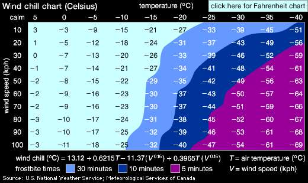
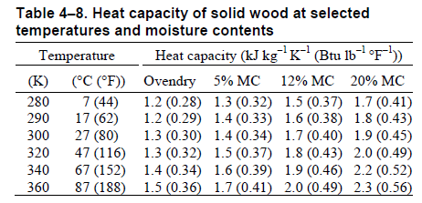

% Parciální derivace

> Anotace.
>
> * V úvodu si osaháme vzorce pro derivování.
> * Poté si na poměrně jednoduše představitelném příkladě reálně používaného vzorce pro pocitovou teplotu naformulujeme slovní interpretaci derivace.
> * V dalších dvou příkladech si vyzkoušíme numerické derivování. Pokud Vám to však bude připadat jako naivní počítání pomocí trojčlenky a selské logiky, gratuluji. Nic jiného to totiž vlastně není, jenom je to teď pevněji uchopeno pro případné použití v matematických modelech.
> * Základním modelem postaveným na parciálních derivacích je rovnice vedení tepla v jedné dimenzi. V tomto případě spád teploty podél jednorozměrné tyče vyvolá tok tepla. Změny v toku tepla v různých místech tyče zase určují, jestli se mezi těmito průřezy teplo kumuluje, ubývá, či zachovává. Tento fakt ovlivní teplotu v daném místě a ta zase má vliv na spád teploty podél tyče. Tím se uzavře jakási zpětná vazba řídící celý proces. Situace je dostatečně jednoduchá na představu, ideální pro popis pomocí parciálních derivací a současně dostatečně obecná, aby se později dala zobecnit je libovolný transportní děj přenášející energii nebo hmotu. Abychom formulaci co nejlépe porozuměli a za možná děsivě vyhlížejícími symboly viděli opravdu vyjádření používaná v tomto odstavci, ještě jednou si rovnici tepla rozebereme. Ať již z hlediska slovní interpretace jednotlivých členů, či z hlediska formulace okrajových podmínek pro zachycení vlivu okolního prostředí.

# Výpočet pomocí vzorců

https://youtu.be/KykczBw2Kcg

Vypočtěte následující parciální derivace.

1. $\frac{\partial }{\partial x}(x^2y+2xy^3+x+1)$
1. $\frac{\partial }{\partial y}(x^2y+2xy^3+x+1)$
1. $\frac{\partial }{\partial x}(3x(3-x-2y))$
1. $\frac{\partial }{\partial y}(3x(3-x-2y))$
1. $\frac{\partial }{\partial x}\sqrt{1-x^2-y^2}$
1. $\frac{\partial }{\partial y}\sqrt{1-x^2-y^2}$
1. $\frac{\partial }{\partial x}\frac x{x^2+y^2}$
1. $\frac{\partial }{\partial y}\frac x{x^2+y^2}$

1. $\frac{\partial }{\partial x}(x^2y+2xy^3+x+1)=2x\cdot y+2y^3+1+0=2xy+2y^3+1$
1. $\frac{\partial }{\partial y}(x^2y+2xy^3+x+1)=x^2+2x\cdot 3y^2+0+0=x^2+6xy$
1. $\frac{\partial }{\partial x}(3x(3-x-2y))=\pdv x (9x-3x^2-6xy)=9-3\cdot 2x-6\cdot 1\cdot y=9-6x-6y$
1. $\frac{\partial }{\partial y}(3x(3-x-2y))=3x\frac{\partial }{\partial y}(3-x-2y)=3x(-2)=-6x$ (pozor, ve videu je u tohoto příkladu překlep a zapomněl jsem derivovat člen $2y$)
1. $\pdv {x} \sqrt{1-x^2-y^2}=\pdv {x} (1-x^2-y^2)^{\frac 12}=\frac 12 (1-x^2-y^2)^{-\frac 12} (0-2x-0)=
  -\frac {x}{\sqrt{1-x^2-y^2}}$
1. $\pdv {y} \sqrt{1-x^2-y^2}= -\frac {y} {\sqrt{1-x^2-y^2}}$ (z předchozího výpočtu a symetrie)  
1. $\pdv {x} \frac x{x^2+y^2}=\frac{1(x^2+y^2)-x(2x+0)}{(x^2+y^2)^2}=\frac{y^2-x^2}{(x^2+y^2)^2}$ (derivace podílu)
1. $\pdv{y} \frac x{x^2+y^2}=\pdv {y} x(x^2+y^2)^{-1}=x(-1)(x^2+y^2)^{-2}(0+2y)=-\frac{2xy}{(x^2+y^2)^2}$ (derivace konstantního násobku mocninné funkce s vnitřní složkou)

ww:problems/parcialni_derivace/parcialni_derivace.pg

ww:problems/parcialni_derivace/parcialni_derivace_s_parametrem.pg

ww:problems/parcialni_derivace/parcialni_derivace_druheho_radu.pg

# Parciální derivace, pocitová teplota analyticky

https://youtu.be/VdtIj5TGBZE

Kanadský empirický vzorec pro pocitovou teplotu v zimě (wind chill factor) je nesmírně důležitý vzorec, který v drsných severských podmínkách rozhoduje o přežití. Je založen na tom, že pocitově je teplota vnímána i podle intenzity větru. Tento odjakživa známý efekt byl v roce 2001 proměřen a původní vzorec z roku 1961 byl nahrazen vzorcem 
$$
W(T,v) = 13.12+0.6215 T-11.37 v^{0.16}+0.3965 T v^{0.16},
$$
kde $W$ a $T$ jsou pocitová teplota a naměřená teplota
(obě ve stupních Celsia) a $v$ je rychlost větru (v km/hod). 

Uvažujte situaci, kdy teplota je $-11.0\,{}^\circ\!\text{C}$  a rychlost větru $26
\,\text{km/hod}$. 

Určete parciální derivace pocitové teploty podle skutečné teploty a podle rychlosti větru (včetně jednotky) a výsledky interpretujte slovně.

_Další informace: Wikipedia a Wind chill._

Dosazením do vzorce dostáváme $W(-11,26)=-20.212\,{}^\circ\!\text{C}$. Derivováním dostáváme
$$\begin{aligned}\frac{\partial W}{\partial T}(T,v)&=0.6215+0.3965 v^{0.16},\\
\frac{\partial W}{\partial v}(T,v)&=-11.37\times 0.16 v^{-0.84}+0.3965 \times 0.16 Tv^{-0.84}
\end{aligned}
$$
a po dosazení
$$\begin{aligned}\frac{\partial W}{\partial T}(-11,26)&=1.289,\\
\frac{\partial W}{\partial v}(-11,26)&=-0.163 \,{}^\circ\!\text{C}\, /(\mathrm{km}\, \text{hod}^{-1})=-0.163 \,{}^\circ\!\text{C}\, \text{hod} \,\mathrm{km}^{-1}.
\end{aligned}
$$
Za dané teploty a rychlosti větru je pocitová teplota $-20.2$ stupňů
Celsia. Nárůst teploty o jeden stupeň způsobí nárůst pocitové teploty
přibližně o $1.3$ stupně. Tedy změna teploty se projeví na pocitové
teplotě $1.3$-násobkem. K každou změnu teploty vnímáme o třicet procent
intenzivněji.

Hodnota derivace podle rychlosti větru říká, že zesílení větru o jeden kilometr za hodinu způsobí snížení
pocitové teploty přibližně o $0.16$ stupně.

# Pocitová teplota numericky

https://youtu.be/J0pTAxDwZj8

Běžný kanaďan nenosí kalkulačku a nepočítá pocitovou teplotu z minulého příkladu pomocí výše uvedeného vzorce, ale má tabulku jako je na obrázku. Nám tato tabulka poslouží jako model funkce dvou proměnných zadané funkčními hodnotami v konečném počtu bodů. 

1. Vypočtěte pomocí centrální diference parciální derivaci
$\frac {\partial W}{\partial v}$ pro teplotu $-15^\circ\mathrm C$ a rychlost větru $40\,\mathrm{km}\,\mathrm{hod}^{-1}$ a interpretujte výsledek slovně.
1. Pocitová teplota $W$ je lineární v proměnné $T$. Proto derivace $\frac{\partial W}{\partial T}$ nezávisí na $T$. Jak se tato skutečnost
  odrazí v tabulce?
  1. Odhadněte z tabulky, zda vliv větru klesá nebo roste s rychlostí větru. Potvrďte svou hypotézu analytickým výpočtem parciální derivace $\frac{\partial W}{\partial v}$ a vysvětlete fyzikálně.

1.  $$\frac {\partial W}{\partial v}(T=-15,v=40)\approx\frac{-29-(-26)}{50-30}\frac{{}^\circ \mathrm C}{\mathrm{km}\,\mathrm{hod}^{-1}}=-0.15^\circ \mathrm C/(\mathrm{km}\,\mathrm{hod}^{-1})$$  Za podmínek, kde je $15$ stupňů pod nulou a vane vítr o rychlosti $40$ kilometrů za hodinu každé další zesílení větru o kilometr za hodinu sníží pocitovou teplotu přibližně o patnáct setin stupně.
1. Neformálně: V rámci každého řádku jsou stejně velké   skoky. Přesněji: V každém řádku je přibližně aritmetická   posloupnost, data se mění odečtením pevné konstanty. Případné  fluktuace od tohoto pravidla jsou způsobeny zaokrouhlením.
1. Pokud se díváme na data po sloupcích, s rostoucí silou větru  jsou skoky menší a proto parciální derivace podle větru s rostoucí  rychlostí větru klesá. To potvrzuje i analytický výpočet, protože u  rychlosti je mocnina menší než jedna a ta se po zderivování změní na  zápornou mocninu. Tím se změní charakter závislosti na rychlosti  větru. Fyzikálně vítr odfoukává izolační mikrovrstvu vzduchu kolem  tváře nebo těla a proto cítíme ve větším větru větší chlad. Pokud je  vítr silný, nestačí se tato mikrovrstva vytvořit ani v minimální míře  a proto je jedno, jestli fouká hodně nebo ještě více.

# Parciální derivace, tepelná kapacita dřeva

https://youtu.be/PjPYisnQa0A

Vypočtěte a slovně interpretujte parciální derivaci měrné tepelné kapacity dřeva $c$ podle teploty $T$ a podle obsahu vody MC $w$ v bodě o hodnotě MC 12\% a teplotě $27^\circ\mathrm C$.

Pro obě derivace použijte dopřednou diferenci (v tabulce nejsou ekvidistantní kroky MC).

*Poznámka:* Kromě dopředné diference je možné uvažovat ještě zpětnou diferenci definovanou vztahem $$\frac{f(x)-f(x-h)}{h},$$ což je vlastně dopředná diference na předchozím intervalu. Ukažte, že centrální diference je průměrem dopředné a zpětné diference.

$$\pdv{c}{T}=\frac{1.8-1.7}{47-27}=0.005 \,\mathrm{kJ}\,\mathrm{kg}^{-1}\mathrm{K}^{-2}=5 \,\mathrm{J}\,\mathrm{kg}^{-1}\mathrm{K}^{-2}$$
Tato hodnota udává, o kolik vzroste měrná tepelná kapacita dřeva dané teploty a vlhkosti při zvýšení teploty o jeden stupeň Celsia (o jeden Kelvin).

$$\pdv{c}{w}=\frac{1.9-1.7}{20-12}=0.025 \,\mathrm{kJ}\,\mathrm{kg}^{-1}\mathrm{K}^{-1}(\text{procento MC})^{-1}=25 \,\mathrm{J}\,\mathrm{kg}^{-1}\mathrm{K}^{-1}(\text{procento MC})^{-1}$$
Tato hodnota udává, o kolik vzroste měrná tepelná kapacita dřeva dané teploty a vlhkosti při zvýšení obsahu vody o jedno procento.

Průměr dopředné a zpětné diference:
$$
  \frac{\frac{f(x)-f(x-h)}{h} + \frac{f(x+h)-f(x)}{h}}{2}=
  \frac{\frac{f(x)-f(x-h)+f(x+h)-f(x)}{h}}{2}=
\frac{f(x+h)-f(x-h)}{2h}
$$

# Veličiny z rovnice vedení tepla

https://youtu.be/YvAFRS8zeos

V případech, kdy je při tepelné výměně nutno uvažovat vedení tepla (vysoké Biotovo číslo), modelujeme změnu teploty podle rovnice vedení tepla, kterou jsme na přednášce odvodili pro jednorozměrný případ ve tvaru
$$\varrho c \frac{\partial T}{\partial t}=\frac{\partial}{\partial x}\Bigl(\lambda\frac{\partial T}{\partial x}\Bigr).$$  Typickým případem vedení tepla v jedné dimenzi je vedení tepla ve stěně. **Důležitou vlastností rovnice je, že je stále stejná, ať teplo teče doleva nebo doprava, ať způsobuje ohřev nebo ochlazování, ať tok tepla sílí nebo slábne. Tyto skutečnosti přirozeně rozlišujeme znaménkem. Abychom dokázali úlohu správně zadat nebo abychom dokázali správně interpretovat řešení, je nutné znaménka správně interpretovat a proto si vše ukážeme v následujícím příkladu.**

Uvažujme jednorozměrnou úlohu s vedením tepla. Osa $x$ směřuje doprava, teplota v bodě $x$ a čase $t$ je $T(x,t)$ ve stupních Celsia. Tok tepla v čase $t$ a v bodě $x$ je $q(x,t)$ v joulech za sekundu. Kladný tok je ve směru osy $x$.
Podle Fourierova zákona je $$q=-\lambda \frac{\partial T}{\partial x}.$$

Tyč má teplotu $0\,^{\circ}\mathrm{C}$, pravý konec udržujeme na této teplotě, levý konec ohříváme na $20\,^{\circ}\mathrm{C}$ a udržujeme na této teplotě. Ve zbytku tyče (stěny) se postupně nastolí rovnováha vlivem vedení tepla.

Vyjádřete následující veličiny a určete jejich znaménko.

1. Rychlost, s jakou v daném místě a čase roste teplota jako funkce času.
1. Rychlost, s jakou v daném místě a čase roste teplota jako funkce polohy, tj. jak rychle  roste teplota směrem doprava.
1. Rychlost, jak rychle klesá teplota jako funkce polohy, tj. směrem doprava.
1. Rychlost, se kterou roste (směrem doprava) tok tepla jako funkce polohy.
1. Rychlost, se kterou klesá (směrem doprava) tok tepla jako funkce polohy.

_Tato úloha je jednoduchá a vlastně není na počítání, ale jenom na ujasnění si toho, co derivace vyjadřují a kdy jsou kladné a kdy záporné. To je nutné znát při zadávání modelů do numerických simulací. Výpočet za člověka udělají počítače, ale slovní interpretaci ani kontrolu, že je model relevantní a nemá popletená znaménka, za člověka nikdo neudělá._

1. Rychlost, s jakou v daném místě a čase roste teplota jako funkce času je $\frac {\partial T}{\partial t}$ a tato derivace je v každém bodě kladná, protože tyč se ohřívá. Po čase se asi ustálí rovnováha a derivace bude nulová, teplota se přestane měnit. Měříme ve stupních celsia za sekundu.
  $\left[\frac {\partial T}{\partial t}\right]={}^\circ\mathrm{C}\,\mathrm{s}^{-1}$
1. Rychlost, s jakou v daném místě a čase roste teplota jako funkce polohy, tj. jak rychle se roste teplota směrem doprava, je $\frac {\partial T}{\partial x}$ a tato derivace je záporná, protože vlevo je horký konec a teplota směrem doprava klesá. Měříme ve stupních celsia na metr.
    $\left[\frac {\partial T}{\partial x}\right]={}^\circ\mathrm{C}\,\mathrm{m}^{-1}$
1. Rychlost, jak rychle se klesá teplota jako funkce polohy, tj. směrem doprava, je $-\frac {\partial T}{\partial x}$ a tato veličina je kladná, protože vlevo je horký konec a teplota směrem doprava opravdu klesá. Měříme ve stupních celsia na metr.
        $\left[-\frac {\partial T}{\partial x}\right]={}^\circ\mathrm{C}\,\mathrm{m}^{-1}$
1. Rychlost, se kterou roste (směrem doprava) tok tepla jako funkce polohy je $\frac {\partial q}{\partial x}$. Teplo teče doprava a přitom se spotřebovává, protože se ohřívá tyč. Proto tok klesá a parciální derivace je záporná.
  Měříme v joulech za sekundu na metr.
          $\left[\frac {\partial q}{\partial x}\right]=\mathrm{J}\,\mathrm{s}^{-1}\,\mathrm{m}^{-1}$
1. Rychlost, se kterou klesá (směrem doprava) tok tepla jako funkce polohy je $-\frac {\partial q}{\partial x}$ a tato veličina je kladná, což plyne z předchozího bodu a z toho, že jsme změnili znaménko.
  Měříme v joulech za sekundu na metr.
            $\left[-\frac {\partial q}{\partial x}\right]=\mathrm{J}\,\mathrm{s}^{-1}\,\mathrm{m}^{-1}$ Tato veličina udává, kolik tepla se za jednotku času ubude v toku na metrovém úseku tyče. Ze zákona zachování energie se toto teplo nemůže ``ztratit'', ale použije se na zvýšení teploty, což je vyjádřeno právě v rovnici vedení tepla.

# Okrajové podmínky pro rovnici vedení tepla

https://youtu.be/8OMwzxEZSvU

K modelu stěny pomocí rovnice vedení tepla je ještě nutné přidat podmínky související s počátečním stavem (počáteční podmínky) a s chováním na okrajích (okrajové podmínky).

Nechť stěna je na intervalu $x\in[0,L]$, $x=0$ je vnitřní okraj a $x=L$ je vnější okraj. Výraz $-k\frac{\partial T}{\partial x}$ udává tok tepla ve směru osy $x$. Tok ve směru osy $x$ má kladné znaménko. Naformulujte okrajové podmínky v následujících scénářích.

1. Z venku dokonale izolovaná stěna. Na hranici $x=L$ nedochází k toku tepla.
1. Vnitřní část stěny je udržovaná na konstantní teplotě $T=23^\circ \mathrm C$.
1. Stěna je zvenku osvětlená a zahřívaná Sluncem. Na vnější hranici je konstantní tok tepla směrem do stěny.
1. Stěna je zvenku ochlazována prouděním vzduchu. Tok tepla mezi stěnou a okolím je úměrný rozdílu teplot stěny a okolí.
1. Stěna je zevnitř ohřívána prouděním vzduchu od radiátorů. Tok tepla mezi stěnou a okolím je úměrný rozdílu teplot stěny a okolí.

_Zpracováno podle Cengel: Mass and heat transfer._

_Opět úloha jednoduchá co není na počítání, ale jenom na ujasnění si toho, jak dodáme do modelu informaci o tom, jakým podmínkám je náš studovaný systém vystaven. I toto je nutné znát při zadávání modelů do numerických simulací. I zde platí, že výpočet za člověka udělají počítače, ale kontrolu, že je model relevantní a modeluje opravdu to co chceme, za člověka nikdo neudělá._

Je-li podmínka na teplotu, figuruje v matematické formulaci $T$ vypočtená v bodě $x=0$ nebo $x=L$ podle toho, jedná-li se o vnitřní nebo vnější část stěny. 
$T$ je funkce polohy, tj. $T=T(x).$ Je-li podmínka na tok, figuruje v matematické formulaci tok ve tvaru $-k\frac{\partial T}{\partial x}$, opět vypočtená v jednom z krajních bodů.

1. $-k\frac{\partial T}{\partial x}(L)=0$
1. $T(0)=23$
1. $-k\frac{\partial T}{\partial x}(L)=-Q$, kde $Q$ je teplo za jednotku času dodané ze Slunce. Jedná se výkon Slunce dopadající na stěnu vynásobený koeficientem absorbce, protože část tepelného výkonu se odráží. Záporné znaménko je proto, že teplo teče do stěny, tj. proti směru osy $x$.
1. $-k\frac{\partial T}{\partial x}(L)=h(T(L)-T_{\text{okolí}})$, kde $h$ je koeficient přestupu tepla.
1. $-k\frac{\partial T}{\partial x}(0)=h(T_{\text{místnost}}-T(0))$, kde $h$ je koeficient přestupu tepla.

Všimněte si, že poslední dvě podmínky se liší znaménkem u veličiny $T$. To proto, že v jednom případě je kladný směr toku tepla do materiálu a jednou z materiálu. Pokud chceme mít popis jednotný, nebo nezávislý na zvolené souřadné soustavě, formulujeme podmínky pro tok tepla ven z materiálu. Tento tok získáme tak, že tok tepla vynásobíme skalárně s jednotkovým vektorem směřujícím ven z materiálu kolmo na jeho povrch. V tomto případě by pro tok ze stěny do místnosti bylo $k\frac{\partial T}{\partial x}(0)=h(T-T_{\text{místnost}})$. Tento tok by byl záporný, protože ve skutečnosti teplo uniká z místnosti stěnou ven.

