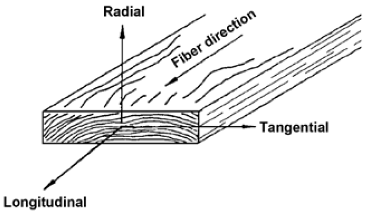

% Gradient

> Anotace.
>
> * V úvodu si osaháme gradient a jeho využití k lineární aproximaci a jeho vztah k vrstevnicím.
> * Komplexnější je příklad číslo 5. Ukazuje mimo jiné, že někdy je výhodnější řešit úlohu v rámci obecnější teorie. 
> * V šestém příkladě si ilustrujeme na příkladě linearizaci vektorové funkce v počátku. Tato linearizace je v podstatě cesta k jednotné formulaci konstitučních zákonů. Ukázku použití takového zákona si představíme v sedmém příkladě.
> * Poslední příklad nás zavede do světa zpracování reálných dat a vyzkoušíme si nalezení gradientu numerickou cestou.

# Linearizace pocitové teploty

https://youtu.be/NFymct4-4jQ

Pocitová teplota $W$ z minulého cvičení má v bodě odpovídajícím teplotě $T=-11{}^\circ\mathrm C$ a rcyhlosti větru $v=26\,\mathrm {km}\,\mathrm{hod}^{-1}$ má hodnotu $$W=-20.2 ^\circ\mathrm C$$ a parciální derivace $$\pdv{W}{v}=-0.163 ^\circ\mathrm C\, \mathrm {hod}\,\mathrm{km}^{-1}$$ a
$$\pdv{W}{T}=1.289.$$ Najděte pomocí lineární aproximace vzorec pro pocitovou teplotu v okolí tohoto bodu.

Přímým použitím vzorce pro lineární aproximaci dostáváme
$$
W=-20.2+1.289(T-(-11))-0.163(v-26)=-20.2+1.289(T+11)-0.163(v-26),
$$
přičemž všechny veličiny dostazujeme v jednotkách SI (stupně Celsia a kilometry za hodinu).

# Parciální derivace, gradient

https://youtu.be/Gnl5liHh2fA

Určete gradient funkcí $z=ax^2y-2xy^2$ a $h=\frac {ax}{y^2}+5x^3y^2$, kde $a\in\mathbb R$ je reálný parametr.

$$
\begin{aligned}
  \pdv{z}{x} &= 2axy-2y^2\\
  \pdv{z}{y} &= ax^2-4xy\\
  \nabla z &= (2axy-2y^2, ax^2-4xy) = (2axy-2y^2)\vec \imath + (ax^2-4xy)\vec \jmath\\
  \pdv{h}{x} &= \frac a{y^2}+15x^2y^2\\
  \pdv{h}{y} &= ax(-2)y^{-3}+10x^3y=-\frac{2ax}{y^3}+10x^3y\\
  \nabla h &= \left(\frac a{y^2}+15x^2y^2, -\frac{2ax}{y^3}+10x^3y\right) = \left(\frac a{y^2}+15x^2y^2\right)\vec \imath + \left(-\frac{2ax}{y^3}+10x^3y\right)\vec \jmath
  \end{aligned}
$$

# Gradient funkce s vrstevnicemi ve tvaru kružnic

https://youtu.be/irOsyX_k620

Určete gradient funkce $z=x^2+y^2$ a zkontrolujte, že je v každém bodě kolmý ke kružnici se středem v počátku. Využijte toho, že spojnice bodu na kružnici se středem kružnice je kolmá k této kružnici. 

$$\begin{aligned} \pdv{z}{x} &= 2x\\ \pdv{z}{y} &= 2y\\ \nabla z &= (2x, 2y) = 2x\vec \imath + 2y\vec \jmath \end{aligned}$$
Vektor $(2x,2y)$ v bodě $(x,y)$ míří směrem od počátku, tj ve směru spojnice se středem a tedy je kolmý k vrstevnici.

# Gradient funkce s paprskovitými vrstevnicemi

https://youtu.be/OeEuQqRGeBY

Určete gradient funkce $z=\mathop{\mathrm{arctg}} \frac yx$ a zkontrolujte, že je v každém bodě tečný ke kružnici se středem v počátku. Využijte toho, že tečna je kolmá na poloměr.

$$
\begin{aligned}
  \pdv{z}{x} &= \frac1{1+\frac {y^2}{x^2}}y\frac {(-1)}{x^2}=-\frac{y}{x^2+y^2}\\
  \pdv{z}{y} &= \frac1{1+\frac {y^2}{x^2}}\frac 1x=\frac{x}{x^2+y^2}\\
  \nabla z &=  \left(-\frac{y}{x^2+y^2},\frac{x}{x^2+y^2}\right)= \frac{1}{x^2+y^2} (-y,x)
  \end{aligned}
$$

Vektor $(-y,x)$ v bodě $(x,y)$ je kolmý k vektoru $(x,y)$. Proto je tečný ke kružnici.

# Tečná rovina atd.

https://youtu.be/FpvNOIR56Vs

Pro funkci $f(x,y)=x^2+\frac x{y^2}-6$ najděte

1. gradient, 
1. gradient v bodě $(2,1)$,
1. lineární aproximaci v bodě $(2,1)$,
1. tečnou rovinu v bodě $(2,1)$,
1. rovnici vrstevnice bodem $(2,1)$ a rovnici tečny k vrstevnici tímto bodem,
1. explicitní vyjádření funkce dané v okolí bodu $(2,1)$ implicitně rovnicí $f(x,y)=0$,
1. lineární aproximace v okolí bodu $x=2$ pro funkci získanou v předchozím bodu.

_V tomto příkladě ukazujeme, že někdy je vhodné úlohu řešit v rámci obecnější teorie. Zde v podúkolu číslo 7 vlastně najdeme lineární aproximaci relativně komplikované funkce jedné proměnné (nalezené v podúkolu 6). To se dá udělat prostředky diferenciálního počtu funkcí jedné proměnné, ale výpočet by byl poměrně nepříjemný, protože by bylo nutno derivovat funkci s nepříjemnou odmocninou. Alternativa je najít tečnou rovinu k funkci více proměnných z našeho zadání a příslušný řez této tečné roviny bude tečnou k vrstevnici. Použitý aparát je sice pokročilejší (používáme funkce více proměnných tam, kde by stačily funkce jedné proměnné), ale početní náročnost je nižší. Technicky je derivování nepříjemné odmocniny ze zlomku nahrazeno derivováním polynomu._

1. $\nabla f=\left(2x+\frac 1{y^2},-2\frac x{y^3}\right)$
1. $\nabla f(2,1)=(5,-4)$
1. $f(x,y)\approx 5(x-2)-4(y-1)$
1. $z= 5(x-2)-4(y-1)$
1. Rovnice vrstevnice je $$x^2+\frac x{y^2}-6=0$$
  a tečna $$5(x-2)-4(y-1)=0,$$ tj. $$5x-4y-6=0.$$
1. Postupnými úpravami a výběrem správného znaménka po vyřešení kvadratické rovnice vzhledem k $y$ dostáváme
  $$
  \begin{aligned}
    x^2+\frac x{y^2}-6&=0\\
        \frac x{y^2}&=6-x^2\\
        y^2&=\frac{x}{6-x^2}\\
        y&=\sqrt{\frac{x}{6-x^2}}\\
  \end{aligned}
$$
1. Z rovnice tečny k vrstevnici $$5(x-2)-4(y-1)=0$$
  dostáváme $$y=1+\frac 54 (x-2)$$
  a proto
  $$\sqrt{\frac{x}{6-x^2}}\approx 1+\frac 54 (x-2)$$ v okolí $x=2$. Všimněte si, že jsme **nepotřebovali aproximovanou funkci $\sqrt{\frac{x}{6-x^2}}$ vůbec derivovat**. To je výhoda, protože derivace odmocniny z podílu se nepočítá zcela příjemně. Namísto toho jsme využili výsledek z teorie funkce více proměnných. Přitom se musela využít nadřazená teorie, ale k výpočtu nebylo třeba derivovat nic horšího, než mocninnou funkci.

ww:problems/gradient/01.pg

ww:problems/gradient/02.pg

ww:problems/gradient/05.pg

ww:problems/gradient/06.pg

# Linearizace vektorové funkce, Jacobiho matice

https://youtu.be/y66fyasf8iw

Jacobiho matice se používá k linearizaci vektorových funkcí, které
mají na vstupu i na výstupu uspořádanou n-tici. Jsou to matice, kde gradienty
jednotlivých komponent vektorové funkce jsou zapsány do řádků matice.

Najděte Jacobiho matici pro funkci $$\vec F(x,y)=(x^2+xy+6y)\vec i + e^{3x}\vec j$$ a poté hodnotu této matice v bodě $(0,0)$.

Platí
$$\begin{aligned}
  \frac{\partial }{\partial x}\left(x^2 +xy+6y\right) &=2x+y\\
  \frac{\partial }{\partial y}\left(x^2 +xy+6y\right) &=x+6\\
  \frac{\partial }{\partial x}\left(e^{3x}\right) &=3e^{3x}\\
  \frac{\partial }{\partial y}\left(e^{3x}\right) &=0\\
\end{aligned}$$
a proto má Jacobiho matice tvar
$$  J(x,y)=
  \begin{pmatrix}
    2x+y & x+6\\ 3e^{3x} & 0
  \end{pmatrix}.
$$V bodě $(0,0)$ potom platí
$$  J(0,0)=
  \begin{pmatrix}
    0 & 6\\ 3 & 0
  \end{pmatrix}.
$$

ww:problems/gradient/07.pg

ww:problems/gradient/08.pg

# Parciální derivace, gradient a násobení matic

https://youtu.be/mNKV8TUgY8Q

Vypočtěte gradient funkce $$T=10-\sqrt{x^2+y^2}$$ definující teplotu ve dvourozměrném materiálu. Ukažte, že vrstevnice
této funkce jsou kružnice se středem v počátku, nakreslete obrázek s
těmito vrstevnicemi a vyznačte do tohoto obrázku gradienty v bodech
$A=(0,1)$, $B=(1,0)$ a $C=(1,1)$

Uvažujte součinitel tepelné vodivosti $$\lambda =
\begin{pmatrix}
  2&0\\0&3
\end{pmatrix}$$
a vypočtěte tok tepla v bodech $A$, $B$, $C$. Porovnejte směr tohoto toku se směrem gradientu a vysvětlete svá pozorování. Snaží se matice usměrnit teplo do  směru osy $x$ nebo do  směru osy $y$? Odpovídá situace spíše dřevu s podélným směrem v ose $x$ nebo v ose $y$?

Platí $$\pdv{T}{x}=-\frac 12 (x^2+y^2)^{-\frac 12}(2x)=-\frac{x}{\sqrt{x^2+y^2}}$$
a ze symetrie 
$$\pdv{T}{y}=-\frac{y}{\sqrt{x^2+y^2}}.$$
Odsud $$\nabla T=\qty(-\frac{x}{\sqrt{x^2+y^2}},-\frac{y}{\sqrt{x^2+y^2}})^T
=
-\frac 1{\sqrt{x^2+y^2}}(x,y)^T.$$
Tok tepla je
$$\vec q=-\lambda \nabla T=\frac 1{\sqrt{x^2+y^2}}\begin{pmatrix}
  2&0\\0&3
\end{pmatrix}
\begin{pmatrix}
  x\\y
\end{pmatrix}
=\frac 1{\sqrt{x^2+y^2}} \begin{pmatrix}
  2x\\3y
\end{pmatrix}
$$
Dosazením dostáváme $\vec q(A)=(0,3)^T$, $\vec q(B)=(2,0)^T$, $\vec q(C)=\frac 1{\sqrt{2}}(2,3)^T$. Porovnáním s gradientem $\nabla T(A)=-(0,1)^T$, $\nabla T(B)=-(1,0)^T$ a $\nabla T(C)=-\frac 1{\sqrt 2}(1,1)^T$ vidíme, že v bodech $A$  a $B$ je tok proti směru gradientu, v bodě $C$ se tok stáčí do směru osy $y$. Protože ve ose $y$ má dřevo větší vodivost, jedná se o podélný směr. To je ale vlastně vidět už ze zadané matice.

ww:problems/gradient/10.pg

ww:problems/gradient/11.pg

ww:problems/gradient/12.pg

# Gradient numericky

https://youtu.be/A13omrC6i2I

$T$|$-30$|$-25$|$-20$|$-15$|$-10$|$-5$|$0$|$5$|$10$|$15$|$20$|$25$|$30$
--|---|---|---|---|---|--|-|-|--|--|--|--|--
$-30$|81.39|84.14|86.39|88.14|89.39|90.14|90.39|90.14|89.39|88.14|86.39|84.14|81.39
$-25$|83.47|86.22|88.47|90.22|91.47|92.22|92.47|92.22|91.47|90.22|88.47|86.22|83.47
$-20$|85.54|88.29|90.54|92.29|93.54|94.29|94.54|94.29|93.54|92.29|90.54|88.29|85.54
$-15$|87.62|90.37|92.62|94.37|95.62|96.37|96.62|96.37|95.62|94.37|92.62|90.37|87.62
$-10$|89.69|92.44|94.69|96.44|97.69|98.44|98.69|98.44|97.69|96.44|94.69|92.44|89.69
$-5$|91.77|94.52|96.77|98.52|99.77|100.52|100.77|100.52|99.77|98.52|96.77|94.52|91.77
$0$|93.84|96.59|98.84|100.59|101.84|102.59|102.84|102.59|101.84|100.59|98.84|96.59|93.84
$5$|95.92|98.67|100.92|102.67|103.92|104.67|104.92|104.67|103.92|102.67|100.92|98.67|95.92
$10$|97.99|100.74|102.99|104.74|105.99|106.74|106.99|106.74|105.99|104.74|102.99|100.74|97.99
$15$|100.07|102.82|105.07|106.82|108.07|108.82|109.07|108.82|108.07|106.82|105.07|102.82|100.07
$20$|102.14|104.89|107.14|108.89|110.14|110.89|111.14|110.89|110.14|108.89|107.14|104.89|102.14
$25$|104.22|106.97|109.22|110.97|112.22|112.97|113.22|112.97|112.22|110.97|109.22|106.97|104.22
$30$|106.29|109.04|111.29|113.04|114.29|115.04|115.29|115.04|114.29|113.04|111.29|109.04|106.29

Tabulka $T(x,y)$, vodorovně $x$, svisle $y$

Rozložení teploty v plošném materiálu je po vyhodnocení dat z termosnímku dáno tabulkou. Situace může vypadat například jako v tomto zadání. Určete gradient teploty v bodě o souřadnicích $x=20$ a $y=5$. Pro výpočet parciálních derivací použijte centrální diferenci.

**Poznámka:** Ve skutečnosti se nejedná a termosnímek, ale o graf funkce dané tabulkou. Barvy jsou interpolovány pro hladší přechody. Příkazy generující tabulku a obrázek jsou [zde](https://sagecell.sagemath.org/?z=eJyVU81um0AQvlvyO4ySi3FsB5xaqhL5lkfwLUqlNYzNGtily4JY3qEPUPWUYw9R7706ea98i-OkShOpBYFm4Ztvvvlrl9OL8HJxeRFeEdEpKVFZ0bCSVHAnqTTaPwUrxcOBewUPBzdtOyHnbmkJaJVujUxo5D8FV56oMLLLRE-QGa5yUA4Hw8EK8Cj8PJ-GszAat-3sy5zOKJx9ihZj52gKcx4t5viD4xV4GhenGkoSYQUOW1Zs6h0XTIp3ItM1bWqVxQA0sJ-1wmc4qOpi2Wf1b9cplcKIgq2pqU5EI3YSrAhBhY6pUyLViZKI65UgkeXqDBHGRqhkVMmOR6sg-Dja6SGBk07ASbESJ3RghOiGc4SC5Vmj8ygMaUxG1yBezcY4fsj7zNoJnQGfosgCtCgFVHLFViqcCll5wcNBGetcmxH65txkFcB7a8SGLJe5ts4jekAhSkq1pTfz4LH1hNbCNGCrUpFItSWpLJvyXWTj0lx06Be6wmhi4p4DgOI1gb_cDG_YsIrx5QWNLNY6Q33KtahKju3oJiLct8F7DJXlndr_pOLhx-P3_b3NtCfQa5RaV_u7OO2nsspqyw_fPLDTa-OV7u_7XmS6spL2v9P88Rc1cDT7u85Hx9An7SRxt0tESiQriwadL4LD6jSu1DFbOv7rHa6XNwvCFIYQe4AlclN3fr-ElTF7jNVZu5yO6HoUTaJgnLTYCG_PYTs6rBMwPdAdgPM_gPMXoCdLdZ6QVsPB11o2fOx2Lzt4KXrjjjuJhDOrjW44xabrHIOjqS9HVmMbj7m8ofOK_aun_A86uDwB2ZdivQ==&lang=octave&interacts=eJyLjgUAARUAuQ==).

<!-- https://sagecell.sagemath.org/?z=eJyVU9uOmzAQfUfiH0abl5BNssA2UrURb_sJeYtSyQuT4AA2NQZhvr7HySatdlu1RQLNmDNnzlw8Zqvn-GXz8hwT0YyU6KwYWElqeJLUGu3fhpXiMHB3bBjsx3FJzh0oA7IrT0YWNPdH0dbzNEZOlbjEV4a7GoxhEAY7wJP4a7qK13GyGMf1t5QeKV5_STYL52gFM002Kf7A3YJncHmpIaQQVsA5sWLTn7lhUnwWle7p2KsqB2CA_S4VMWHQ9U0WQ8s_PjNqhRENW9NTX4hBnCVYkYIandOkRKkLJZHXK0Eh2e4RGRZGqGLeyYnnuyj6c7bZtYCHSSBIsRIPdGWE6IFrpILlWZOnJI5pQUb3IN6tF3Cjv7BOQlfAl2iyAC1aAZXcsZUKXiM7LzgM2lzX2swxN-eWuwjRJyOOZLmttXUecQE0oqVSW_qwDh7bL-lNmAFsXSkKqU4klWXT_hY5uLIWE-aFqTCGWLj3BKD4WcCnMMNHNqxynNzRqOJNV72XuC_GZeEOGdCFZGXRoqdNdKEaXKtztnT7dcG_ZvskJuxBTMlhe-2ZPPaTX3BhZc4eZHU1Zqs5vc6TZRItihE76e0UtqPrQgNzAborMP0FmN6BnqzUdUFahcH3Xg586_dFdnQve3C3W4HxV1YbPXCJq6ZrjE6TfjNiqnrch1sxH-i8Yv9x0f_RIeQHCMIuJQ==&lang=octave&interacts=eJyLjgUAARUAuQ== -->

Pomocí centrální diference odhadneme parciální derivace pro $x=20$ a $y=5$.
$$\frac{\partial T}{\partial x}\approx \frac{98.67-102.67}{2\times 5}=-0.4$$
$$\frac{\partial T}{\partial y}\approx \frac{102.99-98.84}{2\times 5}=0.415$$
Gradient je $$\nabla T=\begin{pmatrix} -0.400\\ 0.415\end{pmatrix}.$$
Směřuje tedy doleva nahoru. To koresponduje s obrázkem, v bodě $x=20$ a $y=5$ teplota roste směrem doleva a nahoru.

ww:problems/gradient/gradient_numericky.pg

