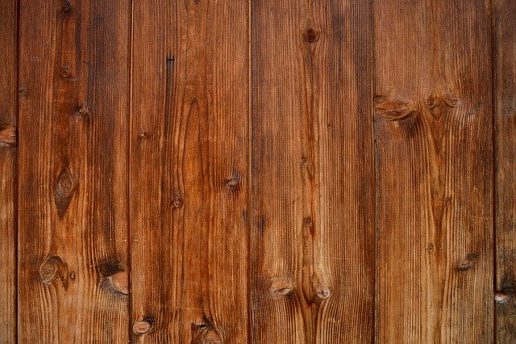

% Divergence, rovnice vedení tepla

> Anotace.
>
> * V úvodu si zkusíme vypočítat několik divergencí pro získání určité míry jistoty při práci s tímto operátorem. 
> * Poté vypočteme divergenci vektorového pole, které dostaneme jako záporně vzatý gradient stavové veličiny vynásobený difuzní maticí. Přesně takto se s divergencí pracuje v aplikacích, abychom zjistili, kde tok nabývá na intenzitě a kde naopak slábne.
> * V závěru si zopakujeme difuzní rovnici a jak se některé členy této rovnice mohou za speciálních podmínek zjednodušit. 

# Divergence vektorového pole

https://youtu.be/bdnxbITOIrM

1. Vypočtěte divergenci vektorového pole
  $$\vec F=x^2y\vec \imath + (x+y^2)\vec \jmath.$$
1. Zakreslete do obrázku směr toku vektorového pole v bodě $(2,1)$. 
1. Vypočtěte divergenci vektorového pole v bodě $(2,1)$ a podle toho, zda je kladná nebo záporná rozhodněte, zda tok v daném bodě sílí nebo slábne.
1. Předpokládejme, že dané vektorové pole reprezentuje stacionární tok. Je v bodě $(2,1)$ zdroj nebo spotřebič?

1. $\nabla \cdot \vec F=\pdv{x}(x^2y)+\pdv{y}(x+y^2)
=2xy+(0+2y)=2y(x+1)$
1. $\vec F(2,1)=2^2\cdot 1\cdot \vec \imath + (2+1^2)\vec \jmath=4\vec\imath+3\vec\jmath=(4,3)$, tj. vektorové pole teče směrem doprava nahoru směrem daným směrnicí $0.75$, tj. pod úhlem menším než $45^\circ$.
1. $\nabla\cdot\vec F(2,1)=2\cdot 1 \cdot(2+1)=6>0$. Divergence je kladná a proto se tok zahušťuje.
1. Zdroj (kladná divergence).

# Divegrence vektorového pole s parametrem

https://youtu.be/zwYPRlEIrHI

1. Vypočtěte divergenci vektorového pole
  $$\vec F=ax^3y^2\vec \imath + 3x^2y\vec \jmath,$$ kde
  $a\in\mathbb R$ je reálný parametr.
1. Určete hodnotu parametru $a$ tak, aby pole bylo v bodě $(-1,2)$ nezřídlové, tj. aby mělo nulovou divergenci v bodě $(-1,2)$.

1. $\nabla \cdot \vec F=\pdv{x}(ax^3y^2)+\pdv{y}(3x^2y)
=3ax^2y^2+3x^2=3x^2(ay^2+1)$
1. $\nabla \cdot \vec F (-1,2)=3(-1)^2(a\cdot 2^2+1)=3(4a+1)$ a $\nabla \cdot \vec F (-1,2)=0$ pokud $3(4a+1)=0$, tj. $a=-\frac 14$.

# Rovnice vedení tepla v dvourozměrném materiálu

https://youtu.be/U9_0wbKT_2I

Teplota ve dvourozměrné desce pro $0\leq x\leq 10$ a $0\leq y\leq 10$ zachycené v určitém okamžiku termokamerou je popsána rovnicí
  $$T(x,y)=(2x-y)^2+x^4.$$
  Rozměry jsou v centimetrech a teplota ve stupních Celsia. (Formálně to nevychází, ale ke každému členu můžeme dodat konstantu, která jeho rozměr opraví. Pro jednoduchost tuto komplikaci vynecháme.)

1. Vypočtěte gradient $\nabla T$  a tok tepla $-k \cdot \nabla T.$
Součinitel tepelné vodivosti (v jednotkách kompatibilních se zadáním) je $k=
  \begin{pmatrix}
    4 & 1\\1&6
  \end{pmatrix}.$ 
1. Určete, zda na levém okraji desky teče teplo dovnitř do desky nebo z desky ven.
1. Vypočtěte divergenci toku tepla, tj. $\nabla\cdot(-k \cdot \nabla T).$
1. V desce nejsou zdroje tepla. Ochlazuje se deska uprostřed, nebo otepluje?

1. Gradient je vektor složený z parciálních derivací. $$\nabla T=\qty(
  4(2x-y)+4x^3,-2(2x-y))^T$$ Tok je tenzor vodivosti maticově vynásobený s gradientem teploty a faktorem $(-1)$.
  $$-k\cdot \nabla T=-
  \begin{pmatrix}
    4&1\\1&6
  \end{pmatrix}
  \begin{pmatrix}
    4(2x-y)+4x^3\\-2(2x-y)
  \end{pmatrix}
  =-
  \begin{pmatrix}
    14(2x- y)+16x^3\\-8(2x- y)+4x^3
  \end{pmatrix}
$$
1. Do vztahu pro tok dosadíme rovnici levého okraje desky, tj. $x=0$.
  $$-k\cdot \nabla T (x=0)=
  \begin{pmatrix}
    14y\\-8y
  \end{pmatrix}
  $$
  Na levém okraji desky je $y>0$ a proto $14y>0$. Tok míří doprava a teplo teče na tomto okraji do desky.
1.  Vypočteme divergenci toku určeného v prvním bodě. $$
  \begin{aligned}
\nabla \cdot (-k\cdot \nabla T )&=\pdv{x}(-14(2x- y)-16x^3)+\pdv{y}(8(2x- y)-4x^3)\\&=-48x^2-28-8\\&=-48x^2-36
\end{aligned}
$$
1. Do vztahu pro diveregenci dosadíme bod, který nás zajímá. $$\nabla \cdot (-k\cdot \nabla T )(x=5,y=5)=-1236$$ Tok tepla se zmenšuje a protože jde o stav bez zdrojů, teplo se v daném místě akumuluje a deska se proto otepluje. Z rovnice vedení tepla
  $$\rho c\pdv{T}{t}=\nabla\cdot(k \cdot \nabla T)$$
  plyne v daném bodě
  $$\rho c\pdv{T}{t}=1236$$
  a můžeme dokonce odhadnout, jak rychle teplota roste.

[Sage](https://sagecell.sagemath.org/?z=eJxNT8GOwiAUvJPwDy_uBRQ3anQPm_QfNllvTU3Y8qrYCoZCF_z6hUN1SUiGycwwM0nHFhHSggO8gcJOG90i3J29oTGpvVByZFEkDhWw3TKuEz_tYAXxtC8Gj_fBeklJX92kdzqyut6LbSPqrfhomhyaRaMNbY71OBQ9DgZhskpPdvSaEkrOTiqNxlfH9xmy4izemaDE275a98uZgNfJNWxPSU5Ed0bTYqV017FM1ptGRL56PnOxvCTvfEqLNQjQRmFMMMG3PCNI-Er-Yk2AEaHV4xCuGqwCE4ZUCnfWgc4eYHMbkWPKZbHacPGK_wfZQRw4_8y_P-yPkw80GqY0Dqj6kMHdtj5QUvaMF_vLNP8D8_-DMQ==&lang=sage&interacts=eJyLjgUAARUAuQ==)

<!--
% var('x,y')
% k=matrix([[5,1],[1,4]])
% T(x,y)=(x+2*y)^2+x^3
% show(T.gradient())
% show(-k*T.gradient())
% show(-k*T.gradient()(x=0))
% show((-k*T.gradient())[0].diff(x)+(-k*T.gradient())[1].diff(y))
-->

# Vedení tepla v různých materiálech

https://youtu.be/MnThGZphPps

1. Zapište rovnici vedení tepla v trojrozměrném izotropním a v
  trojrozměrném ortotropním materiálu. Ve druhém případě volte osy ve
  směru vlastních vektorů.
1. Napište, jak je možné zjednodušit rovnice z předchozího bodu,
  pokud jsou materiálové konstanty nezávislé na poloze (homogenní
  materiál) a na teplotě (lineární materiál).

Pomůže [cheatsheet](https://github.com/robert-marik/apl-slidy/blob/master/cheatsheet/cheatsheet-AM.pdf)

1. Izotropní: $\varrho c \pdv{T}{t} = \pdv{x}(k\pdv{T}{x})+\pdv{y}(k\pdv{T}{y})+\pdv{z}(k\pdv{T}{z})$

    Ortotropní: $\varrho c \pdv{T}{t} = \pdv{x}(k_x\pdv{T}{x})+\pdv{y}(k_y\pdv{T}{y})+\pdv{z}(k_z\pdv{T}{z})$
1. Izotropní: $\varrho c \pdv{T}{t} = k\left(\pdv[2]{T}{x} + \pdv[2]{T}{y} + \pdv[2]{T}{z}\right)$

     Ortotropní: $\varrho c \pdv{T}{t} = k_x\pdv[2]{T}{x}+k_y\pdv[2]{T}{y}+k_z\pdv[2]{T}{z}$

ww:problems/difuzni_rce/napis_rovnici.pg
