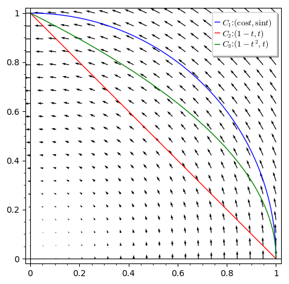
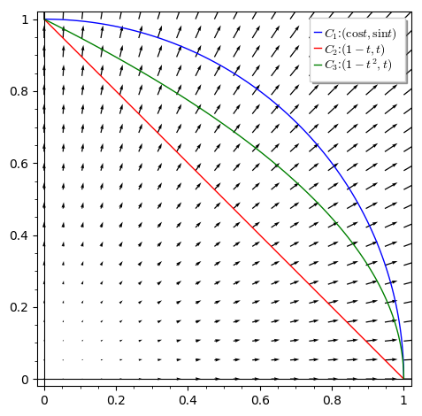
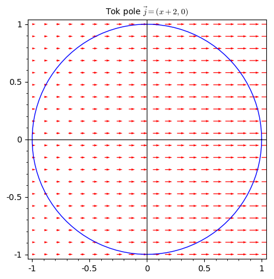
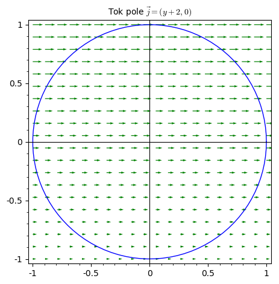

% Křivkové integrály

> Anotace.
>
> * V úvodu si ukážeme vektorové pole, kde výpočet po třech různých křivkách mezi stejnými body, vede ke třem různým výsledkům.
> * Poté zkusíme vypočítat bez bližšího kontextu několik křivkových integrálů pro pro získání určité míry jistoty při práci s tímto integrálem. 
> * Poté se zaměříme tok vektorového pole křivkou a ukážeme si souvislost výsledného toku s grafickým znázorněním situace.
> * Odhadu křivkového integrálu a toku křivkou se budeme věnovat v posledním příkladě. Naučíme se, čeho si všímat, když chceme zjistit, zda je výsledný integrál nebo tok kladný nebo záporný.

# Křivkový integrál druhého druhu po třech různých křivkách

https://youtu.be/i-y8bRLmopE

Vypočtěte $$\int_{C_i} \vec F \mathrm d\vec r$$ pro vektorové pole $$\vec F=-y\vec \imath + x\vec\jmath$$ po třech různých křivkách $C_1$, $C_2$ a $C_3$.
$$\begin{aligned}
  C_1&\colon \vec r=\cos(t)\vec \imath + \sin (t)\vec\jmath, \quad t\in\qty[0,\frac\pi 2]\\
  C_2&\colon \vec r=(1-t)\vec \imath + t\vec\jmath, \quad t\in\qty[0,1]\\
  C_3&\colon \vec r=(1-t^2)\vec \imath + t\vec\jmath, \quad t\in\qty[0,1]
\end{aligned}$$
Tj. počítáme
$$\int_{C_i} -y\,\mathrm dx + x\,\mathrm dy$$
po třech zadaných křivkách $C_1$, $C_2$ a $C_3$.

Vektory budeme pro stručnost zapisovat jako uspořádané dvojice.

**Křivka $C_1$.**
Derivací křivky $\vec r=(\cos(t),\sin(t))$ podle $t$ dostáváme
$$\frac{\mathrm d\vec r}{\mathrm dt}=(-\sin (t),\cos (t)).$$
Rovnice vektorového pole podél křivky má tvar
$$\vec F(\vec r(t))=(-\sin t,\cos t).$$
Skalárním součinem dostáváme
$$\vec F \frac{\mathrm d\vec r}{\mathrm dt}=
(-\sin t,\cos t)\cdot (-\sin (t),\cos (t)) = \sin^2 t+\cos^2 t =1.
$$
Odsud formálně $$\vec F\mathrm d\vec r=1\mathrm dt$$
a integrál má tvar
$$\int_C\vec F\mathrm d\vec r=\int_0^{\frac \pi 2}1\,\mathrm dt=\frac \pi 2,$$
kde poslední Riemannův integrál není nutné počítat, protože integrál z jedničky je délka intervalu, přes který se integruje.

**Křivka $C_2$.**
Derivací křivky $\vec r=(1-t,t)$ podle $t$ dostáváme
$$\frac{\mathrm d\vec r}{\mathrm dt}=(-1,1).$$
Rovnice vektorového pole podél křivky má tvar
$$\vec F(\vec r(t))=(-t,1-t).$$
Skalárním součinem dostáváme
$$\vec F \frac{\mathrm d\vec r}{\mathrm dt}=
(-t,1- t)\cdot (-1,1) = (-t)(-1)+(1-t)\cdot 1 =1.
$$
Odsud formálně $$\vec F\mathrm d\vec r=1\mathrm dt$$
a integrál má tvar
$$\int_C\vec F\mathrm d\vec r=\int_0^{1}1\,\mathrm dt=1,$$
kde ani v tomto případě poslední Riemannův integrál není nutné počítat, protože integrál z jedničky je délka intervalu, přes který se integruje.

**Křivka $C_3$.**
Derivací křivky $\vec r=(1-t^2,t)$ podle $t$ dostáváme
$$\frac{\mathrm d\vec r}{\mathrm dt}=(-2t,1).$$
Rovnice vektorového pole podél křivky má tvar
$$\vec F(\vec r(t))=(-t,1-t^2).$$
Skalárním součinem dostáváme
$$\vec F \frac{\mathrm d\vec r}{\mathrm dt}=
(-t,1- t^2)\cdot (-2t,1) = (-t)(-2t)+(1-t^2)\cdot 1 =t^2+1.
$$
Odsud formálně $$\vec F\mathrm d\vec r=(t^2+1)\mathrm dt$$
a integrál má tvar
$$\int_C\vec F\mathrm d\vec r=\int_0^{1}(t^2+1)\,\mathrm dt=
\qty[\frac 13 t^3 + t]_0^1 = \frac 13 + 1 - 0 =\frac 43.
$$

**Interpretace jako práce, srovnání.**

Všechny křivky jsou z bodu $[1,0]$ do bodu $[0,1]$. Nejblíže k počátku je úsečka $C_2$, nejdále je čvrtkružnice $C_1$, křivka $C_2$ je mezi nimi.

Integrál fyzikálně znamená práci vektorového pole $(-y,x)$ po zadané křivce. Toto vektorové pole míří po kružnicích okolo počátku proti směru hodinových ručiček. Délka vektoru je rovna vzdálenosti od počátku.

Křivka $C_1$ je nejdále od počátku a vektorové pole je na ní nejsilnější. Navíc v každém bodě je síla ve směru křivky a proto se projeví ve výsledném příspěvku bez redukování. Díky tomu můžeme integrál po kružnici počítat stejně jako práci na přímce, tj. součinem délky  křivky $\frac \pi 2$ a velikosti síly $|\vec F|=1$. Po dalších křivkách je síla menší (křivky jdou blíže ke středu) a navíc se neuplatní celá velikost síly, protože síla svírá s křivkou nenulový úhel a při práci se projeví pouze tečná komponenta.

<!--
%https://sagecell.sagemath.org/?z=eJx1kMFuwjAQRO-R8g8rgRRHMW3snH3iB3LgRmgUEkMNxo5sQ5u_r01SlbbhtCPN7hvN3hqDkiFJ40hcem0cqOulH-LIEXZXL1Io2zctRzkGhXrxSlNM8twfODqzQiZzTdh222qLRIqtUH7s4KANCBAKHNn5Deo3yEpg8ejQ4BSj80b_eyVhUlhX91I7tCYYgjhpoXjHNubKMUh-5KqrZbPnkplkua5J1WqpFSA_LThc2UBLl0laxVH2gKMzuHBqWGJ4l8yx6chGZOXwHLJ4jjwaztUstPiB-h_csXHku1MWWPWNt06b-iC47BD6xEOKwY8ckyCGSUwpe9m053Bv3_UHKklW-paN7T2jNo0TmpE7PI4WZTHHHzKK8zFhRb4jJvWriccsxpCsLP5mYHDCSe77bfQZei05LCsfBCc2JfiSX8c_x8Q=&lang=sage&interacts=eJyLjgUAARUAuQ==
-->

**Interpretace jako tok, srovnání.**

Všechny křivky jsou z bodu $[1,0]$ do bodu $[0,1]$. Nejblíže k počátku je úsečka $C_2$, nejdále je čvrtkružnice $C_1$, část paraboly $C_2$ je mezi nimi.

Integrál fyzikálně znamená tok vektorového pole $(x,y)$ křivkou. Toto vektorové pole míří směrem z počátku a zesiluje směrem od počátku, protože délka vektoru je rovna vzdálenosti od počátku.

Proto je hodnota po křivce nejblíže počátku nejmenší atd. Na křivce $C_1$ (kružnice) je tok v každém bodě kolmý ke křivce a stejně velký a proto je celkový tok snadné určit jako součin velikosti vektorového pole na křivce ($|\vec F|=1$) a délky křivky $\frac \pi 2$.

# Křivkový integrál druhého druhu po parabole

https://youtu.be/udS4xy2WIws

Vypočtěte $$\int_{C} \vec F \mathrm d\vec r$$ pro vektorové pole $$\vec F=x^2\vec \imath + (x+y)\vec\jmath$$ po části paraboly
$$\begin{aligned}
  C&\colon \vec r=t\vec \imath + t^2\vec\jmath, \quad t\in\qty[0,1]
\end{aligned}$$
tj. počítáme
$$\int_C x^2\,\mathrm dx + (x+y)\,\mathrm dy$$
po zadané křivce $C$.

Vektory budeme pro stručnost zapisovat jako uspořádané dvojice.

Derivací křivky $\vec r=(t,t^2)$ podle $t$ dostáváme
$$\frac{\mathrm d\vec r}{\mathrm dt}=(1,2t).$$
Rovnice vektorového pole podél křivky má tvar
$$\vec F(\vec r(t))=(t^2,t+t^2).$$
Skalárním součinem dostáváme
$$\vec F \frac{\mathrm d\vec r}{\mathrm dt}=
(1,2t)\cdot (t^2,t+t^2) = 1\cdot t^2+2t\cdot(t+t^2)=3t^2+2t^3.
$$
Odsud formálně $$\vec F\mathrm d\vec r=(3t^2+2t^3)\mathrm dt$$
a integrál má tvar
$$\int_C\vec F\mathrm d\vec r=\int_0^{1}(3t^2+2t^3)\,\mathrm dt
=\qty[t^3+\frac 12 t^4]_0^1=1+\frac 12 - 0 = \frac 32.$$

# Křivkový integrál druhého druhu po kubické parabole

Vypočtěte $$\int_{C} \vec F \mathrm d\vec r$$ pro vektorové pole $$\vec F=2y\vec \imath + x^2y\vec\jmath$$ po části kubické paraboly
$$\begin{aligned}
  C&\colon \vec r=t\vec \imath + t^3\vec\jmath, \quad t\in\qty[0,1],
\end{aligned}$$
tj. počítáme
$$\int_C 2y\,\mathrm dx + x^2y\,\mathrm dy$$
po zadané křivce $C$.

Vektory budeme pro stručnost zapisovat jako uspořádané dvojice.

Derivací křivky $\vec r=(t,t^3)$ podle $t$ dostáváme
$$\frac{\mathrm d\vec r}{\mathrm dt}=(1,3t^2).$$
Rovnice vektorového pole podél křivky má tvar
$$\vec F(\vec r(t))=(2t^3,t^2t^3)=(2t^3,t^5).$$
Skalárním součinem dostáváme
$$\vec F \frac{\mathrm d\vec r}{\mathrm dt}=
(1,3t^2)\cdot (2t^3,t^5) = 1\cdot 2t^3+3t^2\cdot t^5=2t^3+3t^7.
$$
Odsud formálně $$\vec F\mathrm d\vec r=(2t^3+3t^7)\mathrm dt$$
a integrál má tvar
$$\int_C\vec F\mathrm d\vec r=\int_0^{1}(2t^3+3t^7)\,\mathrm dt
=\qty[\frac 12 t^4 + \frac 38 t^8]_0^1=\frac 12 +\frac 38 - 0 = \frac 78.$$

ww:problems/krivkovy_integral/09.pg

ww:problems/krivkovy_integral/10.pg

# Tok vektorového pole uzavřenou křivkou

https://youtu.be/nqbi-7hwcD4

Vypočtěte tok vektorového pole $$\vec \Phi_1=(x+2)\vec\imath$$ jednotkovou kružnicí se středem v počátku orientovanou proti směru hodinových ručiček, tj. $$C\colon \vec r=\cos(t)\vec \imath+\sin(t)\vec\jmath, \quad t\in[0,2\pi].$$

**Návod:** Platí $$\int_0^{2\pi}\sin^2 t\,\mathrm dt=\int_0^{2\pi}\cos^2 t\,\mathrm dt= \pi$$
a tento integrál je možno najít například grafickou cestou.

Vektorové pole teče směrem doprava a směrem doprava i zesiluje. Dá se čekat, že tok ven pravou polovinou kružnice bude větší než tok dovnitř levou polovinou kružnice a celkový tok bude nenulový.

Vektorové pole je $$\vec \Phi_1=(x+2,0)$$ a pro výpočet toku musíme integrovat křivkovým integrálem druhého druhu vektorové pole $$\vec F=(0,x+2).$$
Vskutku, tok vektorového pole zadaného v komponentách $\Phi_1=(P,Q)$ je vyjádřen integrálem druhého druhu vektorového pole $\vec F=(-Q,P)$ a v našem případě je $P=x+2$ a $Q=0$. Derivací rovnice křivky obdržíme
$$\frac{\mathrm d\vec r}{\mathrm dt}=(-\sin (t),\cos (t)).$$
Rovnice vektorového pole $\vec F$ podél křivky $C$ má tvar
$$\vec F(\vec r(t))=(0,2+\cos t).$$
Skalárním součinem dostáváme
$$\vec F \frac{\mathrm d\vec r}{\mathrm dt}=
(-\sin t,\cos t)\cdot (0,2+\cos (t)) = 2\cos t+\cos^2 t .
$$
Odsud formálně $$\vec F\mathrm d\vec r=(2\cos t+\cos^2 t)\mathrm dt$$
a integrál má tvar
$$\oint_C\vec F\mathrm d\vec r=\int_0^{2\pi }(2\cos t+\cos^2 t)\,\mathrm dt= \pi ,$$
kde poslední Riemannův integrál není nutné počítat, protože integrál z první části je nulový díky geometrické interpretaci integrálu a periodicitě funkce $\cos t$ a integrál z druhého sčítance byl součástí zadání.

# Tok vektorového pole uzavřenou křivkou II

Vypočtěte tok vektorového pole $$\vec \Phi_2=(y+2)\vec\imath$$ jednotkovou kružnicí se středem v počátku orientovanou proti směru hodinových ručiček, tj. $$C\colon \vec r=\cos(t)\vec \imath+\sin(t)\vec\jmath, \quad t\in[0,2\pi].$$

**Návod:** Platí $$\int_0^{2\pi}\sin t\cos t\,\mathrm dt=0.$$

Vektorové pole teče směrem doprava. Kromě toho zesiluje směrem nahoru. Dá se čekat, že tok ven pravou polovinou kružnice bude v každé výšce stejný jako tok dovnitř levou polovinou kružnice a celkový tok bude nulový.

Vektorové pole je $$\vec \Phi_2=(y+2,0)$$ a pro výpočet toku musíme integrovat křivkovým integrálem druhého druhu vektorové pole $$\vec F=(0,y+2).$$
Vskutku, tok vektorového pole zadaného v komponentách $\Phi_2=(P,Q)$ je vyjádřen integrálem druhého druhu vektorového pole $\vec F=(-Q,P)$ a v našem případě je $P=y+2$ a $Q=0$. Derivací rovnice křivky obdržíme
$$\frac{\mathrm d\vec r}{\mathrm dt}=(-\sin (t),\cos (t)).$$
Rovnice vektorového pole $\vec F$ podél křivky $C$ má tvar
$$\vec F(\vec r(t))=(0,2+\sin t).$$
Skalárním součinem dostáváme
$$\vec F \frac{\mathrm d\vec r}{\mathrm dt}=
(-\sin t,\cos t)\cdot (0,2+\sin (t)) = 2\cos t+\cos t \sin t.
$$
Odsud formálně $$\vec F\mathrm d\vec r=(2\cos t+\cos t\sin t)\mathrm dt$$
a integrál má tvar
$$\oint_C\vec F\mathrm d\vec r=\int_0^{2\pi }(2\cos t+\cos t\sin t)\,\mathrm dt.$$

Integrál z prvního sčítance můžeme vypočítat pomocí primitivní funkce
$$\int_0^{2\pi} 2\cos x\,\mathrm dx=\qty[2\sin x]_0^{2\pi}=2\sin(2\pi)-2\sin 0 =0$$ a integrál z druhého sčítance je nulový, proto je nulový i celý integrál.
$$\int_C\vec F\mathrm d\vec r=0$$

# Křivkový integrál a tok graficky

https://youtu.be/h_LWsGTTUl4

Vyřešte příklady na následujících odkazech. Řiďte se popsaným pravidlem, nebo pravidlem uvedeným ve videokomentáři.

## Křivkový integrál

* Pokud křivka a vektorové pole svírají ostrý úhel, je příspěvek k celkové hodnotě integrálu kladný. Pokud jsou přesně stejným směrem (nulový úhel) je příspěvek roven součinu.
* Pokud křivka a vektorové pole svírají tupý úhel, je příspěvek k celkové hodnotě integrálu záporný. Pokud jsou přesně opačným směrem (úhel $180^\circ$) je příspěvek roven záporně vzatém součinu.
* Intenzivnější vektorové pole nebo delší křivka produkují větší numerickou hodnotu integrálu (více kladnou nebo více zápornou, podle znaménka). Pole více kolmo na křivku produkuje menší numerickou hodnotu integrálu (blíže k nule). 

ww:problems/krivkovy_integral/30_01.pg

ww:problems/krivkovy_integral/30_02.pg

ww:problems/krivkovy_integral/30_03.pg

ww:problems/krivkovy_integral/30_04.pg

## Tok

* Pravidla pro souvislost toku s intenzitou pole a délkou křivky jsou analogická jako u křivkového integrálu (delší křivka a intenzivnější vektorové pole způsobují větší tok).
* Pokud se díváme ve směru křivky a pole přestupuje přes křivku zleva doprava, je tok kladný, v opačném případě záporný.

ww:problems/krivkovy_integral/30_08.pg

