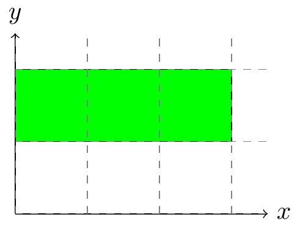
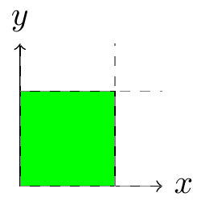
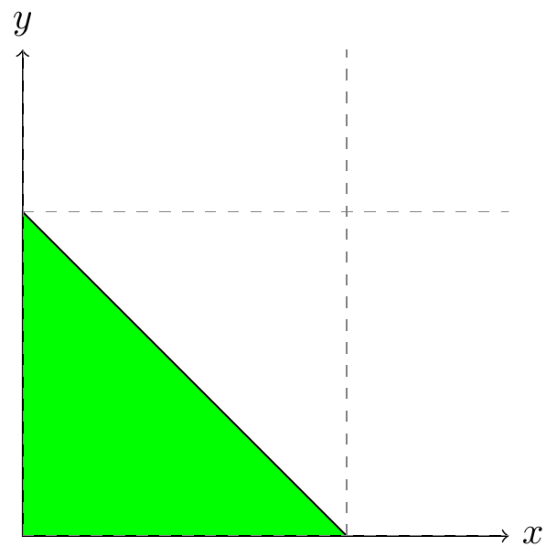
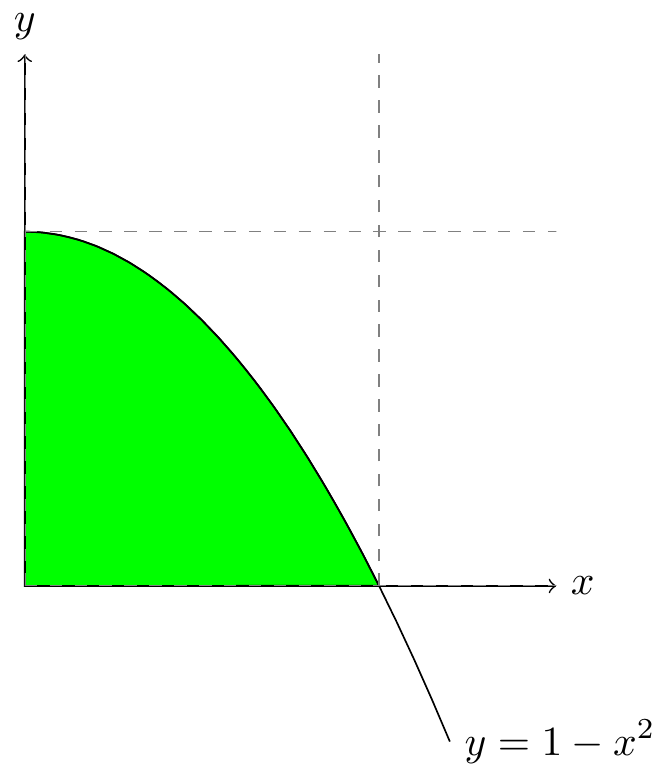
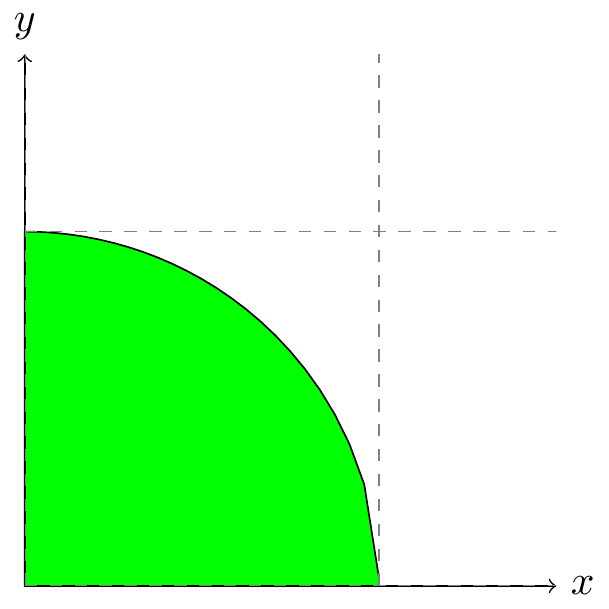

% Dvojné integrály

> Anotace.
>
> * V úvodu si osaháme integrační metody. Nejprve pro obdélník. Tam se dá často (ujistěte se, že perfektně poznáte kdy) úloha na výpočet dvojného integrálu redukovat na nezávislý výpočet dvou jednoduchých integrálů, které se mezi sebou vynásobí.
> * Další příklady jsou věnovány integraci na jiných než obdélníkových množinách. Zde je nutné dvojný integrál převést na dvojnásobný, tj. integrál z integrálu.
> * Poslední dva příklady jsou věnovány integraci v jiných než kartézských souřadnicích. Suveréně nejčastěji se vedle kartézských souřadnic používají souřadnice polární a proto se zaměříme právě na ně. 

# Integrál přes obdélník

https://youtu.be/oFbhyqFRjmQ

Vypočtěte dvojný integrál $$\iint_\Omega xy^2\mathrm dx\mathrm dy$$
přes obdélník $$
\begin{gathered}
  0\leq x\leq 3\\1\leq y\leq 2.
\end{gathered}
$$

$$
\begin{aligned}
  \iint_\Omega xy^2\mathrm dx\mathrm dy
  &=\int_0^3x\,\mathrm dx \int _1^2 y^2 \,\mathrm dy
\\&=\left[\frac {x^2}2\right]_0^3 \times \left[\frac 13 y^3 \right]_1^2
\\&=\left[\frac 92-0\right]\times \left [\frac 13 2^3 - \frac 13 \right]
=\frac 92 \times \frac 73 = \frac {21}2
\end{aligned}
$$

# Kvadratický moment pro obdélník

https://youtu.be/ykJy7r7Ena4

Vypočtěte integrál
$$
\begin{aligned}
 \iint_\Omega y^2\,\mathrm dx \mathrm dy,\\
\end{aligned}
$$
přes obdélník se stranami podél os, se středem v počátku a délkou stran $a$ a $b$, tj. přes množinu $\Omega$ danou nerovnostmi
$$
\begin{aligned}
  -\frac a2\leq &x\leq \frac a2,\\
  -\frac b2\leq &y \leq \frac b2.
\end{aligned}
$$

$$
\begin{aligned}
  \iint_\Omega y^2\,\mathrm dx \mathrm dy
  = \int_{-\frac a2}^{\frac a2} \,\mathrm dx \times \int_{-\frac b2}^{\frac b2}y^2\,\mathrm dy=a\times \left[\frac 13 y^3\right]_{-\frac b2}^{\frac b2}=a\times \left(\frac 13 \times \frac {b^3}{8} + \frac 13 \times \frac {b^3}{8}\right)=
  \frac 1{12}ab^3
\end{aligned}
$$

# Integrál závislý na parametru

https://youtu.be/GhdGvrx_pks

Vypočtěte dvojný integrál $$I_n=\iint_\Omega y^n\mathrm dx\mathrm dy$$
přes jednotkový čtverec $$
\begin{gathered}
  0\leq x\leq 1\\0\leq y\leq 1
\end{gathered}
$$
v závislosti na parametru $n\geq 0$.

$$
\begin{aligned}
  \iint_\Omega y^n\mathrm dx\mathrm dy
  &=\int_0^1\,\mathrm dx \int _0^1 y^n \,\mathrm dy
  =1 \times \left[\frac 1{n+1} y^{n+1} \right]_0^1
  =\frac 1{n+1}
\end{aligned}$$

Správnost můžeme ověřit pomocí vzorců pro obsah  $$I_0=1$$ a polohu težiště $$\frac{I_1}{I_0}=\frac 12,$$
což porovnáme s očekávanými výsledky. Dalším využitím je působiště tlakové síly na přehradu (viz přednáška), které je při orientaci osy $y$ od hladiny směrem dolů v místě
$$\frac{I_2}{I_1}=\frac {\frac 13}{\frac 12}=\frac 23,$$
tj. ve dvou třetinách hloubky.

# Integrál přes trojúhelník

https://youtu.be/w0iqtpQvhAE

Vypočtěte integrál
$$  \iint_\Omega xy^2\,\mathrm dx \mathrm dy
$$
přes trojúhelník $\Omega$ s vrcholy v bodech $(0,0)$, $(1,0)$ a $(0,1)$.

Rovnice přímky, ve které leží přepona trojúhelníka, je
$$y=1-x$$ a trojúhelník tedy je možno zapsat soustavou nerovností

$$
\begin{aligned}
  0\leq &x\leq 1,\\
  0\leq &y \leq 1-x.
\end{aligned}
$$

Použitím těchto nerovností můžeme dvojný integrál transformovat na dvojnásobný a vypočítat.
$$
\begin{aligned}
  \iint_\Omega xy^2\,\mathrm dx\mathrm dy
  &=\int_0^1 \int_0^{1-x} xy^2\,\mathrm dy\mathrm dx
  =\int_0^1 \left[\frac 13 xy^3\right]_0^{1-x}\,\mathrm dx
  =\int_0^1 \frac 13x(1-x)^3\,\mathrm dx
  \\&=\frac 13 \int_0^1 x-3x^2+3x^3-x^4\,\mathrm dx
  =\frac 13\left[\frac 12 x^2 - x^3 +\frac 34 x^4-\frac 15 x^5\right]_0^1
  \\&=\frac 13\left[\frac 12 -1 +\frac 34 -\frac 15\right] =\frac 1{60}
\end{aligned}
$$

 

# Integrál pod parabolou

https://youtu.be/Sur6lhdR3ts

Vypočtěte integrály
$$
\begin{aligned}
  I_1&=\iint_\Omega x\,\mathrm dx \mathrm dy,\\
  I_2&=\iint_\Omega y\,\mathrm dx \mathrm dy,\\
  I_3&=\iint_\Omega \,\mathrm dx \mathrm dy,\\
\end{aligned}
$$
přes množinu $\Omega$ danou nerovnostmi
$$
\begin{aligned}
  0\leq &x\leq 1,\\
  0\leq &y \leq 1-x^2.
\end{aligned}
$$
Určete obsah a polohu těžiště této množiny.

$$
\begin{aligned}
  \iint_\Omega x\,\mathrm dx\mathrm dy
  &=\int_0^1 \int_0^{1-x^2} x\,\mathrm dy\mathrm dx
  =\int_0^1 \left[xy\right]_0^{1-x^2}\,\mathrm dx
  =\int_0^1 x(1-x^2)\,\mathrm dx
  =\int_0^1 x-x^3\,\mathrm dx
  \\&=\left[\frac 12 x^2 - \frac 14 x^4\right]_0^1=\frac 12-\frac 14 =\frac 14
\end{aligned}
$$
$$
\begin{aligned}
  \iint_\Omega y\,\mathrm dx\mathrm dy
  &=\int_0^1 \int_0^{1-x^2} y\,\mathrm dy\mathrm dx
  =\int_0^1 \left[\frac 12 y^2\right]_0^{1-x^2}\,\mathrm dx
  =\int_0^1 \frac 12 (1-x^2)^2\,\mathrm dx
  \\&=\frac 12 \int_0^1 1-2x^2+x^4\,\mathrm dx
  =\frac 12 \left[x-\frac 23 x^3 + \frac 15 x^5\right]_0^1=\frac 12\left[1-\frac 23 + \frac 15\right]=\frac 4{15}
\end{aligned}
$$

$$
\begin{aligned}
  \iint_\Omega \,\mathrm dx\mathrm dy
  &=\int_0^1 \int_0^{1-x^2} \,\mathrm dy\mathrm dx
%  =\int_0^1 \left[y\right]_0^{1-x^2}\,\mathrm dx
  =\int_0^1 1-x^2\,\mathrm dx
  =\left[x - \frac 13 x^3\right]_0^1=1-\frac 13 =\frac 23
\end{aligned}
$$

Obsah je $\frac 23$ a souřadnice těžiště jsou $\left[\frac 38,\frac 4{10}\right]$. Toto je možné porovnat s obsahem a souřadnicemi těžiště trojúhelníka, který vznikne nahrazením paraboly přímkou a tento trojúhelník má obsah $\frac 12$ a souřadnice těžiště $\left[\frac 13,\frac 13\right].$

 

# Integrál přes čtvrtkruh

https://youtu.be/_YT3FDpfZsQ

Vypočtěte integrály
$$
\begin{aligned}
  I_1&=\iint_\Omega x\,\mathrm dx \mathrm dy,\\
  I_2&=\iint_\Omega y\,\mathrm dx \mathrm dy,\\
  I_3&=\iint_\Omega \,\mathrm dx \mathrm dy,\\
\end{aligned}
$$
přes čtvrtkruh na obrázku (čtvrtina jednotkového kruhu v prvním kvadrantu).
Určete obsah a polohu těžiště tohoto čtvrtkruhu.

V polárních souřadnicích daných rovnicemi $$
\begin{aligned}
  x&=r\cos\varphi\\
  y&=r\sin\varphi
\end{aligned}
$$
má čtvrtkruh vyjádření $0\leq r\leq 1$, $0\leq \varphi\leq \frac \pi2$.
$$
\begin{aligned}
  \iint_\Omega x\,\mathrm dx\mathrm dy
  &=\int_0^1 \int_0^{\frac \pi2} r\cos\varphi \times r\,\mathrm d\varphi\mathrm dr
  =\int_0^1 r^2 \,\mathrm dr \times \int_0^{\frac \pi2}\cos\varphi \mathrm d \varphi
  \\&=\left[\frac 13 r^3\right]_0^1\times \left[\sin\varphi\right]_0^{\frac \pi2}=\frac 13 \times 1=\frac 13
\end{aligned}
$$$$
\begin{aligned}
  \iint_\Omega y\,\mathrm dx\mathrm dy
  &=\int_0^1 \int_0^{\frac \pi2} r\sin\varphi \times r\,\mathrm d\varphi\mathrm dr
  =\int_0^1 r^2 \,\mathrm dr \times \int_0^{\frac \pi2}\sin\varphi \mathrm d \varphi
  \\&=\left[\frac 13 r^3\right]_0^1\times \left[-\cos\varphi\right]_0^{\frac \pi2}=\frac 13 \times 1=\frac 13
\end{aligned}
$$
$$
\begin{aligned}
  \iint_\Omega \,\mathrm dx\mathrm dy
  &=\int_0^1 \int_0^{\frac \pi2} 1 \times r\,\mathrm d\varphi\mathrm dr
  =\int_0^1 r \,\mathrm dr \times \int_0^{\frac \pi2}\mathrm d \varphi
  \\&=\left[\frac 12 r^2\right]_0^1\times {\frac \pi2}=\frac 12 \times \frac \pi 2=\frac \pi 4
\end{aligned}
$$

Obsah je $\frac \pi 4$, což odpovídá čtvtině vzorce pro obsah jednotkového kruhu. Souřadnice težište jsou obě stejné, což odpovídá symetrii množiny.  Tyto souřadnice leží v bodě
$$\frac {4}{3\pi}\approx 0.42,$$
což odpovídá tomu, že těžište je posunuto doprava nahoru ve srovnání těžištěm trojúhelníka, který by vznikl nahrazením oblouku úsečkou.

# Kvadratický moment kruhu

https://youtu.be/OPqy2AU-SKU

Vypočtěte kvadratický moment kruhu o poloměru $R$ vzhledem k ose procházející středem.

Vypočteme kvadratický moment kruhu daného v polárních souřadnicích nerovnicemi
$$
\begin{aligned}
  0&\leq r\leq R,\\
  0&\leq \varphi\leq 2\pi.  
\end{aligned}
$$

Přímým výpočtem dostáváme
$$
\begin{aligned}
  \iint_{\Omega}y^2\,\mathrm dx\mathrm dy&=
  \int_{0}^R \int_0^{2\pi} r^2\sin^2\varphi \times r\,\mathrm d\varphi \mathrm dr
  =\int_{0}^R  r^3  \mathrm dr \int_0^{2\pi}\sin^2\varphi \,\mathrm d\varphi
  =\left[\frac {r^4}{4}\right]_0^R \pi
  =\frac {\pi}{4} R^4,
\end{aligned}
$$
kde při výpočtu integrálu přes proměnnou $\varphi$ využijeme nápovědu, kterou jsme měli již v sadě úloh s křivkovým integrálem.

Že je výsledkem veličina úměrná čtvrté mocnině poloměru je zřejmé i z rozměrové analýzy (resp. z Buckinghamova $\Pi$ teorému), uvedeným výpočtem však vidíme i konstantu úměrnosti.

To že kvadratický moment roste se čtvrtou mocninou poloměru značí, že snížení průměru tyče na polovinu vede k redukci tuhosti na přibližně $(0.5)^4$ tj. na šest procent. Devadesát šest procent tuhosti je v materiálu, který se při tomto odstraní. Proto jsou trubky při stejné spotřebě materiálu odolnější vůči ohnutí než tyče. Proto mají listy rostlin nebo listy vrtulí větrných elektráren materiál odpovídající za tuhost na povrchu. Proto máme kosti duté.

<!--
%

%## Jacobiho matice pro polární souřadnice

%  Najděte Jacobiho matici a její determinant pro transformaci 
% \begin{equation*}
%   \begin{aligned}
%     x&=r\cos \varphi\\
%     y&=r\sin \varphi
%   \end{aligned}
% \end{equation*}
% mezi polárními a kartézskými souřadnicemi.

-->

