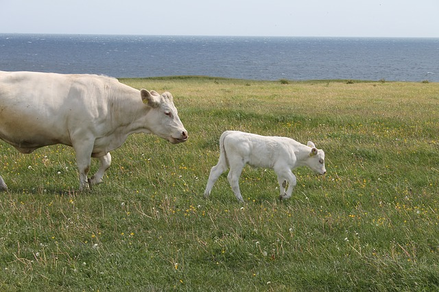

% Diferenciální rovnice

> Anotace.
>
> * V úvodním příkladu si natrénujeme nejdůležitější schopnost související s diferenciálními rovnicemi: schopnost přepsat slovní formulaci modelu do kvantitativní formy, která umožňuje detailní kvantitativní analýzu. Schopnost sestavit diferenciální rovnici podle slovního zadání.
> * V dalších úlohách se budeme zabývat problematikou existence a jednoznačnosti řešení. 
> * Nakonec se naučíme řešit diferenciální rovnice se separovanými proměnnými dvojím integrováním.

# Jednoduché modely založené na diferenciálních rovnicích

https://youtu.be/QckWe55HikI

## Model růstu úměrného velikosti chybějícího množství

Mnoho
živočichů roste tak, že mohou dorůstat jisté maximální délky a
rychlost jejich růstu je úměrná délce, která jim do této maximální
délky chybí (tj. kolik ještě musí do této maximální délky
dorůst). Sestavte matematický model popisující takovýto růst
(von Bertalanffy growth model).

_Jakmile vidíme, že v zadání figuruje rychlost změny veličiny,
  která nás zajímá, je jasné, že kvantitativní model bude obsahovat
  derivaci. Zatím se učíme model zapsat, později ho budeme umět i vyřešit._

Je-li $L$ délka a $L_{\max}$ maximální délka, potom do maximální délky chybí  $L_{\max}-L$ a model má tvar
$$\dv {L}{t}=k (L_{\max}-L).$$
Konstanta $k$ vyjadřuje rychlost s jakou roste délka při jednotkovém rozdílu mezi aktuální délkou a délkou maximální.

## Kontaminace a čištění

Znečišťující látky se v kontaminované oblasti rozkládají tak, že za den se samovolně rozloží 
$8\%$ aktuálního znečištění. Kromě toho pracovníci odstraňují látky rychlostí $30$
galonů denně. Vyjádřete tento proces kvantitativně pomocí vhodného
modelu.

_Tento příklad opět zmiňuje rychlost změny, tj. derivaci. Tentokrát se na změně podílejí dva procesy a jejich účinek se sčítá. Příklad navíc připomíná, jak se pracuje se změnou vyjádřenou procenty. Toto je používané například při úročení spojitým úrokem. Pokud pokles změníme na růst, tj. pokud změníme
  znaménka u derivace, máme okamžitě model růstu financí na účtu, na kterém se pravidelně připisuje úrok a k tomu se přidává fixní úložka._

 Je-li $y$ znečištění v galonech a $t$ čas ve dnech, má model tvar
$$\dv {y}{t}=-0.08y-30.$$

<!--
% \obrazek{lov.jpg}
% ## Logistická rovnice: model využívání přírodních zdrojů
% Při modelování růstu populace o velikosti $x(t)$ často pracujeme s populací žijící v prostředí s omezenou úživností (nosnou kapacitou). Často používáme model
% $$\frac{\mathrm d x}{\mathrm dt}=rx\left(1-\frac xK\right),$$
% kde $r$ a $K$ jsou parametry modelu (reálné konstanty).  Nakreslete
% graf funkce $f(x)=rx\left(1-\frac xK\right)$ a ověřte, že pro velká
% $x$ je $f(x)$ záporné a velikost populace proto klesá. Pokud populaci
% lovíme konstantní rychlostí, sníží se pravá strana o konstantu, kterou
% označíme $h$. Ukažte, že pro intenzivní lov bude pravá strana rovnice
% pořád záporná a intenzivní lov tak způsobí vyhubení populace. Dá se
% najít kritická hodnota lovu oddělující vyhynutí populace a její
% trvalé přežívání?

% \textit{Toto je asi nejdůležitější rovnice pro modelování biologických jevů. Používá se při modelování vývoje obnovitelných zdrojů a bývá modifikována pro konkrétní případy podle toho, jak populace interaguje s okolím.}

% 

% Funkce $f(x)=rx\left(1-\frac xK\right)$ je kvadratická funkce s nulovými body $x=0$ a $x=K$, vrcholem uprostřed mezi nulovými body (tj. pro $x=\frac K2$) a parabola je otočená vrcholem nahoru. Proto je napravo od $x=K$ záporná. To odpovídá tomu, že populace s velikostí přesahující nosnou kapacitu v dlouhodobém horizontu vymírá.

% Funkce $f_h(x)=rx\left(1-\frac xK\right)-h$ vznikne posunutím funkce $f(x)=rx\left(1-\frac xK\right)$ o $h$ dolů. Pokud posuneme hodně, dostane se celá parabola pod osu $x$ a funkce bude pořád záporná. Kritická hodnota je v situaci, kdy mizí možnost, že $f_h(x)$ má body kde je kladná a populace se může rozvíjet. To nastane,  pokud se vrchol paraboly dostane na osu $x$, tj. $h$ je rovno funkční hodnotě funkce $f(x)$ v bodě $x=\frac K2.$
% 

-->

## Populace jelenů

Populace jelenů v národním parku přibývá rychlostí 10\% za
rok. Správa parku každý rok odebere 50 jedinců. Napište
matematický model pro velikost populace jelenů v tomto parku.

Je-li $x$ velikost populace jelenů, platí
$$ \dv {x}{t}=0.10 x-50, $$ kde $t$ je čas v letech.

## Hrubý model chřipkové epidemie

Rychlost s jakou roste počet nemocných chřipkou je úměrný současně
počtu nemocných a počtu zdravých jedinců. Sestavte model takového
šíření chřipky.

_Toto je současně model popisující šíření informace v populaci, stačí si místo chřipky představit nějakou informaci předávanou mezi lidmi (sociální difuze)._

Je-li $M$ velikost populace a $y$ počet nemocných, je v populaci $M-y$ zdravých a model má tvar
$$\dv {y}{t}=ky(M-y).$$

## Ropná skvrna

Kruhová ropná skvrna na hladině se rozšiřuje tak, že její poloměr jako
funkce času roste rychlostí, která je nepřímo úměrná druhé mocnině
poloměru. Vyjádřete proces kvantitativně pomocí derivací.

Je-li $r$ poloměr, je $r^2$ druhá mocnina a protože se jedná o nepřímou úměrnost, platí
$$\dv {r}{t}=\frac{k}{r^2}.$$ Konstanta $k$ vyjadřuje rychlost s jakou roste ropná skvrna ve fázi, kdy má jednotkový poloměr $r$.

## Model učení

Rychlost učení (tj. časová změna objemu osvojené látky nebo procento z
maximální manuální zručnosti) je úměrná objemu dosud nenaučené
látky. Vyjádřete proces kvantitativně pomocí derivací.

Je-li $L$ objem naučené látky a $L_{\max}$ maximální objem látky kterou je možné se naučit, je objem dosud nenaučené látky $L_{\max}-L$ a model má tvar
$$\dv {L}{t}=k (L_{\max}-L).$$

## Tloušťka ledu

Takzvaný Stefanův zákon (J. Stefan, Uber die Theorie der Eisbildung, insbesondere uber die Eisbildung im Polarmeere, 1891) vyjadřuje že tloušťka ledu na hladině moře roste ve
stabilních podmínkách rychlostí nepřímo úměrnou této tloušťce. Zapište
tento fakt pomocí vhodného matematického modelu a najděte řešení
vzniklé diferenciální rovnice.

Je-li $h$ tloušťka ledu, je matematickým vyjádřením situace model
$$\frac{\mathrm dh}{\mathrm dt}=\frac kh,$$ kde $k$ je konstanta úměrnosti a vyjadřuje rychlost, s jakou roste tloušťka ledu v okamžiku, kdy je tato tloušťka rovna jedné. Postupným řešením získáváme následující vztahy.
$$
\begin{aligned}
\frac{\mathrm dh}{\mathrm dt}&=\frac kh\\
h\,\mathrm dh&=k\, \mathrm dt\\
\int h\,\mathrm dh&=\int k\, \mathrm dt\\
\frac {h^2}{2}&=kt+C
\end{aligned}
$$

 

# Model vypouštění nádrže

https://youtu.be/K08zq2cC0DM

Z fyziky je známo, že rychlost s jakou
vytéká tekutina otvorem u dna nádoby je úměrná odmocnině výšky hladiny
(protože se mění potenciální energie úměrná výšce na kinetickou
energii úměrnou druhé mocnině rychlosti). Proto je i rychlost s jakou
se zmenšuje objem vody v nádrži úměrná odmocnině výšky
hladiny.

Ukažte, že matematickým popisem procesu je diferenciální rovnice.
Napište rovnici pro výšku hladiny vody v nádrži jako funkci času.
Uvažujte tři případy:
nádrž _cylindrického tvaru_ (válec postavený na podstavu),
nádrž ve tvaru
_kvádru_
a nádrž ve tvaru _kužele_ otočeného vrcholem dolů (trychtýř). 

_V tomto příkladě vystupuje derivace jak rychlost, ale po přepisu zadání do modelu máme v rovnici dvě různé veličiny, které se mění: objem vody a výšku hladiny. Musíme ještě najít a použít vztah mezi rychlostmi změn těchto veličin. Fyzikální zákon je formulován pro derivaci objemu a nás zajímá derivace výšky._

Buď $V$ objem vody a $h$ výška hladiny od dna.
Podle zadání ve všech případech platí $$\frac {\mathrm dV}{\mathrm dt}=-k_1\sqrt h$$ a musíme derivaci $\frac {\mathrm dV}{\mathrm dt}$ vyjádřit pomocí $\frac {\mathrm dh}{\mathrm dt}$.

Pro cylindr, kvádr nebo jakoukoliv nádrž se svislými stěnami je objem úměrný výšce hladiny, $V=k_2 h$, a proto $\frac {\mathrm dV}{\mathrm dt}=k_2\frac {\mathrm dh}{\mathrm dt}$. Odsud
$$k_2\frac {\mathrm dh}{\mathrm dt}=\frac {\mathrm dV}{\mathrm dt}=-k_1\sqrt h,$$
tj.
$$\frac {\mathrm dh}{\mathrm dt}=-\frac{k_1}{k_2}\sqrt h$$
a pro $k=\frac{k_1}{k_2}$ má model tvar
$$\frac {\mathrm dh}{\mathrm dt}=-k\sqrt h.$$

Pro kužel platí $V=k_3h^3$ (díky podobnosti je objem přímo úměrný třetí mocnině libovolného délkového parametru) a proto
$\frac {\mathrm dV}{\mathrm dt}=k_3 \times 3h^2 \frac {\mathrm dh}{\mathrm dt}$.
Odsud
$$3k_3 h^2 \frac {\mathrm dh}{\mathrm dt}=\frac {\mathrm dV}{\mathrm dt}=-k_1\sqrt h,$$
tj. 
$$\frac {\mathrm dh}{\mathrm dt}=-\frac{k_1}{3k_3}h^{-3/2}$$
a po přeznačení konstanty má model pro kuželovou nádrž tvar
$$\frac {\mathrm dh}{\mathrm dt}=-kh^{-3/2}.$$

# Problematika jednoznačnosti v modelu vypouštění nádrže

https://youtu.be/FAatA34JeEo

Dříve jsme odvodili rovnici
$$\dv {h}{t}=-k\sqrt h$$
popisující úbytek hladiny vody v nádrži tvaru kvádru, ze které vypouštíme vodu.

1. Zkontrolujte, že pro $h>0$ má každá počáteční úloha jediné řešení. Interpretujte tento výsledek prakticky.
1. Pro $h=0$ by řešení nemuselo být určeno jednoznačně. A opravdu
  není. Řešením je například $h(t)=0$ nebo $$h(t)=
  \begin{cases}
    \frac 14 k^2 t^2 & t<0\\
    0 & t\geq 0.
  \end{cases}
  $$
Zkontrolujte dosazením (pozor: pro $t<0$ platí $\sqrt {t^2}=|t|=-t$) a rozmyslete, jestli nejednoznačnost je jenom matematický trik, nebo jestli má
 fyzikální interpretaci.

1. Nabídneme dvě  varianty, pro argumentaci je možno použít kteroukoliv z nich. 
    * _Podle obecné věty o jednoznačnosti:_ Stačí ověřit, že pravá strana má ohraničenou parciální derivaci podle $h$. Protože platí
    $$\frac{\partial }{\partial h}(k\sqrt h)=k\frac 12
    h^{-1/2}=\frac{k}{2\sqrt h}$$ a tato derivace je definovaná a
    ohraničená v nějakém okolí libovolného bodu splňujícího $h>0$.
    Podle věty o existenci a jednoznačnosti řešení obecné
    diferenciální rovnice má počáteční úloha právě jedno řešení.
    * _Podle věty o jednoznačnosti pro rovnici se separovanými proměnnými:_ Stačí ověřit,
    že část závislá na $h$ je nenulová. Toto jistě platí, protože pro
    $h>0$ je $\sqrt{h}\neq 0$.

    Pokud je tedy v nádrži nějaká voda, je jednoznačně dáno,
    jak bude vytékat a je možné vypočítat, jaká bude v libovolném
    okamžiku hladina.
1. Pro $h=\frac 14 k^2 t^2$ a $t<0$ dostáváme $$
    \begin{aligned}
      \dv {h}{t}&=\frac 14 k^2 \cdot 2t = \frac 12 k^2 t\\
      -k\sqrt h&=-k\sqrt{\frac 14 k^2 t^2} = - k \frac 12 |k| \cdot |t| =
      - k \frac 12 k (-t) = \frac 12 k^2 t
    \end{aligned}
    $$ a obě strany rovnice jsou stejné. Pro $h=0$ je dosazení triviální. Je-li $h(t_0)=0$, může to být proto, že voda v čase $t_0$ právě vytekla, nebo proto, že vytekla před hodinou nebo proto, že v nádrži nikdy voda nebyla. Proto je nejednoznačnost přirozená. Například $h(t)=0$ je řešení odpovídající tomu, že voda v nádrži nikdy nebyla. Funkce $h(t)=\frac 14 k^2t^2$ pro $t<0$ odpovídá tomu, že pro $t<0$ v nádrži voda byla a vytekla v čase $t=0$.

# Řešení ODE a IVP 

https://youtu.be/XUKvuqSgA6U

1. $\frac{\mathrm dy}{\mathrm dx}=xy^2$
1. $\frac{\mathrm dy}{\mathrm dt}=te^y$
1. $\frac{\mathrm dy}{\mathrm dx}=x\sqrt y$
1. $\frac{\mathrm dy}{\mathrm dx}=x\sqrt y,\ \ y(0)=1$
1. $\frac{\mathrm dr}{\mathrm dt}=kr^3,\ \ r(0)=r_0>0$
1. $\frac{\mathrm dm}{\mathrm dt}=m+2,\ \ m(0)=0$
1. $\frac{\mathrm dm}{\mathrm dt}=m+2,\ \ m(0)=-2$

_Umění najít řešení diferenciální rovnice je sympatické, není to však nic proti umění sestavit model (naučili jsme se již ve druhém týdnu, připomeneme si v následujícím modelu), umění posoudit jednoznačnost řešení (většina modelů se řeší numericky a musíme být přesvědčeni o smysluplnosti takové činnosti) a  stabilitu řešení (stacionární řešení, která nejsou stabilní, jsou sice v souladu s přírodními zákony, ale pravděpodobnost jejich spontánního výskytu je nulová)._

1. $\frac{\mathrm dy}{\mathrm dx}=x\cdot y^2$
   *  Konstantní řešení jsou řešení rovnice $$ y^2=0,$$ tj. je jediné konstantní řešení $$ y=0.$$
    * Pro nekonstantní řešení dostaneme po separaci  $$ y^{-2}\mathrm dy=x\mathrm dx $$ a integrováním $$ -\frac 1y=\frac 12 x^2+C.$$
1. $\frac{\mathrm dy}{\mathrm dt}=t\cdot e^y$
    * Konstantní řešení jsou řešení rovnice $$ e^y=0.$$ Protože tato rovnice nemá řešení, zadaná diferenciální rovnice nemá konstantní řešení.
    * Pro nekonstantní řešení dostaneme po separaci  $$ e^{-y}\mathrm dy= t\mathrm dt$$ a integrováním $$ -e^{-y}=\frac 12 t^2 +C.$$
1. $\frac{\mathrm dy}{\mathrm dx}=x\cdot \sqrt y$
    * Konstantní řešení jsou řešení rovnice $$ \sqrt y=0,$$ tj. jediné řešení $$ y=0.$$
    * Pro nekonstantní řešení dostaneme po separaci  $$ \frac 1{\sqrt y}\mathrm dy=x\mathrm dx $$ a integrováním $$ 2\sqrt y=\frac 12 x^2+C.$$
1. $\frac{\mathrm dy}{\mathrm dx}=x\sqrt y,\ \ y(0)=1$
    * Konstantní řešení $$y=0$$ (viz předchozí příklad) nesplňuje počáteční podmínku a proto jej nemusíme uvažovat
    * Obecné řešení  $$ 2\sqrt y=\frac 12x^2 +C$$ dává po dosazení $x=0$ a $y=1$ rovnici $$2\sqrt 1=0+C.$$ Odsud dostáváme $C=2$ a řešení zadané počáteční úlohy je $$2\sqrt y=\frac 12 x^2+2.$$
1. $\frac{\mathrm dr}{\mathrm dt}=k\cdot r^3,\ \ r(0)=r_0>0$
    * Konstantní řešení jsou řešení rovnice $$ r^3=0,$$ tj. jediné konstantní řešení je $$ r=0$$ a toto řešení nesplňuje počáteční podmínku.
    * Pro nekonstantní řešení dostaneme po separaci  $$ r^{-3}\mathrm dr=k\mathrm dt $$ a integrováním $$ -\frac 12 r^{-2}=kt+C.$$ Dosazením počáteční podmínky $t=0$, $r=r_0$ dostáváme $$ -\frac 12 r_0^{-2}=C.$$ Tím je dána konstanta $C$ a po použití této konstanty v obecném řešení dostáváme řešení počáteční úlohy ve tvaru $$ -\frac 12 r^{-2}=kt-\frac 12 r_0^{-2}.$$
1. $\frac{\mathrm dm}{\mathrm dt}=m+2$, $m(0)=0$
    * Konstantní řešení jsou řešení rovnice $$ m+2=0,$$ tj. $$ m=-2$$ a toto řešení nesplňuje počáteční podmínku.
    * Pro nekonstantní řešení dostaneme po separaci  $$ \frac1{m+2}\mathrm dm=dt $$ a integrováním $$ \ln|m+2|=t+C.$$ Po dosazení počáteční podmínky $t=m=0$ dostáváme $$C=\ln 2$$ a počáteční úloha má řešení $$\ln(m+2)=t+\ln (2).$$ (Vzhledem k počáteční podmínce je $m$ kladné a nemusíme psát absolutní hodnotu.)
1. $\frac{\mathrm dm}{\mathrm dt}=m+2$, $m(0)=-2$
    * Konstantní řešení jsou řešení rovnice $$ m+2=0,$$ tj. $$ m=-2.$$ Toto řešení splňuje počáteční podmínku.
    * Pravá strana má ohraničenou (dokonce konstantní) derivaci podle $m$. Proto je řešení každé počáteční úlohy určeno jednoznačně. Řešení z předchozího bodu je jediné a další nemusíme hledat.

<!--

% \obrazek[vlastní]{pokros.jpg}

% ## Stavebniny vedle čebínského nádraží: model Hromada sypkého
% materiálu má tvar kužele. Úhel u vrcholu je konstantní, daný
% mechanickými vlastnostmi materiálu a je nezávislý na
% objemu. Předpokládejme, že personál stavebnin přisypává na hromadu
% materiál konstantní rychlostí (v jednotkách objemu za jednotku
% času). Tato hromada je však v poměrně otevřené krajině a vítr
% rozfoukává materiál po okolí. Je rozumné předpokládat, že rozfoukávání (opět v jednotkách objemu za jednotku
% času)
% se děje rychlostí úměrnou povrchu návětrné strany pláště. Vyjádřete proces kvantitativně pomocí derivací.
% Napište rovnici pro derivaci objemu hromady podle času. 

% \textit{Toto je podobný model jako model vypouštění nádrže, ale kratší. Opět máme po přepisu zadání do matematického modelu dvě veličiny měnící se s časem v jedné rovnici. Derivace objemu, která nás zajímá, již v rovnici přítomna naštěstí je. Stačí vyjádřit obsah pomocí objemu, nejlépe pomocí rozměrové analýzy.}

% 

% Rychlost s jakou se mění objem je $\frac{\mathrm dV}{\mathrm dt}$, rychlost přisypávání označme $R$, povrch návětrné strany $S$.
% Podle zadání platí
% $$  \frac{\mathrm dV}{\mathrm dt} = R - k_0S.$$
% Protože kužel má stále stejný tvar, objem jednoznačně determinuje rozměry, povrch kužele, nebo i povrch poloviny pláště, tj. povrch návětrné strany. Z rozměrové analýzy na základě Buckinghamova Pi-teorému z přednášky je zřejmé, že musí platit úměrnost mezi takovými mocninami těchto veličin, pro které jednotky ``pasují'', Existuje tedy konstanta taková, že $$S=k_1V^{\frac 23}.$$ Spojením těchto dvou vztahů dostáváme
% $$  \frac{\mathrm dV}{\mathrm dt} = R - k V^{\frac 23},$$
% kde $r$ a $k=k_0k_1$ jsou konstanty.

% 

% \obrazek[vlastní]{pokros.jpg}[-30pt]

% ## Stavebniny vedle čebínského nádraží: stabilita řešení

% Hromada sypkého materiálu má tvar kužele. Úhel u vrcholu je konstantní, daný
% mechanickými vlastnostmi materiálu a je nezávislý na
% objemu. V předchozím příkladě jsme sestavili diferenciální rovnici popisující růst hromady ve tvaru
% $$\frac{\mathrm dV}{\mathrm dt}=R-kV^{\frac 23},$$
% kde $R$ je rychlost přisypávání a $k$ konstanta.
% \vspace*{25pt}
% \begin{itemize}
% 1. Existuje konstantní řešení? Pokud ano, je stabilní nebo nestabilní? Zdůvodněte.
% 1. Může hromada skončit i při neustálém přisypávání celá rozfoukaná?
% 1. Mohou pracovníci navršit hromadu do libovolné výšky anebo pro velkou hromadu je již rozfoukávání rychlejší než přisypávání?
% \end{itemize}

% 

% Označme $f(V)=R-kV^{\frac 23}$.
% Konstantní řešení je řešením rovnice $f(V)=0$, tj. $$R-kV^{\frac 23}=0.$$ Odsud
% $$V_0=\left(\frac{R}{k}\right)^{3/2}.$$ Protože $f$ klesá v bodě $V_0$, je toto řešení stabilní.

% Protože $f(0)>0$, malá hromada vždy roste a proto nemůže skončit celá rozfoukaná. Pro malý objem je přisypávání intenzivnější než rozfoukávání.

% Protože $f$ je pro velké $V$ záporná, pro velkou hromadu objem ubývá (více se rozfouká než přisype) a hromadu není možné navršit libovolně velkou. 

% 

% 
% \obrazek[http://ecoursesonline.iasri.res.in]{aq.png}[-10pt]

% ## Pokles hladiny podzemní vody při ustáleném rovinném proudění

% \label{pokles}
% Stavovou veličinou pro popis podzemní vody je \textit{piezometrická
%   hladina} $h$ měřená v metrech (hrubá představa může být hladina
% spodní vody nebo, v případě že je shora ohraničení nepropustnou
% vrstvou, tak hladina, kam by vystoupila voda ve vrtu). Prostor, kde
% voda teče, se nazývá \textit{zvodeň} (aquifer).
% Proudění řídí \textit{Darcyho zákon}, který
%   vyjadřuje, že \textit{filtrační rychlost} $v_f$ podzemní vody je úměrná
%   sklonu piezometrické hladiny, tj. rychlosti, s jakou klesá
%   piezometrická hladina jako funkce $x$.

%   \vspace*{-15pt}
% \begin{enumerate}[A)]1.sep 0 pt
% 1. Zapište Darcyho zákon kvantitativně pomocí derivace piezometrické hladiny. 
% 1. Tok je dán součinem filtrační rychlosti a obsahu plochy kolmo na
%   rychlost. Uvažujte obdélníkovou plochu $h\times 1$, která je na výšku přes celou
%   zvodnělou vrstvu $h$ a na šířku má jednotkovou délku. Vynásobte její obsah 
%   filtrační rychlostí a dostanete \textit{průtok na jednotku šířky}, označovaný
%   $q$. Pro ustálené proudění je $q$ konstantní.
% 1. Výsledný vztah z předchozího bodu chápejte jako diferenciální rovnici s neznámou funkcí $h$ jako funkcí $x$ a řešením rovnice najdete křivku snížení hladiny podzemní vody v podélném profilu. 
% \end{enumerate}

% (\textit{Podle Dana Říhová a Jana Marková, Poznámky k přednáškám z Hydrauliky, přednáška č. 9.})

% 

% \begin{enumerate}[A)]
%   1.  $$v_f=-k\derivace {h}x$$
%   1. $$q=-kh\derivace hx$$
%   1. $$
%     \begin{aligned}
%       q\,\mathrm{d}x&=-kh\,\mathrm dh\\
%       \int q\,\mathrm{d}x&=-k \int h\,\mathrm dh\\
%       qx&=-\frac k2 h^2+C
%     \end{aligned}
%     $$
%     V souřadnicích, kdy osa $x$ směřuje doprava a $h$ nahoru, se jedná
%     se o parabolu ``otočenou vrcholem směrem doprava''.
% \end{enumerate}
% 

% \obrazek[http://ecoursesonline.iasri.res.in]{well.png}[-25pt]

% ## Studna s volnou hladinou

% Uvažujme diferenciální rovnici
% \begin{equation}
% q=-kh\derivace hx \tag{*}\label{*}
% \end{equation}
% odvozenou v \ref{pokles} B. Tentokrát budeme studovat studnu s volnou hladinou\footnote{Zjednodušeně, voda ve studni je na úrovni hladiny podzemní vody. Studna nevznikla navrtáním nepropustné vrstvy, kdy by byla voda natlakovaná a vystoupila do výšky odpovídající tomuto tlaku.} Je-li studna čerpána konstantní rychlostí $Q$, je tok na jednotku délky na kružnici o poloměru $x$ roven $q=-\frac {Q}{2\pi x}$ (voda teče dovnitř, tj. ve směru ve kterém klesá $x$). Dosaďte tento vztah do rovnice \eqref{*} a rovnici vyřešte s počáteční podmínkou $h(R)=H$, kde $H$ odpovídá hladině vody ve studni a $R$ je poloměr studny (na obrázku $h_w$ a $r_w$). Dostanete rovnici \textit{snížení hladiny v okolí studny} čerpané rychlostí $Q$ (depresní křivka).
% (\textit{Volně podle Dana Říhová a Jana Marková, Poznámky k přednáškám z Hydrauliky, přednáška č. 9. Analogickým způsobem se počítají tepelné ztráty při prostupu tepla válcovou stěnou (viz \url{https://youtu.be/rvyogmaUmUQ}).})

% 

% $$
% \begin{aligned}
%   -\frac{Q}{2\pi x}&=-kh\derivace hx\\
% %  \frac{Q }{2\pi x}\,\mathrm {d}x&=kh\,\mathrm d h\\
%   \frac{Q }{2\pi} \int \frac{\mathrm {d}x}{x}&=k\int h\,\mathrm d h\\
%   \frac{Q }{2\pi}\ln x&=k \frac {h^2}2 +c\\
% \text{obecné řešení: }  \frac{Q }{\pi}\ln x&=k {h^2} +C\\
% \text{z počáteční podmínky: }  \frac{Q }{\pi}\ln R&=k {H^2} +C\\
%   C&=\frac{Q }{\pi}\ln R-k {H^2}\\
% \text{po dosazení do obecného řešení: }   \frac{Q }{\pi}\ln x&=k {h^2} +\frac{Q }{\pi}\ln R-k {H^2}\\
% \text{po úpravě: }  \frac{Q }{k\pi}\ln \frac {x}{R}&={h^2} - {H^2}\\
% \end{aligned}
% $$
% Tento vztah umožňuje například navrhnout průměr studny, odhadnout
% vydatnost studny, nebo pomocí odčerpávaného vrtu a menších pomocných
% vrtů sledujících pokles hladiny v okolí odčerpávaného vrtu stanovit
% filtrační součinitel $k$. Využití vzorce
% \begin{equation*}
%   \frac{Q }{k\pi}\ln \frac {x}{R}={h^2} - {H^2}
% \end{equation*}
% je však mnohem rozmanitější,
% umožňuje vypočítat poměry ve stavebních jámách a v jejich okolí. To je
% užitečné například při odhadu, kolik vody se hromadí ve výkopu. Další
% využití je, že dokážeme odhadnout vliv stavební jámy na hydrologické
% poměry v okolí a tyto poměry dokážeme měnit a přizpůsobovat našim
% potřebám. Častou aplikací je například hydraulická clona (soustava
% prvků rozmístěných a provozovaných tak, aby nedocházelo k šíření kontaminace z chemické výroby do vodárensky využívaných vod).

% 

% ## Rovnice podzemní vody
% \def\raggedright{\rightskip 0 pt plus 1 em}
% \begin{minipage}[t]{0.44\linewidth}\raggedright
   
%   Stavovou veličinou pro popis podzemní vody je \textit{piezometrická
%     hladina} $h$ měřená v metrech (hrubá představa může být hladina
%   spodní vody nebo, v případě že je shora ohraničení nepropustnou
%   vrstvou, tak hladina, kam by vystoupila voda ve vrtu). Prostor, kde
%   voda teče, se nazývá \textit{zvodeň} (aquifer). Tok podzemní vody ve
%   dvoudimenzionální horizontální zvodni, kdy zanedbáváme vertikální
%   tok, popisuje \textit{průtok na jednotku šířky} $\vec q$, který má směr toku
%   a velikost vyjadřuje v metrech krychlových na metr za den, kolik
%   vody proteče za jednotku času jednotkovou délkou kolmo na směr toku.

% \bigskip
% Zdroj obrázků: Jacob Bear, https://www.interpore.org/

% \end{minipage}\hfill
% \begin{minipage}[t]{0.5\linewidth}
%   \kern -40 pt
%   \raggedright
%   Řez zvodní s napjatou hladinou (výška zavodněné části je dána vzdáleností mezi nepropustnými vrstvami).
% \includegraphics[width=0.99\linewidth]{conaq.jpg}

%   Řez zvodní s volnou hladinou (výška zavodněné části je rovna rozdílu mezi piezometrickou výškou a dolní nepropustnou vrstvou).

% \includegraphics[width=0.99\linewidth]{phraq.jpg}
  
% \end{minipage}

% Zapište pomocí vhodných veličin, operátorů a rovnic následující vztahy, zákony nebo pozorování,
% odpovězte na otázky a splňte úkoly.
% \begin{enumerate}[A)]
% 1. \textit{Darcyho zákon vyjádřený pro celou zvodeň (od povrchu k nepropustnému podloží)}:
%   Průtok na jednotku šířky, $\vec q$, má v izotropním prostředí směr
%   maximálního poklesu piezometrické hladiny a co do velikosti je
%   úměrný tomuto poklesu. Koeficient úměrnosti se nazývá koeficient
%   průtočnosti nebo transmisivita a označuje se $T$.
% 1. Jak zpravidla modifikujeme předchozí odpověď, pokud zvodeň není
%   izotropní a má v různých směrech různé vlastnosti?
% 1. Často pracujeme s veličinou \textit{filtrační rychlost} $\vec v_f$, která
%   udává, jaký objem proteče jednotkovou plochou kolmo na směr proudění
%   za jednotku času. Jaký bude vztah mezi $\vec v_f$ a $\vec q$? Uvažujte pouze
%   speciální případ, kdy je $\vec v_f$ konstantní v celé tloušťce zvodnělé
%   vrstvy $b$. (Tloušťka zvodnělé vrstvy $b$ je u proudění s volnou hladinou rovna vzdálenosti piezometrické hladiny od dolní nepropustné vrstvy a u proudění mezi nepropustnými vrstvami rovna vzdálenosti těchto vrstev.) 
%   
% 1. \textit{Zákon zachování pro vodu}: Množství vody v daném místě (v metrech krychlových vody na metr čtvereční povrchu zvodně) označte $v$. Rychlost s jakou se kumuluje voda v daném místě v kubických
%   metrech (vody) na čtvereční metr (povrchu zvodně) za den, tj. derivace $v$ podle času, je
%   součtem
%   \begin{itemize}1.sep 0 pt
%   1. vydatnosti zdrojů v tomto místě ($\sigma$, v kubických
%     metrech vody na metr čtvereční povrchu zvodně za den, může se jednat například o zasakování srážek) a
%   1. rychlosti, s jakou v daném místě klesá tok $\vec q$.
% \end{itemize}
%   Vyjádřete tento zákon kvantitativně pomocí vhodné rovnice.
% 1. Objem vody v podzemí souvisí s hladinou podzemní
%   vody. \textit{Zásobnost} $S_s$ udává, jaký objem vody se uvolní na
%   metru čtverečním povrchu zvodně, pokud se piezometrická hladina
%   v tomto místě sníží o jednotku. U zvodně s volnou hladinou je tato
%   veličina dána zejména pórovitostí půdy nebo horniny, u zvodně s
%   napjatou hladinou souvisí se stlačitelností a proto je v tomto
%   případě zásobnost velmi malá. Jaká je jednotka takto definované
%   zásobnosti a jak souvisí rychlost s jakou roste objem vody v daném
%   místě zvodně s rychlostí, s jakou roste piezometrická hladina
%   v tomto místě?
% 1. Předchozí odpovědi spojte do rovnice 
%   podzemní vody v anizotropním prostředí.
% \end{enumerate}

% \textit{Podle Jacob Bear, Modeling Groundwater Flow and Pollution a Charles Fitts, Groundwater Science.}

% 

% \begin{enumerate}[A)]
% 1. $\vec q=-T \nabla h$ kde $T$ je koeficient průtočnosti a $-\nabla h$
%   je vektor mířící ve směru nejrychlejšího poklesu piezometrické
%   hladiny $h$ a vyjadřující rychlost tohoto poklesu.
% 1. $T$ je  $2\times 2$ matice
% 1. $\vec q=b\vec v_f$
% 1. $\frac{\partial v}{\partial t}=\sigma-\mathop{\mathrm{div}}\vec q$
% 1. Zásobnost je vlastně změna objemu (vody) na jednotkovou plochu
%   (zvodně) vyvolaná  jednotkovou změnou délky (změna piezometrické hladiny),
%   tj. derivace $v$ podle $h$ a jednotkově vychází bez rozměru. Platí tedy
%   \begin{equation*}
%     \derivace vh=S_s \end{equation*}
%   kde $v$ je objem vody na
%   metr čtvereční povrchu zvodně v daném místě. Po vynásobení rychlostí s jakou se
%   mění piezometrická výška dostáváme
%   \begin{equation*}
%     \derivace vh \derivace ht=S_s\derivace ht
%   \end{equation*}
%    a po využití derivace složené funkce
%   \begin{equation*}
%     \derivace vt=S_s\derivace ht.
%   \end{equation*}
%   Toto se děje v libovolném místě zvodně. Protože $v$ a $h$ jsou i funkcemi proměnných $x$ a $y$ a protože souřadnice $x$ a $y$ jsou nezávislé na čase, stačí pro korektní zápis použít parciální derivace namísto obyčejné derivace, tj.
%   \begin{equation*}
%        \frac{\partial v}{\partial t} = S_s \frac {\partial h}{\partial t}.
%      \end{equation*}
% 1.
%   \begin{equation*}
%     S_s\frac{\partial h}{\partial t}=\sigma - \mathop{\mathrm{div}} \left(-T\nabla h\right)
%   \end{equation*}
%   tj. 
%   \begin{equation*}
%     S_s\frac{\partial h}{\partial t}=\sigma + \mathop{\mathrm{div}} \left(T\nabla h\right)
%   \end{equation*}

% \end{enumerate}
% 

% 

% ## Rovinné proudění podzemní vody podruhé

% Prozkoumáme podruhé rovinné proudění, kterému jsme se věnovali v
% příkladě \ref{pokles}.

% \begin{enumerate}[A)]
% 1. Rovnici podzemní vody ve 2D rozepište do složek. Uvažujte pro jednoduchost izotropní prostředí (transmisivita je skalární veličina, tj. ne matice a voda teče ve směru spádu piezometrické hladiny).
% 1. Napište rovnici z předchozího bodu pro \textit{stacionární} případ \textit{bez zdrojů} a pro případ, že funkce $h$ nezávisí na $y$. Uvažujte homogenní prostředí a zvodeň s volnou hladinou a vodorovnou dolní nepropustnou vrstvou, kde volíme nulovou hladinu $h$ (tj. transmisivita je tvaru $$T=kh,$$ kde $k$ je reálné číslo, ne funkce proměnných $x$ a $y$)
% 1. Ukážeme, že rovnice se dá vyřešit i bez znalosti řešení diferenciálních rovnic. Upravte vztah z předchozího bodu použitím zřejmé identity
%   $(h^2)'=2 h h'$
%   pro $h$ jako funkci proměnné  $x$, kde čárka značí derivaci podle $x$. Výsledkem bude podmínka, kterou musí splňovat funkce $h^2$ a odsud již najdete hledanou křivku snížení piezometrické hladiny. (Pokud je $h$ závislé jenom na $x$, plocha ohraničující zvodnělou vrstvu se z bočního pohledu promítne do křivky.)
% \end{enumerate}

% 

% \begin{enumerate}[A)]
% 1. $$S_s\frac{\partial h}{\partial t}=\sigma + \frac{\partial }{\partial x}\left (T \frac{\partial h}{\partial x} \right)
%   +
%   \frac{\partial }{\partial y}\left (T \frac{\partial h}{\partial y} \right)
%   $$
% 1. Protože máme uvažovat stacionární případ, funkce $h$ nezávisí na $t$. Podle předpokladu $h$ nemá záviset ani na $y$. Proto platí $h=h(x)$, tj. derivace $h$ podle $t$ a podle $y$ jsou nulové.
%   Protože nemáme uvažovat zdroje, je $\sigma$ také nulové. Protože máme uvažovat homogenní případ a $T=kh$, můžeme konstantu $k$ a dát před derivaci.  Rovnice má tvar
%   $$0=k\frac{\partial }{\partial x}\left ( h\frac{\partial h}{\partial x} \right)
%   $$
%   anebo (využitím stručnějšího zápisu pro derivace funkce jedné proměnné)
%   $$0=k(h h')'.$$
% 1. Dostáváme $h h' = \frac12 (h^2)'$ a po dosazení
% $$0=k\left(\frac 12 (h^2)'\right )'.$$ Po vydělení rovnice konstantou $k$ a vynásobení faktorem $2$ dostaneme 
%   $$0=(h^2)''.$$
%   Druhá derivace funkce $h^2$ tedy musí být nula. Proto je $h^2$ nutně lineární funkcí proměnné $x$, tj. existují konstanty $C_1$ a $C_2$ tak, že platí $$h^2=C_1x+C_2.$$
%   Křivka odpovídá výsledku příkladu  \ref{pokles}, kde je
%   $$h^2=\frac{-2q}k x + \text{const.}$$
% \end{enumerate}
% 

-->

