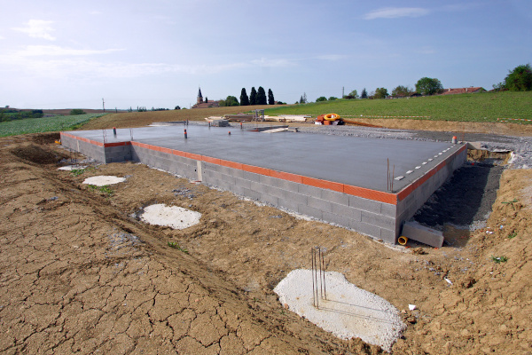
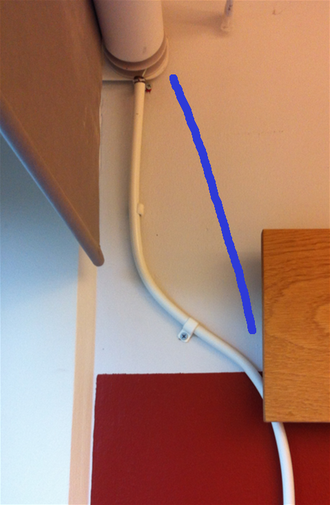

% Lineární diferenciální rovnice

> Anotace.
>
> * Ve všech úvodních příkladech se budeme věnovat asi nejjednodušší diferenciální rovnici: lineární s konstantními koeficienty. Tato tovnice má jediné konstantní řešení, kdy se nic neděje. Nekonstantná řešení jsou popsány exponenciálními funkcemi.
> * Ve dvou úvodních příkladech se podíváme na řešení rovnice popisující radioaktivní rozpad a exponenciální pokles aktivity. V jednom případě je pokles k nule (radioaktivní prvek se časem rozpadne) a ve druhém případě k nenulové hodnotě (množství radioaktivního prvku je doplňováno difuzí a nastolí se rovnováha).
> * V dalších dvou příkladech si ukážeme modely vedoucí k rovnici popisující exponenciální růst, resp. exponenciální vzdalování se od konstantního řešení. Ve druhém příkladě si zkusíme numericky demonstrovat intenzitu exponenciálního růstu.
> * V posledním příkladě se zaměříme na vektorový případ a ukážeme, že zpětná vazba reagující na hodnoty sledované veličiny je vhodnou taktikou pro udržení konstantního stavu této veličina a podle povahy může a nemusí vést k oscilacím. Ukážeme si toto na příkladě regulace teploty ale v podstatě stejně je udržována rovnováha enzymů a proteinů v tělech rostlin a živočichů.

# Radioaktivní rozpad 

https://youtu.be/G7jb5MyMUHM

Množství radioaktivního materiálu se snižuje rychlostí úměrnou tomuto množství. 

1. Napište vhodný matematický model a vyřešte jej. 
2. Určete dobu, za kterou se množství radioaktivního materiálu sníží na polovinu. 

1. Modelem je rovnice $$\frac{\mathrm dy}{\mathrm dt}=-ky$$ s jedním řešením 
$$y=e^{-kt}$$ a obecným řešením
$$y=Ce^{-kt}.$$
2. Doba $T$ za kterou klesne hodnota na polovinu se určí ze vztahu
$$\frac 12=e^{-kT},$$
tj. 
$$kT=\ln 2$$
a
$$T=\frac 1k \ln 2.$$ Tato hodnota se nazývá poločas rozpadu a je $\ln2$ násobkem převrácené hodnoty rozpadové konstanty $k$.

# Radioaktivní rozpad a radon v budovách

Radon je po kouření druhou nejčastější přinou rakoviny plic.

https://youtu.be/26EwlUHLqUc

V zemích s přirozenou radioaktivitou je nebezpečím radon. Na rozdíl od ostatních radioaktivních prvků je plynný a může prostupovat do budov, kde se hromadí zejména v nižších patrech, protože má poměrně velkou hustotu. 

* Předpokládejme, že radon se do budovy dostává konstantní rychlostí. 
* V budově se rozpadá v souladu s obecným zákonem radioaktivního rozpadu, tj. rychlostí úměrnou množství. 
* Kromě toho může unikat z budovy difuzí do vnějšího prostředí. Je realistické předpokládat, že rychlost snižování množství radonu tímto efektem je úměrná množství radonu. 

3. Napište matematický model pro množství radonu v budově.
4. Najděte stacionární (konstantní) řešení modelu.
5. Najděte obecné řešení modelu. Ukažte, že rozdíl aktuálního stavu od stacionárního řešení exponenciálně klesá.
6. Obranou proti radonu je izolace. Obranou proti radonu v nezaizolovaných objektech je časté větrání. Které parametry modelu jsou těmito systémy obrany proti radonu ovlivněny a jak? Ukažte, že opravdu vedou ke snížení množství radonu ve stacionárním stavu.

_Více viz [Radon in the environment](http://www.nat.vu.nl/environmentalphysics/REAL%20Experiments/Radon/Radon_Theory.html)._

1. Je-li $q$ rychlost s jakou radon proniká do budovy, $k$ rozpadová konstanta a $d$ konstanta úměrnosti charakterizující intenzitu s jakou plyn uniká difuzí z budovy, je modelem rovnice $$\frac{\mathrm dy}{\mathrm dt}=q-ky-dy,$$ nebo po úpravě
$$\frac{\mathrm dy}{\mathrm dt}=q-(k+d)y.$$
2. Stacionární řešení je $$y=\frac{q}{k+d},$$ což zjistíme, pokud do modelu za derivaci dosadíme nulu a vyřešíme vzhledem k $y$.
3. Rovnice je lineární, což vidíme z tvaru 
$$\frac{\mathrm dy}{\mathrm dt}+(k+d)y=q.$$
Asociovaná homogenní rovnice 
$$\frac{\mathrm dy}{\mathrm dt}+(k+d)y=0$$
má obecné řešení $$y=Ce^{-(k+d)t}$$
a řešením modelu je tedy 
$$ y = \frac {q}{k+d} + Ce^{-(k+d)t}.$$
Rozdíl aktuálního stavu od stacionárního řešení 
je dán vztahem 
$$ \frac {q}{k+d} - y = -Ce^{-(k+d)t}$$ 
a exponenciálně klesá. V prakticky smysluplných aplikacích je koncentrace pod stacionárním řešením a roste k němu a pravá strana je tedy kladná. Aby to bylo patrnější, označíme $K=-C$ a řešení je možno psát jako 
$$ \frac {q}{k+d} - y = Ke^{-(k+d)t}$$ 
a
$$y=\frac {q}{k+d} - Ke^{-(k+d)t}.$$ 
4. Izolace sníží rychlost s jakou radon prostupuje do budovy a sníží tedy konstantu $q$. Větrání zvýší rychlost difuze ven a zvýší koeficient $d$. Každý z těchto efektů nezávisle sníží čitatel resp. zvýší jmenovatel podílu $$\frac {q}{k+d},$$ což vede k menší hodnotě. Hodnota ve stacionárním stavu klesne.

# Časový rozestup mezi trolejbusy

https://youtu.be/DvHpllR2zLg

Uvažujme dva trolejbusy jedoucí za sebou po stejné trati. Označme
$x(t)$ jejich časový odstup. Pokud první trolejbus zastaví na určité
zastávce v čase $t$, druhý trolejbus na tuto zastávku dorazí v čase
$x(t)$. Naším úkolem je zjistit, jak se $x(t)$ mění s\ rostoucím $t$.

Předpokládejme, že

* pokud žádní pasažéři nečekají na druhý vůz, druhý vůz se
  pohybuje rychleji než první vůz a oba vozy se "sjedou", tj. $x(t)$
  klesá konstantní rychlostí, pokud na druhý vůz nečekají žádní pasažéři
* rychlost druhého vozu klesá (a rozestup roste) s rostoucím počtem pasažérů
  čekajících na zastávce 
* a počet pasažérů kteří čekají na zastávce roste s rostoucím
  intervalem mezi oběma vozy.

Navrhněte model pro rozestup trolejbusů, najděte stacionární řešení a posuďte kvalitativní chování nekonstantních řešení.

_Podle knihy P.  Blanchard,
R. L. Devaney, G.  R. Hall: Differential equations, Cengage Learning
(2006), 828 pp._

Situaci je možno modelovat diferenciální rovnicí
$$ 
  \frac{\mathrm dx}{\mathrm  dt}=\beta x-\alpha,
$$
kde $\alpha$ a $\beta$ jsou kladné reálné konstanty.

Není těžké uhodnout, že v úloze je konstantní řešení. Protože derivace konstanty je nulová, musí toto řešení splňovat vztah
$$ 
  0=\beta x-\alpha
$$
a tedy $x=\frac\alpha\beta$.

Ve tvaru s lineárním operátorem na levé straně má rovnice tvar
$$ 
  \frac{\mathrm dx}{\mathrm  dt}-\beta x=-\alpha
$$
a asociovaná homogenní rovnice je 
$$ 
  \frac{\mathrm dx}{\mathrm  dt}-\beta x=0.
$$
Tuto rovnici je možno přepsat do tvaru
$$ 
  \frac{\mathrm dx}{\mathrm  dt}=\beta x
$$
a jedno její řešení je patrné: $x=e^{\beta t}.$ Obecné řešení asociované homogenní rovnice je poté
$x=C e^{\beta t}$ a obecné řešení původní rovnice 
$$ 
  \frac{\mathrm dx}{\mathrm  dt}=\beta x-\alpha
$$
je $$x=C e^{\beta t} + \frac\alpha\beta.$$

Protože výraz $e^{\beta t}$ je rostoucí funkcí $t$, znamená to, že
vzdálenost řešení od stacionárního řešení s časem roste. V našem modelu
to znamená, že trolejbus, který nabral zpoždění, bude nabírat zpoždění
stále větší. Naopak trolejbus, který nedodržel odstup a zkrátil
interval od předchozího bude tento předchozí stále více dohánět. To
souvisí s tím, že se změnou intervalu se změní počet pasažérů
čekajících na zastávce a toto má vliv na rychlost trolejbusu.

<!-- Tato rovnice má konstantní řešení $x=\frac \alpha\beta$. Toto řešení je nestabilní, protože 
$$\frac{\mathrm d}{\mathrm dx}(\beta x-\alpha)=\beta>0.$$ Žádné jiné
konstantní řešení neexistuje a proto všechna řešení klesají na nulu
nebo neohraničeně rostou. -->

Vzhledem k nestabilitě stacionárního řešení nemůžeme nechat řidiče
veřejné dopravy jezdit "jak jim to vyjde". Situace by směřovala k
tomu, že cestující budou nejprve dlouho čekat na trolejbus a nakonec
přijede několik trolejbusů těsně za sebou. 

# Pásová brzda

https://youtu.be/XlUuxd3Ws10

Lano je částečně obtočeno okolo dřevěného kůlu.  Fyzikální rozbor ukazuje, že třecí sílou mezi lanem a kůlem se mění tah $T$ v laně a tím je způsobeno to, že tah na jednom konci lana se přes kůl sníží a na druhém konci lana pociťujeme tah menší. Je tak možno omotáním okolo kůlu o vhodný úhel vyrovnat s malým úsilím i působení velkých sil. Tah ve vlákně je funkcí úhlu $\theta$ udávajícího míru obtočení a splňuje diferenciální rovnici $$\frac{\mathrm dT}{\mathrm d\theta}=\mu T,$$ kde $\mu$ je součinitel smykového tření mezi lanem a kůlem a úhel měříme ve směru rostoucího tahu.

1. Vyřešte diferenciální rovnici. Ukažte, že brzdné účinky rostou exponenciálně s úhlem. (Brzdné účinky definujeme jako podíl tahů na obou koncích.)
2. Demonstrujte brzdné účinky na konkrétních číslech. Předpokládejme otočení lana o čtvrtinu otáčky. Tedy táhneme za lano, které je omotáno okolo dřevěného kůlu a zatáčí do pravého úhlu. Předpokládejme, že v tomto uspořádání se tahová síla sníží o 25 procent. Jak se sníží tahová síla, pokud je lano obtočeno o půl otáčky, o celou otáčku, o dvě otáčky?
3. Předpokládejme, že lano je obtočeno okolo dvou kůlů. Okolo prvního o úhel $\theta_1$, okolo druhého o úhel $\theta_2$. Jak se sníží tahová síla v tomto uspořádání? Ukažte, že úhly se sčítají. Toto může být modelová situace nevhodného vedení ovládací šňůry k roletě na obrázku. Optimální a v tomto případě i logické uspořádání je znázorněno modrou čarou.

Poznámky.

* Zařízení zkoumané v tomto příkladě se nazývá [pásová brzda](https://cs.wikipedia.org/wiki/P%C3%A1sov%C3%A1_brzda). Uplatnění najde ve strojírenství, v praktických úlohách každodenního života (zejména života lezců či námořníků), ale například i při posouzení soudržnosti splétaných lan.
* Exponenciální růst využívají arboristé u spouštěcího bubnu nebo námořníci u ráhnové brzdy. Na principu více brzd spojených za sebou pracuje slaňovací osma a její zdokonalené varianty. V tomto případě je materiálem kov s nízkým koeficientem tření, které se vyrovná několika otáčkami. Počtem otoček je možné regulovat účinnost.

1. Jedná se o klasickou homogenní lineární diferenciální rovnici s konstantním koeficientem. Jedno řešení je $$T=e^{\mu\theta}$$ a obecné řešení $$T=Ce^{\mu\theta}.$$ Pro $\theta = 0$ dostáváme $T=C$ a je-li $T_0$ tah na jenom konci (méně namáhaném), je tah na druhém konci $$T=T_0 e^{\mu\theta}.$$ Tah se tedy zvýší multiplikativním faktorem $e^{\mu\theta}.$ Pokud brzdné účinky definujeme jako podíl tahů na obou koncích, dostáváme 
$$\frac{T(\theta)}{T_0}=e^{\mu\theta}$$ a tento podíl roste exponenciálně s úhlem $\theta$.
2. Podle zadání platí $$\frac {1}{0.75}=e^{\mu \frac \pi 2}$$ a chceme najít $e^{\mu \pi }$, $e^{\mu 2\pi }$ a $e^{\mu 4\pi }.$ 
Umocněním získáme
$$ e^{\mu \pi } =\left(e^{\mu \frac \pi 2}\right)^2=\frac {1}{0.75^2}=\frac{1}{0.5625}$$
a podobně
$$ e^{\mu 2\pi } =\left(e^{\mu \frac \pi 2}\right)^4=\frac {1}{0.75^4}=\frac{1}{0.3164}$$
a
$$ e^{\mu 4\pi } =\left(e^{\mu \frac \pi 2}\right)^8=\frac {1}{0.75^8}=\frac{1}{0.1001}.$$
Postupně tedy poklesne tahová síla o 44 procent (půlotáčka), o 70 procent (celá otáčka) a o 90 procent tj. na desetinu (dvě otáčky).
1. Pokud se první brzdy se tah mění násobkem 
$e^{\mu\theta_1}$ a u druhé násobkem $e^{\mu\theta_2}$, vynásobením těchto faktorů s pomocí vzorce pro součin exponenciálních výrazů se stejným základem (mocniny o stejném základu se násobí tak, že se sčítají exponenty) dostáváme
$$e^{\mu\theta_1}e^{\mu\theta_2}=e^{\mu(\theta_1+\theta_2)}.$$ Tah se tedy mění s faktorem odpovídajícím součtu úhlů, což bylo dokazováno.

<!-- https://pixabay.com/photos/abseiling-adventure-carabiner-1842180/ -->

# Regulace stacionárního stavu a jeho robustnost

Následující příklad je z knihy _Uri Alon, An introduction to systems biology, Design principles of biological circuits._ Kniha popisuje svět syntéz bílkovin a dalších sloučenin nutných pro život i tak jednoduchých organismů, jako je buňka. Aby byly buňky a živé organismy schopny reagovat na vnější podněty, musí syntéza potřebných bílkovin probíhat včas, rychle a stacionární stavy musí být robustní (nezávislé na změnách parametrů). 

https://youtu.be/NH2A3ycWezc

Pro jednoduchost si naformulujeme problematiku pro jednoduše představitelný případ regulace teploty v místnosti. Podobné mechanismy se však dlouhodobou evolucí vyvinuly a optimalizovaly i v buňkách a fungují tedy v tělech rostlin a živočichů. 

Uvažujme místnost, ve které je umístěno topné zařízení, další zdroje tepla a teplo může unikat z místnosti stěnami. 

* Příkon zařízení je $P$ a toto zařízení zvyšuje teplotu místnosti rychlostí úměrnou příkonu. Konstanta úměrnosti je $a$.
* Další zdroje tepla zvyšují teplotu konstantní rychlostí $S$. V tomto jsou započítáni například lidé.
* Místnost se ochlazuje rychlostí úměrnou teplotě $T$. Konstanta úměrnosti je $b$. (Popsaného stavu můžeme dosáhnout tak, že teplotní stupnici volíme tak, aby teplota okolí byla nulová.)

1. Napište model pro teplotu v místnosti a za předpokladu konstantního $P$ najděte stacionární stav. Všimněte si, že tento stacionární stav závisí na parametrech systému.
2. Chceme udržovat systém na teplotě $T_0$. Přidejte k modelu předpoklad, že výkon $P$ je regulován. Tato regulace je realizována vztahem
$$\frac{\mathrm dP}{\mathrm dt}=-k(T-T_0).$$ Okomentujte slovně, v čem regulace spočívá. Poté přidejte tento vztah v rovnici pro teplotu, čímž vznikne lineární autonomní systém. Ukažte, že stacionární teplotou je teplota $T_0$. Všimněte si, že tato hodnota je robustní: nezávisí na konstantách $a$, $b$, $k$ nebo $S$.
3. Předpokládejme nejobecnější lineární systém regulace výkonu
$$\frac{\mathrm dP}{\mathrm dt}=\alpha P-k T + \gamma.$$ 
Ukažte, že stacionární stav je robustní (roven $T_0=\frac\gamma k$ a nezávislý na ostatních parametrech) tehdy a jen tehdy, když platí $\alpha =0$.
4. Najděte vlastní čísla autonomního systému vytvořeného v tomto modelu a okomentujte, jak se budou chovat řešení. Ukažte, že parametry systému je možné shluknout do jednoho bezrozměrného parametru, jehož hodnota dokáže odlišit kvalitativně různá chování systému. Všimněte si, že situace je skoro stejná jako u soustavy popisující [kmity tlumeného oscilátoru v přednášce](../09/#mechanick%C3%BD-oscil%C3%A1tor).

1. Modelem je rovnice $$\frac{\mathrm dT}{\mathrm dt}=aP+S-bT$$ a stacionární řešení pro konstantní výkon $P$ získáme řešením rovnice
$$0=aP+S-bT,$$
tj. $$T=\frac{aP+S}{b}.$$ Evidentně toto řešení závisí na parametrech systému.
1. Vztah $$\frac{\mathrm dP}{\mathrm dt}=-k(T-T_0)$$ modeluje regulaci výkonu topného zařízení tak, aby se výkon snižoval při teplotě větší než $T_0$ a zvyšoval při teplotě menší. Rychlost změny výkonu je úměrná odchylce aktuální teploty od teploty $T_0$.
Spojením rovnic získáme systém 
$$\begin{aligned}
\frac{\mathrm dT}{\mathrm dt}&=aP+S-bT\\
\frac{\mathrm dP}{\mathrm dt}&=-k(T-T_0)
\end{aligned}
$$
se stacionárním řešením daným soustavou 
$$\begin{aligned}
0&=aP+S-bT\\
0&=-k(T-T_0).
\end{aligned}
$$
Druhá rovnice okamžitě dává $T=T_0$ a toto řešení evidentně nezávisí na parametrech jako $a$, $b$, $k$ nebo $S$.
2. 
Systém 
$$\begin{aligned}
\frac{\mathrm dT}{\mathrm dt}&=aP+S-bT\\
\frac{\mathrm dP}{\mathrm dt}&=\alpha P-k T+\gamma 
\end{aligned}
$$
má stacionární řešení dané soustavou 
$$\begin{aligned}
0&=aP+S-bT\\
0&=\alpha P-k T+\gamma .
\end{aligned}
$$
Pokud první rovnici vynásobíme faktorem $-\alpha$, druhou rovnici faktorem $a$ a sečteme, dostáváme
$$0=-\alpha S +\alpha b T - a k T+\gamma a$$
a odsud
$$T=\frac{\alpha S-a\gamma}{\alpha b-ak}.$$
Aby řešení nezáviselo na $S$, musí být $\alpha =0.$ Potom dostáváme 
$$T=\frac{\gamma}{k}.$$ V označení podle předchozího bodu máme $\gamma=kT_0$, tj. $$T=T_0$$ a řešení nezávisí na parametrech $a$, $b$, $k$ nebo $S$. Tomu říkáme, že stacionární stav je robustní.
2. Model 
$$\begin{aligned}
\frac{\mathrm dT}{\mathrm dt}&=aP+S-bT\\
\frac{\mathrm dP}{\mathrm dt}&=-k(T-T_0)
\end{aligned}$$
má maticový zápis
$$\frac{\mathrm d}{\mathrm dt}\begin{pmatrix}T\\P\end{pmatrix}=\begin{pmatrix}-b&a\\-k&0\end{pmatrix}\begin{pmatrix}T\\P\end{pmatrix}+\begin{pmatrix}S\\kT_0\end{pmatrix}.$$
Charakteristický polynom v proměnné $\lambda$ je 
$$0=\begin{vmatrix}-b-\lambda&a\\-k&-\lambda\end{vmatrix}=\lambda^2+b\lambda+ak.$$
a kořeny jsou $$\lambda_{1,2}=\frac{-b\pm\sqrt{b^2-4ak}}{2}.$$
Pokud je $b^2-4ak>0$, jsou oba kořeny reálné záporné a ve stacionárním bodě je stabilní uzel. Systém přejde do stacionárního bodu bez oscilací. Pokud je $b^2-4ak<0$, jsou oba kořeny komplexně sdružené se zápornou reálnou částí a systém přejde do stabilního stavu oscilacemi se snižující se amplitudou. Z podmínek vidíme, že o chování rozhoduje to, zda je výraz $\frac{b^2}{ak}$ větší či menší v porovnání s hodnotou $4$. Pokud větší, oscilace se nevyskytnou. Pokud menší, systém osciluje k rovnováze. Tyto oscilace se tedy objeví, pokud je $a$ nebo $k$ velké. Pro systém to znamená, že oscilace se objeví, pokud příkon $P$ výrazně reaguje na odchylku od rovnovážné teploty (velké $k$), nebo teplota výrazně reaguje na změny v příkonu (velké $a$). Že se v takových situacích může rovnovážná teplota "přestřelit" a budeme se ní blížit zase z opačného směru není proto nijak překvapující. Přirozenou analýzou vyplynulo, že kvalitativní chování systému (oscilace versus neoscilace) nezávisí na jednotlivých parametrech samostatně, ale na čísle $\frac{b^2}{ak}$. Pokud prohodíme pořadí proměnných, má soustava tvar 
$$\frac{\mathrm d}{\mathrm dt}\begin{pmatrix}P\\T\end{pmatrix}=\begin{pmatrix}0&-k\\a&-b\end{pmatrix}\begin{pmatrix}P\\T\end{pmatrix}+\begin{pmatrix}kT_0\\S\end{pmatrix}.$$
Až na konstantní člen na pravé straně je systém stejný jako systém pro mechanický oscilátor. Přítomnost konstantního člene způsobí, že stacionární bod není v počátku, ale je posunutý.

