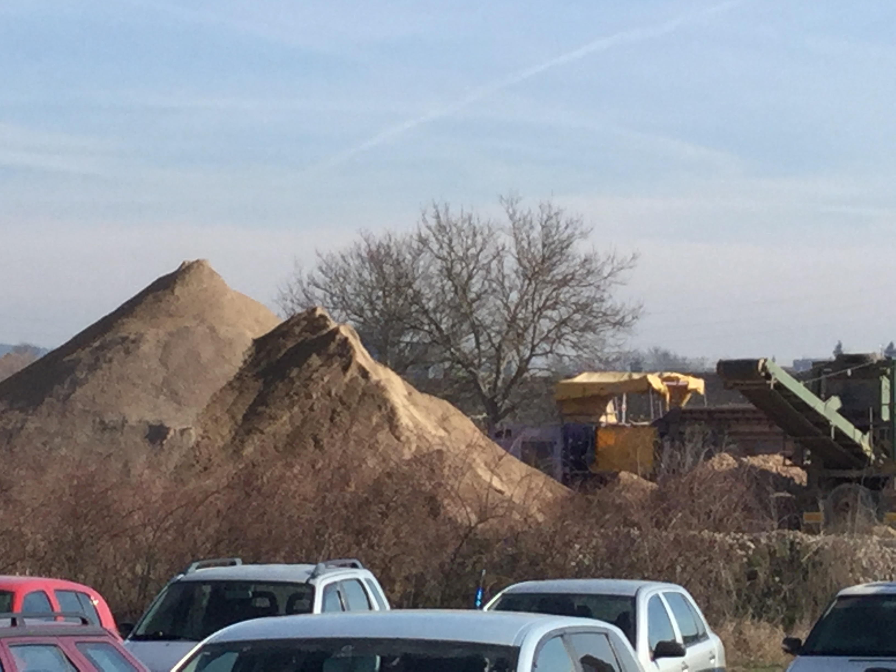
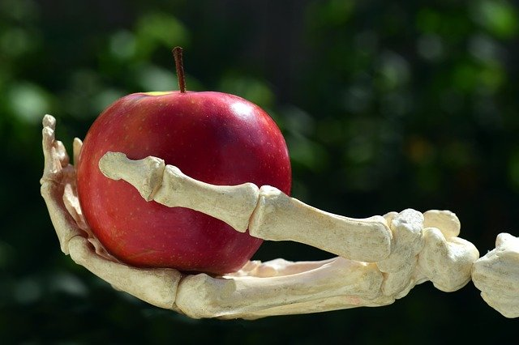
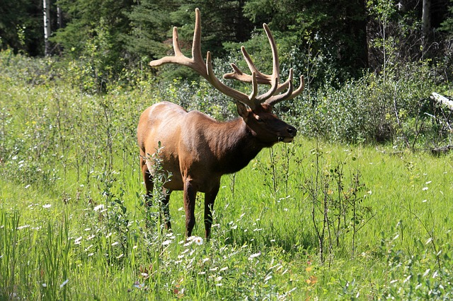
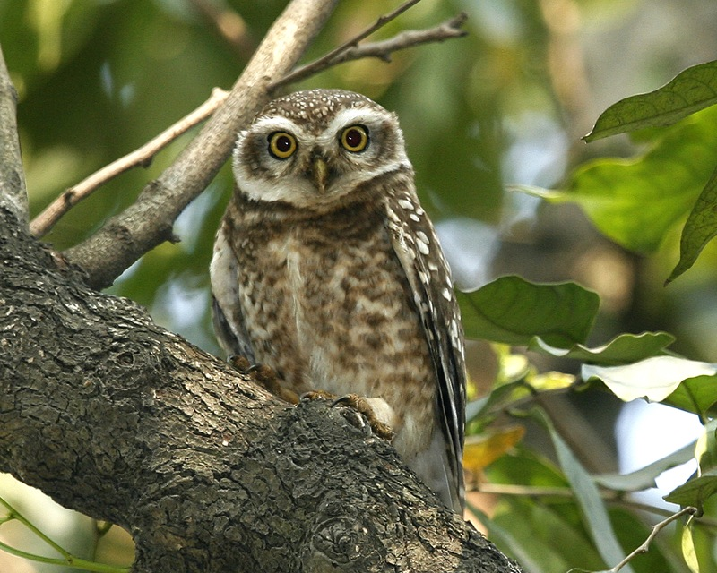
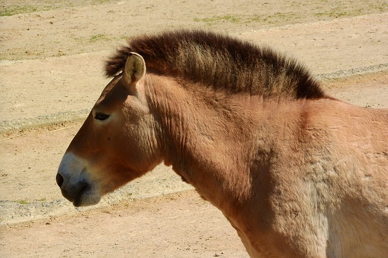

% Autonomní rovnice a systémy

K cvičení je k dispozici [Jupyter zápisník s numerickými simulacemi](http://user.mendelu.cz/marik/aromamath/Autonomni_rovnice_a_systemy.html) zde představených modelů. Tento zápisník je možné si naklonovat a samostatně modifikovat příkazy nebo texty a zkoušet vlastní numerické simulace.

<!--

## Instrukce k online výuce prosinec 2021

* V úlohách bude podstatná schopnost sestavení diferenciální rovnice a umění detekovat, zda kde je pravá strana rovnice nulová, kde kladná  a  kde záporná. To je dostatečná informace k tomu, abychom dokázali odhalit stacionární body (to jsou stavy kdy je systém v rovnováze a do jednoho s těchto stavů časem dospěje), nestabilní stacionární body (stavy, kdy je systém v křehké rovnováze, která je narušena i malým výkyvem) a stabilní stacionární body (systém je v robustní rovnováze, která se po malých výchylkách sama automaticky obnovuje). V první úloze je možné uvažovat pravou stranu jako celek a zakreslit si situaci graficky. Ve druhé úloze je členů více a je výhodnější pravou stranu uvažovat jako rozdíl dvou funkcí a hledat průsečíky a intervaly, kdy je jedna funkce nad druhou a naopak. 
* Ve třetí úloze si ukážeme, jak se dají namodelovat soustavy rovnic diferenciálních rovnic. Použijeme k tomu lehce představitelný případ konkurence populací v ekosystému. Kromě sestavení rovnice si ukážeme nástroj umožňující pohodlné modelování, jak se budou chovat řešení. (Význam tohoto nástroje je čistě pedagogický. V praxi je nutné aby toto modelování bylo stavebním kamenem nějaké celkové analýzy, zahrnující jednotlivé scénáře, pravděpodobnostní rozložení hodnot parametrů a podobně. Zde jakýkoliv interaktivní nástroj nemá šanci na uplatnitelnost.)
* Stacionární body jsou u systémů to, co nás zajímá v první řadě. Skutečně, všechna ohraničená řešení systému v rovině konvergují k některému stacionárnímu bodu nebo okolo něj obíhají v cyklu. Proto si v poslední úloze ukážeme, jak se dá odhalit chování trajektorií v okolí stacionárního bodu nelineárního systému. Ukážeme si, jak systém linearizovat pomocí Jacobiho matice ve stacionárním bodě. Najdeme vlastní čísla této matice a pomocí nich určíme typ stacionárního bodu. To nám dodá informaci, zda si bod "přitáhne" všechny trajektorie ze svého okolí, zda je naopak odpuzuje, nebo zda se chová ještě nějak jinak. 

-->

# Skladování stavebního recyklátu

https://youtu.be/5gOGLPv8BeU

Hromada sypkého
materiálu má tvar kužele. Úhel u vrcholu je konstantní, daný
mechanickými vlastnostmi materiálu a je nezávislý na
objemu. Předpokládejme, že personál stavebnin přisypává na hromadu
materiál konstantní rychlostí (v jednotkách objemu za jednotku
času). Tato hromada je však v poměrně otevřené krajině a vítr
rozfoukává materiál po okolí. Je rozumné předpokládat, že rozfoukávání (opět v jednotkách objemu za jednotku
času)
se děje rychlostí úměrnou povrchu návětrné strany pláště.

1. Napište rovnici pro derivaci objemu hromady podle času. 
1. Existuje konstantní řešení? Pokud ano, je stabilní nebo nestabilní? Zdůvodněte.
1. Může hromada skončit i při neustálém přisypávání celá rozfoukaná?
1. Mohou pracovníci navršit hromadu do libovolné výšky anebo pro velkou hromadu je již rozfoukávání rychlejší než přisypávání?

Rychlost, s jakou se mění objem, je $\frac{\mathrm dV}{\mathrm dt}$. Rychlost přisypávání označme $R$, povrch návětrné strany $S$.
Podle zadání platí $$  \frac{\mathrm dV}{\mathrm dt} = R - k_0S$$
pro vhodnou kontantu úměrnosti $k_0$.
Protože kužel má stále stejný tvar, objem jednoznačně determinuje rozměry, povrch kužele, nebo i povrch poloviny pláště, tj. povrch návětrné strany. Z podobnosti víme, že plochy rostou s druhou mocninou a objemy se třetí mocninou délkových rozměrů. Proto je zřejmé, že musí platit úměrnost mezi takovými mocninami těchto veličin, pro které jednotky ``pasují'', Existuje tedy konstanta taková, že $$S=k_1V^{\frac 23}.$$ Spojením těchto dvou vztahů dostáváme $$  \frac{\mathrm dV}{\mathrm dt} = R - k V^{\frac 23},$$ kde $R$ a $k=k_0k_1$ jsou konstanty.

Označme $f(V)=R-kV^{\frac 23}$.
Konstantní řešení je řešením rovnice $f(V)=0$, tj. $$R-kV^{\frac 23}=0.$$ Odsud $$V_0=\left(\frac{R}{k}\right)^{3/2}.$$ Protože $f$ klesá v bodě $V_0$, je toto řešení stabilní.

Protože $f(0)>0$, malá hromada vždy roste a proto nemůže skončit celá rozfoukaná. Pro malý objem je přisypávání intenzivnější než rozfoukávání.

Protože $f$ je pro velké $V$ záporná, pro velkou hromadu objem ubývá (více se rozfouká než přisype) a hromadu není možné navršit libovolně velkou. 

# Propeptid kolagenu

https://youtu.be/yAHdtic9b18

Kolagen je klíčový protein pojivových tkání. Jeden z kroků při syntéze
kolagenu spočívá v reakci tří molekul propeptidu kolagenu, zkráceně
propeptidu. Tento propeptid se formuje konstantní rychlostí a kromě
toho, že je surovinou pro produkci kolagenu, se ještě rozpadá
rychlostí úměrnou koncentraci.

1. Napište matematický model pro množství (koncentraci) propeptidu kolagenu.
2. Popište různá chování modelu z hlediska počtu stacionárnícho bodů a jejich stability.

_Podle Alan Garfinkel, Jane Shevtsov, Yina Guo: Modeling Life_

Rovnice má tvar
$$\frac{\mathrm dP}{\mathrm dt}=-k_1 P^3 +k_2-k_3 P,$$
kde $k_1$, $k_2$ a $k_3$ jsou kladné konstanty úměrnosti. Rovnici je možno zapsat ve tvaru
$$\frac{\mathrm dP}{\mathrm dt}=\Bigl(k_2-k_3 P\Bigr)-\Bigl(k_1 P^3\Bigr) $$
s rozdílem klesající a rostoucí funkce na pravé straně. Tyto funkce mají jediný průsečík a proto má rovnice jediný stacionární bod. Tento bod je stabilní, protože pro vysoké hodnoty $P$ je pravá strana rovnice záporná (dominantní člen je $-k_1 P^3$) a pro malé hodnoty $P$ je pravá strana kladná (v nule je rovna konstantě $k_2$).

# Modely interagujících populací

https://youtu.be/Rd_5KC2iFtE

## Jelen a los

Uvažujme populaci jelenů a losů. Tyto populace spolu soupeří o potravu. 

1. Bez konkurence by populace jelena rostla rychlostí $3$ a  populace losa rychlostí $2$ na jeden kus. 
2. Vnitrodruhová konkurence se projevuje v obou populacích stejně a je rovna druhé mocnině příslušné velikosti populace. 
3. Mezidruhová konkurence je vyjádřena členem rovným součinu velikosti populací a tato konkurence se projeví s koeficientem 0.5 v populaci losa a s koeficientem 1 v populaci jelena.

Sestavte matematický model a otestujte jej numerickým experimentem na stabilitu stacionárních bodů. Poté zdvojnásobte parametry mezidruhové konkurence a sledujte změnu odezvy. 

_Podle Alan Garfinkel, Jane Shevtsov, Yina Guo: Modeling Life_

$$
\begin{aligned}
  \frac{\mathrm dx}{\mathrm dt}&=3x-xy-x^2\\
    \frac{\mathrm dy}{\mathrm dt}&=2y-0.5xy-y^2
\end{aligned}
$$

[Online model.](https://homepages.bluffton.edu/~nesterd/apps/slopefields.html?flags=2&dxdt=3*x%20-%20x%5E2%20-%20x*y&dydt=2*y%20-%20y%5E2%20-%200.5%20*%20x%20*%20y&x=0,4,20&y=0,3,15&method=rk4&h=0.1&f1=80-30cos(2pi%20x/24)&f2=exp(2x)&f3=zeta(x)&f4=gamma(x)&pts1=%5B0.3,0.28328571428571436%5D,%5B0.20714285714285716,0.6434928229665071%5D,%5B2.664285714285714,2.158851674641148%5D,%5B3.1714285714285713,0.7533014354066987%5D,%5B1.7785714285714285,0.2115789473684213%5D)

<!--

% \obrazek{les.jpg}

% ## Model konkurence

% Konkurence je častý jev v přírodě. Například v lese si konkurují listnaté a jehličnaté stormy z hlediska prostoru, slunečního světla a vody. Stromy se liší rychlostí růstu, nosnou kapacitou prostředí a tím, jak ovlivňují své konkurenty. Předpokládejte logistický růst v obou konkurujících si populacích, předpokládejte člen vyjadřující zbrždění vlivem konkurenta přímo úměrný velikosti obou populací  a namodelujte čtyři možné východiska modelu ()

% %https://homepages.bluffton.edu/~nesterd/apps/slopefields.html?flags=2&dxdt=0.1*x*(1-x/10000)-5*0.00001*x*y&dydt=0.25*y*(1-y/6000)-3*0.00001*x*y&x=0,10000,20&y=0,6000,15&method=rk4&h=0.1&f1=80-30cos(2pi%20x/24)&f2=exp(2x)&f3=zeta(x)&f4=gamma(x)&pts1=%5B4907.407407407408,5229.428571428572%5D,%5B7444.444444444444,3746.6985645933014%5D,%5B8407.407407407407,2633.9712918660284%5D,%5B9259.25925925926,1111.2918660287078%5D,%5B9648.148148148148,423.1578947368416%5D,%5B3240.740740740741,306.0287081339711%5D,%5B1407.4074074074074,935.5980861244016%5D,%5B4611.111111111111,203.5406698564584%5D,%5B5518.518518518518,57.129186602870504%5D
-->

## Puštík obecný

Puštík obecný se téměř výhradně živí malými hlodavci. Předpokládejme následující vztahy.

1. Populace hlodavců má porodnost 0.1 na jedince a úmrtnost 0.025 na jedince za jednotku času.
2. Rychlost, s jakou jeden puštík konzumuje hlodavce, je úměrná počtu hlodavců s konstantou úměrnosti 0.01.
3. Porodnost v populaci puštíka je úměrná množství zkonzumované potravy. Ta souvisí s dostupností hlodavců. Předpokládejme, že porodnost je úměrná populaci hlodavců s konstantou úměrnosti 0.05.
4. Úmrtnost v populaci puštíka je 0.1 na jedince za jednotku času.

Vyjádřete tyto vztahy matematickým modelem.

_Podle Alan Garfinkel, Jane Shevtsov, Yina Guo: Modeling Life. Doslova přeloženo. Porodnost je ve skutečnosti společný efekt zvýšené porodnosti a snížené úmrtnosti v případě, že puštík má přístup k potravě._

$$
\begin{aligned}
  \frac{\mathrm dx}{\mathrm dt}&=0.1 x-0.025x-0.01xy\\
  \frac{\mathrm dy}{\mathrm dt}&=-0.1y+0.05xy  
\end{aligned}
$$

[Online model.](https://homepages.bluffton.edu/~nesterd/apps/slopefields.html?flags=2&dxdt=0.1*x%20-%200.025*x-0.01*x*y&dydt=-0.1*y+0.05*x*y&x=0,10,20&y=0,40,15&method=rk4&h=0.1&f1=80-30cos(2pi%20x/24)&f2=exp(2x)&f3=zeta(x)&f4=gamma(x)&pts1=%5B0.7894736842105263,10.577142857142857%5D,%5B1.795774647887324,12.09377990430622%5D,%5B0.7394366197183099,22.830622009569378%5D)

## Kůň Převalského

Kůň Převalského je divoký kůň ze střední Asie, jediný druh koně, který nebyl domestikován. V divočině jsou tyto koně loveni vlky. Napište matematický model založený na následujících předpokladech.

1. Porodnost v populaci koní je  0.15 na jedince. 
2. Úmrtnost v populaci koní je  0.01 na jedince.
3. Vlci se živí i jinou potravou, mají tedy kladnou porodnost. Ta je 0.1 na jedince.
4. Vlci mají konstantní úmrtnost 0.05 na jedince.
5. Pravděpodobnost, s jakou je kůň uloven vlkem, je úměrná počtu vlků s konstantou úměrnosti 0.02.

_Podle Alan Garfinkel, Jane Shevtsov, Yina Guo: Modeling Life_

_Podle Wikipedie kůň Převalského přežil jenom díky péči zoologických zahrad a z rodokmenu je zřejmé, že 70 procent jedinců tohoto druhu má původní předky ze zoologické zahrady v Praze._

$$
\begin{aligned}
  \frac{\mathrm dx}{\mathrm dt}&=0.15 x-0.01x-0.02xy\\
  \frac{\mathrm dy}{\mathrm dt}&=0.1y-0.05y  
\end{aligned}
$$

<!--

% Holling
% https://homepages.bluffton.edu/~nesterd/apps/slopefields.html?flags=2&dxdt=x*(1-x/2)-y*%20x/(1+x)&dydt=-0.2*y%20+%200.7%20*%20y%20*%20x/(1+x)&x=0,1.5,15&y=0,2,15&method=rk4&h=0.05&f1=80-30cos(2pi%20x/24)&f2=exp(2x)&f3=zeta(x)&f4=gamma(x)&pts1=%5B0.19553571428571428,0.7085714285714286%5D,%5B0.23839285714285716,0.8731100478468901%5D,%5B0.38571428571428573,0.477799043062201%5D

%
% Jezera
% https://homepages.bluffton.edu/~nesterd/apps/compartmentalanalysis.html?O&S,29,F,80,10;H,0,T,290,100;M,0,T,130,200;R,0,T,325,280;O,0,T,490,230&S,H,S*15/2900;M,H,M*38/1180;H,R,H*68/850;R,O,R*85/116;O,s,O*99/393&The%20compartments%20represent%20levels%20of%20some%20pollutant%20in%20the%20Great%20Lakes.%20%28R%20%3D%20Erie%2C%20because%20E%20is%20not%20an%20allowed%20variable%20name.%29%20The%20model%20assumes%20that%20the%20initial%20concentration%20of%20the%20pollutant%20is%20the%20same%20in%20all%20the%20lakes%2C%20so%20the%20initial%20value%20is%20proportional%20to%20the%20lake%27s%20volume.%20No%20more%20of%20that%20pollutant%20is%20being%20introduced%2C%20and%20pure%20%28rain%29%20water%20flows%20in%20to%20the%20lakes%2C%20with%20the%20resulting%20mixture%20flowing%20from%20each%20lake%20into%20the%20next%2C%20and%20eventually%20to%20the%20ocean.%20From%20Fundamentals%20of%20Differential%20Equations%20%28Nagle%20and%20Saff%2C%201996%29%2C%20page%20317.

-->

# Analýza 2D systému pomocí vlastních čísel

https://youtu.be/bEc6CTxRB3g

Autonomní systém
$$
\begin{aligned}
  \frac{\mathrm dx}{\mathrm dt}&= 4x^2y+y^3-5\\
  \frac{\mathrm dy}{\mathrm dt}&= 3xy^2-3y
\end{aligned}
$$
má stacionární bod $(1,1)$. Najděte Jacobiho matici v tomto bodě, vlastní čísla této matice a určete typ stacionárního bodu.

Platí
$$
\begin{aligned}
  \frac{\partial }{\partial x}(4x^2y+y^3-5)&=8xy\\
  \frac{\partial }{\partial y}(4x^2y+y^3-5)&=4x^2+3y^2\\
  \frac{\partial }{\partial x}(3xy^2-3y)&=3y^2\\
  \frac{\partial }{\partial y}(3xy^2-3y)&=6xy-3\\
\end{aligned}
$$
a odsud 
$$J(x,y)=
\begin{pmatrix}
  8xy& 4x^2+3y^2 \\ 3y^2 & 6xy-3
\end{pmatrix}. 
$$
Ve stacionárním bodě dostáváme 
$$J(1,1)=
\begin{pmatrix}
  8 & 7\\3&3
\end{pmatrix}.
$$
Výpočtem determinantu dostáváme
$$|J-\lambda I|=
\begin{vmatrix}
  8-\lambda & 7 \\ 3 & 3-\lambda
\end{vmatrix}
=(8-\lambda)(3-\lambda)-21=\lambda^2-11\lambda +3.
$$
Kořeny jsou
$$\lambda_{1,2}=\frac{11\pm\sqrt{121-12}}{2}$$
 a oba jsou kladné. Ve stacionárním bodě proto je nestabilní uzel.

ww:problems/autonomni_systemy/14.pg
