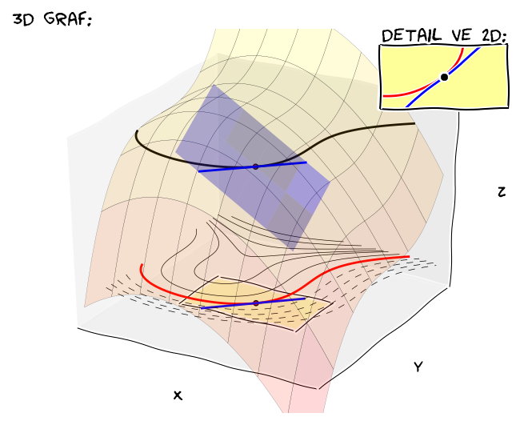

% Parciální derivace 
% Robert Mařík
% jaro 2014, aktualizace pro jaro 2018

# Derivace

Derivace je matematický prostředek který umožňuje sledovat, měřit a
porovnávat rychlosti změn fyzikálních veličin. Přirozeně se tak
objevuje při formulaci a popisu téměř všech dynamicky probíhajících
fyzikálních jevů. (Fyzikální popis světa tak je prezentovaný
středoškolskou fyzikou je častou pouze jakousi aproximací ve které
jevy probíhají konstantní rychlostí - například bez derivací umíme
studovat pouze rovnoměrný nebo rovnoměrně zrychlený pohyb).

**Poznámka.** Všude v následujícím textu budeme předpokládat, že
funkce a derivace které zde vystupují jsou dostatečně hladké a
rovnosti platí na dostatečně pěkných množinách. V praktických
aplikacích bývají tyto předpoklady zpravidla triviálně splněny, proto
je pro úsporu místa nebudeme vypisovat. Zájemce najde poučení v
odborné literatuře.

# Obyčejná derivace

* Derivace funkce $y=f(x)$ je definována vztahem $$\boxed{\displaystyle f'(x)=\lim_{h\to 0}\frac{f(x+h)-f(x)}h}$$
* Jedná se o veličinu udávající, jak rychle se mění funkční hodnoty
  funkce při změnách vstupních dat. 
* Alternativní označení je $\frac{\mathrm{d}f}{\mathrm{d}x}$.
* Derivace $f'(x)$ je směrnice tečny ke grafu funkce $y=f(x)$ v bodě $[x,f(x)]$.
* Lineární aproximací funkce $y=f(x)$ v bodě $x_0$ je $$f(x)\approx f(x_0)+f'(x_0)(x-x_0)$$ Slovy: funkční hodnota teď (v $x$) je funkční hodnota před chvílí (v $x_0$) plus celková změna, která je součinem rychlosti změny ($f'(x_0)$) a času, za který se změna udála ($x-x_0$).

# Parciální derivace

* Pro funkce dvou proměnných rozlišujeme parciální derivace podle jednotlivých proměnných. 
  $$\begin{aligned}\frac{\partial f(x,y)}{\partial x}&=\lim_{h\to 0}\frac{f(x+h,y)-f(x,y)}h\\
	  \frac{\partial f(x,y)}{\partial y}&=\lim_{h\to 0}\frac{f(x,y+h)-f(x,y)}h\end{aligned}$$
* Jedná se o stejnou veličinu jako u obyčejné derivace, ale vždy jenom
  vzhledem k jedné proměnné. Parciální derivace $\frac
  {\partial}{\partial x}f$ tedy udává, jak rychle se mění $f$ při
  změnách veličiny $x$.
* V definici a při výpočtu parciální derivace podle $x$ je proměnná
  $y$ konstantní. Geometricky to je možno interpretovat tak, že
  studujeme křivku, která vznikne na řezu grafu funkce $z=f(x,y)$
  rovinou $y=\text{konst}$.
* Alternativní označení: $f'_x(x,y)$, $f'_y(x,y)$.

![Parciální derivace funkce $f$ v bodě $[2,-2]$ jsou derivace křivek vzniklých na řezech rovinami $x=2$ a $y=-2$.](parcialni_derivace_1.png)

# Fyzikální význam

* Parciální derivace $\frac {\partial f}{\partial x}$ je rychlost
  změny funkce $f(x,y)$ při změnách veličiny $x$.
* Pokud se veličina $x$ změní o $\Delta x$, funkční hodnota se změní o
přibližně $\frac {\partial f}{\partial x}\Delta x$.
* Analogická tvrzení platí pro veličinu $y$.
* Pokud se mění obě veličiny, změny se sčítají. Lineární aproximací funkce $z=f(x,y)$ v bodě $(x_0, y_0)$ je tedy
$$      f(x,y)\approx f(x_0, y_0)+\frac{\partial f (x_0,y_0)}{\partial x}(x-x_0)+\frac{\partial f (x_0,y_0)}{\partial y}(y-y_0).$$
* Vyskytuje se ve většině důležitých rovnic popisujících fyzikální
  svět okolo nás. Často zde nevystupují přímo, ale prostřednictvím
  diferenciálních operátorů -- výrazů sestavených z parciálních
  derivací.
* Ve fyzice často pracujeme s funkcemi, které mají spojité parciální derivace. Takové funkce se nazývají *hladké funkce*.
* Jednotkou derivace $\frac{\partial f}{\partial x}$ je jednotka veličiny $f$ dělená jednotkou veličiny $x$.

# Zákon šíření chyb  (chyba nepřímo měřené veličiny)

* V praxi často měříme nepřímo veličinu $f$ tak, že měříme veličiny
$x_1$, $x_2$, $\dots$, $x_n$ a hodnotu veličiny $f$ určíme pomocí vzorce
$f(x_1, x_2, \dots, x_n)$. 
* Měření každé z veličin je zatíženo
chybou. Je-li chyba veličiny $x_i$ rovna $\Delta x_i$, způsobí tato
odchylka to, že chyba veličiny $f$ bude (v souladu se vzorcem pro lineární aproximaci)
přibližně
$$
  \Delta f\approx \left|\frac{\partial f}{\partial x_i}\Delta x_i\right|
$$
* Celkovou chybu veličiny $f$ můžeme určit sečtením chyb způsobených
jednotlivými veličinami $x_i$. Častěji se však používá následující vzorec
$$
  \Delta f(x_1,x_2,\dots x_n)\approx\sqrt{\left(\frac{\partial f}{\partial x_1}\Delta x_1\right)^2+\left(\frac{\partial f}{\partial x_2}\Delta x_2\right)^2+\cdots+\left(\frac{\partial f}{\partial x_n}\Delta x_n\right)^2}
$$
označovaný **zákon šíření chyb**.

 

# Gradient

* Gradient je definován pro skalární funkce
* Gradient funkce dvou proměnných $f(x,y)$:
  $$\mathop{\mathrm{grad}}f=\left(\frac{\partial f}{\partial
  x}, \frac{\partial f}{\partial y}\right)$$
* Gradient funkce tří proměnných $f(x,y,z)$:
  $$\mathop{\mathrm{grad}}f=\left(\frac{\partial
  f}{\partial x}, \frac{\partial f}{\partial y},
  \frac{\partial f}{\partial z}\right)$$
* Formálně většinou zapisujeme gradient $\nabla f,$ kde vystupuje
  operátor nabla definovaný vztahem
  $$\nabla=\left(\frac{\partial}{\partial x}, \frac{\partial}{\partial
  y}, \frac{\partial}{\partial z}\right)$$ nebo
  $$\nabla=\left(\frac{\partial}{\partial x}, \frac{\partial}{\partial
  y}\right)$$ (v závislosti na počtu proměnných funkce $f$). "Násobení"
  $\frac{\partial }{\partial x}$ s funkcí $f$ přitom chápeme jako
  parciální derivaci $\frac{\partial f}{\partial x}$.
* Gradient je v každém bodě kolmý k vrstevnici.
* Využití:
    * síla působící na těleso v silovém poli ve kterém je možno zavést potenciální energii je gradientem potenciální energie.
    * majáková navigace při migraci živočichů
    * posouzení jak rychle se mění veličina v prostoru (gradient je velký, jsou-li vrstevnice nahusto)
* [nakreslit online](http://user.mendelu.cz/marik/akademie/sagecell.php?short=1&lang=sage&in=f%28x%2Cy%29%3Dx%5E2%2Ay-x%2Ay%5E3%0D%0Amezex%3D%28x%2C1%2C4%29%0D%0Amezey%3D%28y%2C-1%2C2%29%0D%0Ahladiny%3D40%0D%0Ashow%28html%28%22%3Ch2%3EVrstevnice+a+gradient%3C%2Fh2%3E+Funkce%3A+%24+f%28x%2Cy%29%3D+%25s+%24%22%25+latex%28f%28x%2Cy%29%29%29%29%0D%0A%0D%0Ashow%28html%28r%27Gradient%3A+%24%5Cnabla+f%28x%2Cy%29%3D%28%25s%2C%25s%29%24%27%25%28latex%28f%28x%2Cy%29.diff%28x%29%29%2C+latex%28f%28x%2Cy%29.diff%28y%29%29%29%29%29%0D%0A%0D%0AP%3Dcontour_plot%28f%2Cmezex%2Cmezey%2C+contours%3Dhladiny%2C+cmap%3D%27jet%27%2C+fill%3DFalse%29%0D%0AP%3DP%2Bplot_vector_field%28f.gradient%28%29%2Fnorm%28f.gradient%28%29%29%2C+mezex%2C+mezey%29%0D%0A%0D%0Ashow%28P%2C+figsize%3D10%2C+aspect_ratio%3D1%29)

# Lineární aproximace funkce

* Lineární aproximací funkce $z=f(x,y)$ v bodě $(x_0, y_0)$ je (viz výše)
$$      f(x,y)\approx f(x_0, y_0)+\frac{\partial f (x_0,y_0)}{\partial x}(x-x_0)+\frac{\partial f (x_0,y_0)}{\partial y}(y-y_0)$$
nebo (pomocí gradientu)
$$      f(x,y)\approx f(x_0, y_0)+ \nabla f(x_0,y_0)\cdot (x-x_0,y-y_0).$$
* Tečná rovina ke grafu funkce $z=f(x,y)$ vedená bodem
  $[x_0,y_0,z_0]$, kde $z_0=f(x_0,y_0)$ má rovnici
  $$z=z_0+\frac{\partial f (x_0,y_0)}{\partial x}(x-x_0)+\frac{\partial f (x_0,y_0)}{\partial y}(y-y_0)$$
nebo (pomocí gradientu)
$$      z= z_0+ \nabla f(x_0,y_0)\cdot (x-x_0,y-y_0).$$

# Implicitně definovaná funkce 

Mějme funkci $f(x,y)$ dvou proměnných a její vstevnici na úrovni $C$
$$f(x,y)=C. \tag{1}$$ Tato rovnice za jistých okolností může definovat $y$
jako funkci proměnné $x$. Pokusíme se najít derivaci této funkce. K
tomu uvažujme bod $(x_0,y_0)$ ležící na této vrstevnici,
tj. $f(x_0,y_0)=C$.

* Rovnice tečné roviny v bodě $(x_0,y_0)$ je
  $$ z=f(x_0,y_0)+\nabla f(x_0,y_0)\cdot (x-x_0,y-y_0).$$
* Řez grafu rovinou $z=f(x_0,y_0)$ je vrstevnice na úrovni $C$, řez tečné roviny je tečna k vrstevnici v rovině $z=C$. Rovnice této tečny je 
  $$ C=f(x_0,y_0)+\nabla f(x_0,y_0)\cdot (x-x_0,y-y_0),$$
  tj.
  $$ 0=\nabla f(x_0,y_0)\cdot (x-x_0,y-y_0),$$

 

<a href="animation.gif" rel="facebox" alt="Nahrava se ...">Animace</a>

# Implicitně definovaná funkce  (pokračování)

* Normálový vektor tečny je 
  $$ \nabla f(x_0,y_0)=\left(\frac{\partial f}{\partial x}(x_0,y_0), \frac{\partial f}{\partial y}(x_0,y_0)\right),$$
  k němu kolmý je vektor
  $$ \left(-\frac{\partial f}{\partial y}(x_0,y_0), \frac{\partial f}{\partial x}(x_0,y_0)\right)$$
  a po znormování první komponenty dostáváme směrový vektor tečny ve tvaru 
  $$ \left(1, -\frac{\frac{\partial f}{\partial x}(x_0,y_0)}{\frac{\partial f}{\partial y}(x_0,y_0)}\right).$$
  Druhá komponenta tohoto vektoru je derivací funkce, která je dána implicitně rovnicí (1).
  To vše za podmínky, že první komponenta normálového vektoru je nenulová.
* Poznámka: bez újmy na obecnosti většinou při definici implicitní funkce bereme $C=0$. Vskutku,
  pokud definujeme $g(x,y)=f(x,y)-C$, potom je možno rovnici
  vrstevnice funkce $f$ na úrovni $C$ přepsat do tvaru $$g(x,y)=0. $$

 

# Implicitně definovaná funkce  (závěr)

>  **Věta o implicitní funkci**: Uvažujme funkci $f(x,y)$ dvou proměnných, splňující v nějakém bodě
>  $(x_0, y_0)$ podmínku $f(x_0, y_0)=0$ a mající v okolí bodu $(x_0,
>  y_0)$ spojité parciální derivace.
>  Rovnice $$f(x,y)=0$$ vrstevnice na úrovni $0$ popisuje křivku
>   procházející bodem $(x_0, y_0)$.
>
> * Platí-li $$\frac{\partial f}{\partial y}(x_0, y_0)\neq 0,$$ je rovnicí
>    $f(x,y)=0$ v okolí bodu $(x_0, y_0)$ implicitně určena
>    **právě jedna spojitá funkce** $y=g(x)$ (tj. vrstevnice je
>    v okolí bodu $(x_0, y_0)$ grafem nějaké spojité funkce $g$).
> * Funkce $g$ z předchozího bodu **má v $x_0$ derivaci**
>   $$
>      g'(x_0)=-\frac{\frac{\partial f}{\partial x}(x_0, y_0)}{\frac{\partial f}{\partial y}(x_0, y_0)}.
>   $$

 

# Tečna k vrstevnici

Pro $z=0=z_0$ dostáváme z tečné roviny následující: Nechť
  $f(x_0,y_0)=0$. Tečna k vrstevnici funkce $f(x,y)$ na úrovni nula,
  tj. ke křivce $0=f(x,y)$, vedená bodem $[x_0,y_0]$ má rovnici
  $$0=\nabla f(x_0,y_0)\cdot (x-x_0,y-y_0).$$
  [nakreslit online](http://user.mendelu.cz/marik/akademie/sagecell.php?short=1&lang=sage&in=%23+funkce+a+tecna+v+bode+%5Bx0%2Cy0%5D%0D%0Af%28x%2Cy%29%3Dx%5E2%2Ay-x%2Ay%5E3-2%0D%0Ax0%2Cy0%3D2%2C1%0D%0A%23x0%3D2.4%0D%0A%23y0%3Dfind_root%28f%28x0%2Cy%29%2C0%2C1%29%0D%0A%0D%0Atecna+%3D+f.gradient%28%29%28x0%2Cy0%29.dot_product%28vector%28%28x-x0%2Cy-y0%29%29%29%3D%3D0%0D%0A%0D%0A%23+obrazek+vrstevnic%2C+vrstevnice+na+urovni+nula%2C+tecny+a+gradientu%0D%0AP%3Dcontour_plot%28f%2C%28x%2C1%2C3%29%2C%28y%2C0%2C2%29%2C+labels%3DTrue%2C+contours%3Drange%28-4%2C4%2C1%29%2Ccmap%3D%27jet%27%29%0D%0AP%3DP%2Bimplicit_plot%28+tecna+%2C%28x%2C0%2C3%29%2C%28y%2C0%2C3%29%2Ccmap%3D%27hsv%27%2C+linewidth%3D3%29%0D%0AP%3DP%2Bimplicit_plot%28+f%28x%2Cy%29+%3D%3D+0+%2C%28x%2C0%2C3%29%2C%28y%2C0%2C3%29%2C+linewidth%3D3%29%0D%0AP%3DP%2Barrow%28%28x0%2Cy0%29%2Cvector%28%28x0%2Cy0%29%29%2Bf.gradient%28%29%28x0%2Cy0%29%2Fnorm%28f.gradient%28%29%28x0%2Cy0%29%29%29%0D%0A%0D%0AP.show%28aspect_ratio%3D1%2Cxmin%3D1.5%2Cymax%3D1.5%29)

	

# Lokální extrémy funkce více proměnných

Podobně jako pro funkce jedné proměnné definujeme i pro funkce více
proměnných **lokální extrémy** následovně: funkce má v daném
bodě **lokální minimum**, pokud v nějakém okolí tohoto bodu
neexistuje bod s menší funkční hodnotou a podobně, funkce má v bodě
**lokální maximum**, pokud v okolí tohoto bodu neexistuje bod
s vyšší funkční hodnotou. 

Funkce jedné proměnné určitě nemá v bodě lokální extrém, pokud má v
tomto bodě kladnou derivaci (protože potom funkce roste), nebo pokud
má v tomto bodě zápornou derivaci (protože potom funkce
klesá). Derivace v bodě kde nastává lokální extrém tedy musí být buď
nulová nebo nesmí existovat. Stejná myšlenková úvaha se dá provést pro
křivky vzniklé na řezech funkce dvou proměnných a proto platí
následující věta.

>  **Věta (Fermatova nutná podmínka pro lokální extrémy)**:
>  Jestliže funkce více proměnných má v nějakém bodě svůj lokální
>  extrém, pak každá parciální derivace, která v tomto bodě existuje,
>  je nulová.

*V bodě lokálního extrému hladké funkce je tedy nulový gradient.*

 

-----

#### Lokální extrémy funkce více proměnných (pokračování)

 

 

# Složené funkce

* Derivace složené funkce $f(x,y)$, kde $x=x(u,v)$, $y=y(u,v)$:
  $$\frac {\partial f}{\partial u}=\frac{\partial f}{\partial x} \frac{\partial x}{\partial u}+\frac{\partial f}{\partial y}\frac{\partial y}{\partial u}=  \nabla f \cdot \left( \frac{\partial x}{\partial u}, \frac{\partial y}{\partial u}\right)$$
* Derivace složené funkce $f(x,y,z)$, kde $x=x(t)$, $y=y(t)$, $z=z(t)$ (derivace podél křivky):
$$  \frac{\mathrm{d} f}{\mathrm{d} t}=\frac{\partial f}{\partial x}\frac{\mathrm{d} x}{\mathrm{d} t}+\frac{\partial f}{\partial y}\frac{\mathrm{d} y}{\mathrm{d} t}+\frac{\partial f}{\partial z}\frac{\mathrm{d} z}{\mathrm{d} t}
=
   \nabla f \cdot \left(\frac{\mathrm{d} x}{\mathrm{d} t}, \frac{\mathrm{d} y}{\mathrm{d} t}, \frac{\mathrm{d} z}{\mathrm{d} t}\right).
$$
 Je-li křivkou vrstevnice, je $f$ konstantní podél křivky, derivace je nulová, protože funkční hodnoty se nemění. Skalární součin je nulový a gradient $\nabla f$ je kolmý na tečný vektor 
k vrstevnici, tj. na vektor $\left(\frac{\mathrm{d} x}{\mathrm{d} t}, \frac{\mathrm{d} y}{\mathrm{d} t}, \frac{\mathrm{d} z}{\mathrm{d} t}\right)$.

# Separace proměnných

Některé funkce dvou proměnných je možno zapsat jako součin dvou funkcí
jedné proměnné, například $\varphi(x,y)=\sin(x^2+1)\frac{\ln y}{y}$. U některých funkcí toto možné není, například funkce
$\varphi(x,y)=x^2-y^2$. Pomocí parciálních derivací je možno podat
jednoduchou charakterizaci všech funkcí, majících výše uvedenou
vlastnost.

>  **Věta**: Nechť funkce dvou proměnných $\varphi(x,y)$ je nenulová na konvexní
>  oblasti $G$ a má zde spojité všechny parciální derivace do řádu dva,
>  včetně.  Funkci $\varphi(x,y)$ je možno zapsat ve tvaru
>  $\varphi(x,y)=f(x)g(y)$, kde $f$ a $g$ jsou vhodné funkce jedné
>  proměnné právě tehdy, když je na množině $G$ nulový výraz 
>  $$
>    \varphi(x,y)\frac{\partial^2 \varphi (x,y)}{\partial y\partial x}-\frac{\partial \varphi (x,y)}{\partial x\vphantom{y}}\frac{\partial \varphi (x,y)}{\partial y}
>  $$
>   tj. pokud na množině $G$ platí $$\begin{vmatrix}\varphi & \frac {\partial \varphi}{\partial x}\\ \frac {\partial \varphi}{\partial y} &
> \frac {\partial^2 \varphi}{\partial x\partial y}\end{vmatrix}=0$$

 Naznačíme část důkazu. Pokud platí $$\varphi(x,y)=f(x)g(y),$$ je
  $$\ln \varphi(x,y)=\ln(f(x))+\ln(g(y)).$$ Derivací podle $x$ dostáváme
$$
    \frac {\frac{\partial }{\partial x}\varphi(x,y)}{\varphi (x,y)}=
    \frac{f'(x)}{f(x)}.
$$
  Protože pravá strana nezávisí na $y$, dostáváme derivováním podle $y$
$$
    \frac {\left(\frac{\partial^2 \varphi (x,y)}{\partial y\partial x}\right)\varphi(x,y)-\left(\frac{\partial \varphi (x,y)}{\partial x\vphantom{y}}\right)\left(\frac{\partial \varphi (x,y)}{\partial y}\right)}{\varphi^2(x,y)}=
    0
$$
  Výraz v čitateli je uveden v tvrzení věty.

# Totální diferenciál
* **Totálním diferenciálem** funkce $z=f(x,y)$ v bodě $(x_0, y_0)$ nazýváme výraz
$$      \mathrm{d}f=\frac{\partial f (x_0,y_0)}{\partial x}\mathrm{d}x+\frac{\partial f (x_0,y_0)}{\partial y}\mathrm{d}y=
\nabla f (x_0,y_0) \cdot (\mathrm{d}x,\mathrm{d}y).
$$
  Funkce $f$ se v tomto kontextu nazývá **kmenová funkce** diferenciálu.
* Máme-li výraz 
  $$      M(x,y)\mathrm{d}x+N(x,y)\mathrm{d}y,$$
  může nastat otázka, zda k tomuto výrazu existuje totální diferenciál, tj. zda existuje funkce jejímž gradientem je vektor $(M,N)$. Toto je důležitá otázka ve fyzice, protože umožňuje rozhodnout, ke kterému silovém poli je možno zavést potenciální energii.

>  **Věta**  (platí za předpokladu dostatečně hladkých funkcí na otevřené množině):  Vektor   $$    \left(   M(x,y) , N(x,y)\right)$$ je gradientem nějaké funkce $f$ právě tehdy když platí   $$      \frac{\partial }{\partial y}M(x,y)=\frac{\partial}{\partial x}N(x,y).$$ 

# Druhá derivace

* Druhá derivace je derivace první derivace. U funkce dvou proměnných připadají v úvahu čtyři kombinace.
  $$
\frac{\partial}{\partial x}\frac{\partial}{\partial x}f,\quad 
\frac{\partial}{\partial x}\frac{\partial}{\partial y}f,\quad 
\frac{\partial}{\partial y}\frac{\partial}{\partial x}f,\quad 
\frac{\partial}{\partial y}\frac{\partial}{\partial y}f.
$$

> **Věta (Schwarzova).** Jsou-li smíšené derivace hladké na otevřené množině, jsou zde stejné, tj. platí  $$ \frac{\partial }{\partial x}
  \frac{\partial f}{\partial y}= \frac{\partial }{\partial y}
  \frac{\partial f}{\partial x}.$$

Vzhledem k této větě existují jenom tři druhé parciální derivace. Je tedy bezpečné psát
  $$
\frac{\partial^2}{\partial x^2}f,\quad 
\frac{\partial^2}{\partial x \partial y}f,\quad 
\frac{\partial^2}{\partial y^2}f
$$
nebo
$$f''_{xx},\quad f''_{xy},\quad f''_{yy}.$$

# Laplaceův operátor

* Laplaceův operátor $\Delta$, je definován jako divergence gradientu skalární funkce
  $$
  \Delta f=\mathop{\mathrm{div}}(\nabla f)
  $$
* V kartézských souřadnicích a trojrozměrném prostoru tedy platí
  $$
  \Delta f=\frac{\partial^2 }{(\partial x)^2}f+\frac{\partial^2 }{(\partial y)^2}f+\frac{\partial^2 }{(\partial z)^2}f
  $$
* Laplaceův operátor je možno formálně zapsat pomocí skalárního
  součinu dvou operátorů $\nabla$
  $$
    \Delta f=\mathop{\mathrm{div}}(\nabla f)=\nabla \cdot (\nabla f)=(\nabla\cdot \nabla)f=\nabla^2f
  $$
* Označení symbolem $\Delta$ je stejné jako změna funkce $f$ a je nutné tyto dva významy symbolu $\Delta$
  nezaměňovat. Chceme-li se vyhnout nedorozumění, je možno pro
  označení Laplaceova operátoru používat $\nabla^2$ namísto $\Delta$.
* Laplaceův operátor vystupuje v problémech týkajících se
  elektrického nebo gravitačního potenciálu, difuze, nebo kmitů a
  šíření vln.

# Shrnutí vzorců pro výpočty

|Úloha                                                          |Postup                                                                              |
|---------------------------------------------------------------|------------------------------------------------------------------------------------|
|Najdi směr kolmý na vrstevnice funkce $f(x,y)$ v bodě $(x_0,y_0)$.| $\nabla f(x_0,y_0)$ |
|Najdi tečnu k vrstevnici funkce $f(x,y)$ v bodě $(x_0,y_0)$.| $\nabla f(x_0,y_0)\cdot(x-x_0,y-y_0)=0$   (Přímka v rovině $z=f(x_0,y_0)$.)|
|Najdi tečnu k funkci dané implicitně rovnicí $f(x,y)=0$ v bodě $(x_0,y_0)$.| Totéž co předchozí případ. Musí navíc platit $f(x_0,y_0)=0$.|
|Najdi tečnou rovinu ke grafu funkce $f(x,y)$ v bodě $(x_0,y_0)$.| $z=f(x_0,y_0)+\nabla f(x_0,y_0)\cdot(x-x_0,y-y_0)$ |
|Najdi lineární aproximaci funkce $f(x,y)$ v okolí bodu $(x_0,y_0)$.| $f(x,y)\approx f(x_0,y_0)+\nabla f(x_0,y_0)\cdot(x-x_0,y-y_0)$ |
|Je $M\mathrm{d}x+N\mathrm{d}y$ totální diferenciál?  Existuje funkce $\varphi$ taková, že $\nabla\varphi=(M,N)$?| Platí následujíci vztah? $\frac{\partial M}{\partial y}=\frac{\partial N}{\partial x}$|
|Je možno psát funkci $\varphi(x,y)$ ve tvaru $f(x)g(y)$ pro vhodné funkce $f$ a $g$?|Platí následujíci vztah? $\varphi \frac{\partial^2 \varphi}{\partial x \partial y}-\frac{\partial \varphi}{\partial x}\frac{\partial \varphi}{\partial y}=0$|

Použité označení:

* Výraz $\nabla f(x_0,y_0)$ je gradient v bodě $(x_0, y_0)$. Je nutno zderivovat funkci $f$, sestavit gradient v bodě $(x,y)$ a dosadit $x=x_0$ a $y=y_0$.
* Operace $(a,b)\cdot (c,d)=ac+bd$ je skalární součin vektorů.

<!--

# Lineární aproximace podruhé

* Lineární aproximací funkce $z=f(x,y)$ v bodě $(x_0, y_0)$ je 
  $$      f(x,y)\approx f(x_0, y_0)+\frac{\partial f (x_0,y_0)}{\partial x}(x-x_0)+\frac{\partial f (x_0,y_0)}{\partial y}(y-y_0)$$
  Pomocí gradientu:
  $$      f(x,y)\approx f(x_0, y_0)+\nabla f (x_0,y_0)(x-x_0,y-y_0)$$
* Tečná rovina:
  $$      z= f(x_0, y_0)+\nabla f (x_0,y_0)(x-x_0,y-y_0)$$
* Tečna k vrstevnici funkce $f(x,y)$ v bodě $(x_0,y_0)$
  $$      0= \nabla f (x_0,y_0)(x-x_0,y-y_0)$$
* Zobecnění předchozího pro funkci tří proměnných  $f(x,y,z)$ v bodě $(x_0,y_0,z_0)$
  $$      0= \nabla f (x_0,y_0,z_0)(x-x_0,y-y_0,z-z_0)$$
  Toto je možné použít k nalezení rovnice tečné roviny ke grafu funkce dvou proměnných, pokud funkci $z=g(x,y)$ přepíšeme do tvaru $$z-g(x,y)=0$$ a chápeme ji jako "vrstevnici" funkce 
  tří proměnných $f(x,y,z)=z-g(x,y)$ na úrovni $0$. (Ve skutečnosti se používá pojem ekvipotenciální plocha.)

# Proč je gradient kolmý na vrstevnice?

Buď $z=f(x,y)$ funkce dvou proměnných a $\nabla f(x,y)$ její
gradient. Odvodíme vztah mezi vrstevnicemi a gradientem.

* Uvažujme bod $[x_0,y_0, f(x_0,y_0)]$ na grafu funkce $f(x,y)$ a vrstevnici
  procházející bodem $[x_0,y_0]$. Tuto vrstevnici napíšeme jako parametrickou
  křivku $$\begin{aligned}x&=x(t)\\y&=y(t)\end{aligned}$$
* Složená funkce $$F(t)=f(x(t),y(t))$$ je podél naší křivky konstantní
  (křivka je vrstevnicí a podél vrstevnice jsou konstantní funkční
  hodnoty)
* Platí $$\frac{\mathrm{d}F}{\mathrm{d}t}=0$$
  (derivace konstantní funkce je nula)
* Platí $$\frac{\mathrm{d}F}{\mathrm{d}t}= \frac{\partial f}{\partial x}\frac{\mathrm{d}
  x}{\mathrm{d} t}+\frac{\partial f}{\partial y}\frac{\mathrm{d}
  y}{\mathrm{d} t} $$ (derivace složené funkce více proměnných)
* Platí 
  $$\begin{aligned}0=\frac{\mathrm{d}F}{\mathrm{d}t}&=
  \left(\frac{\partial f}{\partial x}, \frac{\partial f}{\partial
  y}\right)\cdot\left(\frac{\mathrm{d} x}{\mathrm{d} t},
  \frac{\mathrm{d} x}{\mathrm{d} t}\right) \\&= \nabla
  f(x,y)\cdot(x'(t),y'(t))\end{aligned}$$ (derivace konstanty z
   předešlého bodu, definice sklárního součinu, definice gradientu,
   zkrácené označení pro derivace funkce
  jedné proměnné)
* Vektory $\nabla f(x,y)$ a $(x'(t),y'(t))$ jsou kolmé (jejich
  skalární součin je nula). Zbývá zjistit, jak vypadá vektor
  $(x'(t),y'(t))$.

-----

### Vztah mezi gradientem a vrstevnicemi

Z přechozího plyne

* Gradient je kolmý na vektor $(x'(t),y'(t))$
* Vektor $(x'(t),y'(t))$ je tečný k vrstevnici

Tedy gradient v daném bodě je kolmý na vrstevnici procházející tímto
bodem.

-->