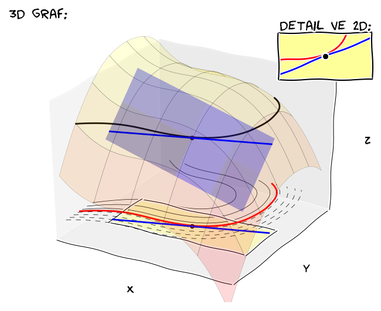

% Vektorová analýza
% Robert Mařík
% 2014-2019

# Vektorová analýza

* Studujeme funkce $\mathbb{R}^2\to\mathbb{R}^2$ nebo $\mathbb{R}^3\to\mathbb{R}^3$.
* Bodům v rovině jsou přiřazeny vektory. Můžeme interpretovat jako rychlostní pole nebo silové pole. 
* 2D: $\vec F:\mathbb {R}^2 \to \mathbb {R}^2$, ve složkách píšeme
  $$ \vec F = (P, Q) = P\vec i + Q\vec j,$$ kde $P$ a $Q$ jsou (skalární) funkce dvou proměnných.
* 3D: $\vec F:\mathbb {R}^3 \to \mathbb {R}^3$, ve složkách píšeme
  $$ \vec F = (P, Q, R) = P\vec i + Q\vec j + R\vec k,$$ kde $P$, $Q$ a $R$ jsou (skalární) funkce tří  proměnných.

# Příklady vektorových polí v rovině

* Homogenní pole $$\vec F_1=(0,-1)=-\vec j.$$ Každý vektor je stejný (směr i velikost).
* Radiální pole $$\vec F_2=(x,y)=x\vec i+y\vec j.$$ Každý vektor směřuje od počátku souřadnic.
* Rotující pole $$\vec F_3=(-y,x)=-y\vec i+x\vec j.$$ Je kolmé na radiální pole. Každý vektor je tečný ke kružnici se středem v počátku souřadnic. [Nakreslit online.](https://sagecell.sagemath.org/?z=eJyr0KlUsFUoSyzSUK_QqVTX5OVKBPILcvJL4stSk0vyi-LTMlNzUjQ0gLKaOgpAStdYxxjEqoSxkvNz8ots1ZNySlNB-pOw69et1KnAb0BRagpIf3FGfrlGooK2QpKOQmJxAdCQ-KLEksx8W0NNAAglMj4=&lang=sage)
* Radiální pole s konstantní velikostí vektorů $$\vec
  F_4=\frac{\vec F_2}{|\vec F_2|}=\frac{(x,y)}{\sqrt{x^2+y^2}}=\frac{x\vec i +y\vec j}{\sqrt{x^2+y^2}}.$$ Každý vektor směřuje od počátku
  souřadnic a má jednotkovou délku.
* Radiální pole ubývající s kvadrátem vzdálenosti od počátku a mířící
  do středu $$\vec F_5=-\frac{\vec
  F_4}{x^2+y^2}=-\frac{x \vec i+y\vec j}{(x^2+y^2)^{3/2}}.$$ S druhou mocninou ve jmenovateli ubývá například  3D gravitační pole nebo elektrostatické pole generované
  hmotným bodem nebo koulí.
* Rychlost při proudění vazké tekutiny ubývá směrem ke
  stěnám. Tekutinu proudící doprava je možné pro $y\in [0,1]$
  modelovat vektorovým polem $$\vec F_6=(y(1-y),0)=y(1-y)\vec i.$$

# Divergence

* Pro vektorovou funkci $$\vec F=(P,Q,R)=P\vec i + Q\vec j + R\vec k,$$ kde $P$, $Q$ a $R$ jsou funkce tří proměnných $x$, $y$ a $z$ definujeme
  divergenci vztahem
	  $$\mathop{\mathrm{div}}\vec F=\nabla\cdot\vec F=\frac{\partial P}{\partial x}+\frac{\partial Q}{\partial y}+\frac{\partial R}{\partial z}.$$
* Pro vektorovou funkci dvou proměnných definujeme divergenci analogicky, pouze chybí třetí člen. [Online výpočet a obrázek.](https://sagecell.sagemath.org/?z=eJyNUstqwzAQvBv8D0uS1jJRipO7rv2JOhjFlhOBbBn5USkh_96V4iZpoVBh0K52RqOdtaWOntnEDUksODgnaRzFUU2sP08Z2Thq145mKeBaQivaUemJg9EDLwVIqOQkzFG0pYij5U_ezAq8G-sPsN-_sQ_wLAH-QbaRLQXbcEvBhdhhDAw2Wwr4hc0DUaFmpJJ1TeqPbE9tup6T7Z66e7Lbo3D61sumU7J2RT0qRbD1cjTq8S7YPLjnZ65L6b22exbJPPBRy541tx4Iwd_-pD_JaWgUMYtVfhBH2V64ksdWVFfIJ1HC-yuDlx7yHPI4Qlfyhg8n3V3CbpoL9nm9_guJNt6RwDxStNVdbbV4CSyi-CAswd4Zds_8T4EGUbgde1d_V-bS7NhzDZdvslN6KFB30KaopVAVCY7M06bekDnG2zAKM_Yj9qmjYczulvK-w3sKwwepGY661EoblhzUKJL0C_Io15w=&lang=sage)
* Použití:
    * Divergence je tok vektorového pole přes hranici infinitezimálního objemu v daném místě, vztažený na jednotku objemu.
    * Vektorové pole, jehož divergence je rovna nule, se nazývá
      **nezřídlové pole**. Siločáry nezřídlového pole nikde nezačínají ani nekončí a jsou
      to uzavřené křivky. Stacionární magnetické pole je nezřídlové (rozříznutím tyčového magnetu vzniknou dva magnety, nevznikne samostatný jižní pól a severní pól magnetu.)
    * Rovnice kontinuity. $$\frac{\partial \rho}{\partial t}+\mathop{\mathrm{div}}\vec j = s$$
    * Je-li $\vec F=\nabla f$, potom platí $$\mathop{\mathrm{div}}\vec
      F = \frac{\partial ^2 f}{\partial x^2}+\frac{\partial ^2
      f}{\partial y^2}=\nabla^2 f,$$ tj. divergence gradientu je
      Laplaceův operátor.
	
<!-- 	 -->

\newpage

# Rotace

* Pro vektorovou funkci tří proměnných  $$\vec
  F=P\vec
  i+Q\vec j+R\vec k$$ definujeme operátor rotace symbolicky
  vztahem
  $$
  \mathop{\mathrm{rot}} \vec F=\nabla \times \vec F=
  \begin{vmatrix}
    \vec i & \vec j &\vec k\\
    \frac{\partial }{\partial x}   & \frac{\partial }{\partial y} &   \frac{\partial }{\partial z}\\ P &Q &R
  \end{vmatrix}.
  $$
* Výsledkem rotace je tedy vektor, jehož komponenty jsou $$\mathop{\mathrm{rot}}\vec
  F=\left(\frac{\partial R}{\partial y}-\frac{\partial
    Q}{\partial z}\right)\vec i +\left( \frac{\partial P}{\partial z}-\frac{\partial
    R}{\partial x}\right)\vec j + \left( \frac{\partial Q}{\partial x}-\frac{\partial
    P}{\partial y}\right)\vec k.$$  
* Použití:
    * Vektorové pole, jehož rotace je rovna nulovému vektoru se nazývá
      **nevírové pole** a ve fyzice má důležité postavení - je v něm
      možno zavést potenciál a potenciální energii.
    * Faradayův zákon elektromagnetické indukce.    $$  \mathop{\mathrm{rot}}\vec E=-\frac{\partial \vec B}{\partial t}$$
    * Představme si vektorové pole charakterizující rychlost proudící tekutiny. Rotace udává,
      zda má pole tencenci uvést do rotace objekt unášený tímto
      prouděním. Nejedná se tedy o to, zda se pole točí či nětočí jako
      u víru při vypouštění umyvadla. Příkladem je přímý tok v řece,
      kdy rychlost u břehu klesá. V důsledku toho se loďka, která
      odrazí od břehu kolmo stočí po proudu. Mimo středovou osu má pole nenulovou
      rotaci, i když ve všech bodech míří stejným směrem.  [Online výpočet.](https://sagecell.sagemath.org/?z=eJyNUkFuwyAQvEfKH1ZRUkNLWrvqqRLXfqKOLBJDggTGwk4KifL3ArbsKqdyMLvMeAdm1xFPrvTCLMoceLhmeLlYLgRy8RxTlBP3jIqtwy_F2wfJE-q0bAg4zRwBn2IfYqCQEyhI-kZaLS-ColoKgcR3viOhxpgUO-Kn5H0XhPBrJ3WrpPCVOCuFgs7hbNV0D81apJje1wzcp3skk3K5gMeFYFa74u2s5jGBOXMTlEfeBOWRuJ1LOAw4vb47mR906rVCdrUu9_womxtT8tjw-g7lhR_g64nCpoOyhOFepWb9ybS3tFt9C8bc7_9iWtNPTKCRyZt6UluvNumv4EzPHQpm0WAXjQ0NjhIYjmMbHpERGi3-i-Hhka0yfRV0e2MrIbmqUbIktSPHJDoyxqFaiNJIxImIqSdpKvyQsq4NdSrLemloGI-DUcbSbK_OPMO_ltbCEQ==&lang=sage)
* Pozor: anglický výraz pro rotaci je "curl".

<!-- 	 -->
--------

# Rotace významných polí

* Dostředivé pole ubývající s libovolnou mocninou vzdálenosti má nulovou rotaci. Pro $$\vec F(x,y)=-\frac{x\vec i +y \vec j}{(x^2+y^2)^n}$$ platí $$\mathop{\mathrm{rot}} \vec F(x,y)=0.$$ [Online výpočet.](https://sagecell.sagemath.org/?z=eJyr0KnUybMtSyzSUK9QqFTIU9fk5XLTqNCp1LTV0K3Q16iIM9KujDPSjMvT0a1E4RoAVRZn5JdrQJTDeBoKKZlpaRpu0YaxYHGdCk1dqIgBVKRSU0FTrzgztyAnM60yPq00J0cDKAIAmQYn8A==&lang=sage)

* Rotace pole kolmého na dostředivé pole závisí na mocnině, se kterou toto pole ubývá. Pro $$\vec F(x,y)=\frac{-y\vec i +x\vec j}{(x^2+y^2)^n}$$ platí $$\mathop{\mathrm{rot}} \vec F(x,y)=-\frac{2(n-1)}{(x^2+y^2)^n}\vec k.$$ Všechna tato pole rotují (ve smyslu celkového pohybu) proti směru hodinových ručiček, rotace (ve smyslu operátoru rotace) je však jednou kladná a jednou záporná, podle znaménka výrazu $n-1$. Pokud bychom takovým polem nechali unášet drobný míček, v jednom případě by jej pole otáčelo po směru a v jiném případě proti směru hodinových ručiček. Pro $n=1$ by se míček neroztočil okolo vlastní osy vůbec. [Online výpočet.](https://sagecell.sagemath.org/?z=eJyr0KnUybMtSyzSUK9QqFTIU9fk5XLTqNCp1LTV0K3U16iIM9KujDPSjMvTqUDhGQAVFmfkl2tAVMN4GgopmWlpGm7RhrFgcZ0KTV2oiAFUpFJTQVOvODO3ICczrTI-rTQnRwMoAgB8XCfD&lang=sage) [Nakreslit online.](https://sagecell.sagemath.org/?z=eJztVNFOwjAUfV-yf7iJmLWzDIEXQjL_AoIhxJRRsLHrZtdp-_e2hQVZUJ-N3jXr3T1n3d3pSXlZV0qDbMvaAm1A1nHEj7WS6lpUWvBtVlufebwWOo78teeH3D1kbm4VQ2OCZmSGMcQRNZCDK2eHgiIcR55lXoqdz-PIlFwSMCU1BGzIbRneGE4JuBEmT3SI4CXXDhqPJgTus3EcNc_VO3rWpUDJQOa3zSC5FVQzgyTGYfkd28Nub5AhFs9BMd0qCWhoR8ik6eTOuhtOU4k7pu0xzXXii2KN4PqCfCY-hEZP3xeaupbvs0kcrcgjWZBlvt6QbgTpKgUGuHRiZ1RReWDosyphCTyPI3DhufaSe1atx_XBe72eER-ru3xtNpe1R1ezvdrC1ToVe9AyQLaDjtv72vI3ptDpfwkUlahUnmwT7O2QNUw_0aZmhUYJe22pSAgkO6qp0y05OSTsbJDw5npMj777bAsCYy_zj6b4DbbwGhRif5Tg3yHfOuQLj_Ts4c6MSTb9t8efsscHFNPTYw==&lang=sage)

# Rotace gradientu je nulový vektor

Buď $\varphi(x,y,z):\mathbb{R}^3\to\mathbb{R}^3$ skalární funkce a buď $\vec F(x,y,z)=\nabla \varphi(x,y,z)$. Vypočtěte $\mathop{\mathrm{rot}}\vec F$.

*Řešení.* 
$$\begin{aligned}
\vec F
&=\left( \frac{\partial\varphi}{\partial x},\frac{\partial\varphi}{\partial y},\frac{\partial\varphi}{\partial z}\right)\\
\mathop{\mathrm{rot}}\vec F
&=\begin{vmatrix}
    \vec i & \vec j &\vec k\\
    \frac{\partial }{\partial x}   & \frac{\partial }{\partial y} &   \frac{\partial }{\partial z}\\
\frac{\partial\varphi}{\partial x} &\frac{\partial\varphi}{\partial y} &\frac{\partial\varphi}{\partial z}
\end{vmatrix}
\\&=
\vec i \left( \frac{\partial}{\partial y}\frac{\partial\varphi}{\partial z} - \frac{\partial}{\partial z}\frac{\partial\varphi}{\partial y} \right)
+
\vec j \left( \frac{\partial}{\partial z}\frac{\partial\varphi}{\partial x} - \frac{\partial}{\partial x}\frac{\partial\varphi}{\partial z} \right)
+
\vec k \left( \frac{\partial}{\partial x}\frac{\partial\varphi}{\partial y} - \frac{\partial}{\partial y}\frac{\partial\varphi}{\partial x} \right)
\end{aligned}
$$
Podle Schwarzovy věty (nezáleží na pořadí derivování) je každá závorka rovna nule. Proto platí $\mathop{\mathrm{rot}}\vec F=0$.

> Rotace gradientu je nulový vektor.

# Divergence rotace je nula

Buď $\vec F:\mathbb{R}^3\to\mathbb{R}^3$ hladké vektorové pole. Vypočtěte $\mathop{\mathrm{div}}(\mathop{\mathrm{rot}} \vec F)$

*Řešení.* $$\vec F=P\vec i+Q\vec j + R\vec k$$

  $$
  \mathop{\mathrm{rot}} \vec F=\nabla \times \vec F=
  \begin{vmatrix}
    \vec i & \vec j &\vec k\\
    \frac{\partial }{\partial x}   & \frac{\partial }{\partial y} &   \frac{\partial }{\partial z}\\ P &Q &R
  \end{vmatrix}
  =\left(\frac{\partial R}{\partial y}-\frac{\partial
    Q}{\partial z}\right)\vec i +\left( \frac{\partial P}{\partial z}-\frac{\partial
    R}{\partial x}\right)\vec j + \left( \frac{\partial Q}{\partial x}-\frac{\partial
    P}{\partial y}\right)\vec k.$$  

Použijeme definici divergence, větu o derivaci součtu a přeskupíme sčítance.
  $$
\begin{aligned}  \mathop{\mathrm{div}} (\mathop{\mathrm{rot}} \vec F )&=
\frac{\partial }{\partial x}\left(\frac{\partial R}{\partial y}-\frac{\partial
    Q}{\partial z}\right) +
    \frac{\partial }{\partial y}\left( \frac{\partial P}{\partial z}-\frac{\partial
    R}{\partial x}\right) +
    \frac{\partial }{\partial z} \left( \frac{\partial Q}{\partial x}-\frac{\partial
    P}{\partial y}\right)
\\
  &=\frac{\partial }{\partial x}\frac{\partial R}{\partial y}
  - \frac{\partial }{\partial x}   \frac{\partial
    Q}{\partial z}
    +\frac{\partial }{\partial y} \frac{\partial P}{\partial z}- \frac{\partial }{\partial y}\frac{\partial
    R}{\partial x} + 
\frac{\partial }{\partial z} \frac{\partial Q}{\partial x}-\frac{\partial }{\partial z}\frac{\partial
    P}{\partial y}
\\
  &=\frac{\partial }{\partial x}\frac{\partial R}{\partial y}
    - \frac{\partial }{\partial y}\frac{\partial R}{\partial x}
    +\frac{\partial }{\partial y} \frac{\partial P}{\partial z}
    -\frac{\partial }{\partial z}\frac{\partial P}{\partial y}
    + \frac{\partial }{\partial z} \frac{\partial Q}{\partial x}
    - \frac{\partial }{\partial x}   \frac{\partial Q}{\partial z}
    \end{aligned}$$  

Podle Schwarzovy věty platí
$$
\frac{\partial }{\partial x}\frac{\partial R}{\partial y} = \frac{\partial }{\partial y}\frac{\partial R}{\partial x}
$$
$$
\frac{\partial }{\partial x}\frac{\partial Q}{\partial z} = \frac{\partial }{\partial z}\frac{\partial Q}{\partial x}
$$
$$
\frac{\partial }{\partial y}\frac{\partial P}{\partial z} = \frac{\partial }{\partial z}\frac{\partial P}{\partial y}
$$

Odsud dostáváme 
  $$
  \mathop{\mathrm{div}} (\mathop{\mathrm{rot}} \vec F ) 
 =0.$$

> Divergence rotace je nula. 

\iffalse

# Mocnina se kterou ubývá nezřídlové vektorové pole (1/2)

Pro jaké $n$ má vektorové pole 
$$\vec F=\frac{1}{(x^2+y^2+z^2)^n} (x,y,z)$$
nulovou divergenci?

*Řešení.* Použijeme variantu vzorce pro derivaci součinu ve tvaru 
$$\nabla(f\vec G)=f\nabla\vec G +\vec G\nabla f.$$

Pro $f=\frac{1}{(x^2+y^2+z^2)^n}$ dostáváme
$$\frac{\partial f}{\partial x}=-n(x^2+y^2+z^2)^{-n-1}2x=-\frac {2nx}{(x^2+y^2+z^2)^{n+1}}$$
a analogicky dostaneme derivace podle dalších proměnných, tj. 
$$\frac{\partial f}{\partial y}=-\frac {2ny}{(x^2+y^2+z^2)^{n+1}}$$
a
$$\frac{\partial f}{\partial z}=-\frac {2nz}{(x^2+y^2+z^2)^{n+1}}.$$
Odsud dostáváme gradient $$\nabla f= -\frac {2n}{(x^2+y^2+z^2)^{n+1}} (x,y,z).$$

# Mocnina se kterou ubývá nezřídlové vektorové pole (2/2)

Pro $\vec G=(x,y,z)$ dostáváme snadno divergenci $\nabla \vec G = 1+1+1=3$.

Odsud
$$\begin{aligned}\nabla \vec F & = \nabla(f\vec G) \\&= \frac {1}{(x^2+y^2+z^2)^n} 3 - (x,y,z)  \frac {2n}{(x^2+y^2+z^2)^{n+1}} (x,y,z) 
 \\&= \frac {3}{(x^2+y^2+z^2)^n} -   \frac {2n (x^2+y^2+z^2)}{(x^2+y^2+z^2)^{n+1}}
\\&= \frac {3-2n}{(x^2+y^2+z^2)^n}.
\end{aligned}$$

Divergence je nulová pro $n=\frac 32.$ V tomto případě máme $$\vec
F=\frac{1}{x^2+y^2+z^2} \cdot \frac{(x,y,z)}{\sqrt{x^2+y^2+z^2}}$$ a
velikost vektorového pole je nepřímo úměrná druhé mocnině vzdálenosti
od počátku.

* Není náhoda, že v našem trojrozměrném světě ubývá gravitační a elektrická síla nepřímo úměrně druhé mocnině vzdálenosti.
* Postavy ve 2D světě mohou takto objevit existenci třetího rozměru (viz román Flatland nebo Simpsonovi a [Homer 3D](https://www.youtube.com/watch?v=wjJI0VlaSLg)). Pozorovaný gravitační zákon by nesouhlasil s teoretickými výpočty.

# Shrnutí diferenciálních operátorů

* **Skalární funkce $f(x,y,z)$**

|Operátor        |Výpočet                                                                         |
|----------------|------------------------------------------------------------------------------------|
| Gradient | $\mathop{\mathrm{grad}} f=\nabla f=\left(\frac{\partial f}{\partial x}, \frac{\partial f}{\partial y} , \frac{\partial f}{\partial z} \right)$ |
| Totální diferenciál |  $\mathrm{d}f =\nabla f\cdot(\mathrm{d}x, \mathrm{d}y, \mathrm{d}z)     =\frac{\partial f}{\partial x}\mathrm{d}x+\frac{\partial f}{\partial y}\mathrm{d}y+ \frac{\partial f}{\partial z} \mathrm{d}z$|
|Laplaceův operátor | $\nabla^2 f=\nabla \cdot(\nabla f)=\frac{\partial^2 f}{(\partial x)^2} + \frac{\partial^2 f}{(\partial y)^2}+ \frac{\partial^2 f}{(\partial z)^2}$ |
| Lin. aproximace | $f(x,y,z)\approx f(x_0,y_0,z_0)+\nabla f(x_0,y_0,z_0)\cdot(x-x_0, y-y_0, z-z_0)$ |

* **Vektorová funkce $\vec F(x,y,z)=P(x,y,z)\vec i+Q(x,y,z)\vec j + R(x,y,z)\vec k$**

|Operátor        |Výpočet                                                                         |
|----------------|------------------------------------------------------------------------------------|
| Divergence | $\mathop{\mathrm{div}}\vec F=\nabla\cdot\vec F=\frac{\partial P}{\partial x}+\frac{\partial Q}{\partial y}+\frac{\partial R}{\partial z}$ |
| Rotace | ${  \mathop{\mathrm{rot}} \vec F=\nabla \times \vec F=   \begin{vmatrix}     \vec i & \vec j &\vec k\\     \frac{\partial }{\partial x}   & \frac{\partial }{\partial y} &   \frac{\partial }{\partial z}\\ P &Q &R   \end{vmatrix}}$ |

* Případy pro jiný počet proměnných a jiné dimenze vektorů dostaneme
  analogicky, s výjimkou rotace.
* Rotace má smysl pouze pro trojrozměrné
  vektory. Někdy však může být užitečné přidat k dvourozměrnému vektoru
  třetí komponentu, která je nulová.
* Někdy je možné se setkat i s aplikací operátorů definovaných pro
  skalární funkce (derivace, gradient, Laplaceův operátor) na vektorové
  funkce. V tomto případě je touto operací zamýšlena aplikace na
  každou složku vektoru samostatně a takový zápis představuje tři
  nezávislé rovnice zapsané v jedné vektorové rovnici. Příkladem je Navierova-Stokesova rovnice níže.

# Popis pole

Následující popis je pro jednoduchost a konkrétnost proveden pro
gravitační pole. Je však plně obecný, pokud odpovídajícím způsobem
nahradíme příslušné veličiny a charakteristiky objektů.

* Skalární pole
    - Gravitační pole je úplně popsáno potenciálem (skalární veličina
      udávající potenciální energii tělesa o jednotkové hmotnosti)
    - Intenzita gravitačního pole je gradientem potenciálu vynásobeným
      číslem $-1$. (Intenzita gravitačního pole je síla působící v
      daném místě pole na objekt o jednotkové hmotnosti.)

* Vektorové pole  
    - Gravitační pole je úplně popsáno intenzitou gravitačního pole.
    - Potenciál gravitačního pole je možné ze zadané intenzity počítat hledáním totálního diferenciálu zpětným integrováním nebo pomocí křivkového integrálu druhého druhu (viz později v semestru).

# Ukázky použití - rovnice matematické fyziky 1/2

#### *Rovnice kontinuity* 

Zákon zachování veličiny která může vznikat, zanikat a téct, veličina
$\rho$ vyjadřuje prostorovou hustotu a $\vec j$ tok a $s$ intenzita
zdrojů a spotřebičů. Jejími některými makroskopickými důsledky jsou
první Kirchhofův zákon nebo rovnice spojitosti v hydrodynamice.

$$    
\frac{\partial\rho}{\partial t}+\nabla \vec j=s
$$

#### *Rovnice difuze, rovnice vedení tepla* 

Tato rovnice rovněž vystihuje chování difundující látky v trojrozměrné
oblasti. Jedná se vlastně o rovnici kontinuity doplněnou o předpoklad,
že intenzita toku je úměrná gradientu. Nejjednodušší tvar má tato
rovnice v homogenním izotropním prostředí.

$$
  \frac{\partial u}{\partial t}-D\nabla^2 u=\sigma
$$

Rovnice difuze se může týkat i popisu jiné veličiny, než veličiny
bezprostředně spojené s pohybem látkového prostředí. Například takto
můžeme sledovat vedení tepla, nebo při zpracování fotografí změny v
jasu sousedních bodů.

Všimli jste si, že sice existují zvířata, jejichž srst má skvrny na
těle a pruhy na ocase, ale žádné zvíře nemá kresbu srsti naopak? Pokud
má srst zvíře pruhy na těle, je pruhovaný i ocas. I toto plyne z
rovnice difuze.

#### *Navierova-Stokesova rovnice*

Rovnice popisující proudění viskozní Newtonovské tekutiny. Jeden z
[Millennium Prize
Problems](http://en.wikipedia.org/wiki/Millennium_Prize_Problems).

$$ 
\frac{\partial \vec v}{\partial t}+(\vec v\cdot \nabla) \vec v
  =g-\frac{\nabla p}{\rho}+\mu\nabla^2\vec v 
$$

# Ukázky použití - rovnice matematické fyziky 2/2

#### *Maxwellovy rovnice* 

Úplně popisují elektromagnetické vlnění. Jejich důsledkem jsou
(přidáme-li materiálové vztahy) například zákon odrazu a lomu světla,
polarizace světla.

$$
\begin{aligned}
      \mathop{\mathrm{div}}\vec E&=\frac{\rho}{\epsilon_0}&&&
      \mathop{\mathrm{div}} \vec B&=0\\
      \mathop{\mathrm{rot}}\vec E&=-\frac{\partial \vec B}{\partial t}&&&
      \mathop{\mathrm{rot}}\vec B&=\mu_0\vec j+\mu_0\epsilon_0\frac{\partial\vec E}{\partial t}
\end{aligned}
$$

#### *Vlnová rovnice* 

Popisuje vlnění, stojaté i postupné vlny. Pro elektromagnetickou vlnu
jde rovnice odvodit z Maxwellových rovnic.

$$
\frac 1{c^2}\frac{\partial^2 z}{\partial t^2}=\nabla^2 z
$$

#### *Schrödingerova rovnice* 

Základní rovnice kvantové mechaniky, popisuje chování částice v
potenciálovém poli $V$, řešením je vlnová funkce částice $\psi$.

$$
  i\hbar\frac{\partial\psi}{\partial t} = -\frac{\hbar}{2m}\nabla^2 \psi +V\psi 
$$

\fi

<!--

# Shrnutí vzorců pro výpočty

|Úloha                                                          |Postup                                                                              |
|---------------------------------------------------------------|------------------------------------------------------------------------------------|
|Najdi směr kolmý na vrstevnice funkce $f(x,y)$ v bodě $(x_0,y_0)$.| $\nabla f(x_0,y_0)$ |
|Najdi tečnu k vrstevnici funkce $f(x,y)$ v bodě $(x_0,y_0)$.| $\nabla f(x_0,y_0)\cdot(x-x_0,y-y_0)=0$ |
|Najdi tečnu k funkci dané implicitně rovnicí $f(x,y)=0$ v bodě $(x_0,y_0)$.| Totéž co předchozí případ. Musí navíc platit $f(x_0,y_0)=0$.|
|Najdi tečnou rovinu ke grafu funkce $f(x,y)$ v bodě $(x_0,y_0)$.| $z=f(x_0,y_0)+\nabla f(x_0,y_0)\cdot(x-x_0,y-y_0)$ |
|Najdi lineární aproximaci funkce $f(x,y)$ v okolí bodu $(x_0,y_0)$.| $f(x,y)\approx f(x_0,y_0)+\nabla f(x_0,y_0)\cdot(x-x_0,y-y_0)$ |
|Je $M\mathrm{d}x+N\mathrm{d}y$ totální diferenciál?| Platí následujíci vztah? $\frac{\partial M}{\partial y}=\frac{\partial N}{\partial x}$|
|Je možno psát funkci $\varphi(x,y)$ ve tvaru $f(x)g(y)$ pro vhodné funkce $f$ a $g$?|Platí následujíci vztah? $\varphi \frac{\partial^2 \varphi}{\partial x \partial y}-\frac{\partial \varphi}{\partial x}\frac{\partial \varphi}{\partial y}=0$|

Použité označení:

* Výraz $\nabla f(x_0,y_0)$ je gradient v bodě $(x_0, y_0)$. Je nutno zderivovat funkci $f$, sestavit gradient v bodě $(x,y)$ a dosadit $x=x_0$ a $y=y_0$.
* Operace $(a,b)\cdot (c,d)=ac+bd$ je skalární součin vektorů.

# Proč je gradient kolmý na vrstevnice?

Buď $z=f(x,y)$ funkce dvou proměnných a $\nabla f(x,y)$ její
gradient. Odvodíme vztah mezi vrstevnicemi a gradientem.

* Uvažujme bod $[x_0,y_0, f(x_0,y_0)]$ na grafu funkce $f(x,y)$ a vrstevnici
  procházející bodem $[x_0,y_0]$. Tuto vrstevnici napíšeme jako parametrickou
  křivku $$\begin{aligned}x&=x(t)\\y&=y(t)\end{aligned}$$
* Složená funkce $$F(t)=f(x(t),y(t))$$ je podél naší křivky konstantní
  (křivka je vrstevnicí a podél vrstevnice jsou konstantní funkční
  hodnoty)
* Platí $$\frac{\mathrm{d}F}{\mathrm{d}t}=0$$
  (derivace konstantní funkce je nula)
* Platí $$\frac{\mathrm{d}F}{\mathrm{d}t}= \frac{\partial f}{\partial x}\frac{\mathrm{d}
  x}{\mathrm{d} t}+\frac{\partial f}{\partial y}\frac{\mathrm{d}
  y}{\mathrm{d} t} $$ (derivace složené funkce více proměnných)
* Platí 
  $$\begin{aligned}0=\frac{\mathrm{d}F}{\mathrm{d}t}&=
  \left(\frac{\partial f}{\partial x}, \frac{\partial f}{\partial
  y}\right)\cdot\left(\frac{\mathrm{d} x}{\mathrm{d} t},
  \frac{\mathrm{d} x}{\mathrm{d} t}\right) \\&= \nabla
  f(x,y)\cdot(x'(t),y'(t))\end{aligned}$$ (derivace konstanty z
   předešlého bodu, definice sklárního součinu, definice gradientu,
   zkrácené označení pro derivace funkce
  jedné proměnné)
* Vektory $\nabla f(x,y)$ a $(x'(t),y'(t))$ jsou kolmé (jejich
  skalární součin je nula). Zbývá zjistit, jak vypadá vektor
  $(x'(t),y'(t))$.

-----

### Vztah mezi gradientem a vrstevnicemi

Z předchozího plyne

* Gradient je kolmý na vektor $(x'(t),y'(t))$
* Vektor $(x'(t),y'(t))$ je tečný k vrstevnici

Tedy gradient v daném bodě je kolmý na vrstevnici procházející tímto
bodem.

# Implicitně definovaná funkce 

Mějme funkci $f(x,y)$ dvou proměnných a její vstevnici na úrovni $C$
$$f(x,y)=C. \tag{1}$$ Tato rovnice za jistých okolností může definovat $y$
jako funkci proměnné $x$. Pokusíme se najít derivaci této funkce. K
tomu uvažujme bod $(x_0,y_0)$ ležící na této vrstevnici,
tj. $f(x_0,y_0)=C$.

* Rovnice tečné roviny v bodě $(x_0,y_0)$ je
  $$ z=f(x_0,y_0)+\nabla f(x_0,y_0)\cdot (x-x_0,y-y_0).$$
* Řez grafu rovinou $z=f(x_0,y_0)$ je vrstevnice na úrovni $C$, řez tečné roviny je tečna k vrstevnici v rovině $z=C$. Rovnice této tečny je 
  $$ C=f(x_0,y_0)+\nabla f(x_0,y_0)\cdot (x-x_0,y-y_0),$$
  tj.
  $$ 0=\nabla f(x_0,y_0)\cdot (x-x_0,y-y_0),$$

 

<a href="animation.gif" rel="facebox" alt="Nahrava se ...">Animace</a>

# Implicitně definovaná funkce  (pokračování)

* Normálový vektor tečny je 
  $$ \nabla f(x_0,y_0)=\left(\frac{\partial f}{\partial x}(x_0,y_0), \frac{\partial f}{\partial y}(x_0,y_0)\right),$$
  k němu kolmý je vektor
  $$ \left(-\frac{\partial f}{\partial y}(x_0,y_0), \frac{\partial f}{\partial x}(x_0,y_0)\right)$$
  a po znormování první kompenty dostáváme směrový vektor tečny ve tvaru 
  $$ \left(1, -\frac{\frac{\partial f}{\partial x}(x_0,y_0)}{\frac{\partial f}{\partial y}(x_0,y_0)}\right).$$
  Druhá komponenta tohoto vektoru je derivací funkce, která je dána implicitně rovnicí (1).
  To vše za podmínky, že první komponenta normálového vektoru je nenulová.
* Poznámka: bez újmy na obecnosti většinou při definici implicitní funkce bereme $C=0$. Vskutku,
  pokud definujeme $g(x,y)=f(x,y)-C$, potom je možno rovnici
  vrstevnice funkce $f$ na úrovni $C$ přepsat do tvaru $$g(x,y)=0. $$

 

# Implicitně definovaná funkce  (závěr)

>  **Věta o implicitní funkci**: Uvažujme funkci $f(x,y)$ dvou proměnných, splňující v nějakém bodě
>  $(x_0, y_0)$ podmínku $f(x_0, y_0)=0$ a mající v okolí bodu $(x_0,
>  y_0)$ spojité parciální derivace.
>  Rovnice $$f(x,y)=0$$ vrstevnice na úrovni $0$ popisuje křivku
>   procházející bodem $(x_0, y_0)$.
>
> * Platí-li $$\frac{\partial f}{\partial y}(x_0, y_0)\neq 0,$$ je rovnicí
>    $f(x,y)=0$ v okolí bodu $(x_0, y_0)$ implicitně určena
>    **právě jedna spojitá funkce** $y=g(x)$ (tj. vrstevnice je
>    v okolí bodu $(x_0, y_0)$ grafem nějaké spojité funkce $g$).
> * Funkce $g$ z předchozího bodu **má v $x_0$ derivaci**
>   $$
>      g'(x_0)=-\frac{\frac{\partial f}{\partial x}(x_0, y_0)}{\frac{\partial f}{\partial y}(x_0, y_0)}.
>   $$

 

# Separace proměnných

Některé funkce dvou proměnných je možno zapsat jako součin dvou funkcí
jedné proměnné, například $\varphi(x,y)=\sin(x^2+1)\frac{\ln y}{y}$. U některých funkcí toto možné není, například funkce
$\varphi(x,y)=x^2-y^2$. Pomocí parciálních derivací je možno podat
jednoduchou charakterizaci všech funkcí, majících výše uvedenou
vlastnost.

>  **Věta**: Nechť funkce dvou proměnných $\varphi(x,y)$ je nenulová na konvexní
>  oblasti $G$ a má zde spojité všechny parciální derivace do řádu dva,
>  včetně.  Funkci $\varphi(x,y)$ je možno zapsat ve tvaru
>  $\varphi(x,y)=f(x)g(y)$, kde $f$ a $g$ jsou vhodné funkce jedné
>  proměnné právě tehdy, když je na množině $G$ nulový výraz 
>  $$
>    \varphi(x,y)\frac{\partial^2 \varphi (x,y)}{\partial y\partial x}-\frac{\partial \varphi (x,y)}{\partial x\vphantom{y}}\frac{\partial \varphi (x,y)}{\partial y}
>  $$
>   tj. pokud na množině $G$ platí $$\begin{vmatrix}\varphi & \frac {\partial \varphi}{\partial x}\\ \frac {\partial \varphi}{\partial y} &
> \frac {\partial^2 \varphi}{\partial x\partial y}\end{vmatrix}=0$$

 Naznačíme část důkazu. Pokud platí $$\varphi(x,y)=f(x)g(y),$$ je
  $$\ln \varphi(x,y)=\ln(f(x))+\ln(g(y)).$$ Derivací podle $x$ dostáváme
$$
    \frac {\frac{\partial }{\partial x}\varphi(x,y)}{\varphi (x,y)}=
    \frac{f'(x)}{f(x)}.
$$
  Protože pravá strana nezávisí na $y$, dostáváme derivováním podle $y$
$$
    \frac {\left(\frac{\partial^2 \varphi (x,y)}{\partial y\partial x}\right)\varphi(x,y)-\left(\frac{\partial \varphi (x,y)}{\partial x\vphantom{y}}\right)\left(\frac{\partial \varphi (x,y)}{\partial y}\right)}{\varphi^2(x,y)}=
    0
$$
  Výraz v čitateli je uveden v tvrzení věty.

# Lokální extrémy funkce více proměnných

Podobně jako pro funkce jedné proměnné definujeme i pro funkce více
proměnných **lokální extrémy** následovně: funkce má v daném
bodě **lokální minimum**, pokud v nějakém okolí tohoto bodu
neexistuje bod s menší funkční hodnotou a podobně, funkce má v bodě
**lokální maximum**, pokud v okolí tohoto bodu neexistuje bod
s vyšší funkční hodnotou. 

Funkce jedné proměnné určitě nemá v bodě lokální extrém, pokud má v
tomto bodě kladnou derivaci (protože potom funkce roste), nebo pokud
má v tomto bodě zápornou derivaci (protože potom funkce
klesá). Derivace v bodě kde nastává lokální extrém tedy musí být buď
nulová nebo nesmí existovat. Stejná myšlenková úvaha se dá provést pro
křivky vzniklé na řezech funkce dvou proměnných a proto platí
následující věta.

>  **Věta (Fermatova)**:
>  Jestliže funkce více proměnných má v nějakém bodě svůj lokální
>  extrém, pak každá parciální derivace, která v tomto bodě existuje,
>  je nulová.

 

-----

#### Lokální extrémy funkce více proměnných (pokračování)

 

 

-----

# Zákon šíření chyb  (chyba nepřímo měřené veličiny)

* V praxi často měříme nepřímo veličinu $f$ tak, že měříme veličiny
$x_1$, $x_2$, \dots, $x_n$ a hodnotu veličiny $f$ určíme pomocí vzorce
$f(x_1, x_2, \dots, x_n)$. 
* Měření každé z veličin je zatíženo
chybou. Je-li chyba veličiny $x_i$ rovna $\Delta x_i$, způsobí tato
odchylka to, že chyba veličiny $f$ bude (v souladu se vzorcem pro lineární aproximaci)
přibližně
$$
  \Delta f\approx \left|\frac{\partial f}{\partial x_i}\Delta x_i\right|
$$
* Celkovou chybu veličiny $f$ můžeme určit sečtením chyb způsobených
jednotlivými veličinami $x_i$. Častěji se však používá následující vzorec
$$
  \Delta f(x_1,x_2,\dots x_n)\approx\sqrt{\left(\frac{\partial f}{\partial x_1}\Delta x_1\right)^2+\left(\frac{\partial f}{\partial x_2}\Delta x_2\right)^2+\cdots+\left(\frac{\partial f}{\partial x_n}\Delta x_n\right)^2}
$$
označovaný **zákon šíření chyb**.

[Příklad](http://user.mendelu.cz/marik/akademie/sagecell.php?short=1&lang=sage&in=%23+Vlhkost+ve+dreve++http%3A%2F%2Fen.wikipedia.org%2Fwiki%2FEquilibrium_moisture_content%0D%0A%0D%0AM%28m%2Cmod%29%3D%28m-mod%29%2Fmod%0D%0A%0D%0A%0D%0Am_hodnota%3D3.6%0D%0Am_chyba%3D0.2%0D%0A%0D%0Amod_hodnota%3D2.2%0D%0Amod_chyba%3D0.1%0D%0A%0D%0Ahtml%28r%27%24%24M%3D%25s%24%24+%24%24m%3D%25s%5Cpm%25s%24%24+%24%24mod%3D%25s%5Cpm%25s%24%24%27%5C%0D%0A+++++%25%28latex%28M%28m%2C+mod%29%29%2Clatex%28m_hodnota%29%2C+latex%28m_chyba%29%2Clatex%28mod_hodnota%29%2C+latex%28mod_chyba%29%29%29%0D%0A%0D%0Aderivace_m%3DM.diff%28m%29.subs%28m%3Dm_hodnota%2C+mod%3Dmod_hodnota%29%28%29%0D%0Aderivace_mod%3DM.diff%28mod%29.subs%28m%3Dm_hodnota%2C+mod%3Dmod_hodnota%29%28%29%0D%0A%0D%0Ahodnota%3DM%28m_hodnota%2Cmod_hodnota%29+++%23+dosazeni%0D%0Achyba1%3Dabs%28derivace_m%2Am_chyba%29+%2B+abs%28derivace_mod%2Amod_chyba%29++++++++%23+diferencial%0D%0Achyba2%3Dsqrt%28%28derivace_m%2Am_chyba%29%5E2+%2B+%28derivace_mod%2Amod_chyba%29%5E2%29++++%23+zakon+sireni+chyb%0D%0A%0D%0Ahtml+%28%22Hodnota%3A+%25s%22%25hodnota%29%0D%0A%0D%0Ahtml+%28%22%3Chr%3E%22%29%0D%0A%0D%0Ahtml+%28%22Gradient%3A+%28%25s%2C%25s%29%22%25%28derivace_m%2C+derivace_mod%29+%29%0D%0Ahtml+%28%22Chyby%3A+%28%25s%2C%25s%29%22%25%28m_chyba%2C+mod_chyba%29+%29%0D%0Ahtml+%28%22Vliv+chyb+na+vysledek+%3A+%28%25s%2C%25s%29%22%25%28m_chyba%2Aderivace_m%2C+mod_chyba%2Aderivace_mod%29+%29%0D%0A%0D%0Ahtml+%28%22%3Chr%3E%22%29%0D%0A%0D%0Ahtml%28+%22Chyba+pomoci+diferencialu%3A+%25s%22%25chyba1+%29%0D%0A%0D%0Ahtml+%28%22%3Chr%3E%22%29%0D%0A%0D%0Ahtml%28+%22Chyba+pomoci+zakona+sireni+chyb%3A+%25s%22%25chyba2+%29%0D%0A)
(vzorec na výpočet vlhkosti dřeva podle [Wikipedie](http://en.wikipedia.org/wiki/Equilibrium_moisture_content)): $M=\frac{m-m_{od}}{m_{od}}$, $m=3.6\pm0.2$, $m_{od}=2.2\pm0.1$

-->