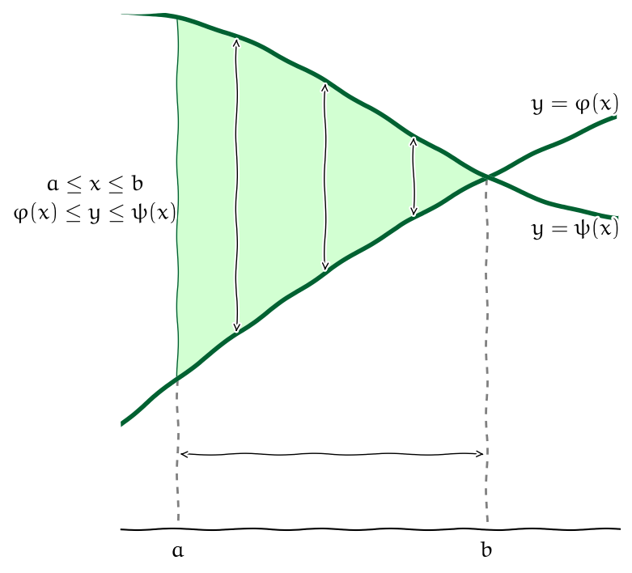
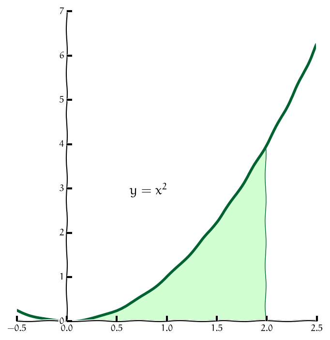
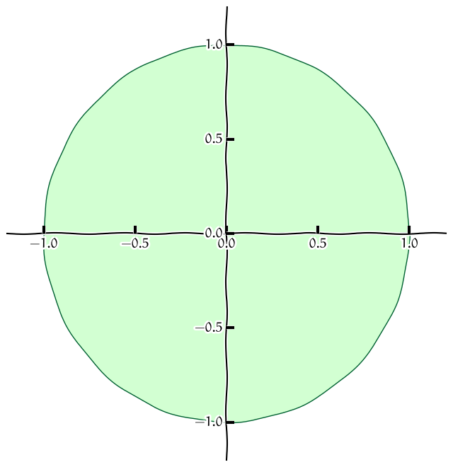
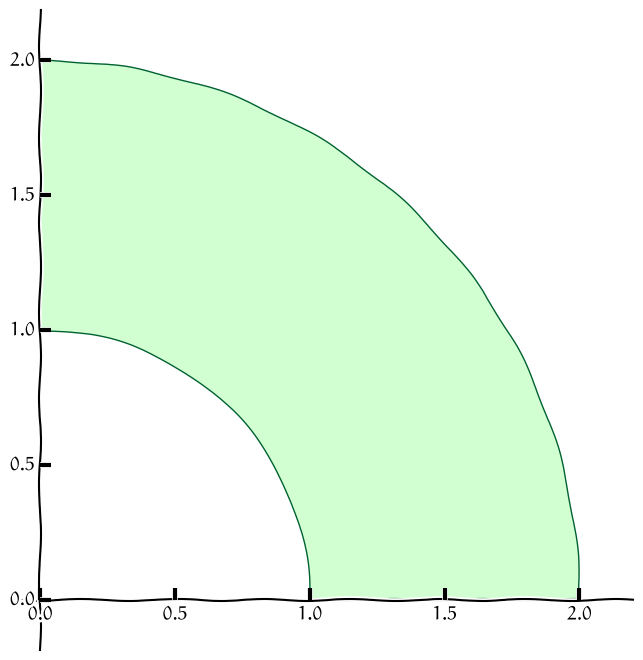
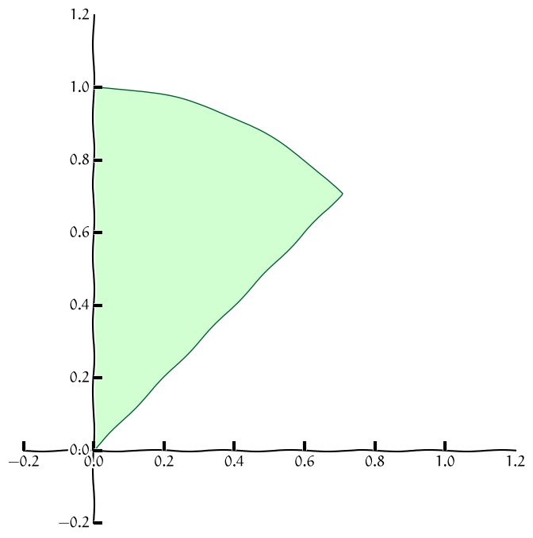

% Dvojný integrál
% Robert Mařík
% 2014 - 2019

# Dvojný integrál

Pro dvojný integrál použijeme podobnou myšlenkovou konstrukci jako u\ 
křivkového integrálu prvního druhu, pouze místo drátu s\ danou
lineární hustotou budeme uvažovat rovinnou ohraničenou desku s\ danou
plošnou hustotou.

* Pokud je hustota desky konstantní, je možno její hmotnost získat
  jednoduše jako součin plošné hustoty a obsahu.
* Pokud se hustota desky mění a v\ obecném bodě $(x,y)$ je dána funkcí
  $f(x,y)$, můžeme myšlenkově rozdělit desku na malé kousky, v\ rámci
  každého malého kousku hustotu aproximovat konstantou, vypočítat
  hmotnost každého kousku jako součin hustoty a obsahu a všechny
  hmotnosti sečíst.
* Získaná veličina je aproximací celkové hmotnosti.

V\ limitním přechodu kdy rozměry všech kousků na něž je deska dělena
jde k\ nule dostáváme **dvojný integrál** 
$$ \iint_\Omega f(x,y)\mathrm{d}x \mathrm{d}y , $$ 
kde $\Omega$ je oblast v\ rovině $(x,y)$ definovaná uvažovanou deskou. V aplikacích je častý též zápis
$$ \iint_\Omega f(x,y)\mathrm{d}A.$$ 

\def\maxfactor{0.3}

\iffalse

\fi

# Výpočet (oblast mezi funkcemi proměnné $x$)

V\ závislosti na tom, jakými nerovnostmi množinu $\Omega$ definujeme,
můžeme pro výpočet dvojného integrálu použít následující věty. Tyto
věty udávají, jak je možno dvojný integrál přepsat jako dvojnásobný
integrál. Mají název **Fubiniovy věty**.

> **Věta**: Nechť $f$ je funkce spojitá v\ uzavřené oblasti
> $$  
>   \Omega=\{(x,y)\in\mathbb{R}^2:{a\leq x\leq b}\text{ a }
>   {\varphi (x)\leq y\leq \psi (x)}\}.$$ 
> Potom 
> $$
>   \iint_{\Omega}f(x,y)\mathrm{d}x \mathrm{d}y ={\int_{a}^{b}}
>   \Bigl[ \int_{\varphi (x)}^{\psi(x)}   
>   f(x,y){\mathrm{d}y }\Bigr]{\mathrm{d}x }.
> $$

 

# Výpočet (oblast mezi funkcemi proměnné $y$)

> **Věta**: Nechť $f$ je funkce spojitá v\ uzavřené oblasti
> $$  \Omega=\{(x,y)\in\mathbb{R}^2:{a\leq y\leq b}\text{ a }
>   {\varphi (y)\leq x\leq
>   \psi (y)}\}.
> $$
> Potom 
> $$
>   \iint_{\Omega}f(x,y)\mathrm{d}x \mathrm{d}y ={\int_a^b}\Bigl[ 
>   {\int_{\varphi (y)}^{\psi(y)}}
>   f(x,y){\mathrm{d}x }\Bigr]{\mathrm{d}y }.
> $$
> 

# Záměna pořadí integrace

Často je možné oblast integrace zapsat pomocí obou možností uvedených
na předchozích slidech. Například oblast na obrázku je možno zapsat
buď jako
$$\begin{gathered}
0\leq x \leq 2\\
0\leq y\leq x^2
\end{gathered}$$
nebo
$$\begin{gathered}
0\leq y \leq 4\\
\sqrt{y}\leq x\leq  2.
\end{gathered}$$

Pro integrál funkce $f(x,y)$ přes takovou množinu tedy máme dvě alternativy:
$$\int_0^2 \int _0^{x^2} f(x,y)\;\mathrm{d}y\;\mathrm{d}x$$
a
$$\int_0^4 \int _{\sqrt y}^{2} f(x,y)\;\mathrm{d}x\;\mathrm{d}y.$$

Všimněte si, že nestačí prosté prohození integrálů. Je nutno
přepočítávat meze a hraniční křivky je nutno vyjádřit jednou jako
funkce proměnné $x$ a jednou jako funkce proměnné $y$. V důsledku
tohoto dochází v průběhu výpočtu dvěma různými způsoby k\ tomu, že
pracujeme se dvěma různými integrály. Výsledky jsou stejné, nemusí
však být dosažitelné srovnatelnou námahou, jedna z cest může být
snazší.

# Výpočet (obdélníková oblast)

Výše uvedené problémy se stanovením a případným přepočítáváním mezí
při záměně pořadí integrace se nevyskytují při integrování přes
obdélníkovou oblast.

>   **Věta**: Nechť $R=[a,b]\times[c,d]$ je uzavřený obdélník v $\mathbb{R}^2$ a
>   $f$ funkce definovaná a spojitá na $R$. Pak platí
>   $$    \begin{aligned}\iint_R f(x,y)\mathrm{d}x \mathrm{d}y 
>     &=
>     \int_a^b\Bigl[\int_c^d f(x,y)\mathrm{d}y \Bigr]\mathrm{d}x 
>     \\&=
>     \int_c^d\Bigl[\int_a^b f(x,y)\mathrm{d}x \Bigr]\mathrm{d}y .\end{aligned}
>   $$
> 
>   Platí-li dokonce rovnost $f(x,y)=g(x)h(y)$, pak
>   $$
>         \iint_R f(x,y)\mathrm{d}x \mathrm{d}y  =     \int_a^b g(x) \mathrm{d}x  \int_c^d h(y)\mathrm{d}y .
>   $$
> 

# Matematické aplikace dvojného integrálu

* **Obsah** $\mu(\Omega)$ množiny $\Omega$ vypočteme jako integrál
    $$\mu(\Omega)=\iint_\Omega \mathrm{d}x \mathrm{d}y.$$
* **Integrální střední hodnota** funkce $f(x,y)$ definované na množině
  $\Omega$ je 
  $$ \frac{\iint_\Omega f(x,y)\mathrm{d}x \mathrm{d}y }{\mu (\Omega)},$$ 
  kde $\mu (\Omega)=\iint_\Omega\mathrm{d}x\mathrm{d}y$ je obsah
  množiny $\Omega$.

# Fyzikální aplikace dvojného integrálu

* **Hmotnost** množiny $M$ je $$m=\iint_M \sigma(x,y)\mathrm{d}x
  \mathrm{d}y,$$ kde $\sigma(x,y)$ je **plošná hustota** (hmotnost
  vztažená na jednotku povrchu).
* **Lineární momenty** hmotné množiny $M$ vzhledem k\ osám $y$ a $x$
  jsou rovny $$\iint_M x\sigma(x,y)\mathrm{d}x \mathrm{d}y$$ a
  $$\iint_M y\sigma(x,y)\mathrm{d}x \mathrm{d}y.$$
* **Moment setrvačnosti** hmotné množiny $M$ vzhledem k\ ose je
  $$J=\iint_M \rho^2(x,y)\sigma(x,y)\mathrm{d}x \mathrm{d}y ,$$ kde
  $\rho(x,y)$ je vzdálenost bodu $(x,y)$ od osy otáčení. Například pro
  osu $x$ je $\rho(x,y)=y$ a pro osu $y$ je $\rho (x,y)=x$. Pro osu
  procházející kolmo počátkem je $\rho(x,y)=\sqrt{x^2+y^2}$.

# Fyzikální aplikace dvojného integrálu (pokračování)

* **Souřadnice těžiště** množiny jsou podílem lineárních momentů a
  celkové hmotnosti množiny.
* **Kvadratický moment průřezu** (což je moment setrvačnosti pro
  $\sigma(x,y)=1$, anglicky *second moment of area*) je veličina,
  která hraje podstatnou roli v\ mechanice (nábytek, stavby) při
  dimenzování (polic, nosných tyčí, nosníků).
* Vzorce pro obsah $x$-ovou souřadnici těžiště ($x_0$), $y$-ovou
  souřadnici těžiště ($y_0$), kvadratický moment vzhledem k\ ose $x$
  ($I_x$) a kvadratický moment vzhledem k\ ose $y$ ($I_y$) (pro množinu $M$ s plošnou hustotou $1$) jsou
  $$
  \begin{alignedat}{2}
	  %  S&=\iint_M\mathrm{d}x \mathrm{d}y \\
	  x_0&=\frac 1S \iint_M x\mathrm{d}x \mathrm{d}y ,&\qquad    I_x&= \iint_M y^2\mathrm{d}x \mathrm{d}y, \\
	  y_0&=\frac 1S \iint_M y\mathrm{d}x \mathrm{d}y , &    I_y&= \iint_M x^2\mathrm{d}x \mathrm{d}y, \\
  \end{alignedat}
  $$
  kde $S=\mu (M)$ je obsah množiny $M$.
  Poloha těžiště je tedy střední hodnotou funkcí $x$ a $y$.
* Je-li plošná $u$ hustota kinetické energie molekul (což je veličina úměrná
  termodynamické teplotě), je $\iint_M u\,\mathrm dx\mathrm dy$ celková kinetická
  energie částic. Tato energie se může měnit tepelnou
  výměnou. Rychlost, s jakou se mění část vnitřní energie související
  s teplotou, je $$\frac{\mathrm d}{\mathrm d t}\left(\iint_M u\,\mathrm
  dx\mathrm dy\right)$$
  a odsud odvozujeme rovnici vedení tepla.

# Aplikace dvojného integrálu - tuhost nosníků, stabilita stromů

Tuhost (odolnost vůči deformaci) pro nosník obdélníkového průřezu o výšce $b$ a
šířce $a$ je dána kvadratickým momentem obdélníkového průřezu vzhledem
k vodorovné ose procházející těžištěm. 
$$\begin{aligned}I_x&=
\iint_{\left[-\frac a2,\frac a2\right]\times \left[-\frac b2,\frac b2\right]} y^2\,\mathrm dx\mathrm dy\\
&=
\int_{-\frac a2}^{\frac a2} \,\mathrm dx\int_{-\frac b2}^{\frac b2}
y^2 \,\mathrm dy=
a\left[\frac 13 y^3\right]_{-\frac b2}^{\frac b2}
=\frac 1{12}ab^3
\end{aligned}
$$
Odsud máme okamžitě několik pozorování

* Pokud šířka vzroste dvakrát, tuhost vzroste také dvakrát. Pokud ale
  dvakrát vzroste výška, tuhost vzroste dokonce osmkrát. Pro nosník s
  poměrem stran 1:2 je poměr tuhostí při poloze naplacato a nastojato roven 1:4.
* Pro nosník čtvercového průřezu ($a=b$) roste tuhost se čtvrtou
  mocninou rozměrů. Obsah (a tedy i hmotnost) roste s druhou
  mocninou. Pokud tedy u nosníku se čtvercovým průřezem zdvojnásobíme
  množství materiálu, tuhost vzroste čtyřnásobně. Pokud nosník
  vyrobíme s dutinou tak, že uprostřed čtverce vznikne dutina opět ve
  tvaru čtverce, vzroste tuhost třikrát oproti situaci, kdy bychom
  stejné množství materiálu použili na výrobu nosníku čtvercového
  průřezu.
* Pro čtvercový průřez roste tuhost se čtvrtou mocninou délky
  strany. Podobná závislost musí být u\ každého průřezu
  jednoparametrického tvaru, například pro kruh. Jako na nosník s\ kruhovým průřezem můžeme pohlížet i\ na stromy. Například strom, ve
  kterém je dutina o\ velikosti poloviny průměru kmene většinou vyvolá
  obavy ze stability. I když taková dutina vypadá obrovská, tuhost se
  sníží o\ původní tuhost vynásobenou koeficientem
  $$(0.5)^4=0.0625\approx 6\%.$$ 
  Vidíme, že i s hrozivě vypadající dutinou má kmen pořád tuhost 
  $94\%$ původní tuhosti (za předpokladu dutiny uprostřed
  kmene). Pevnost roste jenom s třetí
  mocninou a proto odolnost vůči zlomení klesne o něco více než
  tuhost.

# Aplikace dvojného integrálu - těžiště složeného obrazce

Uvažujme množinu $M$ s jednotkovou plošnou hustotou, rozdělenou na dvě
disjunktní části $M_1$ a $M_2$. Tyto množiny mají $x$-ovou polohu
těžiště v bodě
$$x_{0i}=\frac1{S_i}{\iint_{M_i}x\,\mathrm dx\mathrm dy}, \qquad S_i=\iint_{M_i}\,\mathrm dx\mathrm dy,\qquad i=1,2.$$
Poloha těžiště není aditivní veličinou. Dvojný integrál však aditivní veličinou je. Platí
$$
\begin{aligned}
\iint _{M} x\,\mathrm dx\mathrm dy&=\iint _{M_1} x\,\mathrm dx\mathrm dy + \iint _{M_2} x\,\mathrm dx\mathrm dy\\
&=S_1 x_{01} + S_2 x_{02}
\end{aligned}
$$
a těžiště množiny $M$ je
$$
\begin{aligned}
x_0&=\frac 1{S_1+S_2}\iint _{M} x\,\mathrm dx\mathrm dy\\
&=\frac 1{S_1+S_2}(S_1 x_{01} + S_2 x_{02})\\
&=\frac {S_1 x_{01} + S_2 x_{02}}{S_1+S_2}.
\end{aligned}
$$
Totéž je možné provést pro $y$-ovou souřadnici, nebo pro libovolný
konečný počet částí. Podobně je možné odvodit vzorec s\ obecnou
nekonstantní plošnou hustotou.  Poloha těžiště složeného obrazce je
tedy *váženým průměrem* těžišť jednotlivých složek, kde váha každé
složky je určena její hmotností. Protože se jedná o vážený průměr,
tj. vlastně o lineární kombinaci bodů, kdy součet koeficientů je roven
jedné, okamžitě vidíme, že těžiště složeného obrazce je na úsečce mezi
těžištmi jednotlivých částí.

Zobecnění výše uvedených myšlenek na množinu rozdělenou na více částí
je již snadné.

# Aplikace dvojného integrálu - Steinerova věta

Nechť je dána množina $M$ s plošnou hustotou $\sigma(x,y)$. *Ukážeme,
že vzhledem k ose procházející těžištěm je nejmenší moment
setrvačnosti.* Nechť $m=\iint \sigma(x,y)\,\mathrm dx\mathrm dy$, $y_0=\frac
1{m}\iint_M y\sigma(x,y)\,\mathrm dx\mathrm dy$ a $I_{xT}=\iint_M
(y-y_0)^2\sigma(x,y)\,\mathrm dx\mathrm dy$ jsou hmotnost, $y$-ová poloha těžiště
a moment setrvačnosti vzhledem k ose jdoucí těžištěm rovnoběžně s osou
$x$. Moment setrvačnosti vhledem k ose  $x$ je
$$I_{x0}=\iint y^2\sigma(x,y)\,\mathrm dx\mathrm dy.$$
Platí
$$\begin{aligned}
I_{xT}&=\iint_M
(y-y_0)^2\sigma(x,y)\,\mathrm dx\mathrm dy\\
&=\iint_M
(y^2-2yy_0+y_0^2)\sigma(x,y)\,\mathrm dx\mathrm dy\\
&=\iint_M
y^2\sigma(x,y)\,\mathrm dx\mathrm dy
-2y_0
\iint_M
y\sigma(x,y)\,\mathrm dx\mathrm dy
+y_0^2
\iint_M
\sigma(x,y)\,\mathrm dx\mathrm dy\\
&=I_{x0}
-2y_0 m y_0
+
y_0^2 m
\\
&=I_{x0}
-m y_0^2.
\end{aligned}
$$
Odsud dostáváme
$$I_{x0}=I_{xT}+my_0^2,$$
což lze interpretovat tak, že *moment setrvačnosti vhledem k ose $o$
je součtem momentu setrvačnosti vzhledem k ose procházející těžištěm rovnoběžně s $o$
a momentu setrvačnosti hmotného bodu ležícího
v těžišti množiny a o stejné hmotnosti jako je hmotnost množiny vzhledem k ose $o$.*

# Aplikace dvojného integrálu - tlak na svislou plochu

Vzorec pro tlakovou sílu $F=pS$ není možné použít například pro
výpočet celkové síly působící na svislou hráz, protože tlak $p$ se
mění s hloubkou a není tedy konstantní na celém průřezu o obsahu
$S$. Ukážeme, jak tuto nesnáz překonat.

Uvažujme svislou rovinnou hráz $M$. Hrází je přitom myšlena rovinná
množina s jednotkovou plošnou hustotou, ne postavený trojrozměrný
objekt. Počátek kartézské soustavy souřadnic volíme u hladiny, osa $y$
směřuje dolů, osa $x$ vodorovně. Tlak v hloubce $y$ je roven $p=y\rho
g$, kde $\rho$ je hustota vody a $g$ tíhové zrychlení. Na plochu o
rozměrech $\Delta S$ v hloubce $y$ působí tlaková síla
$$\Delta F=y\rho g \Delta S.$$
Tato tlaková síla má ve všech bodech hráze stejný směr a celkovou sílu
na hráz je možno zjistit sečtením sil v jednotlivých bodech. Podobná
myšlenková úvaha jako v úvodu pro hmotnost desky, nebo přesný
matematický popis, nás dovedou k tomu, že celková síla na hráz je dána
integrálem
$$F=\iint _M y\rho g \,\mathrm d x\mathrm dy.$$
Protože $g$ a $\rho$ jsou konstanty, je možno psát
$$F=\rho g\iint _M y \,\mathrm d x\mathrm dy.$$
Využijeme-li vzorec pro $y$-ovou souřadnici těžiště, má výsledný vztah tvar
$$F=\rho g y_0 S,$$
kde $S$ je obsah hráze. Formálně tento vztah odpovídá vzorci
$$F=p_0 S,\tag{H1}\label{H1}$$
kde $p_0=\rho g y_0$ je tlak v těžišti. *Proto v praxi stačí znát těžiště
hráze a pro výpočet síly na hráz použít celkovou plochu hráze a tlak
v\ těžišti.* Protože jsme pracovali s obecnou množinou $M$, není tento
poznatek nijak vázán na konkrétní tvar hráze. Musí být však splněna
podmínka, že všechny body hráze leží v\ jedné rovině.

Ve výpočtu výše jsme uvažovali svislou rovinu, ale zobecnění na šikmou
rovinu je snadné. Stačí opravit vztah pro hloubku, protože když svislou množinu
i s kartézskými souřadnicemi pootočíme okolo osy procházející
hladinou, hloubka všech bodů se sníží faktorem $\sin \alpha$, kde
$\alpha$ je úhel mezi vodorovnou hladinou a rovinou hráze. Formálně
tato operace dopadne stejně, jako kdybychom tekutinu nahradili tekutinou
s hustotou $\sin\alpha$-krát nižší. Protože však vztah $\eqref{H1}$
nezávisí na hustotě, nic se na něm nezmění. Také zobecnění na několik rovin
je snadné. Zobecnění na zakřivenou plochu je náročnější a vyžaduje
jiný typ integrálu.

V předchozím textu jsme proměnnou veličinu popisující tlak na hráz
jako funkci hloubky nahradili konstantní veličinou, udávající tlak v
těžišti. Výsledný účinek na hráz se nezměnil. To je přesně smysl
střední hodnoty. V matematických pojmech je možno říci, že střední
hodnota tlaku na svislou hráz je rovna tlaku v těžišti hráze. (Protože
hrází myslíme spíše rovinnou plochu, tak by přesnější terminologie
měla používat raději pojem geometrický střed. Budeme se však držet
ustálené terminologie.)

Nikde ve výpočtu jsme nepoužili konkrétní meze pro integraci. Výsledek
tedy platí nejenom pro hráz dosahující k hladině, ale například i pro
poklop výpusti, který je celý pod vodou.

# Aplikace dvojného integrálu - působiště tlakové síly

Budeme pokračovat v předchozím příkladě a hledat místo, kam je možné
umístit výslednou tlakovou sílu.

Tlaková síla působící na svislou hráz má celkový nulový moment. Je-li
hráz definována množinou $M$ a je-li $y_c$ působiště výsledné tlakové síly, je v
hloubce $y$ tlak na plošku o velikosti $\Delta S$ roven $y\rho g \Delta
S$ a součin $(y_c-y)y\rho g\Delta S$ je příspěvek k\ otáčivému momentu
vzhledem k\ ose, procházející vodorovně působištěm tlakové síly. Součet všech
těchto příspěvků se nuluje, tedy musí platit
$$\iint_M (y_c-y)y\rho g\,\mathrm dx\mathrm dy=0.$$
Odsud po vydělení konstantami $\rho g$ dostáváme
$$\iint_M (y_c-y)y\,\mathrm dx\mathrm dy=0$$
a po roznásobení závorky, rozdělení integrálu na dva a vytknutí konstanty
$$y_c\iint_M y\,\mathrm dx\mathrm dy = \iint_M y^2\,\mathrm dx\mathrm dy.$$
Nyní již snadno dostaneme výsledný vztah
$$y_c=\frac{\iint_M y^2\,\mathrm dx\mathrm dy}{\iint_M y\,\mathrm dx\mathrm dy}.\tag{H2}\label{H2}$$
Pokud je množina $M$ obdélník, je možné ji (po vhodné změně jednotek) brát jako jednotkový čtverec. Protože platí
$$\iint_{[0,1]\times [0,1]}y\,\mathrm dx\mathrm dy=\frac 12, \quad
\iint_{[0,1]\times [0,1]}y^2\,\mathrm dx\mathrm dy=\frac 13,
$$
dostáváme $y_c=\frac{\frac 13}{\frac 12}=\frac 23$
a působiště na obdélníkovou hráz je v hloubce odpovídající dvěma třetinám celkové hloubky.

Formálně vztah pro $y_c$ odpovídá vztahu pro těžiště množiny s plošnou
hustotou $y$. Na tomto pozorování a na skutečnosti, že u pravidelných
množin umíme těžiště najít geometricky, je založena metoda nalezení
působiště tlakové síly pomocí [zatěžovacího obrazce](https://en.wikipedia.org/wiki/Pressure_prism).

Kvadratický moment v čitateli zlomku $\eqref{H2}$ vyjadřujícího $y_c$ je často
výhodnější rozepsat pomocí Steinerovy věty. Ve jmenovateli je součin
obsahu $S$ a $y$-ové souřadnice těžiště $y_0$. Tím dostaneme
$$y_c=\frac{I_{x0}+Sy_0^2}{Sy_0}=\frac{I_{x0}}{Sy_0}+y_0,$$
kde $I_{x0}$ je kvadratický moment vzhledem k ose procházející vodorovně těžištěm.
Působiště tlakové síly $y_c$ je tedy posunuto směrem dolů od těžiště
$y_0$ o hodnotu odpovídající kvadratickému momentu vzhledem k
vodorovné ose těžištěm $I_{x0}$ vyděleném součinem obsahu hráze $S$ a
$y$-ové polohy těžiště $y_0$.

# Polární souřadnice

Dosud jsme používali pouze kartézské souřadnice: dvojici čísel
udávající vzdálenost bodu od osy $y$ a od osy $x$, která jednoznačně
určuje polohu bodu v\ rovině. V\ praxi je někdy výhodnější použít
i\ jiný způsob jak pomocí dvojice čísel charakterizovat polohu bodu
v\ rovině - takové souřadnice potom nazýváme **křivočaré** souřadnice.

Z\ křivočarých souřadnic jsou nejdůležitější **polární
souřadnice**. Při jejich použití polohu bodu $A$ zadáváme tak, že
určíme vzdálenost $r$ bodu od počátku soustavy souřadnic $O$ a úhel
$\varphi$, který svírá spojnice bodů $O$ a $A$ s\ kladnou částí osy
$x$.

\def\maxfactor{0.3}

\def\maxfactor{0.6}

\newpage

# Množiny s jednoduchým vyjádřením v polárních souřadnicích

Nejsnáze se při výpočtu dvojného integrálu pracuje s obdélníkovými
množinami, tj. s množinami charakterizovanými nerovnostmi pro jednotlivé
proměnné a konstantním omezením pro tyto proměnné. Analogicky se bude
snadno pracovat v polárních souřadnicích s množinami, které by se staly
obdélníky pro překreslení do souřadné soustavy $r$ a $\varphi$. Takové
množiny jsou zobrazeny na následujících obrázcích.

|Obrázek        | Popis v polárních souřadnicích | Popis v kartézských souřadnicích |
|----------------|-----------------------|-----------------------|
|    | $$\begin{gathered}0\leq r\leq 1 \\ 0\leq \varphi\leq 2\pi\end{gathered}$$  | $$\begin{gathered}-1\leq x\leq 1\\ -\sqrt{1-x^2}\leq y\leq \sqrt{1-x^2}\end{gathered}$$  |
|    | $$\begin{gathered}1\leq r\leq 2 \\ 0\leq \varphi\leq \frac \pi2\end{gathered}$$  | Nelze zapsat pomocí jedné dvojice nerovností |
|   | $$\begin{gathered}0\leq r\leq 1 \\ \frac\pi 4\leq \varphi\leq \frac\pi 2\end{gathered}$$  | $$\begin{gathered}0\leq x\leq \frac {\sqrt 2}2 \\ x\leq y\leq \sqrt{1-x^2}\end{gathered}$$ |

# Dvojný integrál v\ polárních souřadnicích

\def\maxfactor{0.3}

Chceme-li převést dvojný integrál do polárních souřadnic, provádíme v
\ něm vlastně substituci $x=r\cos \varphi$ a $y=r\sin \varphi$. Přitom
se transformují i\ diferenciály $\mathrm{d}x$ a $\mathrm{d}y$.  Při
změně úhlu o $\mathrm{d}\varphi$ a změně vzdálenosti o $\mathrm{d}r$
má odpovídající část roviny rozměry $\mathrm{d}r$ a
$r\mathrm{d}\varphi$ a její obsah je $r\mathrm{d}\varphi\mathrm{d}r$
(viz obrázek). Platí tedy, že obsah elementární oblasti $\mathrm{d}
A=\mathrm{d} x\mathrm{d}y$ se transformuje na $\mathrm{d}
A=r\mathrm{d}\varphi\mathrm{d}r$. Podíl
$\frac{\mathrm{d}\varphi\mathrm{d}r }{\mathrm{d}x \mathrm{d}y }$
udává, kolikrát se změní obsah elementární oblasti při změně souřadnic
a nazývá se **jakobián**. V\ případě polárních souřadnic je jakobián
jak vidíme roven $r$ a platí tedy
$$
  \iint_{\Omega}f(x,y){\mathrm{d}x \mathrm{d}y }=\iint_{\Omega}f(r\cos \varphi ,
  r\sin\varphi ){r\mathrm{d}\varphi\mathrm{d}r }.
$$
  
V\ diferenciálním počtu polární souřadnice používáme především tam, kde
má problém radiální symetrii. Například při studiu ochlazování nebo
kmitů kruhových desek či válcovitých součástek. V\ integrálním počtu
tyto souřadnice použijeme zejména v\ případě, kdy integrujeme přes
kružnici nebo její část (např. mezikruží či kruhová výseč). V\ takovém
případě mají totiž integrály které vzniknou po transformaci dvojného
integrálu na dvojnásobný pevné meze a výpočet druhého integrálu je
zpravidla jednodušší. 

