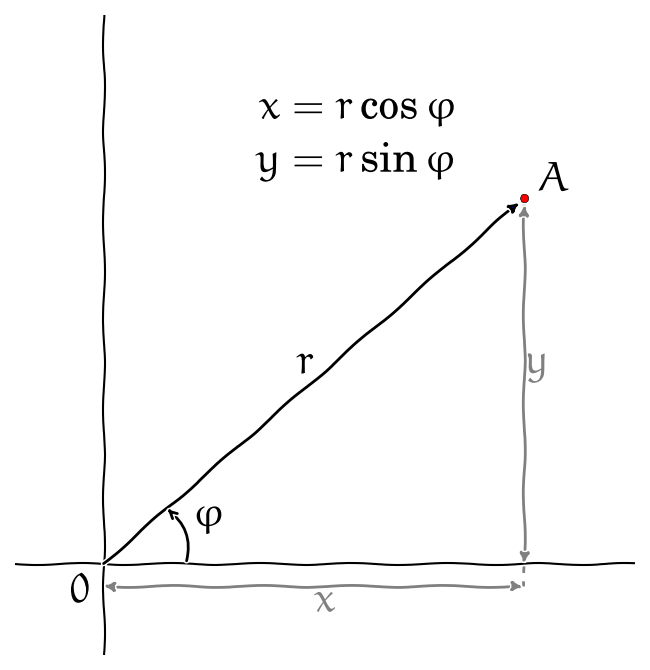

% Dvojný integrál
% Robert Mařík
% jaro 2014, jaro 2018

# Dvojný integrál

Pro dvojný integrál použijeme podobnou myšlenkovou konstrukci jako u\ 
křivkového integrálu prvního druhu, pouze místo drátu s\ danou
lineární hustotou budeme uvažovat rovinnou ohraničenou desku s\ danou
plošnou hustotou.

* Pokud je hustota desky konstantní, je možno její hmotnost získat
  jednoduše jako součin plošné hustoty a obsahu.
* Pokud se hustota desky mění a v\ obecném bodě $(x,y)$ je dána funkcí
  $f(x,y)$, můžeme myšlenkově rozdělit desku na malé kousky, v\ rámci
  každého malého kousku hustotu aproximovat konstantou, vypočítat
  hmotnost každého kousku jako součin hustoty a obsahu a všechny
  hmotnosti sečíst.
* Získaná veličina je aproximací celkové hmotnosti.

V\ limitním přechodu kdy rozměry všech kousků na něž je deska dělena
jde k\ nule dostáváme **dvojný integrál** 
$$ \iint_\Omega f(x,y)\mathrm{d}x \mathrm{d}y , $$ 
kde $\Omega$ je oblast v\ rovině $(x,y)$ definovaná uvažovanou deskou. V aplikacích je častý též zápis
$$ \iint_\Omega f(x,y)\mathrm{d}A.$$ 

# Výpočet (oblast mezi funkcemi proměnné $x$)

V\ závislosti na tom, jakými nerovnostmi množinu $\Omega$ definujeme,
můžeme pro výpočet dvojného integrálu použít následující věty. Tyto
věty udávají, jak je možno dvojný integrál přepsat jako dvojnásobný
integrál. Mají název **Fubiniovy věty**.

> Nechť $f$ je funkce spojitá v\ uzavřené oblasti
> $$  
>   \Omega=\{(x,y)\in\mathbb{R}^2:{a\leq x\leq b}\text{ a }
>   {\varphi (x)\leq y\leq \psi (x)}\}.$$ 
> Potom 
> $$
>   \iint_{\Omega}f(x,y)\mathrm{d}x \mathrm{d}y ={\int_{a}^{b}}
>   \Bigl[ \int_{\varphi (x)}^{\psi(x)}   
>   f(x,y){\mathrm{d}y }\Bigr]{\mathrm{d}x }.
> $$

 

# Výpočet (oblast mezi funkcemi proměnné $y$)

> Nechť $f$ je funkce spojitá v\ uzavřené oblasti
> $$  \Omega=\{(x,y)\in\mathbb{R}^2:{a\leq y\leq b}\text{ a }
>   {\varphi (y)\leq x\leq
>   \psi (y)}\}.
> $$
> Potom 
> $$
>   \iint_{\Omega}f(x,y)\mathrm{d}x \mathrm{d}y ={\int_a^b}\Bigl[ 
>   {\int_{\varphi (y)}^{\psi(y)}}
>   f(x,y){\mathrm{d}x }\Bigr]{\mathrm{d}y }.
> $$
> 

# Záměna pořadí integrace

Často je možné oblast integrace zapsat pomocí obou možností uvedených
na předchozích slidech. Například oblast na obrázku je možno zapsat
buď jako
$$\begin{gathered}
0\leq x \leq 2\\
0\leq y\leq x^2
\end{gathered}$$
nebo
$$\begin{gathered}
0\leq y \leq 4\\
\sqrt{y}\leq x\leq  2.
\end{gathered}$$

Pro integrál funkce $f(x,y)$ přes takovou množinu tedy máme dvě alternativy:
$$\int_0^2 \int _0^{x^2} f(x,y)\;\mathrm{d}y\;\mathrm{d}x$$
a
$$\int_0^4 \int _{\sqrt y}^{2} f(x,y)\;\mathrm{d}x\;\mathrm{d}y.$$

Všimněte si, že nestačí prosté prohození integrálů. Je nutno
přepočítávat meze a hraniční křivky je nutno vyjádřit jednou jako
funkce proměnné $x$ a jednou jako funkce proměnné $y$. V důsledku
tohoto dochází v průběhu výpočtu dvěma různými způsoby k tomu, že
pracujeme se dvěma různými integrály. Výsledky jsou stejné, nemusí
však být dosažitelné srovnatelnou námahou, jedna z cest může být
snazší.

# Výpočet (obdélníková oblast)

Výše uvedené problémy se stanovením a případným přepočítáváním mezí
při záměně pořadí integrace se nevyskytují při integrování přes
obdélníkovou oblast.

>   Nechť $R=[a,b]\times[c,d]$ je uzavřený obdélník v $\mathbb{R}^2$ a
>   $f$ funkce definovaná a spojitá na $R$. Pak platí
>   $$    \begin{aligned}\iint_R f(x,y)\mathrm{d}x \mathrm{d}y 
>     &=
>     \int_a^b\Bigl[\int_c^d f(x,y)\mathrm{d}y \Bigr]\mathrm{d}x 
>     \\&=
>     \int_c^d\Bigl[\int_a^b f(x,y)\mathrm{d}x \Bigr]\mathrm{d}y .\end{aligned}
>   $$
> 
>   Platí-li dokonce rovnost $f(x,y)=g(x)h(y)$, pak
>   $$
>         \iint_R f(x,y)\mathrm{d}x \mathrm{d}y  =     \int_a^b g(x) \mathrm{d}x  \int_c^d h(y)\mathrm{d}y .
>   $$
> 

# Matematické aplikace dvojného integrálu

* **Obsah** $\mu(\Omega)$ množiny $\Omega$ vypočteme jako integrál
    $$\mu(\Omega)=\iint_\Omega \mathrm{d}x \mathrm{d}y.$$
* **Integrální střední hodnota** funkce $f(x,y)$ definované na množině
  $\Omega$ je 
  $$ \frac{\iint_\Omega f(x,y)\mathrm{d}x \mathrm{d}y }{\mu (\Omega)},$$ 
  kde $\mu (\Omega)=\iint_\Omega\mathrm{d}x\mathrm{d}y$ je obsah
  množiny $\Omega$.

# Fyzikální aplikace dvojného integrálu

* **Hmotnost** množiny $M$ je $$m=\iint_M \sigma(x,y)\mathrm{d}x
  \mathrm{d}y,$$ kde $\sigma(x,y)$ je **plošná hustota** (hmotnost
  vztažená na jednotku povrchu).
* **Lineární momenty** hmotné množiny $M$ vzhledem k\ osám $y$ a $x$
  jsou rovny $$\iint_M x\sigma(x,y)\mathrm{d}x \mathrm{d}y$$ a
  $$\iint_M y\sigma(x,y)\mathrm{d}x \mathrm{d}y.$$
* **Moment setrvačnosti** hmotné množiny $M$ vzhledem k\ ose je
  $$J=\iint_M \rho^2(x,y)\sigma(x,y)\mathrm{d}x \mathrm{d}y ,$$ kde
  $\rho(x,y)$ je vzdálenost bodu $(x,y)$ od osy otáčení. Například pro
  osu $x$ je $\rho(x,y)=y$ a pro osu $y$ je $\rho (x,y)=x$. Pro osu
  procházející kolmo počátkem je $\rho(x,y)=\sqrt{x^2+y^2}$.

# Fyzikální aplikace dvojného integrálu (pokračování)

* **Souřadnice těžiště** množiny jsou podílem lineárních momentů a
  celkové hmotnosti množiny.
* **Kvadratický moment průřezu** (což je moment setrvačnosti pro
  $\sigma(x,y)=1$, anglicky *second moment of area*) je veličina,
  která hraje podstatnou roli v\ mechanice (nábytek, stavby) při
  dimenzování (polic, nosných tyčí, nosníků).
* Vzorce pro obsah $x$-ovou souřadnici těžiště ($x_T$), $y$-ovou
  souřadnici těžiště ($y_T$), kvadratický moment vzhledem k\ ose $x$
  ($I_x$) a kvadratický moment vzhledem k\ ose $y$ ($I_y$) (pro množinu $M$ s plošnou hustotou $1$) jsou
  $$
  \begin{alignedat}{2}
	  %  S&=\iint_M\mathrm{d}x \mathrm{d}y \\
	  x_T&=\frac 1S \iint_M x\mathrm{d}x \mathrm{d}y ,&\qquad    I_x&= \iint_M y^2\mathrm{d}x \mathrm{d}y \\
	  y_T&=\frac 1S \iint_M y\mathrm{d}x \mathrm{d}y , &    I_y&= \iint_M x^2\mathrm{d}x \mathrm{d}y \\
  \end{alignedat}
  $$

# Polární souřadnice

Dosud jsme používali pouze kartézské souřadnice: dvojici čísel
udávající vzdálenost bodu od osy $y$ a od osy $x$, která jednoznačně
určuje polohu bodu v\ rovině. V\ praxi je někdy výhodnější použít i\
jiný způsob jak pomocí dvojice čísel charakterizovat polohu bodu v\
rovině - takové souřadnice potom nazýváme **křivočaré** souřadnice.

Z\ křivočarých souřadnic jsou nejdůležitější **polární
souřadnice**. Při jejich použití polohu bodu $A$ zadáváme tak, že
určíme vzdálenost $r$ bodu od počátku soustavy souřadnic $O$ a úhel
$\varphi$, který svírá spojnice bodů $O$ a $A$ s\ kladnou částí osy
$x$.

# Množiny s jednoduchým vyjádřením v polárních souřadnicích

Nejsnáze se při výpočtu dvojného integrálu pracuje s obdélníkovými
množinami, tj. s množinami charakterizovanými nerovnostmi pro jednotlivé
proměnné a konstantním omezením pro tyto proměnné. Analogicky se bude
snadno pracovat v polárních souřadnicích s množinami, které by se staly
obdélníky pro překreslení do souřadné soustavy $r$ a $\varphi$. Takové
množiny jsou zobrazeny na následujících obrázcích.

|Obrázek        | Popis v polárních souřadnicích | Popis v kartézských souřadnicích |
|----------------|-----------------------|-----------------------|
|    | $$\begin{gathered}0\leq r\leq 1 \\ 0\leq \varphi\leq 2\pi\end{gathered}$$  | $$\begin{gathered}-1\leq x\leq 1\\ -\sqrt{1-x^2}\leq y\leq \sqrt{1-x^2}\end{gathered}$$  |
|    | $$\begin{gathered}1\leq r\leq 2 \\ 0\leq \varphi\leq \frac \pi2\end{gathered}$$  | Nelze zasat pomocí jedné dvojice nerovností |
|   | $$\begin{gathered}0\leq r\leq 1 \\ \frac\pi 4\leq \varphi\leq \frac\pi 2\end{gathered}$$  | $$\begin{gathered}0\leq x\leq \frac {\sqrt 2}2 \\ x\leq y\leq \sqrt{1-x^2}\end{gathered}$$ |

# Dvojný integrál v\ polárních souřadnicích

Chceme-li převést dvojný integrál do polárních souřadnic, provádíme v
\ něm vlastně substituci $x=r\cos \varphi$ a $y=r\sin \varphi$. Přitom
se transformují i\ diferenciály $\mathrm{d}x$ a $\mathrm{d}y$.  Při
změně úhlu o $\mathrm{d}\varphi$ a změně vzdálenosti o $\mathrm{d}r$
má odpovídající část roviny rozměry $\mathrm{d}r$ a
$r\mathrm{d}\varphi$ a její obsah je $r\mathrm{d}\varphi\mathrm{d}r$
(viz obrázek). Platí tedy, že obsah elementární oblasti $\mathrm{d}
A=\mathrm{d} x\mathrm{d}y$ se transformuje na $\mathrm{d}
A=r\mathrm{d}\varphi\mathrm{d}r$. Podíl
$\frac{\mathrm{d}\varphi\mathrm{d}r }{\mathrm{d}x \mathrm{d}y }$
udává, kolikrát se změní obsah elementární oblasti při změně souřadnic
a nazývá se **jakobián**. V\ případě polárních souřadnic je jakobián
jak vidíme roven $r$ a platí tedy
$$
  \iint_{\Omega}f(x,y){\mathrm{d}x \mathrm{d}y }=\iint_{\Omega}f(r\cos \varphi ,
  r\sin\varphi ){r\mathrm{d}\varphi\mathrm{d}r }.
$$
  
V\ diferenciálním počtu polární souřadnice používáme především tam, kde
má problém radiální symetrii. Například při studiu ochlazování nebo
kmitů kruhových desek či válcovitých součástek. V\ integrálním počtu
tyto souřadnice použijeme zejména v\ případě, kdy integrujeme přes
kružnici nebo její část (např. mezikruží či kruhová výseč). V\ takovém
případě mají totiž integrály které vzniknou po transformaci dvojného
integrálu na dvojnásobný pevné meze a výpočet druhého integrálu je
zpravidla jednodušší. 

