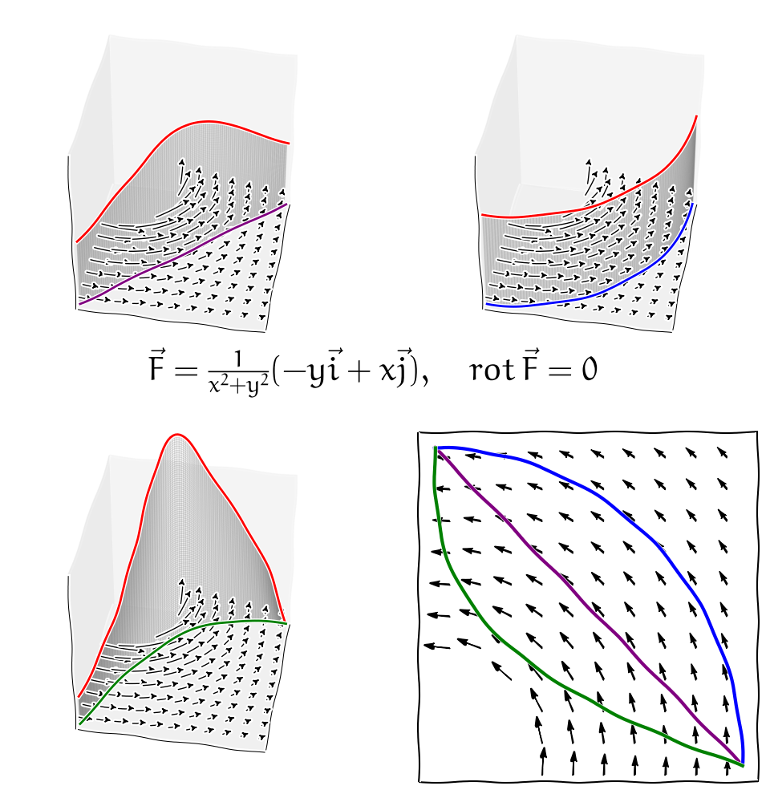

% Základní integrální věty z vektorové analýzy
% Robert Mařík
% jaro 2014

# Úvod 

V\ následujících větách si ukážeme některé souvislosti mezi
studovanými pojmy. Tyto souvislosti existují, pokud objekty se kterými
pracujeme jsou dostatečně pěkné - funkce jsou dostatečně hladké,
oblasti mají dostatečně hladkou hranici a neobsahují díry apod.  Pro
úplnost uvedeme nebo zopakujeme potřebné pojmy. Některé pojmy pro
názornost uvedeme poněkud volnější interpretací, jejich přesnější zavedení je
možno nalézt v literatuře.

* Vektorové pole $\vec F$ se nazývá **potenciálové**, pokud
  existuje skalární funkce $\varphi$ s\ vlastností $\nabla \varphi=\vec
  F$. Funkce $\varphi$ se nazývá **kmenová funkce** vektorového
  pole.
* Křivka $C$ se nazývá **uzavřená**, pokud její počáteční a koncový bod
  splývají.
* Křivka se nazývá **jednoduchá**, pokud sama sebe neprotíná
  (s\ případnou výjimkou stejného počátečního a koncového bodu
  u\ uzavřených křivek).
* Křivka se nazývá **regulární**, pokud funkce z jejího parametrického
  vyjádření jsou hladké (mají spojité derivace) a v každém bodě je
  aspoň jedna z těchto funkcí nenulová.
* Pokud platí pro libovolné dvě regulární křivky $C$ a $C_1$, které leží v
  $\Omega$ a mají stejné počáteční body a stejné koncové body, platí
  $$
  \int_C \vec F\mathrm{d}\vec r=\int_{C_1} \vec F\mathrm{d}\vec r,
  $$
  říkáme, že integrál v $\Omega$ **nezávisí na integrační
  cestě**. Vektorové pole
  ve kterém křivkový integrál nezávisí na integrační cestě se nazývá
  **konzervativní pole**.
* Oblast se nazývá **jednoduše souvislá**, pokud je souvislá a
  neobsahuje otvory.

# Věta o\ nezávislosti integrálu na integrační cestě

Podle této věty je tedy vektorové pole v\ prostoru
konzervativní právě tehdy, když je jeho rotace nulová a to je právě
tehdy, když pro toto pole existuje kmenová funkce a je tedy možno
zavést potenciál (záporně vzatá kmenová funkce).

\newpage

>  **Věta (o\ nezávislosti integrálu na integrační cestě)**:
>  Uvažujme vektorovou funkci $\vec F$, křivku $C$ a oblast $\Omega$ 
>  v\ $\mathbb{R}^3$. Následující výroky jsou ekvivalentní za předpokladu
>  hladkosti funkcí, regulárnosti křivek a jednoduše souvislé oblasti
>  $\Omega$.
>
>  a. Integrál $\int_C \vec F\mathrm{d}\vec r$ nezávisí v $\Omega$ na
>    integrační cestě.
>  b. Křivkový integrál $\oint_C \vec F\mathrm{d}\vec r$ po libovolné
>    uzavřené křivce $C$ v $\Omega$ je roven nule.
>  c. Rotace $\mathop{\mathrm{rot}} \vec F$ vektorového pole $\vec F$ je v\ $\Omega$
>    rovna nulovému vektoru.
>  d. Existuje funkce $\varphi$ s\ vlastností $\nabla\varphi=\vec F$
>    na $\Omega$.
>
>  Pokud jsou předchozí podmínky splněny (platnost jedné z\ nich vynutí
>  platnost i\ všech ostatních), je možno křivkový integrál vypočítat
>  podle vzorce
>  $$
>    \int_C \vec F\mathrm{d}\vec r=\varphi(B)-\varphi(A)
>  $$
>  kde $A$ a $B$ jsou počáteční a koncový bod křivky $C$ a $\varphi$ je
>  kmenová funkce vektorového pole $\vec F$.

# Poznámky k\ větě o\ nezávislosti křivkového integrálu na integrační cestě

Větu je možno formálně vyslovit i\ pro jiný než trojrozměrný
prostor. Pokud je pole v\ předchozí větě pouze v\ rovině, tj. $\vec
F=(F_x, F_y)$, doplníme třetí komponentu pro výpočet rotace
nulou. Protože $\mathop{\mathrm{rot}} \vec F=\left(\frac {\partial F_x}{\partial y}-\frac {\partial F_y}{\partial x}\right)\vec k$, přechází podmínka na nulovost rotace v\ nám již známou nutnou a postačující podmínku 
$$
\frac {\partial F_x}{\partial y}=\frac {\partial F_y}{\partial x}
$$
pro to aby výraz
$$F_x\mathrm{d}x+F_y\mathrm{d}y$$ byl totálním diferenciálem.  

Pokud pracujeme v\ prostoru vyšší dimenze, podmínka na rotaci je
nahrazena jinou, komplikovanější podmínkou. Všechny další body věty 
o\ nezávislosti na integrační cestě však zůstávají v\ platnosti beze
změny.

Podmínka hladkosti funkcí na jednoduše souvislé oblasti je
podstatná. Například pole $\vec v=-\frac{y}{x^2+y^2}\vec
i+\frac{x}{x^2+y^2}\vec j$ má rotaci rovnu nule ve všech bodech, kde
je definované, tj. v\ celém prostoru kromě osy $z$. Přímým výpočtem je
možno ukázat, že křivkový integrál po jednotkové kružnici v\ rovině
$z=0$ je roven $2\pi$.

\iffalse

# Závislost a nezávislost integrálu na integrační cestě

\fi

\iffalse

* [online výpočet integrálů z\ obrázků](https://sagecell.sagemath.org/?z=eJx1kUFOwzAQRfeVeoeRlQgbDK3THcIsEVI2XbALKTKJS6OEJNhOSY7CgbgX4zQVrRCWLHs0_4-fvvfKAL3o-cDdBZvP2qbSAiTQ62FhP4yj_Sa6GjYR4_15PWmjSfurg_63AFTNZ5mQVFw77rDKIkmzxtK2uHQLr7ZFfSy8OlsdtOA2q9Gc6y2UptiXzX54KWqn34yqgLZLDq3gUOJZCnY7nwEuo11nalp379oUmarODDe2e7W0l94ySDRd5sV2S7F07KoV_7UFtvmSC5Ys05Fo2xhYQ1HjTB8Wcvgcjgh213zSnXuvKLnbmXu_iQ_rvGewGd2v0XgLwfNeZ_AgaWh5aFlwt8AWCYFWyumerv27_HgXKWNjUH6eU69dVSqZJCT-_sKMFOHkscnrximSpgeRx41H3AxZswj36gh7MuRGta2uc5oYEvQytAGHYJhO91zUCUaQBiScqOITqnik4n9-aUTn4KE5xON9lKYMnz1JBAkqTScODjutcm1eTPMpn0ynGfsB9VrANw==&lang=sage)
* [online výpočet rotace nekonzervativního pole z\ obrázku](https://sagecell.sagemath.org/?z=eJyNUtFuwiAUfTfxH26MWyHiVn1cwut-YtUGbVESKB1FBxr_fUCbdvFpfaD3cA_3wLnXEU9u9MoMyhx4uGV4PpvPOHJxH1O09u_dt7HI7bcrv99i4p5wng44JRoCTjFHwKfYhxgo5AQ2JK2RVokrp6gSnCP-le-Iw6sBbHbEj2C7C9r4rROqlYL7kl-kREHneDFyvJpiLZJMHSoG7sM9k0kxn8Hzh2BSu-H1pOYxgQm5MZVH3pjKI3E9lXAYcHp9d9Y_6GyVRGaxLA71STR3JsWpqasHFNf6CJ-vFF46KAro71UoZs-6vae_UfdgzOPxL6bRdmQCjcy6qUa15eIlnQrO2NqhYBYNdtHY4-AogX47tuE5M6QGi__mcP_IVmpbBl2rTclFLSuULEntyDGJjgxxqBaiNBJxIiL0JE2F7yHr2lCnNMwKTcN4HLXUhmYHeakz_AscysmD&lang=sage)
* [online výpočet rotace konzervativního pole z\ obrázku](https://sagecell.sagemath.org/?z=eJyNUsGOwiAQvZv4DxOjW4i4Wz1uwnV_YqsN2qIkUBqKLmj89wXatBtPy6HM8F7nwZtxxJM7vTGDMgce7hmez-Yzjlw8xxRt_Adyh93aH3aYuD9xnohOiYaAU8wR8Cn2IQYKOYEtSd9Iq8SNU1QJzhH_zvfE4fWQbPfEj8luHzTxeydUKwX3Jb9KiYLO6WrkeCXFWiSZOlYM3Kd7JZNiPoPXhWBSu-PNpOYxgSlzI5RH3gjlkbiZSjgMOL2-u-gfdLFKIrNYFsf6LJoHk-Lc1NUTilt9gq83CqsOigL6exWK2YtuH2k36hGMeT7_xTTajkygkVk31ai2XKzSX8EZWzsUzKLBLhp7Gxwl0B_HNrwiAzRY_BfD_SNbqW0ZdK02JRe1rFCyJLUjxyQ6MsShWojSSMSJiKknaSp8n7KuDXVKw6zQNIzHSUttaHaU1zrDvy_pxe8=&lang=sage)

<!--

* [online výpočet integrálů z\ obrázků](http://user.mendelu.cz/marik/akademie/sagecell.php?short=1&in=var+%28%27x%2Cy%2Ct%27%29%0D%0Apole1+%3D+%28-y%2Fsqrt%28x%5E2%2By%5E2%29%2Cx%2Fsqrt%28x%5E2%2By%5E2%29%29%0D%0Apole2+%3D+%28-y%2F%28x%5E2%2By%5E2%29%2C+x%2F%28x%5E2%2By%5E2%29+%29%0D%0A%0D%0Ac1%3D%281-t%2Ct%29%0D%0Ac2%3D%28cos%28pi%2At%2F2%29%2C+sin%28pi%2At%2F2%29+%29%0D%0Ac3%3D%281-t%2C+t%5E3%29%0D%0A%0D%0Adef+krivkovy_integral+%28p0%2C+p1%2C+k0%2C+k1%29%3A%0D%0A++++return%28numerical_integral+%28p0.subs%28x%3Dk0%2C+y%3Dk1%29%2Adiff%28k0%2Ct%29%2Bp1.subs%28x%3Dk0%2C+y%3Dk1%29%2Adiff%28k1%2Ct%29%2C0%2C1%29%5B0%5D%29%0D%0A%0D%0Afor+P+in+%28pole1%2C+pole2%29%3A%0D%0A++++show%28html%28%22%3Chr%3E%3Chr%3E%22%29%29%0D%0A++++show%28html%28r%22%3Ch2%3EPole%3A+%24%5Cvec+F%3D%28%25s%2C%25s%29%24%3C%2Fh2%3E%22%25+%28latex%28P%5B0%5D%29%2Clatex%28P%5B1%5D%29%29%29+%29%0D%0A++++tabulka%3D%5B%5B%22K%C5%99ivka%22%2C%22Hodnota%22%5D%5D%0D%0A++++for+K+in+%28c1%2C+c2%2C+c3%29%3A%0D%0A++++++++tabulka.append%28%5Br%22%24x%3D%25s%24%2C+%24y%3D%25s%24%2C+%24t%5Cin%5B0%2C1%5D%24%22%25%28latex%28K%5B0%5D%29%2Clatex%28K%5B1%5D%29%29%2Ckrivkovy_integral%28P%5B0%5D%2C+P%5B1%5D%2C+K%5B0%5D%2C+K%5B1%5D%29%5D%29+++%0D%0A++++show%28table%28tabulka%2C+header_row%3DTrue%29%29)
* [online výpočet rotace nekonzervativního pole z\ obrázku](http://user.mendelu.cz/marik/akademie/sagecell.php?short=1&in=x%2Cy%2Cz%3Dvar%28%27x+y+z%27%29%0D%0A%0D%0Af%28x%2Cy%2Cz%29%3D%28-y%2Fsqrt%28x%5E2%2By%5E2%29%2Cx%2Fsqrt%28x%5E2%2By%5E2%29%2C0%29%0D%0A%0D%0Axmin%2C+xmax%2C+ymin%2C+ymax+%3D+0%2C+1%2C+0%2C+1%0D%0A%0D%0Adivf%3D%28diff%28f%5B0%5D%2Cx%29%2Bdiff%28f%5B1%5D%2Cy%29%2Bdiff%28f%5B2%5D%2Cz%29%29.simplify_full%28%29%0D%0Acurlf%28x%2Cy%2Cz%29%3Dmap%28lambda+x%3Ax.simplify_full%28%29%2C%5C%0D%0A+++++++++++++++++%28+diff%28f%5B1%5D%2Cz%29-diff%28f%5B2%5D%2Cy%29%2C+diff%28f%5B2%5D%2Cx%29-diff%28f%5B0%5D%2Cz%29%2C+diff%28f%5B0%5D%2Cy%29-diff%28f%5B1%5D%2Cx%29+%29%29%0D%0A%0D%0Ashow%28html%28r%22%24%5Cbegin%7Baligned%7D+%5Cvec+F%26%3D+%25s+%5C%5C+%5C%0D%0A+++%5Cmathop%7B%5Cmathrm%7Bdiv%7D%7D%5Cvec+F%26%3D+%25s+%5C%5C+%5C%0D%0A+++%5Cmathop%7B%5Cmathrm%7Brot%7D%7D%5Cvec+F%26+%3D%25s+%5Cend%7Baligned%7D%24%22%25%0D%0A+++%28latex%28f%28x%3Dx%2Cy%3Dy%2Cz%3Dz%29%29%2C+latex%28divf%28x%3Dx%2Cy%3Dy%2Cz%3Dz%29%29%2C++latex%28curlf%28x%3Dx%2Cy%3Dy%2Cz%3Dz%29%29%29%29%29%0D%0A%0D%0Aplot_vector_field%28%28f%5B0%5D%28x%2Cy%2C0%29%2Cf%5B1%5D%28x%2Cy%2C0%29%29%2C+%28x%2Cxmin%2Cxmax%29%2C+%28y%2Cymin%2Cymax%29%2C+aspect_ratio%3D1%2C+color%3D%27blue%27%29)
* [online výpočet rotace konzervativního pole z\ obrázku](http://user.mendelu.cz/marik/akademie/sagecell.php?short=1&in=x%2Cy%2Cz%3Dvar%28%27x+y+z%27%29%0D%0A%0D%0Af%28x%2Cy%2Cz%29%3D%28-y%2F%28x%5E2%2By%5E2%29%2Cx%2F%28x%5E2%2By%5E2%29%2C0%29%0D%0A%0D%0Axmin%2C+xmax%2C+ymin%2C+ymax+%3D+0%2C+1%2C+0%2C+1%0D%0A%0D%0Adivf%3D%28diff%28f%5B0%5D%2Cx%29%2Bdiff%28f%5B1%5D%2Cy%29%2Bdiff%28f%5B2%5D%2Cz%29%29.simplify_full%28%29%0D%0Acurlf%28x%2Cy%2Cz%29%3Dmap%28lambda+x%3Ax.simplify_full%28%29%2C%5C%0D%0A+++++++++++++++++%28+diff%28f%5B1%5D%2Cz%29-diff%28f%5B2%5D%2Cy%29%2C+diff%28f%5B2%5D%2Cx%29-diff%28f%5B0%5D%2Cz%29%2C+diff%28f%5B0%5D%2Cy%29-diff%28f%5B1%5D%2Cx%29+%29%29%0D%0A%0D%0Ashow%28html%28r%22%24%5Cbegin%7Baligned%7D+%5Cvec+F%26%3D+%25s+%5C%5C+%5C%0D%0A+++%5Cmathop%7B%5Cmathrm%7Bdiv%7D%7D%5Cvec+F%26%3D+%25s+%5C%5C+%5C%0D%0A+++%5Cmathop%7B%5Cmathrm%7Brot%7D%7D%5Cvec+F%26+%3D%25s+%5Cend%7Baligned%7D%24%22%25%0D%0A+++%28latex%28f%28x%3Dx%2Cy%3Dy%2Cz%3Dz%29%29%2C+latex%28divf%28x%3Dx%2Cy%3Dy%2Cz%3Dz%29%29%2C++latex%28curlf%28x%3Dx%2Cy%3Dy%2Cz%3Dz%29%29%29%29%29%0D%0A%0D%0Aplot_vector_field%28%28f%5B0%5D%28x%2Cy%2C0%29%2Cf%5B1%5D%28x%2Cy%2C0%29%29%2C+%28x%2Cxmin%2Cxmax%29%2C+%28y%2Cymin%2Cymax%29%2C+aspect_ratio%3D1%2C+color%3D%27blue%27%29)

-->

\fi

# Greenova věta

> **Greenova věta**:  Nechť $\Omega\subseteq\mathbb{R}^2$ je jednoduše souvislá regulární oblast,jejíž hranicí je po částech regulární křivka $\partial \Omega$
> orientovaná tak, že při obíhání podél křivky $\partial \Omega$ je
> oblast $\Omega$ vlevo. Nechť vektorová funkce $\vec
> F(x,y)=P(x,y)\vec i+Q(x,y)\vec j$ je hladká uvnitř nějaké oblasti,
> obsahující množinu $\Omega$ a její hranici $\partial \Omega$. Platí
> $$   \underbrace{\oint_{\partial \Omega}P(x,y)\mathrm{d}x +Q(x,y)\mathrm{d}y }_{\text{Cirkulace po hranici $\partial \Omega$}}=   \iint_{\Omega}\underbrace{\left(\frac{\partial Q(x,y)}{\partial x}-\frac{\partial P(x,y)}{\partial y}\right)}_{[\mathop{\mathrm{rot}} (P\vec i+Q\vec j)]_z}\mathrm{d}x \mathrm{d}y. $$

\iffalse

[online výpočet](http://user.mendelu.cz/marik/akademie/sagecell.php?short=1&in=var%28%27x+y+t%27%29%0D%0A%0D%0Av%3Dsqrt%281-x%5E2%29%0D%0Au%3D0%0D%0Aa%3D0%0D%0Ab%3D1%0D%0AP%3D-y%2F3%0D%0AQ%3Dx%2F3%0D%0Adef+shtml%28x%29%3A%0D%0A++++return+show%28html%28x%29%29%0D%0A%0D%0Ashtml%28%22%3Ch3%3EZad%C3%A1n%C3%AD%3C%2Fh3%3E%22%29%0D%0Ashtml%28%22%24%5COmega%3D%5C%7B%28x%2Cy%29%5Cin%5Cmathbb%7BR%7D%5E2%3A%25s%5Cleq+x+%5Cleq+%25s%2C+%25s%5Cleq+y+%5Cleq+%25s%5C%7D%24%5C%0D%0A++%22%25%28latex%28a%29%2Clatex%28b%29%2C+latex%28u%29%2C+latex%28v%29%29%29%0D%0Ashtml%28%22%24P%28x%2Cy%29%3D%25s%24%22%25latex%28P%29%29%0D%0Ashtml%28%22%24Q%28x%2Cy%29%3D%25s%24%22%25latex%28Q%29%29%0D%0Ashtml%28r%22%3Chr%3E%3Ch3%3EDvojn%C3%BD+integr%C3%A1l%3C%2Fh3%3E%22%29%0D%0Ashtml%28r%22%24%5Cfrac%7B%5Cpartial+Q%7D%7B%5Cpartial+x%7D%28x%2Cy%29%3D%25s%24%22%25latex%28diff%28Q%2Cx%29.simplify_full%28%29%29%29%0D%0Ashtml%28r%22%24%5Cfrac%7B%5Cpartial+P%7D%7B%5Cpartial+y%7D%28x%2Cy%29%3D%25s%24%22%25latex%28diff%28P%2Cy%29.simplify_full%28%29%29%29%0D%0A%0D%0Aintegrand+%3D+%28diff%28Q%2Cx%29+-+diff%28P%2Cy%29%29.simplify_full%28%29%0D%0A%0D%0Avysledek_integralu%3Dnumerical_integral%28lambda+x%3A+numerical_integral%28lambda+y%3A+%5C%0D%0A++++integrand.subs%28x%3Dx%2C+y%3Dy%29%2C%28u.subs%28x%3Dx%29%2Cv.subs%28x%3Dx%29+%29%29%5B0%5D%2C%28a%2Cb%29%29%5B0%5D%0D%0A%0D%0A%0D%0Ashtml%28r%22%24%5Ciint_%7B%5COmega%7D%5Cfrac%7B%5Cpartial+Q%7D%7B%5Cpartial+x%7D-%5Cfrac%7B%5Cpartial+P%7D%7B%5Cpartial+y%7D%5C%0D%0A++++%5Cmathrm%7Bd%7Dx%5Cmathrm%7Bd%7Dy%3D%25s%24%22%25latex%28vysledek_integralu%29%29%0D%0A%0D%0Ashtml%28r%22%3Chr%3E%3Ch3%3EK%C5%99ivkov%C3%BD+integr%C3%A1l%3C%2Fh3%3E%22%29%0D%0A%0D%0Adef+krivkovy_integral+%28P%2C+Q%2C+k0%2C+k1%29%3A%0D%0A++++vysledek%3D+numerical_integral+%28P.subs%28x%3Dk0%2C+y%3Dk1%29%2Adiff%28k0%2Ct%29%2BQ.subs%28x%3Dk0%2C+y%3Dk1%29%2Adiff%28k1%2Ct%29%2C0%2C1%29%5B0%5D%0D%0A++++return+%28vysledek%2C+r%22K%C5%99ivka%3A+%24x%3D%25s%2C+y%3D%25s%2C+t%5Cin%5B0%2C1%5D%24%22%25%28latex%28k0%29%2Clatex%28k1%29%29%2C+r%22%24%5Cint_C+Pdx%2BQdy%3D%25s%24%22%25+%5C%0D%0A+++++++latex%28vysledek%29%29%0D%0A++++%0D%0A%0D%0ASUMA%3D0%0D%0A%0D%0A++%0D%0Ak0%3Da%2Bt%2A%28b-a%29++++%0D%0Ak1%3Du.subs%28x%3Da%2Bt%2A%28b-a%29%29%0D%0AK%3Dkrivkovy_integral%28P%2C+Q%2C+k0%2C+k1%29%0D%0ASUMA%3DSUMA%2BK%5B0%5D%0D%0ATABULKA%3D%5B%5BK%5B1%5D%2CK%5B2%5D%5D%5D%0D%0A%0D%0Ak0%3Db++++%0D%0Aif+%28n%28u.subs%28x%3Db%29-v.subs%28x%3Db%29%29%21%3Dn%280.0%29%29%3A%0D%0A++++k1%3Du.subs%28x%3Db%29-t%2A%28u.subs%28x%3Db%29-v.subs%28x%3Db%29%29%0D%0A++++K%3Dkrivkovy_integral%28P%2C+Q%2C+k0%2C+k1%29%0D%0A++++SUMA%3DSUMA%2BK%5B0%5D%0D%0A++++TABULKA.append%28%5BK%5B1%5D%2CK%5B2%5D%5D%29%0D%0A%0D%0Ak0%3Db-t%2A%28b-a%29++++%0D%0Ak1%3Dv.subs%28x%3Db-t%2A%28b-a%29%29%0D%0AK%3Dkrivkovy_integral%28P%2C+Q%2C+k0%2C+k1%29%0D%0ASUMA%3DSUMA%2BK%5B0%5D%0D%0ATABULKA.append%28%5BK%5B1%5D%2CK%5B2%5D%5D%29%0D%0A%0D%0Ak0%3Da++++%0D%0Aif+%28n%28u.subs%28x%3Da%29-v.subs%28x%3Da%29%29%21%3Dn%280.0%29%29%3A%0D%0A++++k1%3Dv.subs%28x%3Da%29%2Bt%2A%28u.subs%28x%3Da%29-v.subs%28x%3Da%29%29%0D%0A++++K%3Dkrivkovy_integral%28P%2C+Q%2C+k0%2C+k1%29%0D%0A++++SUMA%3DSUMA%2BK%5B0%5D%0D%0A++++TABULKA.append%28%5BK%5B1%5D%2CK%5B2%5D%5D%29%0D%0A%0D%0Ashtml%28table%28TABULKA%2C+header_row%3D%5B%22K%C5%99ivka%22%2C%22Integr%C3%A1l%22%5D%29%29%0D%0Ashtml%28r%22Celkem%3A+%24%5Coint_CPdx%2BQdy%3D%25s%24%22%25latex%28SUMA%29%29%0D%0A%0D%0APL%3Dplot%28u%2C%28x%2Ca%2Cb%29%2C+fill%3Dv%29%0D%0APL%3DPL%2Bplot%28v%2C%28x%2Ca%2Cb%29%2C+color%3D%27red%27%29%0D%0APL%3DPL%2Bplot_vector_field%28%28P%2CQ%29%2C+%28x%2CPL.xmin%28%29%2CPL.xmax%28%29%29%2C+%28y%2CPL.ymin%28%29%2CPL.ymax%28%29%29%29%0D%0APL.show%28aspect_ratio%3D1%29) - pro množiny typu $\Omega=\{(x,y)\in\mathbb{R}^2: a\leq x \leq b, u(x)\leq y \leq v(x)\}$

Použijeme-li pro funkci $\vec F$ vystupující v\ Greenově větě
třídimenzionální rozšíření (třetí komponenta nulová),
vidíme, že vpravo v\ dvojném integrálu figuruje třetí komponenta rotace
$\mathop{\mathrm{rot}} \vec F$. Je to současně jediná nenulová komponenta vektoru
rotace, zbylé dvě komponenty vektoru rotace jsou rovny nule.

Pokud zvolíme funkce $P$ a $Q$ tak, že platí $\frac{\partial
Q(x,y)}{\partial x}-\frac{\partial P(x,y)}{\partial y}=1$, potom
vpravo vychází obsah množiny $\Omega$ a Greenova věta umožňuje najít
obsah množiny $\Omega$ pouze z\ informace podél hranice! Na tomto
principu fungují planimetry.

\fi

# Varianta Greenovy věty pro tok křivkou 

Nahradíme-li formálně vektorové pole $P\vec i+Q\vec j$ vektorovým polem $-Q\vec
i+P\vec j$, dostáváme následující vztah mezi dvojným integrálem
divergence vektorového pole přes oblast $\Omega$ a křivkovým
integrálem vyjadřujícím tok vektorového pole $P\vec i+Q\vec j$
protékající přes hranici $\partial \Omega$.
$$
  \underbrace{\oint_{\partial \Omega}-Q(x,y)\mathrm{d}x +P(x,y)\mathrm{d}y }_{\text{Tok přes hranici $\partial \Omega$}}=
  \iint_{\Omega}\underbrace{\left(\frac{\partial P(x,y)}{\partial x}+\frac{\partial Q(x,y)}{\partial y}\right)}_{\mathop{\mathrm{div}} (P\vec i +Q\vec j)}\mathrm{d}x \mathrm{d}y 
$$
Výše popsaně dvě varianty Greenovy věty nám dávají možnost najít
fyzikální interpretaci operátorů divergence a rotace. Podíl dvojného
integrálu funkce $f$ přes oblast $\Omega$ a obsahu této oblasti je
roven střední hodnotě funkce $f$ na množině $\Omega$.  Při limitním
přechodu, kdy rozměry množiny $\Omega$ jdou k\ nule, dostaneme přímo
funkční hodnotu funkce $f$. Toto nám umožňuje dostat se do integrandů
na pravých stranách vztahů.

Rotaci je tedy možno chápat jako limitu podílu cirkulace vektorového
pole po uzavřené křivce a obsahu množiny uvnitř této křivky, kdy
v\ limitním procesu stahujeme délku křivky k\ nule. Zejména pokud je
práce po libovolné uzavřené křivce nulová, je nulová i\ rotace.

Podobně divergenci je možno chápat jako limitu podílu toku uzavřenou
křivkou a obsahu množiny ohraničené touto křivkou, když rozměry
uvažované oblasti jdou k\ nule. Zejména pokud pole neobsahuje žádné
zdroje ani spotřebiče, pak tok dovnitř křivky je stejný jako tok ven
(co do uzavřeného prostoru vteče, to i\ vyteče ven), je divergence
rovna nule.

