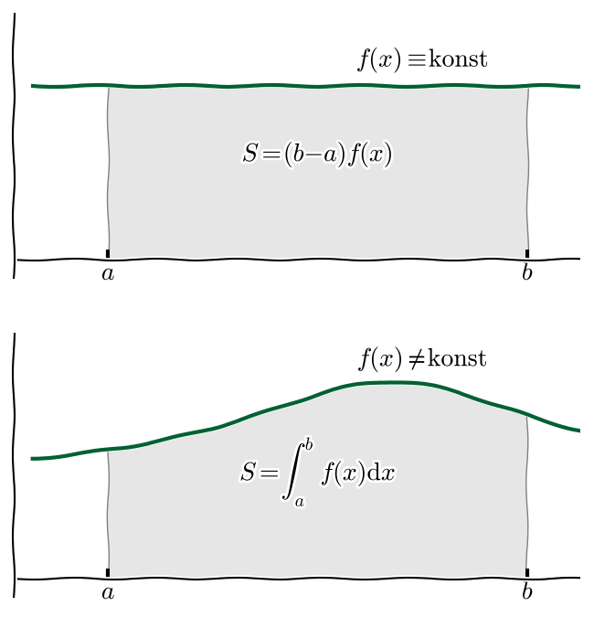
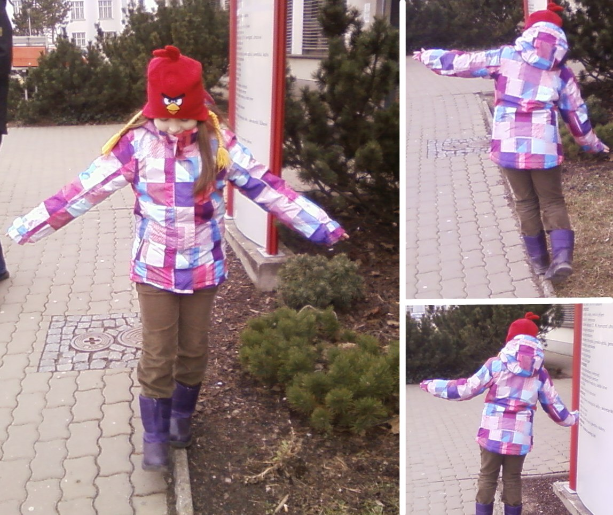

% Základní myšlenky vedoucí k rozšíření integrálního počtu
% Robert Mařík
% jaro 2014, jaro 2015

# Jak vypočítat dráhu pohybujícího se tělesa?

* Pro rovnoměrný pohyb platí $s=vt$.
* Co když pohyb není rovnoměrný? Dráha je aditivní veličina. Můžeme tedy pomocí $s=vt$ vypočítat
  dráhu za každou jednotlivou vteřinu a tyto částečné výpočty sečíst.
* Předchozím postupem dostaneme přesnou dráhu vždy když bude rychlost
  v rámci každé vteřiny konstantní. Může se během pohybu měnit, ale
  jenom v každou celou vteřinu.
* Pokud se rychlost mění více než bylo povoleno v předchozím bodě,
  můžeme postup z předchozího bodu opakovat s tím, že do výpočtu
  $s=vt$ za $v$ dosadíme nějakou typickou rychlost během každé
  vteřiny. Výsledek pochopitelně nebude zcela přesný.
* Postup z předchozího bodu je možné vylepšit tak, že bereme kratší
  časové okamžiky. Teoreticky můžeme délku časového okamžiku stáhnout
  k nule.
* Výše popsaný princip je základem určitého integrálu. Umožňuje
  počítat aditivní veličinu která je za konstantních parametrů součinem
  dvou jiných veličin a v případě, že parametry přestanou být
  konstantní.

# Nejčastější aplikace integrálu

* Obsah obdélníka je součinem délek stran. Pokud se
  "výška obdélníka mění" jako funkce $f$ proměnné $x$, je obsah
  plochy pod grafem funkce $$S=\int_a^b f(x)\mathrm{d}x$$.
* Dráha $s$ pohybujícího se tělesa je integrál rychlosti. Pokud se v
  čase od $t_0$ do $t_1$ těleso pohybuje proměnlivou rychlostí,
  $v(t)$, urazí za tento časový interval dráhu
  $$s=\int_{t_0}^{t_1}v(t)\mathrm{d}t.$$
* Aritmetický průměr konečného počtu bodů je veličina, která je z
  jistého úhlu pohledu uprostřed souboru bodů. Je-li bodů nekonečně
  mnoho, nahrazujeme aritmetický průměr pojmem střední
  hodnota. Střední hodnota funkce $f(x)$ na intervalu $(a,b)$ je číslo
  $$\mu=\frac{1}{b-a}\int_a^b f(x)\mathrm{d}x, $$ tj. číslo splňující
  rovnici $$(b-a)\mu=\int_a^b f(x)\mathrm{d}x$$

# Moment setrvačnosti 

* Veličina moment setrvačnosti ($J$) má stejný význam pro rotační pohyby,
  jako hmotnost pro pohyby posuvné. 
  Tělesa s velkým momentem setrvačnosti se nazývají
  [setrvačníky](http://youtu.be/NeXIV-wMVUk?t=1m15s).
* Krasobruslaři změnou momentu setrvačnosti [mění rychlost
  piruet](http://youtu.be/AQLtcEAG9v0), využívají
  zákon zachování točivosti (momentu hybnosti) $J\omega=\text{konst}$. Intuitivně tento
  trik použije člověk na hraně, který se snaží zabránit pádu (mává
  rukama tak, aby rotační pohyb ruk kompenzoval otáčení těla při
  pádu).
* Tak jako je těžké těleso namáhavé uvést do pohybu, nebo jej v pohybu
  zastavit, těleso s velkým momentem setrvačnosti je obtížné roztočit,
  nebo roztočené těleso uvést do klidu. I proto lidé pro udržení
  rovnováhy [rozpažují ruce](http://youtu.be/zXdrvLeXyE4?t=33s) a provazochodci
  [nosí balanční tyč](http://youtu.be/Bi8x2dST_Es?t=51s)
* V případě nosníků souvisí moment setrvačnosti s odolností nosníku
  vůči deformaci namáháním. Namáhání nosníku je možno uvažovat jako
  snahu uvést nosník do otáčivého pohybu okolo bodu, kde je nosník
  upevněný do stěny.

# Moment setrvačnosti (pokračování)

* Moment setrvačnosti jednoho bodu o hmotnosti $m$ je roven 
  $$J=mr^2,$$
  kde $r$ je vzdálenost od osy otáčení.
* Moment setrvačnosti je aditivní veličina. Pro konečný počet hmotných
  bodů ji můžeme určit jako součet od příspěvků od jednotlivých bodů.
* Pro nekonečný počet hmotných bodů můžeme provést podobnou úvahu s
  dělením na malé části jako u integrálu a rychlosti. Je nutné si však
  uvědomit, že mohou nastat velmi odlišné situace:
      * těleso je tyčovitého tvaru, v tomto případě si vystačíme s klasickým určitým integrálem
      * těleso má hmotnost rozloženu podél lineárních útvarů (je z drátů, trámů, kulatin)
      * těleso má hmotnost rozloženu v části roviny (tj. je to kus desky)
      * těleso má hmotnost rozloženu v nějaké dvourozměrné ploše (tj. např. kus skořepiny, vytvarované desky)
      * těleso má hmotnost rozloženu v celém svém objemu (tj. klasické trojrozměrné těleso)
*  **Pro každý výše uvedený případ je nutno vyvinout nový druh integrálu (křivkový, dvojný, plošný, trojný).**

