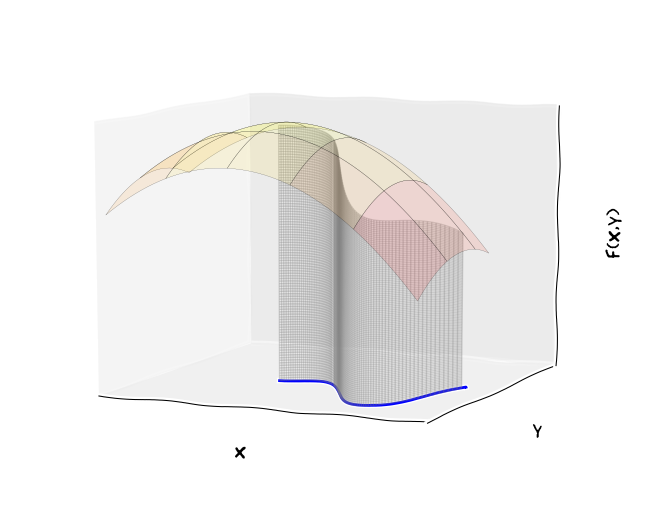
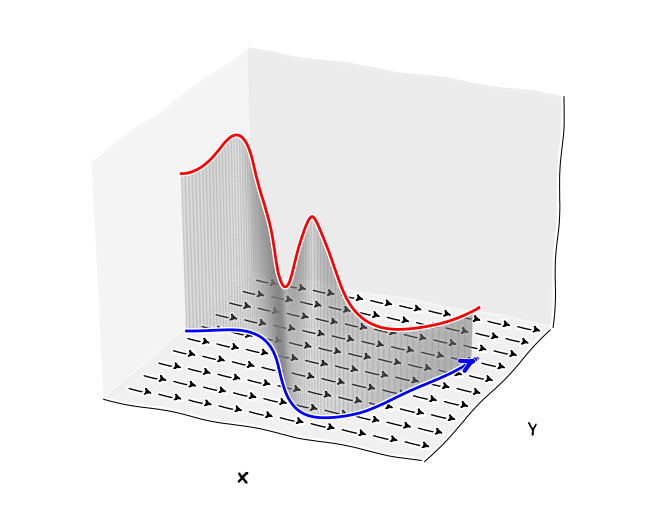
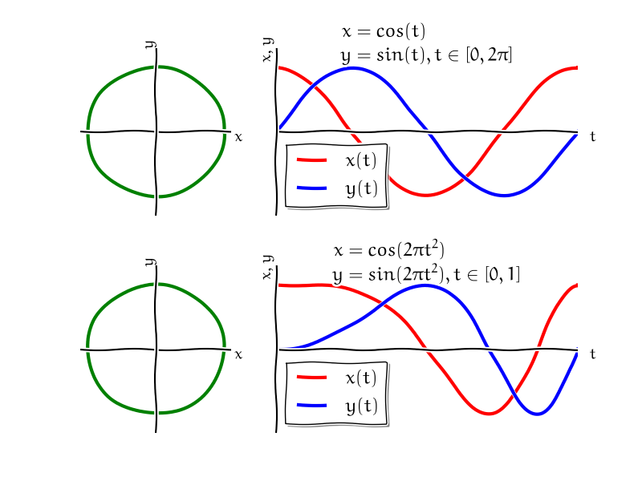
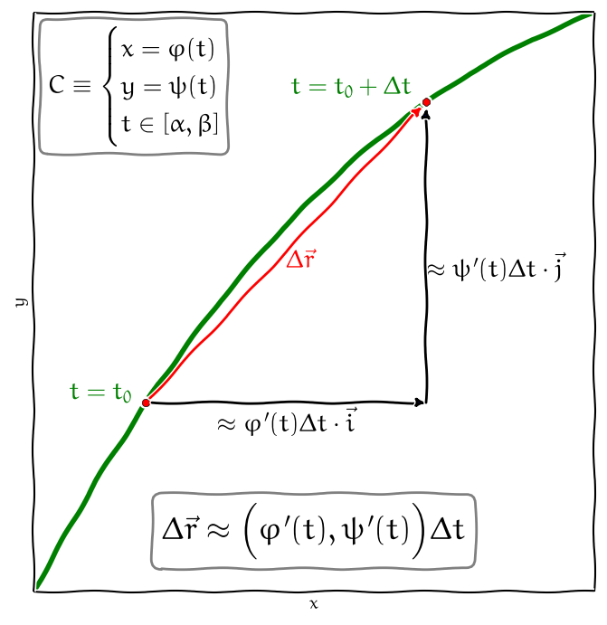
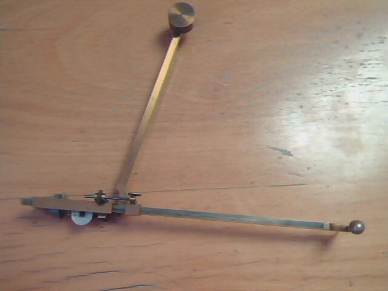
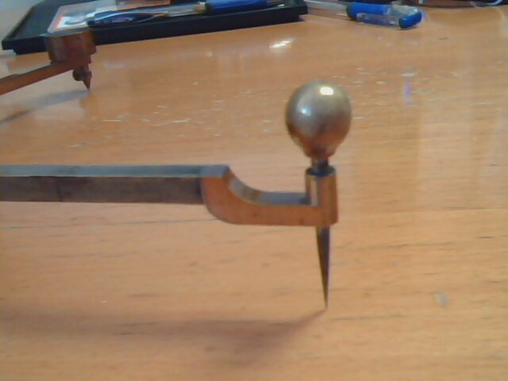
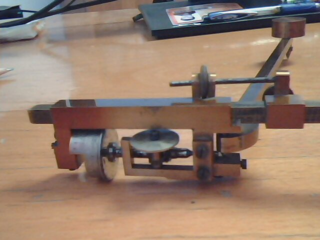

% Křivkový integrál
% Robert Mařík
% jaro 2014, 2018

# Křivkový integrál

Jedná se o rozšíření Riemannova integrálu, kdy množinou přes kterou
integrujeme není úsečka, ale křivka. Pro jednoduchost budeme uvažovat
dvourozměrnou křivku v rovině $x$, $y$.

Rozeznáváme dva druhy křivkových integrálů. První z nich používáme,
pokud pracujeme se skalárními veličinami, jako například kvadratický
moment. Druhý z nich používáme pokud pracujeme ve vektorovém poli,
například při výpočtu práce vykonané po křivce.

# Parametrické rovnice křivky

Nejprve představíme matematický aparát pro popis křivek.  Rovinné
křivky nejčastěji popisujeme vektorovou funkcí jedné proměnné,
resp. dvojicí skalárních funkcí.

* $\vec r: \mathbb{R}\to \mathbb{R}^2$
* $\vec r(t)=[\varphi(t),\psi(t)]=\varphi(t) \vec i + \psi(t)\vec j$, $t\in [\alpha,\beta]$
* Skalární popis křivky: $$C=\begin{cases}
    x=\varphi(t)\\y=\psi(t), \quad t\in[\alpha,\beta]
  \end{cases}$$
* Graf křivky dostaneme tak, že pro každé $t$ z intervalu $[\alpha, \beta]$ kreslíme ve 2D bod $[\varphi(t), \psi(t)]$.
* Funkce $\varphi(t)$, $\psi(t)$ nazýváme *parametrizace* křivky $C$
* Pro danou křivku $C$ v rovině $xy$, nejsou její parametrické rovnice dány jednoznačně.
* [Kreslení pomocí Sage](http://user.mendelu.cz/marik/akademie/sagecell.php?short=1&in=var%28%27x+y%27%29%0D%0A%0D%0A%23%23%23+rovnice+pro+krivky%0D%0An%3D1%0D%0Ax%28t%29%3Dcos%28t%5En%29%0D%0Ay%28t%29%3Dsin%28t%5En%29%0D%0A%0D%0A%23%23%23+meze+pro+parametr%0D%0Atmin%2Ctmax%3D0%2C%282%2Api%29%5E%281%2Fn%29%0D%0A%0D%0A%0D%0A%23%23%23%23%23%23%23%23%23%23%23%23%23%23%23%23%23%23%23%23%23%23%0D%0A%0D%0AP1%3Dplot%28x%28t%29%2C%28t%2Ctmin%2Ctmax%29%2C+legend_label%3D%27x%28t%29%27%29%0D%0AP1%3DP1%2Bplot%28y%28t%29%2C%28t%2Ctmin%2Ctmax%29%2C+color%3D%27red%27%2C+legend_label%3D%27y%28t%29%27%29%0D%0Ashow%28P1%2C+figsize%3D%286%2C4%29%2C+title%3D%22Grafy+x%28t%29+a+y%28y%29%22%29%0D%0A%0D%0AP2%3Dparametric_plot%28%28x%28t%29%2Cy%28t%29%29%2C%28t%2Ctmin%2Ctmax%29%29%0D%0Ashow%28P2%2Caspect_ratio%3D1%2C+title%3D%22Parametricka+krivka%22%29)
* Parametrizace kružnice, úsečky a grafu funkce jedné proměnné: viz [seznam vzorců](http://user.mendelu.cz/marik/am/cheatsheet.pdf)

# Křivkový integrál prvního druhu

Pokud uvažujeme drát o lineární hustotě $f$ a délce $s$, je hmotnost
drátu rovna součinu $m=fs$. Uvažujme drát, který není homogenní, leží
podél rovinné křivky $C$ a jeho specifická hmotnost se mění a bodě
$(x,y)$ je dána funkcí $f(x,y)$. Celkovou hmotnost můžeme odhadnout
takto: 

* Myšlenkově rozdělíme drát na malé kousíčky a každém z nich
odhadneme lineární hustotu konstantou. Můžeme například použít
minimální hodnotu hustoty v tomto kousíčku. 
* Vynásobením délkou každého
kousíčku obdržíme jeho hmotnost a sečtením přes všechny kousky
dostaneme dolní odhad pro hmotnost drátu. Tento odhad bude tím
přesnější, čím jemnější dělení použijeme. 
* Zjemňováním dělení se tyto odhady zpřesňují. 

V limitním procesu, kdy se délka všech kousíčků blíží k nule,
dostáváme objekt, který se nazývá *křivkový integrál prvního druhu*,
označuje $$ \int_C f\;\mathrm{d} s $$ a fyzikálně vyjadřuje hmotnost
drátu z výše uvažované úlohy.  Pokud počáteční a koncový bod křivky
$C$ splývají, píšeme též $$ \oint_C f\;\mathrm{d} s $$ a integrál
nazýváme *integrálem po uzavřené křivce*.

<a href="animation.gif" rel="facebox" alt="Nahrava se ...">Animace</a>

# Převod na Riemannův integrál po rovinné křivce

Mějme parametrické rovnice křivky $C$ ve vektorovém tvaru
$$\vec r(t)=\varphi(t) \vec i + \psi(t)\vec j,$$
kde $t\in[\alpha,\beta]$.
Derivováním křivky dostaneme
$$\frac{\mathrm{d} \vec r(t)}{\mathrm{d}t}=\varphi'(t) \vec i + \psi'(t)\vec j$$
a výpočtem délky vektoru (a formálním vynásobením výrazem $\mathrm{d}t$) dále
$$\mathrm{d}s=|\mathrm{d}\vec r(t)|=\sqrt{(\varphi'(t))^2 + (\psi'(t))^2}\mathrm{d}t.$$
Tím se křivkový integrál prvního druhu funkce $f(x,y)$ po křivce $C$
transformuje na Riemannův integrál
$$
\int_C f\;\mathrm{d} s=\int_\alpha^\beta f(\varphi(t),\psi(t))\sqrt{\varphi'^2(t)+\psi'^2(t)}\;\mathrm{d} t.
$$

# Převod na Riemannův integrál po prostorové  křivce

Podobně jako v rovině převádíme na Riemannův integrál i křivkový integrál prvního druhu po prostorové křivce 
$$
  C:\quad \varphi(t)\vec i + \psi(t)\vec j + \xi(t) \vec k, \quad t\in[\alpha,\beta].
$$
Délkový element je
$$
\mathrm{d}s=\sqrt{\varphi'^2(t)+\psi'^2(t)+\xi'^2(t)}\mathrm{dt}
$$
a integrál má tvar
$$
\int_C f\;\mathrm{d} s=\int_\alpha^\beta f(\varphi(t),\psi(t),\xi(t))\sqrt{\varphi'^2(t)+\psi'^2(t)+\xi^2(t)}\;\mathrm{d} t.
$$

# Vlastnosti křivkového integrálu prvního druhu

* Křivkový integrál prvního druhu nezávisí na konkrétní parametrizaci
  křivky $C$. Pro různé parametrizace stejné křivky má integrál
  stejnou hodnotu.
* Křivkový integrál prvního druhu je lineární vzhledem k funkci a aditivní vzhledem k oboru integrace. Přesněji, pro funkce $f$ a $g$ a konstantu $k$ platí následující.
$$
\begin{aligned}
\int_C f+g\;\mathrm{d}s & = \int_C f\;\mathrm{d}s + \int_C g\;\mathrm{d}s \\
\int_C kf\;\mathrm{d}s & = k\int_C f\;\mathrm{d}s\\
\end{aligned}
$$
Je-li křivka $C$ rozdělena na dvě disjunktní (až na koncové body) křivky $C_1$ a $C_2$, platí
$$
\int_{C} f\;\mathrm{d}s = \int_{C_1} f\;\mathrm{d}s + \int_{C_2} f\;\mathrm{d}s .
$$

# Aplikace křivkového integrálu prvního druhu

|Funkce $f(x,y)$        |Integrál $\int_C f\;\mathrm{d}s$                                                                         |
|----------------|-----------------------------------------|
|$1$ | délka křivky $C$|
|lineární hustota $\tau(x,y)$ | hmotnost $m_C$ křivky $C$|
|$\frac {1}{m_C}[x\tau(x,y),y\tau(xy)]$| souřadnice težiště křivky $C$ |
|$x^2\tau(x,y)$| moment setrvačnosti křivky $C$ vzhledem k  ose $y$|
|$y^2\tau(x,y)$| moment setrvačnosti křivky $C$ vzhledem k  ose $x$|
|$\rho^2(x,y)\tau(x,y)$| moment setrvačnosti křivky $C$ vzhledem k obecné ose, kde $\rho(x,y)$ je vzdálenost bodu $[x,y]$ od osy otáčení.|

# Křivkový integrál druhého druhu

Pokud působíme na těleso silou $F$ a přemísťujeme toto těleso ve směru
působící síly po dráze délky $s$ ,
[konáme práci](http://cs.wikipedia.org/wiki/Mechanická\_práce)
$W=Fs$. Pokud přemísťování neprobíhá ve směru působící síly a má-li
síla směr $\vec F$ a posunutí $\vec s$, je práce rovna skalárnímu
součinu $\vec F\cdot\vec s$.

Předpokládejme, že na těleso působí (obecně nekonstantní) síla $\vec
F$ a těleso se pohybuje podél křivky $C$ určené polohovým vektorem
$\vec r(t)$. Pro výpočet práce můžeme použít stejný trik jako u
křivkového integrálu prvního druhu. Rozdělíme dráhu na malé kousíčky a
v rámci těchto kousíčků považujeme $\vec F$ i $\Delta \vec r$ za
konstantu. Tato aproximace bude tím přesnější, čím jemnější dělení
použijeme.

V limitě dostáváme veličinu, která se nazývá *křivkový integrál
druhého druhu* funkce $\vec F$ po křivce $C$ a zapisujeme $$
\int_C\vec F\;\mathrm{d}\vec r .$$ Je-li $$ \vec F(x,y)=P(x,y)\vec
i+Q(x,y)\vec j, $$ zapisujeme někdy křivkový integrál
\eqref{eq:kr_int_2} ve složkách $$ \int_C P(x,y)\mathrm{d}
x+Q(x,y)\mathrm{d} y.  $$

Protože při pohybu tělesa po křivce jedním směrem se práce koná a při
pohybu opačným směrem spotřebovává, je nutné, aby křivka figurující v
křivkovém integrálu druhého druhu byla orientovaná
- tj. abychom prohlásili, který bod je *počáteční* a který
*koncový*. Vždy budeme předpokládat, že křivka je *orientovaná v
souladu se svým parametrickým vyjádřením*, tj. že počáteční bod křivky
\eqref{eq:C} odpovídá hodnotě parametru $t=\alpha$ a koncový bod
odpovídá hodnotě parametru $t=\beta$.

# Převod na Riemannův integrál

Známe-li parametrické rovnice
$$\vec r = \varphi(t)\vec i + \psi(t) \vec j,\quad t\in[\alpha,\beta],$$
křivky $C$, je možno křivkový integrál
druhého druhu funkce
$$\vec F(x,y)=P(x,y)\vec i + Q(x,y)\vec j$$
po křivce $C$ zapsat
následovně 
$$
\begin{aligned}
\int_C\vec F\;\mathrm{d}\vec r&=
\int_\alpha^\beta\Bigl[ P(\varphi(t),\psi(t))\varphi'(t)\\ &\qquad +Q(\varphi(t),\psi(t))\psi'(t)\Bigr]\;\mathrm{d}t
\end{aligned}
$$ 

# Vlastnosti křivkového integrálu druhého druhu

* Křivkový integrál druhého druhu nezávisí na konkrétní parametrizaci
  křivky $C$. Pro různé parametrizace stejné křivky má integrál
  stejnou hodnotu.
* Změnou orientace křivky křivkový integrál druhého druhu mění znaménko. 
* Křivkový integrál druhého druhu je lineární vzhledem k funkci a
  aditivní vzhledem k oboru integrace. Přesněji, pro funkce $\vec F$ a $\vec G$
  a konstantu $k$ platí následující.
$$
\begin{aligned}
\int_C \vec F+\vec G\;\mathrm{d}\vec {r} & = \int_C \vec F\;\mathrm{d}\vec {r} + \int_C \vec {G}\;\mathrm{d}\vec{r} \\
\int_C k\vec {F}\;\mathrm{d}\vec{r} & = k\int_C \vec{F}\;\mathrm{d}\vec{r}\\
\end{aligned}
$$
Je-li křivka $C$ rozdělena na dvě disjunktní (až na koncové body) křivky $C_1$ a $C_2$, platí
$$
\int_{C} \vec F\;\mathrm{d}\vec{r} = \int_{C_1} \vec F\;\mathrm{d}\vec{r} + \int_{C_2} \vec F\;\mathrm{d}\vec{r} .
$$
Tato vlastnost je stejná jako u křivkového integrálu prvního druhu.

# Aplikace křivkového integrálu druhého druhu

* Integrál
  $$
  \int_C\vec F\;\mathrm{d}\vec r.
  $$
  vyjadřuje **práci** kterou vykoná síla $\vec F$ při přemístění tělesa podél křivky $C$.
* Je-li křivka $C$ uzavřená, píšeme
  $$
  \oint_C\vec F\;\mathrm{d}\vec r.
  $$
  Fyzikálně se jedná o **práci** kterou vykoná síla $\vec F$ při přemístění
  tělesa po uzavřené křivce. Tato práce se též nazývá *cirkulace
  vektorového pole po křivce $C$*. Pokud je možno v poli zavést
  potenciální energii a pokud tedy práce závisí jenom na počáteční a
  koncové poloze, musí tato práce být nulová. To je důsledkem věty
  kterou si uvedeme později.
* Při odvození křivkového integrálu druhého druhu jako vykonané práce hraje roli vlastně jenom ta
  složka silového pole, která při posunu ve směru křivky koná práci, tj. složka, která je tečná ke křivce. Pokud použijeme naopak
  normálovou komponentu, dostaneme veličinu vyjadřující **tok
  vektorového pole křivkou $C$**. Výsledný vzorec vyjadřující tento tok
  je
  $$
  \int_{C}-Q(x,y)\mathrm{d}x+P(x,y)\mathrm{d}y.
  $$
* Je-li množina $\Omega$ "dostatečně pěkná" (např. souvislá, bez děr, s počástech hladkou hranicí $\partial \Omega$ která se nikde neprotíná, detaily uvedeme později u Greenovy věty), potom každý z\ integrálů
  $$\oint_{\partial\Omega}x\mathrm{d}y\qquad\text{a}\qquad\oint_{\partial\Omega}y\mathrm{d}x$$
  udává (až na případné znaménko) obsah množiny $\Omega$. Na tomto principu fungují planimetry.
  

         
  
  
  

# Shrnutí: vlastnosti křivkových integrálů

* Oba integrály jsou **aditivní vzhledem k oboru integrace**. Pokud je
  nutné při parametrizaci křivku rozdělit na konečný počet navzájem
  disjunktních částí, můžeme vypočítat integrál na každé části
  samostatně a výsledky sečíst.  
* Křivkový integrál prvního ani druhého druhu **nezávisí na konkrétní
  parametrizaci křivky**.
* Křivkový integrál prvního druhu **nezávisí na orientaci** křivky.
* Křivkový integrál druhého druhu **při změně orientace křivky mění
  znaménko**.

# Steinerova věta

Nechť je dána křivka $C$ s lineární hustotou $\tau(x,y)$.
Nechť křivka $C$ splňuje $\int_C x \tau(x,y)\;\mathrm{d}s=0$, tj. nechť
osa $y$ prochází těžištěm křivky $C$. Určete moment setrvačnosti
křivky vhledem k ose $o$ rovnoběžné s $y$ ve vzdálenosti $d$ od osy $y$.

*Řešení*
Podle toho zda osa $o$ je nalevo nebo napravo od osy $y$ dostáváme jednu z následujících variant.
$$\begin{aligned}
J_o&=\int_C(x\pm d)^2\tau \;\mathrm{d}s\\
&=\int_C(x^2\pm 2xd+d^2)\tau \;\mathrm{d}s\\
&=\int_C x^2\tau \;\mathrm{d}s \pm 2d\int_C x\tau \;\mathrm{d}s + d^2 \int_C \tau \;\mathrm{d}s.
\end{aligned}
$$
Na pravé straně vidíme, že prvním členem je moment otáčení vzhledem k ose $y$
$$J_{yT}=\int_C x^2\tau \;\mathrm{d}s$$ a ve třetím členu je obsažena hmotnost křivky
$$m=\int_C \tau \;\mathrm{d}s.$$
Dále ze zadání vidíme, že prostřední člen je roven nule.
V označení výše náš vztah dostává tvar
$$J_o=J_{yT}+m d^2.$$
Tento vztah se nazývá Steinerova věta. Ukazuje, že moment setrvačnosti
je nejmenší vzhledem k ose otáční procházející těžišťěm (člen $m
d^2$ je vždy nezáporný) a umožňuje přepočet momentu setrvačnosti pro
rovnoběžné osy.

# Závěrečné informace

## Parametrizace úsečky

* Hledáme parametrické rovnice orientované úsečky $AB$, kde je dán počáteční bod $A=[x_A,y_A]$ a koncový bod $B=[x_B,y_B]$.
* Leží-li bod $X$ na úsečce $AB$, potom vektor $\vec {AX}$ má stejný směr (včetně orientace) jako vektor $\vec {AB}$ a nejvýše stejnou délku.
* Platí tedy $\vec {AX}=t\vec {AB}$ pro nějaké $t\in[0,1]$, tj. $X-A=t(B-A)$ a odsud $X=A+t(B-A)$.
* V souřadnicích zapsáno, parametrické rovnice úsečky jsou $$\begin{aligned}x&=x_A+t(x_B-x_A)\\y&=y_A+t(y_B-y_A), \quad t\in[0,1]\end{aligned}$$
* Pro úsečku v prostoru platí totéž, pouze přibývá třetí souřadnice.

## Online výpočet křivkového integrálu

* [Mathematical assistant on web](http://um.mendelu.cz/maw-html/index.php?lang=cs&form=lineintegral) - i s postupem a grafem křivky
* Křivkový integrál prvního druhu, [numericky pomocí Sage](http://user.mendelu.cz/marik/akademie/sagecell.php?short=1&in=var%28%27t%27%29%0A%23%23%23+zadani+funkce%0Af%28x%2Cy%2Cz%29%3Dx%5E2%0A%0A%23%23%23+rovnice+pro+krivky%0Ax%28t%29%3Dcos%28t%29%0Ay%28t%29%3Dsin%28t%29%0Az%28t%29%3D0%0A%0A%23%23%23+meze+pro+parametr%0Atmin%2Ctmax%3D0%2C2*pi%0A%0A%0A%23%23%23%23%23%23%23%23%23%23%23%23%23%23%23%23%23%23%23%23%23%23%0A%0Anumerical_integral%28+f%28x%3Dx%28t%29%2Cy%3Dy%28t%29%2Cz%3Dz%28t%29%29+*+sqrt%28diff%28x%28t%29%2Ct%29%5E2%2Bdiff%28y%28t%29%2Ct%29%5E2%2Bdiff%28z%28t%29%2Ct%29%5E2%29%2C++++tmin%2Ctmax%29%5B0%5D)
* Křivkový integrál druhého druhu, [numericky pomocí Sage](http://user.mendelu.cz/marik/akademie/sagecell.php?short=1&in=var%28%27t%27%29%0A%23%23%23+zadani+funkce%0AFx%28x%2Cy%2Cz%29%3D-y%0AFy%28x%2Cy%2Cz%29%3Dx%0AFz%28x%2Cy%2Cz%29%3D0%0A%0A%0A%23%23%23+rovnice+pro+krivky%0Ax%28t%29%3D2*cos%28t%29%0Ay%28t%29%3Dsin%28t%29%0Az%28t%29%3D0%0A%0A%23%23%23+meze+pro+parametr%0Atmin%2Ctmax%3D0%2C1%2F4*pi%0A%0A%0A%23%23%23%23%23%23%23%23%23%23%23%23%23%23%23%23%23%23%23%23%23%23%0A%0A%23numerical_integral%28+f%28x%3Dx%28t%29%2Cy%3Dy%28t%29%2Cz%3Dz%28t%29%29+*+sqrt%28diff%28x%28t%29%2Ct%29%5E2%2Bdiff%28y%28t%29%2Ct%29%5E2%2Bdiff%28z%28t%29%2Ct%29%5E2%29%2C++++tmin%2Ctmax%29%5B0%5D%0A%0Adosazeni_krivky%3Dmap%28+lambda+p%3Ap%28x%3Dx%28t%29%2C+y%3Dy%28t%29%2C+z%3Dz%28t%29%29%2C+%28Fx%2CFy%2C+Fz%29%29%0Agradient%3Dmap%28+lambda+p%3Ap.diff%28t%29%2C+%28x%28t%29%2Cy%28t%29%2Cz%28t%29%29+%29%0A%0Anumerical_integral%28vector%28dosazeni_krivky%29.dot_product%28vector%28gradient%29%29%2C++++tmin%2C+tmax%29%5B0%5D)

