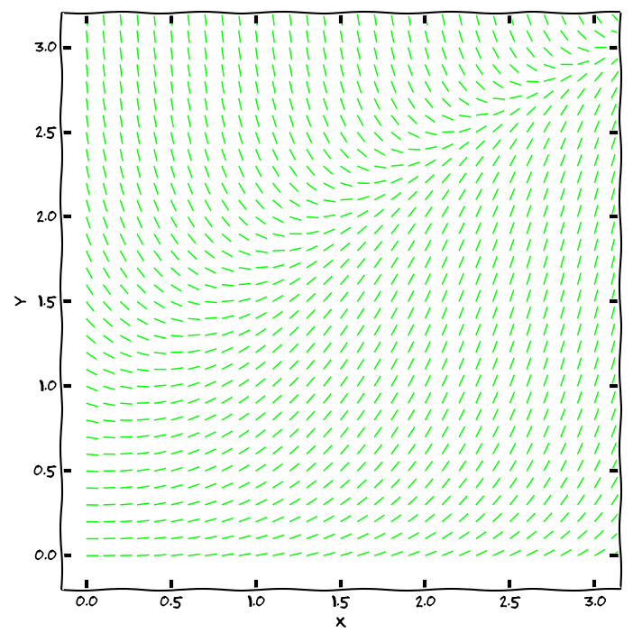

% Diferenciální rovnice prvního řádu
% Robert Mařík
% jaro 2014, jaro 2015

# Obyčejná diferenciální rovnice prvního řádu

Obyčejná diferenciální rovnice je rovnice, kde vystupuje neznámá
funkce a její derivace. Setkáváme se s\ ní například všude tam, kde
rychlost růstu nebo poklesu veličiny souvisí s\ její
velikostí. Například rychlost s\ jakou se mění teplota horkého tělesa
je funkcí teploty samotné. Rychlost tepelné výměny mezi dvěma tělesy
je totiž úměrná rozdílu jejich teplot (Newtonův zákon).

<def>

> **Definice.** *Obyčejnou diferenciální rovnicí prvního řádu rozřešenou vzhledem
> k derivaci* (stručněji též diferenciální rovnicí, DR) s neznámou $y$
> rozumíme rovnici tvaru $$ y'=\varphi(x,y) \tag{ODE}$$ kde $\varphi$ je funkce
> dvou proměnných.

</def>

(anglicky ordinary differential equation, ODE)

**Další formy zápisu**:
  $$\frac{\mathrm{d}y}{\mathrm{d}x}=\varphi(x,y)$$
  $${\mathrm{d}y}=\varphi(x,y)\mathrm{d}x$$
  $${\mathrm{d}y}-\varphi(x,y)\mathrm{d}x=0$$

**Příklad:**  Najděte všechny funkce splňující $y'=2xy$.

# Cauchyova úloha, počáteční podmínka 

Diferenciální rovnice udává scénář vývoje systému. K\ jednoznačnému
předpovězení budoucího stavu je ovšem nutno znát nejenom, jaký
mechanismus ovlivňuje vývoj systému, ale také stav současný.

<def>

> **Definice.** Nechť $x_0$, $y_0$ jsou reálná čísla. Úloha najít
> řešení rovnice  
> $$  y'=\varphi(x,y), \tag{ODE}$$
> které splňuje zadanou *počáteční podmínku*
> $$  y(x_0)=y_0 \tag{IC}$$
> se nazývá *počáteční* (též *Cauchyova*) *úloha*. 
> 
> Řešení Cauchyovy úlohy nazýváme též *partikulárním řešením
> rovnice*. Graf libovolného partikulárního řešení se nazývá *integrální
> křivka*.

</def>

(anglicky initial condition, IC, initial value problem, IVP)

**Příklad:** Najděte všechny funkce splňující $y'=2xy$ a $y(0)=3$.

# Příklad - tepelná výměna

\iffalse

\fi

* Rychlost tepelné výměny mezi dvěma tělesy je úměrná rozdílu jejich
  teplot (Newtonův zákon).  Tento proces je tedy možno modelovat
  diferenciální rovnicí $$ \frac{\mathrm dT}{\mathrm dt}=-k(T-T_0).
  $$
* Rovnice udává, že teplota $T$ horkého tělesa se mění (rychlost změny
  je derivace) tak, že klesá (znaménko minus) rychlostí úměrnou
  (konstanta $k$) teplotnímu rozdílu mezi teplotou tělesa a teplotou
  okolí $T_0$ (člen $T-T_0$).
* K rovnici v ideálním případě dodáváme materiálovou charakteristiku
  (konstantu úměrnosti $k$) a počáteční teplotu. Řešením rovnice je
  funkce udávající závislost teploty na čase. Není tedy nutné provádět
  pokus a čekat na uplynutí požadované doby.
* Někdy může být vhodné nesledovat teplotu $T$, ale rozdíl oproti okolní teplotě, $\tau=T-T_0$. Rovnice se potom zjednoduší na
  $$ \frac{\mathrm d\tau}{\mathrm dt}=-k\tau,	      $$
  tedy na rovnici, kdy rychlost změny je úměrná funkční hodnotě.

# Příklad - datování pomocí uhlíku

\iffalse

\fi

* Při datování archeologických nálezů pozůstatků živých organismů se
  využívá toho, že radioaktivní prvky se rozpadají rychlostí, která je
  úměrná množství dosud nerozpadnutého materiálu.
* Rychlost, s jakou se mění množství (a tedy i koncentrace $y$ v daném
  vzorku) nerozpadnutého radioaktivního materiálu je popsána rovnicí
  $$\frac{\mathrm dy}{\mathrm dt}=-\lambda y,$$
  kde $\lambda$ je konstanta úměrnosti. Tato rovnice je přirozeným
  důsledkem toho, že pro daný nestabilní izotop mají všechny atomy
  stejnou pravděpodobnost, že u nich dojde k rozpadu a tato
  pravděpodobnost se s časem nemění.
* Vhodný radioaktivní prvek vybereme podle toho, jak starý vzorek
  chceme datovat. Nejčastěji měříme množství radioaktivního uhlíku
  $^{14}C$ vztažené k množství stabilního $^{12}C$. Počáteční podmínka
  je známa (předpokládáme stejný poměr zastoupení jako relativně
  nedávno, před průmyslovou revolucí) a díky tomu můžeme najít funkci
  udávající, jak s časem klesá zastoupení radioaktivního uhlíku. Obsah
  radioaktivního i stabilního uhlíku je možné změřit a tím získáme
  odhad, kolik procent radioaktivního
  uhlíku se rozpadlo. Řešení počáteční úlohy poté použijeme pro odhad
  doby, kdy organismus přestal spotřebovávat uhlík z atmosféry,
  tj. odhad stáří vzorku.
* Při pokusu o datování kostí dinosaurů klesne množství
  radioaktivního uhlíku pod měřitelnou úroveň. Proto se
  v tomto případě používají látky s delším poločasem rozpadu.

# Příklad - akutní normovolemická hemodiluce

\iffalse

\fi

* Při chirugické operaci dochází ke krvácení. Pacient ztrácí krev s ní
  i krvinky. Při konstantní intenzitě krvácení to znamená, že pacient
  ztrácí krvinky rychlostí úměrnou počtu krvinek. Formálně se jedná o
  stejnou rovnici jako u radioaktivního rozpadu, jenom změníme
  interpretaci veličin.
* Pokud očekáváme takový průběh operace, že i po uvedeném poklesu bude
  pořád množství krvinek nad minimální přípustnou hodnotou, je možné
  před operací toto množství snížit tím, že se část krve odebere a
  krev se poté doplní vhodnými roztoky.
* Protože pacient má už od začátku operace menší počet krvinek, ztrácí
  tyto krvinky pomaleji a celkový úbytek během operace je menší. Na
  konci operace se pacientovi vrátí dříve odebraná krev. Výsledkem je,
  že po operaci v jeho těle koluje více krvinek, než pokud by byl
  operován s "původní krví".
* Metoda akutní normovolemické hemodiluce nachází v současné praxi
  široké využití v řadě operačních oborů. Poskytuje totiž možnost
  vyhnout se podání alogenní krevní transfuze a tím eliminovat rizika
  z ní vyplývající. Současně je tato metoda výrazně finančně levnější
  a její přínos je tak i ekonomický. (podle https://zdravi.euro.cz/)

# Příklad - rovnice samočištění jezer

\iffalse

\fi

* Nechť veličina $y$ udává množství látky, která znečišťuje vodu v\ jezeře o\ objemu $V$.
* Předpokládejme, že do jezera přitéká čistá voda a stejnou rychlostí
  odtéká voda s\ nečistotami (hladina se nemění, je v\ ustáleném
  stavu). Nechť veličina $r$ udává, jaký objem vody se v\ jezeře takto
  vymění za jeden den.  Předpokládejme dále (poněkud nerealisticky),
  že rozdělení znečišťujících částic v\ jezeře je rovnoměrné.
* Úbytek hmotnosti nečistot za časovou jednotku je dán derivací
  $\frac{\mathrm dy}{\mathrm dt}$.
* Tento úbytek hmotnosti je možno vyjádřit též ve tvaru $\frac rVx$, kde
  $\frac rV$ je pro dané jezero kladná konstanta udávající, jak velká
  část z\ celkového množství vody se v\ jezeře vymění za časovou jednotku.
  Označíme-li tuto konstantu symbolem $k$, je proces úbytku nečistot
  v\ jezeře popsán diferenciální rovnicí
  $$
  \frac{\mathrm dy}{\mathrm dt}  =-ky.
  $$
* Výše uvedená rovnice na nazývá *rovnice samočištění jezer*, ale
  tento název je čistě formální. Jedná se vlastně o stejnou rovnici,
  která popisuje radioaktivní rozpad, ztrátu krvinek při operaci nebo
  změnu rozdílu mezi teplotou horkého nápoje a místnosti při chladnutí
  nápoje.
* Stejnou rovnicí je možné popsat nejenom odbourávání nečistot z
  životního prostředí, ale i odbourávání léků nebo drog z
  těla. Považujme krevní oběh za jezero a lék nebo drogu za
  znečišťující látku. V případě, že rychlost odbourávání je úměrná
  koncentraci (platí pro farmakokinetiku prvního řádu, toto splňuje
  většina léčiv za běžných koncentrací), řídí se proces odbourávání
  stejnou diferenciální rovnicí.

# Příklad - vývoj populace a její ekologický lov

\iffalse

\fi

* Zkoumejme velikost $y$  určité populace, v prostředí s nosnou kapacitou $K$.
* Realistickým předpokladem v prostředí s omezenými úživnými
  vlastnostmi je, že specifická míru růstu populace (rychlost s jakou
  se velikost populace zvětšuje vztažená na jednotkové množství
  populace) klesá s tím, jak se velikost populace přibližuje k nosné
  kapacitě a je modelována funkcí $r\left(1-\frac yK\right)$.  Podle
  velkosti koeficientů v této rovnici dělíme živočichy na [r-stratégy
  a
  K-stratégy](http://cs.wikipedia.org/wiki/%C5%BDivotn%C3%AD_strategie),
  toto dělení odráží, jak se snaží druh přežít.
* Za uvedených předpokladů je možno vývoj populace popsat rovnicí 
  $$\frac{\mathrm dy}{\mathrm dt}=ry\left(1-\frac yK\right).$$	  

* Pokud lovem snížíme přírůstky populace, můžeme tento proces modelovat rovnicí 
  $$\frac{\mathrm dy}{\mathrm dt}=ry\left(1-\frac yK\right)-h(y),$$
  kde $h(y)$ je intenzita lovu populace o velikosti $y$. Modelování
  tohoto procesu umožní nalezení ekonomicky výhodné ale trvale
  udržitelné strategie lovu.

# Geometrická interpretace ODE

Protože derivace funkce v bodě udává směrnici tečny ke grafu funkce
v tomto bodě, lze rovnici $$y'=\varphi(x,y)\tag{ODE}$$ chápat jako předpis, který
každému bodu v rovině přiřadí směrnici tečny k integrální křivce,
která tímto bodem prochází.  Sestrojíme-li v dostatečném počtu
(například i náhodně zvolených) bodů $[x,y]$ v rovině vektory
$(1,\varphi(x,y))$, obdržíme **směrové pole diferenciální rovnice** —
systém lineárních elementů, které jsou tečné k integrálním křivkám.

Počáteční podmínka $y(x_0)=y_0$ geometricky vyjadřuje skutečnost, že graf
příslušného řešení prochází v rovině bodem $[x_0,y_0]$. Má-li tato
počáteční úloha jediné řešení, neprochází bodem $[x_0,y_0]$ žádná další
křivka. Má-li každá počáteční úloha jediné řešení (což bude pro nás
velice častý případ), znamená to, že integrální křivky se *nikde
neprotínají*.

Vrstevnice funkce $\varphi(x,y)$ mají tu vlastnost, že derivace
integrálních křivek podél každé z\ vrstevnic je konstantní. Proto tyto
křivky nazýváme **isokliny**.

\iffalse

\fi

# Obecné a partikulární řešení

Řešení diferenciální rovnice je nekonečně mnoho. Zpravidla je dokážeme
zapsat pomocí jediného vzorce, který obsahuje nějakou (alespoň do
jisté míry libovolnou) konstantu $C$. Takový vzorec se nazývá **obecné
řešení rovnice**. Pokud není zadána počáteční podmínka a mluvíme o
**partikulárním řešení**, máme tím na mysli jednu libovolnou funkci
splňující diferenciální rovnici.

**Příklad:** Obecným řešením diferenciální rovnice $$y'=2xy$$ je
  $$y=Ce^{x^2}, \quad C\in\mathbb{R}.$$ Žádná jiná řešení neexistují,
  všechna řešení se dají zapsat v tomto tvaru pro nějakou vhodnou
  konstantu $C$.  Partikulárním řešením je například
  $y=5e^{x^2}$. Řešením počáteční úlohy $$y'=2xy, \quad y(0)=3$$ je
  $$y=3e^{x^2}.$$

\iffalse

**Online řešiče ODE (symbolicky):**

* [Wolfram Alpha](http://www.wolframalpha.com/input/?i=solve+y%27%2Bx*y%3Dx%2Fy)
* [Mathematical Assistant on Web](http://um.mendelu.cz/maw-html/index.php?lang=cs&form=ode&ode2=y%27%2Bx*y%3Dx%2Fy)
* [Sage](http://user.mendelu.cz/marik/akademie/sagecell.php?short=1&in=y%3Dfunction%28%27y%27%2Cx%29%0A%0A%23+rovnice+y%27%3Dy%2Fx%2B1%0Arovnice+%3D+diff%28y%2Cx%29+%3D%3D+y%2Fx+%2B+1%0A%0A%23+%3Fe%3Fen%3F%0Adesolve%28rovnice%2C+y%29.show%28%29%0A%23+%3Fe%3Fen%3F+v+rozn%3Fsoben%3Fm+tvaru%0Adesolve%28rovnice%2C+y%29.expand%28%29.show%28%29)

\fi

# Numerické řešení IVP

Řešení počáteční úlohy lze numericky aproximovat poměrně snadno:
začneme v bodě zadaném počáteční podmínkou a v okolí tohoto bodu
nahradíme integrální křivku její tečnou. Tím se dostaneme do dalšího
bodu, odkud opět integrální křivku aproximujeme tečnou.  Směrnici
tečny zjistíme z diferenciální rovnice, buď přímo z derivace (Eulerova
metoda).

Další možnost je použít k aproximaci sečnu tak, že opravíme
směrnici tečny podle chování směrového pole. Bereme v úvahu
i konvexnost či konkávnost a fakt, že se derivace mění s měnícím se
$x$ i $y$ (metoda Runge–Kutta). Stačí tedy mít zvolen *krok* numerické
metody (délku intervalu, na kterém aproximaci tečnou použijeme) a
výstupem metody bude aproximace integrální křivky pomocí lomené čáry.

\iffalse

**Online řešiče ODE (numericky):**

* [dfield](http://math.rice.edu/~dfield/dfpp.html)
* [Sage](http://user.mendelu.cz/marik/akademie/sagecell.php?short=1&in=f%28x%2Cy%29%3Dy*%28x-y%29%0A%0Aymin%2C+ymax+%3D+0%2C+2%0A%0Aics1%3D%5B0%2C0.1%5D%0Aics2%3D%5B0%2C1%5D%0A%0AP2%3Ddesolve_rk4%28f%28x%2Cy%29%2Cy%2Cics%3Dics1%2Civar%3Dx%2Cend_points%3D%5B0%2C3%5D%2Coutput%3D%27slope_field%27%29%0AP1%3Ddesolve_rk4%28f%28x%2Cy%29%2Cy%2Cics%3Dics2%2Civar%3Dx%2Cend_points%3D%5B0%2C3%5D%2Coutput%3D%27plot%27%2C+color%3D%27red%27%29%0A%0A%28P1%2BP2%29.show%28ymax%3Dymax%2Cymin%3Dymin%29)

\fi

\iffalse

\fi

# Iterační schema Eulerovy metody

Počáteční úloha: $$y'=\varphi(x,y), \quad y(x_0)=y_0$$

Tečna k řešení v bodě $[x_0,y_0]$: $$y=y_0+\varphi(x_0,y_0)(x-x_0).$$

Funkční hodnota v bodě $x_0+h$, kde $h$ je krok Eulerovy metody: $$y(x_0+h)=y_0+\varphi(x_0,y_0)h.$$

Iterační formule Eulerovy metody: $$\begin{aligned}x_{n+1}&=x_n+h, \\ y_{n+1}&=y_n+\varphi(x_n,y_n)h.\end{aligned}$$

**Vylepšení**

* zjemnit krok $h$ (buď všude, nebo jenom tam, kde "je to potřeba"),
* použít místo $\varphi(x_n,y_n)$ lepší směrnici (Metoda Runge Kutta druhého nebo čtvrtého řádu, ...).

# ODE se separovanými proměnnými

<def>

> **Definice.** Diferenciální rovnice tvaru
> $$    y'=f(x)g(y) \tag{S}$$
> kde $f$ a $g$ jsou funkce spojité na (nějakých) otevřených intervalech
> se nazývá *obyčejná diferenciální rovnice se separovanými proměnnými.*

</def>

**Příklad:** Rovnice $$y'+xy +xy^2=0$$ je rovnicí se separovanými
  proměnnými, protože je možno ji zapsat ve tvaru $$y'=-xy(y+1).$$
  Rovnice $$y'=x^2-y^2$$ není rovnice se separovatelnými proměnnými.

**Test separovatelnosti proměnných:** Diferenciální rovnice
  $$y'=\varphi(x,y)$$ je rovnicí se separovanými proměnnými právě
  tehdy, když existují funkce $f(x)$ a $g(y)$ takové, že
  $$\varphi(x,y)=f(x)g(y). $$ Pokud je $\varphi$ nezáporná a
  dostatečně hladká na nějaké otevřené konvexní množině, je rovnice
  rovnicí se separovanými proměnnými právě tehdy, když platí
  $$\begin{vmatrix}\varphi&\frac{\partial}{\partial x}\varphi\\
  \frac{\partial}{\partial y}\varphi&\frac{\partial^2}{\partial
  x\partial y}\varphi \end{vmatrix}=0.$$

# Řešení ODE se separovanými proměnnými

1.  Má-li algebraická rovnice $g(y)=0$ řešení $k_1$, $k_2$, …, $k_n$,
    jsou konstantní funkce $y\equiv k_1$, $y\equiv k_2$, …,
    $y\equiv k_n$ řešeními rovnice.

2.  Pracujme na intervalech, kde $g(y)\neq 0$. Formálně nahradíme
    derivaci $y'$ podílem diferenciálů $\frac{\mathrm{d}y}{\mathrm{d}x}$
    $$   \frac{\mathrm{d}y}{\mathrm{d}x}=f(x)g(y).$$

3.  Odseparujeme proměnné
    $$          \frac{\mathrm{d}y}{g(y)}=f(x)\mathrm{d}x.$$

4.  Získanou rovnost integrujeme
    $$
          \int \frac{\mathrm{d}y}{g(y)}=\int f(x)\mathrm{d}x+C.$$

5.  Pokud je zadána počáteční podmínka, je možné ji na tomto místě
    dosadit do obecného řešení a určit hodnotu konstanty $C$. Tuto
    hodnotu poté dosadíme zpět do obecného řešení a obdržíme řešení
    *partikulární*.

6.  Pokud je to možné, převedeme řešení (obecné nebo partikulární) do
    explicitního tvaru (vyjádříme odsud $y$).

\iffalse

# Proč funguje postup z předchozího slidu?

Výraz $\frac{\mathrm{d}y}{\mathrm{d}x}$ je derivace, nikoliv podíl,
proto je s podivem, že výše uvedený postup funguje. Berme jej prosím
jako mnemotechinckou pomůcku při řešení a představme si
sofistikovanější zdůvodnění tohoto postupu (pro případ $g(y)\neq 0$) založené na integrování a substituci v neučitém integrálu.

$$ 
 \begin{aligned}    
  y'&=f(x)g(y)\\
  \frac{1}{g(y)} y' &= f(x) \\
  \int \frac{1}{g(y(x))} y'(x)\mathrm{d}x &= \int f(x) \mathrm{d}x\\
  \int \frac{1}{g(y)} \mathrm{d}y &= \int f(x) \mathrm{d}x
 \end{aligned}
$$

Za povšimnutí také stojí fakt, že ekvivalentní vyjádření rovnice ve tvaru
$$ f(x)\mathrm{d}x - \frac{1}{g(y)} \mathrm{d}y = 0 $$
obsahuje na levé straně totální diferenciál. Kmenová funkce tohoto diferenciálu je 
$$F(x,y)=   \int f(x) \mathrm{d}x - \int \frac{1}{g(y)} \mathrm{d}y $$
a řešení rovnice jsou tvaru $$F(x,y)=C, \qquad C\in\mathbb{R}.$$ Pohlížíme-li
na tento vztah jako na implicitně zadanou funkci a počítáme-li pomocí
aparátu funkce dvou proměnných derivaci této funkce, dostaneme přesně vztah 
$$  y'=f(x)g(y). $$

\fi

# Existence a jednoznačnost řešení

> **Věta o existenci a jednoznačnosti řešení:** Je-li $g(y_0)\neq 0$, je řešení počáteční
> úlohy $$y'=f(x)g(y), \qquad y(x_0)=y_0,$$ které obdržíme pomocí
> postupu z předchozích odstavců, definované a jednoznačně určené v nějakém okolí
> bodu $x_0$.

**Vzorec pro řešení IVP pro rovnici se separovatelnými proměnnými:**
Partikulární řešení počáteční úlohy $$y'=f(x)g(y), \qquad y(x_0)=y_0$$
lze psát též přímo ve tvaru určitého integrálu $$\int_{y_0}^y\frac
{\mathrm{d}t}{g(t)}=\int_{x_0}^x f(t)\mathrm{d}t.$$

