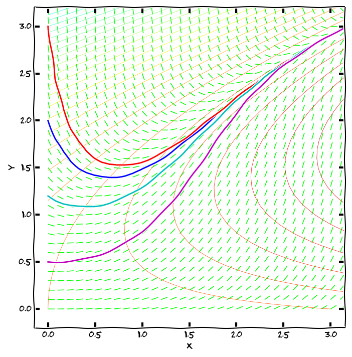

% Diferenciální rovnice prvního řádu
% Robert Mařík
% jaro 2014, jaro 2015

# Obyčejná diferenciální rovnice prvního řádu

Obyčejná diferenciální rovnice je rovnice, kde vystupuje neznámá
funkce a její derivace. Setkáváme se s\ ní například všude tam, kde
rychlost růstu nebo poklesu veličiny souvisí s\ její
velikostí. Například rychlost s\ jakou se mění teplota horkého tělesa
je funkcí teploty samotné. Rychlost tepelné výměny mezi dvěma tělesy
je totiž úměrná rozdílu jejich teplot (Newtonův zákon).

<def>

> **Definice.** *Obyčejnou diferenciální rovnicí prvního řádu rozřešenou vzhledem
> k derivaci* (stručněji též diferenciální rovnicí, DR) s neznámou $y$
> rozumíme rovnici tvaru $$ y'=\varphi(x,y) \tag{ODE}$$ kde $\varphi$ je funkce
> dvou proměnných.

</def>

(anglicky ordinary differential equation, ODE)

**Další formy zápisu**:
  $$\frac{\mathrm{d}y}{\mathrm{d}x}=\varphi(x,y)$$
  $${\mathrm{d}y}=\varphi(x,y)\mathrm{d}x$$
  $${\mathrm{d}y}-\varphi(x,y)\mathrm{d}x=0$$

# Příklady diferenciálních rovnic

Z\ fyzikálního hlediska diferenciální rovnice popisuje mechanismus
vývoje systému.

### Tepelná výměna

Rychlost tepelné výměny mezi dvěma tělesy je úměrná rozdílu jejich
teplot (Newtonův zákon).  Tento proces je tedy možno modelovat
diferenciální rovnicí
$$
  y'=-k(y-T)
$$
teplota $y$ horkého tělesa se mění (rychlost změny je derivace $y'$)
tak, že klesá (znaménko minus) rychlostí úměrnou (konstanta $k$)
teplotnímu rozdílu mezi teplotou tělesa a teplotou okolí (člen $y-T$).

### Vývoj populace

Udává-li $y$ velikost určité populace, $K$ nosnou kapacitu prostředí,
$h(y)$ intenzitu lovu a $r\left(1-\frac yK\right)$ specifickou míru
růstu populace (rychlost s jakou se velikost populace zvětšuje
vztažená na jednotkové množství populace, přičemž tato rychlost klesá
s tím, jak se velikost populace přibližuje k nosné kapacitě
prostředí), je možno populaci modelovat rovnicí
$$y'=ry\left(1-\frac yK\right)-h(y).$$

Podle velkosti koeficientů v této rovnici dělíme živočichy na
[r-stratégy a
K-stratégy](http://cs.wikipedia.org/wiki/%C5%BDivotn%C3%AD_strategie),
toto dělení odráží, jak se snaží druh přežít.

# Cauchyova úloha, počáteční podmínka 

Diferenciální rovnice udává scénář vývoje systému. K\ jednoznačnému
předpovězení budoucího stavu je ovšem nutno znát nejenom, jaký
mechanismus ovlivňuje vývoj systému, ale také stav současný.

<def>

> **Definice.** Nechť $x_0$, $y_0$ jsou reálná čísla. Úloha najít
> řešení rovnice  
> $$  y'=\varphi(x,y), \tag{ODE}$$
> které splňuje zadanou *počáteční podmínku*
> $$  y(x_0)=y_0 \tag{IC}$$
> se nazývá *počáteční* (též *Cauchyova*) *úloha*. 
> 
> Řešení Cauchyovy úlohy nazýváme též *partikulárním řešením
> rovnice*. Graf libovolného partikulárního řešení se nazývá *integrální
> křivka*.

</def>

(anglicky initial condition, IC, initial value problem, IVP)

# Geometrická interpretace ODE

Protože derivace funkce v bodě udává směrnici tečny ke grafu funkce
v tomto bodě, lze rovnici $$y'=\varphi(x,y)\tag{ODE}$$ chápat jako předpis, který
každému bodu v rovině přiřadí směrnici tečny k integrální křivce,
která tímto bodem prochází.  Sestrojíme-li v dostatečném počtu
(například i náhodně zvolených) bodů $[x,y]$ v rovině vektory
$(1,\varphi(x,y))$, obdržíme **směrové pole diferenciální rovnice** —
systém lineárních elementů, které jsou tečné k integrálním křivkám.

Počáteční podmínka $y(x_0)=y_0$ geometricky vyjadřuje skutečnost, že graf
příslušného řešení prochází v rovině bodem $[x_0,y_0]$. Má-li tato
počáteční úloha jediné řešení, neprochází bodem $[x_0,y_0]$ žádná další
křivka. Má-li každá počáteční úloha jediné řešení (což bude pro nás
velice častý případ), znamená to, že integrální křivky se *nikde
neprotínají*.

Vrstevnice funkce $\varphi(x,y)$ mají tu vlastnost, že derivace
integrálních křivek podél každé z\ vrstevnic je konstantní. Proto tyto
křivky nazýváme **isokliny**.

# Obecné a partikulární řešení

Řešení diferenciální rovnice je nekonečně mnoho. Zpravidla je dokážeme
zapsat pomocí jediného vzorce, který obsahuje nějakou (alespoň do
jisté míry libovolnou) konstantu $C$. Takový vzorec se nazývá **obecné
řešení rovnice**. Pokud není zadána počáteční podmínka a mluvíme o
**partikulárním řešení**, máme tím na mysli jednu libovolnou funkci
splňující diferenciální rovnici.

**Příklad:** Obecným řešením diferenciální rovnice $$y'=2xy$$ je
  $$y=Ce^{x^2}, \quad C\in\mathbb{R}.$$ Žádná jiná řešení neexistují,
  všechna řešení se dají zapsat v tomto tvaru pro nějakou vhodnou
  konstantu $C$.  Partikulárním řešením je například
  $y=5e^{x^2}$. Řešením počáteční úlohy $$y'=2xy, \quad y(0)=3$$ je
  $$y=3e^{x^2}.$$

**Online řešiče ODE (symbolicky):**

* [Wolfram Alpha](http://www.wolframalpha.com/input/?i=solve+y%27%2Bx*y%3Dx%2Fy)
* [Mathematical Assistant on Web](http://um.mendelu.cz/maw-html/index.php?lang=cs&form=ode&ode2=y%27%2Bx*y%3Dx%2Fy)
* [Sage](http://user.mendelu.cz/marik/akademie/sagecell.php?short=1&in=y%3Dfunction%28%27y%27%2Cx%29%0A%0A%23+rovnice+y%27%3Dy%2Fx%2B1%0Arovnice+%3D+diff%28y%2Cx%29+%3D%3D+y%2Fx+%2B+1%0A%0A%23+%3Fe%3Fen%3F%0Adesolve%28rovnice%2C+y%29.show%28%29%0A%23+%3Fe%3Fen%3F+v+rozn%3Fsoben%3Fm+tvaru%0Adesolve%28rovnice%2C+y%29.expand%28%29.show%28%29)

# Numerické řešení IVP

Řešení počáteční úlohy lze numericky aproximovat poměrně snadno:
začneme v bodě zadaném počáteční podmínkou a v okolí tohoto bodu
nahradíme integrální křivku její tečnou. Tím se dostaneme do dalšího
bodu, odkud opět integrální křivku aproximujeme tečnou.

Směrnici tečny zjistíme z diferenciální rovnice, buď přímo z derivace
(Eulerova metoda), nebo poněkud rafinovaněji, kdy bereme v úvahu
i konvexnost či konkávnost a fakt, že se derivace mění s měnícím se
$x$ i $y$ (metoda Runge–Kutta). Stačí tedy mít zvolen *krok* numerické
metody (délku intervalu, na kterém aproximaci tečnou použijeme) a
výstupem metody bude aproximace integrální křivky pomocí lomené čáry.

**Online řešiče ODE (numericky):**

* [dfield](http://math.rice.edu/~dfield/dfpp.html)
* [Sage](http://user.mendelu.cz/marik/akademie/sagecell.php?short=1&in=f%28x%2Cy%29%3Dy*%28x-y%29%0A%0Aymin%2C+ymax+%3D+0%2C+2%0A%0Aics1%3D%5B0%2C0.1%5D%0Aics2%3D%5B0%2C1%5D%0A%0AP2%3Ddesolve_rk4%28f%28x%2Cy%29%2Cy%2Cics%3Dics1%2Civar%3Dx%2Cend_points%3D%5B0%2C3%5D%2Coutput%3D%27slope_field%27%29%0AP1%3Ddesolve_rk4%28f%28x%2Cy%29%2Cy%2Cics%3Dics2%2Civar%3Dx%2Cend_points%3D%5B0%2C3%5D%2Coutput%3D%27plot%27%2C+color%3D%27red%27%29%0A%0A%28P1%2BP2%29.show%28ymax%3Dymax%2Cymin%3Dymin%29)

# ODE se separovanými proměnnými

<def>

> **Definice.** Diferenciální rovnice tvaru
> $$    y'=f(x)g(y) \tag{S}$$
> kde $f$ a $g$ jsou funkce spojité na (nějakých) otevřených intervalech
> se nazývá *obyčejná diferenciální rovnice se separovanými proměnnými.*

</def>

**Příklad:** Rovnice $$y'+xy +xy^2=0$$ je rovnicí se separovanými
  proměnnými, protože je možno ji zapsat ve tvaru $$y'=-xy(y+1).$$
  Rovnice $$y'=x^2-y^2$$ není rovnice se separovatelnými proměnnými.

**Test separovatelnosti proměnných:** Diferenciální rovnice
  $$y'=\varphi(x,y)$$ je rovnicí se separovanými proměnnými právě
  tehdy, když existují funkce $f(x)$ a $g(y)$ takové, že
  $$\varphi(x,y)=f(x)g(y). $$ Pokud je $\varphi$ nezáporná a
  dostatečně hladká na nějaké otevřené konvexní množině, je rovnice
  rovnicí se separovanými proměnnými právě tehdy, když platí
  $$\begin{vmatrix}\varphi&\frac{\partial}{\partial x}\varphi\\
  \frac{\partial}{\partial y}\varphi&\frac{\partial^2}{\partial
  x\partial y}\varphi \end{vmatrix}=0.$$

# Řešení ODE se separovanými proměnnými

1.  Má-li algebraická rovnice $g(y)=0$ řešení $k_1$, $k_2$, …, $k_n$,
    jsou konstantní funkce $y\equiv k_1$, $y\equiv k_2$, …,
    $y\equiv k_n$ řešeními rovnice.

2.  Pracujme na intervalech, kde $g(y)\neq 0$. Formálně nahradíme
    derivaci $y'$ podílem diferenciálů $\frac{\mathrm{d}y}{\mathrm{d}x}$
    $$   \frac{\mathrm{d}y}{\mathrm{d}x}=f(x)g(y).$$

3.  Odseparujeme proměnné
    $$          \frac{\mathrm{d}y}{g(y)}=f(x)\mathrm{d}x.$$

4.  Získanou rovnost integrujeme
    $$
          \int \frac{\mathrm{d}y}{g(y)}=\int f(x)\mathrm{d}x+C.$$

5.  Pokud je zadána počáteční podmínka, je možné ji na tomto místě
    dosadit do obecného řešení a určit hodnotu konstanty $C$. Tuto
    hodnotu poté dosadíme zpět do obecného řešení a obdržíme řešení
    *partikulární*.

6.  Pokud je to možné, převedeme řešení (obecné nebo partikulární) do
    explicitního tvaru (vyjádříme odsud $y$).

# Proč funguje postup z předchozího slidu?

Výraz $\frac{\mathrm{d}y}{\mathrm{d}x}$ je derivace, nikoliv podíl,
proto je s podivem, že výše uvedený postup funguje. Berme jej prosím
jako mnemotechinckou pomůcku při řešení a představme si
sofistikovanější zdůvodnění tohoto postupu (pro případ $g(y)\neq 0$) založené na integrování a substituci v neučitém integrálu.

$$ 
 \begin{aligned}    
  y'&=f(x)g(y)\\
  \frac{1}{g(y)} y' &= f(x) \\
  \int \frac{1}{g(y(x))} y'(x)\mathrm{d}x &= \int f(x) \mathrm{d}x\\
  \int \frac{1}{g(y)} \mathrm{d}y &= \int f(x) \mathrm{d}x
 \end{aligned}
$$

Za povšimnutí také stojí fakt, že ekvivalentní vyjádření rovnice ve tvaru
$$ f(x)\mathrm{d}x - \frac{1}{g(y)} \mathrm{d}y = 0 $$
obsahuje na levé straně totální diferenciál. Kmenová funkce tohoto diferenciálu je 
$$F(x,y)=   \int f(x) \mathrm{d}x - \int \frac{1}{g(y)} \mathrm{d}y $$
a řešení rovnice jsou tvaru $$F(x,y)=C, \qquad C\in\mathbb{R}.$$ Pohlížíme-li
na tento vztah jako na implicitně zadanou funkci a počítáme-li pomocí
aparátu funkce dvou proměnných derivaci této funkce, dostaneme přesně vztah 
$$  y'=f(x)g(y). $$

# Existence a jednoznačnost řešení

> **Věta o existenci a jednoznačnosti řešení:** Je-li $g(y_0)\neq 0$, je řešení počáteční
> úlohy $$y'=f(x)g(y), \qquad y(x_0)=y_0,$$ které obdržíme pomocí
> postupu z předchozích odstavců, definované a jednoznačně určené v nějakém okolí
> bodu $x_0$.

**Vzorec pro řešení IVP pro rovnici se separovatelnými proměnnými:**
Partikulární řešení počáteční úlohy $$y'=f(x)g(y), \qquad y(x_0)=y_0$$
lze psát též přímo ve tvaru určitého integrálu $$\int_{y_0}^y\frac
{\mathrm{d}t}{g(t)}=\int_{x_0}^x f(t)\mathrm{d}t$$

