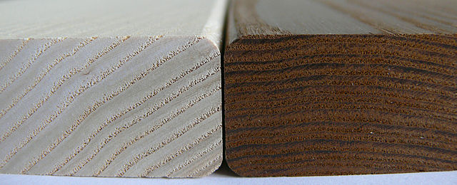
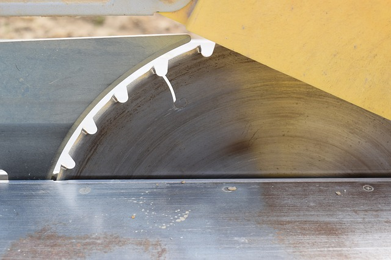

% Aplikovaná matematika (kam kráčíme)
% Robert Mařík
% 2019

# Pevnost, tuhost

Pevnost s tuhost je vlastně rezistence proti uvedení do rotačního
pohybu. Souvisí k kvadratickým momentem průřezu.

# Ička jsou velice pevné nosníky

#  Živočichové mají velice pevné kosti

# Stromy jsou velmi pevné

# Rozhledny nepadají

# Provazochodci nepadají

# Zákon zachování

* Co do daného místa přiteče se smísí s tím, co v tomto místě
  vznikne. Dále odečteme to, co v daném místě zanikne a co
  odteče. Pokud něco zůstane, tak se v daném místě akumuluje.
* Předchozí bod udává univerzální zákon zachování. Tento zákon
  zachování naplníme obsahem, interpretací veličin a materiálovými
  vztahy. Podle toho, jakou veličinu sledujeme a jaký problém zkoumáme.

# Sušení dřeva

# Tepelná modifikace dřeva

 

# Vedení vody v půdě

# Strom je přírodní klimatizaci díky odpařování vody

# Kresba na srsti

# Kmity a vlny

Kmity a vlny jsou popsány všechny stejnou rovnicí. Nezávisle na fyzikálním podstatě. 

# Kmitání milujeme u hudebních nástrojů

# Kmitání nám vadí u zdrojů hluku

# Radiovlny jsou také vlnění. Elekromagnetické.

# Světlo je také vlnění. Elekromagnetické. Umí se odrážet.

# Radar pracuje na principu odrazu elmg. vlnění.

# Cíl mise: dodat nástroje k prozkoumávání

Cílem našeho snažení je představit si matematický aparát, který umožní
principy a fyzikální představy o fungování dějů a pozadí procesů
formulovat kvantitativně.

