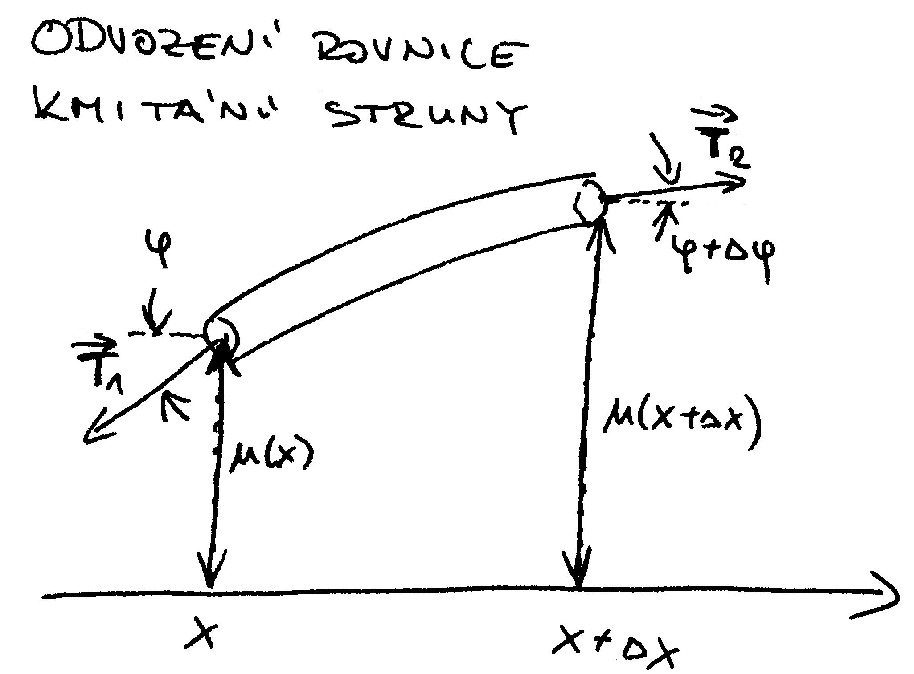
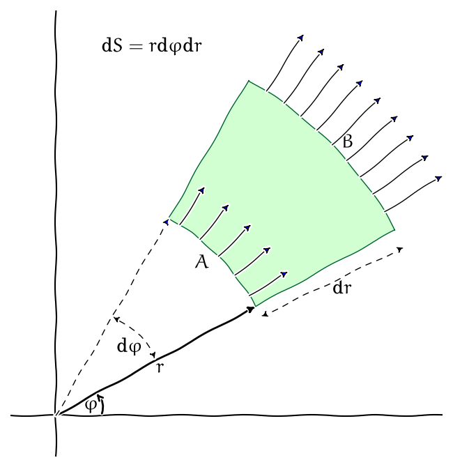

% Rovnice matematické fyziky
% Robert Mařík
% 2014–2019

V\ této podkapitole se seznámíme se základními diferenciálními rovnicemi
používanými v\ matematické fyzice. Jedná se o\ rovnice zachycující
matematicky děje okolo nás. Protože se bude jednat o\ rovnice, kde
neznámé jsou funkce více proměnných a v\ rovnicích vystupují i\ derivace
těchto funkcí, patří tyto rovnice do kategorie parciálních
diferenciálních rovnic. Naprostá většina
fyzikálních zákonů a procesů je matematicky formulována právě pomocí
parciálních diferenciálních rovnic nebo jejich integrálních ekvivalentů
a vztahy, které známe například ze střední školy, jsou aproximacemi
řešení těchto rovnic. Tyto rovnice můžeme uvažovat v\ jedné dimenzi
(například šíření tepla nebo kmitů v\ tyči), ve dvou dimenzích (šíření
tepla v\ desce, kmity membrány) nebo ve třech dimenzích (šíření tepla
nebo kmitů v\ tělese).

**Úmluva:** Abychom se vyhnuli nedorozuměním v\ používání symbolu
$\Delta$, budeme tímto symbolem v\ následující kapitole vždy rozumět
konečnou změnu. Laplaceův operátor budeme označovat symbolem $\nabla
^2$.

**Pozorování 1:** Všechny rovnice, se kterými se setkáme v\ této kapitole
jsou lineární. Jsou tedy zachovány všechny principy, které plynou přímo
z\ linearity. Zejména tedy libovolná lineární kombinace libovolného počtu
řešení homogenní rovnice je opět řešením.

**Pozorování 2:** V\ rovnicích uvedených v\ následujících podkapitolách
figurují vždy parciální derivace a jisté materiálové konstanty, dané
povahou problému. Tyto konstanty jsou důležité z\ fyzikálního hlediska,
při matematickém studiu je však budeme pro větší přehlednost v\ některých
podkapitolách vynechávat (položíme je rovny jedné). Toto není na úkor
obecnosti, protože číselné velikosti konstant lze měnit vhodnou volbou
fyzikálních jednotek. Můžeme například délku měřit v\ tak obrovských
jednotkách, že rychlost světla ve vakuu bude rovna jedné. Že je taková
jednotka velmi nepraktická při měření v\ běžném životě není pro
matematické studium povahy problému nijak podstatné.

# Rovnice kontinuity (bilance množství stavové veličiny)

\iffalse 

\fi

Odvodíme rovnici kontinuity pro dvě proměnné, pro tři proměnné nebo
jednu proměnnou je postup analogický. Nechť $x$, $y$ jsou prostorové
proměnné a $t$ čas. Uvažujme skalární stavovou funkci $u(x,y,t)$
charakterizující stav studovaného objektu v\ daném bodě a čase. Například
hustotu plynu v\ oblasti mezi dvěma rovnými deskami. Pro jednoduchost
předpokládejme, že všechny veličiny jsou dostatečně hladké a použijeme
poněkud neformální postup bez podrobných důkazů.

Nechť $M$ je jednoduše souvislá oblast v\ rovině. Rovnice kontinuity
vyjadřuje, že ke změně celkového množství veličiny $u$ v\ oblasti $M$ za
jednotku času přispívá tok veličiny přes hranici $\partial M$ (dovnitř
nebo ven) a případné zdroje nebo spotřebiče uvnitř množiny $M$. Je-li
$\vec \varphi(x,y,t)$ vektorová funkce popisující tok prostředí popsaného
veličinou $u$, $\sigma(x,y,t)$ je hustota zdrojů (je-li $\sigma$ kladné)
a spotřebičů (je-li $\sigma$ záporné), docházíme k\ bilanci
pro rychlost změny celkového množství veličiny v\ množině $M$ ve tvaru
$$
\begin{aligned}
\underbrace{\frac{\mathrm d}{\mathrm d t} \overbrace{\iint_M u(x,y,t) \mathrm{d}x\mathrm{d}y }^{\text{množství veličiny v množině $M$}}}_{\text{velikost změny za jednotku času}} &= 
  \underbrace{\iint_M \sigma(x,y,t)\mathrm{d}x\mathrm{d}y }_{\text{celková vydatnost  zdrojů  uvnitř množiny $M$}}\\
  &\qquad
  -\underbrace{\oint_{\partial M} -\varphi_2(x,y,t)\mathrm{d}x+\varphi_1(x,y,t)\mathrm{d}y ,}_{{\text{tok přes hranici množiny $M$}}}
\end{aligned}
\label{*}\tag{*}$$
kde $\varphi_{1,2}(x,y,t)$ jsou jednotlivé komponenty vektoru
$\vec\varphi(x,y,z)$. 

# Rovnice kontinuity (integrální tvar)

Použijeme-li na rovnici $\eqref{*}$
\iffalse
$$\underbrace{\frac{\mathrm d}{\mathrm d t} \overbrace{\iint_M u(x,y,t) \mathrm{d}x\mathrm{d}y }^{\text{množství veličiny v množině $M$}}}_{\text{velikost změny za jednotku času}} = 
  \underbrace{\iint_M \sigma(x,y,t)\mathrm{d}x\mathrm{d}y }_{\text{celková vydatnost  zdrojů  uvnitř množiny $M$}}
  -\underbrace{\oint_{\partial M} -\varphi_2(x,y,t)\mathrm{d}x+\varphi_1(x,y,t)\mathrm{d}y ,}_{{\text{tok přes hranici množiny $M$}}}$$
  \fi
Greenovu větu, dostáváme
$$\frac{\mathrm d}{\mathrm d t} \iint_M u(x,y,t) \mathrm{d}x\mathrm{d}y  = 
  \iint_M \sigma(x,y,t)\mathrm{d}x\mathrm{d}y 
  -\iint_{ M} \mathop{\mathrm{div}}\vec\varphi(x,y,t)\mathrm{d}x\mathrm{d}y ,$$
Pokud se oblast $M$ nemění v\ čase, je možné na levé straně přesunout
časovou derivaci dovnitř integrálu a dostáváme dále rovnici zvanou
*rovnice kontinuity v\ integrálním tvaru* 
$$\iint_M \frac{\partial}{\partial t} u(x,y,t) \mathrm{d}x\mathrm{d}y  = 
  \iint_M \Bigl( -\mathop{\mathrm{div}} \vec\varphi(x,y,t) + \sigma(x,y,t)\Bigr)\mathrm{d}x\mathrm{d}y. $$

# Rovnice kontinuity (lokální tvar)

Z rovnice kontinuity v\ integrálním tvaru
$$\iint_M \frac{\partial}{\partial t} u(x,y,t) \mathrm{d}x\mathrm{d}y  = 
  \iint_M \Bigl( -\mathop{\mathrm{div}} \vec\varphi(x,y,t) + \sigma(x,y,t)\Bigr)\mathrm{d}x\mathrm{d}y $$
plyne (protože rovnost musí platit pro každou množinu $M$) nutně
\iffalse 

\fi
$$\frac{\partial u}{\partial t}  =- 
  \mathop{\mathrm{div}} \vec \varphi + \sigma,$$
neboli
$$\label{eq:rce_kontinuity}
  \frac{\partial u}{\partial t}  + 
  \mathop{\mathrm{div}} \vec \varphi = \sigma,$$
což je *diferenciální tvar rovnice kontinuity*, ve kterém jsme pro
stručnost vynechali explicitní vypisování nezávislých proměnných. Ve
stejném tvaru rovnice platí i\ v\ lineárním případě a trojdimenzionálním
případě. Z\ integrálního tvaru a z\ odvození ihned vidíme, že se vlastně
jedná o\ rovnici vyjadřující zákon zachování veličiny $u$, kde člen
$\frac{\partial u}{\partial t}$ vyjadřuje časovou změnu veličiny $u$,
$\vec \varphi$ vyjadřuje hustotu toku veličiny $u$, $\mathop{\mathrm{div}} \vec\varphi$ je
divergence této hustoty toku a $\sigma$ je člen související
s\ přítomností zdrojů nebo spotřebičů. 

# Rovnice kontinuity (speciální případy)

\iffalse 

\fi

Speciálními případy rovnice
kontinuity jsou rovnice kontinuity bez zdrojů
$$\frac{\partial u}{\partial t}  + 
  \mathop{\mathrm{div}} \vec \varphi=0,$$
nebo stacionární rovnice kontinuity pro popis stacionárních jevů
$$\mathop{\mathrm{div}} \vec \varphi  = \sigma.$$
Stacionární bezzdrojová rovnice kontinuity
$$\mathop{\mathrm{div}} \vec \varphi=0,$$
má v\ integrálním tvaru pro ustálené proudění
nestlačitelné tekutiny trubicí s\ proměnným průřezem tvar
$$Sv=\text{konst},$$
který známe ze střední školy. Ten vyjadřuje, že objem nestlačitelné
tekutiny, který do trubice na jedné straně vteče je stejný jako objem,
který z\ ní vyteče.

# Difuzní rovnice (vedení tepla)

\iffalse 

\fi

Difuzní rovnice je kombinací rovnice kontinuity a Fickova
zákona, který říká, že v\ označení z\ předchozí kapitoly směřuje vektor
$\vec \varphi$ (difuzní tok, tj. množství veličiny $u$ které projde
elementární oblastí za jednotku času) z\ oblastí s\ vyšší koncentrací do
oblastí s\ nižší koncentrací a velikost je úměrná gradientu veličiny $u$.
Platí tedy
$$\label{eq:fick}
  \vec\varphi=-D\nabla u,$$
kde $D$ je tzv. difuzní koeficient.
S využitím tohoto vztahu má rovnice tvar 
$$ \frac{\partial u}{\partial t}-  \mathop{\mathrm{div}} (D \nabla u)=\sigma.$$

Při studiu pohybu vody ve dřevě neuvažujeme zdroje ($\sigma=0$) a naopak uvažujeme prostředí, které má v\ každém směru jiné vlastnosti a jiný difuzní koeficient. Výsledná difuzní rovnice má poté tvar
$$ \frac{\partial u}{\partial t}
-  \frac{\partial }{\partial x} \left(D_x \frac{\partial u}{\partial x}\right)
-  \frac{\partial }{\partial y} \left(D_y \frac{\partial u}{\partial y}\right)
-  \frac{\partial }{\partial z} \left(D_z \frac{\partial u}{\partial z}\right)
=0
$$
a nazývá se *druhý Fickův zákon*.

Je-li difuzní koeficient $D$ konstantní (nezávislý na prostorových
souřadnicích), potom má difuzní rovnice vhledem k\ identitě
$$\mathop{\mathrm{div}} \vec\varphi=- \mathop{\mathrm{div}} (D\nabla u)=-D \mathop{\mathrm{div}} (\nabla
  u)=-D\nabla^2 u$$
konečný tvar
$$\label{eq:difuzni}
  \frac{\partial u}{\partial t}-D\nabla^2 u=\sigma,$$
kde $\nabla^2$ je Laplaceův operátor.
Tuto rovnici je možno najít v\ literatuře pod názvem rovnice vedení
tepla, protože popisuje šíření tepla v\ prostředí s\ součinitelem teplotní vodivosti $D$ a hustotou tepelných zdrojů $\sigma$.

# Difuzní rovnice (rozměrová analýza)

\iffalse 

\fi

Odhadnout některé aspekty chování rovnice
$$  \frac{\partial u}{\partial t}-D\nabla^2 u=\sigma$$
je možné i\ bez znalosti řešení této
rovnice, kterou je možno vyřešit pouze v\ některých speciálních
případech. Například z\ toho, že členy $\frac{\partial u}{\partial t}$ a
$D\nabla^2 u$ musí mít stejné jednotky vidíme, že jednotka difuzního
koeficientu $D$ je $m^2 s^{-1}$. Proto je přirozené očekávat, že

-   průměrná vzdálenost na kterou dodifunduje látka za čas $t$ je úměrná
    výrazu $\sqrt{Dt}$;
-   průměrný čas za který látka dodifunduje na vzdálenost $d$ je úměrný
    výrazu $\frac {d^2}{D}$.

# Vlnová rovnice (odvození v\ jedné dimenzi)

Vlnová rovnice je rovnice popisující kmity strun (v\ jednorozměrném
případě), membrán (ve dvourozměrném případě) nebo těles (v\ trojrozměrném
případě). Odvodíme rovnici kmitání strun. Na kmitající struně uvažujme
v\ bodě $x$ element o\ délce $\Delta
x$. Výchylku z\ rovnovážného stavu označme $u$. Dále označme
$\vec {\mathcal T}$ sílu, která v\ tomto bodě napíná strunu - vnitřní
napětí ve struně. Tento vektor má podél struny konstantní velikost a
směr se mění podle zakřivení struny. Označíme-li $\varphi$ úhel mezi
vektorem $\vec {\mathcal T}$ a vodorovným směrem, je
$\tan \varphi=\frac {\partial
  u}{\partial x}$ (derivace je směrnice tečny). Na levý konec působí
síla $\vec {\mathcal T}_1$, kterou pro další počítání rozložíme do
vodorovného a svislého směru. Doleva působí síla o\ velikosti
$\mathcal T\cos\varphi$ a dolů síla $\mathcal T\sin\varphi$. Podobně, na pravý
konec, kde je směrnice tečny $\varphi+\Delta\varphi$ působí doprava síla
$\mathcal{T}\cos(\varphi+\Delta\varphi)$ a nahoru síla
$\mathcal T\sin(\varphi+\Delta\varphi)$. Protože se element pohybuje ve
svislém směru, podle Newtonova pohybového zákona platí
$$m\frac{\partial ^2u}{\partial t^2}=\mathcal T\sin(\varphi+\Delta\varphi)-\mathcal T\sin\varphi,$$
kde $m$ je hmotnost uvažovaného elementu. Je-li lineární specifická
hmotnost struny $\rho$ a délka elementu v\ rovnovážné poloze (bez
deformace) je přibližně $\Delta x$, je možno vyjádřit hmotnost jako
$m=\rho\Delta x$ a dostáváme po úpravě vztah
$$\frac {\rho}{\mathcal T}\frac{\partial ^2u}{\partial t^2}=\frac{\sin(\varphi+\Delta\varphi)-\sin\varphi}{\Delta x},$$

---

Pokud pravou stranu rovnice, tj. $$\frac{\sin(\varphi+\Delta\varphi)-\sin\varphi}{\Delta x}$$ přepíšeme do tvaru
$$% \frac{\sin(\varphi+\Delta\varphi)-\sin\varphi}{\Delta x}=
  \frac{\sin(\varphi+\Delta\varphi)-\sin\varphi}{\Delta \varphi}\frac{\Delta \varphi}{\Delta x}$$
a v\ limitě stáhneme velikost uvažovaného elementu k\ nule, dostáváme
 výraz známý z\ definice derivace
$$\frac{\partial \sin(\varphi)}{\partial \varphi}\frac{\partial \varphi}{\partial x}\quad \text{tj.}\quad \cos(\varphi)\frac{\partial \varphi}{\partial x}.$$

Potřebujeme nyní vyjádřit výraz $\frac{\partial \varphi}{\partial x}$. Ze
vztahu $\tan \varphi=\frac {\partial u}{\partial x}$ derivováním podle $x$
dostáváme
$$\frac{1}{\cos^2 \varphi}\frac{\partial \varphi}{\partial x}=\frac {\partial^2 u}{\partial x^2}$$
a za předpokladu malých výchylek nahradíme v\ předchozích dvou vzorcích
funkci kosinus její lineární aproximací v\ okolí nuly:
$$\begin{aligned}\cos(\varphi)&\approx \cos(0)+(\cos(\varphi))'{\Bigl.\Bigr|}_{\varphi=0}(\varphi -0)\\&= 1+\sin(\varphi){\Bigl.\Bigr|}_{\varphi=0}\varphi=1.\end{aligned}$$

Tím se pravá strana rovnice zjednoduší na $\frac {\partial^2
  u}{\partial x^2}$ a získáváme rovnici
$$\frac{\partial ^2u}{\partial t^2}=\frac {\cal T}{\rho} \frac {\partial^2 u}{\partial x^2}.$$

# Vlnová rovnice

\iffalse 

\fi

Rovnice $$\frac{\partial ^2u}{\partial t^2}=\frac {\cal T}{\rho} \frac {\partial^2 u}{\partial x^2}$$
je rovnice popisující kmitavý pohyb struny. Ve vícerozměrném
případě je situace obdobná, pouze na pravé straně dostaneme Laplaceův
operátor a výsledná rovnice
$$\frac{\partial ^2u}{\partial t^2}=\frac {\cal T}{\rho}\nabla^2 u.$$
se nazývá vlnová rovnice.

Po přeznačení je možno vlnovou rovnici zapsat ve tvaru
$$\label{eq:vlnova}
   \frac{\partial ^2u}{\partial t^2}=c^2\nabla^2 u,$$
kde $c$ je kladná konstanta. 

# Rovnice postupné vlny

Nechť $f$ je libovolná dvakrát
diferencovatelná funkce jedné proměnné a uvažujme jednorozměrnou vlnovou
rovnici
$$
  \frac{\partial ^2u}{\partial t^2}=c^2\frac{\partial ^2u}{\partial x^2}$$
a funkci dvou proměnných $u(x,t)=f(x-ct)$. Potom platí
$$\begin{aligned}
    \frac {\partial u}{\partial x}&=f'(x-ct) ,
    &\ &\frac {\partial^2
      u}{\partial x^2}=f''(x-ct), \\
    \frac {\partial u}{\partial
      t}&=-cf'(x-ct) ,
    &&\frac {\partial^2 u}{\partial t^2}=c^2f''(x-ct),
  \end{aligned}$$
odkud snadno vidíme, že funkce $u$ je řešením vlnové rovnice
Vrstevnice funkce $u(x,t)$ jsou dány rovnicí $x-ct=\text{konst}$, což
odpovídá tomu, že bod o\ dané výchylce se za čas $\Delta t$ posune o
$\Delta x=c\Delta t$. Jedná se tedy o\ postupnou vlnu, která se šíří
rychlostí $c$ doprava. Podobně, funkce $v(x,c)=f(x+ct)$ je řešením této
rovnice, které odpovídá postupné vlně, která postupuje
rychlostí $c$ doleva.

Rovnice popisující podélné kmity kmity tyče modulu pružnosti $E$ a
hustotě $\rho$ má stejný tvar, kde $c=\sqrt{E}\rho$ je rychlost šíření
kmitů. Trojrozměrná analogie této rovnice je vhodná pro popis
elastických kmitů (chvění) v\ tělese.

# Fourierova metoda (separace proměnných)

Jedna z\ nejjednodušších metod řešení parciálních diferenciálních
rovnic spočívá v\ tom, že se řešení rovnic snažíme najít v\ nějakém
konkrétním tvaru, který nám umožní rovnici redukovat na několik rovnic
jednodušších.

Uvažujme šíření tepla v\ tyči jednotkové délky bez vnitřních zdrojů
tepelné energie, popsané diferenciální rovnicí
$$\label{eq:four_teplo}
  \frac {\partial u}{\partial t}=  \frac {\partial^2 u}{\partial x^2}.$$

Pro jednoznačný popis děje je nutno zadat počáteční teplotu $\varphi(x)$ ve
všech bodech tyče a podmínky, které udávají, v\ jakém prostředí se tyč
nachází – například teplotu konců tyče. 
Pro jednoduchost uvažujme homogenní okrajové podmínky $u(0,t)=0=u(1,t)$
a počáteční podmínku 
$u(x,0)=\varphi(x)$.

Řešení $u$ budeme hledat ve tvaru funkce
$$u(x,t)=X(x)T(t),$$
kde $X$ a $T$ jsou funkce jedné proměnné. V\ tomto označení platí
$\frac{\partial u}{\partial t}=X(x)T'(t)$ a $\frac{\partial^2
  u}{\partial x^2}=X''(x)T(t)$ a po dosazení do rovnice a po
vydělení faktorem $X(x)T(t)$ dostaneme
$$\frac {T'(t)}{T(t)}=\frac {X''(x)}{X(x)}.$$

# Fourierova metoda (separace proměnných, pokračování)

Protože levá strana rovnice $$\frac {T'(t)}{T(t)}=\frac {X''(x)}{X(x)}$$ závisí pouze na $t$ a pravá strana pouze na $x$,
musí být obě strany rovny stejné konstantě. Tuto konstantu zapíšeme
z\ důvodů které budou patrné později jako $-\lambda^2$. Z
okrajových podmínek naložených na funkci $u$ plyne, že funkce $X$
musí splňovat
$$X(0)=0=X(1).\label{eq:four:X01}\tag{*}$$

Funkce $X$ a $T$ tedy musí splňovat rovnice
$$T'=-\lambda^2 T, \quad X''+\lambda^2 X=0$$
a okrajovou podmínku $\eqref{eq:four:X01}$. 

Rovnice
$$T'=-\lambda^2 T$$
je lineární a její obecné řešení je libovolný násobek funkce
$T(t)=e^{-\lambda^2 t}$. 

Úloha najít funkci vyhovující rovnici
$$X''+\lambda^2 X=0$$
souvisí s vlastními hodnotami rovnice.

# Okrajová úloha, vlastní čísla

Pro parametr $\lambda$ řešme rovnici
$$X''+\lambda^2 X=0\label{eq:sep:X}$$
s\ okrajovými podmínkami
$$\label{eq:okr-podm}
  X(0)=0=X(1).$$

Rovnice je homogenní lineární diferenciální rovnice druhého
řádu a má (podle toho jaké je řešení charakteristické rovnice) řešení
buď exponenciální funkce nebo goniometrické funkce. Podrobným rozborem
lze ukázat, že v\ případě lineární kombinace exponenciálních funkcí se
nepodaří splnit podmínky a charakteristická rovnice tedy
nesmí mít reálné kořeny. Proto jsme volili konstantu v\ separaci
proměnných ve tvaru $-\lambda^2$. Nyní jsou totiž řešeními
charakteristické rovnice čísla $\pm i \lambda$ a řešením rovnice
je tvaru
$$X(x)=C_1\sin(\lambda
x)+C_2\cos(\lambda x).$$

Z\ podmínky $X(0)=0$ dostáváme $C_2=0$. Tedy
$$X(x)=C_1\sin(\lambda x).$$

Z\ podmínky $X(1)=0$ dostáváme $0=C_1\sin(\lambda)$. Zajímá nás pouze
netriviální řešení a proto nemůžeme připustit $C_1=0$. Platí tedy
$\sin(\lambda)=0$, neboli $\lambda=k\pi$, kde $k$ je přirozené
číslo. Vlastní hodnoty jsou tedy tvaru
$$\lambda^2=k^2\pi^2$$
a uvažovaná okrajová úloha pro libovolné přirozené číslo $k$ řešení
$$X(x)=C\sin(k^2\pi^2x),$$
kde $C$ je reálná konstanta.

# Fourierova metoda (separace proměnných, superpozice řešení) 

Protože řešení rovnice 
$$\frac {\partial u}{\partial t}=  \frac {\partial^2 u}{\partial x^2}.$$
hledáme ve tvaru
$u(x,t)=X(x)T(t)$, můžeme výsledky předchozích odstavců shrnout do
poznatku, že pro libovolnou konstantu $C_k$ a libovolné přirozené
číslo $k$ je funkce
$$C_k\sin(k\pi x)e^{-\lambda^2 t}.$$

Protože rovnice je lineární, je řešením i\ libovolná
lineární kombinace těchto funkcí. Použijeme-li všechny funkce tohoto
tvaru, dostáváme řešení
$$u(x,t)=\sum_{k=1}^\infty C_k\sin(k\pi x)e^{-\lambda^2 t},$$

Protože máme zadánu počáteční podmínku 
$u(x,0)=\varphi(x)$, potřebujeme najít konstanty $C_k$ takové, že platí
$$\sum_{k=1}^\infty C_k\sin(k~\pi x)=\varphi(x).$$

Tuto úlohu budeme řešit v\ dalších odstavcích.

# Fourierův rozvoj periodické funkce

Nekonečná řada goniometrických funkcí tvaru

$$\frac{a_0}2+\sum_{k=1}^\infty\left(a_k\cos(k~x)+b_k\sin(k~x)\right)$$

může pro konkrétní hodnoty koeficientů $a_i$, $b_i$ konvergovat 
k\ nějaké funkci $f(x)$ a za jistých podmínek je tato funkce dostatečně
pěkná: je spojitá, je možno ji derivovat člen po členu apod.

Při řešení rovnic matematické fyziky řešíme opačný problém: pro
zadanou funkci $f(x)$ na intervalu $[-\pi,\pi]$ chceme nalézt
koeficienty $a_i$, $b_i$ tak, aby na tomto intervalu platilo
$$f(x)=\frac{a_0}2+\sum_{k=1}^\infty\left(a_k\cos(kx)+b_k\sin(kx)\right).$$

# Koeficienty Fourierova rozvoje

Ukazuje se, že tento zápis funkce $f$ pomocí goniometrických funkcí je
možný, pokud použijeme následující volbu koeficientů

$$\begin{aligned}
  a_0&=\frac 1\pi\int_{-\pi}^\pi f(x)\mathrm{d}x\\
  a_k&=\frac 1\pi\int_{-\pi}^\pi f(x)\cos(kx)\mathrm{d}x\\
  b_k&=\frac 1\pi\int_{-\pi}^\pi f(x)\sin(kx)\mathrm{d}x.\end{aligned}$$

Tyto vztahy je možno zobecnit i\ na jiné intervaly než $[-\pi,\pi]$ a
také pro jiné funkce než goniometrické – je možné použít například
systém všech vlastních funkcí okrajové úlohy. V\ našem případě je
možné ukázat, že pokud platí
$$C_k=2\int_{0}^1\varphi(x)\sin(k\pi x)\mathrm{d}x,$$
potom na intervalu $[0,1]$ platí
$$\sum_{k=1}^\infty C_k\sin(k\pi x)=\varphi(x).$$

Máme tedy koeficienty $C_k$, které je možno použít pro konečný zápis
řešení naší úlohy.

# Fourierova metoda (separace proměnných, závěr)

Řešení rovnice vedení tepla, které splňuje zadané počíteční a okrajové podmínky je
$$u(x,t)=\sum_{k=1}^\infty C_k\sin(k\pi x)e^{-\lambda^2 t},$$
kde
$$C_k=2\int_{0}^1\varphi(x)\sin(k\pi x)\mathrm{d}x.$$

Podobně, kmity struny jednotkové délky, popsané vlnovou rovnicí
$$\frac{\partial ^2u}{\partial t^2}=c^2\frac{\partial ^2u}{\partial x^2},$$
s\ okrajovými podmínkami
$$u(0,t)=0=u(1,t)$$
(struna upevněná na koncích) a počátečními podmínkami
$$u(x,0)=\varphi(x),\quad \frac{\partial u}{\partial t}(x,0)=\psi(x).$$
(počáteční poloha a rychlost všech bodů struny) jsou dány vztahem
$$u(x,t)=\sum_{k=1}^\infty\left(a_n\cos(k\pi t)+b_n\sin(k\pi t)\right)\sin(k\pi x),$$
kde
$$a_k=2\int_0^1\varphi(x)\sin(k\pi x)\mathrm{d}x$$
a
$$b_k=2\int_0^1\psi(x)\cos(k\pi x)\mathrm{d}x.$$

# Numerické řešení parciálních diferenciálních rovnic

Při řešení praktických úloh založených na rovnicích matematické fyziky
se málokdy podaří efektivně nalézt obecné řešení v explicitním
tvaru. Proto zpravidla hledáme řešení zadané úlohy (rovnice s
okrajovými a počátečními podmínkami) numericky.

Hlavní myšlenkou je převod modelu na soustavu lineárních
rovnic. Jednoduchá metoda, jak toto provést například pro nalezení
stacionárního stavu čtvercové desky je zvolit uzolvé body uvnitř desky
a teplotu v každém bodě určovat jako [průměr
teplot](http://user.mendelu.cz/marik/wiki/kraj/vedenitepla.pdf) v
sousedních uzlech. V praxi se však používají více rafinované postupy,
které jsou sice založené na hlobokých myšlenkách, ale po dotažení do
prakticky použitelného nástroje jsou jednoduché i pro laiky, kteří
nemusí do hloubky rozumět celému pozadí výpočtu.

Nejpoužívanější metodou pro numerické řešení parciálních
diferenciálních rovnic je metoda konečných prvků. Tato metoda je
založena na myšlence vyjádření řešení jako lineární kombinace velice
jednoduchých funkcí. Místo goniometrických funkcí, které jsme použili
ve Fourierově rozvoji, je možné použít například trojúhelníkové funkce
jako na obrázku. Výhodou je obrovský nárůst rychlosti, nevýhodou je,
že lineární kombinace několika funkcí složených z lomených čar je
lomená čára a řešení je tedy možné obdržet jen přibližně. Na druhou
stranu je velice jednoduché najít koeficienty lineární kombinace
aproximující nějakou funkci. V místě, kde očekáváme dramatičtější
změny funkčních hodnot, je možné volit hustší síť a aproximace potom
bude jemnější.

\iffalse

# Transformace do křivočarých souřadnic, sféricky symetrické rovnice

Polární souřadnice známe z kapitoly o dvojném integrálu, vztahují se 
k\ poloze bodu v rovině. Následující dva druhy souřadnic se vztahují 
k\ poloze bodu v trojrozměrném prostoru.

*Cylindrické souřadnice* jsou souřadnice v prostoru, kde proměnné $x$
a $y$ vyjádříme stejně jako v polárních souřadnicích a proměnnou $z$
necháme stejnou jako v souřadnicích kartézských.

*Sférické souřadnice jsou* jakási analogie dobře známých zeměpisných
souřadnic, používaných Rozdíl je pouze v tom, že úhel udávající
zeměpisnou délku měříme v intervalu $[0,2\pi)$ (tj. nemáme analogii
pro východní a západní délku) a úhel udávající zeměpisnou šířku měříme
v intervalu $[0,\pi]$, kde severní pól má souřadnici $0$ a jižní pól
souřadnici $\pi$ (rovník má souřadnici $\frac \pi 2$ a nemáme analogii
pro severní šířku a jižní šířku).

# Difuzní rovnice v polárních souřadnicích 

Zkusíme odvodit difuzní rovnici pro případ polárních souřadnic. Pro
jednoduchost uvažujme, že problém je radiálně symetrický – tj. že
všechny hodnoty závisí jenom na vzdálenosti od počátku. Zejména tedy,
počítáme-li tok elementární ploškou na obrázku, je nenulový tok pouze
na stranách $A$ a $B$. Tok oběma bočními stranami je nulový. Pro
zjednodušení napíšeme bilanci přímo pro elementární plošku na obrázku.

- Obsah plošky je $r\mathrm{d}\varphi \mathrm{d}r$, množství veličiny
    popsané hustotou $u(r)$ je $ur\mathrm{d}\varphi \mathrm{d}r$ a
    rychlost změny tohoto množství je $r\mathrm{d}\varphi
    \mathrm{d}r\frac{\partial u}{\partial t}$.
- Je-li vydatnost zdrojů dána hustotou $\sigma(r)$, je celkové
    množství veličiny které vznikne v\ oblasti rovna $\sigma
    r\mathrm{d}\varphi \mathrm{d}r$.
- Tok stranou je součinem délky strany a intenzity toku. $\Phi$. Pro
    vyjádření celkového toku přes hranici musíme tok přes stranu $A$
    odečíst od toku přes stranu $B$ a využitím definice parciální
    derivace dostáváme
    $$\begin{gathered}\overbrace{\Phi(r+\mathrm{d}r)(r+\mathrm{d}r)\mathrm{d}\varphi }^{\text{tok přes $B$}}-
        \overbrace{\Phi(r)r\mathrm{d}\varphi }^{\text{tok přes $A$}}\\=  
	\frac{\Phi(r+\mathrm{d}r)(r+\mathrm{d}r)-\Phi(r)r}{\mathrm{d}r} \mathrm{d}\varphi  \mathrm{d}r
        \\=\frac{\partial}{\partial r}\Bigl(r\Phi(r)\Bigr)\mathrm{d}\varphi \mathrm{d}r\end{gathered}$$

# Difuzní rovnice v polárních souřadnicích (sestavení rovnice)

- Rychlost změny množství veličiny $u$:  $$r\mathrm{d}\varphi
    \mathrm{d}r\frac{\partial u}{\partial t}$$
- Celkové
    množství veličiny které vznikne v\ oblasti: $$\sigma
    r\mathrm{d}\varphi \mathrm{d}r$$
- Tok  přes hranici:
    $$\frac{\partial}{\partial r}\Bigl(r\Phi(r)\Bigr)\mathrm{d}\varphi \mathrm{d}r$$

Rovnice kontinuity a difuzní rovnice mají v\ polárních souřadnicích
tvar, který nalezneme z\ celkové bilance pro elementární oblast
vydělením členem $r\mathrm{d}r\mathrm{d}\varphi$ a použitím Fickova
zákona $\Phi=k\frac{\partial u}{\partial r}$, tj.
$$
  \frac{\partial u}{\partial t}+\frac 1r\frac{\partial }{\partial r}\Bigl(r\Phi(r)\Bigr)=\sigma$$
a
$$  \frac{\partial u}{\partial t}+k\frac 1r\frac{\partial }{\partial r}\Bigl(r\frac{\partial u}{\partial r} \Bigr)=\sigma.$$

\fi