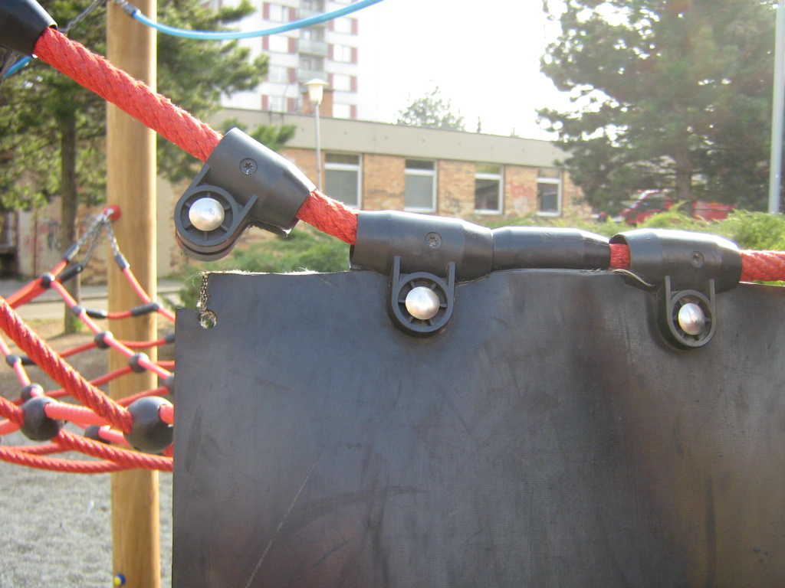

% Řetězovka (catenary) 
% Robert Mařík
% jaro 2014

# Řetězovka - křivka lan a řetězů prověšených vlastní vahou

Budeme se zajímat o\ to, jaký tvar vlivem gravitace zaujmou volně
visící ohebná lana a řetězy. Tento tvar vidíme často kolem sebe,
například tento tvar zaujmou elektrické dráty (zejména když jsou
sloupy daleko od sebe a na drátech je námraza). Stejný tvar zaujmou
mosty, které mají hmotnost rozloženu podél délky. Lano na němž visí
kotě zaujme tvar řetězovky až se kotě pustí. Teprve potom bude splněna podmínka, že lano nese pouze svou vlastní hmotnost.

	

	

	

	

	

	

	

	

	

	

	

	

	

	

	

	

# Zavěšený most (tohle není řetězovka)

Jednodušším úkolem je zkoumat nejprve most zavěšený na laně.  Nejedná se o\ řetězovku, protože lano nese další zátěž. 

* Hmotnost nosného
lana a svislých lan je zanedbatelná vzhledem k\ hmotnosti vozovky.  
* Délka
svislých lan, na kterých je vozovka zavěšena, je zvolena tak, aby namáhání
bylo rovnoměrně rozloženo. 
* Je potřeba zvolit délku svislých nosných lan aby
hlavní nosné lano mělo (při rovné vozovce) tvar, který je pro ně
"přirozený". Potom nebude vozovka zbytečně namáhána ve vertikálním směru.

# Proč je dobré znát řešení problému zavěšeného mostu?

Problém špatně navrženého mostu v\ malém měřítku a malém rozsahu škod:
Na napnutém laně visí težký gumový pás sloužící pro děti jako
skluzavka nebo opora při šplhání nahoru.

* Nosné lano má tendenci se
prohnout, dírky na uchycení tuto tendenci nerespektují a jsou vyvrtané
všechny v\ jedné řadě. 
* Krajní dírky jsou tedy nejvíc namáhané a v\ tomto
místě dojde k\ poruše materiálu.
* Podél jaké křivky se měly udělat otvory pro uchycení?

 

# Zjednodušená formulace problému zavěšeného mostu

> Jaký tvar zaujme lano zanedbatelné hmotnosti, které nese zátěž rovnoměrně rozloženou ve vodorovném směru?

**Fyzikální podstata:** Osu $x$ volíme vodorovně, počátek je volen v\ nejnižším bodě lana. Na část lana mezi tímto nejnižším bodem a obecným bodem
$x$ působí tyto síly:

* Tahová síla $T$ v\ bodě $x=0$.  Tato síla má směr tečný k\ lanu, tj.
  vodorovný.
* Tahová síla $F$ v\ obecném bodě $x$. Tato síla má také tečný směr k\ lanu.  Směrnice přímky, ve které síla působí, je tedy rovna derivaci funkce,
  kterou hledáme.
* Tíhová síla, způsobená gravitací. Tato síla je součinem hmotnosti $m$ a
  tíhového zrychlení $\vec g$.  Podle předpokladu je hmotnost rozložena
  konstantně.  Definujeme-li tedy lineární hustotu $\tau$ mostu jako hmotnost
  jedné délkové jednotky, je hmotnost mostu délky $x$ dána vztahem $m=\tau x$.

Uvažovaný úsek je v\ klidu, celková síla, která na něj působí je
tedy nulová. To znamená, že vektorový součet všech tří sil
je nulový vektor a po přesunutí tedy vektory tvoří strany
pravoúhlého trojúhelníka. Z\ tohoto trojúhelníka plyne
$\tan\alpha=\frac{G}{T}=\frac{\tau x g}{T}=\mu x$, kde $\mu
=\frac{\tau g}{T}$ je konstanta.

**Matematické formulace:** Najděte rovnici křivky splňující rovnici
$y'=\mu x$.

**Řešení:** Známe-li derivaci funkce, původní funkci najdeme
integrováním.  $$y(x)=\int y'(x)\mathrm dx=\int \mu x\mathrm dx=\mu \frac12 x^2+C.$$
Nosné lano musí mít parabolický tvar.

# Konečně k\ řetězovce (sestavení diferenciální rovnice)

 Uvažujme stejnou situaci jako na předhozím slidu, ale **hmota je rozložena rovnoměrně podél
délky lana**. Jediné, co se na předchozí úloze mění, je vztah pro
tíhu. Hmotnost uvažovaného úseku lana je součinem lineární hustoty
$\tau$ a délky tohoto úseku, dané vztahem
$\int_0^x\sqrt{1+[y'(t)]^2}\mathrm dt$. Platí tedy 
$$
y'=\alpha\int_0^x\sqrt{1+[y'(t)]^2}\mathrm dt.  
$$

*Matematická formulace:* Nalezněte funkci splňující
$$
  y'=\alpha\int_0^x\sqrt{1+[y'(t)]^2}\mathrm dt.
$$

*Řešení:* Derivováním  dostáváme
$$
  y''=\alpha\sqrt{1+[y'(x)]^2}.
$$
Vskutku, je-li funkce $\mathcal F(x)$ primitivní funkcí k\ funkci
$\sqrt{1+y'^2(x)}$, je podle Newtonovy--Leibnizovy věty integrál napravo roven
rozdílu $\mathcal F(x)-\mathcal F(0)$. Derivováním podle $x$ obdržíme $F'(x)$,
což není nic jiného než $\sqrt{1+y'^2(x)}$, protože $\mathcal F$ je podle
předpokladu primitivní funkcí.  Úkolem je tedy najít funkci, která splňuje
rovnici
$$
  y''=\alpha\sqrt{1+y'^2}
$$
Substituce $z(x)=y'(x)$, $z'(x)=y''(x)$ převádí tuto rovnici na rovnici 
$$
  z'=\alpha\sqrt{1+z^2}.
$$
Toto je rovnice, kde neznámou je funkce $z(x)$ a v\ rovnici vystupuje i\ derivace $z'(x)$. Takové rovnice nazýváme **diferenciální rovnice**

# Rozřešení diferenciální rovnice

Separací proměnných obdržíme
$$
  \frac{dz}{\sqrt{1+z^2}}=\alpha dx
$$
a po integraci 
$$
  \ln\left(z+\sqrt{1+z^2}\right)=\alpha x+C.
$$
Odsud 
$$  \begin{aligned}z+\sqrt{1+z^2}&=e^{\alpha x+C}\\
  \sqrt{1+z^2}&=e^{\alpha x+C}-z\\
{1+z^2}&=e^{2(\alpha x+C)}-2ze^{\alpha x+C}+z^2\\
2ze^{\alpha x+C}&=e^{2(\alpha x+C)}-1\\
z&=\frac 12\left[e^{\alpha x+C}-e^{-(\alpha x+C)}\right]\end{aligned}
$$

Platí tedy 
$$  y'=\frac 12\left[e^{\alpha x+C}-e^{-(\alpha x+C)}\right]$$
a integrací obdržíme
$$  y=\frac 1{2\alpha}\left[e^{\alpha x+C}+e^{-(\alpha
      x+C)}\right]=\frac1{\alpha}\cosh(\alpha x+C)
$$
Lano zaujme tvar hyperbolického kosinu.

# Další řetězovky okolo nás

* Pavučina 
* Gateway Arch St. Louis - 192 metrů, [odkaz](http://en.wikipedia.org/wiki/Gateway_Arch)
   
    
   
* Nádraží Keletti v\ Budapešti
   
  
* Pro kolo s\ hranatými koly jsou řetězovky ideálním povrchem
   
  [Video na Youtube](http://www.youtube.com/watch?v=LgbWu8zJubo)

