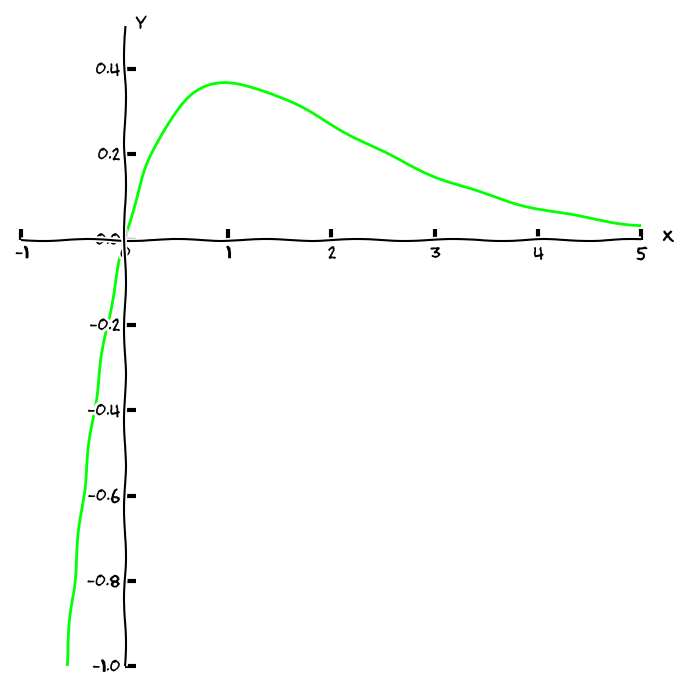
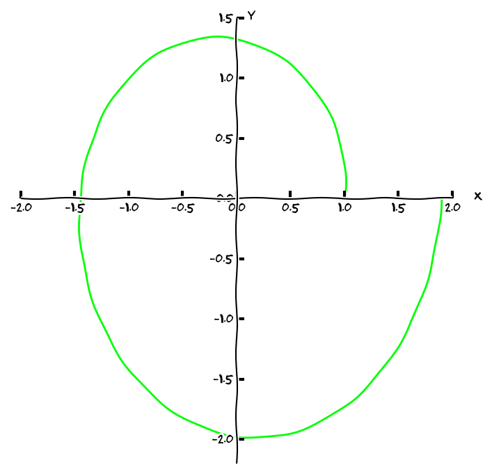
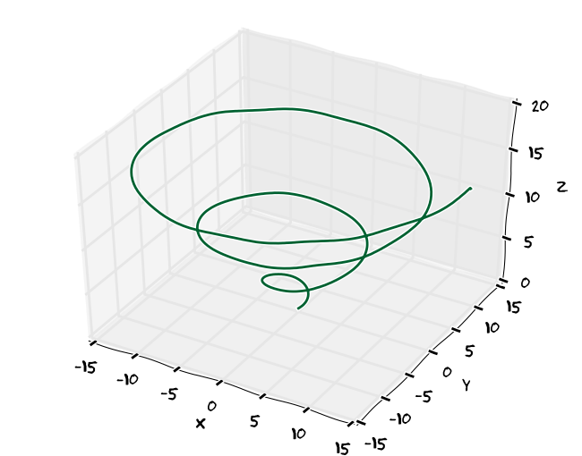
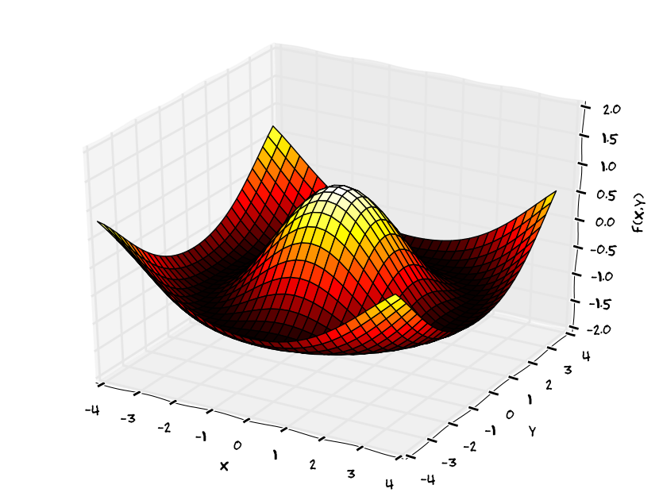
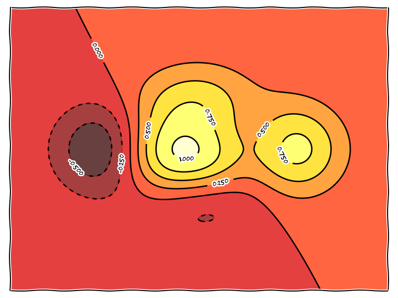
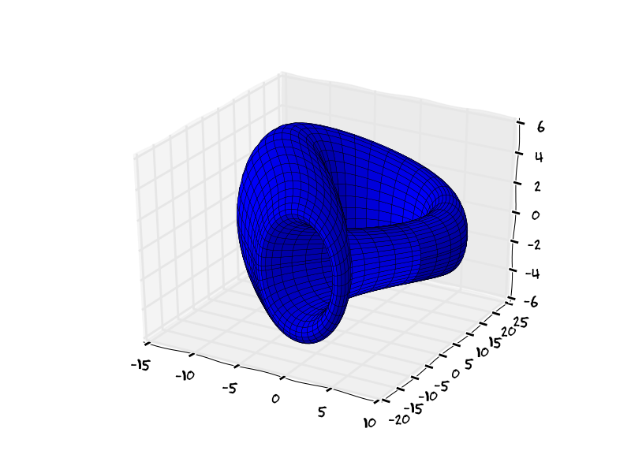
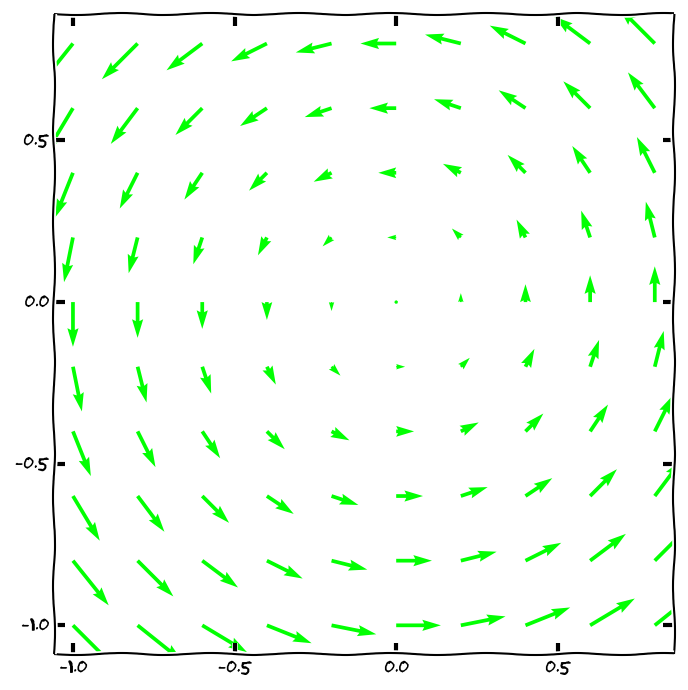
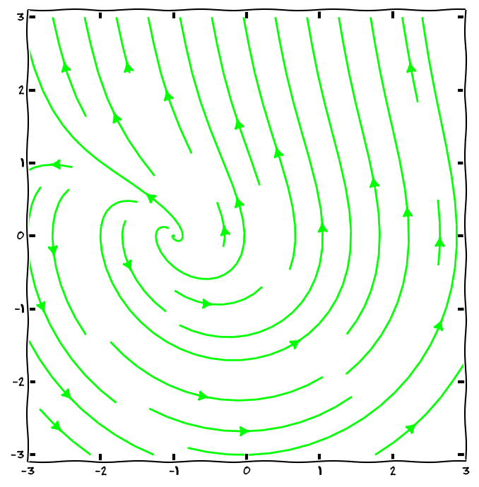

% Vizualizace a základní typy funkcí
% Robert Mařík
% 2014-2018

> Při vizualizaci funkcí volíme vhodný způsob zejména v závislosti na
> počtu vstupních a výstupních dat, tj. na počtu proměnných a na tom,
> jedná-li se o skalární funkci (výsledkem je číslo), nebo vektorovou
> funkci (výsledkem je uspořádaná $n$-tice čísel).

# Funkce jedné proměnné

* $f: \mathbb{R}\to \mathbb{R}$
* $y=f(x)$, v rovině $x,y$ kreslíme uspořádané dvojice bodů $[x,y]$
* výstupem je zpravidla křivka v rovině ([Nakreslit online.](https://sagecell.sagemath.org/?z=eJxL06jQtK3QSq0o0NCt0OTlKsjJL9FQSAOKKugoaFTo6BrqmGgqaAIA3aEKBw==&lang=sage))
* rychlost změny (směrnice tečny) je derivace: $$y', \quad \frac{dy}{dx}, \quad \frac{d}{dx}y$$
* rychlost změny změny je druhá derivace: $$y'',\quad  \frac{d^2y}{dx^2}, \quad\frac{d^2}{dx^2}y$$
* příklady
    * Při pohybu po přímce je $x=f(t)$ poloha v čase $t$, rychlost je
      $\frac{dx}{dt}$ a zrychlení je $\frac{d^2x}{dt^2}$. Podle
      Newtonova pohybového zákona platí $$\frac{d^2x}{dt^2} =F,$$ kde
      $F$ je výsledná síla působící na objekt.
    * Je-li $x(t)$ velikost populace živočíchů, je $\frac{dx}{dt}$ změna této velikosti za jednotku času. Častým modelem reálné situace je modelování pomocí logistické rovnice
      $$\frac{dx}{dt}=r x (K-x)$$
      kdy předpokládáme, že rychlost růstu je úměrná velikosti populace a volné kapacitě prostředí. Konstanta $K$ je celková kapacita prostředí.
    * Malá změna $dx$ v proměnné $x$ vyvolá změnu $dy=f'(x) dx$. Proto je možné používat lineární aproximaci funkce
      $$y-y_0\approx f'(x_0)(x-x_0),$$ resp. $$f(x)\approx f(x_0)+f'(x_0)(x-x_0).  $$
      Například pro malá $x$ platí
      		$$\sqrt{1+x}\approx1+\frac 12 x, \quad\text{a}\quad  \sin(x)\approx x.$$

# Vektorová funkce jedné proměnné (rovinná křivka)

* $\vec F: \mathbb{R}\to \mathbb{R}^2$
* $\vec F(t)=[f(t),g(t)]$, $t\in[a,b]$
* pro každé $t$ z intervalu $[a,b]$ kreslíme ve 2D bod $[f(t),g(t)]$
* výstupem je (zpravidla) křivka v rovině. [Nakreslit online](https://sagecell.sagemath.org/?z=eJxTVghILErMTS0pykzOrlSoSkxJzEtUyC7KLMtO5OXi5SqxLUss0lAvUdfk5SqAq4wvyMkv0YhOzi_WKNHUUSjOzAPSsToKGgY6BZmamgDCkhs_&lang=sage) (Sage),  [Nakreslit online.](https://sagecell.sagemath.org/?z=eJxlUcFuwyAMvUfKP1jKoUlVRc2Ok3rrecddK0qcxiUYBqZb-vWDqDsNyRI2z37vmQY-lBZkAsM0uwcy-OByKE0QwSrBHGT0agmmxEajpbqagrPAyfoVyHoXBPZ1VVcNnHEiJo1wx5GdLPRY9QzGZRAjCzzQiAuZ5zVsw2HhtMiMdTXiBFMr3TvUFeQTUFJgiMS5WDgK4PYfoF18ARr4XE3AuBRX7hrU06S6esnMZvxSdF17v5YbqAh-kdI40Q1OJenzLQVs8zj1c8pJr8bxEtO1NLTDMGwPfUS5qOhRS7vDr6SWXQcNRMF7dmQxkBgHrLIGl8BFpefCIpljIY5eaWyPB3jbezrAcDx2kLuDe0Y1g1dBWZSQQLb_-PNTV0XeJqMs6bBtYnNd6nF23233Cy-Ml6s=&lang=python) (Python+matplotlib)
* příklady:
    * při pohybu bodu ve 2D světě je jeho poloha v čase $t$ dána
      polohovým vektorem $$\vec r(t)=(r_x(t), r_y(t)).$$ Rychlost je
      dána derivací $$\vec v(t) = \frac{d\vec r}{dt}=\left(\frac{d}{dt}r_x(t), \frac{d}{dt}r_y(t)\right).$$ Rychlost je v každém bodě tečný
      vektor ke křivce.
    * Tečný vektor ke křivce $$\vec r(t)=(f(t),g(t))$$ je vektor $$\frac{d\vec r}{dt}=(f'(t),g'(t)).$$ Délka tečného vektoru je
      $$\left\Vert\frac{d\vec r}{dt}\right\Vert=\sqrt{(f'(t))^2+(g'(t))^2}.$$ Pro malou změnu $dt$ proměnné $t$ můžeme použít lineární aproximaci a pro změnu polohového vektoru $d\vec r$ a jeho délku $ds$ dostáváme
      $$d\vec r=(f'(t),g'(t))dt=(f'(t)dt, g'(t)dt)$$
      a
      $$ds=\Vert d\vec r\Vert =\sqrt{	(f'(t))^2+(g'(t))^2}dt.$$
      

# Vektorová funkce jedné proměnné (prostorová křivka)

* $\vec F: \mathbb{R}\to \mathbb{R}^3$
* $\vec F(t)=[f(t),g(t),h(t)]$, $t\in[a,b]$
* Pro každé $t$ z intervalu $[a,b]$ kreslíme ve 3D bod $[f(t),g(t),h(t)]$
* Výstupem je (zpravidla) křivka v prostoru
* Pro tečný vektor a délku tečného vektoru platí podobné vztahy jako ve 2D.
  Tečný vektor ke křivce $$\vec r(t)=(f(t),g(t),h(t))$$ je vektor $$\frac{d\vec r}{dt}=(f'(t),g'(t), h'(t)).$$ Délka tečného vektoru je
      $$\left\Vert\frac{d\vec r}{dt}\right\Vert=\sqrt{(f'(t))^2+(g'(t))^2+(h'(t))^2}.$$ Pro malou změnu $dt$ proměnné $t$ můžeme použít lineární aproximaci a pro změnu polohového vektoru $d\vec r$ a jeho délku $ds$ dostáváme
      $$d\vec r=(f'(t),g'(t), h'(t))dt=(f'(t)dt, g'(t)dt, h'(t)dt)$$
      a
      $$ds=\Vert d\vec r\Vert =\sqrt{	(f'(t))^2+(g'(t))^2+(h'(t))^2}dt.$$
 [Nakreslit online.](http://user.mendelu.cz/marik/akademie/sagecell.php?short=1&in=%23+Parametricky+zadana+krivka%0A%0At%3Dvar%28%27t%27%29%0Aparametric_plot3d%28%5Bt*cos%28t%29%2C+t*sin%28t%29%2Ct%5D%2C+%280%2C6*pi%29%29) (Sage),  [Nakreslit online.](http://user.mendelu.cz/marik/akademie/sagecell.php?short=1&lang=python&in=%23+Nacteni+knihoven+pro+praci+s+matematikcymi+funkcemi%0D%0Afrom+numpy+import+%2A%0D%0A%0D%0A%23+Definice+jednotlivych+komponent+vektorove+funkce+jedne+promenne%0D%0Adef+f%28t%29%3A+%0D%0A++++return+sin%28t%29%2B0.04%2Asin%2810%2At%29%0D%0A%0D%0Adef+g%28t%29%3A+%0D%0A++++return+cos%28t%29%2B0.04%2Asin%2810%2At%29%0D%0A%0D%0Adef+h%28t%29%3A+%0D%0A++++return+cos%28t%29%0D%0A%0D%0A%23+Vykresleni+obrazku%0D%0Aimport+matplotlib+as+mpl%0D%0Afrom+mpl_toolkits.mplot3d+import+Axes3D%0D%0Aimport+matplotlib.pyplot+as+plt%0D%0A%0D%0Afig+%3D+plt.figure%28%29%0D%0Aax+%3D+fig.gca%28projection%3D%273d%27%29%0D%0At+%3D+linspace%280%2C+pi%2C+100%29++%23+rozsah+parametru+t+pro+kresleni%0D%0Aax.plot%28f%28t%29%2C+g%28t%29%2C+h%28t%29%29%0D%0Aplt.show%28%29) (matplotlib)

# Funkce dvou proměnných, graf

* $f: \mathbb{R}^2\to \mathbb{R}$
* $z=f(x,y)$, v 3D obrázku kreslíme uspořádané trojice bodů $[x,y,z]$
* výstupem je zpravidla plocha v prostoru [Nakreslit online.](http://user.mendelu.cz/marik/akademie/sagecell.php?short=1&in=%23%20graf%20je%20mo%C5%BEno%20ot%C3%A1%C4%8Det%20a%20p%C5%99ibli%C5%BEovat%20my%C5%A1%C3%AD%0Ay%3Dvar%28%27y%27%29%0Aplot3d%28x%5E2-y%5E2%2C%20%28x%2C-1%2C1%29%2C%20%28y%2C-1%2C1%29%29) (Sage), [Nakreslit online.](http://user.mendelu.cz/marik/akademie/sagecell.php?short=1&lang=python&in=var%28%27y%27%29%0Afrom+sympy.plotting+import+plot3d%0A%0Asurface3D+%3D+plot3d%285*x*y*exp%28-x**2-y**2%29%2C+%28x%2C-2%2C2%29%2C+%28y%2C-2%2C2%29%2C+xlabel%3D%27x%27%2C+ylabel%3D%27y%27%2C+show%3DFalse%29%0Asurface3D.show%28%29) (matplotlib), [Nakreslit online.](http://user.mendelu.cz/marik/yamwi/index.php?in=plot3d%28x%5E2-y%5E2%2C%20%5Bx%2C-1%2C1%5D%2C%20%5By%2C-1%2C1%5D%29%3B) (Maxima + GNUplot)
* příklady: rozložení teploty nebo tahového napětí v desce
* naučíme se derivovat v diferenciálním počtu funkcí více proměnných

# Funkce dvou proměnných, vrstevnice

* $f: \mathbb{R}^2\to \mathbb{R}$
* $z=f(x,y)$, pro dané $C$ v rovině kreslíme uspořádané dvojice bodů $[x,y]$, pro které platí $f(x,y)=C$
* výstupem je (pro různá $C$) soustava křivek v rovině
* [zkusit online](http://user.mendelu.cz/marik/akademie/sagecell.php?short=1&in=x%2Cy+%3D+var%28%27x%2Cy%27%29%0Af%28x%2Cy%29%3Dx%2By%5E2-x%5E2-y%5E3%0Acontour_plot%28+f%28x%2Cy%29+%2C+%28x%2C-4%2C4%29+%2C+%28y%2C-4%2C4%29%2C+fill%3DFalse%2C+labels%3DTrue%2C+contours%3D50%29) (Sage)
* [zkusit online](http://user.mendelu.cz/marik/akademie/sagecell.php?short=1&lang=python&in=import+pylab+as+pl%0Aimport+numpy+as+np%0A%0Adef+f%28x%2Cy%29%3A%0A++++return+%281+-+x+%2F+2+%2B+x**5+%2B+y**3%29+*+np.exp%28-x**2+-y**2%29%0A%0An+%3D+256%0Ax+%3D+np.linspace%28-3%2C+3%2C+n%29%0Ay+%3D+np.linspace%28-3%2C+3%2C+n%29%0AX%2CY+%3D+np.meshgrid%28x%2C+y%29%0A%0Apl.axes%28%5B0.025%2C+0.025%2C+0.95%2C+0.95%5D%29%0A%0Apl.contourf%28X%2C+Y%2C+f%28X%2C+Y%29%2C+8%2C+alpha%3D.75%2C+cmap%3Dpl.cm.hot%29%0AC+%3D+pl.contour%28X%2C+Y%2C+f%28X%2C+Y%29%2C+8%2C+colors%3D%27black%27%2C+linewidth%3D.5%29%0Apl.clabel%28C%2C+inline%3D1%2C+fontsize%3D10%29%0A%0Apl.xticks%28%28%29%29%0Apl.yticks%28%28%29%29%0Apl.show%28%29) (matplotlib)

# Vektorová funkce dvou proměnných (parametrická plocha)

* $\vec F: \mathbb{R}^2\to \mathbb{R}^3$
* $\vec F(u,v)=[f(u,v),g(u,v),h(u,v)]$, $u\in[u_{\mathrm{min}},u_{\mathrm{max}}]$, $v\in[v_{\mathrm{min}},v_{\mathrm{max}}]$
* pro každé $[u,v]$ takové že $u_{\mathrm{min}} \leq u \leq u_{\mathrm{max}}$ a $v_{\mathrm{min}} \leq v \leq v_{\mathrm{max}}$ kreslíme ve 3D bod $[f(u,v),g(u,v),h(u,v)]$
* výstupem je (zpravidla) plocha v prostoru
* [zkusit online](http://user.mendelu.cz/marik/akademie/sagecell.php?short=1&lang=python&in=import+mpl_toolkits.mplot3d.axes3d+as+axes3d%0D%0Aimport+matplotlib.pyplot+as+plt%0D%0Afrom+numpy+import+%2A%0D%0A%0D%0Adef+surf%28u%2C+v%29%3A%0D%0A++++x+%3D+cos%28v%29%2Acosh%28u%29%0D%0A++++y+%3D+sin%28v%29%2Acosh%28u%29%0D%0A++++z+%3D+sinh%28u%29%0D%0A++++return+x%2C+y%2C+z%0D%0A%0D%0Au%2C+v+%3D+linspace%28-pi%2F2%2C+pi%2F2%2C+80%29%2C+linspace%280%2C+2%2Api%2C+80%29%0D%0A%0D%0Aux%2C+vx+%3D++meshgrid%28u%2Cv%29%0D%0Ax%2C+y%2C+z+%3D+surf%28ux%2C+vx%29%0D%0A%0D%0Afig+%3D+plt.figure%28%29%0D%0Aax+%3D+fig.gca%28projection+%3D+%273d%27%29%0D%0Aplot+%3D+ax.plot_surface%28x%2C+y%2C+z%2C+rstride+%3D+2%2C+cstride+%3D+2%2C+linewidth%3D0.3%29%0D%0A%0D%0Aplt.show%28%29 ) (matplotlib, jednodílný hyperboloid)
* [zkusit online](http://user.mendelu.cz/marik/akademie/sagecell.php?short=1&lang=python&in=import+mpl_toolkits.mplot3d.axes3d+as+axes3d%0D%0Aimport+matplotlib.pyplot+as+plt%0D%0Afrom+numpy+import+%2A%0D%0A%0D%0Adef+surf%28u%2C+v%29%3A%0D%0A++++%22%22%22%0D%0A++++http%3A%2F%2Fpaulbourke.net%2Fgeometry%2Fklein%2F%0D%0A++++%22%22%22%0D%0A++++half+%3D+%280+%3C%3D+u%29+%26+%28u+%3C+pi%29%0D%0A++++r+%3D+4%2A%281+-+cos%28u%29%2F2%29%0D%0A++++x+%3D+6%2Acos%28u%29%2A%281+%2B+sin%28u%29%29+%2B+r%2Acos%28v+%2B+pi%29%0D%0A++++x%5Bhalf%5D+%3D+%28%0D%0A++++++++%286%2Acos%28u%29%2A%281+%2B+sin%28u%29%29+%2B+r%2Acos%28u%29%2Acos%28v%29%29%5Bhalf%5D%29%0D%0A++++y+%3D+16+%2A+sin%28u%29%0D%0A++++y%5Bhalf%5D+%3D+%2816%2Asin%28u%29+%2B+r%2Asin%28u%29%2Acos%28v%29%29%5Bhalf%5D%0D%0A++++z+%3D+r+%2A+sin%28v%29%0D%0A++++return+x%2C+y%2C+z%0D%0A%0D%0Au%2C+v+%3D+linspace%280%2C+2%2Api%2C+80%29%2C+linspace%280%2C+2%2Api%2C+80%29%0D%0Aux%2C+vx+%3D++meshgrid%28u%2Cv%29%0D%0Ax%2C+y%2C+z+%3D+surf%28ux%2C+vx%29%0D%0A%0D%0Afig+%3D+plt.figure%28%29%0D%0Aax+%3D+fig.gca%28projection+%3D+%273d%27%29%0D%0Aplot+%3D+ax.plot_surface%28x%2C+y%2C+z%2C+rstride+%3D+2%2C+cstride+%3D+2%2C+linewidth%3D0.3%29%0D%0A%0D%0Aplt.show%28%29) (matplotlib, Kleinova láhev)

# 2D vektorové pole v rovině (1/2)

* $\vec F: \mathbb{R}^2\to \mathbb{R}^2$
* $\vec F(x,y)=[f(x,y),g(x,y)]$
* pro každé $x$, $y$ kreslíme ve 2D vektor $(f(x,y), g(x,y))$ umístěný počátkem do bodu $[x,y]$
* příklady: silové pole v rovině, pole rychlosti, pole toku  tepelné energie
* naučíme se derivovat ve vektorové analýze
* [zkusit online](http://user.mendelu.cz/marik/akademie/sagecell.php?short=1&in=x%2Cy%2Cz%3Dvar%28%27x+y+z%27%29%0Aplot_vector_field%28%28-y%2Cx%29%2C+%28x%2C-1%2C1%29%2C+%28y%2C-1%2C1%29%2Caspect_ratio%3D1%29) (Sage)

# 2D vektorové pole v rovině (2/2)

* pro každé $x$, $y$ kreslíme ve 2D křivku, která má tu vlastnost, že vektory vektorového pole jsou tečné k těmto křivkám
* [zkusit online](http://user.mendelu.cz/marik/akademie/sagecell.php?short=1&lang=python&in=import+numpy+as+np%0Aimport+matplotlib.pyplot+as+plt%0A%0AY%2C+X+%3D+np.mgrid%5B-3%3A3%3A100j%2C+-3%3A3%3A100j%5D%0AU+%3D+-Y%0AV+%3D+X%2Bexp%28Y%29%0Aspeed+%3D+np.sqrt%28U*U+%2B+V*V%29%0A%0Aplt.figure%281%2C%286%2C6%29%29+%0Aplt.streamplot%28X%2C+Y%2C+U%2C+V%2C+density%3D0.5%29%0Aplt.axes%28%29.set_aspect%28%27equal%27%2C+%27datalim%27%29%0Aplt.show%28%29%0Aplt.savefig%28%22streamplot.svg%22%2Cformat%3D%22svg%22%29) (matplotlib)

# 3D vektorové pole (v prostoru)

* $f: \mathbb{R}^3\to \mathbb{R}^3$
* $\begin{aligned}[t] &\vec F(x,y,z)\\&=[f(x,y,z),g(x,y,z),h(x,y,z)]\end{aligned}$
* pro každé $x$, $y$, $z$ kreslíme ve 3D vektor $(f(x,y,z), g(x,y,z), h(x,y,z))$ umístěný počátkem do bodu $[x,y,z]$
* [zkusit online](http://user.mendelu.cz/marik/akademie/sagecell.php?short=1&in=x%2Cy%2Cz%3Dvar%28%27x%20y%20z%27%29%0Aplot_vector_field3d%28%28x*cos%28z%29%2C-y*cos%28z%29%2Csin%28z%29%29%2C%20%28x%2C0%2Cpi%29%2C%20%28y%2C0%2Cpi%29%2C%20%28z%2C0%2Cpi%29%29) (Sage)

