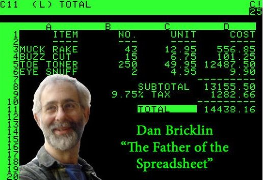

% Matematické výpočty dříve a nyní
% Robert Mařík
% jaro 2015

# Matematické výpočty a dostupné možnosti

* z hlavy nebo na papíře
* s využitím přístrojů
    * numericky -- práce s čísly 
           * výstupem při řešení rovnice $x^2-2=0$ je $x=1.414\dots$ 
           * rovnici $x^2-a=0$ není možno numericky vyřešit
    * symbolicky -- práce s matematickými výrazy
           * nemá nevýhody numerického přístupu
           * řešení rovnice $x^2-2=0$ je $x_{1,2}=\pm\sqrt{2}$
           * řešení rovnice $x^2-a=0$ je $x_{1,2}=\pm\sqrt{a}$

# Doba papírová

1874 - William Shanks 15 let počítal $\pi$ na 707 desetinných míst

1801 - C. F. Gauss vypočítal polohu planetky Ceres, která byla objevena
na jím předpovězeném místě.
  
 Dne 1. ledna 1801 bylo objeveno
italským astronomem Giuseppem Piazzim těleso které neodpovídalo
katalogu hvězd. Po několika pozorováních se přiblížilo ke Slunci
natolik, že 11.2. přestalo být viditelné. Naděje, že se těleso podaří
identifikovat až se od Slunce opět vzdálí byla minimální - nestihl se
udělat dostatečný počet pozorování, ani potvrdit pozorování jinými
astronomy. Podařilo se pouze ukázat, že se nejedná o těleso na
parabolické dráze (kometa), ale na dráze eliptické (planetka).  Mladý
(24 let) a geniální německý astronom, fyzik a matematik *Carl
Friedrich Gauss* vypracoval matematický postup, umožňující stanovit
elementy dráhy z malého počtu pozorování. Vypočítal předpokládané
ekliptikální polohové souřadnice na dny 25. 11. - 31. 12. 1801, v
intervalech šesti dnů, s jejichž pomocí astronom Franz Xaver von Zach
planetku 7. prosince a následně 1. ledna 1802 opětně objevil. Tento
úspěch se stal neuvěřitelnou senzací a učinil Gausse známým po celé
Evropě jako nejlepšího astronoma v lidské historii! Planetka nese
jméno Ceres. (Obrázek z http://www.aticourses.com/)

# Doba mechanická

Mechanické nebo hydrodynamické pomůcky pro sčítání a násobení,
trigonometrické výpočty, integrovnání, řešení rovnic s derivacemi
nebo integrály

</markdown>
<html>
<iframe width="480" height="360" src="https://www.youtube.com/embed/C_p4QKVNp8A?rel=0" frameborder="0" allowfullscreen></iframe>
</html>
<markdown>
([viz Youtube](http://www.youtube.com/watch?v=C_p4QKVNp8A&t=3m11s))

# Doba elektronická, numerická

* [ENIAC](http://en.wikipedia.org/wiki/ENIAC), 
* Kalkulátory
* Visicalc, Excel, OpenOffice, 
* Matlab

# Doba elektronická, symbolická

* Mathematica, Maple, Matlab
* Maxima, [zkusit online](http://user.mendelu.cz/marik/yamwi/index.php?in=f%3A%28x%5E2%2Ba%29%2Fx%3B%0D%0Aderivace%3Afactor%28diff%28f%2Cx%29%29%3B%0D%0Asolve%28derivace%2Cx%29%3B)
* Sage, [zkusit online](http://user.mendelu.cz/marik/akademie/sagecell.php?in=a%3Dvar%28%27a%27%29%0D%0Af%28x%29%3D%28x%5E2%2Ba%29%2Fx%0D%0Af.show%28%29%0D%0Af.diff%28x%29.show%28%29+%0D%0Af.diff%28x%29.simplify_full%28%29.show%28%29+%0D%0Astac_body%3Df.diff%28x%29.solve%28x%29%0D%0Ashow%28stac_body%29)
* WolframAlpha - webové rozhraní pro výpočty zadané přirozeným jazykem, na pozadí počítá Mathematica, [zkusit online](http://www.wolframalpha.com/input/?i=answer+to+the+ultimate+question)

