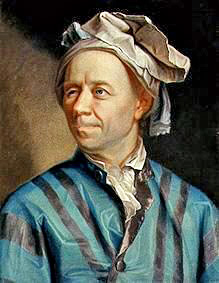
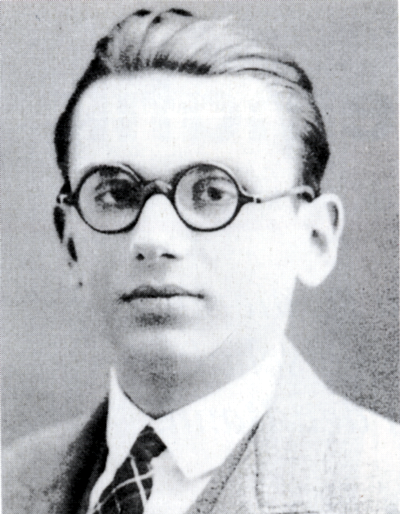

% Matematická výročí LS 2018
% Robert Mařík

Výročí významných osobností souvisejících s předmětem Aplikovaná matematika, která si připomeneme během letního semestru.

Použité zdroje informací: 

* wikipedia (česká, slovenská, německá, anglická), 
* http://www.converter.cz/fyzici
* http://jaderka.fjfi.cvut.cz
* http://www-history.mcs.st-and.ac.uk
* http://www.ceskahlava.cz

# Týden 19.2. až 25.2. (1/2)

**Ernst Mach** (18. února 1838 Brno Chrlice – 19. února 1916) byl rakouský teoretický fyzik, filozof, děkan a rektor německé části Karlovy univerzity.

Ernst Mach patří k nejvýznamnějším osobnostem vědy druhé poloviny
19. století především v oblasti experimentální fyziky. Jeho jménem je
označena řada fyzikálních veličin a pojmů. Jako vědec proslul svou
důkladností, precizností i manuální zručností, svým klidem a jasným,
stručným a výstižným formulováním myšlenek. Jako pedagog a filozof byl
autorem řady učebnic a přehledných kompendií z oblasti fyziky, stál u
zrodu této vědní disciplíny v Čechách v její novodobé podobě.

Na jeho počest uděluje Akademie věd ČR *Čestnou oborovou medaili
Ernsta Macha* v oboru fyzikálních věd.

*Machovo číslo* je hojně užíváno v technické praxi - např. v letectví
se jím jakožto poměrem rychlosti letu k rychlosti zvuku udává rychlost
letu. Vyrobil zařízení, které umožňovalo fotografovat letící kulku a
zároveň zviditelnit i zvukové vlny při průletu projektilu nadzvukovou
rychlostí. Ukázal, že rázová vlna má tvar kužele.

Nikdo před ním ještě nevystoupil s tak ostrou kritikou Newtonových
fyzikálních představ. Kritizoval zejména **absolutní prostor a čas**, nebo
klasické pojetí hmotnosti. Tím inspiroval A. Einsteina.  Být praotcem
relativity ovšem kategoricky odmítl. K Einsteinově teorii měl dokonce
zásadní výhrady.

Další Machova kritika patřila atomové hypotéze. Vývoj bohužel ukázal, že
se mýlil.  Podle jeho vlastních slov však „chyby jedněch lidí bývají
nezřídka ve svých důsledcích plodnější než objevy druhých“.

> Fyzika a mechanika je přirozenou aplikací pro derivace, protože jeden
> ze základních pohybových zákonů obsahuje druhou derivaci. Takto vypadá
> druhý Newtonovův zákon pro tělesa s konstantní hmotností.
> $$m\frac{d^2 \vec r}{dt^2}=\vec F$$

[Wikipedia](http://cs.wikipedia.org/wiki/Ernst_Mach)

# Týden 19.2. až 25.2. (2/2)

**Karl Theodor Wilhelm Weierstraß** (31. října 1815 – 19. února 1897) byl německý matematik, často nazýván jako „otec moderní matematické analýzy“.

Weierstrass podal přesnou definici pojmu limita a spojitost, zabýval
se problematikou konvergence nekonečné řady funkcí, kompaktností
metrického prostoru (posloupnost racionálních čísel může konvergovat i
k číslu, které není racionální).

Weierstrass udal příklad matematické funkce, která je ve všech bodech
spojitá, ale v žádném bodě nemá derivaci. Její graf tedy nejde
nakreslit - ani jedním tahem, ani nijak jinak. Funkce se chová jako
fraktál, neboť zvětšené části grafu a původní graf jsou podobné. (Již
dříve podal jiný příklad funkce s takovými vlastnostmi český matematik
Bernard Bolzano, Weistrastrassova funkce však je známější než
Bolzanova.)

Analytické vyjádření Weistrastrassovy funkce je překvapivě pěkné:
$$f(x)=\sum_{n=0} ^\infty a^n \cos(b^n \pi x)$$
kde
$0<a<1$, $b$ jsou kladná lichá čísla a platí
$$ab > 1+\frac{3}{2} \pi.$$

> S faktem, že v podstatě skoro každá prakticky zajímavá funkce se dá
> zapsat jako lineární kombinace hladkých sinusovek resp. kosinusovek,
> se setkáme na konci semestru u Fourierova rozvoje funkcí.

# Týden 26.2. až 4.3.  (1/2)

**Georg Ferdinand Ludwig Philipp Cantor** 
(3. března 1845 Petrohrad až 6. ledna, 1918 Halle), byl významný německý
matematik a logik.

Definoval reálná čísla!

Zakladel teorie množiny. Studoval "škaredé" množiny (např. Cantorovo
diskontinuum), dnes zahrnuté mezi fraktály.

Dokázal větu dnes pojmenovanou po něm, která říká, že (silně
zjednodušeno) množina všech podmnožin dané množiny obsahuje více prvků
než původní množina. To je celkem zřejmé pro konečné množiny, ale
revolučnost této věty je v tom, že platí i pro nekonečné množiny. V
konečném důsledku to znamená, že existuje více nekonečen než jedno.
Dokázal větu, že počet bodů na úsečce je „stejný“ jako počet bodů ve
čtverci resp. v krychli jakékoli (spočetné) dimenze. Je to natolik
paradoxní tvrzení, že i sám Cantor se svému důkazu podivoval a napsal
Dedekindovi: Vidím to před sebou, ale nemohu tomu uvěřit.

# Týden 26.2. až 4.3.  (2/2)

**Christel Hamann**
(27. února 1870 až 9. června 1948) německý inženýr.

* sestrojil hned několik konstrukčně odlišných komerčně úspěšných kalkulátorů, které dokázaly samočinně dělit,
* sestrojil první kalkulátor který dokázal všechny čtyři základní aritmetické operace provádět plně automaticky, bez zásahu uživatele (Mercedes Euklid)
* sestrojil kalkulátor velice kompaktního provedení, který později sloužil jako předobraz prvního (a jediného) kapesního mechanického kalkulátoru (Curta vynálezce Curta Herzstarka).

# Týden 5.3. až 11.3.  (1/3)

**Urbain Jean Joseph Le Verrier** (11. března, 1811 – 23. září, 1877)
  byl francouzský matematik, který se zabýval nebeskou mechanikou.

Celosvětové slávy se dočkal po propočítání přesných souřadnic místa,
kde by se měla nacházet osmá planeta sluneční soustavy – Neptun.

Byl to obrovský úspěch vědy. Podařilo se předpovědět planetu
teoreticky a poté byla tato planeta opravdu nalezena.

*Wikipedie:* Největším Le Verrierovým úspěchem byla matematická předpověď existence
a výpočet pozice v té době neznámé planety Neptun, jež provedl na
základě astronomických pozorování a výpočtů Alexise Bouvarda. Do této
práce se pustil z podnětu tehdejšího ředitele pařížské hvězdárny
Françoise Araga. Jako podklad mu posloužila pouze
matematická a astronomická pozorování oběžné dráhy tehdy poslední
známé planety naší sluneční soustavy Uranu. Na dlouhé měsíce se Le
Verrier ponořil do složitých výpočtů, jež měly vysvětlit malé, avšak
neustále se opakující nesrovnalosti mezi Newtonovým gravitačním
zákonem a Bouvardovým pozorováním oběžné dráhy Uranu.

# Týden 5.3. až 11.3.  (2/3)

**Vannevar Bush** (11. března 1890 – 30. června 1974) byl americký
vědec, státní úředník, vizionář, profesor MIT, viceprezident MIT a
děkan z jedné fakult.

V roce 1927 zkonstruoval analyzátor diferenciálních rovnic --
mechanický počítač na řešení diferenciálních rovnic a jejich soustav.

[Video 1](https://youtu.be/TQj3PsSDoUo), [Video 2](https://youtu.be/hIinz4fKGpo)

Účastnil se projektu Manhattan.  Patřil mezi nejvlivnější vědce ve
Spojených státech amerických. Byl tak významný, že o něm tehdy jeden z
vědců prohlásil: „Z mužů, jejichž smrt by pro USA byla v létě 1940
největší katastrofou, by byl na prvním místě pan prezident a
Dr. Vannevar Bush na místě druhém či třetím.“

V roce 1945 navrhl projekt zařízení Memex, fungujícího na princípu
hypertextu. Tím se zařadil mezi vizionáře, kteří nastínili funkci
dnešního Internetu.

# Týden 5.3. až 11.3.  (3/3)

**George Gamow** (4. března 1904 – 20. srpna 1968) byl americký fyzik
  původem z Ukrajiny. Zabýval se kvantovou mechanikou, atomovou a
  jadernou fyzikou, astrofyzikou a kosmologií. Koncem 40.let také
  předpověděl, že by celý vesmír mělo rovnoměrně vyplňovat chladné
  mikrovlnné záření, které je pozůstatkem prvotního výbuchu. Jeho
  revoluční myšlenka: ,,Náš vesmír je vlastně obrovská exploze, která
  pokračuje dodnes!" Jako první přišel s teorií vzniku vesmíru, kterou
  jeho odpůrce Hoyle posměšně označil jako „velký třesk“.

George Gamow byl velkým popularizátorem moderní fyziky a vědy vůbec. V
zimě roku 1938 napsal krátkou, vědecko-fantastickou povídku, v níž se
pokoušel populárně vysvětlit základní myšlenky teorie zakřiveného
prostoru a expandujícího vesmíru. V povídce se rozhodl zvětšit
existující relativistické efekty do takové míry, aby je mohl snadno
pozorovat hrdina povídky C.G.H. Tompkins, bankovní úředník zajímající
se o moderní vědu (iniciály pana Tompkinse vznikly ze tří základních
fyzikálních konstant – rychlosti světla c, gravitační konstanty G a
Planckovy kvantové konstanty h).

Tak se v časopise Discovery objevila řada povídek o panu Tompkinsovi,
v nichž byla popularizována teorie relativity a kvantová teorie. V
roce 1940 vydavatelství navrhlo Gamowovi, aby články dále rozšířil o
několik dalších povídek a vydal je jako knihu. Kniha vyšla pod názvem
Pan Tompkins v říši divů v roce 1940. Kniha vyšla i v češtině.

# Týden 12.3. až 18.3.

**Albert Einstein** (14. 3. 1879 – 18. 4. 1955) byl teoretický fyzik,
jeden z nejvýznamnějších vědců všech dob. Poté, co zformuloval
obecnou teorii relativity, se stal známým po celém světě, což je pro
vědce nevídaný úspěch. V pozdějších letech jeho sláva zastínila
ostatní vědce a Einstein se stal synonymem pro člověka s velmi vysokou
inteligencí nebo zkrátka génia. 

Nobelovu cenu získal Albert Einstein v roce 1922 za objev zákona
fotoelektrického jevu. I když k tomu Královská švédská akademie
zároveň dodala poněkud neurčité zdůvodnění, které znělo “jako uznání
za práce pro rozvoj teoretické fyziky”, jeho teorie relativity, jeden
z nejbrilantnějších objevů lidského ducha, nikdy Nobelovou cenou
oceněna nebyla.

Jde o jednoho z mála vědců, jehož tvář je slavnější než tvář hereček
či politiků. Není tedy divu, že si Einsteinovo jméno vypůjčují různé
anekdoty, příběhy, legendy. 
Rozšířeným mýtem je, že se Einstein **nedostal na vysokou školu**.
Skutečnost je taková, že se na prestižní švýcarskou vysokou školu
hlásil v patnácti letech, tedy s dvouletým předstihem, což staví jeho
výkon u přijímacího řízení do zcela jiného světla.
Další mýtus tvrdí, že Einstein **propadal z matematiky**. I samotný Einstein se v roce 1935 pobavil, když mu kolega na
Princentonské univerzitě ukázal článek v novinách: "Největší žijící
  matematik propadal z matematiky." 
Původ mýtu o propadajícím Einsteinovi je v odlišném systému známkování
v tehdejší době. Einsteinovo maturitní vysvědčení totiž hodnotí
výborný výsledek šestkou, zatímco jednička je známkou nejhorší.
**Z matematiky, fyziky, geometrie i deskriptivní geometrie měl
  u maturity Einstein šestky, tedy prošel na výbornou.**

<!--

# Týden 20.2. až 26.2.

**Johann Carl Friedrich Gauss** (30. dubna 1777 – 23. února 1855) byl
  slavný německý matematik a fyzik. Zabýval se mimo jiné geometrií,
  matematickou analýzou, teorií čísel, astronomií, elektrostatikou,
  geodézií a optikou. Silně ovlivnil většinu z těchto oborů.

  Svými současníky byl nazýván **kníže matematiků**. Měl spíše
  samotářskou povahu, nevyhledával zábavu ve společnosti, pracoval i
  bydlel na hvězdárně, měl málo přátel, ale vřelá přátelství. Takřka
  necestoval ani po Německu, vedl však velmi rozsáhlou korespondenci.

Gaussem vyvinutá metoda výpočtu eliptických oběžných drah planet mu
umožnila stanovit polohu asteroidu Ceres s takovou přesností, že byl
1. ledna 1802 na nebi nalezen téměř celý rok po tom, co se ztratil
teleskopům pozorovatelů. Tento úspěch se stal neuvěřitelnou senzací a
učinil Gausse známým po celé Evropě jako nejlepšího astronoma v
lidské historii!

Koluje spousta historek o jeho brzké genialitě. Známým příběhem je
epizoda s učitelem J. G. Büttnerem na základní škole, který svým žákům
zadal, aby se pokusili spočítat součet všech čísel od 1 do 100. Mladý
Gauss odpověděl během chvilky, čímž udivil nejen Büttnera, ale i jeho
asistenta Martina Bartelse. Gauss si uvědomil, že sečtením opačných
prvků z řady čísel dostane vždy stejný výsledek: $1 + 100 = 101$, $2 +
99 = 101$, $3 + 98 = 101$, atd., což dohromady dává $50 \times 101 =
5050$.

O všech histrokách z Gaussova života se dá pochybovat, jeho genialita
je však nezpochybnitelná.  Při výpočtech údajně nepoužíval
logaritmické tabulky, protože by jej zdržovaly. Raději logaritmy
počítal z hlavy.

# Týden 27.2. až 5.3. (1/2)

# Týden 27.2. až 5.3. (2/2)

**George Gamow** (4. března 1904 – 20. srpna 1968) byl americký fyzik
  původem z Ukrajiny. Zabýval se kvantovou mechanikou, atomovou a
  jadernou fyzikou, astrofyzikou a kosmologií. Koncem 40.let také
  předpověděl, že by celý vesmír mělo rovnoměrně vyplňovat chladné
  mikrovlnné záření, které je pozůstatkem prvotního výbuchu. Jeho
  revoluční myšlenka: ,,Náš vesmír je vlastně obrovská exploze, která
  pokračuje dodnes!" Jako první přišel s teorií vzniku vesmíru, kterou
  jeho odpůrce Hoyle posměšně označil jako „velký třesk“.

George Gamow byl velkým popularizátorem moderní fyziky a vědy vůbec. V
zimě roku 1938 napsal krátkou, vědecko-fantastickou povídku, v níž se
pokoušel populárně vysvětlit základní myšlenky teorie zakřiveného
prostoru a expandujícího vesmíru. V povídce se rozhodl zvětšit
existující relativistické efekty do takové míry, aby je mohl snadno
pozorovat hrdina povídky C.G.H. Tompkins, bankovní úředník zajímající
se o moderní vědu (iniciály pana Tompkinse vznikly ze tří základních
fyzikálních konstant – rychlosti světla c, gravitační konstanty G a
Planckovy kvantové konstanty h).

Tak se v časopise Discovery objevila řada povídek o panu Tompkinsovi,
v nichž byla popularizována teorie relativity a kvantová teorie. V
roce 1940 vydavatelství navrhlo Gamowovi, aby články dále rozšířil o
několik dalších povídek a vydal je jako knihu. Kniha vyšla pod názvem
Pan Tompkins v říši divů v roce 1940. Kniha vyšla i v češtině.

# Týden 14.3. až 20.3.

# Týdny 20.3. až 3.4. (1/2)

**Isaac Newton** (25. 12. 1642 – 20.3. 1727 v Londýně - bráno podle
  kalendáře platného v Newtonově době, 31.3. 1727 podle současného
  kalendáře) byl anglický
  fyzik, matematik, astronom, přírodní filosof, alchymista a teolog,
  jenž bývá často považován za jednu z nejvlivnějších osob v dějinách
  lidstva. Jeho publikace Philosophiæ Naturalis Principia Mathematica,
  vydaná v roce 1687, položila základy klasické mechaniky a dnes bývá
  řazena mezi nejdůležitější knihy v historii vědy. Newton v ní
  popisuje zákon všeobecné gravitace a tři zákony pohybu, které se na
  další tři staletí staly základem vědeckého pohledu na fyzický
  vesmír. Newton propojil Keplerovy zákony pohybu planet s vlastní
  teorií gravitace a dokázal, že pohyb předmětů na Zemi se řídí
  stejnými pravidly jako pohyb vesmírných těles.

Úspěšně vedl anglickou Královskou společnost, jež se stala v jeho době
nejprestižnější vědeckou institucí světa.

## Druhý Newtonův zákon (zákon síly)

*Jestliže na těleso působí síla, pak se těleso pohybuje se zrychlením, které je přímo úměrné působící síle a nepřímo úměrné hmotnosti tělesa.*

Obecněji bývá zákon síly vyjadřován tak, že síla $\vec{F}$ je rovna
časové změně hybnosti $\vec{p}$, což lze matematicky vyjádřit jako
$\vec{F}=\frac{\mathrm{d} \vec{p}}{\mathrm{d}t}$. Protože
$\vec{p}=m\vec{v}$, $m$ je v newtonovské fyzice konstantní a $\vec{v}=\frac{\mathrm{d}\vec r}{\mathrm {d}t}$, dostáváme
$\vec{F}=m\frac{\mathrm{d^2} \vec{r}}{\mathrm{d}t^2}=m\ddot{\vec{r}}$. 

# Týden 20.3. až 3.4. (2/2)

Dne 1. dubna 1952 byl podán patent US2736494 A na kalkulátor, který uměl
plně automaticky počítat druhou odmocninu. Naprosto udivil svět, do té
doby se odmocnina počítala velmi komplikovaně a zdlouhavě opakovaným
odečítáním a využitím vztahu
$$\sum_{i=1}^n (2i-1)=n^2,$$
který říká, že součet prvních $n$ lichých čísel je roven $n^2$. 

Kalkulátor Friden je krátce k vidění ve filmu Skrytá čísla (do kin květen
2017).

Friden SRW ve skutečnosti počítal odmocninu také zdlouhavě a postupným
odečítáním, ale pracoval plně automaticky a počítal podle vztahu
$$\sum_{i=1}^n (10i-5)=5n^2,$$ tj. používal pětinásobek výše uvedeného
vzorce. Důvod je ten, že posloupnost $$1,\ 3,\ 5,\ 7,\ 9,\ 11,\ 13,\
15,\ 17,\ 19$$ je komplikovanější, než její pětinásobky $$5,\ 15,\ 25,\
35,\ 45,\ 55,\ 65,\ 75,\ 85,\ 95.$$

# Týden 3.4. až 9.4. 

**Niels Henrik Abel** (5. srpna 1802 – 6. dubna 1829) byl norský
matematik, který významně ovlivnil teorii funkcí a teorii grup. Známý
je svým důkazem nemožnosti obecného řešení rovnic pátého stupně pomocí
vzorců s odmocninami. Významných výsledků dosáhl během pouhých šesti
let svého produktivního života.

(zdroj: Wikipedie)

# Týden 10.4. až 16.4.

**Leonhard Paul Euler** 
(15. dubna 1707 Basilej, Švýcarsko – 18. září 1783 Petrohrad, Rusko)
byl švýcarský matematik a fyzik. Je považován za nejlepšího matematika
18. století a za jednoho z nejlepších matematiků vůbec. Eulerův vliv
na matematiku vyjadřuje výrok připisovaný Pierru Simonu de Laplaceovi:
*„Čtěte Eulera, čtěte Eulera, je to učitel nás všech.“*

Eulerovo dílo nemá v matematice obdoby. Napsal 865 prací, od
jednotlivých pojednání po rozsáhlé učebnice. Jeho díla se vyznačují
přesným vyjadřováním a přehlednou symbolikou - dnešní způsob značení
matematických pojmů je téměř stejný jako Eulerův.

Jako první použil pojem „imaginární číslo“ pro druhou odmocninu ze
záporného čísla. Zavedl například označení $f(x)$ pro funkci.

Jeho a Fermatovy práce s obrovskými prvočísly (v té době pro praktické
aplikace nepoužitelné) jsou dnes základem alogritmů pro bezpečnou komunikaci
na Internetu.

Během kariéry se Eulerovi zhoršil zrak, ke konci života byl téměř
slepý.  Jeho slepota neměla ale téměř žádný vliv na jeho produktivitu,
kompenzoval ji svými počtářskými schopnostmi a fotografickou pamětí.

-->

<!--

# Týden 20.3. až 27.3. (2/2)

**Pál Erdős** (26.března 1913 - 20.září 1996), křestní jméno někdy
uváděné Paul, je jeden ze světově nejproslulejších matematiků
20. století. Proslavil se (kromě své excentričnosti a neustálých
přesunů mezi různými výzkumnými institucemi po celém světě) především
rozsáhlými objevy v oborech teorie grafů, kombinatorika, teorie množin
a teorie pravděpodobnosti.

Paul Erdős patřil do skupiny známých maďarsko-židovských fyziků a
matematiků z Budapešti. Patřili sem i Leo Szilárd, Edward Teller, John
von Neumann a Eugene Paul Wigner. Jejich američtí kolegové je kvůli
jakoby „nadpozemským“ schopnostem nazývali „The Martians“ (Marťani).

Většinu života strávil Erdős cestováním z místa na místo mezi
matematickými konferencemi a domovy svých spolupracovníků (**My brain
is open!**) Obvykle se zdržel pouze na dobu nutnou k vyřešení
problému, na kterém zrovna pracoval (**We'll continue tomorrow — if I
live.**) za podpory obrovského množství kávy(Alfréd Rényi: **A
mathematician is a machine for turning coffee into theorems**), a
přesunul se opět jinam (**Another roof, another proof.**).

Napsal 1500 článků, vetšinou se spoluautory, kterých bylo 511. Jeho
způsob práce a fakt, že stovky matematiků po celém světě jsou
podepsáni pod různými články a výsledky jako jeho spoluautoři, se stal
nesmrtelný zavedením pojmu Erdősovo číslo. (Paul Erdős má erdősovo
číslo 0, jeho spoluautoři 1, spoluautoři jeho spoluautorů 2 atd.)
Existuje odhad, že 90 procent aktivních matematiků má Erdösovo číslo
menší než 8. 

Kvůli své naprosté nesamostatnosti nebyl snadným hostem a manželky
matematiků bývaly zpravidla po těch několika dnech pečování o Paula
totálně vyčerpané. Stejně tak bývali vyčerpaní i jeho kolegové,
protože P. Erdös příliš mnoho nespal, časně ráno už svého hostitele
budil nesnesitelným rámusem v kuchyni či koupelně a ohlašoval tím
nástup k další intenzivní práci.

Vytvořil svůj speciální jazyk - "erdöštinu" - který se ujal v
matematických kruzích po celém světě. Komunisté byli *people on the
long wavelength*, protože červené světlo má dlouhou vlnovou
délku. Také měl speciální termín pro děti a vše malé *epsilon*, pro
ženy *bosses* a pro muže *slaves*, pro hudbu *noise* a pro alkohol
*poison*. *Give me an epsilon of poison* byla žádost o kapku vína.

Spojovalo jej velmi silné pouto s matkou. Jeho dvě sestry totiž
zemřely na spálu, když byla matka s malým Paulem v porodnici. Matka se
ze ztráty nikdy nevzpamatovala a o Paula se vždy přehnaně bála. Není
divu, že byl nesamostatný. Traduje se, že si až do 11 let neuměl
zavázat tkaničky a že si poprvé namazal chleba máslem v Anglii na
svých doktorských studiích.

Dá se říci, že P.  Erdös zasvětil matematice život: neměl ženu ani
děti a říkával, že majetek je na obtíž (cestoval s otrhaným kufrem
naplněným sotva z třetiny a oranžovou igelitkou budapešťského
obchoďáku Centrum Áruház). Vysloužil si tím přezdívku "matematický
mnich".

[Victor Dricks, Matematický mnich: žije jen pro čísla — Erdös je považován za největšího ve svém oboru](http://dml.cz/bitstream/handle/10338.dmlcz/138900/PokrokyMFA_37-1992-5_6.pdf)

-->

<!--

# Týden 28.3. až 3.4. (1/2)

**Lev Davidovič Landau** (22. ledna 1908 – 1. dubna 1968) byl sovětský
fyzik, který přispěl k rozvoji mnoha oblastí teoretické fyziky.  V
roce 1962 obdržel Nobelovu cenu za fyziku za svou práci v oboru
supratekutosti.  Specialista na fyziku pevných látek a fyziku nízkých
teplot, dále na teoretické problémy jaderné fyziky a kosmického
záření.

*http://21stoleti.cz/blog/2007/08/17/trpke-osudy-nositelu-nobelovych-cen/*: 
Vztahy mezi ním a jeho studenty jsou
naprosto neformální, přátelské a kolegiální. Jistě o tom svědčí i ta
skutečnost, že mu říkají familiérně jen Dau. On to ví a nic
nenamítá. Vlastně není o mnoho starší než oni.

*http://www.techmania.cz*: Lev Landau byl velmi náročným
pedagogem. Mezi studenty byl pravým postrachem. Uznával pouze dvě
známky – výborně a nedostatečně. Vytvořil tzv. **Landauovu bariéru**,
systém deseti neobyčejně náročných zkoušek z teoretické fyziky,
přičemž pravděpodobnost jejího proniknutí byla pouze v řádu
procent. Za celou jeho pedagogickou činnost jí prošlo jen 43 (40. byl
český fyzik Josef Kvasnica), zato vynikajících uchazečů. „**Chráním
vědu před invazí blbů.**“ prohlásil Landau, když vyházel téměř celý
ročník u zkoušky.

Tečku za jeho nadějnou a vskutku ojedinělou kariérou velkého vědce a
milého člověka udělala dopravní nehoda po níž byl na pomezí klinické
smrti (zlomenina spodiny lebeční, prasklá žebra zlomená pánev). Z
celého světa se k jeho lůžku tehdy sjížděli nejlepší
neurochirurgové. Všichni plni vůle a odhodlání zachránit život a
navrátit zdraví jednomu z největších titánů vědy.

V nemocnici v prosinci 1962 přijal od švédského velvyslance medaili a
diplom Nobelovy ceny. Poprvé byla cena předávána mimo území Švédska či
Norska. Tak velká to je úcta a zároveň míra soucitu s mužem, který
nemůže opustit nemocniční pokoj a přitom si doslova zaslouží světla
ramp.

*Ukázka Landauova humoru:* Na vědecké konferenci, kde sovětský biolog
Trofim Lysenko představoval své názory (tehdy prosazované režimem)
představoval svoje názory, se ho Landau po ukončení přednášky zeptal:
„Takže vy tvrdíte, že když krávě uřežeme ucho, a jejím potomkům také,
dříve nebo později se začnou rodit krávy bez uší?“ „Správně,“ –
odpověděl Lysenko. A Landau na to: „Tak mi prosím vysvětlete, proč se
stále ještě rodí panny?“

## Další výročí

* Stefan Banach (narozen 30. března 1892)
* Rene Descartes (narozen 31. března 1596)

# Týden 4.4. až 10.4.

**Joseph-Louis Lagrange** 
(25. ledna 1736 – 10. dubna 1813) byl italsko-francouzský matematik a
astronom, který významně rozvinul matematickou analýzu, teorii čísel,
a klasickou a nebeskou mechaniku. Je zakladatelem oblasti matematiky
nazývané variační počet.

Lagrangeův bod je v nebeské mechanice takový bod v soustavě dvou těles
rotujících kolem společného těžiště, v němž se vyrovnávají gravitační
a odstředivé síly soustavy. Dva Lagrangeovy body soustavy Slunce-Země
které jsou blízko Země lze dobře využít pro umístění stacionárních
družic pro pozorování vesmíru. V jednom je umístěna kosmická sonda
SOHO, ve druhém kosmický dalekohled Planck a Herschelova vesmírná
observatoř.

Metoda variace konstant při řešení diferenciálních rovnic je někdy
nazývána Lagrangeovou metodou (použil ji však již dříve Euler).

## Euler-Lagrangeova rovnice (citace z [Wikipedie](http://cs.wikipedia.org/wiki/Eulerova-Lagrangeova_rovnice))
Je zadána tzv. Lagrangeova funkce  $F$ tří proměnných, která má spojité první parciální derivace, do níž je dosazena funkce $y(x)$,
 $$ F \left( x, y(x), y'(x) \right).$$

Aby funkce $y(x)$ představovala extrémálu funkcionálu $J$,
$$J = \int_a^b F(x, y(x), y'(x)) \, \mathrm{d}x,$$
musí být funkce $y(x)$ řešením následující obyčejné diferenciální rovnice zvané *Eulerova-Lagrangeova rovnice*.
$$ \frac{\partial F}{\partial y} - \frac{\mathrm{d}}{\mathrm{d}x} \frac{\partial F}{\partial y'} = 0 $$

**Příklad:** Výraz $J = \int_0^1 \left[ y'(x)^2 + 12 x y(x) \right] \,
  \mathrm{d}x$ je minimální, pokud funkce $y$ splňuje rovnici $12x - 2y'' = 0$.
-->

<!--
# Týden 18.4. až 21.4.

**Max Karl Ernst Ludwig Planck** (23. dubna 1858 Kiel – 4. října 1947 Göttingen) byl německý fyzik, považovaný za jednoho ze zakladatelů kvantové teorie.

Roku 1899 objevil základní fyzikální konstantu, dnes nazývanou
Planckova konstanta. Téhož roku popsal sadu tzv. Planckových jednotek,
udávající přirozená měřítka času, prostoru a hmotnosti. O rok později
pak objevil správný zákon vyzařování černého tělesa – průlomový článek
v Annalen der Physik vyšel roku 1901. Pro vysvětlení zákona vyzařování
formuloval hypotézu kvantování energie oscilátorů. (Skutečný dosah
myšlenky kvantování si ovšem uvědomil teprve Albert Einstein o pět let
později, postuloval kvantování energie elektromagnetického pole a
touto teorií okamžitě vysvětlil fotoelektrický jev.)

Zdroj: Wikipedie

-->

<!-- 

# Týden 24.4. až 30.5.

**Kurt Gödel** (28. dubna 1906, Brno – 14. ledna 1978, Princeton, USA)
byl matematik rakouského původu, který se stal jedním z
nejvýznamnějších logiků všech dob. Významné jsou i jeho příspěvky ve
fyzice a ve filosofii matematiky.

V roce 1931 publikoval dvě věty o neúplnosti axiomatických formálních
systémů s aritmetikou. Prostřednictvím těchto vět ukázal, že není
možné navrhnout soubor axiomů, které by byly dostačující pro
zodpovězení každé otázky, kterou lze klást a formulovat uvnitř
formálního systému s aritmetikou. Tyto věty ukončily více než
padesátileté úsilí logiků a matematiků úplně formalizovat matematiku: vždy zůstanou nedokazatelná tvrzení a navíc není možno uvnitř axiomatického systému dokázat jeho  bezespornost.

Gödelův výsledek znamenal zlom v matematice 20. století, neboť ukázal, že v principu nikdy nebude možné sestrojit počítač a program, který by zodpověděl všechny matematické otázky.

Jako docent a později profesor na Institutu pokročilých studií v
Princetonu se intenzivně věnoval filosofii a pod vlivem Alberta
Einsteina, svého tamějšího blízkého přítele, i fyzice. 
Originálním způsobem obohatil Einsteinovu obecnou teorii relativity
formulováním a nalezením kosmologického modelu rotujícího vesmíru
umožňujícího **cestování časem**. Otevřel tak dodnes neuzavřené diskuse o
tom, zda takové cestování neodporuje fyzikálním či filozofickým
principům, popř. zda by mohlo být technicky realizováno.

Stal se legendou pro své objevy a vyhledávanou osobou, od níž se
očekávaly další převratné výsledky. To nemělo dobrý vliv na plachého,
uzavřeného a pečlivého až puntičkářského samotáře, kterým se postupně
stal. Chatrné zdraví, traumatizující
zážitky z období nacismu i tlak na výkon člověka s pověstí génia se
podepsaly na jeho psychosomatických potížích, které se stářím a
odchodem vrstevníků a blízkých přátel prohlubovaly.

-->

<!--

# Týden 2.5. až 9.5. (1/2)

**Richard Phillips Feynman** (11.5.1918 - 15.2.1988) americký fyzik,
nositel Nobelovy ceny, profesor Caltechu (California Institute of
Technology, prestižní americké univerzity).

Pro celé generace studentů Caltechu reprezentoval Feynman mnohem víc
než symbol velkého fyzika a mimořádného učitele. Byl milovníkem žertů,
vášnivým hráčem na bongo, vtipálkem, recesistou, jenž s oblibou
přednášel o tom, jak otevírat zámky a dostávat se pak do sejfů.

Richard Feynman se stal legendou své doby. Přicházel na originální
řešení a nové způsoby fyzikálního pohledu. Historickou se stala jeho
přednáška *There's Always Room at the Bottom* (*Tam dole je spousta
místa*) z roku 1959, při níž své kolegy šokoval otázkou: "Proč ještě
neumíme zapsat všech dvacet čtyři svazků Encyklopedie Britanniky na
špendlíkovou hlavičku?"  V přednášce Feynman nastínil možnost
manipulace s molekulami a atomy a poprvé přednesl vizi
**nanotechnologie**. Dnes je každoročně udělována Feynmanova cena za
největší přínos v tomto oboru.

Velmi úspěšná byla Feynmanova autobiografie "Surely You're Joking,
Mr. Feynman!" ("[To snad nemyslíte
vážně!](http://www.databazeknih.cz/knihy/to-snad-nemyslite-vazne-91322)"),
která se v době svého vydání v USA dostala na všechny seznamy
bestsellerů. Feynman zde s laskavým humorem vzpomíná na léta, kdy
studovat na MIT, na své působení v Los Alamos kde pracoval na vývoji
atomové bomby a také na pozdější roky na Caltechu.

Na sklonku svého života Feynman sehrál významnou úlohu v oficiální
komisi pro vyšetřování katastrofy raketoplánu Challenger. Způsob, jak
v televizním vysílání názorně předvedl vliv nízkých teplot na ztrátu
pružnosti těsnění nádrže raketoplánu pomocí sklenice vody s ledem, byl
skvělou ukázkou jeho fenomenální schopnosti vysvětlit složité problémy
co nejjednodušším způsobem a udělal z něj mediální hvězdu.

Richard Feynman dával rád následující radu, jak se stát géniem. Měli byste neustále
udržovat ve své mysli tucet svých oblíbených problémů, i když je většinou necháte
ve stavu dřímoty. Pokaždé když uslyšíte nebo si přečtete nový trik nebo výsledek,
vyzkoušejte jej na každém z vašich dvanácti problémů, zdali to nějak pomůže. Cas od
času se skutečně strefíte a lidé pak budou říkat: „Jak to udělal? Musí to být génius."

zdroje: http://www.techmania.cz, Pokroky matematiky, fyziky a astronomie, Vol. 34 (1989) 

# Týden 2.5. až 9.5. (2/2)

## Jaroslav Kurzweil

**Jaroslav Kurzweil** (* 7. května 1926) je český matematik zabývající se především teorií obyčejných diferenciálních rovnic. 
Je nositelem národní ceny vlády Česká hlava 2006.

Prof. Kurzweil je tvůrcem jednoho z nejuznávanějších příspěvků české
matematiky matematice světové. Je jím součtová definice neabsolutně
konvergentního integrálu, kterou poprvé uvedl v r. 1957. Dnes se tento
integrál nazývá Henstock-Kurzweilův integrál.

Prof. Kurzweil svým integrálem pomohl k řešení otázky, co se děje s
fyzikálními systémy při rychlých nárazech, které mají odlišný směr.
To pomohlo při praktických řešeních u složitých staveb a strojů.
Zhruba po čtyřiceti letech po Kurzweilově objevu se začíná jeho pojem
integrálu naplno prosazovat a výzkum a aplikace Kurzweilova integrálu
se stávají důležitou součástí matematické analýzy.

## Další výročí: 
Gaspard Monge, Albert Abraham Michelson ("Všechny důležité fyzikální zákony a skutečnosti už jsme objevili. Jsou tak pevně dokázány, že je prakticky nemožné, aby byly nahrazeny jinými... Naše další objevy už budou spočívat pouze ve zpřesňování čísel někde na šestém místě za desetinnou čárkou.")

# Týden 10.5. až 16.5.

**Jean Baptiste Joseph Fourier** (21.3.1768 – 16.5.1830) byl
francouzský matematik a fyzik, který se nejvíce proslavil zkoumáním
Fourierových řad a jejich aplikací k problémům toků tepla. Objevitel
skleníkového efektu (1824).  Fourier je jedním ze 72 významných mužů,
jejichž jméno je zapsáno na Eiffelově věži v Paříži.

Použil jako první dnešní zápis určitých integrálů. Dbal na to, že u
všech vytahů ve fyzice musí být v pořádku fyzikální jednotky,
podstatně rozpracoval metody rozměrové analýzy.

*Hypothyroidismus:* Zúčastnil se spolu s dalšími vědci Napoleonova
tažení do Egypta. Tam začal trpět extrémní citlivostí na chlad, což
působí paradoxně s jeho pracemi o vedení tepla.

-->

<!--

# Další

## Pierre François Verhulst 

(28. 10. 1804 – 15.2.1849) 

## Georg Ferdinand Ludwig Philipp Cantor 

(3. března 1845 Petrohrad, 6. ledna, 1918 Halle), byl významný německý
matematik a logik.  Definoval reálná čísla!  Dokázal větu dnes
pojmenovanou po něm, která říká, že (silně zjednodušeno) množina všech
podmnožin dané množiny obsahuje více prvků než původní množina. To je
celkem zřejmé pro konečné množiny, ale revolučnost této věty je v tom,
že platí i pro nekonečné množiny. V konečném důsledku to znamená, že
existuje více nekonečen než jedno.  Dokázal větu, že počet bodů na
úsečce je „stejný“ jako počet bodů ve čtverci resp. v krychli jakékoli
(spočetné) dimenze. Je to natolik paradoxní tvrzení, že i sám Cantor
se svému důkazu podivoval a napsal Dedekindovi: Vidím to před sebou,
ale nemohu tomu uvěřit.

## Daniel Bernoulli 

(8. 2. 1700 - 17. 3. 1782) byl v Nizozemí narozený švýcarský fyzik a
matematik, zakladatel hydrodynamiky. Je jedním z členů rodiny
významných švýcarských matematiků a fyziků, syn Johanna
Bernoulliho. Při studiu horizontálních kmitů volně zavěšené nitě
vyřešil tzv. Besselovu diferenciální rovnici nultého řádu – jednu z
prvních diferenciálních rovnic, která nemá řešení v množině
elementárních funkcí (řešení se hledá například ve tvaru součtu
nekonečné řady funkcí).

## Norbert Wiener 

**Norbert Wiener** (26. listopadu 1894 – 18. března 1964) byl americký
  matematik, který je považován za zakladatele kybernetiky.

Norbert Wiener se narodil v coloradské Columbii v rodině polského
emigranta Lea Wienera, profesora slovanských jazyků na Harvardově
univerzitě. Jeho dětství a mládí nese všechny atributy života
„zázračného dítěte“, byť trpícího silnou krátkozrakostí: vědecké knihy
začal číst ve čtyřech letech, v devíti začal studovat střední školu,
ve čtrnácti se obdržel první stupeň akademické hodnosti, tedy
bakaláře, a v osmnácti byl na Tuftsově koleji Harvardovy univerzity
promován na doktora filozofie. S tímto titulem odjíždí díky stipendiu
pro mimořádné talenty za oceán, aby pokračoval ve studiu na anglické
Cambridge, kde se jeho učitelem stává věhlasný matematik a filozof
Bernard Russell. Díky jeho vlivu se Norbert rozhoduje, že se bude
věnovat filozofii matematiky.

Je považován za „otce kybernetiky“, nauky zkoumající abstraktní
principy komplexních systémů a způsoby přenosu a zpracování
informací. Jeho teorie zásadním způsobem ovlivnila nejen IT.

 Na cestách jej provázela pověst geniálního matematika stejně jako
 poněkud roztržitého pošetilce, jenž čas od času kvůli svému
 matematickému zaujetí nedokáže věnovat pozornost všedním drobnostem
 života. Byl považován za originálního myslitele a pohotového
 debatéra, který sice dokáže bravurně formulovat řešení jakkoli
 složitého problému, ale zároveň si nepamatuje, jakou barvu má jeho
 auto. Není se co divit, že historky o jeho roztržitosti se staly
 proslulými. Částečně byla důsledkem jeho špatného zraku, který mu
 znesnadňoval prostorovou orientaci, částečně vycházela z
 neobyčejného zaujetí, jež věnoval matematickým a filozofickým
 problémům.

Cesta ke kybernetice je ale nemálo klikatá. Své místo v ní mají i
nevědecké události Weinerova života, například manželství s Němkou
žijící v Americe Margaret Engemannovou, učitelkou jazyků, která,
máme-li to říci bez obalu, měla lví podíl na tom, že Wiener neskončil
v ústavu pro choromyslné. Wienerova nepraktičnost a roztržitost je
tučným soustem pro jeho životopisce.  (Martin Ludvík v seriálu
„Legendy 20. století“ uvádí tuto úsměvnou příhodu: Weinerovi se měli
stěhovat z jednoho konce Cambridge na druhý. Margaret měsíc před
stěhováním upozorňuje svého muže, že až půjde z univerzity, nenastoupí
do autobusu A, ale do autobusu B. Když se přestěhují, znovu mu to
připomíná. Profesor je s tím , zdá se, srozuměn. Když však odchází z
fakulty, nastupuje samozřejmě do áčka, dojíždí domů a nachází byt
prázdný. Vzpomene si na manželčina slova, vrací se ke škole a
nastupuje do správného autobusu, do béčka. Když vystoupí, nové
prostředí ho zcela zaskočí. Za žádnou cenu nemůže najít, kde teď
bydlí. Bloudí až do setmění. Celý zoufalý nakonec zastavuje
kolemjdoucí dívku a ptá se jí, zda náhodou neví, kde tady bydlí
Wienerovi. Dívka se usmála a odpověděla: „Ahoj, tati. Pojď, odvedu tě
domů.“)

## Christian Goldbach

 (18.3.1690 – 20.11.1764)

## Évariste Galois (25. 10. 1811 – 31. 5. 1832)

-->